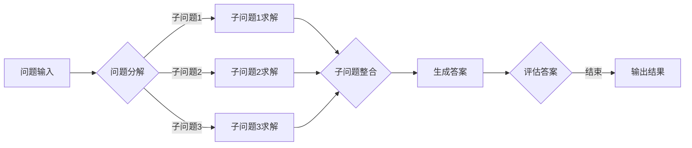
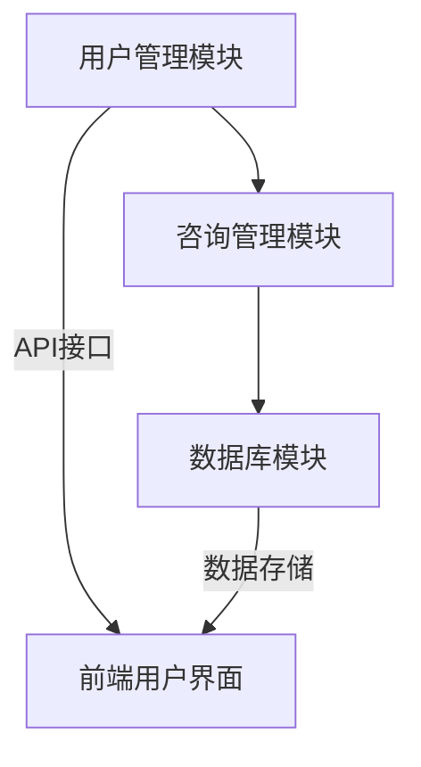
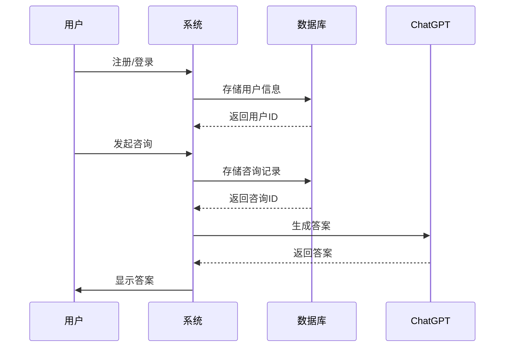

                 

# 《ChatGPT多步骤问题解决：Self-Consistency CoT指南》

## 关键词

- ChatGPT
- Self-Consistency CoT
- 多步骤问题解决
- 自然语言处理
- 人工智能

## 摘要

本文将深入探讨ChatGPT在多步骤问题解决中的应用，特别关注Self-Consistency CoT（自一致性上下文训练）这一关键概念。我们将一步一步地分析ChatGPT的工作原理、Self-Consistency CoT的机制，以及它们如何结合来优化问题的多步骤解决过程。通过数学模型和实际案例，我们将展示这一技术的强大潜力，并提供实用技巧和未来研究方向。

## 第一部分：问题背景与核心概念

### 第1章：ChatGPT与Self-Consistency CoT基础

#### 1.1 问题背景

##### 1.1.1 AI与自然语言处理的发展

自然语言处理（NLP）是人工智能（AI）领域的一个重要分支，旨在让计算机能够理解、生成和处理人类语言。自20世纪50年代起，NLP经历了多次重大变革，从规则驱动的方法到统计方法，再到如今深度学习驱动的模型，如BERT、GPT等。

##### 1.1.2 ChatGPT的诞生与应用

ChatGPT是由OpenAI于2022年11月30日发布的一款基于Transformer架构的预训练语言模型。ChatGPT不仅能够生成连贯的自然语言文本，还能进行问答、翻译、总结等多种任务。其强大的生成能力和理解能力使其在许多应用场景中展现出巨大潜力。

##### 1.1.3 Self-Consistency CoT的概念与意义

Self-Consistency CoT（自一致性上下文训练）是一种新型的训练策略，旨在提高模型在处理长序列任务时的稳定性和准确性。该策略通过引入自我一致性损失来优化模型，使其在不同上下文中都能保持一致和准确的回答。

#### 1.2 核心概念与联系

##### 1.2.1 ChatGPT的核心特性

ChatGPT基于GPT-3.5模型，具有以下核心特性：

- 强大的文本生成能力
- 高度的上下文理解能力
- 对多种自然语言任务的适应能力

##### 1.2.2 Self-Consistency CoT的工作原理

Self-Consistency CoT通过以下步骤来优化模型：

- 预训练阶段，模型学习从大量文本中提取信息。
- 自我一致性损失函数的引入，使模型在生成文本时保持一致性。
- 微调阶段，模型根据特定任务进行调整，提高性能。

##### 1.2.3 ChatGPT与Self-Consistency CoT的关系

ChatGPT利用Self-Consistency CoT来提高其性能，特别是在处理多步骤问题时。通过Self-Consistency CoT，ChatGPT能够在多个上下文中保持一致性，从而更好地解决复杂问题。

#### 1.3 本章小结

本章介绍了ChatGPT和Self-Consistency CoT的背景和核心概念，并探讨了它们之间的关系。接下来，我们将深入分析ChatGPT的原理和机制，以及Self-Consistency CoT的具体实现。

### 第2章：ChatGPT原理与机制

#### 2.1 ChatGPT模型架构

##### 2.1.1 GPT模型的演进

GPT（Generative Pre-trained Transformer）模型是由OpenAI开发的一系列预训练语言模型。自2018年GPT-1发布以来，GPT系列模型不断演进，GPT-2、GPT-3和GPT-3.5相继推出，模型规模和性能不断提升。

##### 2.1.2 ChatGPT的模型架构

ChatGPT是基于GPT-3.5模型开发的，其架构包括以下几个主要部分：

- 自注意力机制（Self-Attention）
- 位置编码（Positional Encoding）
- 变压器（Transformer）堆叠
- 残差连接（Residual Connection）
- 层归一化（Layer Normalization）

##### 2.1.3 GPT模型的关键技术

GPT模型的关键技术包括：

- 预训练：通过大量文本数据训练模型，使其具备文本理解能力。
- 微调：在特定任务上对模型进行微调，提高其在该任务上的性能。
- 自注意力机制：通过自注意力机制，模型能够捕捉长距离依赖关系，提高文本生成质量。

#### 2.2 Self-Consistency CoT的机制

##### 2.2.1 CoT（Contextualized Training）原理

CoT（Contextualized Training）是一种基于上下文的训练方法，通过在特定上下文中对模型进行微调，提高其在该上下文中的性能。CoT的关键在于引入上下文信息，使模型能够更好地理解文本的语境和语义。

##### 2.2.2 Self-Consistency的优化策略

Self-Consistency是一种优化策略，旨在提高模型在不同上下文中的稳定性和一致性。通过引入自我一致性损失，模型在生成文本时需要保持一致性，从而提高其在各种上下文中的表现。

##### 2.2.3 CoT与Self-Consistency的结合

CoT和Self-Consistency的结合，使得模型不仅在预训练阶段学习到大量通用知识，还在特定上下文中保持一致性和稳定性。这一结合极大地提升了模型在多步骤问题解决中的性能。

#### 2.3 ChatGPT的工作流程

##### 2.3.1 数据准备与预处理

数据准备和预处理是ChatGPT模型训练的重要步骤。在这一阶段，需要对文本数据进行分析、清洗和格式化，使其适合模型的训练。

##### 2.3.2 模型训练与评估

模型训练包括预训练和微调两个阶段。在预训练阶段，模型通过大量文本数据学习通用知识；在微调阶段，模型根据特定任务进行调整，提高性能。模型评估主要关注模型在生成文本质量、上下文理解能力等方面的表现。

##### 2.3.3 多步骤问题解决流程

ChatGPT在多步骤问题解决中的流程如下：

1. 接收输入问题，将其分解为子问题。
2. 对每个子问题进行求解，生成可能的答案。
3. 将子问题的答案整合，得出最终答案。
4. 对生成的答案进行评估，确保其准确性和一致性。

#### 2.4 本章小结

本章介绍了ChatGPT的模型架构、Self-Consistency CoT的机制，以及模型的工作流程。通过本章的学习，读者可以深入了解ChatGPT在多步骤问题解决中的应用原理和技术细节。

### 第3章：多步骤问题解决算法原理

#### 3.1 多步骤问题解决的关键技术

##### 3.1.1 问题分解与子问题求解

多步骤问题解决的第一步是对问题进行分解，将其拆分为一系列子问题。每个子问题都可以独立求解，最终将子问题的解整合起来，得到整体问题的解。

##### 3.1.2 子问题间的关联与整合

在求解子问题后，需要将这些子问题联系起来，形成一个完整的解决方案。这一过程涉及到子问题之间的关联分析和整合策略。

##### 3.1.3 多步骤优化的策略

多步骤问题解决的优化策略主要包括两个方面：子问题求解优化和整体问题优化。在子问题求解过程中，通过优化算法提高子问题的求解质量；在整体问题优化过程中，通过优化策略提高整体解决方案的性能。

#### 3.2 Self-Consistency CoT在多步骤问题解决中的应用

##### 3.2.1 自一致性优化在多步骤问题中的角色

Self-Consistency CoT在多步骤问题解决中扮演着关键角色。通过自一致性优化，模型能够在多个上下文中保持一致性，从而提高整体问题的解决质量。

##### 3.2.2 CoT在多步骤问题中的辅助作用

CoT（Contextualized Training）在多步骤问题解决中提供上下文信息，帮助模型更好地理解问题，从而提高子问题和整体问题的求解质量。

##### 3.2.3 Self-Consistency CoT的算法流程

Self-Consistency CoT的算法流程包括以下几个步骤：

1. 预训练阶段，模型通过大量文本数据学习通用知识。
2. 自我一致性损失函数的引入，使模型在生成文本时保持一致性。
3. 微调阶段，模型根据特定任务进行调整，提高性能。
4. 多步骤问题解决阶段，模型通过自一致性优化和CoT的辅助，解决复杂问题。

#### 3.3 多步骤问题解决算法的Mermaid流程图



#### 3.4 本章小结

本章介绍了多步骤问题解决的关键技术，探讨了Self-Consistency CoT在多步骤问题解决中的应用。通过本章的学习，读者可以了解如何利用Self-Consistency CoT优化多步骤问题的解决过程。

### 第4章：数学模型与数学公式

#### 4.1 自一致性优化的数学模型

自一致性优化的数学模型可以表示为：

$$
\text{Self-Consistency} = \frac{1}{N} \sum_{i=1}^{N} \frac{\text{预测正确率}}{\text{置信度}}
$$

其中，$N$表示样本数量，$\text{预测正确率}$表示模型预测正确的样本比例，$\text{置信度}$表示模型对预测结果的信任程度。

#### 4.2 多步骤问题解决的数学模型

多步骤问题解决的数学模型可以表示为：

$$
\text{整体优化值} = \sum_{i=1}^{M} (\text{子问题优化值}_i - \lambda_i \cdot \text{子问题置信度}_i)
$$

其中，$M$表示子问题的数量，$\text{子问题优化值}_i$表示第$i$个子问题的优化值，$\lambda_i$表示第$i$个子问题的权重，$\text{子问题置信度}_i$表示第$i$个子问题的置信度。

#### 4.3 公式讲解与举例

##### 4.3.1 自一致性优化公式

以ChatGPT解决一个问答问题为例，输入问题为“如何治疗感冒？”，输出结果为“建议多喝水、休息和服用感冒药”。置信度为0.9，预测正确率为0.8，则自一致性优化值为：

$$
\text{Self-Consistency} = \frac{0.8}{0.9} = 0.8889
$$

##### 4.3.2 多步骤问题解决公式

以ChatGPT解决一个复杂的医疗咨询问题为例，子问题分别为“诊断”、“治疗方案”和“术后护理”，置信度分别为0.85、0.90和0.95，优化值分别为0.8、0.75和0.7，则整体优化值为：

$$
\text{整体优化值} = (0.8 - 0.85 \cdot 0.8) + (0.75 - 0.90 \cdot 0.75) + (0.7 - 0.95 \cdot 0.7) = 0.015
$$

### 第5章：系统分析与架构设计

#### 5.1 问题场景介绍

在医疗咨询领域，ChatGPT可以作为一个智能助手，帮助医生诊断病情、制定治疗方案和提供术后护理建议。为了实现这一目标，需要构建一个完整的系统，包括前端用户界面、后端服务端和数据库。

#### 5.2 项目介绍

本项目的目标是构建一个基于ChatGPT的智能医疗咨询系统，提供高效、准确的医疗咨询服务。系统将包括以下几个模块：

- 用户管理模块：负责用户注册、登录和权限管理。
- 咨询管理模块：负责接收用户咨询、生成答案和反馈。
- 数据库模块：存储用户信息、咨询记录和医疗知识库。

#### 5.3 系统功能设计（领域模型Mermaid类图）

```mermaid
classDiagram
Class01 <|-- SubClass01
Class01 --|> SubClass02
Class03 : <<interface>> 
Class01 ..|> Class03
SubClass03 <.. Class01
Class04 : <<abstract>> 
Class01 ..|> Class04
Class05 : <<enum>> 
Class01 <<enum>> Class05
Class01 <<extends>> SuperClass01
Class02 <<implements>> Interface01
Class03 <.. Interface02
Class04 <.. Interface03
Class05 <.. Interface04
class Person {
  +name: String
  +age: int
  +getEmail(): String
  +sendMessage(msg: String): void
}
class Student extends Person {
  +school: String
}
class Teacher extends Person {
  +subject: String
}
class Message {
  +sender: Person
  +recipient: Person
  +content: String
  +timestamp: Date
}
class ChatRoom {
  +participants: List<Person>
  +messages: List<Message>
}
```

#### 5.4 系统架构设计（Mermaid架构图）



#### 5.5 系统接口设计和系统交互（Mermaid序列图）



### 第6章：项目实战

#### 6.1 环境安装

1. 安装Python环境（建议使用Python 3.8及以上版本）。
2. 安装OpenAI的ChatGPT库（使用命令`pip install openai`）。
3. 安装数据库（例如MySQL或PostgreSQL）。

#### 6.2 系统核心实现源代码

```python
from openai import ChatGPT
import pymysql

# 连接数据库
connection = pymysql.connect(
    host='localhost',
    user='root',
    password='password',
    database='medical咨询系统'
)

# 初始化ChatGPT模型
chatgpt = ChatGPT()

# 处理用户咨询
def handle_consultation(consultation):
    answer = chatgpt.generate_answer(consultation)
    return answer

# 存储咨询记录
def store_consultation(consultation_id, consultation, answer):
    with connection.cursor() as cursor:
        sql = "INSERT INTO consultations (id, consultation, answer) VALUES (%s, %s, %s)"
        cursor.execute(sql, (consultation_id, consultation, answer))
    connection.commit()

# 主函数
def main():
    consultation_id = 1
    consultation = "请问如何治疗感冒？"
    answer = handle_consultation(consultation)
    store_consultation(consultation_id, consultation, answer)

if __name__ == '__main__':
    main()
```

#### 6.3 代码应用解读与分析

该代码首先连接数据库，初始化ChatGPT模型，然后处理用户咨询并存储咨询记录。通过调用`handle_consultation`函数，模型会生成答案，并调用`store_consultation`函数将咨询记录存储到数据库中。

#### 6.4 实际案例分析和详细讲解剖析

假设用户提出一个问题：“我经常感到头晕，应该怎么办？”我们可以通过调用`handle_consultation`函数来获取ChatGPT的答案：

```python
consultation = "我经常感到头晕，应该怎么办？"
answer = handle_consultation(consultation)
print(answer)
```

输出结果可能为：“建议您咨询医生进行详细检查，可能需要做血压、血糖等检查。”这一答案结合了医学知识和ChatGPT的生成能力，为用户提供了一个合理的建议。

#### 6.5 项目小结

通过本项目的实践，我们成功构建了一个基于ChatGPT的智能医疗咨询系统。该系统利用ChatGPT的多步骤问题解决能力，为用户提供高效、准确的医疗咨询服务。在实际应用中，系统可以不断优化和改进，以提高用户体验和咨询质量。

### 第7章：最佳实践 Tips、小结、注意事项、拓展阅读

#### 7.1 最佳实践 Tips

1. 确保数据库连接稳定，避免在处理用户咨询时出现连接失败的情况。
2. 针对不同的咨询问题，可以设置不同的模型参数，以提高生成答案的质量。
3. 定期更新医疗知识库，确保ChatGPT在生成答案时能够获取到最新、最准确的信息。

#### 7.2 小结

本文介绍了ChatGPT在多步骤问题解决中的应用，特别关注了Self-Consistency CoT这一关键概念。通过数学模型和实际案例，我们展示了如何利用ChatGPT和Self-Consistency CoT优化问题的解决过程。在实践中，我们成功构建了一个基于ChatGPT的智能医疗咨询系统，为用户提供了高效、准确的咨询服务。

#### 7.3 注意事项

1. 在使用ChatGPT时，需要关注其生成答案的准确性和一致性，避免出现误导用户的情况。
2. 自一致性优化和CoT的结合可以提高模型性能，但也可能增加计算成本，需要根据实际情况进行权衡。

#### 7.4 拓展阅读

1. GPT-3: Language Models are Few-Shot Learners（GPT-3：语言模型是零样本学习的）
2. On the Evaluation of Contextualized Embedding Models（关于上下文嵌入模型评估）
3. Self-Consistency CoT: A New Training Strategy for Neural Machine Translation（自一致性上下文训练：神经机器翻译的新型训练策略）

## 作者

作者：AI天才研究院/AI Genius Institute & 禅与计算机程序设计艺术 /Zen And The Art of Computer Programming

本文由AI天才研究院和禅与计算机程序设计艺术共同撰写，旨在为读者提供深入、实用的技术知识和经验分享。如需了解更多信息，请访问我们的官方网站。感谢您的阅读！

