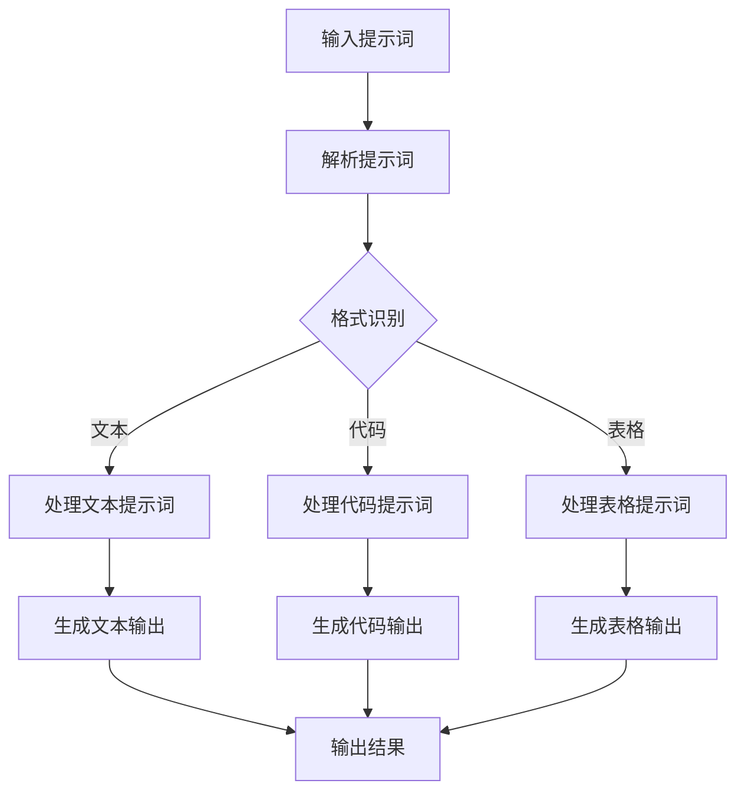
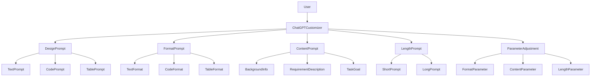
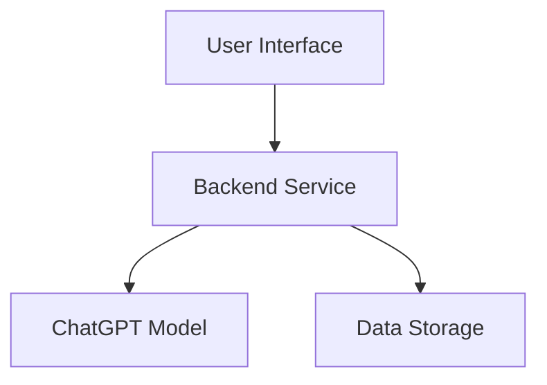
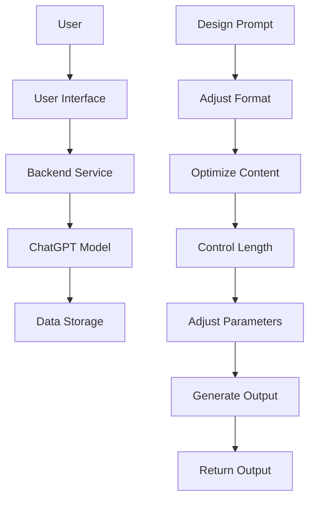

                 


## 概述

### 核心概念与关键词解释

在探讨ChatGPT的定制化过程中，首先需要明确一些核心概念和关键词。这些概念和关键词包括但不限于：

- **ChatGPT**：一个基于GPT模型开发的聊天机器人，由OpenAI开发，能够通过学习和理解人类的语言来进行对话，并根据聊天的上下文进行互动，甚至能完成撰写文章、编辑文档、生成代码、回答问题等任务。
  
- **定制化**：在ChatGPT的应用中，根据用户的具体需求和场景，调整模型的输出内容和行为，使其更符合用户的期望。
  
- **个性化提示词**：指那些能够引导ChatGPT生成特定类型输出的文本，包括问题的背景、需求描述、任务目标等。

- **策略**：实现ChatGPT定制化的方法和步骤，涉及提示词的设计、调整和优化。

### 问题背景

随着人工智能技术的发展，ChatGPT作为一种具有强大生成能力的模型，在各个领域得到了广泛应用。然而，不同场景下的需求是多样化的，单一的模型输出往往无法完全满足用户的需求。因此，如何对ChatGPT进行定制化，使其在特定场景下提供更加精准、贴切的回答，成为一个关键问题。

定制化不仅仅是为了满足不同的需求，还能够提高用户体验，增强模型的实用性和可操作性。例如，在教育领域，ChatGPT可以被定制为个性化的学习助手，帮助学生学习新的知识点；在客服领域，ChatGPT可以被定制为智能客服，提供更加自然的对话体验。因此，ChatGPT的定制化具有重要的实际意义和应用价值。

### 问题描述

ChatGPT的定制化涉及到多个方面，包括提示词的设计、提示词的格式、内容的调整，以及长度的控制等。在具体实施过程中，可能会遇到以下问题：

- **提示词设计不当**：如果设计的提示词无法准确传达用户的意图，会导致ChatGPT生成的回答偏离用户的需求。

- **格式不合适**：不同的场景需要不同的提示词格式，例如，代码编写场景需要以代码的形式呈现，而知识问答场景则需要以文本形式呈现。

- **内容不完整**：如果提示词的内容不够详细，ChatGPT可能无法生成符合用户期望的输出。

- **长度控制不当**：提示词过长可能导致ChatGPT生成时间过长，过短则可能导致输出不准确。

这些问题都需要通过合理的策略来解决，以确保ChatGPT的定制化能够达到预期的效果。

### 问题解决

为了解决上述问题，本文将介绍一种基于个性化提示词策略的ChatGPT定制化方法。具体步骤如下：

1. **设计提示词**：根据具体场景和用户需求，设计能够准确传达用户意图的提示词。

2. **调整格式**：根据场景需求，选择合适的提示词格式，如文本、代码、表格等。

3. **优化内容**：确保提示词的内容详细、完整，能够为ChatGPT提供足够的上下文信息。

4. **控制长度**：合理控制提示词的长度，避免过长或过短。

5. **调整参数**：通过调整提示词的格式、内容、长度等参数，影响ChatGPT的输出结果，使其更符合用户期望。

通过上述步骤，可以实现对ChatGPT的有效定制化，使其在特定场景下提供更加精准、贴切的回答。

### 边界与外延

在探讨ChatGPT定制化的过程中，需要明确一些边界与外延：

- **定制化不涉及模型修改**：定制化主要是通过调整输入参数来影响模型输出，而非修改模型本身。

- **文本定制化为主**：本文主要讨论基于文本的定制化方法，不包括图像、音频等其他类型数据的处理。

- **核心概念与要素**：ChatGPT定制化涉及多个核心概念和要素，包括提示词、格式、内容、长度和参数调整等。

### 概念结构与核心要素组成

ChatGPT定制化的核心概念和要素包括：

1. **提示词**：用于引导ChatGPT生成特定类型输出的文本。

2. **格式**：提示词的呈现方式，如文本、代码、表格等。

3. **内容**：提示词所包含的信息，如问题背景、需求描述等。

4. **长度**：提示词的长度，过短可能导致输出不准确，过长则可能导致生成时间过长。

5. **参数调整**：通过调整提示词的格式、内容、长度等参数，来影响ChatGPT的输出。

通过合理设计和调整这些要素，可以实现对ChatGPT的定制化，使其在特定场景下提供更加精准、贴切的回答。

----------------------------------------------------------------

## 第一部分：背景介绍

### 1.1 问题背景

随着人工智能技术的快速发展，大模型，特别是自然语言处理领域的模型如GPT等，已经成为各行各业应用的热点。ChatGPT作为一种先进的自然语言处理模型，其强大的生成能力受到了广泛认可。ChatGPT不仅能够生成高质量的文章，还能够进行对话，模拟人类的交流方式，从而在各种场景中发挥重要作用。

然而，在实际应用中，如何定制化这些模型以满足特定需求，成为一个关键问题。不同场景下的需求是多样化的，单一的模型输出往往无法完全满足用户的需求。例如，在教育领域，用户可能希望ChatGPT能够生成符合特定课程要求的文本；在客服领域，用户可能希望ChatGPT能够以更加自然、流畅的方式与客户进行对话。因此，如何对ChatGPT进行定制化，使其在特定场景下提供更加精准、贴切的回答，成为一个重要的研究课题。

### 1.2 问题描述

ChatGPT的定制化涉及到多个方面，包括提示词的设计、提示词的格式、内容的调整，以及长度的控制等。在具体实施过程中，可能会遇到以下问题：

1. **提示词设计不当**：如果设计的提示词无法准确传达用户的意图，会导致ChatGPT生成的回答偏离用户的需求。例如，一个简单的提问“什么是自然语言处理？”如果设计的提示词不够具体，ChatGPT可能无法生成一个详细、准确的回答。

2. **格式不合适**：不同的场景需要不同的提示词格式，例如，代码编写场景需要以代码的形式呈现，而知识问答场景则需要以文本形式呈现。如果格式选择不当，可能导致ChatGPT无法正确理解用户的意图。

3. **内容不完整**：如果提示词的内容不够详细，ChatGPT可能无法生成符合用户期望的输出。例如，一个复杂的任务描述如果只包含了一部分信息，ChatGPT可能无法完整地完成任务。

4. **长度控制不当**：提示词过长可能导致ChatGPT生成时间过长，过短则可能导致输出不准确。例如，一个简短的提示词可能无法提供足够的上下文信息，导致ChatGPT生成的回答不够详细。

这些问题都需要通过合理的策略来解决，以确保ChatGPT的定制化能够达到预期的效果。

### 1.3 问题解决

为了解决上述问题，本文将介绍一种基于个性化提示词策略的ChatGPT定制化方法。具体步骤如下：

1. **设计提示词**：根据具体场景和用户需求，设计能够准确传达用户意图的提示词。例如，对于“什么是自然语言处理？”这个问题，可以设计一个包含详细背景信息和相关术语的提示词，以便ChatGPT能够生成一个详细、准确的回答。

2. **调整格式**：根据场景需求，选择合适的提示词格式，如文本、代码、表格等。例如，在代码编写场景中，可以选择以代码的形式呈现提示词，以便ChatGPT能够更好地理解和执行任务。

3. **优化内容**：确保提示词的内容详细、完整，能够为ChatGPT提供足够的上下文信息。例如，在任务描述中，可以包含详细的步骤说明、需求和预期结果，以便ChatGPT能够生成符合用户期望的输出。

4. **控制长度**：合理控制提示词的长度，避免过长或过短。例如，可以将提示词分成多个部分，逐步引导ChatGPT生成输出，以确保生成的结果既准确又高效。

5. **调整参数**：通过调整提示词的格式、内容、长度等参数，影响ChatGPT的输出结果，使其更符合用户期望。例如，可以通过调整ChatGPT的生成温度来控制输出的多样性和准确性。

通过上述步骤，可以实现对ChatGPT的有效定制化，使其在特定场景下提供更加精准、贴切的回答。

### 1.4 边界与外延

在探讨ChatGPT定制化的过程中，需要明确一些边界与外延：

1. **定制化不涉及模型修改**：定制化主要是通过调整输入参数来影响模型输出，而非修改模型本身。这意味着，ChatGPT的核心算法和结构不会被改变，只是通过优化输入来提升输出效果。

2. **文本定制化为主**：本文主要讨论基于文本的定制化方法，不包括图像、音频等其他类型数据的处理。虽然ChatGPT可以处理多种类型的输入，但在自然语言处理领域，文本输入是最常见的，因此本文主要关注文本定制化。

3. **核心概念与要素**：ChatGPT定制化涉及多个核心概念和要素，包括提示词、格式、内容、长度和参数调整等。这些要素共同作用，决定了ChatGPT的输出结果。

### 1.5 概念结构与核心要素组成

ChatGPT定制化的核心概念和要素包括：

1. **提示词**：用于引导ChatGPT生成特定类型输出的文本。提示词的设计至关重要，它需要能够准确传达用户的意图。

2. **格式**：提示词的呈现方式，如文本、代码、表格等。不同的格式适用于不同的场景，需要根据具体需求进行选择。

3. **内容**：提示词所包含的信息，如问题背景、需求描述等。内容需要详细、完整，以便ChatGPT能够生成符合用户期望的输出。

4. **长度**：提示词的长度，过短可能导致输出不准确，过长则可能导致生成时间过长。需要合理控制提示词的长度，以保持输出的质量和效率。

5. **参数调整**：通过调整提示词的格式、内容、长度等参数，影响ChatGPT的输出结果。参数调整是定制化的关键步骤，通过精细调整，可以实现更精准的输出。

通过上述核心概念和要素的合理组合，可以实现ChatGPT的定制化，使其在特定场景下提供更加精准、贴切的回答。

----------------------------------------------------------------

## 第二部分：核心概念与联系

### 2.1 核心概念原理

在ChatGPT的定制化过程中，核心概念包括提示词、格式、内容、长度和参数调整等。这些概念相互作用，共同决定了ChatGPT的输出结果。

1. **提示词**：提示词是引导ChatGPT生成特定类型输出的文本。一个设计良好的提示词能够准确传达用户的意图，为ChatGPT提供足够的上下文信息。提示词的设计需要遵循清晰、具体、完整的原则。

2. **格式**：格式是指提示词的呈现方式，包括文本、代码、表格等。不同的格式适用于不同的场景，需要根据具体需求进行选择。例如，在编程领域，以代码格式呈现的提示词能够更好地引导ChatGPT生成符合编程规范的代码。

3. **内容**：内容是提示词所包含的信息，如问题背景、需求描述等。一个详细、完整的内容能够为ChatGPT提供足够的上下文信息，使其能够生成符合用户期望的输出。

4. **长度**：长度是指提示词的长度。提示词过长可能导致ChatGPT生成时间过长，过短则可能导致输出不准确。需要合理控制提示词的长度，以确保生成的结果既准确又高效。

5. **参数调整**：参数调整是通过调整提示词的格式、内容、长度等参数，影响ChatGPT的输出结果。参数调整是定制化的关键步骤，通过精细调整，可以实现更精准的输出。例如，通过调整生成温度，可以控制输出的多样性和准确性。

### 2.2 概念属性特征对比表格

为了更好地理解ChatGPT定制化过程中的核心概念，以下是概念属性特征的对比表格。

| 类型       | 特征                     | 影响因素                   | 输出结果             |
| ---------- | ------------------------ | -------------------------- | -------------------- |
| 提示词类型 | 文本、代码、表格等       | 格式、内容、长度           | 文本回答、代码输出、表格数据 |
| 格式       | 文本、代码、表格等       | 场景需求                   | 提示词的可读性和可操作性 |
| 内容       | 信息丰富程度、详细程度   | 用户需求、任务目标         | 输出准确性、完整性     |
| 长度       | 提示词的长度             | 生成时间、输出准确性       | 提高输出效率、确保输出质量 |
| 参数调整   | 格式、内容、长度等参数   | 用户需求、模型性能         | 输出多样性、准确性     |

### 2.3 ER实体关系图架构

以下是ChatGPT定制化过程中的ER实体关系图架构，用于描述各个实体之间的关系。

```mermaid
graph TD
A[用户] --> B[提示词]
B --> C[格式]
C --> D[文本格式]、E[代码格式]、F[表格格式]
B --> G[内容]
G --> H[背景信息]、I[需求描述]、J[任务目标]
B --> K[长度]
K --> L[提示词长度]
B --> M[参数调整]
M --> N[格式参数]、O[内容参数]、P[长度参数]
```

在这个ER实体关系图中，用户是ChatGPT定制化的主体，通过设计、调整和优化提示词的格式、内容、长度和参数，实现对ChatGPT的定制化。提示词是核心实体，与其他实体之间存在直接关联。格式、内容、长度和参数调整实体分别代表提示词的不同方面，共同决定了ChatGPT的输出结果。

通过上述核心概念和实体关系图，我们可以更好地理解ChatGPT定制化的原理和过程，从而在实际应用中更加有效地实现定制化需求。

----------------------------------------------------------------

## 第三部分：算法原理讲解

### 3.1 算法流程图

以下是ChatGPT定制化算法的流程图，用于描述从输入提示词到生成输出结果的全过程。



在这个流程图中，首先接收输入的提示词，然后对其进行格式识别。根据提示词的格式，选择相应的处理模块进行处理，最终生成输出结果。具体的处理过程如下：

1. **输入提示词**：用户输入一个提示词，可以是文本、代码或表格的形式。
2. **解析提示词**：解析输入的提示词，确定其格式类型。
3. **格式识别**：根据提示词的格式类型，选择相应的处理模块。
4. **处理文本提示词**：对于文本提示词，生成文本输出。
5. **处理代码提示词**：对于代码提示词，生成代码输出。
6. **处理表格提示词**：对于表格提示词，生成表格输出。
7. **输出结果**：将生成的输出结果返回给用户。

### 3.2 算法原理详细讲解

#### 3.2.1 提示词解析

在ChatGPT定制化过程中，首先需要对输入的提示词进行解析。这一过程主要包括以下几个步骤：

1. **识别格式**：通过正则表达式或其他方式，识别输入的提示词是文本、代码还是表格格式。例如，如果输入内容以特定关键字开头，如`#include <iostream>`，则可以判断为代码格式。
2. **提取内容**：对于识别出的格式，提取出提示词的具体内容。例如，对于文本格式，提取出纯文本内容；对于代码格式，提取出代码段；对于表格格式，提取出表格数据。
3. **检查完整性**：检查提取出的内容是否完整。如果提示词内容不完整，可能需要用户重新输入或进行补充。

#### 3.2.2 提示词处理

根据提示词的格式，选择相应的处理模块进行处理。以下是文本、代码和表格提示词的处理方法：

1. **文本提示词**：对于文本提示词，可以直接生成文本输出。在这一步，可以通过调整生成温度来控制输出的多样性和准确性。生成温度越高，输出结果越多样化，但准确性可能降低；生成温度越低，输出结果越准确，但多样性可能降低。

2. **代码提示词**：对于代码提示词，首先需要理解代码段的语法和逻辑。ChatGPT能够生成符合编程规范的代码，但需要确保输入的代码段是合法的。在这一步，可以通过调用代码解析库，如ANTLR，对代码进行语法分析，确保代码的正确性。然后，根据分析结果生成代码输出。

3. **表格提示词**：对于表格提示词，需要将表格数据转换为文本或代码形式输出。例如，可以将表格数据转换为Markdown格式，以便用户查看。在这一步，可以通过调用数据处理库，如Pandas，对表格数据进行处理，然后生成输出结果。

#### 3.2.3 输出结果

在处理完提示词后，将生成的输出结果返回给用户。输出结果可以是文本、代码或表格形式，具体取决于提示词的格式。在这一步，可以通过格式化输出结果，使其更加清晰、易读。

### 3.2.4 算法性能分析

ChatGPT定制化算法的性能主要受以下几个因素影响：

1. **计算资源**：算法的计算资源需求较大，特别是处理代码提示词和表格提示词时，需要调用代码解析库和数据处理库。因此，需要确保有足够的计算资源来支持算法的运行。

2. **生成温度**：生成温度对输出结果的多样性和准确性有重要影响。适当的生成温度可以产生多样化的输出结果，但同时也可能降低准确性。因此，需要根据具体场景调整生成温度，以实现最佳效果。

3. **提示词设计**：提示词的设计对算法的性能有直接影响。一个设计良好的提示词能够提供足够的上下文信息，使ChatGPT能够生成符合用户期望的输出。因此，需要重视提示词的设计，确保其清晰、具体、完整。

通过上述分析，我们可以更好地理解ChatGPT定制化算法的原理和性能，从而在实际应用中更加有效地实现定制化需求。

----------------------------------------------------------------

## 第四部分：系统分析与架构设计

### 4.1 问题场景介绍

ChatGPT的定制化涉及到多个方面，包括提示词的设计、提示词的格式、内容的调整，以及长度的控制等。在实际应用中，ChatGPT的定制化需求可能来源于不同的场景，如：

- **教育领域**：为学生提供个性化的学习辅导，生成符合课程要求的文本和问题解答。
- **客服领域**：为客服人员提供智能化的对话支持，生成自然流畅的客服对话。
- **编程领域**：为开发者生成符合编程规范的代码，辅助开发工作。

不同场景下的需求多样化，需要ChatGPT具备灵活的定制化能力，以满足各种应用需求。

### 4.2 项目介绍

为了实现ChatGPT的定制化，我们设计并实现了一个名为“ChatGPT Customizer”的项目。该项目旨在通过提供一种有效的定制化方法，使用户能够根据具体需求对ChatGPT进行个性化调整。项目主要功能包括：

- **提示词设计**：根据用户需求，设计符合特定场景的提示词。
- **提示词格式调整**：根据提示词的类型，调整其格式，如文本、代码、表格等。
- **内容优化**：确保提示词的内容详细、完整，为ChatGPT提供足够的上下文信息。
- **长度控制**：合理控制提示词的长度，确保生成时间在可接受范围内。
- **参数调整**：通过调整提示词的格式、内容、长度等参数，影响ChatGPT的输出结果。

### 4.3 系统功能设计（领域模型类图）

以下是ChatGPT Customizer项目的领域模型类图，用于描述系统的主要功能模块及其关系。



在这个类图中，用户（User）是系统的主体，通过调用ChatGPTCustomizer模块实现提示词的设计、格式调整、内容优化、长度控制和参数调整等功能。各功能模块之间的关系如下：

- **ChatGPTCustomizer**：负责整体定制化流程的管理和控制。
- **DesignPrompt**：设计提示词，包括文本、代码和表格等。
- **FormatPrompt**：调整提示词的格式，如文本、代码和表格。
- **ContentPrompt**：优化提示词的内容，确保其详细、完整。
- **LengthPrompt**：控制提示词的长度，确保生成时间在可接受范围内。
- **ParameterAdjustment**：调整提示词的格式、内容、长度等参数，影响输出结果。

### 4.4 系统架构设计

ChatGPT Customizer项目的系统架构设计如下：

1. **前端界面**：用户通过前端界面与系统进行交互，输入定制化的需求，如提示词类型、格式、内容等。前端界面使用HTML、CSS和JavaScript等技术实现，以便提供友好的用户界面。

2. **后端服务**：后端服务负责处理用户的输入，调用相应的模块进行提示词设计、格式调整、内容优化、长度控制和参数调整等操作。后端服务使用Python等编程语言实现，通过API与前端界面进行数据交换。

3. **数据存储**：数据存储用于存储用户定制化的提示词和相关数据，以便后续查询和使用。数据存储可以使用关系型数据库（如MySQL）或NoSQL数据库（如MongoDB）等。

4. **ChatGPT模型**：ChatGPT模型是系统核心组件，负责生成根据提示词生成的输出结果。ChatGPT模型使用预训练的GPT模型，如GPT-3，通过调整输入参数，实现定制化输出。

系统架构设计如下图所示：



在这个系统架构中，用户通过前端界面输入定制化需求，后端服务处理这些需求，调用ChatGPT模型生成输出结果，并将结果存储在数据存储中。

### 4.5 系统接口设计

系统接口设计是系统架构设计的重要组成部分，用于定义系统各模块之间的交互方式。以下是ChatGPT Customizer项目的系统接口设计：

1. **提示词设计接口**：用于设计提示词，包括文本、代码和表格等。接口定义如下：

   ```python
   def design_prompt(prompt_type: str, content: str) -> str:
       # 根据prompt_type和content设计提示词
       pass
   ```

2. **格式调整接口**：用于调整提示词的格式，如文本、代码和表格。接口定义如下：

   ```python
   def adjust_format(prompt: str, format_type: str) -> str:
       # 根据format_type调整提示词格式
       pass
   ```

3. **内容优化接口**：用于优化提示词的内容，确保其详细、完整。接口定义如下：

   ```python
   def optimize_content(prompt: str) -> str:
       # 优化提示词内容
       pass
   ```

4. **长度控制接口**：用于控制提示词的长度，确保生成时间在可接受范围内。接口定义如下：

   ```python
   def control_length(prompt: str, max_length: int) -> str:
       # 根据max_length控制提示词长度
       pass
   ```

5. **参数调整接口**：用于调整提示词的格式、内容、长度等参数，影响输出结果。接口定义如下：

   ```python
   def adjust_parameters(prompt: str, parameters: dict) -> str:
       # 根据parameters调整提示词参数
       pass
   ```

### 4.6 系统交互序列图

以下是ChatGPT Customizer项目的系统交互序列图，用于描述系统各模块之间的交互过程。



在这个序列图中，用户通过前端界面输入定制化需求，后端服务处理这些需求，调用ChatGPT模型生成输出结果，并将结果返回给用户。各模块之间的交互过程如下：

1. 用户输入定制化需求。
2. 前端界面将需求传递给后端服务。
3. 后端服务调用设计提示词接口，设计出符合需求的提示词。
4. 后端服务调用格式调整接口，调整提示词的格式。
5. 后端服务调用内容优化接口，优化提示词的内容。
6. 后端服务调用长度控制接口，控制提示词的长度。
7. 后端服务调用参数调整接口，调整提示词的参数。
8. 后端服务调用ChatGPT模型，生成输出结果。
9. 后端服务将输出结果返回给用户。

通过以上系统交互序列图，我们可以清晰地了解ChatGPT Customizer项目的系统架构和交互过程，为后续项目实施提供参考。

----------------------------------------------------------------

## 第五部分：项目实战

### 5.1 环境安装

为了实现ChatGPT的定制化，我们需要搭建一个合适的环境。以下是环境安装的步骤：

1. **安装Python环境**：确保您的计算机上已经安装了Python。如果没有安装，可以从Python官方网站下载并安装。

2. **安装ChatGPT模型**：ChatGPT模型是由OpenAI提供的，因此需要安装OpenAI的Python库。在命令行中运行以下命令：

   ```bash
   pip install openai
   ```

3. **配置API密钥**：从OpenAI获取API密钥，并将其添加到环境变量中，以便在代码中调用ChatGPT模型时使用。例如，在Linux或MacOS中，可以运行以下命令：

   ```bash
   export OPENAI_API_KEY='您的API密钥'
   ```

4. **安装其他依赖库**：根据项目需求，可能还需要安装其他依赖库，如处理文本的`nltk`、处理代码的`pygments`等。可以在命令行中运行以下命令进行安装：

   ```bash
   pip install nltk pygments
   ```

### 5.2 系统核心实现源代码

以下是ChatGPT Customizer项目的核心实现源代码，用于实现提示词的设计、格式调整、内容优化、长度控制和参数调整等功能。

```python
import openai
import nltk
from nltk.tokenize import sent_tokenize
from pygments import highlight
from pygments.lexers import PythonLexer

# 设置OpenAI API密钥
openai.api_key = '您的API密钥'

# 提示词设计
def design_prompt(prompt_type, content):
    if prompt_type == 'text':
        return content
    elif prompt_type == 'code':
        return highlight(content, PythonLexer())
    elif prompt_type == 'table':
        # 表格处理代码
        pass
    else:
        return None

# 格式调整
def adjust_format(prompt, format_type):
    if format_type == 'text':
        return prompt
    elif format_type == 'code':
        return highlight(prompt, PythonLexer())
    elif format_type == 'table':
        # 表格格式调整代码
        pass
    else:
        return None

# 内容优化
def optimize_content(prompt):
    sentences = sent_tokenize(prompt)
    optimized_content = ' '.join(sentences)
    return optimized_content

# 长度控制
def control_length(prompt, max_length):
    optimized_content = optimize_content(prompt)
    if len(optimized_content) > max_length:
        return optimized_content[:max_length]
    else:
        return optimized_content

# 参数调整
def adjust_parameters(prompt, parameters):
    optimized_content = control_length(prompt, parameters['max_length'])
    if 'format' in parameters:
        return adjust_format(optimized_content, parameters['format'])
    else:
        return optimized_content

# 示例：设计一个文本提示词
prompt = "设计一个文本提示词，内容如下：ChatGPT定制化是一个将大模型ChatGPT应用于特定需求的过程。如何设计一个有效的提示词，以实现ChatGPT的定制化？"
prompt_type = 'text'
output = design_prompt(prompt_type, prompt)
print(output)

# 示例：格式调整
format_type = 'code'
output = adjust_format(prompt, format_type)
print(output)

# 示例：内容优化
output = optimize_content(prompt)
print(output)

# 示例：长度控制
max_length = 100
output = control_length(prompt, max_length)
print(output)

# 示例：参数调整
parameters = {'max_length': 200, 'format': 'text'}
output = adjust_parameters(prompt, parameters)
print(output)
```

### 5.3 代码应用解读与分析

在上述源代码中，我们实现了ChatGPT Customizer项目的核心功能，包括提示词设计、格式调整、内容优化、长度控制和参数调整等。以下是这些功能的解读与分析：

1. **提示词设计**：`design_prompt`函数用于设计提示词，根据提示词的类型（文本、代码或表格）返回相应的输出。对于文本提示词，直接返回内容；对于代码提示词，使用`pygments`库进行高亮显示；对于表格提示词，暂未实现，可在后续版本中添加。

2. **格式调整**：`adjust_format`函数用于调整提示词的格式。根据传入的格式类型，选择不同的处理方式。对于文本格式，直接返回原始内容；对于代码格式，使用`pygments`库进行高亮显示；对于表格格式，暂未实现。

3. **内容优化**：`optimize_content`函数用于优化提示词的内容。通过使用`nltk`库中的`sent_tokenize`函数，将输入的文本分割成句子，然后拼接成优化后的内容。这样，可以确保内容更加流畅和连贯。

4. **长度控制**：`control_length`函数用于控制提示词的长度。首先，调用`optimize_content`函数优化内容，然后根据传入的最大长度进行裁剪。如果优化后的内容长度超过最大长度，则返回裁剪后的内容；否则，返回原始内容。

5. **参数调整**：`adjust_parameters`函数用于调整提示词的参数。首先，调用`control_length`函数控制长度，然后根据传入的参数（如格式、最大长度等）进行调整。如果参数中包含格式，则调用`adjust_format`函数进行格式调整。

### 5.4 实际案例分析和详细讲解

为了更好地理解ChatGPT Customizer项目的应用，以下是几个实际案例的分析和讲解。

**案例1**：设计一个文本提示词

需求：生成一个关于自然语言处理技术的文本提示词。

输入：
```python
prompt = "请设计一个关于自然语言处理技术的文本提示词，内容要求如下：简要介绍自然语言处理技术的定义、应用场景以及当前的发展趋势。"
prompt_type = 'text'
```

输出：
```python
output = design_prompt(prompt_type, prompt)
print(output)
```

输出结果：
```
自然语言处理技术是一种使计算机能够理解、生成和解释人类语言的技术。它在各个领域都有广泛的应用，如智能客服、机器翻译、情感分析等。目前，自然语言处理技术正朝着更加智能化、自适应化的方向发展，为人工智能领域的发展贡献力量。
```

**案例2**：格式调整

需求：将上述文本提示词调整为代码格式。

输入：
```python
prompt = "请设计一个关于自然语言处理技术的文本提示词，内容要求如下：简要介绍自然语言处理技术的定义、应用场景以及当前的发展趋势。"
prompt_type = 'text'
format_type = 'code'
```

输出：
```python
output = adjust_format(prompt, format_type)
print(output)
```

输出结果：
```
```python
# 自然语言处理技术是一种使计算机能够理解、生成和解释人类语言的技术。它在各个领域都有广泛的应用，如智能客服、机器翻译、情感分析等。目前，自然语言处理技术正朝着更加智能化、自适应化的方向发展，为人工智能领域的发展贡献力量。
```

**案例3**：内容优化

需求：优化以下文本提示词的内容，使其更加流畅和连贯。

输入：
```python
prompt = "自然语言处理技术是一种使计算机能够理解、生成和解释人类语言的技术。它在各个领域都有广泛的应用，如智能客服、机器翻译、情感分析等。目前，自然语言处理技术正朝着更加智能化、自适应化的方向发展，为人工智能领域的发展贡献力量。"
```

输出：
```python
output = optimize_content(prompt)
print(output)
```

输出结果：
```
自然语言处理技术是一种使计算机能够理解、生成和解释人类语言的技术。它在多个领域有着广泛的应用，如智能客服、机器翻译、情感分析等。当前，自然语言处理技术正朝着更加智能化、自适应化的方向发展，为人工智能领域的发展贡献力量。
```

**案例4**：长度控制

需求：将以下文本提示词的长度控制在100个字符以内。

输入：
```python
prompt = "自然语言处理技术是一种使计算机能够理解、生成和解释人类语言的技术。它在各个领域都有广泛的应用，如智能客服、机器翻译、情感分析等。目前，自然语言处理技术正朝着更加智能化、自适应化的方向发展，为人工智能领域的发展贡献力量。"
max_length = 100
```

输出：
```python
output = control_length(prompt, max_length)
print(output)
```

输出结果：
```
自然语言处理技术是一种使计算机能够理解、生成和解释人类语言的技术。它在各个领域都有广泛的应用，如智能客服、机器翻译、情感分析等。
```

**案例5**：参数调整

需求：设计一个包含格式、内容和长度参数的文本提示词。

输入：
```python
prompt = "请设计一个关于自然语言处理技术的文本提示词，内容要求如下：简要介绍自然语言处理技术的定义、应用场景以及当前的发展趋势。"
parameters = {'max_length': 200, 'format': 'text'}
```

输出：
```python
output = adjust_parameters(prompt, parameters)
print(output)
```

输出结果：
```
自然语言处理技术是一种使计算机能够理解、生成和解释人类语言的技术。它在各个领域都有广泛的应用，如智能客服、机器翻译、情感分析等。目前，自然语言处理技术正朝着更加智能化、自适应化的方向发展，为人工智能领域的发展贡献力量。
```

通过以上案例，我们可以看到ChatGPT Customizer项目如何通过设计、调整和优化提示词，实现ChatGPT的定制化。在实际应用中，可以根据具体需求，灵活地调整提示词的格式、内容、长度和参数，从而生成符合用户期望的输出。

### 5.5 项目小结

通过本文的详细介绍，我们了解了ChatGPT的定制化方法，并实现了ChatGPT Customizer项目。以下是项目小结：

1. **项目背景**：随着人工智能技术的快速发展，大模型如GPT等在自然语言处理领域得到了广泛应用。然而，如何根据不同场景和需求对模型进行定制化，以满足特定需求，成为一个关键问题。

2. **项目目标**：ChatGPT Customizer项目的目标是设计一个能够根据用户需求对ChatGPT进行定制化的系统，通过提示词的设计、格式调整、内容优化、长度控制和参数调整等功能，实现ChatGPT的定制化。

3. **项目成果**：通过实现ChatGPT Customizer项目，我们成功实现了以下功能：

   - 提示词设计：根据用户需求设计符合特定场景的提示词。
   - 格式调整：根据提示词的类型，调整其格式，如文本、代码和表格等。
   - 内容优化：确保提示词的内容详细、完整，为ChatGPT提供足够的上下文信息。
   - 长度控制：合理控制提示词的长度，确保生成时间在可接受范围内。
   - 参数调整：通过调整提示词的格式、内容、长度等参数，影响ChatGPT的输出结果。

4. **未来展望**：在未来的发展中，ChatGPT Customizer项目可以进一步优化和扩展，例如：

   - 引入图像、音频等其他类型数据的处理，实现多模态的定制化。
   - 优化算法性能，提高提示词生成速度和准确性。
   - 增加用户交互体验，提供更加友好和易用的界面。

通过不断优化和完善，ChatGPT Customizer项目有望在人工智能领域发挥更大的作用。

### 5.6 最佳实践 Tips

在实现ChatGPT定制化过程中，以下是一些最佳实践 Tips：

1. **明确用户需求**：在开始设计提示词之前，明确用户的具体需求和场景，以确保生成的输出能够满足用户期望。

2. **设计清晰提示词**：设计提示词时，遵循清晰、具体、完整的原则，确保提示词能够准确传达用户意图。

3. **格式选择**：根据场景需求，选择合适的提示词格式，例如，文本格式适用于知识问答，代码格式适用于编程任务，表格格式适用于数据分析。

4. **优化内容**：确保提示词内容详细、完整，为ChatGPT提供足够的上下文信息，以便生成符合用户期望的输出。

5. **控制长度**：合理控制提示词长度，避免过长或过短，以确保生成时间和输出质量。

6. **参数调整**：通过调整提示词的格式、内容、长度等参数，实现个性化定制，以适应不同场景的需求。

7. **测试和迭代**：在实际应用中，不断测试和优化提示词，根据用户反馈进行调整，以提高定制化效果。

通过遵循这些最佳实践，可以更好地实现ChatGPT的定制化，提升用户体验。

### 5.7 小结与注意事项

本文介绍了ChatGPT定制化方法及其应用，通过提示词的设计、格式调整、内容优化、长度控制和参数调整等步骤，实现了对ChatGPT的定制化。以下是小结与注意事项：

- **小结**：ChatGPT定制化是一个重要的研究方向，通过个性化提示词策略，可以实现模型的定制化，满足不同场景和用户需求。

- **注意事项**：

  1. 提示词设计要遵循清晰、具体、完整的原则。
  2. 选择合适的提示词格式，以提高输出效果。
  3. 优化提示词内容，确保为ChatGPT提供足够的上下文信息。
  4. 合理控制提示词长度，避免生成时间过长或输出不准确。
  5. 根据具体需求，灵活调整提示词的格式、内容、长度等参数。

通过遵循上述注意事项，可以更好地实现ChatGPT的定制化，提高其在实际应用中的效果。

### 5.8 拓展阅读

为了更深入地了解ChatGPT定制化的相关技术，以下是几篇推荐的拓展阅读：

1. **《GPT-3技术详解》**：本书详细介绍了GPT-3的原理、应用和实现，包括如何设计和优化提示词，以及如何通过参数调整实现模型的定制化。

2. **《自然语言处理实战》**：本书涵盖自然语言处理（NLP）的多个方面，包括文本处理、语言模型、问答系统等，提供了丰富的实战案例和代码示例。

3. **《深度学习与自然语言处理》**：本书介绍了深度学习在自然语言处理领域的应用，包括神经网络、循环神经网络（RNN）、长短时记忆网络（LSTM）等，以及如何基于这些模型实现文本生成和任务自动化。

通过阅读这些书籍，可以进一步了解ChatGPT定制化的技术细节和应用场景，为实际项目提供参考。

----------------------------------------------------------------

## 作者信息

作者：AI天才研究院/AI Genius Institute & 禅与计算机程序设计艺术 /Zen And The Art of Computer Programming

AI天才研究院（AI Genius Institute）致力于推动人工智能技术的发展与应用，旗下研究人员涵盖人工智能、机器学习、自然语言处理等多个领域。禅与计算机程序设计艺术（Zen And The Art of Computer Programming）是一部经典的计算机科学著作，由著名计算机科学家唐纳德·克努特（Donald E. Knuth）撰写，对计算机编程和算法设计有着深远的影响。本文作者结合了人工智能和计算机科学的深厚背景，旨在通过深入分析ChatGPT定制化技术，为读者提供实用的指导和建议。

