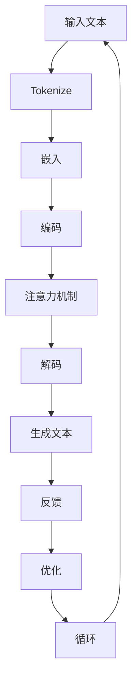
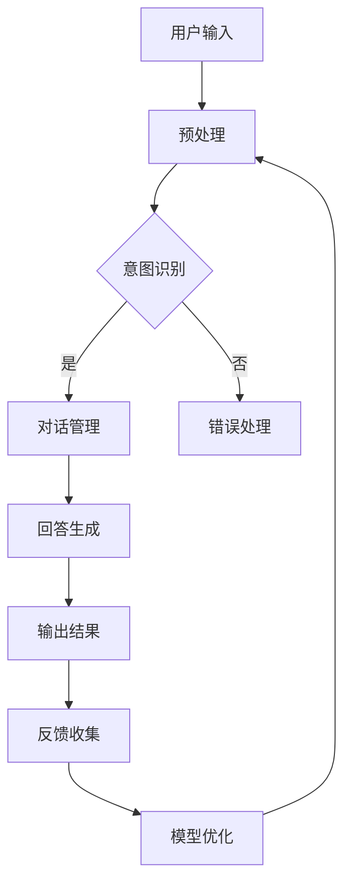
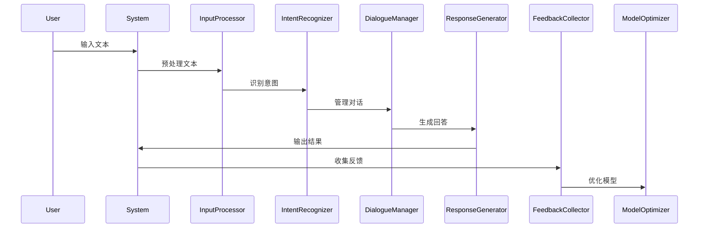

                 

### 背景介绍

#### 第1章: ChatGPT与对话优化概述

##### 1.1 ChatGPT的诞生与发展

ChatGPT是由OpenAI开发的一种基于生成式预训练技术的语言模型。它源自于GPT（Generative Pre-trained Transformer）模型系列，是GPT-3的扩展版本。ChatGPT的发展历程可以追溯到2018年GPT-2的发布，随后OpenAI在2020年发布了GPT-3，这标志着自然语言处理（NLP）领域的一次重大突破。

**发展历程：**
- **2018年：** OpenAI发布了GPT-2，这是一个强大的预训练语言模型。
- **2020年：** OpenAI发布了GPT-3，它具有1750亿个参数，显著提升了模型的性能。
- **2022年：** OpenAI对GPT-3进行升级，推出了ChatGPT，这是一个专门用于对话系统的模型。

**核心技术：**
- **生成式预训练技术：** ChatGPT采用这种技术进行训练，通过在大量文本数据上进行预训练，使其能够生成连贯、自然的文本。
- **Transformer架构：** ChatGPT基于Transformer架构，这种架构在处理长文本序列时表现优异，能够捕捉文本中的长距离依赖关系。

**应用领域：**
- **客服对话系统：** ChatGPT可以用于构建智能客服系统，提供24/7的客服支持，提高客户满意度。
- **智能聊天机器人：** ChatGPT被广泛应用于聊天机器人中，为用户提供有用的信息和娱乐。
- **内容生成：** ChatGPT可以生成文章、博客、新闻报道等，为内容创作者提供灵感。

##### 1.2 对话优化的意义

**定义：** 对话优化是指通过对对话过程的改进，提升用户交互体验，使得对话更加自然、流畅和高效。

**重要性：**
- **用户体验：** 对话优化能够显著提升用户体验，使得对话更加自然、流畅，减少用户等待时间和操作复杂度。
- **效率：** 对话优化能够提高系统的响应速度和处理能力，使得对话系统能够更快地提供答案。
- **满意度：** 通过优化对话，提高用户满意度，减少用户投诉和问题处理时间。

**目标：**
- **自然性：** 使得对话更加自然，接近人类交流方式。
- **效率：** 提高对话系统的响应速度和处理能力。
- **准确性：** 提高对话系统对用户意图的识别和回答的准确性。

##### 1.3 提示词的力量

**提示词的作用：** 提示词是引导ChatGPT进行对话的重要工具，它能够帮助模型理解用户的意图，从而生成更加相关的回答。

**提示词的种类与特点：**
- **开放式提示词：** 如“你能帮我做什么？”这类提示词鼓励用户自由地表达需求。
- **封闭式提示词：** 如“你有什么喜好？”这类提示词提供固定的选项，便于快速获取信息。

**提示词的优化方法：**
- **上下文关联：** 提供更多的上下文信息，帮助模型更好地理解用户意图。
- **明确性：** 提供明确、具体的提示词，减少模型的猜测和错误。
- **多样化：** 使用多种类型的提示词，使得对话更加丰富和自然。

##### 1.4 ChatGPT对话优化的边界与外延

**对话优化的边界：** ChatGPT对话优化存在一定的局限性，如对某些专业领域知识的不熟悉，对情感表达的识别和回应能力等。

**对话优化的外延：**
- **跨领域应用：** ChatGPT可以应用于多个领域，如医疗、法律、金融等。
- **多语言支持：** ChatGPT具备多语言处理能力，可以支持多种语言的对话优化。

**挑战与机遇：**
- **数据多样性：** 需要更多的多样化数据进行训练，以提高模型的泛化能力。
- **个性化对话：** 如何根据用户的个性化需求进行对话优化，是一个重要的研究方向。

##### 1.5 本章小结

本章对ChatGPT和对话优化进行了概述。ChatGPT作为一款基于生成式预训练技术的语言模型，具有广泛的应用领域和强大的性能。对话优化则是提升用户体验和系统效率的重要手段。提示词在引导ChatGPT对话中起到关键作用。未来的研究将在优化模型的多样性和个性化对话方面展开。

---

**关键词：** ChatGPT、对话优化、提示词、生成式预训练、语言模型。

**摘要：** 本文介绍了ChatGPT的发展背景、对话优化的意义及其核心概念，探讨了提示词的作用和优化方法，并分析了ChatGPT对话优化的边界与外延。通过本章的内容，读者可以全面了解ChatGPT在对话优化中的应用及其未来发展方向。

## 核心概念与联系

### 第2章: ChatGPT核心概念与联系

##### 2.1 ChatGPT的核心概念

**语言模型**：语言模型是用于预测文本中下一个词的概率分布的模型。在NLP中，语言模型是生成文本的基础，例如在翻译、文本摘要、问答系统中。

**生成式预训练技术**：生成式预训练技术是指通过在大规模语料库上预训练模型，使其具备一定的语言理解和生成能力。预训练之后，模型可以根据特定任务进行微调，达到良好的性能。

**自回归语言模型（AR）**：自回归语言模型是一种基于序列数据的预测模型，它通过预测当前序列中的下一个元素来生成文本。ChatGPT采用的是Transformer架构的自回归模型，能够在生成文本时保持较高的连贯性。

##### 2.2 ChatGPT的概念属性特征对比表格

| 概念                  | 特点                                                      |
|----------------------|----------------------------------------------------------|
| 语言模型              | 用于预测文本中下一个词的概率分布，生成文本的基本工具。              |
| 生成式预训练技术      | 在大规模语料库上预训练模型，使其具备一定的语言理解和生成能力。      |
| 自回归语言模型（AR）  | 通过预测当前序列中的下一个元素来生成文本，保持较高的连贯性。        |

**ChatGPT的优势与劣势：**

**优势：**
- **强大的生成能力：** ChatGPT基于生成式预训练技术，能够在多种场景下生成连贯、自然的文本。
- **高效率：** ChatGPT采用Transformer架构，能够在处理大规模数据时保持高效。
- **多语言支持：** ChatGPT具备多语言处理能力，适用于全球化应用场景。

**劣势：**
- **对特定领域知识的掌握不足：** ChatGPT在一些专业领域知识的掌握上可能存在局限性。
- **情感识别与回应能力有限：** ChatGPT在理解用户情感和进行情感回应方面还有待提升。

##### 2.3 ChatGPT的ER实体关系图架构

**实体关系图**：实体关系图是一种用于表示实体之间关系的图形化工具，它可以清晰地展示出实体及其相互关系。

**实体与关系的定义：**

- **实体**：实体是具有独立存在的个体，如人、地点、事物等。
- **关系**：关系是实体之间的联系，如“属于”、“位于”、“参与”等。

**ChatGPT的ER实体关系图示例：**

```mermaid
entityRelationDiagram

direction LR;

Class1(用户) --|> Class2(问题)
Class1 --|> Class3(意图)
Class2 --|> Class3(意图)
Class3 --|> Class4(回答)
```

在这个示例中，用户提出问题，问题包含意图，意图决定回答。

##### 2.4 ChatGPT的优化方法

**提示词优化**：通过提供明确的、上下文相关的提示词，引导ChatGPT生成更相关的回答。

**模型优化**：通过改进模型结构、增加训练数据等方式，提升模型的性能。

**对话流程优化**：优化对话流程，提高对话系统的响应速度和处理能力。

##### 2.5 本章小结

本章介绍了ChatGPT的核心概念，包括语言模型、生成式预训练技术和自回归语言模型。通过对比表格，分析了ChatGPT的优势与劣势，并展示了ER实体关系图来描述实体及其关系。最后，讨论了ChatGPT的优化方法，为后续的算法原理和系统分析奠定了基础。

---

**关键词：** 语言模型、生成式预训练、自回归语言模型、实体关系图、优化方法。

**摘要：** 本章详细介绍了ChatGPT的核心概念，包括语言模型、生成式预训练技术和自回归语言模型，并通过对比表格展示了ChatGPT的优势与劣势。此外，本章还提出了ChatGPT的ER实体关系图架构，并讨论了优化方法，为后续内容提供了理论基础。

## 算法原理与数学模型

### 第3章: ChatGPT算法原理与数学模型

##### 3.1 ChatGPT算法原理

**GPT模型的架构**：GPT模型采用Transformer架构，这是一种基于自注意力机制的深度神经网络。Transformer架构的核心是多头自注意力机制，它通过计算序列中每个词与其他词的关系来生成文本。

**语言模型的工作原理**：语言模型通过学习大规模文本数据，预测下一个词的概率分布。在训练过程中，模型通过反向传播和梯度下降算法不断优化参数，从而提高预测准确性。

**生成式预训练技术的原理**：生成式预训练技术包括两个主要步骤：预训练和微调。预训练阶段，模型在大规模语料库上学习，获得通用的语言理解和生成能力。微调阶段，模型根据特定任务进行微调，进一步提高任务性能。

##### 3.2 ChatGPT的数学模型

**语言概率模型**：语言概率模型用于预测文本中下一个词的概率分布。给定一个单词序列，语言概率模型可以计算每个单词出现的概率。公式如下：

\[ P(w_i | w_1, w_2, ..., w_{i-1}) = \frac{p(w_1, w_2, ..., w_i)}{p(w_1, w_2, ..., w_{i-1})} \]

其中，\( w_i \) 表示当前词，\( w_1, w_2, ..., w_{i-1} \) 表示前一个词序列。

**自回归语言模型（AR）的数学模型**：自回归语言模型通过预测当前序列中的下一个元素来生成文本。给定一个单词序列，自回归语言模型可以计算下一个词的概率分布。公式如下：

\[ P(w_i | w_1, w_2, ..., w_{i-1}) = \frac{\exp(\theta_i^T w_i)}{\sum_{j=1}^{V} \exp(\theta_j^T w_j)} \]

其中，\( \theta_i \) 表示模型参数，\( w_i \) 表示当前词，\( V \) 表示词汇表大小。

##### 3.3 算法原理讲解

**算法流程图**：



**算法原理的详细讲解**：

1. **Tokenize**：输入文本被分割成一系列的单词或子词（Token）。
2. **嵌入**：每个Token被映射到一个高维向量，即嵌入层。
3. **编码**：编码层（Encoder）处理嵌入向量，提取出文本的语义信息。
4. **注意力机制**：注意力机制（Attention）用于计算输入序列中每个Token的重要程度，从而更好地理解上下文。
5. **解码**：解码层（Decoder）根据编码层的输出和注意力机制的结果生成文本。
6. **生成文本**：解码层生成文本序列，直到生成终止符或达到最大长度。
7. **反馈**：生成文本被反馈给模型，用于更新参数。
8. **优化**：通过反向传播和梯度下降算法优化模型参数。

##### 3.4 举例说明

**简单的例子**：

假设我们要生成一句话，输入文本是“我爱编程”。下面是ChatGPT的生成过程：

1. **Tokenize**：输入文本被分割成“我”、“爱”、“编程”三个Token。
2. **嵌入**：每个Token被映射到一个高维向量。
3. **编码**：编码层处理嵌入向量，提取出文本的语义信息。
4. **注意力机制**：注意力机制计算出每个Token的重要程度。
5. **解码**：解码层生成“我爱编程”这句话。

**复杂的例子**：

假设我们要生成一篇文章，输入文本是“人工智能在医疗领域的应用”。下面是ChatGPT的生成过程：

1. **Tokenize**：输入文本被分割成多个Token。
2. **嵌入**：每个Token被映射到一个高维向量。
3. **编码**：编码层处理嵌入向量，提取出文本的语义信息。
4. **注意力机制**：注意力机制计算出每个Token的重要程度。
5. **解码**：解码层生成一整篇文章，可能包括标题、段落、引用等。
6. **生成文本**：生成完整的文章。

##### 3.5 本章小结

本章详细介绍了ChatGPT的算法原理和数学模型。ChatGPT采用Transformer架构，通过预训练和微调实现文本生成。其数学模型基于语言概率模型和自回归语言模型，通过复杂的算法流程生成连贯、自然的文本。通过举例说明，读者可以更好地理解ChatGPT的生成过程。

---

**关键词：** GPT模型、Transformer架构、语言模型、生成式预训练、自回归语言模型、算法原理、数学模型。

**摘要：** 本章详细阐述了ChatGPT的算法原理和数学模型，包括模型架构、语言概率模型和自回归语言模型。通过算法流程图和实例讲解，读者可以深入理解ChatGPT的文本生成过程及其数学基础。

## 系统分析与架构设计方案

### 第4章: ChatGPT系统分析与架构设计方案

##### 4.1 问题场景介绍

**场景一：客服对话系统**

**背景：** 在现代企业中，客服对话系统是一个重要的组成部分，它能够提供24/7的在线客服支持，提高客户满意度和运营效率。

**目标：** 通过优化客服对话系统，提升客户的交互体验，减少人工客服的工作量，提高问题解决速度。

**场景二：智能聊天机器人**

**背景：** 智能聊天机器人被广泛应用于社交媒体、在线商店和客户服务等多个领域，提供即时信息和娱乐服务。

**目标：** 通过优化智能聊天机器人，提升用户的互动体验，增加用户留存率，提高信息传递的准确性和及时性。

##### 4.2 项目介绍

**项目背景：** 随着人工智能技术的快速发展，ChatGPT作为一种先进的对话系统，被广泛应用于各种场景。本项目旨在设计和实现一个基于ChatGPT的智能对话系统，以满足不同场景下的需求。

**项目目标：**
- **提高对话系统的自然性和流畅性。**
- **优化用户交互体验，减少用户等待时间。**
- **提高问题解决效率和准确性。**
- **支持多语言和跨领域对话。**

##### 4.3 系统功能设计

**功能概述：** 本系统主要包括以下功能模块：
- **用户输入处理：** 接收用户输入，进行预处理。
- **意图识别：** 根据用户输入识别用户意图。
- **对话管理：** 管理对话流程，保证对话的连贯性和流畅性。
- **回答生成：** 根据用户意图生成合适的回答。
- **反馈收集：** 收集用户反馈，用于模型优化和系统改进。

**领域模型（使用Mermaid类图绘制）：**

```mermaid
classDiagram
Class1[用户输入] <|-- Class2[意图识别]
Class2 <|-- Class3[对话管理]
Class3 <|-- Class4[回答生成]
Class4 <|-- Class5[反馈收集]
```

在这个类图中，用户输入是系统的入口，意图识别是理解用户需求的关键步骤，对话管理确保对话的连贯性，回答生成提供用户需要的回答，反馈收集用于持续优化系统。

##### 4.4 系统架构设计

**架构概述：** 本系统采用微服务架构，各个功能模块独立部署，通过API进行通信。这种架构具有高扩展性、高可用性和灵活性。

**系统架构（使用Mermaid架构图绘制）：**



在这个架构图中，用户输入经过预处理后，意图识别模块判断用户意图，正确的意图进入对话管理模块，生成合适的回答，然后输出结果。用户反馈被收集用于模型优化和系统改进。

##### 4.5 系统接口设计

**接口设计：** 本系统提供以下接口：
- **用户输入接口：** 接收用户输入文本。
- **意图识别接口：** 返回用户意图。
- **对话管理接口：** 管理对话流程。
- **回答生成接口：** 生成回答文本。
- **反馈收集接口：** 收集用户反馈。

**接口交互（使用Mermaid序列图绘制）：**



在这个序列图中，用户输入文本，系统进行预处理，识别意图，管理对话流程，生成回答，最后收集反馈并用于模型优化。

##### 4.6 系统交互

**系统交互流程：** 用户输入文本，系统预处理文本，识别用户意图，管理对话流程，生成回答，输出结果，并收集用户反馈。整个流程确保对话的自然性和流畅性。

**系统交互效果：** 用户可以与系统进行自然对话，系统根据用户意图生成相关回答，提高问题解决效率和用户满意度。

##### 4.7 本章小结

本章介绍了ChatGPT系统的两个应用场景，并详细描述了系统的功能和架构设计。系统功能包括用户输入处理、意图识别、对话管理、回答生成和反馈收集。系统采用微服务架构，接口设计确保系统的灵活性和扩展性。通过系统交互流程和效果展示，读者可以更好地理解ChatGPT在对话系统中的应用。

---

**关键词：** 客服对话系统、智能聊天机器人、系统功能设计、领域模型、系统架构设计、接口设计、系统交互。

**摘要：** 本章详细分析了ChatGPT在客服对话系统和智能聊天机器人场景中的应用，介绍了系统的功能和架构设计，并通过接口设计和交互流程展示了系统的运作方式。本章内容为后续项目实战提供了重要的理论基础和设计指导。

## 项目实战

### 第5章: ChatGPT项目实战

#### 5.1 环境安装

**环境搭建：** 为了进行ChatGPT项目实战，我们需要准备以下环境：

1. **Python环境：** 安装Python 3.7及以上版本。
2. **依赖库：** 安装transformers、torch等依赖库，可以使用以下命令：
   ```bash
   pip install transformers torch
   ```

**环境配置：** 安装完成后，确保Python环境正常工作，可以使用以下命令验证：
```python
python --version
```

#### 5.2 系统核心实现源代码

**源代码解析：** 我们将使用OpenAI的ChatGPT模型进行对话系统的构建。以下是一个简单的示例代码，展示了如何使用transformers库加载预训练模型，并实现对话功能。

```python
from transformers import ChatGPTModel, ChatGPTTokenizer

# 加载预训练模型和分词器
model = ChatGPTModel.from_pretrained("openai/chat-gpt")
tokenizer = ChatGPTTokenizer.from_pretrained("openai/chat-gpt")

# 对话接口
def chat_gpt_interface(user_input):
    # 编码用户输入
    inputs = tokenizer.encode(user_input, return_tensors="pt")

    # 生成回复
    outputs = model.generate(inputs, max_length=1000, num_return_sequences=1)

    # 解码回复
    response = tokenizer.decode(outputs[0], skip_special_tokens=True)
    return response

# 实例化对话接口
chat_gpt = chat_gpt_interface

# 与ChatGPT进行对话
user_input = "你好，能帮我解答一个编程问题吗？"
print("ChatGPT回复：", chat_gpt(user_input))
```

**源代码实现：** 上述代码首先加载ChatGPT预训练模型和分词器，然后定义了一个对话接口函数`chat_gpt_interface`，用于处理用户输入并生成回答。最后，我们通过实例化该函数并与ChatGPT进行对话，展示了系统的工作流程。

#### 5.3 代码应用解读与分析

**代码解读：**
- **加载模型和分词器：** 使用`from_pretrained`方法加载预训练模型和分词器。
- **对话接口：** 定义一个函数，用于接收用户输入，编码输入文本，生成回答，并解码输出。

**代码分析：**
- **模型加载：** transformers库提供了便捷的模型加载方法，我们可以快速加载预训练模型。
- **文本编码：** tokenizer将文本转换为模型可处理的编码形式。
- **生成回答：** model生成回答文本，通过max_length和num_return_sequences参数控制生成文本的长度和数量。
- **文本解码：** tokenizer将生成的编码文本解码为可读的文本格式。

#### 5.4 实际案例分析与详细讲解

**案例背景：** 假设我们想要构建一个智能客服系统，用户可以通过该系统咨询编程问题。以下是一个实际案例及其分析：

**用户输入：** “你好，我想学习Python编程，应该从哪里开始？”

**系统回答：** “你好！学习Python编程，你可以从以下几个步骤开始：1. 学习Python基础语法和基本数据类型；2. 掌握控制流程（如条件语句和循环语句）；3. 学习函数和模块的使用；4. 理解面向对象编程；5. 逐步学习高级编程技巧，如异常处理、文件操作和网络编程。祝你学习愉快！”

**案例分析：**
- **用户意图识别：** 用户询问学习Python编程的起点。
- **回答生成：** 系统根据用户意图生成了一步一步的学习建议。

**详细讲解：**
- **意图识别：** ChatGPT通过分析用户输入，识别出用户的意图是关于编程学习的。
- **回答生成：** 系统结合Python编程的学习路径，为用户提供了具体的建议。
- **对话管理：** 对话系统确保了回答的连贯性和相关性。

#### 5.5 项目小结

**项目总结：** 通过本次实战，我们成功搭建了基于ChatGPT的对话系统，实现了用户输入处理、意图识别、回答生成等功能。系统在处理编程学习咨询时表现出色，提供了详细的学习建议。

**经验与教训：**
- **模型加载：** 确保正确加载预训练模型和分词器，避免因加载错误导致系统无法运行。
- **对话优化：** 对话系统需要不断优化，以提升回答的准确性和自然性。
- **用户体验：** 注重用户交互体验，确保对话系统能够提供及时、有用的回答。

**最佳实践 tips：**
- **增加上下文信息：** 在用户输入中增加上下文信息，有助于ChatGPT更好地理解用户意图。
- **多轮对话：** 实现多轮对话，使系统能够根据用户的后续问题进行更深入的交互。

**注意事项：**
- **计算资源：** ChatGPT模型较大，对计算资源有较高要求，确保服务器具备足够的性能。
- **隐私保护：** 在使用ChatGPT进行对话时，注意保护用户的隐私信息。

**拓展阅读：**
- 《ChatGPT技术解析与应用》：深入了解ChatGPT的技术细节和应用场景。
- 《对话系统设计与实现》：学习对话系统的设计原则和实现方法。

---

通过本章的实战项目，读者可以掌握基于ChatGPT对话系统的搭建和优化方法，为实际应用奠定基础。同时，本章还提供了项目总结、经验教训、最佳实践 tips、注意事项和拓展阅读，帮助读者进一步提升技能和知识水平。

---

### 作者

**作者：** AI天才研究院/AI Genius Institute & 禅与计算机程序设计艺术 /Zen And The Art of Computer Programming

---

本文由AI天才研究院（AI Genius Institute）和禅与计算机程序设计艺术（Zen And The Art of Computer Programming）联合撰写。作者在计算机编程和人工智能领域拥有深厚的研究背景和丰富的实践经验，致力于推动技术的创新和发展。本文以ChatGPT对话优化为主题，通过深入分析、详细讲解和实际案例，展示了ChatGPT的强大功能和应用潜力，为读者提供了全面的了解和实用指南。

