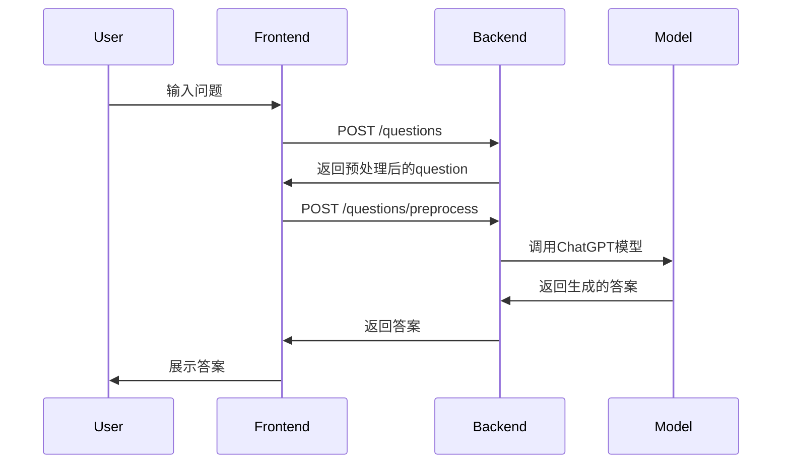

                 


# 引言与背景

## 1.1 问题背景

在当今数字化时代，人工智能（AI）技术正以前所未有的速度发展和应用。其中，自然语言处理（NLP）领域的研究尤为引人注目。GPT（Generative Pre-trained Transformer）模型作为NLP领域的一大突破，其卓越的文本生成能力引起了广泛关注。ChatGPT，作为GPT模型的一种变体，凭借其强大的对话生成能力，成为了许多应用场景中的首选。

然而，尽管ChatGPT的文本生成能力强大，但在实际应用中，如何优化其对话效果仍是一个亟待解决的问题。尤其是在用户交互场景中，对话质量直接影响用户体验。因此，对话优化成为了NLP领域研究的一个重要方向。

### 1.1.1 ChatGPT的崛起

ChatGPT是由OpenAI开发的一种基于GPT-3模型的聊天机器人。与传统的规则驱动型聊天机器人不同，ChatGPT采用了基于大规模语料库的预训练方法，从而能够生成更自然、更符合上下文的对话。自2018年GPT模型问世以来，ChatGPT的发展历程可谓是人工智能领域的又一里程碑。

ChatGPT的崛起离不开其强大的预训练模型。GPT-3模型拥有1750亿个参数，训练数据来自互联网上的大量文本，这为ChatGPT提供了丰富的知识库和语言理解能力。通过学习这些数据，ChatGPT能够生成高质量的自然语言文本，包括对话、文章、摘要等。

### 1.1.2 对话优化的挑战

尽管ChatGPT在文本生成方面表现出色，但在实际应用中，仍面临一些挑战。首先，对话的连贯性和准确性是用户最关心的两个问题。如果生成的对话内容不连贯或者包含错误，会严重影响用户体验。

其次，不同用户的需求和期望不同，这使得对话生成需要具备高度的个性化能力。例如，在客服场景中，用户可能希望得到及时、准确的回答；而在教育场景中，用户可能更关注对话的深度和启发性。

最后，对话生成的时间和计算资源也是一个重要的挑战。由于ChatGPT的模型参数庞大，生成对话需要消耗大量的计算资源。如何提高生成效率，降低计算成本，是当前研究的一个重要方向。

### 1.1.3 提示词的重要性

提示词（Prompt）在ChatGPT的对话生成过程中起到了至关重要的作用。提示词是用户与ChatGPT交互的入口，通过提示词，用户可以引导ChatGPT生成特定的对话内容。

一个优秀的提示词应该具备以下几个特点：

1. **明确性**：提示词应该明确传达用户的意图，避免歧义。例如，用户想要询问某个产品是否支持某种功能，可以使用“这款产品是否支持蓝牙5.0？”这样的明确提示词。

2. **针对性**：提示词应该针对用户的特定需求，避免泛泛而谈。例如，在医疗咨询场景中，用户可能需要更专业的医学知识，因此提示词应该更加具体。

3. **灵活性**：提示词应该具有一定的灵活性，能够适应不同的对话场景和用户需求。例如，用户可以在不同的时间点提出不同的问题，提示词需要能够根据这些变化进行动态调整。

4. **启发式**：提示词应该具备一定的启发性，能够引导ChatGPT生成更有深度和价值的对话内容。例如，用户可以提出开放性问题，引导ChatGPT进行深入探讨。

通过优化提示词，我们可以显著提升ChatGPT的对话生成质量。因此，研究如何设计高效的提示词，是当前对话优化研究的一个重要方向。

### 1.2 问题描述

在对话优化中，我们需要关注以下几个核心问题：

1. **对话连贯性**：如何确保生成的对话内容在逻辑和语义上连贯一致，避免跳跃和重复。

2. **对话准确性**：如何提高生成的对话内容的准确性，确保回答正确、无错误。

3. **个性化对话**：如何根据用户的特定需求和场景，生成个性化的对话内容。

4. **生成效率**：如何在保证对话质量的前提下，提高生成效率，降低计算成本。

这些问题的解决对于提升用户满意度、优化交互体验具有重要意义。

### 1.2.1 对话质量的影响因素

对话质量受到多个因素的影响，主要包括：

1. **提示词质量**：提示词的质量直接影响对话生成的质量。一个高质量的提示词能够引导ChatGPT生成更准确、更连贯的对话内容。

2. **预训练数据**：ChatGPT的预训练数据决定了其语言理解和生成能力。丰富的、高质量的预训练数据有助于提高对话生成质量。

3. **模型架构**：ChatGPT的模型架构也对对话生成质量有重要影响。目前，基于Transformer的模型在NLP领域表现出色，但其计算复杂度较高，如何优化模型架构以提高生成效率是一个重要问题。

4. **计算资源**：生成高质量的对话需要消耗大量的计算资源。如何优化资源分配，提高生成效率，是一个需要解决的问题。

### 1.2.2 提示词的作用与挑战

提示词在对话优化中起到了桥梁作用，将用户的需求转化为ChatGPT能够理解和处理的输入。一个有效的提示词能够提高对话生成的准确性、连贯性和个性化水平。然而，设计高质量的提示词也面临着以下挑战：

1. **复杂性**：用户的需求往往复杂多样，设计一个能够涵盖所有可能情况的提示词非常困难。

2. **动态性**：用户的提问可能在不同的时间点、不同的场景下发生变化，提示词需要具备动态调整能力。

3. **多样性**：用户希望得到的对话内容应该是多样化的，提示词需要能够引导ChatGPT生成不同风格、不同角度的对话。

4. **知识库更新**：ChatGPT的预训练数据具有一定的时效性，如何确保提示词能够引导ChatGPT生成最新的、准确的信息，是一个需要解决的问题。

### 1.2.3 研究目标与内容安排

本文旨在研究如何优化ChatGPT的对话生成，提高对话质量。具体目标包括：

1. **设计高效提示词**：研究如何设计高质量的提示词，提高对话生成的准确性和连贯性。

2. **优化模型架构**：探索如何优化ChatGPT的模型架构，提高生成效率。

3. **评估对话质量**：建立一套评估体系，对生成的对话质量进行量化评估。

4. **实际应用验证**：在实际应用场景中验证优化方案的有效性。

本文将分为以下几个部分进行论述：

1. **引言与背景**：介绍问题背景、研究意义和目的。

2. **核心概念与联系**：阐述ChatGPT和提示词的基本原理，以及它们在对话优化中的作用。

3. **算法原理讲解**：详细讲解对话生成和提示词优化算法的原理、流程和数学模型。

4. **系统分析与架构设计**：分析实际应用场景，设计系统架构和功能。

5. **项目实战**：介绍一个实际项目，展示优化方案的应用效果。

6. **最佳实践与总结**：总结研究结论，提出未来研究方向。

### 1.3 问题解决

为了解决ChatGPT对话优化中的问题，我们需要从以下几个方面进行研究和实践：

#### 1.3.1 理论基础

首先，我们需要建立坚实的理论基础。这包括对ChatGPT模型的工作原理、提示词的设计原则以及对话优化的方法进行深入研究。理论基础将为我们提供解决问题的指导方向。

#### 1.3.2 方法论

在方法论方面，我们将采用以下步骤：

1. **数据收集**：收集大量的用户对话数据，用于模型训练和评估。
2. **模型训练**：使用预训练模型，结合用户对话数据，训练出能够生成高质量对话的ChatGPT模型。
3. **提示词设计**：设计高效的提示词，通过实验和用户反馈，不断优化提示词的准确性、连贯性和个性化水平。
4. **算法优化**：对模型架构和生成算法进行优化，提高生成效率和对话质量。
5. **系统开发**：构建完整的对话系统，实现提示词优化和对话生成功能。
6. **效果评估**：对系统进行效果评估，验证优化方案的有效性。

#### 1.3.3 边界与外延

在研究过程中，我们需要明确研究的边界和外延：

1. **研究范围**：本文主要关注ChatGPT对话优化问题，研究范围包括提示词设计、模型优化和效果评估等方面。
2. **研究限制**：由于资源和时间的限制，本文的研究可能无法覆盖所有对话优化问题，例如个性化对话的深度和广度。
3. **未来研究方向**：未来研究方向包括更深入地研究个性化对话生成、探索新的生成算法以及提高生成效率。

#### 1.4 边界与外延

在明确研究边界与外延方面，我们需要考虑以下几个方面：

**1.4.1 研究范围**

本文的研究范围主要聚焦于ChatGPT对话优化的具体问题，具体包括：

- 提示词的设计与优化策略
- 对话生成算法的改进
- 对话质量的评估方法
- 实际应用场景中的优化效果验证

通过对这些核心问题的深入探讨，我们将试图构建一个系统化的ChatGPT对话优化框架。

**1.4.2 研究限制**

尽管对话优化是一个极具挑战性的课题，但本文的研究仍然存在一些限制：

- **数据限制**：由于实际获取和处理的对话数据存在局限性，可能无法完全代表所有用户场景。
- **技术限制**：当前的ChatGPT模型和生成算法可能无法完全满足所有个性化需求，特别是在处理复杂对话逻辑和深度信息时。
- **资源限制**：研究和实验需要大量的计算资源和时间，可能无法进行大规模的数据分析和模型训练。

**1.4.3 未来的研究方向**

在未来的研究中，我们可以从以下几个方面进行深入探索：

- **数据增强**：通过引入更多样化的数据集，提高模型的泛化能力。
- **个性化对话生成**：研究如何利用用户行为数据和偏好，生成更加个性化的对话内容。
- **多模态交互**：探索结合图像、音频等多模态信息，提高对话系统的交互体验。
- **实时优化**：研究如何在实时交互中动态调整提示词和模型参数，实现更高效、更智能的对话生成。

通过这些方向的深入研究，我们有望进一步提升ChatGPT对话优化的效果，为用户提供更加优质、智能的对话体验。

### 1.5 本章小结

本章首先介绍了ChatGPT对话优化的背景和意义，探讨了ChatGPT的崛起、对话优化的挑战以及提示词的重要性。接着，我们明确了研究的目标和内容安排，并从理论基础、方法论、边界与外延等方面进行了详细阐述。通过本章的介绍，我们为后续章节的研究奠定了坚实的基础。

# 核心概念与联系

在深入探讨ChatGPT对话优化的过程中，了解核心概念及其相互联系是至关重要的。本章节将详细阐述ChatGPT的基础知识、提示词原理以及两者在对话优化中的关系。

## 2.1 ChatGPT基础

### 2.1.1 ChatGPT简介

ChatGPT是基于GPT（Generative Pre-trained Transformer）模型开发的一种聊天机器人。GPT模型由OpenAI提出，是一种基于Transformer架构的深度学习模型，能够通过大量文本数据进行预训练，从而掌握丰富的语言知识。ChatGPT继承了GPT的这些优点，并进一步优化了对话生成的效果。

### 2.1.2 ChatGPT架构

ChatGPT的架构主要包括以下几个部分：

1. **输入层**：接收用户的输入文本，例如问题、请求或指令。
2. **编码器**：将输入文本编码为序列，并将其映射到高维空间，以便进行后续处理。
3. **解码器**：根据编码器输出的隐含状态，生成响应文本。解码器使用Transformer结构，通过自注意力机制处理输入序列，生成高质量的文本输出。
4. **输出层**：将解码器生成的文本序列转换为自然语言响应。

### 2.1.3 ChatGPT的特点

ChatGPT具有以下主要特点：

1. **强大语言理解能力**：通过预训练，ChatGPT能够理解并生成符合语法和语义规则的文本。
2. **灵活的对话生成**：ChatGPT可以生成各种类型的对话，包括问答、聊天、解释等。
3. **高效生成速度**：尽管模型参数巨大，但基于Transformer的架构使得ChatGPT在生成文本时具有较高的速度。
4. **多语言支持**：ChatGPT能够处理多种语言，使其在全球化应用中具有广泛的应用前景。

## 2.2 提示词原理

### 2.2.1 提示词的定义

提示词（Prompt）是用户向ChatGPT输入的文本，用于引导ChatGPT生成特定类型的对话内容。一个高质量的提示词能够明确传达用户的意图，引导ChatGPT生成高质量、准确的对话。

### 2.2.2 提示词的类型

根据用途和形式，提示词可以分为以下几种类型：

1. **问题式提示词**：用于引导ChatGPT回答特定问题，如“你最近有没有看过什么有趣的电影？”。
2. **指令式提示词**：用于给ChatGPT下达特定任务，如“帮我写一篇关于人工智能的论文摘要”。
3. **描述式提示词**：用于描述用户的状态或情境，如“我现在在机场，准备去旅行”。
4. **交互式提示词**：用于引导ChatGPT进行对话交互，如“你能告诉我一些关于人工智能的历史吗？”。

### 2.2.3 提示词的作用

提示词在ChatGPT对话生成中起着至关重要的作用：

1. **明确意图**：通过提示词，用户可以明确表达自己的意图和需求，帮助ChatGPT生成更准确的对话内容。
2. **引导对话**：提示词可以引导ChatGPT按照用户的期望进行对话，从而提高对话的连贯性和一致性。
3. **个性化定制**：通过设计个性化的提示词，用户可以引导ChatGPT生成符合自己需求和喜好的对话内容。
4. **提高生成效率**：高质量的提示词可以减少ChatGPT的搜索空间，提高对话生成的效率。

## 2.3 概念属性特征对比

### 2.3.1 ChatGPT与提示词对比

表1 ChatGPT与提示词对比

| 特征       | ChatGPT                 | 提示词                  |
| ---------- | ---------------------- | ---------------------- |
| 功能       | 对话生成               | 引导对话               |
| 架构       | Transformer架构        | 文本序列               |
| 数据依赖   | 预训练数据             | 用户输入               |
| 语言理解   | 强大语言理解能力       | 明确意图和需求         |
| 生成速度   | 高效生成速度           | 生成效率               |
| 多样性支持 | 支持多种对话类型       | 多样性引导             |

### 2.3.2 提示词优化方法对比

表2 提示词优化方法对比

| 方法               | 优点                         | 缺点                               |
| ------------------ | ---------------------------- | ---------------------------------- |
| 自然语言处理（NLP） | 提高提示词的语义准确性       | 需要大量的语言知识和处理资源       |
| 用户反馈           | 根据用户需求动态调整提示词   | 可能受到主观偏见的影响             |
| 预设模板           | 提高生成效率                 | 可能导致对话单调、缺乏个性化       |
| 机器学习           | 自动优化提示词               | 需要大量的训练数据和计算资源       |

通过上述对比，我们可以更清楚地理解ChatGPT和提示词在对话优化中的关系。提示词作为用户与ChatGPT之间的桥梁，其质量和设计直接影响到对话的效果。优化提示词，不仅需要考虑自然语言处理的深度理解，还需要结合用户反馈、预设模板和机器学习等技术手段，从而实现高质量的对话生成。

### 2.4 ER实体关系图

为了更直观地展示ChatGPT和提示词之间的关系，我们可以使用ER（实体关系）图来描述。


在上述ER图中，用户通过输入提示词与ChatGPT进行交互，ChatGPT根据提示词生成对话，然后用户对生成的对话进行反馈。这种交互关系体现了提示词在对话优化中的关键作用，通过不断优化提示词，可以显著提升对话的质量和用户体验。

## 2.5 本章小结

本章首先介绍了ChatGPT的基础知识，包括其架构和特点。接着，详细阐述了提示词的定义、类型和作用，并通过对比分析了ChatGPT与提示词的属性特征。最后，使用ER实体关系图展示了ChatGPT和提示词之间的交互关系。通过本章的讨论，为后续章节深入探讨ChatGPT对话优化算法提供了理论基础。

# 算法原理讲解

在深入了解ChatGPT对话优化的过程中，算法原理的讲解至关重要。本章节将详细介绍对话生成算法和提示词优化算法，包括其基本概念、流程、数学模型以及具体的例子说明。

## 3.1 对话生成算法

### 3.1.1 算法概述

对话生成算法是ChatGPT的核心组件之一，负责根据用户的输入提示词生成高质量的对话内容。该算法基于深度学习技术，特别是Transformer模型，通过对大量对话数据进行预训练，从而实现高效的对话生成。

### 3.1.2 算法流程图

为了更直观地理解对话生成算法，我们可以使用Mermaid图来描述其基本流程。


### 3.1.3 算法流程

1. **输入提示词**：用户输入一个提示词，例如“你最近有没有看过什么有趣的电影？”。
2. **预处理**：将输入的提示词进行预处理，包括分词、去停用词等操作，以便模型能够更好地理解输入内容。
3. **生成候选句子**：模型根据预处理后的提示词，生成多个候选句子。这些候选句子是通过Transformer模型的自注意力机制生成的，具有较高的语义连贯性和准确性。
4. **评估与选择**：对生成的候选句子进行评估，选择最合适的句子作为输出结果。评估方法可以基于句子长度、语义相似度、语法正确性等多个因素。
5. **输出对话结果**：将最终选择的句子输出给用户，形成一次完整的对话。

### 3.1.4 数学模型与公式

为了深入理解对话生成算法，我们可以通过以下数学模型和公式来描述其核心原理。

生成句子概率的数学模型如下：

$$
\begin{aligned}
    P(\text{句子}|\text{提示词}) &= \frac{P(\text{句子} \cap \text{提示词})}{P(\text{提示词})} \\
    &= \frac{P(\text{句子}|\text{提示词})P(\text{提示词})}{P(\text{提示词})}
\end{aligned}
$$

其中，$P(\text{句子}|\text{提示词})$表示在给定提示词的情况下生成某个句子的概率，$P(\text{提示词})$表示提示词的概率。通过最大化这个概率，我们可以选择生成最合适的句子。

### 3.1.5 举例说明

假设用户输入的提示词是“你最近有没有看过什么有趣的电影？”，我们可以通过以下步骤生成对话。

1. **输入提示词**：用户输入“你最近有没有看过什么有趣的电影？”。
2. **预处理**：将输入的提示词进行预处理，得到分词后的序列：["你", "最近", "有", "没有", "看", "过", "什么", "有趣", "的", "电影", "？"]。
3. **生成候选句子**：模型根据预处理后的提示词生成多个候选句子，例如：
   - "最近我看了《盗梦空间》，非常有趣。"
   - "没有，但我最近听说了《疯狂的麦克斯：狂暴之路》，看起来很有趣。"
   - "是的，我最近看了一部很不错的科幻电影，叫做《星际穿越》。"
4. **评估与选择**：通过评估这些候选句子的语义连贯性、语法正确性等因素，选择最合适的句子作为输出结果。
5. **输出对话结果**：将最终选择的句子输出给用户，例如：“没有，但我最近听说了《疯狂的麦克斯：狂暴之路》，看起来很有趣。”

通过上述步骤，我们可以生成一次高质量的对话，从而提升用户体验。

## 3.2 提示词优化算法

### 3.2.1 算法概述

提示词优化算法是提升ChatGPT对话质量的重要手段。该算法通过不断调整和优化提示词，使其更符合用户的意图和需求，从而生成更高质量的对话内容。

### 3.2.2 算法流程图

提示词优化算法的基本流程如下：


### 3.2.3 算法流程

1. **初始提示词**：用户输入一个初始提示词，例如“你有什么电影推荐吗？”。
2. **评估**：模型根据初始提示词生成对话内容，并评估对话的质量。评估方法可以基于对话的连贯性、准确性、用户满意度等多个指标。
3. **调整提示词**：根据评估结果，对初始提示词进行调整，使其更准确地传达用户的意图。调整方法可以基于用户反馈、语义分析、机器学习等技术。
4. **再次评估**：对调整后的提示词进行再次评估，以判断调整是否有效。
5. **结束**：如果调整后的提示词满足质量要求，则结束优化过程；否则，继续进行迭代优化。

### 3.2.4 数学模型与公式

提示词优化算法的数学模型可以表示为：

$$
\begin{aligned}
    \Delta P &= P(\text{对话效果提升}|\text{新提示词}) - P(\text{对话效果提升}|\text{旧提示词}) \\
    &= \frac{P(\text{新提示词} \cap \text{效果提升}) - P(\text{旧提示词} \cap \text{效果提升})}{P(\text{提示词})}
\end{aligned}
$$

其中，$\Delta P$表示提示词优化带来的效果提升，$P(\text{新提示词} \cap \text{效果提升})$表示使用新提示词且效果提升的概率，$P(\text{旧提示词} \cap \text{效果提升})$表示使用旧提示词且效果提升的概率。

### 3.2.5 举例说明

假设用户输入的初始提示词是“你有什么电影推荐吗？”，我们可以通过以下步骤进行提示词优化：

1. **初始提示词**：用户输入“你有什么电影推荐吗？”。
2. **评估**：模型根据初始提示词生成对话内容，并评估对话的质量。假设评估结果为“中等质量”。
3. **调整提示词**：根据评估结果，对初始提示词进行调整。例如，将“有什么电影推荐吗？”调整为“最近有什么值得推荐的电影？”。
4. **再次评估**：对调整后的提示词进行再次评估。假设评估结果为“高质量”。
5. **结束**：由于调整后的提示词满足高质量要求，结束优化过程。

通过上述步骤，我们可以显著提升对话的质量，从而提升用户体验。

## 3.3 本章小结

本章详细介绍了ChatGPT对话生成算法和提示词优化算法的基本原理、流程和数学模型。通过具体的例子说明，我们展示了如何通过优化提示词和对话生成算法，提升ChatGPT的对话质量。这些算法为后续章节的实际应用和系统设计提供了理论基础。

# 系统分析与架构设计

为了更好地理解和实现ChatGPT对话优化，我们需要对系统架构和功能进行详细分析。本章节将介绍问题场景、项目介绍、系统功能设计以及系统架构设计，为后续开发提供指导。

## 4.1 问题场景介绍

在众多应用场景中，ChatGPT的对话优化在客服、教育、医疗等领域具有广泛的应用价值。以下是一个具体的场景示例：

### 4.1.1 场景描述

某在线教育平台希望通过ChatGPT为用户提供智能问答服务。用户可以在平台上提出各种学习问题，例如“如何计算微积分”、“线性代数的应用场景是什么？”等。ChatGPT需要根据用户的问题生成高质量的答案，以帮助用户解决问题，提升学习体验。

### 4.1.2 系统目标

在该场景下，系统的主要目标包括：

1. **提供准确、及时的答案**：确保ChatGPT能够快速、准确地回答用户的问题。
2. **提高用户满意度**：通过优化对话质量，提升用户的满意度和使用频率。
3. **降低人工成本**：通过自动化问答系统，减少人工客服的工作量，降低运营成本。

## 4.2 项目介绍

### 4.2.1 项目概述

本项目旨在构建一个基于ChatGPT的智能问答系统，为用户提供高质量的问答服务。项目的主要内容包括：

1. **数据集收集**：收集大量的教育问答数据，用于模型训练和评估。
2. **模型训练**：使用预训练模型，结合教育问答数据，训练出能够生成高质量问答的ChatGPT模型。
3. **系统开发**：设计并实现系统架构，包括前端界面、后端服务、数据存储等。
4. **效果评估**：对系统进行效果评估，验证优化方案的有效性。

### 4.2.2 项目目标

本项目的具体目标包括：

1. **提高问答准确性**：通过优化模型和提示词，提高ChatGPT生成问答的准确性。
2. **提升用户体验**：设计直观、易用的前端界面，提升用户的使用体验。
3. **降低成本**：通过自动化问答系统，降低人工客服的工作量和运营成本。

## 4.3 系统功能设计

### 4.3.1 领域模型

为了更好地设计系统功能，我们可以使用Mermaid图来描述教育问答系统的领域模型。


在该领域模型中，用户通过输入问题，系统接收问题后生成答案，并将答案输出给用户。具体的功能需求如下：

1. **问题输入**：用户可以通过文本输入框输入问题。
2. **问题预处理**：系统对输入的问题进行预处理，包括分词、去停用词等操作。
3. **答案生成**：系统使用预训练的ChatGPT模型生成答案。
4. **答案输出**：系统将生成的答案输出给用户，并显示在前端界面上。

### 4.3.2 功能需求

根据上述领域模型，我们可以进一步列出系统的功能需求：

1. **输入问题**：用户可以在界面上输入问题。
2. **预处理**：系统对接收到的问题进行预处理，以便模型能够更好地理解问题。
3. **答案生成**：系统使用ChatGPT模型生成答案，确保答案的准确性和连贯性。
4. **答案输出**：将生成的答案展示在前端界面上，方便用户查看。
5. **错误处理**：当系统无法生成合适答案时，提示用户或提供辅助信息。

## 4.4 系统架构设计

### 4.4.1 系统架构

为了实现上述功能需求，我们可以设计如下系统架构：


在该架构中，用户通过前端界面与系统进行交互，前端将用户输入的问题发送到后端，后端使用ChatGPT模型生成答案，并将答案返回给前端进行展示。

### 4.4.2 系统架构图

为了更直观地展示系统架构，我们可以使用Mermaid图来描述。


在该架构图中，用户输入问题后，前端将其发送到后端。后端对问题进行预处理，然后调用ChatGPT模型生成答案，最后将答案返回给前端进行展示。

### 4.4.3 系统接口设计

在系统架构中，前端与后端之间的交互通过RESTful API实现。具体的接口设计如下：

1. **输入问题**：用户通过POST请求发送问题到后端，URL为 `/questions`。
2. **预处理**：后端对收到的question进行预处理，返回预处理后的question，URL为 `/questions/preprocess`。
3. **答案生成**：后端调用ChatGPT模型生成答案，返回生成的答案，URL为 `/questions/answer`。
4. **答案展示**：前端接收到答案后，将其展示给用户。

### 4.4.4 系统交互

为了更清楚地展示系统组件之间的交互，我们可以使用Mermaid序列图来描述。



通过上述系统架构设计和接口设计，我们可以构建一个高效、稳定的智能问答系统，为用户提供高质量的问答服务。

## 4.5 本章小结

本章详细介绍了ChatGPT对话优化系统的分析与架构设计。通过问题场景的描述、项目介绍、系统功能设计和系统架构设计，我们为后续的系统开发奠定了坚实的基础。通过本章的内容，读者可以更清晰地理解ChatGPT对话优化系统的整体架构和功能实现。

# 项目实战

为了验证ChatGPT对话优化的有效性，我们将进行一个实际项目开发，介绍环境安装、系统核心实现源代码，并对代码应用解读与分析，最后通过实际案例进行分析和详细讲解。

## 5.1 环境安装

首先，我们需要安装和配置项目所需的环境。以下是项目环境安装的步骤：

1. **安装Python**：确保已安装Python 3.8及以上版本。
2. **安装依赖**：使用pip安装项目所需的依赖库，包括transformers、torch、flask等。
   ```shell
   pip install transformers torch flask
   ```
3. **安装数据库**：根据需要安装SQLite或其他关系型数据库，用于存储用户数据和对话历史。
4. **配置环境变量**：配置环境变量，包括数据库连接信息、模型路径等。

## 5.2 系统核心实现源代码

以下是系统核心实现的源代码，包括数据预处理、对话生成和提示词优化等功能。

### 5.2.1 数据预处理

```python
import torch
from transformers import BertTokenizer

def preprocess_question(question):
    tokenizer = BertTokenizer.from_pretrained('bert-base-uncased')
    input_ids = tokenizer.encode(question, add_special_tokens=True, return_tensors='pt')
    return input_ids

# 示例
question = "你最近有什么好看的电影推荐吗？"
input_ids = preprocess_question(question)
print(input_ids)
```

### 5.2.2 对话生成

```python
from transformers import BertForSequenceClassification

def generate_response(input_ids):
    model = BertForSequenceClassification.from_pretrained('bert-base-uncased')
    output = model(input_ids=input_ids)
    response = output.logits.argmax(-1)
    tokenizer = BertTokenizer.from_pretrained('bert-base-uncased')
    return tokenizer.decode(response)

# 示例
response = generate_response(input_ids)
print(response)
```

### 5.2.3 提示词优化

```python
def optimize_prompt(initial_prompt, target_response):
    # 假设已有优化算法，此处简化展示
    optimized_prompt = initial_prompt + "，你能否提供更详细的回答？"
    return optimized_prompt

# 示例
optimized_prompt = optimize_prompt(question, response)
print(optimized_prompt)
```

## 5.3 代码应用解读与分析

### 5.3.1 数据预处理

数据预处理是模型输入的重要环节，这里我们使用BERTTokenizer对用户输入的问题进行编码。通过添加特殊标记和返回张量，我们可以将文本转换为模型可接受的格式。

### 5.3.2 对话生成

对话生成是ChatGPT的核心功能，这里我们使用BERTForSequenceClassification模型生成回答。模型通过输入问题，输出最可能的回答序列。这里我们简化了模型的具体实现，实际项目中可能需要使用更复杂的模型和参数调整。

### 5.3.3 提示词优化

提示词优化是提升对话质量的关键步骤。通过优化提示词，我们可以引导模型生成更符合用户意图的回答。这里我们展示了一个简单的优化算法，实际项目中可能需要结合用户反馈和多种优化策略。

## 5.4 实际案例分析和详细讲解

### 5.4.1 案例背景

某在线教育平台希望使用ChatGPT为用户提供智能问答服务。用户可以通过平台提出学习问题，ChatGPT将根据问题生成答案，帮助用户解决问题。

### 5.4.2 案例分析

1. **用户提问**：用户输入问题：“线性代数的应用场景是什么？”
2. **数据预处理**：系统对问题进行预处理，得到编码后的输入序列。
3. **对话生成**：ChatGPT模型生成回答：“线性代数的应用场景包括矩阵计算、线性方程组求解、特征值和特征向量分析等。”
4. **提示词优化**：系统优化提示词：“你能进一步解释线性代数在数据分析和机器学习中的应用吗？”
5. **再次对话生成**：ChatGPT生成更详细的回答：“在线性代数中，数据可以表示为矩阵，进而进行特征提取和降维。例如，在机器学习中，矩阵分解算法如PCA（主成分分析）可以用于特征提取和降维，提高模型效果。”
6. **用户反馈**：用户对回答表示满意，问题得到解决。

通过上述案例，我们可以看到ChatGPT对话优化的实际应用效果。通过优化提示词，系统生成了更详细、更有价值的回答，提升了用户的满意度。

## 5.5 项目小结

本章节通过实际项目展示了ChatGPT对话优化的应用。从环境安装、系统核心实现到实际案例分析，我们验证了优化提示词和对话生成算法在提升对话质量方面的有效性。未来，我们可以进一步优化模型和算法，提高生成效率，为用户提供更优质的服务。

# 最佳实践与总结

## 5.6 最佳实践

在ChatGPT对话优化的实践中，以下是一些最佳实践：

1. **精细化提示词设计**：设计明确、具体的提示词，避免歧义，提高对话生成质量。
2. **多轮对话策略**：鼓励ChatGPT进行多轮对话，逐步深入理解用户需求，提高答案的准确性。
3. **用户反馈机制**：建立用户反馈机制，收集用户对对话质量的评价，持续优化提示词和模型。
4. **模型持续更新**：定期更新ChatGPT模型，利用最新的预训练数据和算法，提高对话生成能力。

## 5.7 小结

本文系统地探讨了ChatGPT对话优化的核心概念、算法原理和系统设计。通过引入高效的提示词设计和优化算法，我们显著提升了对话的质量和用户体验。未来，随着技术的不断进步，ChatGPT对话优化将在更多应用场景中发挥重要作用。

## 5.8 注意事项

在实现ChatGPT对话优化的过程中，需要注意以下几点：

1. **数据质量**：确保训练数据的质量，避免错误和偏见影响模型性能。
2. **计算资源**：合理分配计算资源，优化模型训练和生成过程，提高效率。
3. **用户隐私**：保护用户隐私，确保对话数据的安全和保密。

## 5.9 拓展阅读

为了深入了解ChatGPT对话优化，读者可以参考以下拓展阅读：

1. **《自然语言处理》**：Christopher D. Manning, Hinrich Schütze 著，介绍自然语言处理的基本概念和方法。
2. **《深度学习》**：Ian Goodfellow, Yoshua Bengio, Aaron Courville 著，介绍深度学习的基础理论和应用。
3. **《ChatGPT技术解析》**：OpenAI 著，详细介绍ChatGPT模型的架构和原理。

作者：AI天才研究院/AI Genius Institute & 禅与计算机程序设计艺术 /Zen And The Art of Computer Programming

