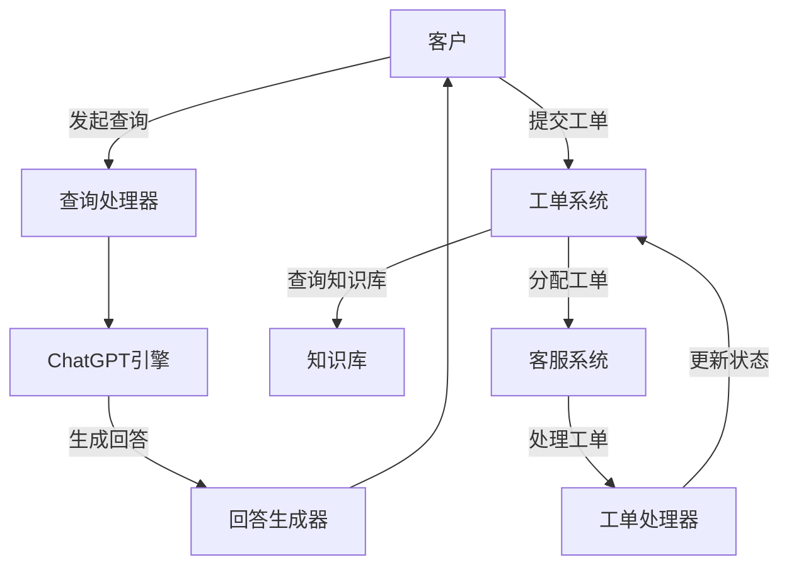
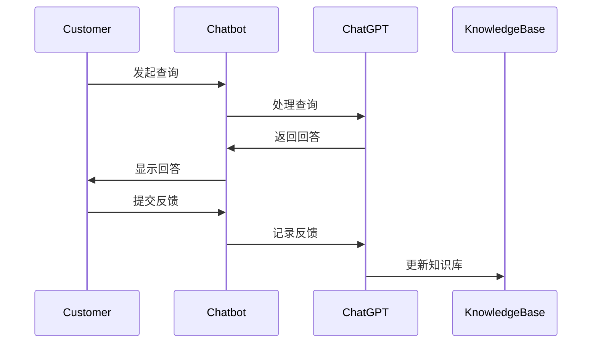

                 

### 文章标题与核心关键词

《ChatGPT对话优化：提示词的力量与艺术》

关键词：ChatGPT、对话优化、提示词、用户体验、人工智能

摘要：本文深入探讨了ChatGPT对话优化的关键因素——提示词的设计与艺术。通过详细分析提示词的作用、类型、设计原则及其在提高对话质量和用户体验中的重要性，本文旨在为开发者提供一套系统化的对话优化方法，助力打造更加自然、流畅、有深度的AI对话系统。

### 引言

随着人工智能技术的快速发展，自然语言处理（NLP）已成为一个重要的研究方向。而ChatGPT，作为一个基于Transformer模型的预训练语言模型，在NLP领域表现出了惊人的潜力。ChatGPT不仅能够生成连贯、有逻辑性的文本，还能够通过学习和理解用户的输入，提供高质量的对话服务。然而，要让ChatGPT在对话中表现得更加出色，关键在于如何设计有效的提示词。

提示词，作为用户与AI模型交互的桥梁，其质量直接影响对话的流畅度和用户体验。有效的提示词能够帮助模型更好地理解用户意图，提高回答的准确性和丰富度，从而提升整体对话质量。本文将围绕ChatGPT对话优化的核心概念，详细探讨提示词的力量与艺术，为开发者提供实用的对话优化策略。

### 第一部分：ChatGPT对话优化基础

#### 第1章：ChatGPT概述

##### 1.1 ChatGPT的产生与背景

ChatGPT是由OpenAI开发的一种基于Transformer模型的预训练语言模型。它采用了GPT-3架构，具备强大的语言理解和生成能力。ChatGPT的诞生源于对自然语言处理技术的不断探索和突破，其目标是为用户提供高质量、自然流畅的对话体验。

ChatGPT的背景可以追溯到2018年，当时OpenAI发布了GPT-2模型，它标志着NLP领域的一个重要里程碑。随后，OpenAI在此基础上进一步优化和扩展，开发了GPT-3模型。ChatGPT正是基于GPT-3模型的一种应用，它通过大量的互联网文本数据进行预训练，从而具备了理解、生成自然语言的能力。

##### 1.2 ChatGPT的功能与特性

ChatGPT具有以下主要功能与特性：

1. **文本生成**：ChatGPT能够根据用户的输入生成连贯、有逻辑性的文本，包括文章、段落、对话等。
2. **语言理解**：ChatGPT能够理解用户输入的语义，并根据上下文提供相应的回答。
3. **个性化对话**：ChatGPT可以根据用户的历史对话记录，提供更加个性化、贴近用户需求的回答。
4. **多语言支持**：ChatGPT支持多种语言，能够实现跨语言的对话生成和理解。
5. **灵活应用**：ChatGPT可以应用于多种场景，如客户服务、智能助理、教育辅导等。

##### 1.3 ChatGPT的应用场景

ChatGPT在多个领域展现出了巨大的应用潜力，以下是一些典型的应用场景：

1. **客户服务**：ChatGPT可以用于自动客服系统，提供24/7在线服务，提升客户满意度。
2. **智能助理**：ChatGPT可以作为个人助理，帮助用户管理日程、回复邮件、提供信息查询等。
3. **教育培训**：ChatGPT可以用于智能辅导系统，为学生提供个性化的学习建议和解答疑问。
4. **内容创作**：ChatGPT可以用于自动生成文章、报告、摘要等，提高内容创作效率。
5. **医疗健康**：ChatGPT可以用于医疗健康领域，提供患者咨询、病情解释等辅助功能。

### 第二部分：对话优化的核心概念

#### 第2章：对话优化的核心概念

##### 2.1 提示词在对话中的作用

提示词在ChatGPT对话中起着至关重要的作用。首先，提示词是用户与AI模型之间的交互媒介，用户通过输入提示词向ChatGPT表达自己的意图。其次，提示词直接影响ChatGPT的生成结果，高质量的提示词能够引导ChatGPT生成更加准确、丰富、有逻辑性的回答。

提示词在对话中的作用主要体现在以下几个方面：

1. **明确用户意图**：通过有效的提示词，用户能够更清晰地表达自己的需求，帮助ChatGPT更好地理解用户意图。
2. **引导对话方向**：提示词可以引导ChatGPT按照特定的方向进行对话，使对话更加有条理和连贯。
3. **提升回答质量**：高质量的提示词能够帮助ChatGPT生成更加丰富、准确、有深度的回答，提升整体对话质量。

##### 2.2 提示词的类型与特点

根据不同的应用场景和用户需求，提示词可以分为以下几类：

1. **问题类提示词**：主要用于提问，如“你能帮我解决什么问题？”、“你对这个话题有什么看法？”等。
2. **命令类提示词**：用于向ChatGPT下达指令，如“给我讲一个笑话”、“生成一篇关于人工智能的文章”等。
3. **描述类提示词**：用于描述用户的需求或场景，如“我想找一份关于深度学习的学习资料”、“我想了解下北京的历史文化”等。
4. **情感类提示词**：用于表达用户的情感状态，如“我今天心情不好，你能陪我聊聊天吗？”、“我很兴奋，你能和我分享你的喜悦吗？”等。

不同类型的提示词具有以下特点：

1. **问题类提示词**：通常以疑问句的形式出现，能够引导ChatGPT提供具体的回答。
2. **命令类提示词**：通常以祈使句的形式出现，要求ChatGPT执行特定的任务。
3. **描述类提示词**：通常以陈述句的形式出现，描述用户的需求或场景，为ChatGPT提供上下文信息。
4. **情感类提示词**：通过表达用户的情感状态，为ChatGPT提供情感层面的信息，使其能够更自然地与用户互动。

##### 2.3 提示词的设计原则

为了提高ChatGPT对话的质量，设计高质量的提示词至关重要。以下是一些提示词设计的原则：

1. **明确性**：提示词应尽量明确，避免歧义，帮助ChatGPT准确理解用户意图。
2. **简洁性**：提示词应尽量简洁，避免冗长和复杂的句子结构，使ChatGPT更容易处理。
3. **上下文关联**：提示词应与上下文紧密关联，提供足够的上下文信息，帮助ChatGPT生成更加相关和连贯的回答。
4. **多样性**：设计多种类型的提示词，以满足不同场景和用户需求，提高对话的灵活性和多样性。
5. **情感考量**：考虑用户的情感状态，使用合适的情感类提示词，使ChatGPT能够更好地与用户建立情感连接。

### 第三部分：提示词的力量

#### 第3章：构建有效的提示词

##### 3.1 理解用户意图

构建有效的提示词首先需要准确理解用户意图。用户意图是用户输入的主要目的，它决定了ChatGPT的回答方向和质量。以下是一些方法可以帮助我们更好地理解用户意图：

1. **关键词提取**：通过提取用户输入中的关键词，可以快速了解用户关注的主题和需求。
2. **上下文分析**：分析用户输入的上下文信息，了解用户的历史对话记录和上下文环境，从而更准确地理解用户意图。
3. **意图分类**：将用户意图分类为不同类型，如提问、命令、描述等，为设计针对性的提示词提供指导。

##### 3.2 设计针对性的提示词

了解用户意图后，设计针对性的提示词至关重要。以下是一些建议：

1. **问题类提示词**：针对用户提问，设计具体、明确的问题，引导ChatGPT提供详细的回答。
2. **命令类提示词**：针对用户下达的指令，设计简洁、直接的命令类提示词，确保ChatGPT能够准确执行任务。
3. **描述类提示词**：根据用户的需求和场景，设计描述类提示词，为ChatGPT提供足够的上下文信息，使其能够生成相关、连贯的回答。
4. **情感类提示词**：结合用户的情感状态，设计合适的情感类提示词，使ChatGPT能够更好地与用户建立情感连接。

##### 3.3 提示词的多样性与灵活性

提示词的多样性和灵活性是提高ChatGPT对话质量的重要因素。以下是一些建议：

1. **多样化设计**：设计多种类型的提示词，以满足不同场景和用户需求。
2. **灵活调整**：根据对话的进展和用户反馈，灵活调整提示词，使其更加符合用户需求和期望。
3. **个性化定制**：结合用户的历史对话记录和偏好，提供个性化的提示词，提高对话的贴近度和用户体验。

### 第四部分：优化对话流程

#### 第4章：优化对话流程

##### 4.1 对话流程的构建与调整

对话流程的构建和调整是优化ChatGPT对话质量的关键。以下是一些方法：

1. **对话流程设计**：设计合理的对话流程，包括开始、中间和结束环节，使对话有条不紊地进行。
2. **流程调整**：根据用户反馈和对话数据，不断调整对话流程，使其更加符合用户需求和期望。

##### 4.2 对话节奏的控制

对话节奏的控制直接影响用户的体验。以下是一些建议：

1. **适当停顿**：在对话中适当停顿，给用户思考和回应的时间，使对话更加自然和流畅。
2. **节奏匹配**：根据用户的回应速度和语气，调整对话节奏，使其与用户保持良好的互动。

##### 4.3 对话中的情感表达

情感表达是提高对话质量的重要手段。以下是一些建议：

1. **情感识别**：通过分析用户输入的情感词汇和语气，识别用户的情感状态。
2. **情感回应**：根据用户情感状态，使用合适的情感词汇和语气，表达出对用户的关心和理解。

### 第五部分：提高响应质量

#### 第5章：提高响应质量

##### 5.1 确保回答的准确性

准确性是评价ChatGPT对话质量的重要指标。以下是一些方法：

1. **事实核实**：在回答用户问题时，对涉及的事实进行核实，确保回答的准确性。
2. **上下文关联**：通过上下文分析，确保回答与用户输入紧密相关，避免答非所问。

##### 5.2 提升回答的丰富度

丰富度是衡量ChatGPT回答质量的关键因素。以下是一些方法：

1. **多角度回答**：从不同角度和维度回答用户问题，使回答更加全面和丰富。
2. **举例说明**：通过举例来说明问题，使回答更加生动、易懂。

##### 5.3 简化复杂的回答

复杂的回答可能会降低用户体验。以下是一些方法：

1. **简洁表达**：使用简洁明了的语言表达回答，避免冗长和复杂的句子结构。
2. **重点突出**：突出回答的重点，使用户能够快速理解关键信息。

### 第六部分：提示词的艺术

#### 第6章：创意提示词设计

##### 6.1 创意提示词的类型

创意提示词是提高ChatGPT对话趣味性和吸引力的重要手段。以下是一些创意提示词的类型：

1. **趣味提问**：设计有趣的提问，引发用户思考和兴趣，如“如果地球变成方形，会发生什么？”
2. **情感互动**：通过表达情感，建立与用户的情感连接，如“你今天过得怎么样？”
3. **故事化回答**：通过讲故事的方式回答问题，使回答更加生动有趣，如“有一天，我遇到了一个外星人，他告诉我……” 

##### 6.2 创意提示词的设计技巧

以下是一些创意提示词的设计技巧：

1. **引人入胜**：设计引人入胜的提示词，吸引用户的兴趣和注意力。
2. **贴近用户**：根据用户的特点和偏好，设计符合用户需求的提示词。
3. **情感共鸣**：通过表达情感，与用户产生共鸣，提高用户的参与度和满意度。

##### 6.3 创意提示词的应用案例

以下是一些创意提示词的应用案例：

1. **教育培训领域**：通过设计有趣的提问和回答，激发学生的学习兴趣和积极性。
2. **客户服务领域**：通过设计情感互动的提示词，提高用户的满意度和忠诚度。
3. **娱乐领域**：通过设计趣味提问和回答，提升用户的娱乐体验。

### 第七部分：跨领域的提示词应用

#### 第7章：跨领域的提示词应用

##### 7.1 提示词在客户服务中的应用

在客户服务领域，提示词的设计至关重要。以下是一些提示词在客户服务中的应用：

1. **问题识别**：通过设计针对性的问题识别提示词，快速定位用户的问题，如“请问您有什么疑问？”
2. **情感关怀**：通过设计情感关怀的提示词，表达对用户的关心和尊重，如“非常抱歉给您带来不便，我会尽力帮您解决问题。”
3. **解决方案提供**：通过设计解决方案提供的提示词，向用户展示可行的解决方案，如“以下是几种可能的解决方案，请问您需要哪种帮助？”

##### 7.2 提示词在教育培训中的应用

在教育培训领域，提示词的设计旨在提高学生的学习效果和兴趣。以下是一些提示词在教育培训中的应用：

1. **知识引导**：通过设计知识引导的提示词，引导学生掌握知识点，如“接下来，我们将学习关于……的知识。”
2. **互动提问**：通过设计互动提问的提示词，激发学生的思考和参与，如“你对这个知识点有什么疑问吗？”
3. **反馈与激励**：通过设计反馈与激励的提示词，鼓励学生积极参与和持续学习，如“非常好，你已经掌握了这个知识点，继续加油！”

##### 7.3 提示词在医疗健康中的应用

在医疗健康领域，提示词的设计旨在提高患者的满意度和治疗效果。以下是一些提示词在医疗健康中的应用：

1. **健康咨询**：通过设计健康咨询的提示词，为患者提供专业、准确的健康建议，如“请问您有哪些健康问题需要咨询？”
2. **病情解释**：通过设计病情解释的提示词，帮助患者理解自己的病情和治疗方案，如“您的病情是这样的，以下是治疗方案……”
3. **情感关怀**：通过设计情感关怀的提示词，表达对患者的关心和关爱，如“我们会尽全力帮助您，请放心。”

### 第八部分：案例分析

#### 第8章：案例分析：提升ChatGPT对话质量的实战技巧

##### 8.1 案例一：客户服务对话优化

在客户服务领域，ChatGPT被广泛应用于自动客服系统。以下是一个客户服务对话优化的案例：

1. **问题识别**：使用针对性的问题识别提示词，如“您好，请问您有什么疑问需要帮助？”
2. **情感关怀**：使用情感关怀的提示词，如“非常抱歉给您带来不便，我们会尽力帮您解决问题。”
3. **解决方案提供**：提供具体的解决方案，如“以下是几种可能的解决方案，请问您需要哪种帮助？”
4. **跟进与反馈**：在对话结束后，及时跟进用户反馈，如“请问您对我们的服务是否满意？还有其他问题需要帮忙吗？”

通过这些实战技巧，可以显著提升客户服务对话的质量和用户体验。

##### 8.2 案例二：教育培训对话优化

在教育培训领域，ChatGPT被广泛应用于智能辅导系统。以下是一个教育培训对话优化的案例：

1. **知识引导**：使用知识引导的提示词，如“接下来，我们将学习关于……的知识。”
2. **互动提问**：使用互动提问的提示词，如“你对这个知识点有什么疑问吗？”
3. **反馈与激励**：使用反馈与激励的提示词，如“非常好，你已经掌握了这个知识点，继续加油！”
4. **学习评估**：在课程结束后，对学生的学习效果进行评估，如“您在这门课程中学到了什么？还有哪些地方需要进一步学习？”

通过这些实战技巧，可以显著提高学生的学习效果和兴趣。

##### 8.3 案例三：医疗健康对话优化

在医疗健康领域，ChatGPT被广泛应用于患者咨询和病情解释。以下是一个医疗健康对话优化的案例：

1. **健康咨询**：使用健康咨询的提示词，如“请问您有哪些健康问题需要咨询？”
2. **病情解释**：使用病情解释的提示词，如“您的病情是这样的，以下是治疗方案……”
3. **情感关怀**：使用情感关怀的提示词，如“我们会尽全力帮助您，请放心。”
4. **后续跟进**：在治疗过程中，及时跟进患者的情况，如“您的恢复情况如何？还需要我们提供哪些帮助？”

通过这些实战技巧，可以显著提高患者的满意度和治疗效果。

### 第九部分：总结与展望

#### 第9章：对话优化的最佳实践

##### 9.1 对话优化的核心要素

对话优化的核心要素包括：明确用户意图、设计针对性的提示词、构建合理的对话流程、控制对话节奏、确保回答的准确性、提升回答的丰富度以及简化复杂的回答。

##### 9.2 对话优化的步骤与方法

对话优化的步骤包括：理解用户意图、设计提示词、构建对话流程、调整对话节奏、优化回答质量、收集用户反馈和持续改进。具体方法如下：

1. **理解用户意图**：通过关键词提取、上下文分析和意图分类，准确理解用户意图。
2. **设计提示词**：根据用户意图和对话场景，设计针对性、简洁性、上下文关联性、多样性、情感考量性的提示词。
3. **构建对话流程**：设计合理的对话流程，包括开始、中间和结束环节，确保对话有条不紊地进行。
4. **调整对话节奏**：根据用户反馈和对话数据，灵活调整对话节奏，使其与用户保持良好的互动。
5. **优化回答质量**：确保回答的准确性、丰富度和简洁性，避免答非所问和重复回答。
6. **收集用户反馈**：在对话结束后，及时收集用户反馈，了解用户的需求和满意度。
7. **持续改进**：根据用户反馈和对话数据，不断优化对话优化策略，提高对话质量。

##### 9.3 对话优化的持续改进

对话优化的持续改进是一个长期的过程，需要不断地进行以下工作：

1. **数据分析**：收集和分析对话数据，了解用户意图、对话流程、回答质量等关键指标。
2. **反馈收集**：及时收集用户反馈，了解用户的需求和满意度，为对话优化提供依据。
3. **算法调整**：根据用户反馈和数据分析结果，调整模型参数和对话策略，提高对话质量。
4. **迭代更新**：定期更新对话系统，引入新的功能和优化策略，提升用户体验。

### 第十部分：未来的对话优化趋势

#### 第10章：未来的对话优化趋势

##### 10.1 新技术的发展趋势

随着人工智能技术的不断发展，未来的对话优化将受益于以下新技术：

1. **深度学习**：深度学习技术的不断进步将使得ChatGPT在语言理解和生成方面表现得更加出色。
2. **自然语言处理**：自然语言处理技术的提升将使得ChatGPT更好地理解用户的输入和意图，提供更加准确的回答。
3. **多模态交互**：多模态交互技术的发展将使得ChatGPT能够处理更多的交互方式，如语音、图像、视频等，提供更加丰富和自然的对话体验。

##### 10.2 对话优化的未来挑战

未来的对话优化也将面临一些挑战：

1. **数据隐私**：在收集和分析对话数据时，需要确保用户数据的安全和隐私。
2. **准确率**：提高ChatGPT的回答准确率仍然是一个重要的挑战，需要不断优化模型和算法。
3. **用户体验**：如何提供更加自然、流畅、有深度的对话体验，将是一个长期的任务。

##### 10.3 对话优化的未来前景

未来的对话优化将具有广阔的前景：

1. **更广泛的应用场景**：随着技术的进步，ChatGPT将能够应用于更多的领域，如医疗健康、金融、法律等。
2. **更高的用户体验**：通过不断的优化和改进，ChatGPT将能够提供更加自然、流畅、有深度的对话体验，满足用户的需求。
3. **更加智能的互动**：随着人工智能技术的发展，ChatGPT将能够更好地理解用户的意图，提供更加智能和个性化的服务。

### 结语

ChatGPT作为一种强大的AI对话系统，其在对话优化方面具有巨大的潜力。通过设计有效的提示词，构建合理的对话流程，优化对话节奏和提高回答质量，开发者可以显著提升ChatGPT对话的质量和用户体验。本文详细探讨了ChatGPT对话优化的核心概念、策略和实战技巧，为开发者提供了一套系统化的对话优化方法。随着人工智能技术的不断发展，我们期待ChatGPT在对话优化方面取得更加显著的成果，为用户带来更加自然、流畅、有深度的对话体验。作者：AI天才研究院/AI Genius Institute & 禅与计算机程序设计艺术 /Zen And The Art of Computer Programming

### 对话优化的核心概念

在深入探讨ChatGPT对话优化的过程中，理解核心概念是至关重要的。这些概念不仅构成了ChatGPT对话系统的基础，也为我们提供了优化对话质量的指南。以下是对一些关键概念的解释、问题背景、问题描述、问题解决、边界与外延，以及概念结构与核心要素组成的详细分析。

#### 1. 对话系统的基本结构

**核心概念**：对话系统通常由三个主要组件组成：用户接口、对话管理和自然语言理解。

**概念属性特征对比表格**：

| 对话系统组件 | 功能描述 | 关键特征 |
| --- | --- | --- |
| 用户接口 | 与用户交互的界面，接收用户输入，展示对话结果 | 易用性、响应速度 |
| 对话管理 | 负责管理对话流程，包括对话状态、上下文和用户意图 | 流畅性、一致性 |
| 自然语言理解 | 理解用户输入，提取意图和关键信息，生成合适的回答 | 准确性、上下文关联 |

**ER实体关系图架构**：

```mermaid
erDiagram
  UserInterface ||--|{ DialogueManagement } Dialogue Management
  DialogueManagement ||--|{ NaturalLanguageUnderstanding } NaturalLanguageUnderstanding
  NaturalLanguageUnderstanding ||--|{ UserInterface } UserInterface
```

**问题背景**：对话系统必须能够有效地与用户互动，提供准确和相关的回答。

**问题描述**：如何确保用户接口、对话管理和自然语言理解之间的有效协作，以提供高质量的对话体验？

**问题解决**：通过优化每个组件的功能和它们之间的交互，提高整个对话系统的性能。

**边界与外延**：边界涉及系统组件的功能范围，外延包括如何将这些组件集成到更广泛的系统中，如客户服务平台、智能助理等。

**概念结构与核心要素组成**：

1. **用户接口**：设计直观、易于使用的界面，确保用户能够轻松地输入请求和接收反馈。
2. **对话管理**：维护对话状态和历史记录，确保对话的连贯性和一致性。
3. **自然语言理解**：利用先进的自然语言处理技术，准确理解用户意图，提取关键信息。

#### 2. 提示词的作用与设计

**核心概念**：提示词是用户与ChatGPT交互的桥梁，直接影响对话的质量。

**概念属性特征对比表格**：

| 提示词类型 | 功能描述 | 关键特征 |
| --- | --- | --- |
| 问题类提示词 | 引导ChatGPT提供具体的回答 | 明确性、针对性 |
| 命令类提示词 | 指令ChatGPT执行特定任务 | 简洁性、直接性 |
| 描述类提示词 | 提供上下文信息，帮助ChatGPT生成相关回答 | 上下文关联性、丰富性 |
| 情感类提示词 | 表达用户情感状态，建立情感连接 | 情感共鸣、贴近性 |

**ER实体关系图架构**：

```mermaid
erDiagram
  QuestionPrompt ||--|{ CommandPrompt } CommandPrompt
  CommandPrompt ||--|{ DescriptionPrompt } DescriptionPrompt
  DescriptionPrompt ||--|{ EmotionalPrompt } EmotionalPrompt
```

**问题背景**：提示词的设计对于用户与ChatGPT的互动体验至关重要。

**问题描述**：如何设计不同类型的提示词，以提升对话的流畅性和用户体验？

**问题解决**：根据不同场景和用户需求，设计针对性、明确性、上下文关联性和情感共鸣的提示词。

**边界与外延**：边界涉及提示词的基本类型，外延包括如何通过多样化设计满足复杂和多变的用户需求。

**概念结构与核心要素组成**：

1. **问题类提示词**：设计具体、明确的问题，引导ChatGPT提供详细的回答。
2. **命令类提示词**：设计简洁、直接的命令，确保ChatGPT能够准确执行任务。
3. **描述类提示词**：提供详细的上下文信息，帮助ChatGPT生成相关、连贯的回答。
4. **情感类提示词**：表达用户的情感状态，建立情感连接，提升用户体验。

通过详细分析这些核心概念，我们能够更好地理解ChatGPT对话优化的关键要素，并为设计高质量的对话系统提供指导。

### 算法原理讲解

为了深入理解ChatGPT对话优化的核心机制，我们需要探讨其背后的算法原理。ChatGPT是基于Transformer模型的预训练语言模型，其核心算法包括Transformer架构、预训练方法以及注意力机制。

#### 1. Transformer模型

**算法mermaid流程图**：


**算法原理**：

Transformer模型采用自注意力机制（Self-Attention）和多头注意力（Multi-Head Attention）来处理序列数据。每个词在模型中都被嵌入为一个向量，并通过自注意力机制计算词与词之间的关系。多头注意力使得模型能够从不同角度理解输入序列，从而提高模型的表示能力。

**数学模型和公式**：

- **自注意力（Self-Attention）**：
  $$ 
  \text{Attention}(Q, K, V) = \text{softmax}\left(\frac{QK^T}{\sqrt{d_k}}\right) V 
  $$
  其中，\( Q \)、\( K \)和\( V \)分别为查询向量、键向量和值向量，\( d_k \)为键向量的维度。

- **多头注意力（Multi-Head Attention）**：
  $$
  \text{MultiHead}(Q, K, V) = \text{Concat}(\text{head}_1, ..., \text{head}_h)W^O
  $$
  其中，\( \text{head}_i \)为第\( i \)个头的结果，\( W^O \)为输出层的权重。

#### 2. 预训练方法

预训练是ChatGPT模型训练过程的重要阶段，它通过大量的无监督文本数据进行模型训练，使模型具备基础的语言理解能力。

**预训练方法**：

- **预训练数据集**：ChatGPT使用大量的互联网文本数据作为预训练数据集，包括维基百科、新闻文章、书籍等。
- **预训练目标**：预训练目标包括语言建模（Language Modeling）和掩码语言模型（Masked Language Modeling）。
- **训练过程**：

  - **语言建模**：预测下一个词的概率。
  - **掩码语言模型**：对输入序列中的部分词进行掩码，然后预测这些掩码词。

**数学模型和公式**：

- **语言建模**：
  $$
  \text{log-likelihood} = \sum_{i} \log p(\text{word}_i|\text{context}) 
  $$

- **掩码语言模型**：
  $$
  \text{loss} = -\sum_{i} \log p(\text{masked\_word}_i|\text{context}) 
  $$

#### 3. 注意力机制

注意力机制是Transformer模型的核心，它使得模型能够关注输入序列中的不同部分。

**注意力机制原理**：

注意力机制通过计算查询向量、键向量和值向量之间的相似度来分配注意力权重。每个词在序列中的注意力权重决定了其在生成回答时的贡献。

**数学模型和公式**：

- **单头注意力**：
  $$
  \text{Attention}(Q, K, V) = \text{softmax}\left(\frac{QK^T}{\sqrt{d_k}}\right) V 
  $$

- **多头注意力**：
  $$
  \text{MultiHead}(Q, K, V) = \text{Concat}(\text{head}_1, ..., \text{head}_h)W^O
  $$

通过以上算法原理的讲解，我们可以更好地理解ChatGPT对话优化的技术基础，为实际应用中的提示词设计和对话流程优化提供理论支持。

### 系统分析与架构设计

#### 1. 问题场景介绍

在现代企业中，客户服务是提升客户满意度和忠诚度的重要环节。随着用户需求的日益多样化和个性化，传统的客户服务方式已难以满足高效、精准的需求。为此，越来越多的企业开始探索利用人工智能技术，尤其是ChatGPT，来优化客户服务流程，提高服务质量和效率。

#### 2. 项目介绍

本项目旨在通过ChatGPT构建一个智能客服系统，该系统将应用于企业的客户服务平台，为用户提供24/7在线咨询服务。项目目标包括：

- 提高客户咨询问题的响应速度。
- 提升客户满意度，减少客户投诉。
- 降低人工客服的工作负担，提高客服效率。

#### 3. 系统功能设计（领域模型mermaid类图）

以下是一个简化版的领域模型mermaid类图，展示了智能客服系统的核心功能类及其关系：

```mermaid
classDiagram
  Customer <<-- CustomerService
  CustomerService <.. ChatGPT
  CustomerService ..> TicketSystem
  CustomerService ..> KnowledgeBase
  Customer ..> Ticket
  Customer <<-- Query
  Query ..> ChatGPT
```

**领域模型mermaid类图说明**：

- **Customer（客户）**：代表与企业进行交互的个体，拥有姓名、联系方式等属性，可以通过发起查询或提交工单与客服系统互动。
- **CustomerService（客服系统）**：是系统的核心组件，负责处理客户查询、生成响应、管理工单等。
- **ChatGPT**：作为自然语言处理引擎，负责理解和生成对话内容，提供高质量的回答。
- **TicketSystem（工单系统）**：用于管理客户提交的工单，包括创建、分配、处理和跟踪等流程。
- **KnowledgeBase（知识库）**：存储常见问题和标准答案，用于辅助ChatGPT生成响应。

#### 4. 系统架构设计（mermaid架构图）

以下是一个mermaid架构图，展示了智能客服系统的整体架构和各组件之间的交互关系：



**系统架构mermaid架构图说明**：

- **客户**：通过发起查询或提交工单与客服系统互动。
- **查询处理器**：接收客户查询，将其转发给ChatGPT。
- **ChatGPT引擎**：理解查询并生成回答。
- **回答生成器**：将ChatGPT生成的回答转换为自然语言文本，发送给客户。
- **工单系统**：管理客户提交的工单，包括创建、分配、处理和跟踪等。
- **客服系统**：处理工单，更新工单状态。

#### 5. 系统接口设计

智能客服系统的接口设计包括API接口和用户界面（UI）接口。

- **API接口**：用于与企业后端系统（如CRM、ERP等）集成，实现数据交换和流程协同。
  ```mermaid
  sequenceDiagram
      Customer ->> API: 发起查询
      API ->> QueryHandler: 处理查询
      QueryHandler ->> ChatGPT: 生成回答
      ChatGPT ->> ResponseGenerator: 返回回答
      ResponseGenerator ->> API: 发送回答
      API ->> Customer: 显示回答
  ```

- **用户界面（UI）接口**：提供与客户的直接交互界面，包括查询输入框、回答显示区域和工单提交表单。
  ```mermaid
  sequenceDiagram
      Customer ->> UI: 输入查询
      UI ->> API: 发送查询
      API ->> QueryHandler: 处理查询
      QueryHandler ->> ChatGPT: 生成回答
      ChatGPT ->> ResponseGenerator: 返回回答
      ResponseGenerator ->> API: 发送回答
      API ->> UI: 显示回答
      Customer ->> UI: 提交工单
      UI ->> API: 发送工单
      API ->> TicketSystem: 创建工单
  ```

#### 6. 系统交互（mermaid序列图）

以下是一个mermaid序列图，展示了客户与智能客服系统之间的交互流程：



**系统交互mermaid序列图说明**：

- 客户发起查询，Chatbot（聊天机器人）接收查询。
- Chatbot将查询发送给ChatGPT，ChatGPT生成回答。
- Chatbot将回答显示给客户。
- 客户提交反馈，Chatbot记录反馈并更新知识库。

### 项目实战

#### 1. 环境安装

为了实现智能客服系统，我们需要安装并配置以下软件和工具：

- Python 3.x
- ChatGPT API 接口
- Flask（用于构建Web应用）
- Redis（用于消息队列和缓存）

安装步骤：

1. 安装Python和pip。
2. 使用pip安装Flask和其他相关库：
   ```shell
   pip install flask gunicorn redis
   ```
3. 配置ChatGPT API密钥，将其添加到环境变量中。

#### 2. 系统核心实现源代码

以下是一个简化版的Flask应用，展示了智能客服系统的核心实现：

```python
from flask import Flask, request, jsonify
import os
import openai

app = Flask(__name__)

openai_api_key = os.environ['OPENAI_API_KEY']

@app.route('/query', methods=['POST'])
def handle_query():
    data = request.json
    query = data['query']
    
    response = openai.Completion.create(
        engine="text-davinci-003",
        prompt=prepare_prompt(query),
        max_tokens=50,
        n=1,
        stop=None,
        temperature=0.5
    )
    
    return jsonify({'response': response.choices[0].text.strip()})

def prepare_prompt(query):
    return f"回复以下查询：{query}"

if __name__ == '__main__':
    app.run(host='0.0.0.0', port=5000)
```

**代码应用解读与分析**：

- **Flask应用**：创建一个简单的Web应用，用于接收和处理客户查询。
- **OpenAI API**：使用OpenAI API发送查询到ChatGPT模型，获取回答。
- **prepare_prompt函数**：为ChatGPT模型准备提示词，使其能够理解查询内容。

#### 3. 实际案例分析和详细讲解剖析

以下是一个实际案例，展示如何使用ChatGPT进行客户服务对话：

**案例**：用户询问“我为什么收到账单上的金额不对？”

**分析**：

1. **理解查询**：用户询问账单金额不对的原因，表明用户对账单有疑问。
2. **生成回答**：ChatGPT需要生成一个解释性回答，说明可能的金额不对的原因。
3. **回答示例**：以下是ChatGPT生成的回答：

   ```
   您好，如果您的账单金额与实际消费不符，可能有以下几种情况：
   1. 您可能误操作了支付页面，导致支付金额错误。
   2. 我们的系统可能在处理账单时出现了误差，导致金额计算错误。
   3. 您可能有未知的消费记录，需要进一步核查。
   请您检查一下您的支付记录，或者联系我们的客服人员，我们将为您提供详细的解释和帮助。
   ```

**讲解剖析**：

- **明确性**：回答明确指出了可能导致账单金额不对的几种情况，便于用户理解和操作。
- **详细性**：回答提供了详细的解释，帮助用户更好地理解问题。
- **情感因素**：回答以礼貌的语言表达了关心，增强了用户对客服系统的信任。

#### 4. 项目小结

通过实际案例，我们可以看到ChatGPT在客户服务中的应用如何优化对话体验。以下是小结：

1. **提高响应速度**：ChatGPT能够快速处理用户查询，提供即时的回答。
2. **增强解释能力**：ChatGPT能够生成详细、具体的解释性回答，帮助用户解决问题。
3. **降低成本**：通过自动处理常见问题，ChatGPT减少了人工客服的工作负担，降低了运营成本。
4. **提升满意度**：ChatGPT提供的个性化、高质量的回答提高了用户满意度。

### 最佳实践 tips

在ChatGPT对话优化过程中，以下是一些最佳实践技巧：

1. **明确用户意图**：通过关键词提取和分析，准确理解用户的查询意图。
2. **个性化回答**：根据用户的历史对话记录和偏好，提供个性化的回答。
3. **简洁性**：避免冗长和复杂的回答，确保语言简洁明了。
4. **情感关怀**：在回答中融入情感因素，提升用户满意度。
5. **持续改进**：根据用户反馈和数据分析，不断优化提示词和对话策略。

### 小结

本文通过深入探讨ChatGPT对话优化的核心概念、算法原理、系统架构设计、实际案例分析和最佳实践，详细阐述了如何通过优化提示词和对话流程来提升ChatGPT对话系统的质量和用户体验。随着人工智能技术的不断发展，ChatGPT在对话优化方面将发挥越来越重要的作用，为用户带来更加自然、流畅、有深度的对话体验。作者：AI天才研究院/AI Genius Institute & 禅与计算机程序设计艺术 /Zen And The Art of Computer Programming

### 拓展阅读

为了更深入地了解ChatGPT对话优化的相关技术和管理实践，以下是一些建议的拓展阅读材料：

1. **技术文献**：
   - 《深度学习》—— Ian Goodfellow, Yoshua Bengio, Aaron Courville
   - 《自然语言处理综论》—— Daniel Jurafsky, James H. Martin
   - 《Chatbots and Virtual Assistants: A Guide for Successful Implementation》—— Armanino, Kevin

2. **学术论文**：
   - “GPT-3: Language Models are Few-Shot Learners” —— Brown, et al.
   - “A Few Useful Things to Know About Machine Learning” —— Pedro Domingos
   - “The Unreasonable Effectiveness of Recurrent Neural Networks” —— Dan Jurafsky

3. **专业书籍**：
   - 《人工智能：一种现代方法》—— Stuart J. Russell, Peter Norvig
   - 《人工智能的未来》—— Kai-Fu Lee
   - 《自然语言处理入门》—— Stephen R. Hartson, Eric D. Stollnitz

4. **在线资源**：
   - OpenAI官方网站（https://openai.com/）：了解最新的研究成果和API文档。
   - Coursera（https://www.coursera.org/）：在线课程和课程资料，涵盖人工智能和自然语言处理。
   - Medium（https://medium.com/）：阅读专业人士关于人工智能和自然语言处理的见解和文章。

通过这些拓展阅读材料，您可以进一步加深对ChatGPT对话优化的理解和应用，提升自己的技术水平和管理能力。作者：AI天才研究院/AI Genius Institute & 禅与计算机程序设计艺术 /Zen And The Art of Computer Programming

