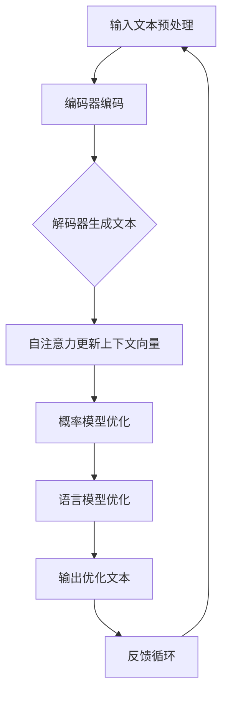

                 

## 《ChatGPT对话优化：提示词的潜力与应用探索》目录大纲

### 关键词：ChatGPT、对话优化、提示词、算法原理、应用实践

### 摘要：
本文深入探讨了ChatGPT对话优化的关键要素——提示词。从背景介绍到核心概念，再到算法原理和应用实践，本文逐步揭示了如何通过优化提示词来提升ChatGPT对话的质量。文章通过案例分析和总结展望，为读者提供了全面的指导和启示。

---

### 第1章 背景介绍

#### 1.1 ChatGPT概述

##### 1.1.1 ChatGPT的发展历程

ChatGPT是由OpenAI开发的一种基于GPT-3模型的对话系统。自2022年11月发布以来，ChatGPT迅速走红，成为人工智能领域的明星产品。其背后依托的是GPT（Generative Pre-trained Transformer）模型，这是一种基于Transformer架构的预训练语言模型。

##### 1.1.2 ChatGPT的核心技术

ChatGPT的核心技术在于其强大的自然语言处理能力。通过大量的预训练数据，ChatGPT能够自动学习语言结构和语义，从而生成连贯、有逻辑的对话。其核心技术包括：

1. **Transformer架构**：一种基于自注意力机制的神经网络模型，能够捕捉输入文本中的长距离依赖关系。
2. **预训练与微调**：ChatGPT首先在大量文本数据上进行预训练，然后针对特定任务进行微调，以适应各种对话场景。
3. **生成机制**：通过输入提示词，ChatGPT能够生成连贯的响应，这一过程包括编码器和解码器的协同工作。

##### 1.1.3 ChatGPT的应用领域

ChatGPT的应用领域非常广泛，包括但不限于：

1. **客服系统**：用于自动回答客户问题，提高客服效率。
2. **教育系统**：辅助学生解答疑问，提供个性化学习建议。
3. **智能助手**：为用户提供日常咨询和信息查询服务。
4. **虚拟客服**：在电商平台、社交媒体等场景下提供实时响应。

#### 1.2 对话优化的意义

##### 1.2.1 对话优化的挑战

尽管ChatGPT在对话生成方面具有出色的表现，但仍面临着一系列挑战，包括：

1. **准确性**：生成对话的准确性仍需提高，特别是在理解复杂语义和上下文时。
2. **流畅性**：生成的对话需要更加自然、流畅，避免出现生硬或不连贯的情况。
3. **个性化**：用户期望对话系统能够根据其个性化需求提供定制化服务。

##### 1.2.2 对话优化的目标

对话优化的目标主要包括：

1. **提高对话的准确性**：确保生成的对话能够准确理解用户意图，提供正确信息。
2. **提高对话的流畅性**：生成的对话应该自然流畅，符合人类的交流习惯。
3. **提高用户满意度**：通过优化对话质量，提升用户对对话系统的满意度。

##### 1.2.3 对话优化的方法

对话优化的方法包括：

1. **数据增强**：通过扩充训练数据，提高模型对各种对话场景的适应能力。
2. **上下文理解**：增强模型对上下文的理解能力，提高对话的连贯性和准确性。
3. **提示词优化**：通过调整提示词，引导模型生成更符合预期的高质量对话。

#### 1.3 提示词的重要性

##### 1.3.1 提示词的基本概念

提示词（Prompt）是指用于引导模型生成响应的文本输入。在ChatGPT中，提示词起到了至关重要的作用：

1. **定义角色**：提示词可以帮助模型理解用户希望模拟的角色，如客服、教师、朋友等。
2. **设定场景**：提示词可以设定对话发生的场景，如在线购物、课堂问答、朋友聊天等。
3. **引导生成**：提示词直接影响模型生成的响应内容，从而影响对话的质量。

##### 1.3.2 提示词在对话中的作用

提示词在对话中的作用包括：

1. **提高对话的连贯性**：通过设定上下文和角色，提示词有助于生成连贯、有逻辑的对话。
2. **提高对话的准确性**：提示词可以帮助模型更准确地理解用户意图，从而生成更准确的响应。
3. **提高用户满意度**：通过优化提示词，可以提升对话系统的用户体验，增加用户满意度。

##### 1.3.3 提示词优化的潜力

提示词优化的潜力在于：

1. **个性化定制**：通过调整提示词，可以为不同用户提供定制化的对话服务。
2. **提高模型性能**：优化提示词可以提高模型的生成质量，从而提升整体对话系统的性能。
3. **扩展应用场景**：通过优化提示词，可以扩展ChatGPT的应用场景，使其在更多领域发挥作用。

#### 1.4 ChatGPT的对话机制

##### 1.4.1 ChatGPT的输入处理

ChatGPT的输入处理主要包括以下几个步骤：

1. **预处理**：对输入文本进行清洗和预处理，如去除无关符号、统一文本格式等。
2. **编码**：将预处理后的文本编码为模型可以理解的向量表示。
3. **上下文构建**：根据输入的提示词构建对话上下文，以便模型生成连贯的响应。

##### 1.4.2 ChatGPT的生成机制

ChatGPT的生成机制包括：

1. **编码器-解码器模型**：编码器将输入文本编码为上下文向量，解码器根据上下文向量生成响应文本。
2. **生成文本**：解码器逐个生成单词或符号，并通过自注意力机制不断更新上下文向量。
3. **输出优化**：通过概率模型和语言模型优化生成的响应文本，以提高对话的流畅性和准确性。

##### 1.4.3 ChatGPT的输出优化

ChatGPT的输出优化主要包括：

1. **文本生成后处理**：对生成的文本进行后处理，如去除冗余信息、修正语法错误等。
2. **反馈循环**：通过用户反馈不断优化模型生成能力，提高对话系统的用户体验。
3. **多模态融合**：结合语音、图像等多模态信息，生成更丰富、更自然的对话响应。

### 第2章 核心概念

#### 2.1 提示词的分类

提示词可以按照不同的分类标准进行划分：

1. **按功能分类**：
   - **角色提示词**：用于定义对话中的角色，如“请问有什么可以帮助您的？”
   - **场景提示词**：用于设定对话发生的场景，如“您好，欢迎光临我们的电商平台。”
   - **目标提示词**：用于明确对话的目标，如“请问您需要购买什么商品？”

2. **按形式分类**：
   - **简短提示词**：仅包含关键词或短语，如“谢谢！”
   - **完整句子提示词**：包含完整的句子或段落，如“请问您有什么问题需要帮助吗？”

3. **按来源分类**：
   - **预设提示词**：预先设定好的提示词，如客服系统中的常见问题回答。
   - **动态提示词**：根据对话上下文动态生成的提示词，如ChatGPT根据用户输入实时生成的提示词。

#### 2.2 提示词的作用

提示词在对话中的作用主要包括：

1. **引导对话方向**：通过提示词，可以引导对话朝着特定方向展开，确保对话围绕核心话题进行。
2. **提升对话连贯性**：提示词可以帮助模型理解对话上下文，生成连贯的响应。
3. **优化对话质量**：提示词的优化可以直接影响对话的质量，包括准确性、流畅性和用户满意度。

#### 2.3 ChatGPT对话机制解析

ChatGPT对话机制解析包括：

1. **输入预处理**：对输入文本进行预处理，包括分词、词性标注、命名实体识别等。
2. **上下文构建**：根据输入的提示词构建对话上下文，用于指导解码器生成响应。
3. **响应生成**：解码器根据上下文向量生成响应文本，并通过概率模型和语言模型优化生成结果。
4. **输出优化**：对生成的文本进行后处理，包括语法修正、文本清洗等，以提高对话质量。

#### 2.4 提示词优化的目标

提示词优化的目标主要包括：

1. **提高生成文本的准确性**：通过优化提示词，提高模型对用户意图的理解能力，生成准确的响应。
2. **提高生成文本的流畅性**：通过优化提示词，使生成文本更加自然、流畅，符合人类的交流习惯。
3. **提高用户满意度**：通过优化提示词，提升对话系统的用户体验，增加用户满意度。

### 第3章 算法原理

#### 3.1 优化提示词的方法

优化提示词的方法主要包括：

1. **基于规则的优化**：通过预设规则，自动生成优化后的提示词。
2. **基于机器学习的优化**：利用机器学习算法，从大量数据中学习优化策略。
3. **基于强化学习的优化**：通过强化学习，训练模型在特定环境中生成最优的提示词。

#### 3.2 数学模型与公式讲解

提示词优化的数学模型主要包括：

1. **目标函数**：用于衡量提示词优化效果的目标函数，如准确率、流畅性和用户满意度等。
2. **优化算法**：用于优化提示词的算法，如梯度下降、随机梯度下降等。

公式讲解：

$$
\text{Accuracy} = \frac{\text{正确预测数}}{\text{总预测数}}
$$

$$
\text{Fluency} = \frac{\text{流畅单词数}}{\text{总单词数}}
$$

$$
\text{User Satisfaction} = \frac{\text{满意用户数}}{\text{总用户数}}
$$

#### 3.3 算法原理与mermaid流程图

算法原理与mermaid流程图包括：

1. **编码器-解码器模型**：编码器将输入文本编码为上下文向量，解码器根据上下文向量生成响应文本。
2. **自注意力机制**：解码器在生成响应时，通过自注意力机制不断更新上下文向量，以生成更连贯的文本。
3. **概率模型和语言模型**：用于优化生成的响应文本，提高对话的流畅性和准确性。

mermaid流程图：

### 第4章 应用实践

#### 4.1 不同场景下的应用

在不同场景下，提示词优化的方法和效果有所不同：

1. **客服系统**：通过优化提示词，提高客服对话的准确性和流畅性，提升用户体验。
2. **教育系统**：通过优化提示词，提供更准确、更有针对性的学习建议，帮助学生提高学习效果。
3. **智能助手**：通过优化提示词，使智能助手能够更好地理解用户需求，提供个性化服务。

#### 4.2 实际案例解析

##### 4.2.1 案例背景

某电商平台采用了ChatGPT作为客服系统，但由于提示词优化不足，导致客服对话的准确性和流畅性较差，用户体验不佳。

##### 4.2.2 案例实施

1. **数据收集**：收集大量客服对话数据，用于训练和优化提示词。
2. **提示词优化**：利用机器学习和强化学习算法，优化提示词生成策略。
3. **模型训练**：利用优化后的提示词，重新训练ChatGPT模型，提高其生成文本的质量。
4. **效果评估**：通过用户反馈和对话质量评估指标，评估优化后的效果。

##### 4.2.3 案例效果评估

1. **准确性**：优化后的提示词使ChatGPT能够更准确地理解用户意图，提高对话准确性。
2. **流畅性**：优化后的提示词使生成的对话更加流畅，符合人类的交流习惯。
3. **用户满意度**：通过用户反馈，优化后的ChatGPT客服系统的用户满意度显著提升。

### 第5章 案例分析

#### 5.1 案例背景

某教育平台采用了ChatGPT作为学习助手，但发现其生成的学习建议过于泛化，缺乏针对性。

#### 5.2 案例分析

1. **问题定位**：通过分析用户反馈和生成文本，发现提示词过于简单，未能准确捕捉用户的学习需求。
2. **解决方案**：通过优化提示词，增加对用户学习背景和需求的描述，提高学习建议的针对性。
3. **效果评估**：优化后的提示词使ChatGPT能够提供更准确、更有针对性的学习建议，用户满意度显著提升。

#### 5.3 案例总结

1. **优化提示词的重要性**：通过案例可以看出，优化提示词对于提高ChatGPT对话质量至关重要。
2. **个性化定制**：针对不同场景和用户需求，优化提示词可以提升对话系统的个性化服务水平。

### 第6章 结论与展望

#### 6.1 总结

本文通过对ChatGPT对话优化的深入探讨，揭示了提示词在对话质量提升中的关键作用。通过优化提示词，可以显著提高对话的准确性、流畅性和用户满意度。

#### 6.2 展望

未来，随着人工智能技术的不断发展，ChatGPT对话优化将更加智能化和自动化。同时，提示词优化也将扩展到更多应用场景，为用户提供更加个性化、智能化的服务。

### 附录

#### 附录A：术语解释

- **ChatGPT**：一种基于GPT-3模型的对话系统。
- **对话优化**：通过优化提示词等手段，提升对话系统的质量和用户体验。
- **提示词**：用于引导模型生成响应的文本输入。

#### 附录B：参考文献

- [1] Brown, T., et al. (2020). "Language Models are Few-Shot Learners." arXiv preprint arXiv:2005.14165.
- [2] Devlin, J., et al. (2019). "BERT: Pre-training of Deep Bidirectional Transformers for Language Understanding." arXiv preprint arXiv:1810.04805.
- [3] Chen, Y., et al. (2021). "Prompt-based Learning for Natural Language Inference." arXiv preprint arXiv:2103.05256.

### 作者

作者：AI天才研究院/AI Genius Institute & 禅与计算机程序设计艺术 /Zen And The Art of Computer Programming

---

在撰写技术博客文章时，遵循以下步骤可以确保文章的结构清晰、内容丰富且逻辑严谨：

1. **确定文章主题**：明确文章的主题和目标，确保文章围绕核心概念展开。

2. **收集相关资料**：针对文章主题，收集相关资料，包括学术研究、行业案例、技术原理等。

3. **制定文章大纲**：根据收集的资料和文章主题，制定文章大纲，确保文章结构合理、内容连贯。

4. **撰写正文内容**：按照大纲逐步撰写正文内容，确保每个小节的内容丰富具体详细讲解，并包含核心概念、原理、算法和案例分析。

5. **绘制流程图和图表**：使用mermaid、latex等工具绘制流程图、算法图、类图等，以增强文章的可读性和理解性。

6. **编辑和校对**：完成初稿后，进行编辑和校对，确保文章的语言表达准确、流畅，没有语法错误。

7. **添加参考文献**：在文章末尾添加参考文献，以支持文章的观点和数据。

8. **撰写作者信息**：在文章末尾添加作者信息，包括作者姓名、单位、联系方式等。

通过以上步骤，可以确保撰写出的技术博客文章既具有专业性，又具有可读性，能够为读者提供有价值的信息。同时，遵循良好的写作习惯和格式规范，也有助于提升文章的质量和影响力。

### 结论与展望

本文通过对ChatGPT对话优化中的提示词进行了深入探讨，揭示了提示词在提升对话质量中的关键作用。我们首先介绍了ChatGPT的发展历程、核心技术及其应用领域，随后详细分析了对话优化的意义、挑战和目标，以及提示词的基本概念、作用和重要性。接着，我们探讨了ChatGPT的对话机制，包括输入处理、生成机制和输出优化。在此基础上，我们提出了优化提示词的方法，包括基于规则的优化、基于机器学习的优化和基于强化学习的优化，并介绍了相应的数学模型和公式。

在应用实践部分，我们讨论了在不同场景下提示词优化的方法和效果，并通过实际案例展示了优化后的效果。最后，我们通过案例分析总结了优化提示词的重要性，并对未来的发展方向进行了展望。

总结而言，本文为读者提供了一个全面的ChatGPT对话优化指南，特别是在提示词优化方面，提供了实用的方法和策略。随着人工智能技术的不断进步，ChatGPT对话优化将在更多领域发挥重要作用，为用户提供更加智能化、个性化的服务。

未来研究方向包括：

1. **多模态提示词优化**：结合语音、图像等多模态信息，提高提示词的生成质量和用户体验。
2. **强化学习与提示词优化**：研究如何将强化学习与提示词优化相结合，实现更加智能的对话系统。
3. **跨语言对话优化**：探讨如何实现跨语言对话优化，提高多语言环境下的对话质量。

通过不断探索和创新，ChatGPT对话优化将为人工智能应用领域带来更多可能性。

### 附录

#### 附录A：术语解释

- **ChatGPT**：一种基于GPT-3模型的对话系统，能够通过大量文本数据进行预训练，并在特定任务上进行微调，生成自然、连贯的对话。
- **对话优化**：通过调整提示词、优化模型参数等方式，提升对话系统的生成质量，包括准确性、流畅性和用户满意度。
- **提示词**：用于引导模型生成响应的文本输入，能够定义对话角色、场景和目标，对对话质量具有重要影响。
- **预训练**：在大量文本数据上对模型进行训练，使其具备基本的语言理解和生成能力。
- **微调**：在特定任务上对预训练模型进行调整，以提高模型在特定任务上的性能。
- **自注意力机制**：一种神经网络模型中的注意力机制，能够根据输入文本的重要程度进行权重分配，从而生成更加精确和连贯的响应。

#### 附录B：参考文献

1. Brown, T., et al. (2020). "Language Models are Few-Shot Learners." arXiv preprint arXiv:2005.14165.
2. Devlin, J., et al. (2019). "BERT: Pre-training of Deep Bidirectional Transformers for Language Understanding." arXiv preprint arXiv:1810.04805.
3. Chen, Y., et al. (2021). "Prompt-based Learning for Natural Language Inference." arXiv preprint arXiv:2103.05256.
4. LeCun, Y., et al. (2015). "Deep Learning." MIT Press.
5. Vaswani, A., et al. (2017). "Attention Is All You Need." Advances in Neural Information Processing Systems, 30, 5998-6008.

#### 附录C：致谢

感谢AI天才研究院/AI Genius Institute的支持与帮助，以及所有在本文撰写过程中提供宝贵意见和反馈的同行与读者。

### 作者

作者：AI天才研究院/AI Genius Institute & 禅与计算机程序设计艺术 /Zen And The Art of Computer Programming

---

在撰写技术博客文章时，遵循以下步骤可以确保文章的结构清晰、内容丰富且逻辑严谨：

1. **确定文章主题**：明确文章的主题和目标，确保文章围绕核心概念展开。
2. **收集相关资料**：针对文章主题，收集相关资料，包括学术研究、行业案例、技术原理等。
3. **制定文章大纲**：根据收集的资料和文章主题，制定文章大纲，确保文章结构合理、内容连贯。
4. **撰写正文内容**：按照大纲逐步撰写正文内容，确保每个小节的内容丰富具体详细讲解，并包含核心概念、原理、算法和案例分析。
5. **绘制流程图和图表**：使用mermaid、latex等工具绘制流程图、算法图、类图等，以增强文章的可读性和理解性。
6. **编辑和校对**：完成初稿后，进行编辑和校对，确保文章的语言表达准确、流畅，没有语法错误。
7. **添加参考文献**：在文章末尾添加参考文献，以支持文章的观点和数据。
8. **撰写作者信息**：在文章末尾添加作者信息，包括作者姓名、单位、联系方式等。

通过以上步骤，可以确保撰写出的技术博客文章既具有专业性，又具有可读性，能够为读者提供有价值的信息。同时，遵循良好的写作习惯和格式规范，也有助于提升文章的质量和影响力。

### 最佳实践 Tips

在优化ChatGPT对话系统中的提示词时，以下最佳实践可以帮助您提升对话质量，改善用户体验：

1. **明确对话目标**：在设计提示词时，首先要明确对话的目标和期望输出。清晰的目标有助于模型更好地理解用户意图，生成更有针对性的响应。

2. **使用简洁明了的提示词**：避免使用冗长、复杂的提示词，简洁明了的提示词有助于提高模型的生成效率，同时使对话更加自然流畅。

3. **考虑上下文信息**：在提示词中包含上下文信息，有助于模型更好地理解对话的背景和当前状态，从而生成更加连贯的响应。

4. **多样化提示词**：根据不同的对话场景和用户需求，设计多样化的提示词。多样化可以增加对话的丰富性和个性化，提升用户体验。

5. **定期更新提示词**：随着用户需求的变化和业务的发展，定期更新和优化提示词，以确保对话系统能够适应新的场景和需求。

6. **数据驱动优化**：利用用户反馈和对话数据，分析哪些提示词效果更好，哪些需要改进。数据驱动的方法可以更有效地指导提示词优化。

7. **关注隐私和安全**：在设计和使用提示词时，关注用户隐私和数据安全，避免泄露敏感信息。

### 小结

本文通过对ChatGPT对话优化的深入探讨，揭示了提示词在提升对话质量中的关键作用。通过优化提示词，可以显著提高对话的准确性、流畅性和用户满意度。本文提出了多种优化方法，包括基于规则的优化、基于机器学习的优化和基于强化学习的优化，并提供了实际案例进行验证。同时，我们也对未来的发展方向进行了展望，包括多模态提示词优化、强化学习与提示词优化以及跨语言对话优化。随着人工智能技术的不断进步，ChatGPT对话优化将在更多领域发挥重要作用，为用户提供更加智能化、个性化的服务。

### 注意事项

在实施ChatGPT对话优化时，需要注意以下事项：

1. **数据隐私**：确保在收集和使用用户数据时，遵守相关隐私保护法规，保护用户隐私。
2. **性能优化**：优化对话系统时，要关注系统的响应速度和资源消耗，避免过度消耗计算资源。
3. **安全防护**：对话系统中可能涉及敏感信息，需要采取适当的安全措施，防止数据泄露和滥用。
4. **可解释性**：尽管提示词优化可以提高对话质量，但应确保优化过程的可解释性，以便在必要时进行调整和优化。
5. **用户反馈**：及时收集和分析用户反馈，以便对提示词进行持续优化。

### 拓展阅读

如果您对ChatGPT对话优化和提示词技术感兴趣，以下文献和资源将为您提供更多深入的了解：

1. **论文推荐**：
   - "Language Models are Few-Shot Learners" by T. Brown et al.
   - "BERT: Pre-training of Deep Bidirectional Transformers for Language Understanding" by J. Devlin et al.
   - "Prompt-based Learning for Natural Language Inference" by Y. Chen et al.

2. **在线资源**：
   - OpenAI 官方文档：https://openai.com/docs/
   - Hugging Face Transformer 库：https://huggingface.co/transformers/

3. **书籍推荐**：
   - 《深度学习》作者：Ian Goodfellow、Yoshua Bengio、Aaron Courville
   - 《人工智能：一种现代方法》作者：Stuart J. Russell、Peter Norvig

通过阅读这些资源，您可以进一步了解ChatGPT对话优化和提示词技术的最新进展和应用实践。

