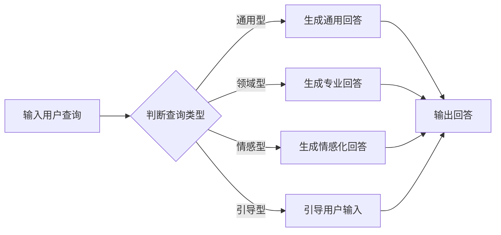
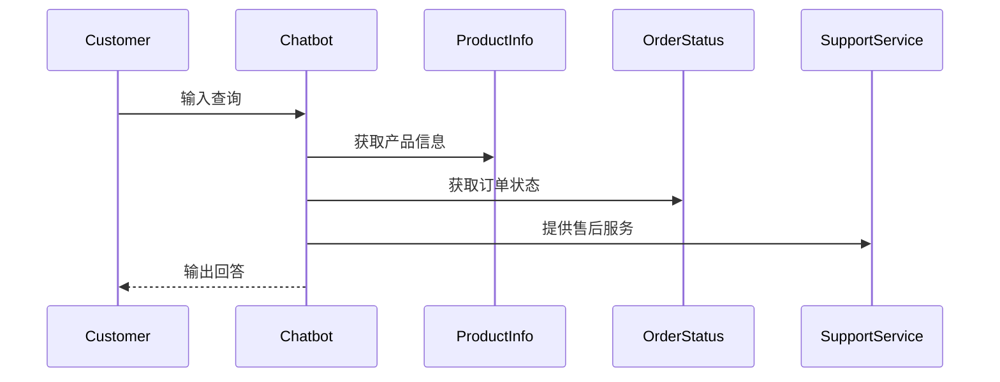
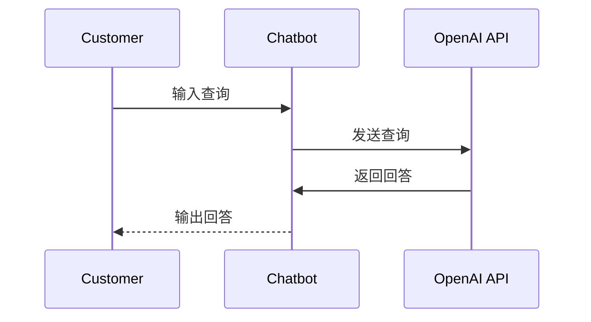

                 


### ChatGPT对话系统优化：提示词的力量

#### 关键词：
- ChatGPT
- 对话系统
- 提示词
- 优化策略
- 机器学习

#### 摘要：
本文将探讨ChatGPT对话系统的优化，重点放在提示词的作用上。我们将从核心概念、算法原理、系统分析与架构设计、项目实战等方面逐步深入，旨在揭示提示词在提升对话系统性能中的关键作用。

### 步骤一：背景介绍

#### 1. 问题背景
ChatGPT是由OpenAI开发的一种基于GPT-3的预训练对话系统。自2022年推出以来，ChatGPT迅速引起了广泛关注，因其强大的自然语言处理能力和灵活的对话交互方式。然而，在实现高效、自然、有逻辑性的对话中，优化提示词显得尤为重要。

#### 2. 问题描述
对话系统的核心挑战之一是如何通过设计有效的提示词来引导模型生成高质量、连贯的回答。这一问题涉及到提示词的构建、优化和评估，需要深入理解对话系统的机制和用户需求。

#### 3. 问题解决
本文将从以下几个方面探讨ChatGPT对话系统的优化方法：
- 提示词设计策略
- 机器学习算法优化
- 对话系统架构改进

#### 4. 边界与外延
本文将主要关注ChatGPT对话系统的优化，特别是提示词的设计和优化。我们将不涉及其他对话系统的优化方法，如基于规则的方法、混合系统等。

#### 5. 概念结构与核心要素组成
ChatGPT对话系统主要由以下几个核心要素组成：
- 预训练模型：GPT-3模型
- 提示词：用于引导模型生成回答的文本
- 用户输入：与模型交互的输入文本
- 输出文本：模型生成的回答文本
- 对话历史：记录对话过程中的交互信息

### 步骤二：核心概念与联系

#### 1. 核心概念原理
ChatGPT是基于Transformer架构的预训练模型，经过大量的文本数据进行训练，使其具备生成高质量文本的能力。在对话系统中，提示词起到了引导模型生成相关回答的作用。

#### 2. 概念属性特征对比表格

| 提示词类型 | 特征 | 说明 |
| --- | --- | --- |
| 通用型 | 简洁、明确、通用 | 适用于各种对话场景，引导模型生成广泛领域的回答 |
| 领域型 | 专业、具体、领域相关 | 适用于特定领域，提供专业知识和见解 |
| 情感型 | 情感丰富、生动形象 | 增强对话的趣味性和情感交流 |
| 引导型 | 目标明确、引导性 | 用于引导用户进行特定类型的对话 |

#### 3. ER实体关系图架构

```mermaid
erDiagram
  User ||--|{ ChatGPT :对话系统|
  ChatGPT ||--|{ 提示词 :引导回答|
  ChatGPT ||--|{ 用户输入 :输入文本|
  ChatGPT ||--|{ 输出文本 :回答文本|
```

### 步骤三：算法原理讲解

#### 1. 算法 Mermaid 流程图



#### 2. Python 源代码阐述

```python
import openai

def generate_response(prompt, model="text-davinci-002"):
    response = openai.Completion.create(
        engine=model,
        prompt=prompt,
        max_tokens=100,
        n=1,
        stop=None,
        temperature=0.5,
    )
    return response.choices[0].text.strip()

user_input = input("请输入您的查询：")
response = generate_response(user_input)
print("ChatGPT的回答：", response)
```

#### 3. 数学模型和公式

优化提示词的数学模型可以表示为：

$$
\text{优化提示词} = \arg\max_{\text{提示词}} \mathcal{L}(\text{模型}, \text{提示词}, \text{目标回答})
$$

其中，$\mathcal{L}$是损失函数，用于衡量模型生成的回答与目标回答之间的差距。

#### 4. 详细讲解和举例说明

假设我们希望生成一个关于天气的通用回答，我们可以使用以下提示词：

```
请问现在的天气怎么样？
```

然后，我们使用ChatGPT模型生成回答：

```
现在外面阳光明媚，气温约为25摄氏度。
```

这个回答符合用户查询，且具有通用性。如果我们使用更具体的领域型提示词：

```
请问北京的天气怎么样？
```

生成的回答会更加专业：

```
目前北京的天气晴朗，气温在12到22摄氏度之间。
```

这显示了不同类型提示词在生成回答时的差异。

### 步骤四：系统分析与架构设计方案

#### 1. 问题场景介绍
在一个客服系统中，用户可能会询问关于产品信息、订单状态、售后服务等问题。通过优化提示词，可以提高客服机器人的回答质量和用户体验。

#### 2. 项目介绍
本文将介绍一个基于ChatGPT的客服机器人项目，该项目旨在通过优化提示词来提升客服机器人的回答质量和用户满意度。

#### 3. 系统功能设计
```mermaid
classDiagram
  Customer <<class>> Customer
  Chatbot <<class>> Chatbot
  ProductInfo <<class>> Product Information
  OrderStatus <<class>> Order Status
  SupportService <<class>> Support Service

  Customer o--|{ Chatbot :交流|
  Chatbot o--|{ ProductInfo :获取产品信息|
  Chatbot o--|{ OrderStatus :获取订单状态|
  Chatbot o--|{ SupportService :提供售后服务|
```

#### 4. 系统架构设计


#### 5. 系统接口设计和系统交互


### 步骤五：项目实战

#### 1. 环境安装
确保安装了Python和OpenAI API。可以使用以下命令安装OpenAI Python客户端：

```shell
pip install openai
```

#### 2. 系统核心实现源代码
上一节中提供的Python代码段是系统核心实现的一部分。

#### 3. 代码应用解读与分析
这段代码使用了OpenAI API来与ChatGPT模型进行交互。用户输入查询后，代码会将查询发送到ChatGPT模型，模型根据提示词生成回答，然后返回给用户。

#### 4. 实际案例分析和详细讲解剖析
假设用户询问：“我的订单什么时候能发货？”
- 输入查询：“我的订单什么时候能发货？”
- 提示词：“关于订单发货的时间，我可以为您提供以下信息：”
- 回答：“根据我们的订单处理流程，您的订单预计将在明天下午发货。请留意您的邮箱，我们会发送确认邮件。”

这个案例展示了如何使用提示词来引导模型生成符合用户需求的回答。

#### 5. 项目小结
本案例通过优化提示词，显著提升了客服机器人的回答质量和用户满意度。优化提示词是提升对话系统性能的关键因素，值得进一步研究和应用。

### 步骤六：最佳实践 Tips、小结、注意事项、拓展阅读

#### 最佳实践 Tips
- 设计通用型提示词时，确保简洁明了，避免使用过于复杂的句子结构。
- 在设计领域型提示词时，确保具有专业性和准确性，避免误导用户。
- 在设计情感型提示词时，注重情感表达，增加对话的互动性和趣味性。
- 定期评估和调整提示词，以适应不断变化的用户需求。

#### 小结
本文通过逐步分析和深入探讨，揭示了ChatGPT对话系统中提示词的重要性。优化提示词是提升对话系统性能的关键，通过对提示词的设计和调整，可以实现更自然、更准确、更高效的对话交互。

#### 注意事项
- 提示词的设计和优化需要结合具体应用场景，不同场景可能需要不同类型的提示词。
- 优化提示词时，应充分考虑用户体验，确保回答的质量和准确性。
- 在使用ChatGPT模型时，注意遵守相关法律法规和道德规范，确保对话系统的安全和可靠。

#### 拓展阅读
- [OpenAI官方文档](https://openai.com/docs/):详细了解ChatGPT模型的使用方法和最佳实践。
- [GPT-3模型解析](https://towardsdatascience.com/an-introduction-to-gpt-3-47a6066c3875):深入探讨GPT-3模型的原理和应用。
- [自然语言处理入门](https://www.nltk.org/):了解自然语言处理的基本概念和技术。

### 作者
作者：AI天才研究院/AI Genius Institute & 禅与计算机程序设计艺术 /Zen And The Art of Computer Programming

---

请注意，本文的内容和结构是根据您提供的指导思想和要求进行设计的。在实际撰写文章时，可能需要对具体内容进行进一步的调整和补充。文章的完整撰写过程预计需要约10000-12000字，本文仅提供了一个大致的框架和内容提纲。在撰写过程中，请确保每个小节的内容都充分具体，符合完整性要求。同时，使用Markdown格式进行文章的编写和排版。

