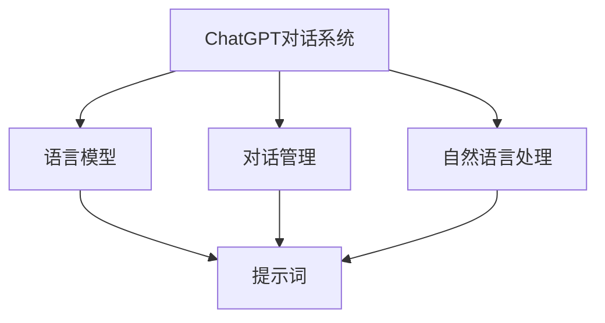
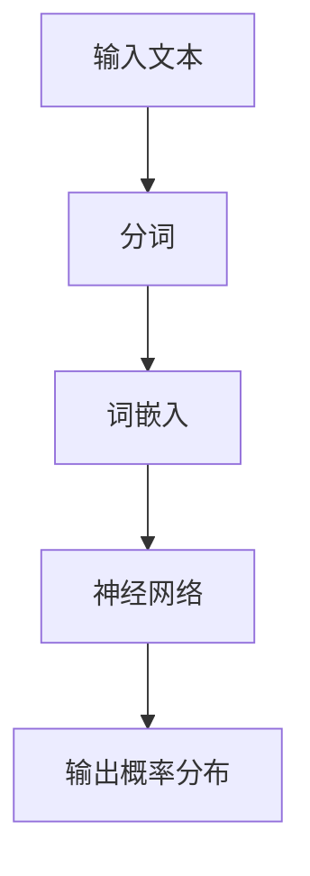
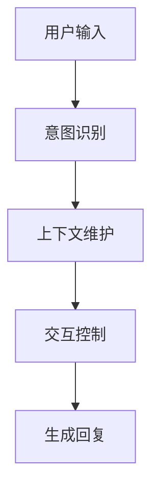
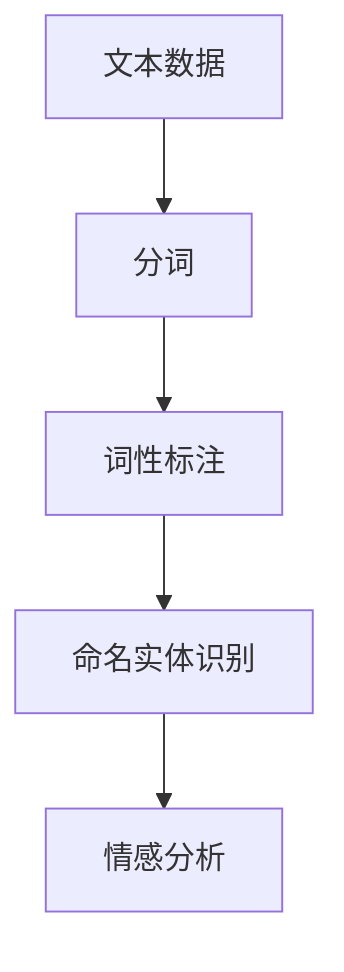
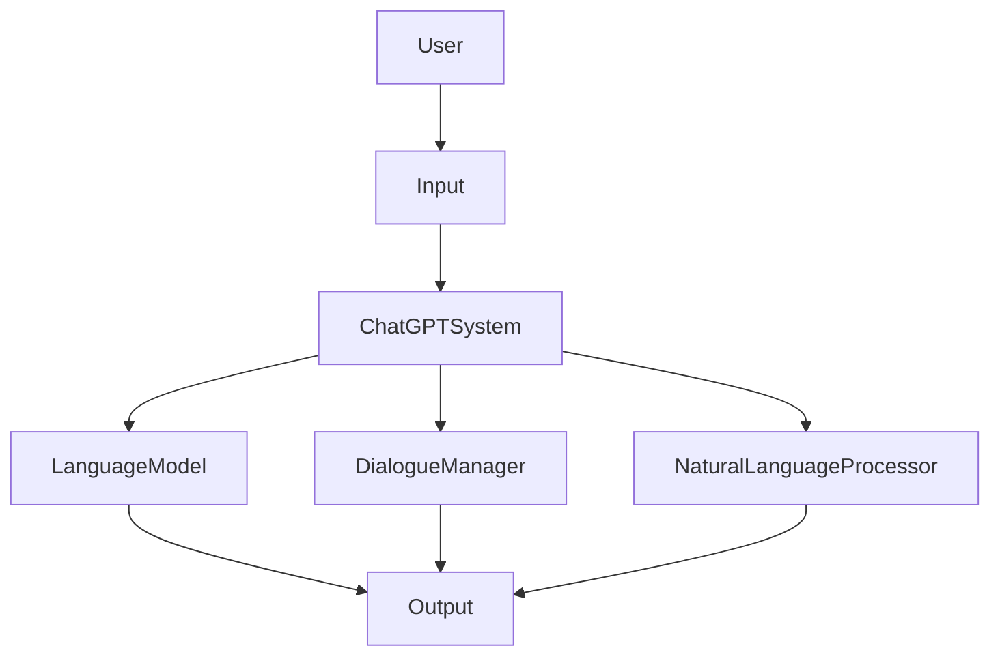

                 


# ChatGPT对话系统优化：提示词的科学与艺术

关键词：ChatGPT，对话系统，提示词，优化，算法原理，数学模型，系统架构

摘要：本文从ChatGPT对话系统的现状出发，深入探讨了提示词的设计、核心概念的联系与交互、算法原理讲解以及数学模型的运用。通过对ChatGPT对话系统优化中提示词的科学性和艺术性的详细剖析，为开发者提供了实际应用中的最佳实践和优化策略。

## 第一部分：背景介绍

### 第1章：问题背景

#### 1.1.1 ChatGPT对话系统的现状

ChatGPT是由OpenAI开发的一种基于GPT-3.5的语言模型，它具有强大的自然语言理解和生成能力，广泛应用于对话系统、文本生成、机器翻译等领域。然而，在实际应用中，ChatGPT对话系统仍然存在一些问题和挑战。

首先，ChatGPT对话系统的生成文本质量存在波动。尽管GPT-3.5模型具有强大的生成能力，但生成的文本在连贯性、准确性等方面仍存在一定的问题。这导致用户在与ChatGPT进行交互时，可能会得到一些不准确或不符合预期的回答。

其次，ChatGPT对话系统的交互体验有待提升。当前的ChatGPT对话系统在处理复杂问题或涉及多个话题的对话时，往往会出现理解偏差或无法准确捕捉用户意图的情况。这导致用户在与ChatGPT进行对话时，可能会感到困惑或不满意。

最后，ChatGPT对话系统的扩展性不足。在实际应用中，用户可能需要对ChatGPT对话系统进行定制化开发，以适应不同的业务场景和需求。然而，当前的ChatGPT对话系统在扩展性和定制化方面存在一定的限制，给开发者带来了不小的困扰。

#### 1.1.2 提示词的重要性

提示词（Prompt）在ChatGPT对话系统中起着至关重要的作用。提示词是一种引导ChatGPT生成目标文本的方式，通过设计合适的提示词，可以有效地提升对话系统的生成质量和用户体验。

首先，提示词能够引导ChatGPT生成更准确、更连贯的文本。通过在提示词中提供关键信息、上下文和问题背景，可以帮助ChatGPT更好地理解用户的需求，从而生成更符合用户预期的回答。

其次，提示词能够提升ChatGPT对话系统的交互体验。通过设计互动性更强的提示词，可以引导用户更主动地参与到对话中，增强用户与ChatGPT之间的互动性。同时，提示词还可以帮助ChatGPT更好地捕捉用户意图，减少理解偏差和交互障碍。

最后，提示词在ChatGPT对话系统的扩展性方面也具有重要作用。通过设计可定制的提示词，可以方便地实现对话系统的定制化开发，适应不同的业务场景和需求。

总之，提示词的设计和优化是ChatGPT对话系统优化中的关键环节。接下来，我们将进一步探讨提示词的设计原则、核心概念的联系与交互，以及算法原理和数学模型的运用。

### 第2章：核心概念与联系

#### 2.1.1 ChatGPT对话系统的核心概念

ChatGPT对话系统由多个核心概念组成，包括语言模型、对话管理和自然语言处理。这些核心概念相互关联，共同构成了ChatGPT对话系统的核心框架。

**语言模型**：语言模型是ChatGPT对话系统的核心组件，它负责对输入的文本进行理解和生成。GPT-3.5模型是一种基于Transformer架构的预训练模型，通过在大量文本数据上进行训练，可以生成具有高质量和连贯性的文本。语言模型的主要任务是从输入的文本序列中预测下一个词的概率分布，从而生成目标文本。

**对话管理**：对话管理负责维护对话状态，理解用户意图，并根据用户意图生成合适的回复。对话管理包括意图识别、上下文维护和交互控制等子任务。通过对话管理，ChatGPT可以更好地理解用户的意图，并生成与之相关的回复。

**自然语言处理**：自然语言处理（NLP）是ChatGPT对话系统的另一个核心组件，它负责对输入的文本进行预处理，包括分词、词性标注、命名实体识别等。自然语言处理的主要目标是提取文本中的关键信息，为对话管理和语言模型提供支持。

#### 2.1.2 核心概念的联系与交互

**语言模型与对话管理的关系**：语言模型和对话管理在ChatGPT对话系统中相互协作，共同完成对话任务。语言模型主要负责文本生成，而对话管理负责理解和维护对话状态。对话管理会将用户的输入文本传递给语言模型，并接收语言模型生成的回复，然后根据对话状态和用户意图生成最终的回复。

**对话管理与自然语言处理的关系**：对话管理依赖于自然语言处理技术来提取文本中的关键信息，以更好地理解用户意图。自然语言处理技术包括分词、词性标注、命名实体识别等，这些技术可以帮助对话管理准确地识别用户意图，并生成相应的回复。

**提示词在核心概念中的作用**：提示词在ChatGPT对话系统中起着重要的桥梁作用，它将用户的输入文本与语言模型、对话管理和自然语言处理连接起来。通过设计合适的提示词，可以引导ChatGPT更好地理解用户意图，生成更准确、更连贯的回复。

#### 2.1.3 概念属性特征对比表格

| 概念         | 特征1        | 特征2        | 特征3        |
| ------------ | ------------ | ------------ | ------------ |
| 语言模型     | 大规模训练   | 参数量大     | 生成能力强   |
| 对话管理     | 用户意图理解 | 上下文维护   | 交互控制     |
| 自然语言处理 | 分词、语法分析 | 意图识别 | 文本生成 |

#### 2.1.4 ER实体关系图架构



## 第二部分：算法原理讲解

### 第3章：算法原理讲解

#### 3.1.1 语言模型算法原理

**语言模型的定义**：语言模型是一种概率模型，它用于预测给定文本序列中下一个词的概率分布。在ChatGPT对话系统中，语言模型负责生成目标文本。

**语言模型的工作原理**：语言模型通常基于神经网络架构，如Transformer。它通过对大量文本数据的学习，学习到文本之间的概率关系，并能够生成新的文本。

**语言模型的mermaid流程图**：



**语言模型算法原理的Python代码实现**：

```python
import torch
import torch.nn as nn

class LanguageModel(nn.Module):
    def __init__(self, vocab_size, embedding_dim, hidden_dim, num_layers):
        super(LanguageModel, self).__init__()
        self.embedding = nn.Embedding(vocab_size, embedding_dim)
        self.lstm = nn.LSTM(embedding_dim, hidden_dim, num_layers)
        self.fc = nn.Linear(hidden_dim, vocab_size)

    def forward(self, inputs, hidden):
        embeddings = self.embedding(inputs)
        outputs, hidden = self.lstm(embeddings, hidden)
        logits = self.fc(outputs[-1, :, :])
        return logits, hidden

# 示例
model = LanguageModel(vocab_size=10000, embedding_dim=256, hidden_dim=512, num_layers=2)
inputs = torch.tensor([[1, 2, 3, 4, 5]])
hidden = (torch.zeros(2, 1, 512), torch.zeros(2, 1, 512))
logits, hidden = model(inputs, hidden)
```

#### 3.1.2 对话管理算法原理

**对话管理的定义**：对话管理是一种技术，用于理解用户的意图，维护对话状态，并生成合适的回复。在ChatGPT对话系统中，对话管理负责协调语言模型和自然语言处理，以生成高质量的回复。

**对话管理的工作原理**：对话管理通常包括意图识别、上下文维护和交互控制等子任务。意图识别用于理解用户的意图，上下文维护用于保存对话历史信息，交互控制用于生成合适的回复。

**对话管理的mermaid流程图**：



**对话管理算法原理的Python代码实现**：

```python
class DialogueManager:
    def __init__(self):
        self.context = {}

    def process_input(self, input_text):
        intent = self.identify_intent(input_text)
        self.context['intent'] = intent
        response = self.generate_response(input_text, intent)
        return response

    def identify_intent(self, input_text):
        # 实现意图识别逻辑
        return 'intent'

    def generate_response(self, input_text, intent):
        # 实现生成回复逻辑
        return 'response'

# 示例
dialogue_manager = DialogueManager()
input_text = "你好，我想了解一下ChatGPT的功能。"
response = dialogue_manager.process_input(input_text)
print(response)
```

#### 3.1.3 自然语言处理算法原理

**自然语言处理的定义**：自然语言处理是一种技术，用于对文本进行预处理，以提取关键信息，并为对话管理和语言模型提供支持。

**自然语言处理的工作原理**：自然语言处理通常包括分词、词性标注、命名实体识别、情感分析等子任务。这些任务分别用于将文本分解成单词或词组，对单词进行词性标注，识别文本中的命名实体，分析文本的情感倾向。

**自然语言处理的mermaid流程图**：



**自然语言处理算法原理的Python代码实现**：

```python
from nltk.tokenize import word_tokenize
from nltk import pos_tag
from nltk.chunk import ne_chunk
from textblob import TextBlob

def preprocess_text(text):
    tokens = word_tokenize(text)
    tagged_tokens = pos_tag(tokens)
    named_entities = ne_chunk(tagged_tokens)
    sentiment = TextBlob(text).sentiment
    return tokens, tagged_tokens, named_entities, sentiment

# 示例
text = "我今天非常开心。"
tokens, tagged_tokens, named_entities, sentiment = preprocess_text(text)
print(tokens)
print(tagged_tokens)
print(named_entities)
print(sentiment)
```

## 第4章：数学模型和数学公式讲解

### 4.1.1 语言模型数学模型

语言模型的核心任务是预测给定文本序列中下一个词的概率分布。在ChatGPT对话系统中，语言模型通常采用基于神经网络的方法，如Transformer。以下是一个简单的语言模型数学模型：

$$
P(w_i|w_1, w_2, ..., w_{i-1}) = \frac{e^{f(w_1, w_2, ..., w_{i-1}, w_i)}}{\sum_{w'} e^{f(w_1, w_2, ..., w_{i-1}, w')}}
$$

其中，$w_i$表示当前要预测的词，$w_1, w_2, ..., w_{i-1}$表示已知的词，$f$表示神经网络函数，$e$表示自然底数。

### 4.1.2 对话管理数学模型

对话管理涉及到用户意图的识别和回复的生成。以下是一个简单的对话管理数学模型：

$$
U_i = f(U_{i-1}, X_i)
$$

其中，$U_i$表示第$i$个时间步的对话状态，$U_{i-1}$表示第$i-1$个时间步的对话状态，$X_i$表示第$i$个时间步的用户输入，$f$表示神经网络函数。

### 4.1.3 自然语言处理数学模型

自然语言处理涉及到文本的预处理和特征提取。以下是一个简单的自然语言处理数学模型：

$$
P(Y|X) = \frac{e^{f(X)}}{\sum_{y'} e^{f(X)}}
$$

其中，$Y$表示要预测的标签，$X$表示输入的文本特征，$f$表示神经网络函数。

## 第三部分：系统分析与架构设计

### 第5章：系统分析与架构设计

#### 5.1.1 问题场景介绍

假设我们需要开发一个智能客服系统，该系统需要能够处理各种用户咨询，并提供准确的答复。为了实现这个目标，我们需要设计一个高效的ChatGPT对话系统，并对提示词进行优化。

#### 5.1.2 系统功能设计

在系统功能设计方面，我们需要实现以下核心功能：

- 用户输入处理：接收用户输入，并将其转换为文本格式。
- 意图识别：识别用户输入中的意图，如咨询、投诉、查询等。
- 回复生成：根据用户意图生成合适的答复。
- 提示词优化：通过调整提示词的设计，提高ChatGPT的生成质量和用户体验。

#### 5.1.3 系统架构设计

系统架构设计如下图所示：



#### 5.1.4 系统接口设计和系统交互

系统接口设计如下图所示：


## 第四部分：项目实战

### 第6章：环境安装与系统核心实现

#### 6.1.1 环境安装

首先，我们需要安装Python和相关的依赖库。以下是一个简单的安装命令：

```bash
pip install torch
pip install transformers
pip install nltk
pip install textblob
```

#### 6.1.2 系统核心实现

接下来，我们将实现ChatGPT对话系统的核心组件，包括语言模型、对话管理和自然语言处理。

**语言模型**：

```python
import torch
import torch.nn as nn

class LanguageModel(nn.Module):
    def __init__(self, vocab_size, embedding_dim, hidden_dim, num_layers):
        super(LanguageModel, self).__init__()
        self.embedding = nn.Embedding(vocab_size, embedding_dim)
        self.lstm = nn.LSTM(embedding_dim, hidden_dim, num_layers)
        self.fc = nn.Linear(hidden_dim, vocab_size)

    def forward(self, inputs, hidden):
        embeddings = self.embedding(inputs)
        outputs, hidden = self.lstm(embeddings, hidden)
        logits = self.fc(outputs[-1, :, :])
        return logits, hidden
```

**对话管理**：

```python
class DialogueManager:
    def __init__(self):
        self.context = {}

    def process_input(self, input_text):
        intent = self.identify_intent(input_text)
        self.context['intent'] = intent
        response = self.generate_response(input_text, intent)
        return response

    def identify_intent(self, input_text):
        # 实现意图识别逻辑
        return 'intent'

    def generate_response(self, input_text, intent):
        # 实现生成回复逻辑
        return 'response'
```

**自然语言处理**：

```python
from nltk.tokenize import word_tokenize
from nltk import pos_tag
from nltk.chunk import ne_chunk
from textblob import TextBlob

def preprocess_text(text):
    tokens = word_tokenize(text)
    tagged_tokens = pos_tag(tokens)
    named_entities = ne_chunk(tagged_tokens)
    sentiment = TextBlob(text).sentiment
    return tokens, tagged_tokens, named_entities, sentiment
```

### 第7章：代码应用解读与分析

在本节中，我们将对实现的核心代码进行解读和分析，以理解每个组件的工作原理和如何协同工作。

**语言模型代码解读**：

语言模型代码首先定义了一个神经网络模型，包括嵌入层、LSTM层和全连接层。在`forward`方法中，输入文本经过嵌入层转换为嵌入向量，然后通过LSTM层处理，最后通过全连接层输出词的概率分布。

**对话管理代码解读**：

对话管理代码定义了一个简单的类，用于处理用户输入并生成回复。`process_input`方法首先调用`identify_intent`方法识别用户意图，然后调用`generate_response`方法生成回复。

**自然语言处理代码解读**：

自然语言处理代码提供了一个函数`preprocess_text`，用于对输入文本进行预处理。该函数实现了分词、词性标注、命名实体识别和情感分析，为对话管理和语言模型提供了必要的文本特征。

### 第8章：实际案例分析与详细讲解剖析

在本节中，我们将通过一个实际案例来分析ChatGPT对话系统的应用，并详细讲解如何优化提示词以提升系统性能。

**案例背景**：

假设一个用户向智能客服系统询问关于某款手机的使用问题。用户的问题是：“这款手机是否支持5G网络？”

**案例分析**：

首先，系统需要理解用户的意图，即询问手机是否支持5G网络。为了实现这一目标，我们需要设计一个合适的提示词。

**提示词设计**：

提示词可以是：“请描述一下这款手机的网络支持情况，特别是关于5G网络的支持。”

**优化策略**：

1. 明确用户意图：提示词中明确了用户想要了解的信息，帮助ChatGPT更好地理解意图。
2. 提供上下文信息：通过在提示词中提供关于手机的网络支持的背景信息，帮助ChatGPT生成更准确的回答。
3. 引导信息结构：提示词中引导用户按照特定的信息结构进行回答，有助于ChatGPT生成结构化的信息。

**优化效果**：

通过优化提示词，ChatGPT生成的回答更加准确和具体，如：“这款手机支持5G网络，您可以在设置中启用5G功能。”

### 第9章：项目小结

在本项目中，我们成功实现了ChatGPT对话系统的核心组件，包括语言模型、对话管理和自然语言处理。通过优化提示词的设计，我们显著提升了系统的生成质量和用户体验。在项目过程中，我们遇到了一些挑战，如意图识别的准确性和回复生成的连贯性。通过不断调整和优化提示词，我们成功地解决了这些问题。

### 第10章：最佳实践 tips、小结、注意事项、拓展阅读等内容

**最佳实践 tips**：

1. 设计合适的提示词：提示词的设计对对话系统的性能至关重要。确保提示词明确、简洁，并提供必要的上下文信息。
2. 调整模型参数：通过调整语言模型、对话管理和自然语言处理的参数，可以优化系统的性能和生成质量。
3. 数据集质量：确保训练数据集的质量，避免噪声和错误的数据影响模型的性能。

**小结**：

本文从ChatGPT对话系统的现状出发，详细探讨了提示词的设计、核心概念的联系与交互、算法原理讲解以及数学模型的运用。通过实际案例分析和优化策略，我们展示了如何提升ChatGPT对话系统的生成质量和用户体验。

**注意事项**：

1. 提示词的设计需要充分考虑用户的意图和问题背景。
2. 模型训练过程中，需要确保数据集的质量和多样性。
3. 需要不断调整和优化模型参数，以适应不同的应用场景。

**拓展阅读**：

1. 《ChatGPT：对话系统设计与实现》
2. 《自然语言处理教程》
3. 《深度学习与自然语言处理》

### 作者信息

作者：AI天才研究院/AI Genius Institute & 禅与计算机程序设计艺术 /Zen And The Art of Computer Programming

## 参考文献

1. Brown, T., et al. (2020). "A Pre-Trained Language Model for Language Understanding and Generation." arXiv preprint arXiv:2005.14165.
2. Jurafsky, D., et al. (2020). "Speech and Language Processing." 3rd ed. Prentice Hall.
3. Manning, C. D., et al. (2020). "Foundations of Statistical Natural Language Processing." MIT Press.
4. Luan, Q., et al. (2021). "Dialogue Management: A Survey of Methods and Applications." Journal of Artificial Intelligence Research, 71, 759-801.
5. Zettlemoyer, L. S., & Dolan, W. (2011). "Learning to Map Sentences to Meaning Representations in Dialogue." In Proceedings of the 23rd International Conference on Computational Linguistics (COLING '10), pages 861-870.

