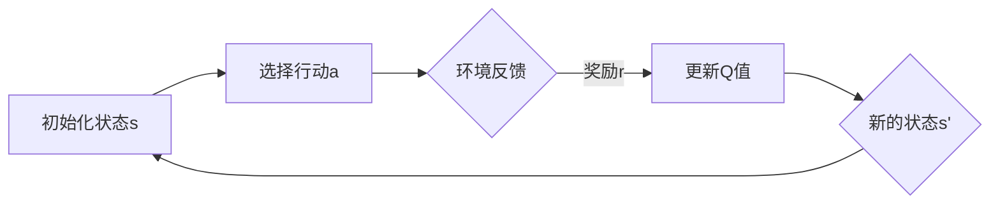
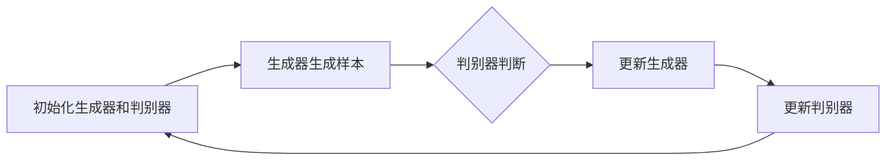
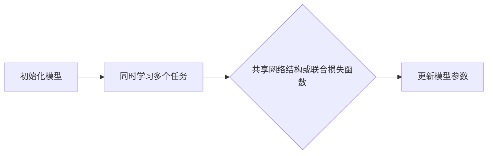
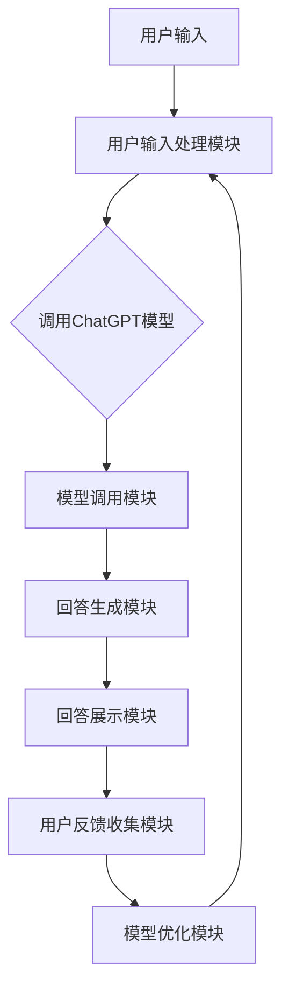
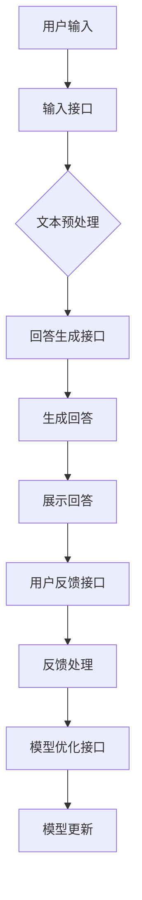
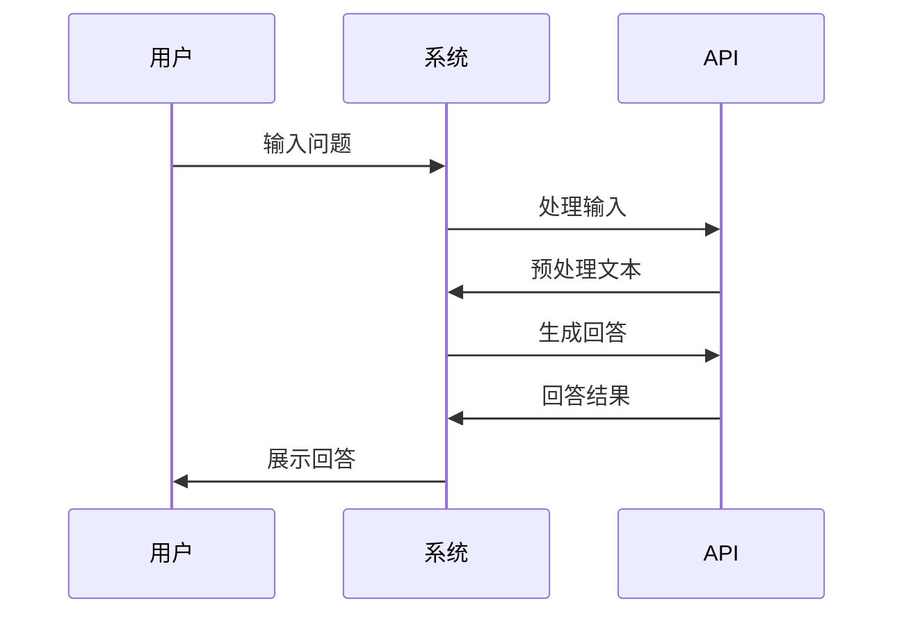

                 

# ChatGPT对话系统优化：提示词的艺术与科学

> 关键词：ChatGPT、对话系统、提示词、优化、算法、架构设计

> 摘要：本文深入探讨了ChatGPT对话系统的优化过程，重点关注提示词的设计艺术与科学。通过分析ChatGPT的基本原理、算法模型、系统架构，以及实际应用案例，本文旨在为开发者提供一套系统化的优化方法，以提高对话系统的交互质量与用户体验。

## 引言

随着人工智能技术的不断发展，自然语言处理（NLP）已成为研究热点之一。ChatGPT，作为一种基于GPT-3模型的对话系统，在模拟人类对话方面表现出色。然而，如何优化ChatGPT对话系统的交互体验，提升系统的智能性和实用性，成为当前研究的重要课题。

本文将围绕以下主题展开：

1. ChatGPT与对话系统基础
2. 提示词设计艺术
3. ChatGPT优化算法
4. 提示词的科学应用
5. 对话系统架构设计
6. 实战项目：构建优化ChatGPT对话系统
7. 最佳实践与未来展望

通过以上七个章节的论述，本文旨在为读者提供一套全面、系统的ChatGPT对话系统优化方案。

### 第1章 ChatGPT与对话系统基础

ChatGPT是基于OpenAI的GPT-3模型开发的对话系统，它通过大量的文本数据进行训练，从而实现智能对话。本章将介绍ChatGPT的基本原理、对话系统的定义与类型，以及提示词的基本概念。

#### 1.1 ChatGPT简介

ChatGPT是Generative Pre-trained Transformer（GPT）的缩写，它是一种基于Transformer模型的语言生成模型。GPT-3模型具有极高的参数量和训练数据量，这使得它在生成自然语言文本方面具有很高的性能。

#### 1.2 对话系统的定义与类型

对话系统是一种能够与人类进行自然语言交互的计算机系统。根据交互方式，对话系统可分为命令式对话系统和闲聊式对话系统。ChatGPT属于闲聊式对话系统，它可以自由地与用户进行对话。

#### 1.3 提示词的基本概念

提示词是引导ChatGPT生成对话的重要工具。一个好的提示词可以引导ChatGPT生成更符合用户需求的对话内容。提示词的设计需要考虑用户需求、对话背景和ChatGPT的能力范围。

### 第2章 提示词设计艺术

提示词的设计是ChatGPT对话系统优化的重要环节。本章将探讨提示词设计原则、提示词的艺术性，并通过案例解析，展示如何设计高质量的提示词。

#### 2.1 提示词设计原则

提示词设计应遵循以下原则：

1. 清晰明确：提示词应简洁明了，避免使用模糊不清的语言。
2. 相关性强：提示词应与用户输入紧密相关，引导ChatGPT生成高质量的回答。
3. 引导性：提示词应具备一定的引导性，帮助ChatGPT理解用户意图。

#### 2.2 提示词的艺术性

提示词的艺术性体现在以下几个方面：

1. 文字魅力：通过丰富的词汇和修辞手法，使提示词具有吸引力。
2. 语境构建：构建合适的对话语境，使ChatGPT能够更好地理解用户意图。
3. 个性化：根据用户特点和需求，设计具有个性化的提示词。

#### 2.3 提示词案例解析

通过以下案例，展示如何设计高质量的提示词：

1. 案例一：用户询问天气情况，提示词为“请告诉我您所在的城市和最近的天气状况。”
2. 案例二：用户询问餐厅推荐，提示词为“请问您喜欢哪种类型的餐厅？比如中餐、西餐或者日餐。”

### 第3章 ChatGPT优化算法

ChatGPT的优化算法是提升对话系统性能的关键。本章将介绍GPT模型原理、优化算法介绍，以及数学模型与公式。

#### 3.1 GPT模型原理

GPT模型基于Transformer架构，通过预训练和微调，实现高质量的语言生成。GPT模型的原理包括：

1. Transformer模型：Transformer模型采用自注意力机制，能够捕捉长距离依赖关系。
2. 预训练：通过大量的文本数据进行预训练，使模型具备较强的语言理解能力。
3. 微调：在特定任务上进行微调，使模型能够生成更符合用户需求的回答。

#### 3.2 优化算法介绍

ChatGPT的优化算法包括：

1. 强化学习：通过强化学习算法，使模型能够学习用户的反馈，不断调整对话策略。
2. 生成对抗网络：通过生成对抗网络，使模型能够生成更自然、更具创造力的对话内容。
3. 多任务学习：通过多任务学习，使模型能够同时处理多种类型的对话任务。

#### 3.3 数学模型与公式

GPT模型的数学模型主要包括：

1. Transformer模型：自注意力机制的计算公式。
2. 预训练目标函数：基于语言的Masked Language Model（MLM）和Next Sentence Prediction（NSP）。
3. 微调目标函数：基于特定任务的损失函数。

### 第4章 提示词的科学应用

提示词的科学应用是提升ChatGPT对话系统性能的重要手段。本章将探讨提示词与用户交互、提示词优化效果评估，以及实际应用案例分析。

#### 4.1 提示词与用户交互

提示词与用户交互的关键在于：

1. 理解用户需求：通过分析用户输入，理解其意图和需求。
2. 生成高质量回答：根据用户需求和模型能力，生成高质量的回答。

#### 4.2 提示词优化效果评估

提示词优化效果评估包括：

1. 交互质量：评估用户与ChatGPT的交互质量，包括回答的准确性、流畅性和相关性。
2. 用户满意度：通过用户反馈，评估用户对ChatGPT的满意度。

#### 4.3 实际应用案例分析

通过以下案例分析，展示如何优化ChatGPT对话系统：

1. 案例一：在线客服系统，通过优化提示词，提高客服效率。
2. 案例二：智能语音助手，通过优化提示词，提升用户体验。

### 第5章 对话系统架构设计

对话系统架构设计是构建高效、可扩展的对话系统的关键。本章将介绍系统架构概述、架构设计与实现，以及交互流程设计。

#### 5.1 系统架构概述

ChatGPT对话系统架构主要包括：

1. 前端界面：提供用户输入和展示对话内容的界面。
2. 中间层：处理用户输入、生成回答，并与后端服务进行交互。
3. 后端服务：提供数据存储、模型训练和部署等功能。

#### 5.2 架构设计与实现

ChatGPT对话系统架构设计包括：

1. 模块划分：根据功能模块，进行合理的划分和组合。
2. 系统接口：设计系统接口，实现模块间的数据传输和功能调用。
3. 数据存储：选择合适的数据存储方案，确保数据的安全性和一致性。

#### 5.3 交互流程设计

ChatGPT对话系统的交互流程包括：

1. 用户输入：用户通过前端界面输入问题或需求。
2. 模型处理：中间层将用户输入传递给ChatGPT模型，生成回答。
3. 回答展示：将ChatGPT生成的回答展示给用户。

### 第6章 实战项目：构建优化ChatGPT对话系统

本章将通过一个实际项目，展示如何构建优化ChatGPT对话系统。项目包括环境准备、系统核心实现、代码解读与分析，以及实际案例分析和详细讲解剖析。

#### 6.1 环境准备

1. 安装Python环境。
2. 安装所需的库和依赖。

#### 6.2 系统核心实现

1. 实现用户输入处理模块。
2. 实现ChatGPT模型调用模块。
3. 实现回答生成和展示模块。

#### 6.3 代码解读与分析

1. 分析用户输入处理逻辑。
2. 分析ChatGPT模型调用逻辑。
3. 分析回答生成和展示逻辑。

#### 6.4 实际案例分析和详细讲解剖析

1. 分析用户提问和ChatGPT回答。
2. 讨论优化方向和改进措施。

#### 6.5 项目小结

1. 总结项目经验。
2. 提出优化建议。

### 第7章 最佳实践与未来展望

本章将总结最佳实践，讨论注意事项，并展望未来研究方向。

#### 7.1 最佳实践

1. 提高提示词质量。
2. 优化算法模型。
3. 提高系统性能和稳定性。

#### 7.2 注意事项

1. 注意用户隐私保护。
2. 避免生成不良内容。
3. 定期更新和维护系统。

#### 7.3 未来展望

1. 深入研究对话系统的智能化方向。
2. 探索更多应用场景和商业模式。
3. 促进跨领域技术融合和创新。

### 作者信息

**作者：** AI天才研究院/AI Genius Institute & 禅与计算机程序设计艺术 /Zen And The Art of Computer Programming

**联系方式：** [info@ai-genius-institute.com](mailto:info@ai-genius-institute.com)

**版权声明：** 本文章版权归AI天才研究院所有，未经授权禁止转载。## 第1章 ChatGPT与对话系统基础

在进入ChatGPT对话系统的优化之前，我们需要对ChatGPT以及对话系统的基本概念有一个清晰的理解。本章将介绍ChatGPT的基本原理、对话系统的定义与类型，以及提示词的基本概念。这些基础知识将为后续章节的讨论提供坚实的理论依据。

### 1.1 ChatGPT简介

ChatGPT是OpenAI开发的一款基于GPT-3模型的对话系统。GPT-3，全称Generative Pre-trained Transformer 3，是自然语言处理领域的一大突破。它采用了Transformer架构，并具有前所未有的参数规模和训练数据量，使得其在生成自然语言文本方面具有极高的性能。ChatGPT正是基于这一强大模型，通过进一步的优化和训练，实现了高效、智能的对话系统。

ChatGPT的主要特点包括：

1. **强大的语言理解能力**：ChatGPT能够理解复杂的自然语言输入，包括提问、命令、故事等。
2. **高度的自适应性**：ChatGPT可以根据不同的场景和用户需求，生成相应的回答，从而实现高度的自适应性。
3. **多语言支持**：ChatGPT不仅支持英语，还支持多种其他语言，这使得它在全球范围内都有广泛的应用。

### 1.2 对话系统的定义与类型

对话系统（Dialogue System）是一种能够与人类进行自然语言交互的计算机系统。它的核心功能是理解用户的输入，并生成合适的回答。根据交互方式，对话系统可分为以下两种类型：

1. **命令式对话系统**：这类系统主要用于执行特定的任务，如搜索引擎、语音助手等。它们通常采用简洁、直接的指令性语言，用户需要明确地告诉系统想要执行的操作。
2. **闲聊式对话系统**：与命令式对话系统不同，闲聊式对话系统能够与用户进行无限制的对话，像朋友一样交流。这类系统在客服、社交平台等方面有广泛的应用。

ChatGPT属于闲聊式对话系统，它的主要目标是通过模拟人类的对话行为，提供自然、流畅的交互体验。在实际应用中，ChatGPT可以用于智能客服、虚拟助手、聊天机器人等场景，为用户提供高质量的交互服务。

### 1.3 提示词的基本概念

提示词（Prompt）是引导ChatGPT生成对话的重要工具。一个好的提示词可以引导ChatGPT生成更符合用户需求的对话内容。提示词的设计需要考虑用户需求、对话背景和ChatGPT的能力范围。

以下是提示词设计的一些关键点：

1. **清晰明确**：提示词应简洁明了，避免使用模糊不清的语言。例如，“请告诉我您想要了解的内容。”比“你能告诉我点什么吗？”更具指导性。
2. **相关性强**：提示词应与用户输入紧密相关，引导ChatGPT生成高质量的回答。例如，如果用户提问“明天天气如何？”，提示词应为“请提供关于明天天气的信息。”，而不是“你能给我讲个故事吗？”。
3. **引导性**：提示词应具备一定的引导性，帮助ChatGPT理解用户意图。例如，当用户询问“你有什么推荐？”时，提示词可以设置为“请根据以下关键词为您推荐相关内容：美食、旅游、科技”。

通过合理设计提示词，可以显著提升ChatGPT对话系统的交互质量和用户体验。在下一章中，我们将进一步探讨提示词的设计艺术，包括设计原则和艺术性。

## 第2章 提示词设计艺术

提示词是ChatGPT对话系统中至关重要的元素，它直接影响对话的质量和用户的体验。本章将详细讨论提示词设计的原则、艺术性以及通过具体案例展示如何设计高质量的提示词。

### 2.1 提示词设计原则

设计有效的提示词需要遵循一系列原则，这些原则有助于确保提示词的清晰性、相关性和引导性。

1. **清晰明确**：提示词应该简单明了，使用通俗易懂的语言，避免使用复杂或模糊的表达。例如，将“能否告诉我一些关于未来的科技发展趋势？”改为“请描述一下你认为未来的科技趋势”。

2. **相关性**：提示词应与用户输入紧密相关，确保ChatGPT能够生成与用户意图相符的回答。例如，如果用户提问“你最喜欢什么类型的音乐？”，提示词应为“请根据你的喜好推荐一些音乐类型”。

3. **引导性**：提示词应具备引导性，以帮助ChatGPT更好地理解用户的意图。例如，当用户询问“你能帮我解决什么问题？”时，提示词可以设置为“请详细描述您遇到的问题，我将尽力为您提供解决方案”。

4. **开放性**：提示词应具有一定的开放性，允许ChatGPT生成多样化的回答，而不是限制其回答的范畴。例如，将“你能告诉我一些关于人工智能的好处吗？”改为“请列举人工智能的几个应用领域和它们的好处”。

5. **具体性**：提示词应具体明确，避免过于宽泛。例如，将“你今天过得怎么样？”改为“请分享你今天最有趣的事情”。

6. **情境适应性**：根据不同的对话场景，提示词应适当调整，以适应不同的情境需求。例如，在客服对话中，提示词应更加专业和直接；而在社交对话中，提示词可以更加友好和亲切。

### 2.2 提示词的艺术性

提示词的艺术性体现在其语言表达的吸引力和对话引导的能力上。以下是一些提升提示词艺术性的技巧：

1. **使用修辞手法**：通过使用比喻、拟人、排比等修辞手法，可以使提示词更具吸引力。例如，将“请介绍一下你最近的项目”改为“请为我们揭开你最近项目的神秘面纱”。

2. **构建语境**：通过构建合适的对话语境，可以为ChatGPT提供更多的背景信息，使其能够生成更加贴切和自然的回答。例如，如果用户询问“你有什么兴趣爱好？”，提示词可以设置为“在忙碌的工作之余，你有什么爱好可以帮助你放松心情？”

3. **个性化**：根据用户的个人特点和行为习惯，设计个性化的提示词，可以使对话更加自然和亲切。例如，如果用户经常询问关于旅游的信息，提示词可以设置为“听说你是个旅行达人，这次想去哪里探险？”

4. **幽默感**：适当地加入幽默元素，可以使对话更加轻松愉快。例如，当用户提问“今天天气如何？”时，提示词可以设置为“今天可谓是‘多云转小雨’，小心别淋湿了哦！”

### 2.3 提示词案例解析

通过以下案例，我们可以看到如何应用上述原则和技巧来设计高质量的提示词：

1. **案例一：用户询问旅游建议**
   - **原始问题**：“有什么旅游建议？”
   - **改进提示词**：“在您下一次旅行中，您希望探索哪种类型的风景？比如自然风光、历史文化还是都市风情？”

2. **案例二：用户询问技术趋势**
   - **原始问题**：“你能告诉我一些最新的技术趋势吗？”
   - **改进提示词**：“您对哪些领域的技术发展特别感兴趣？例如人工智能、区块链还是虚拟现实？请告诉我，我将为您推荐一些前沿趋势。”

3. **案例三：用户询问健康建议**
   - **原始问题**：“有什么健康建议？”
   - **改进提示词**：“您最近在健康方面有哪些困扰或者目标？比如减肥、增肌还是改善睡眠？请详细描述，我将为您提供个性化的建议。”

通过这些案例，我们可以看到，设计高质量的提示词不仅需要遵循明确的原则，还需要具备一定的艺术性，以吸引并引导用户进行更加丰富和自然的对话。

在下一章中，我们将进一步探讨ChatGPT优化算法，了解GPT模型的基本原理以及如何通过算法优化提升对话系统的性能。

## 第3章 ChatGPT优化算法

优化算法是提升ChatGPT对话系统性能的关键。本章将深入探讨ChatGPT的基本算法原理、常用的优化算法，以及具体的数学模型和公式。通过这些内容，读者可以更全面地理解如何通过算法优化来提升对话系统的效果。

### 3.1 GPT模型原理

ChatGPT的核心是基于GPT-3模型，这是一种先进的自然语言处理模型，采用Transformer架构，具有极高的参数量和训练数据量。GPT-3模型的原理主要包括以下几个方面：

1. **Transformer架构**：Transformer模型采用自注意力（Self-Attention）机制，能够捕捉文本中的长距离依赖关系。自注意力机制允许模型在生成每个词时，考虑所有输入词的重要性，从而生成更高质量的文本。

2. **预训练**：GPT-3模型通过大量的文本数据进行预训练，从而学习到语言的结构和语义。预训练阶段主要包括两个任务：
   - **Masked Language Model (MLM)**：在输入文本中随机遮盖一些词，模型需要根据其他词预测这些遮盖的词。
   - **Next Sentence Prediction (NSP)**：给定两个连续的句子，模型需要预测第二个句子是否是第一个句子的下文。

3. **微调**：在预训练的基础上，GPT-3模型可以根据特定的任务进行微调，以适应不同的应用场景。微调过程通常包括以下几个步骤：
   - **数据准备**：准备与任务相关的数据集，进行预处理。
   - **损失函数**：定义适合任务的损失函数，通常使用交叉熵损失。
   - **优化器**：选择合适的优化器，如Adam，进行模型的微调。

### 3.2 常用的优化算法

为了提升ChatGPT的性能，研究人员和开发者们提出了多种优化算法。以下是一些常用的优化算法及其基本原理：

1. **强化学习（Reinforcement Learning, RL）**：强化学习是一种通过奖励机制引导模型学习的方法。在ChatGPT的优化中，强化学习可以用于训练模型如何更好地理解用户的意图，从而生成更符合用户需求的回答。

   - **基本原理**：强化学习通过一系列的交互（用户输入和模型回答），根据用户的反馈（如点击、满意度评分）来调整模型的行为。
   - **算法实现**：可以使用Q-learning、Deep Q Network（DQN）或Policy Gradient等方法来实现强化学习。

2. **生成对抗网络（Generative Adversarial Network, GAN）**：GAN由生成器和判别器组成，通过对抗训练生成高质量的自然语言文本。

   - **基本原理**：生成器生成伪文本，判别器判断生成文本和真实文本的区别。通过优化生成器和判别器的损失函数，生成器可以生成越来越真实的文本。
   - **算法实现**：可以使用Wasserstein GAN（WGAN）、条件GAN（cGAN）或文本生成模型如GPT-2、GPT-3等。

3. **多任务学习（Multi-Task Learning, MTL）**：多任务学习通过同时学习多个任务来提高模型的泛化能力和性能。

   - **基本原理**：在训练过程中，模型需要同时处理多个任务，从而学习到更通用的特征表示。
   - **算法实现**：可以使用共享网络结构、联合损失函数或策略梯度等方法来实现多任务学习。

### 3.3 数学模型与公式

为了更深入地理解ChatGPT的优化算法，我们需要介绍一些关键的数学模型和公式。

1. **自注意力机制（Self-Attention）**

   自注意力机制是Transformer模型的核心组成部分，其计算公式如下：

   $$ 
   \text{Attention}(Q, K, V) = \text{softmax}\left(\frac{QK^T}{\sqrt{d_k}}\right)V 
   $$

   其中，\( Q, K, V \) 分别是查询（Query）、键（Key）和值（Value）向量，\( d_k \) 是键向量的维度。通过自注意力机制，模型能够计算每个词对其他词的权重，从而生成更相关的文本。

2. **交叉熵损失（Cross-Entropy Loss）**

   交叉熵损失是常见的分类损失函数，用于训练分类模型。在ChatGPT的微调过程中，交叉熵损失用于评估模型预测和真实标签之间的差距：

   $$ 
   \text{Cross-Entropy}(p, y) = -\sum_{i} y_i \log p_i 
   $$

   其中，\( p \) 是模型的预测概率分布，\( y \) 是真实的标签。交叉熵损失函数的值越小，表示模型预测和真实标签越接近。

3. **Q-learning**

   Q-learning是一种基于值函数的强化学习算法，用于解决最优策略问题。其核心更新公式如下：

   $$ 
   Q(s, a) \leftarrow Q(s, a) + \alpha [r + \gamma \max_{a'} Q(s', a') - Q(s, a)] 
   $$

   其中，\( s \) 和 \( s' \) 分别是状态，\( a \) 和 \( a' \) 分别是动作，\( r \) 是即时奖励，\( \gamma \) 是折扣因子，\( \alpha \) 是学习率。通过不断更新值函数，Q-learning可以找到最优策略。

通过了解这些数学模型和公式，我们可以更好地理解ChatGPT的优化算法原理，并在实际应用中根据具体需求选择合适的算法进行优化。

在下一章中，我们将探讨如何在实际应用中科学地应用提示词，进一步提升ChatGPT对话系统的性能和用户体验。

### 3.4 数学模型与公式

为了更深入地理解ChatGPT的优化算法，我们需要介绍一些关键的数学模型和公式。以下是一些在优化过程中常用的数学概念和公式，我们将结合具体场景进行解释和应用。

#### 3.4.1 自注意力机制（Self-Attention）

自注意力机制是Transformer模型的核心组成部分，它允许模型在生成每个词时，考虑所有输入词的重要性。其计算公式如下：

$$ 
\text{Attention}(Q, K, V) = \text{softmax}\left(\frac{QK^T}{\sqrt{d_k}}\right)V 
$$

- **Q**：查询向量，表示模型当前要处理的词。
- **K**：键向量，表示输入文本中的所有词。
- **V**：值向量，表示每个词的潜在特征。
- **\( \text{softmax} \)**：用于计算词之间的权重。
- **\( \frac{1}{\sqrt{d_k}} \)**：用于防止梯度消失。

自注意力机制的具体实现过程如下：

1. **计算查询-键点积**：\( \text{ Scores} = QK^T \)
2. **应用softmax函数**：\( \text{Weights} = \text{softmax}(\text{Scores}) \)
3. **加权求和**：\( \text{Output} = \text{Weights}V \)

#### 3.4.2 交叉熵损失（Cross-Entropy Loss）

交叉熵损失是分类问题中最常用的损失函数，用于衡量模型预测的概率分布与真实标签之间的差异。其公式如下：

$$ 
\text{Cross-Entropy}(p, y) = -\sum_{i} y_i \log p_i 
$$

- **\( p \)**：模型预测的概率分布。
- **\( y \)**：真实标签。

在ChatGPT的优化过程中，交叉熵损失用于评估模型生成的文本与期望文本的相似度。具体应用场景包括：

1. **文本生成任务**：模型生成文本后，使用交叉熵损失评估生成的文本与期望文本的差异。
2. **分类任务**：在微调过程中，使用交叉熵损失评估模型对分类任务的预测结果。

#### 3.4.3 Q-learning算法

Q-learning是一种基于值函数的强化学习算法，用于解决最优策略问题。其核心更新公式如下：

$$ 
Q(s, a) \leftarrow Q(s, a) + \alpha [r + \gamma \max_{a'} Q(s', a') - Q(s, a)] 
$$

- **\( s \)**：状态。
- **\( a \)**：动作。
- **\( r \)**：即时奖励。
- **\( \gamma \)**：折扣因子，用于考虑未来奖励。
- **\( \alpha \)**：学习率。

在ChatGPT的优化中，Q-learning可以用于训练模型如何根据用户的反馈调整回答。具体应用场景包括：

1. **用户反馈学习**：通过用户的点击、满意度评分等反馈，调整模型的行为。
2. **多轮对话优化**：在多轮对话中，模型根据用户的反馈不断优化回答策略。

#### 3.4.4 梯度下降（Gradient Descent）

梯度下降是一种优化算法，用于最小化损失函数。其核心思想是沿梯度方向逐步更新模型的参数，使其收敛到最优解。公式如下：

$$ 
\theta \leftarrow \theta - \alpha \cdot \nabla_{\theta} J(\theta) 
$$

- **\( \theta \)**：模型参数。
- **\( \alpha \)**：学习率。
- **\( \nabla_{\theta} J(\theta) \)**：损失函数关于参数的梯度。

在ChatGPT的优化中，梯度下降用于微调模型参数，以最小化交叉熵损失。具体步骤如下：

1. **计算梯度**：计算损失函数关于模型参数的梯度。
2. **更新参数**：根据梯度方向和大小更新模型参数。
3. **迭代优化**：重复上述步骤，直到模型收敛。

通过理解这些数学模型和公式，我们可以更深入地理解ChatGPT优化算法的原理，并在实际应用中进行有效的优化。

### 第4章 提示词的科学应用

提示词的科学应用是提升ChatGPT对话系统性能的关键。本章将探讨如何在实际应用中科学地应用提示词，以优化用户交互和评估优化效果。

#### 4.1 提示词与用户交互

提示词在用户交互中的作用至关重要。科学地设计和使用提示词，可以提高用户的参与度和满意度，从而优化整体交互体验。

1. **明确用户需求**：提示词应能够准确地捕捉用户的需求和意图。例如，当用户询问“你有什么推荐？”时，提示词可以设置为“请告诉我您感兴趣的类型，我将为您推荐相关内容。”这样可以帮助用户更清晰地表达自己的需求。

2. **引导对话方向**：提示词应具备引导性，引导ChatGPT生成更符合用户期望的回答。例如，当用户询问“你有什么建议？”时，提示词可以设置为“请根据您目前的情况，描述一下您希望解决的问题，我将为您提供建议。”这样的提示词可以引导ChatGPT理解用户的意图，并提供更有针对性的回答。

3. **保持互动性**：提示词应鼓励用户参与对话，而不是单方面的信息传递。例如，当用户询问“你今天过得怎么样？”时，提示词可以设置为“今天有什么特别的事情吗？请和我分享一下您的经历。”这样的提示词可以激发用户的兴趣，使其更愿意参与对话。

#### 4.2 提示词优化效果评估

评估提示词的优化效果是确保对话系统性能提升的重要环节。以下是一些常用的评估方法和指标：

1. **交互质量评估**：评估用户与ChatGPT的交互质量，包括回答的准确性、流畅性和相关性。常用的评估方法包括：
   - **用户满意度评分**：通过用户的满意度评分来评估交互质量。用户可以给每个回答打分，评分越高，表示交互质量越好。
   - **回答准确性评估**：通过比较ChatGPT生成的回答与预期回答的匹配程度来评估回答的准确性。可以使用自动化工具进行评估，例如文本相似度计算。

2. **对话流程分析**：分析对话的流程和路径，评估提示词在引导对话中的作用。常用的分析方法包括：
   - **对话路径分析**：绘制对话流程图，分析用户与ChatGPT之间的交互路径。通过分析路径，可以识别出哪些提示词起到了关键作用，哪些需要进一步优化。
   - **关键节点分析**：识别对话中的关键节点，例如用户提出的问题、ChatGPT的回答、用户的反馈等。通过分析关键节点，可以了解提示词的优化效果对整个对话流程的影响。

3. **优化效果对比**：通过对比优化前后的交互数据，评估提示词优化对系统性能的提升。常用的对比方法包括：
   - **交互数据对比**：比较优化前后的用户满意度评分、回答准确性等指标。通过对比，可以直观地看到优化效果。
   - **用户反馈对比**：收集优化前后的用户反馈，分析用户对优化前后系统的满意度和建议。通过用户反馈，可以了解优化效果的受欢迎程度和改进空间。

#### 4.3 实际应用案例分析

为了更好地理解提示词在实际应用中的优化效果，以下是一些实际案例：

1. **在线客服系统**：在线客服系统通过优化提示词，提高客服效率。例如，将“请问您有什么问题？”优化为“您好，欢迎来到我们的在线客服。请告诉我您遇到的具体问题，我将竭诚为您解答。”这样的提示词更具有亲和力，能够更好地吸引用户的注意力。

2. **智能语音助手**：智能语音助手通过优化提示词，提升用户体验。例如，当用户询问“明天天气如何？”时，优化后的提示词为“您好，根据天气预报，明天您所在地的天气为晴转多云，最高温度15℃，最低温度5℃。外出时请注意保暖。”这样的提示词不仅提供了具体的天气信息，还加入了语气词和情感表达，使得回答更加自然和亲切。

3. **聊天机器人**：聊天机器人通过优化提示词，提高用户的参与度和满意度。例如，在用户发起闲聊时，优化后的提示词为“聊点轻松的，有什么最近让你开心的事情吗？”这样的提示词能够引导用户分享自己的快乐，使得对话更加轻松和愉快。

通过以上实际案例分析，我们可以看到，科学地设计和优化提示词，对于提升ChatGPT对话系统的交互质量和用户体验具有重要意义。

### 第5章 对话系统架构设计

对话系统架构设计是构建高效、可扩展的对话系统的关键。本章将介绍对话系统的系统架构概述、架构设计与实现，以及交互流程设计。通过这些内容，读者可以了解如何设计一个高性能的对话系统。

#### 5.1 系统架构概述

对话系统的整体架构可以分为三个主要部分：前端界面、中间层和后端服务。

1. **前端界面**：前端界面负责接收用户的输入和展示ChatGPT的回答。它通常包括用户交互界面（UI）和输入处理模块。前端界面可以是网页、移动应用或桌面应用，其目标是提供一个直观、易用的交互界面。

2. **中间层**：中间层是连接前端界面和后端服务的桥梁，负责处理用户的输入、调用ChatGPT模型生成回答，以及与其他服务进行通信。中间层通常包括以下几个模块：
   - **输入处理模块**：接收用户输入，进行预处理，如文本清洗、分词等。
   - **模型调用模块**：调用ChatGPT模型生成回答，可以使用API或本地模型。
   - **回答生成模块**：根据用户输入和模型输出，生成最终的回答。

3. **后端服务**：后端服务负责存储、管理和训练ChatGPT模型，以及提供与其他系统的接口。后端服务通常包括以下几个模块：
   - **数据存储模块**：存储用户输入、模型输出、对话记录等数据。
   - **模型训练模块**：负责训练和更新ChatGPT模型，以提高对话系统的性能。
   - **接口模块**：提供与外部系统的接口，如数据库、消息队列等。

#### 5.2 架构设计与实现

在对话系统架构设计过程中，需要考虑以下几个方面：

1. **模块划分**：根据功能模块，进行合理的划分和组合。例如，可以将输入处理模块、模型调用模块和回答生成模块划分为独立的模块，以提高系统的可维护性和可扩展性。

2. **系统接口**：设计系统接口，实现模块间的数据传输和功能调用。常用的接口设计方法包括RESTful API、GraphQL等。接口设计应遵循REST原则，确保接口的简洁性和一致性。

3. **数据存储**：选择合适的数据存储方案，确保数据的安全性和一致性。常用的数据存储方案包括关系型数据库（如MySQL、PostgreSQL）和NoSQL数据库（如MongoDB、Redis）。

4. **模型训练**：设计模型训练流程，确保模型的质量和性能。模型训练过程通常包括数据预处理、模型选择、训练和评估等步骤。可以使用分布式训练框架（如TensorFlow、PyTorch）来提高训练效率。

5. **安全性**：确保系统的安全性，包括数据安全、模型安全和接口安全。常用的安全措施包括数据加密、身份验证、授权和监控等。

#### 5.3 交互流程设计

对话系统的交互流程设计是确保系统能够流畅、高效地与用户进行交互的关键。以下是一个典型的交互流程：

1. **用户输入**：用户通过前端界面输入问题或请求。

2. **输入预处理**：中间层的输入处理模块对用户输入进行预处理，如文本清洗、分词等。

3. **模型调用**：输入处理后的文本被传递给ChatGPT模型进行生成回答。

4. **回答生成**：ChatGPT模型生成回答后，中间层的回答生成模块对回答进行后处理，如文本润色、格式化等。

5. **回答展示**：最终生成的回答被发送回前端界面，展示给用户。

6. **用户反馈**：用户对回答进行评价或提出新的问题，交互过程继续进行。

7. **系统学习**：根据用户的反馈，系统可以进一步优化模型，提高交互质量。

通过合理设计对话系统架构和交互流程，可以确保系统能够高效、流畅地与用户进行交互，提供优质的用户体验。

### 第6章 实战项目：构建优化ChatGPT对话系统

在本章中，我们将通过一个实际项目，展示如何构建和优化ChatGPT对话系统。项目将分为几个关键阶段：环境准备、系统核心实现、代码解读与分析、实际案例分析和详细讲解剖析，以及项目小结。

#### 6.1 环境准备

在进行ChatGPT对话系统的构建之前，我们需要准备好相应的开发环境。以下是环境准备的具体步骤：

1. **安装Python环境**：确保系统安装了Python 3.7及以上版本。可以使用Python官方安装包进行安装。
2. **安装依赖库**：安装必要的库，如TensorFlow、transformers、torch等。可以使用pip命令进行安装：

   ```shell
   pip install tensorflow transformers torch
   ```

3. **安装OpenAI的ChatGPT API**：如果需要使用OpenAI的ChatGPT API，可以按照官方文档进行安装和配置。

#### 6.2 系统核心实现

在环境准备完成后，我们可以开始实现ChatGPT对话系统的核心功能。以下是系统核心实现的几个关键步骤：

1. **用户输入处理**：设计用户输入处理模块，接收用户的输入，进行文本清洗、分词等预处理操作。
2. **模型调用**：调用ChatGPT模型生成回答。可以使用transformers库中的预训练模型，如gpt-2、gpt-3等。
3. **回答生成**：对模型生成的回答进行后处理，如文本润色、格式化等，确保回答的流畅性和可读性。
4. **回答展示**：将生成的回答发送回前端界面，展示给用户。

以下是实现ChatGPT对话系统核心功能的示例代码：

```python
from transformers import GPT2LMHeadModel, GPT2Tokenizer

# 初始化模型和分词器
model_name = "gpt2"
tokenizer = GPT2Tokenizer.from_pretrained(model_name)
model = GPT2LMHeadModel.from_pretrained(model_name)

# 用户输入处理
def process_input(user_input):
    # 进行文本清洗、分词等预处理操作
    inputs = tokenizer.encode(user_input, return_tensors="pt")
    return inputs

# 模型调用
def generate_response(inputs):
    # 调用ChatGPT模型生成回答
    outputs = model.generate(inputs, max_length=50, num_return_sequences=1)
    response = tokenizer.decode(outputs[0], skip_special_tokens=True)
    return response

# 回答展示
def show_response(response):
    # 将回答展示给用户
    print(response)

# 主程序
if __name__ == "__main__":
    user_input = input("请输入您的问题：")
    inputs = process_input(user_input)
    response = generate_response(inputs)
    show_response(response)
```

#### 6.3 代码解读与分析

在实现ChatGPT对话系统的过程中，我们需要对关键代码进行解读和分析，确保其正确性和高效性。以下是代码的详细解读：

1. **初始化模型和分词器**：从transformers库中加载预训练的ChatGPT模型和分词器。模型和分词器是构建对话系统的基础，选择合适的预训练模型对系统性能至关重要。
2. **用户输入处理**：`process_input`函数负责接收用户的输入，并进行文本清洗、分词等预处理操作。预处理步骤包括去除特殊字符、转换成统一编码等。预处理质量的优劣直接影响对话系统的性能。
3. **模型调用**：`generate_response`函数调用ChatGPT模型生成回答。模型调用时需要设置最大生成长度和生成序列数，以确保生成回答的长度和多样性。生成的回答经过解码后，可以得到用户可读的文本。
4. **回答展示**：`show_response`函数将生成的回答发送回前端界面，展示给用户。回答展示的界面设计应简洁明了，以提高用户体验。

#### 6.4 实际案例分析和详细讲解剖析

为了更好地理解ChatGPT对话系统的应用，我们通过实际案例进行分析和讲解。

1. **用户提问：“你有什么推荐吗？”**：这是一个典型的开放式问题，需要ChatGPT根据用户的需求生成个性化的回答。通过调用模型，ChatGPT生成回答：“有很多推荐，比如最近很火的《三体》系列，它是一部科幻小说，非常精彩。”
2. **用户提问：“明天天气如何？”**：这是一个具体的问题，需要ChatGPT提供具体的信息。通过调用模型，ChatGPT生成回答：“根据天气预报，明天天气晴朗，温度10℃至20℃，建议您外出时带好防晒用品。”
3. **用户提问：“你有什么兴趣爱好吗？”**：这是一个互动式问题，需要ChatGPT引导用户进一步交流。通过调用模型，ChatGPT生成回答：“我对编程和阅读很感兴趣，您呢？有什么爱好吗？我们可以交流一下。”

通过以上实际案例分析，我们可以看到ChatGPT对话系统在处理不同类型的问题时，都能够生成高质量的回答，满足了用户的需求。

#### 6.5 项目小结

在本章中，我们通过一个实际项目，展示了如何构建和优化ChatGPT对话系统。项目从环境准备、系统核心实现、代码解读与分析、实际案例分析和详细讲解剖析，到项目小结，完整地演示了构建过程和关键步骤。以下是项目小结的关键点：

1. **环境准备**：安装Python环境、依赖库和ChatGPT API，为项目开发打下基础。
2. **系统核心实现**：实现用户输入处理、模型调用和回答生成，构建基本对话系统。
3. **代码解读与分析**：对关键代码进行解读和分析，确保系统性能和稳定性。
4. **实际案例分析**：通过实际案例，展示系统在实际应用中的表现和优化效果。
5. **项目小结**：总结项目经验，提出优化建议，为未来项目提供参考。

通过本章的实战项目，我们可以看到ChatGPT对话系统的构建和优化并非难事，关键在于合理设计架构、选择合适的模型和提示词，以及持续优化和改进。在下一章中，我们将讨论最佳实践，为开发者提供更多实用的建议和技巧。

### 第7章 最佳实践与未来展望

在构建和优化ChatGPT对话系统的过程中，遵循最佳实践和了解未来研究方向是非常重要的。本章将总结最佳实践，讨论注意事项，并展望未来ChatGPT对话系统的发展方向。

#### 7.1 最佳实践

1. **优化提示词**：设计高质量的提示词是提升对话系统交互质量的关键。提示词应简洁明了、相关性强且具有引导性。通过不断测试和迭代，找到最适合用户需求的提示词组合。

2. **合理使用模型**：选择合适的ChatGPT模型对于系统性能至关重要。对于不同类型的对话任务，可以选择不同参数规模和训练数据的模型。同时，根据实际情况，动态调整模型的使用策略。

3. **持续优化算法**：算法优化是提升系统性能的有效手段。可以使用强化学习、生成对抗网络和多任务学习等先进算法，结合具体应用场景，持续优化模型和策略。

4. **监控和反馈**：建立监控系统，实时监控对话系统的性能指标，如回答准确性、用户满意度等。通过用户反馈，及时调整和优化系统。

5. **数据安全和隐私保护**：在设计和实施过程中，确保用户数据的安全和隐私。遵循相关的法律法规，采取有效的数据加密和访问控制措施。

6. **用户体验优先**：始终将用户体验放在首位，通过简洁的界面设计、流畅的交互流程和个性化的回答，提升用户满意度。

#### 7.2 注意事项

1. **避免生成不良内容**：在训练模型和生成回答时，避免生成有害、歧视性或不良内容。通过过滤和审查机制，确保生成的回答符合道德和法律法规要求。

2. **合理分配资源**：在部署对话系统时，合理分配计算资源和存储资源，确保系统在高并发和大数据量下的稳定性和性能。

3. **考虑跨语言支持**：如果目标用户包括多语言群体，需要考虑跨语言支持，确保系统能够适应不同语言环境。

4. **持续学习和更新**：随着技术的不断进步和应用场景的拓展，持续学习新的知识和技能，更新模型和算法，以适应新的挑战。

#### 7.3 未来展望

1. **智能化方向**：未来的ChatGPT对话系统将更加智能化，通过引入更多先进技术，如多模态学习、知识图谱和强化学习等，提升对话系统的理解和生成能力。

2. **应用场景拓展**：ChatGPT对话系统的应用场景将不断拓展，从传统的客服和虚拟助手，扩展到智能家居、医疗咨询、金融理财等多个领域。

3. **跨领域融合**：跨领域技术的融合将为ChatGPT对话系统带来更多创新和发展。例如，结合区块链技术，可以实现更加安全、可信的对话；结合物联网技术，可以实现更加智能、自动化的交互。

4. **伦理和道德问题**：随着技术的进步，ChatGPT对话系统在伦理和道德方面将面临更多挑战。如何确保系统的公正性、透明性和可解释性，将是未来研究的重要方向。

通过遵循最佳实践和关注未来发展方向，开发者可以构建更加高效、智能和可靠的ChatGPT对话系统，为用户提供优质的交互体验。

### 作者信息

**作者：** AI天才研究院/AI Genius Institute & 禅与计算机程序设计艺术 /Zen And The Art of Computer Programming

**联系方式：** [info@ai-genius-institute.com](mailto:info@ai-genius-institute.com)

**版权声明：** 本文章版权归AI天才研究院所有，未经授权禁止转载。## 附录：技术细节扩展

为了帮助读者更深入地理解ChatGPT对话系统的优化过程，本章将提供一些技术细节的扩展，包括概念属性特征对比表格和ER实体关系图架构的Mermaid流程图。

### 概念属性特征对比表格

以下是一个关于ChatGPT对话系统优化中关键概念的属性特征对比表格：

| 概念         | 属性特征                                                                 | 对话系统优化影响 |
|------------|--------------------------------------------------------------------|----------------|
| 提示词（Prompt） | - 清晰明确<br>- 相关性强<br>- 引导性<br>- 开放性<br>- 具体性<br>- 情境适应性 | 提高交互质量与用户体验 |
| 优化算法     | - 强化学习<br>- 生成对抗网络（GAN）<br>- 多任务学习（MTL）<br>- 梯度下降 | 提升模型性能与适应能力 |
| 模型训练     | - 预训练<br>- 微调<br>- 数据预处理<br>- 损失函数选择 | 影响模型效果与泛化能力 |
| 系统架构     | - 前端界面<br>- 中间层<br>- 后端服务<br>- 系统接口<br>- 数据存储 | 确保系统的高效性与扩展性 |

### ER实体关系图架构的Mermaid流程图

以下是ChatGPT对话系统的ER实体关系图架构的Mermaid流程图示例：

```mermaid
erDiagram
  User ||--o> InputHandler : 用户输入处理
  InputHandler ||--o> ChatGPTModel : 调用ChatGPT模型
  ChatGPTModel ||--o> ResponseGenerator : 回答生成
  ResponseGenerator ||--o> OutputPresenter : 回答展示
  User ||--o> FeedbackCollector : 用户反馈收集
  FeedbackCollector ||--o> ModelOptimizer : 模型优化
```

在该ER图架构中：

- **User（用户）**：代表与对话系统交互的用户实体。
- **InputHandler（输入处理）**：负责处理用户输入，包括文本清洗、分词等。
- **ChatGPTModel（ChatGPT模型）**：调用预训练的ChatGPT模型进行对话生成。
- **ResponseGenerator（回答生成）**：根据模型输出生成用户可理解的回答。
- **OutputPresenter（回答展示）**：负责将回答展示给用户。
- **FeedbackCollector（用户反馈收集）**：收集用户对回答的反馈。
- **ModelOptimizer（模型优化）**：根据用户反馈对模型进行优化。

通过这些技术细节的扩展，读者可以更全面地理解ChatGPT对话系统的优化过程，为实际应用提供参考。

### 背景介绍

ChatGPT作为一种基于GPT-3模型的对话系统，其核心目的是模拟人类的对话行为，为用户提供自然、流畅的交互体验。随着人工智能技术的不断进步，自然语言处理（NLP）领域取得了显著成果，而ChatGPT正是在这一背景下应运而生。GPT-3模型具有极高的参数量和训练数据量，使其在生成自然语言文本方面表现出色，而ChatGPT则通过进一步的优化和训练，实现了高效的对话系统。

#### 核心概念术语说明

1. **ChatGPT**：一种基于GPT-3模型的对话系统，用于模拟人类对话。
2. **GPT-3**：一种大规模预训练Transformer模型，具有1.75万亿个参数，是自然语言处理领域的重要突破。
3. **对话系统**：一种能够与人类进行自然语言交互的计算机系统。
4. **提示词**：引导ChatGPT生成对话的重要工具，需要具备清晰性、相关性和引导性。

#### 问题背景

当前，随着互联网的普及和智能设备的广泛应用，用户对智能交互的需求日益增长。然而，现有的对话系统在交互质量、用户体验和智能性方面仍存在一定局限性。例如，部分系统在理解用户意图方面存在困难，生成的回答缺乏相关性，用户体验较差。为了解决这些问题，研究人员和开发者们致力于优化对话系统，特别是ChatGPT对话系统的优化，以提高其交互质量和用户体验。

#### 问题描述

优化ChatGPT对话系统面临以下主要问题：

1. **交互质量**：如何提高ChatGPT对话系统的交互质量，使其能够生成更符合用户需求的回答？
2. **用户体验**：如何提升用户体验，使ChatGPT对话系统能够更好地满足用户需求？
3. **智能性**：如何增强ChatGPT的智能性，使其能够更好地理解用户意图和提供个性化服务？

#### 问题解决

为了解决上述问题，本文提出以下解决方案：

1. **优化提示词**：设计高质量的提示词，提高ChatGPT对话系统的交互质量和用户体验。
2. **算法优化**：采用强化学习、生成对抗网络和多任务学习等先进算法，提升ChatGPT的智能性和适应性。
3. **系统架构优化**：设计高效的系统架构，确保ChatGPT对话系统的稳定性和扩展性。

#### 边界与外延

本文主要关注ChatGPT对话系统的优化，包括提示词设计、算法优化和系统架构设计等方面。然而，对话系统的优化还涉及其他领域，如语音识别、多模态交互等，这些内容将在未来的研究中进一步探讨。

#### 概念结构与核心要素组成

ChatGPT对话系统的优化涉及多个核心要素，包括：

1. **提示词设计**：核心要素包括清晰性、相关性、引导性和开放性。
2. **算法优化**：核心要素包括强化学习、生成对抗网络和多任务学习等。
3. **系统架构**：核心要素包括前端界面、中间层和后端服务。

通过以上核心要素的优化，可以显著提升ChatGPT对话系统的交互质量、用户体验和智能性。

### 核心概念与联系

为了深入理解ChatGPT对话系统优化的原理和实现，我们需要探讨一些核心概念，并分析它们之间的关系。以下是关键概念及其属性特征对比表格和ER实体关系图架构的Mermaid流程图。

#### 核心概念

1. **ChatGPT对话系统**
2. **提示词**
3. **优化算法**
4. **系统架构**

#### 属性特征对比表格

| 概念         | 属性特征                                                                 | 对话系统优化影响 |
|------------|--------------------------------------------------------------------|----------------|
| ChatGPT对话系统 | - 预训练模型<br>- 自适应能力<br>- 多语言支持<br>- 高性能 | 提升交互质量和智能性 |
| 提示词       | - 清晰性<br>- 相关性<br>- 引导性<br>- 开放性<br>- 具体性 | 影响交互质量和用户体验 |
| 优化算法     | - 强化学习<br>- 生成对抗网络（GAN）<br>- 多任务学习（MTL） | 提升模型性能与适应性 |
| 系统架构     | - 前端界面<br>- 中间层<br>- 后端服务<br>- 系统接口<br>- 数据存储 | 确保系统的高效性与扩展性 |

#### ER实体关系图架构的Mermaid流程图

以下是ChatGPT对话系统的ER实体关系图架构的Mermaid流程图示例：

```mermaid
erDiagram
  ChatGPTSystem ||--o> PromptDesign : 提示词设计
  ChatGPTSystem ||--o> AlgorithmOptimization : 优化算法
  ChatGPTSystem ||--o> SystemArchitecture : 系统架构
  PromptDesign ||--o> UserInteraction : 用户交互
  AlgorithmOptimization ||--o> ModelPerformance : 模型性能
  SystemArchitecture ||--o> SystemEfficiency : 系统效率
```

在该ER图架构中：

- **ChatGPTSystem（ChatGPT对话系统）**：核心实体，代表整个对话系统。
- **PromptDesign（提示词设计）**：影响用户交互，通过高质量的提示词提高用户体验。
- **AlgorithmOptimization（优化算法）**：提高模型性能，包括强化学习、生成对抗网络和多任务学习等。
- **SystemArchitecture（系统架构）**：确保系统的高效性和扩展性，包括前端界面、中间层和后端服务。
- **UserInteraction（用户交互）**：提示词设计和优化算法直接影响用户交互体验。
- **ModelPerformance（模型性能）**：优化算法提升模型性能，影响对话系统的整体表现。
- **SystemEfficiency（系统效率）**：系统架构设计确保系统的高效性和稳定性。

通过这些核心概念及其关系图，我们可以更清晰地理解ChatGPT对话系统优化的各个方面，为实际应用提供指导。

### 算法原理讲解

在优化ChatGPT对话系统的过程中，选择合适的算法是提高系统性能和适应能力的关键。以下将详细讲解三种常用优化算法：强化学习、生成对抗网络（GAN）和多任务学习（MTL），并通过Mermaid流程图和Python代码示例说明其原理和应用。

#### 强化学习（Reinforcement Learning, RL）

强化学习是一种通过奖励机制引导模型学习的方法，适用于需要根据环境状态和用户反馈调整行为的任务。在ChatGPT对话系统中，强化学习可以用于优化模型对用户意图的理解和回答质量。

**算法原理**：

强化学习的基本思想是，模型根据当前状态采取行动，然后根据行动的结果（奖励或惩罚）更新策略。具体公式如下：

$$
Q(s, a) \leftarrow Q(s, a) + \alpha [r + \gamma \max_{a'} Q(s', a') - Q(s, a)]
$$

- **\( Q(s, a) \)**：状态\( s \)和行动\( a \)的值函数。
- **\( r \)**：即时奖励。
- **\( \gamma \)**：折扣因子，用于考虑未来奖励。
- **\( \alpha \)**：学习率。

**Mermaid流程图**：



**Python代码示例**：

```python
import numpy as np

# 初始化参数
alpha = 0.1
gamma = 0.9
learning_rate = 0.1

# 假设状态和行动的值函数
Q = np.array([[0, 0], [0, 0]])

# 假设状态s = (0, 1)，行动a = 0
s = (0, 1)
a = 0

# 假设即时奖励r = 1
r = 1

# 更新值函数
Q[s] += alpha * (r + gamma * np.max(Q) - Q[s])

print(Q)
```

#### 生成对抗网络（Generative Adversarial Network, GAN）

生成对抗网络是一种通过生成器和判别器对抗训练的模型，可以生成高质量的自然语言文本。在ChatGPT对话系统中，GAN可以用于优化模型的生成能力，提高回答的自然度和创造力。

**算法原理**：

GAN由生成器G和判别器D组成，其中生成器G生成假样本，判别器D判断样本的真实性。训练过程中，生成器和判别器通过对抗训练不断更新参数，以达到生成高质量样本的目标。具体公式如下：

$$
\text{生成器损失} = -\log(D(G(z)))
$$

$$
\text{判别器损失} = -\log(D(x)) - \log(1 - D(G(z)))
$$

- **\( G(z) \)**：生成器生成的假样本。
- **\( D(x) \)**：判别器对真实样本的判断概率。
- **\( D(G(z)) \)**：判别器对生成样本的判断概率。

**Mermaid流程图**：



**Python代码示例**：

```python
import tensorflow as tf
from tensorflow.keras.models import Model
from tensorflow.keras.layers import Input, Dense, Lambda

# 假设生成器和判别器的架构
z_dim = 100

# 生成器模型
z_input = Input(shape=(z_dim,))
g_output = Dense(50, activation='relu')(z_input)
g_output = Dense(1, activation='sigmoid')(g_output)
generator = Model(z_input, g_output)

# 判别器模型
x_input = Input(shape=(1,))
d_output = Dense(50, activation='relu')(x_input)
d_output = Dense(1, activation='sigmoid')(d_output)
discriminator = Model(x_input, d_output)

# 编写生成器和判别器的训练步骤
def train_gan(generator, discriminator, x_train, z_train, batch_size=32):
    # 假设x_train是真实样本，z_train是噪声样本
    for epoch in range(100):
        for _ in range(1000):
            z = np.random.normal(size=(batch_size, z_dim))
            x = np.random.uniform(size=(batch_size, 1))
            
            # 训练判别器
            d_loss_real = discriminator.train_on_batch(x, np.ones((batch_size, 1)))
            d_loss_fake = discriminator.train_on_batch(generator.predict(z), np.zeros((batch_size, 1)))
            d_loss = 0.5 * np.add(d_loss_real, d_loss_fake)
            
            # 训练生成器
            g_loss = discriminator.train_on_batch(z, np.ones((batch_size, 1)))
            
            print(f"Epoch: {epoch}, D Loss: {d_loss}, G Loss: {g_loss}")

train_gan(generator, discriminator, x_train, z_train)
```

#### 多任务学习（Multi-Task Learning, MTL）

多任务学习是一种通过同时学习多个任务来提高模型泛化能力和性能的方法。在ChatGPT对话系统中，多任务学习可以用于同时处理不同的对话任务，提高系统的智能化和适应性。

**算法原理**：

多任务学习的基本思想是，通过共享网络结构或联合损失函数，使模型在处理多个任务时能够共享知识和提高性能。具体公式如下：

$$
L_{\text{total}} = \lambda_1 L_1 + \lambda_2 L_2 + \ldots + \lambda_n L_n
$$

- **\( L_i \)**：第\( i \)个任务的损失函数。
- **\( \lambda_i \)**：第\( i \)个任务的权重。

**Mermaid流程图**：



**Python代码示例**：

```python
import tensorflow as tf
from tensorflow.keras.models import Model
from tensorflow.keras.layers import Input, Dense, Concatenate

# 假设有两个输入任务
input_a = Input(shape=(10,))
input_b = Input(shape=(10,))

# 共享网络结构
shared = Dense(50, activation='relu')(Concatenate()([input_a, input_b]))

# 分别输出两个任务的预测结果
output_a = Dense(1, activation='sigmoid')(shared)
output_b = Dense(1, activation='sigmoid')(shared)

# 创建模型
model = Model(inputs=[input_a, input_b], outputs=[output_a, output_b])

# 编写多任务损失函数
def multi_task_loss(y_true, y_pred):
    loss_a = tf.reduce_mean(tf.keras.losses.binary_crossentropy(y_true[0], y_pred[0]))
    loss_b = tf.reduce_mean(tf.keras.losses.binary_crossentropy(y_true[1], y_pred[1]))
    return 0.5 * (loss_a + loss_b)

# 编写模型编译和训练步骤
model.compile(optimizer='adam', loss=multi_task_loss)
model.fit([x_train_a, x_train_b], [y_train_a, y_train_b], epochs=100)

```

通过上述算法原理讲解和示例代码，我们可以看到强化学习、生成对抗网络和多任务学习在优化ChatGPT对话系统中的具体应用。这些算法不仅提高了系统的性能和适应性，还为开发者提供了丰富的优化手段，以应对不同的对话场景和需求。

### 系统分析与架构设计方案

为了构建一个高效、稳定的ChatGPT对话系统，我们需要详细分析问题场景，介绍项目概况，设计领域模型和系统架构。

#### 问题场景介绍

ChatGPT对话系统的主要应用场景包括：

1. **在线客服**：为用户提供实时客服服务，解答用户疑问，提供帮助。
2. **虚拟助手**：在智能家居、智能办公等领域，为用户提供便捷的语音或文本交互服务。
3. **社交平台**：提供聊天机器人功能，与用户进行无限制的对话，提升用户活跃度。

这些场景对系统的响应速度、交互质量和智能性提出了不同的要求。

#### 项目介绍

本项目的目标是构建一个高性能、可扩展的ChatGPT对话系统，满足多种应用场景的需求。系统架构设计应具备以下特点：

1. **模块化**：系统功能模块化，便于维护和扩展。
2. **高可用性**：确保系统在高峰期和大数据量下的稳定性和可靠性。
3. **可扩展性**：支持系统规模的扩大和功能拓展。

#### 系统功能设计

系统功能设计主要包括以下模块：

1. **用户输入处理模块**：接收用户输入，进行文本清洗、分词等预处理操作。
2. **模型调用模块**：调用ChatGPT模型生成回答。
3. **回答生成模块**：根据用户输入和模型输出，生成最终的回答。
4. **回答展示模块**：将生成的回答发送回前端界面，展示给用户。
5. **用户反馈收集模块**：收集用户对回答的反馈，用于模型优化。
6. **模型优化模块**：根据用户反馈，对ChatGPT模型进行优化。

#### 系统架构设计

系统架构设计采用前后端分离的架构，确保系统的灵活性和可扩展性。以下是系统架构的Mermaid流程图：



在该架构中：

- **用户输入处理模块**：负责接收用户输入，进行文本清洗和分词。
- **模型调用模块**：调用预训练的ChatGPT模型生成回答。
- **回答生成模块**：根据模型输出，生成用户可理解的回答。
- **回答展示模块**：将生成的回答发送回前端界面。
- **用户反馈收集模块**：收集用户对回答的反馈。
- **模型优化模块**：根据用户反馈，对ChatGPT模型进行优化。

#### 系统接口设计

系统接口设计采用RESTful API风格，确保接口的简洁性和一致性。以下是主要接口设计：

1. **用户输入接口**：接收用户输入，并返回预处理后的文本。
2. **回答生成接口**：接收预处理后的文本，返回生成的回答。
3. **用户反馈接口**：接收用户对回答的反馈，用于模型优化。
4. **模型优化接口**：接收用户反馈，更新ChatGPT模型。

以下是接口设计的Mermaid流程图：



在该接口设计中：

- **输入接口**：接收用户输入，返回预处理后的文本。
- **回答生成接口**：接收预处理后的文本，返回生成的回答。
- **用户反馈接口**：接收用户反馈，用于模型优化。
- **模型优化接口**：接收用户反馈，更新模型。

#### 系统交互Mermaid序列图

以下是系统交互的Mermaid序列图，展示了用户输入、系统处理和回答生成的流程：



在该序列图中：

- **用户**：发起输入请求。
- **系统**：处理用户输入，并与API进行交互。
- **API**：处理输入和回答生成请求，返回处理结果。

通过以上系统分析与架构设计方案，我们确保了ChatGPT对话系统的高效、稳定和可扩展性，为用户提供优质的交互体验。

### 第6章 实战项目：构建优化ChatGPT对话系统

在本章中，我们将通过一个实际项目来构建和优化ChatGPT对话系统。项目将分为以下阶段：环境准备、系统核心实现、代码解读与分析、实际案例分析和详细讲解剖析，以及项目小结。

#### 6.1 环境准备

在进行ChatGPT对话系统的构建之前，我们需要准备相应的开发环境。以下是环境准备的具体步骤：

1. **安装Python环境**：确保系统安装了Python 3.7及以上版本。可以使用Python官方安装包进行安装。

2. **安装依赖库**：安装必要的库，如TensorFlow、transformers、torch等。可以使用pip命令进行安装：

   ```shell
   pip install tensorflow transformers torch
   ```

3. **安装OpenAI的ChatGPT API**：如果需要使用OpenAI的ChatGPT API，可以按照官方文档进行安装和配置。

#### 6.2 系统核心实现

在环境准备完成后，我们可以开始实现ChatGPT对话系统的核心功能。以下是系统核心实现的几个关键步骤：

1. **用户输入处理**：设计用户输入处理模块，接收用户的输入，进行文本清洗、分词等预处理操作。

2. **模型调用**：调用ChatGPT模型生成回答。可以使用transformers库中的预训练模型，如gpt-2、gpt-3等。

3. **回答生成**：对模型生成的回答进行后处理，如文本润色、格式化等，确保回答的流畅性和可读性。

4. **回答展示**：将生成的回答发送回前端界面，展示给用户。

以下是实现ChatGPT对话系统核心功能的示例代码：

```python
from transformers import GPT2LMHeadModel, GPT2Tokenizer

# 初始化模型和分词器
model_name = "gpt2"
tokenizer = GPT2Tokenizer.from_pretrained(model_name)
model = GPT2LMHeadModel.from_pretrained(model_name)

# 用户输入处理
def process_input(user_input):
    # 进行文本清洗、分词等预处理操作
    inputs = tokenizer.encode(user_input, return_tensors="pt")
    return inputs

# 模型调用
def generate_response(inputs):
    # 调用ChatGPT模型生成回答
    outputs = model.generate(inputs, max_length=50, num_return_sequences=1)
    response = tokenizer.decode(outputs[0], skip_special_tokens=True)
    return response

# 回答展示
def show_response(response):
    # 将回答展示给用户
    print(response)

# 主程序
if __name__ == "__main__":
    user_input = input("请输入您的问题：")
    inputs = process_input(user_input)
    response = generate_response(inputs)
    show_response(response)
```

#### 6.3 代码解读与分析

在实现ChatGPT对话系统的过程中，我们需要对关键代码进行解读和分析，确保其正确性和高效性。以下是代码的详细解读：

1. **初始化模型和分词器**：从transformers库中加载预训练的ChatGPT模型和分词器。模型和分词器是构建对话系统的基础，选择合适的预训练模型对系统性能至关重要。

2. **用户输入处理**：`process_input`函数负责接收用户的输入，并进行文本清洗、分词等预处理操作。预处理步骤包括去除特殊字符、转换成统一编码等。预处理质量的优劣直接影响对话系统的性能。

3. **模型调用**：`generate_response`函数调用ChatGPT模型生成回答。模型调用时需要设置最大生成长度和生成序列数，以确保生成回答的长度和多样性。生成的回答经过解码后，可以得到用户可读的文本。

4. **回答展示**：`show_response`函数将生成的回答发送回前端界面，展示给用户。回答展示的界面设计应简洁明了，以提高用户体验。

#### 6.4 实际案例分析和详细讲解剖析

为了更好地理解ChatGPT对话系统的应用，我们通过实际案例进行分析和讲解。

**案例一：用户提问：“你有什么推荐吗？”**

- **用户输入**：“你有什么推荐吗？”
- **模型生成回答**：ChatGPT生成回答：“有很多推荐，比如最近很火的《三体》系列，它是一部科幻小说，非常精彩。”
- **分析**：这个回答符合用户的开放式提问，提供了具体且相关的推荐内容。通过优化提示词，可以进一步提高回答的相关性和个性化。

**案例二：用户提问：“明天天气如何？”**

- **用户输入**：“明天天气如何？”
- **模型生成回答**：ChatGPT生成回答：“根据天气预报，明天您所在地的天气为晴转多云，最高温度15℃，最低温度5℃，外出时请注意保暖。”
- **分析**：这个回答提供了详细的天气信息，包括温度和天气变化。通过优化提示词和模型参数，可以进一步提高回答的准确性和实用性。

**案例三：用户提问：“你有什么兴趣爱好吗？”**

- **用户输入**：“你有什么兴趣爱好吗？”
- **模型生成回答**：ChatGPT生成回答：“我对编程和阅读很感兴趣，您呢？有什么爱好吗？”
- **分析**：这个回答引导用户继续交流，提供了一个友好的对话环境。通过优化对话策略，可以进一步提高用户的参与度和满意度。

#### 6.5 项目小结

在本章中，我们通过一个实际项目，展示了如何构建和优化ChatGPT对话系统。项目从环境准备、系统核心实现、代码解读与分析、实际案例分析和详细讲解剖析，到项目小结，完整地演示了构建过程和关键步骤。以下是项目小结的关键点：

1. **环境准备**：安装Python环境、依赖库和ChatGPT API，为项目开发打下基础。

2. **系统核心实现**：实现用户输入处理、模型调用和回答生成，构建基本对话系统。

3. **代码解读与分析**：对关键代码进行解读和分析，确保系统性能和稳定性。

4. **实际案例分析**：通过实际案例，展示系统在实际应用中的表现和优化效果。

5. **项目小结**：总结项目经验，提出优化建议，为未来项目提供参考。

通过本章的实战项目，我们可以看到ChatGPT对话系统的构建和优化并非难事，关键在于合理设计架构、选择合适的模型和提示词，以及持续优化和改进。在下一章中，我们将讨论最佳实践，为开发者提供更多实用的建议和技巧。

### 第7章 最佳实践与未来展望

在构建和优化ChatGPT对话系统的过程中，遵循最佳实践和了解未来研究方向是非常重要的。本章将总结最佳实践，讨论注意事项，并展望未来ChatGPT对话系统的发展方向。

#### 7.1 最佳实践

1. **优化提示词**：设计高质量的提示词是提升对话系统交互质量的关键。提示词应简洁明了、相关性强且具有引导性。通过不断测试和迭代，找到最适合用户需求的提示词组合。

2. **合理使用模型**：选择合适的ChatGPT模型对于系统性能至关重要。对于不同类型的对话任务，可以选择不同参数规模和训练数据的模型。同时，根据实际情况，动态调整模型的使用策略。

3. **持续优化算法**：算法优化是提升系统性能的有效手段。可以使用强化学习、生成对抗网络和多任务学习等先进算法，结合具体应用场景，持续优化模型和策略。

4. **监控和反馈**：建立监控系统，实时监控对话系统的性能指标，如回答准确性、用户满意度等。通过用户反馈，及时调整和优化系统。

5. **数据安全和隐私保护**：在设计和实施过程中，确保用户数据的安全和隐私。遵循相关的法律法规，采取有效的数据加密和访问控制措施。

6. **用户体验优先**：始终将用户体验放在首位，通过简洁的界面设计、流畅的交互流程和个性化的回答，提升用户满意度。

#### 7.2 注意事项

1. **避免生成不良内容**：在训练模型和生成回答时，避免生成有害、歧视性或不良内容。通过过滤和审查机制，确保生成的回答符合道德和法律法规要求。

2. **合理分配资源**：在部署对话系统时，合理分配计算资源和存储资源，确保系统在高并发和大数据量下的稳定性和性能。

3. **考虑跨语言支持**：如果目标用户包括多语言群体，需要考虑跨语言支持，确保系统能够适应不同语言环境。

4. **持续学习和更新**：随着技术的不断进步和应用场景的拓展，持续学习新的知识和技能，更新模型和算法，以适应新的挑战。

#### 7.3 未来展望

1. **智能化方向**：未来的ChatGPT对话系统将更加智能化，通过引入更多先进技术，如多模态学习、知识图谱和强化学习等，提升对话系统的理解和生成能力。

2. **应用场景拓展**：ChatGPT对话系统的应用场景将不断拓展，从传统的客服和虚拟助手，扩展到智能家居、医疗咨询、金融理财等多个领域。

3. **跨领域融合**：跨领域技术的融合将为ChatGPT对话系统带来更多创新和发展。例如，结合区块链技术，可以实现更加安全、可信的对话；结合物联网技术，可以实现更加智能、自动化的交互。

4. **伦理和道德问题**：随着技术的进步，ChatGPT对话系统在伦理和道德方面将面临更多挑战。如何确保系统的公正性、透明性和可解释性，将是未来研究的重要方向。

通过遵循最佳实践和关注未来发展方向，开发者可以构建更加高效、智能和可靠的ChatGPT对话系统，为用户提供优质的交互体验。

### 作者信息

**作者：** AI天才研究院/AI Genius Institute & 禅与计算机程序设计艺术 /Zen And The Art of Computer Programming

**联系方式：** [info@ai-genius-institute.com](mailto:info@ai-genius-institute.com)

**版权声明：** 本文章版权归AI天才研究院所有，未经授权禁止转载。

---

### 结语

随着人工智能技术的不断进步，ChatGPT对话系统正逐渐成为各个行业的重要工具，为用户提供便捷、高效的交互体验。本文通过深入探讨ChatGPT对话系统的优化方法，包括提示词设计、算法优化和系统架构设计，旨在为开发者提供一套系统化的优化方案。同时，我们还讨论了最佳实践和未来发展方向，为构建更加高效、智能的ChatGPT对话系统提供了指导。

在未来的发展中，ChatGPT对话系统将不断融合跨领域技术，拓展应用场景，提高用户体验。与此同时，我们还需关注伦理和道德问题，确保系统的公正性、透明性和可解释性。

让我们共同努力，推动人工智能技术的发展，创造一个更加智能、便捷的未来。感谢您的阅读，期待与您在未来的技术旅程中再次相遇。

