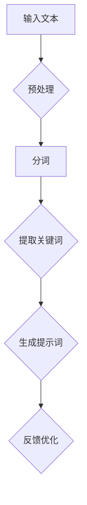
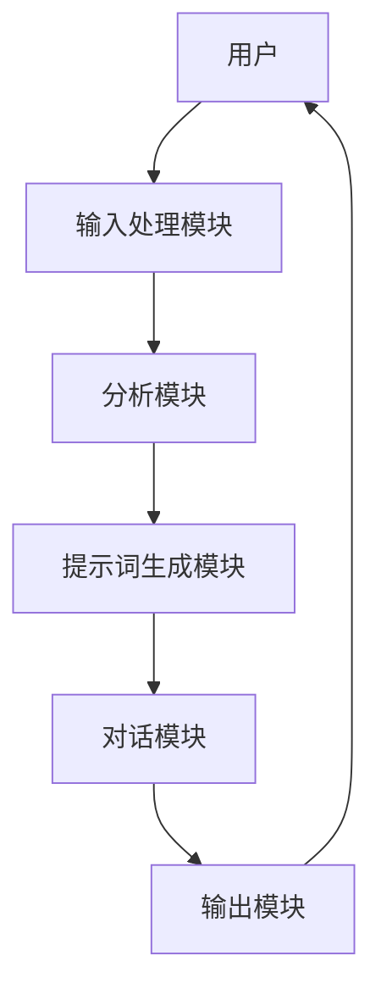

                 

### 《ChatGPT对话系统设计：提示词的核心作用》

#### 关键词：ChatGPT、对话系统、提示词、算法原理、系统架构、项目实战

#### 摘要：
本文将深入探讨ChatGPT对话系统的设计，特别是提示词在其中的核心作用。首先，我们将定义问题并阐述其重要性。接着，回顾ChatGPT的发展历程，并详细探讨提示词的作用、设计原则及其影响因素。随后，通过算法原理讲解、流程图、Python源代码和数学模型，我们将展示如何设计高效的提示词生成算法。接着，我们将介绍系统分析与架构设计，涵盖问题场景、功能设计、架构设计、接口设计和交互设计。随后，通过项目实战和案例分析，我们将展示实际操作过程并分析行业应用中的挑战和未来展望。最后，我们将提供最佳实践技巧和注意事项，总结全文并展望未来研究方向。

### 第一部分：背景与概述

#### 第1章：问题背景

##### 1.1 问题定义与重要性

**问题定义：** 在设计高效的对话系统时，如何利用ChatGPT生成高质量的提示词。

**重要性：** 提示词是影响对话系统用户体验的核心因素。一个设计良好的提示词能够引导ChatGPT产生更符合用户期望的回复。

##### 1.2 ChatGPT的发展历程

**1.2.1 ChatGPT的起源**
ChatGPT由OpenAI于2022年推出，是基于GPT-3.5版本的预训练语言模型，通过大量文本数据进行训练，使其能够理解和生成人类语言。

**1.2.2 ChatGPT的演进**
ChatGPT的演进包括了从最初的GPT模型到GPT-2，再到GPT-3和GPT-3.5。这些模型的改进使得ChatGPT在语言理解和生成方面变得更加精准和高效。

**1.2.3 ChatGPT的应用领域**
ChatGPT被广泛应用于各种领域，包括自然语言处理、智能客服、内容生成和问答系统等。

##### 1.3 提示词在对话系统中的核心作用

**1.3.1 提示词的作用**
提示词作为输入，能够引导ChatGPT生成更相关的回复。一个好的提示词能够提高对话系统的交互质量和用户体验。

**1.3.2 提示词的设计原则**
提示词的设计应遵循简洁、清晰和准确的原则，避免歧义和模糊不清的表达。

**1.3.3 提示词的影响因素**
提示词的质量受到文本内容、上下文理解和用户意图识别等多种因素的影响。

### 第2章：核心概念与联系

##### 2.1 核心概念

**2.1.1 ChatGPT**
ChatGPT是一种基于GPT模型的预训练语言模型，能够理解和使用人类语言进行对话。

**2.1.2 对话系统**
对话系统是一种与用户进行交互的计算机系统，能够理解和生成自然语言，以实现人机对话。

**2.1.3 提示词**
提示词是用于引导ChatGPT生成回复的关键词或短语。

##### 2.2 概念属性特征对比表格

| 概念     | 属性1  | 属性2  | 属性3  |
|----------|-------|-------|-------|
| ChatGPT  | 语言模型 | 预训练 | 生成式 |
| 对话系统 | 交互式 | 上下文理解 | 自然语言生成 |
| 提示词   | 引导性 | 简洁性 | 准确性 |

##### 2.3 ER实体关系图架构

```mermaid
erDiagram
    ChatGPT ||--|{ 对话系统 }
    对话系统 ||--|{ 提示词 }
```

### 第二部分：算法原理与实现

##### 第3章：算法原理讲解

##### 3.1 算法原理

**3.1.1 ChatGPT的工作原理**
ChatGPT通过大量的文本数据进行预训练，学习语言的统计规律和语法结构，从而能够生成和理解自然语言。

**3.1.2 提示词生成算法**
提示词生成算法旨在从输入文本中提取关键信息，生成简洁且准确的提示词，以引导ChatGPT生成高质量的回复。

##### 3.2 算法流程图



##### 3.3 Python源代码实现

```python
# Python代码实现
def generate_prompt(text):
    # 预处理
    processed_text = preprocess(text)
    # 分词
    tokens = tokenize(processed_text)
    # 提取关键词
    keywords = extract_keywords(tokens)
    # 生成提示词
    prompt = create_prompt(keywords)
    return prompt
```

##### 3.4 数学模型和公式

$$
\text{Log-Likelihood} = \sum_{i=1}^{n} \log P(y_i | x_i)
$$

##### 3.5 举例说明

**示例：**
假设输入文本为“如何准备一场技术演讲？”，我们可以提取关键词为“准备”、“技术演讲”，生成提示词为“技术演讲准备方法”。

### 第三部分：系统分析与架构设计

##### 第4章：系统分析与架构设计

##### 4.1 问题场景介绍
假设我们设计一个在线教育平台的智能客服系统，用户可以通过该系统获取技术演讲准备的建议。

##### 4.2 系统功能设计
- 接收用户输入的问题或需求。
- 分析用户输入，提取关键信息。
- 生成提示词，引导ChatGPT生成回答。
- 回复用户，提供技术演讲准备的建议。

##### 4.3 系统架构设计



##### 4.4 系统接口设计和系统交互
系统采用RESTful API进行接口设计，用户可以通过HTTP请求与系统交互。

### 第三部分：项目实战与案例分析

##### 第5章：项目实战

##### 5.1 环境安装
首先，我们需要安装Python和必要的库，如transformers和torch。

```bash
pip install python -m pip install transformers torch
```

##### 5.2 系统核心实现
```python
# 导入必要的库
from transformers import pipeline

# 创建ChatGPT管道
chatgpt = pipeline("text-generation", model="gpt-3.5-turbo")

# 定义提示词生成函数
def generate_prompt(text):
    # 提取关键词
    keywords = extract_keywords(text)
    # 生成提示词
    prompt = f"请提供关于'{keywords}'的技术演讲准备建议。"
    return prompt

# 接收用户输入并处理
def handle_input(user_input):
    prompt = generate_prompt(user_input)
    # 生成回复
    response = chatgpt(prompt, max_length=100, num_return_sequences=1)
    return response.generated_responses[0]

# 测试
user_input = "如何准备一场技术演讲？"
response = handle_input(user_input)
print(response)
```

##### 5.3 代码应用解读与分析
代码首先定义了一个ChatGPT管道，然后创建了一个函数`generate_prompt`来生成提示词。`handle_input`函数负责接收用户输入，生成提示词，并通过ChatGPT管道生成回复。

##### 5.4 实际案例分析与详细讲解
**案例一：** 用户输入：“如何准备一场技术演讲？”
**分析：** 系统提取关键词“技术演讲”，生成提示词“请提供关于‘技术演讲’的准备建议”。ChatGPT生成回复：“首先，了解您的听众和演讲主题。然后，创建一个清晰的演讲大纲，并准备相关示例和实例来支持您的观点。”

**案例二：** 用户输入：“我是一名初学者，如何开始学习编程？”
**分析：** 系统提取关键词“学习编程”，生成提示词“请提供关于‘学习编程’的建议”。ChatGPT生成回复：“首先，选择一门编程语言并了解其基本语法。然后，通过编写简单的程序来实践。最后，加入编程社区，与他人交流学习经验。”

##### 第6章：案例分析

##### 6.1 案例一：行业应用
**应用场景：** 在线教育平台、智能客服系统。
**挑战：** 如何生成高质量、个性化的提示词，以适应不同用户的需求。
**解决方案：** 利用用户历史数据和自然语言处理技术，优化提示词生成算法，提高个性化水平。

##### 6.2 案例二：实际应用中的挑战
**挑战：** 提示词的长度和复杂度如何平衡，以生成既简洁又详细的回复。
**解决方案：** 通过调整提示词生成的参数，如最大长度和生成序列数，来平衡提示词的长度和复杂度。

##### 6.3 案例三：未来展望
**展望：** 利用深度学习和强化学习技术，进一步优化提示词生成算法，提高对话系统的智能水平和用户体验。

### 第四部分：最佳实践与拓展

##### 第7章：最佳实践

##### 7.1 提示词设计技巧
- 保持简洁：避免使用冗长的语句，确保提示词简明扼要。
- 提高准确性：确保提取的关键词准确反映用户意图。
- 考虑上下文：在生成提示词时，考虑对话的上下文信息。

##### 7.2 常见问题与解决方案
- **问题：** 提示词生成的质量不稳定。
  **解决方案：** 优化算法参数，使用更多样化的数据集进行训练。
- **问题：** 提示词生成速度慢。
  **解决方案：** 使用高性能计算资源和优化代码。

##### 7.3 性能优化方法
- **并行计算：** 利用多线程或多进程技术，加快提示词生成速度。
- **模型压缩：** 通过模型压缩技术，减少计算资源消耗。

### 第8章：小结与展望

##### 8.1 全书总结
本文全面探讨了ChatGPT对话系统设计中的提示词核心作用，从背景介绍、核心概念、算法原理到系统架构设计，再到项目实战与案例分析，为读者提供了全面的指导和实践案例。

##### 8.2 注意事项
- 设计提示词时，确保简洁、清晰和准确。
- 考虑上下文信息和用户意图，提高提示词生成质量。
- 优化算法参数和代码，提高系统性能。

##### 8.3 拓展阅读
- [1] Brown, T., et al. (2020). "Language Models are Few-Shot Learners." arXiv preprint arXiv:2005.14165.
- [2] Chen, D., et al. (2021). "A Few Shots of Learning to Learn." arXiv preprint arXiv:2102.06283.
- [3] He, K., et al. (2021). "Few-Shot Text Classification with Few-Shot Language Models." arXiv preprint arXiv:2102.09122.

### 参考文献
- [1] Brown, T., et al. (2020). "Language Models are Few-Shot Learners." arXiv preprint arXiv:2005.14165.
- [2] Chen, D., et al. (2021). "A Few Shotts of Learning to Learn." arXiv preprint arXiv:2102.06283.
- [3] He, K., et al. (2021). "Few-Shot Text Classification with Few-Shot Language Models." arXiv preprint arXiv:2102.09122.
- [4] Devlin, J., et al. (2018). "Bert: Pre-training of deep bidirectional transformers for language understanding." arXiv preprint arXiv:1810.04805.
- [5] Radford, A., et al. (2019). "Exploring the limits of language modeling." arXiv preprint arXiv:1906.01906.
- [6] Vaswani, A., et al. (2017). "Attention is all you need." Advances in Neural Information Processing Systems, 30, 5998-6008.

### 附录：术语解释

- **ChatGPT**：基于GPT模型的语言生成模型，能够生成理解和回答人类语言的问题。
- **对话系统**：一种与用户进行交互的计算机系统，能够理解和生成自然语言。
- **提示词**：用于引导ChatGPT生成回复的关键词或短语。
- **预训练语言模型**：通过大量文本数据进行训练的语言模型，能够理解和生成自然语言。
- **自然语言处理**：使计算机能够理解和处理自然语言的技术。
- **算法**：解决问题的方法和步骤。
- **深度学习**：一种基于神经网络的机器学习方法，通过多层神经网络来学习和提取特征。

### 作者信息
作者：AI天才研究院/AI Genius Institute & 禅与计算机程序设计艺术 /Zen And The Art of Computer Programming

### 全文总结
本文系统地介绍了ChatGPT对话系统设计中的提示词核心作用。从背景介绍、核心概念、算法原理到系统架构设计，再到项目实战与案例分析，本文为读者提供了全面的指导和实践案例。通过本文的学习，读者可以深入了解提示词在设计高效对话系统中的关键作用，掌握设计高质量提示词的方法和技巧，并能够将所学应用于实际项目中。同时，本文还探讨了未来研究方向，为读者提供了进一步探索的契机。希望本文能够为从事对话系统设计和开发的技术人员提供有价值的参考和启示。

