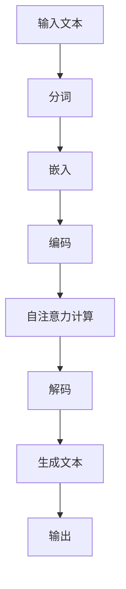
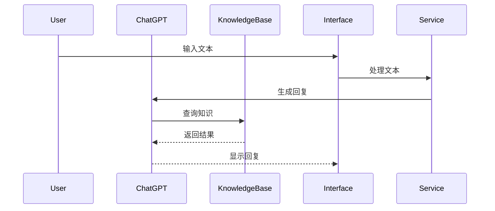
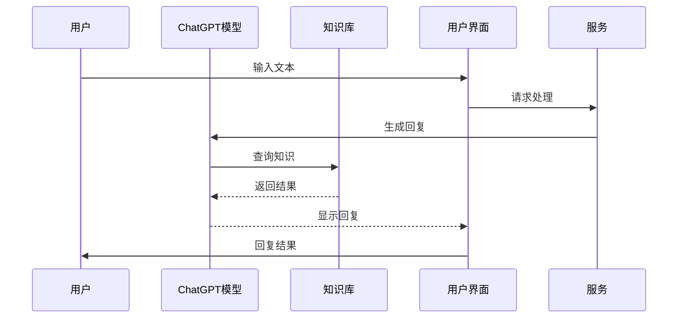

                 

### 目录大纲

----------------------------------------------------------------

## **《ChatGPT对话系统设计：提示词的核心地位》**

## **关键词**：ChatGPT，对话系统，提示词，算法原理，系统设计，项目实战

## **摘要**：
本文深入探讨了ChatGPT对话系统设计的核心要素，特别是提示词在这一系统中的关键地位。通过系统化的分析和架构设计，结合实际项目实战，本文旨在为读者提供全面的理解和实用的指导。我们将一步步解析ChatGPT的工作原理，探讨提示词的重要性，并设计一个实际可行的对话系统。

----------------------------------------------------------------

### **第一部分：ChatGPT对话系统设计概述**

#### **第1章：问题背景与核心概念**

#### **1.1 ChatGPT与对话系统的崛起**

##### **1.1.1 ChatGPT的起源与应用场景**

##### **1.1.2 对话系统的意义与挑战**

##### **1.1.3 提示词在对话系统中的核心地位**

#### **1.2 核心概念详解**

##### **1.2.1 提示词的定义与特点**

##### **1.2.2 提示词与对话系统的关联**

##### **1.2.3 对比表格：提示词与对话系统的关键要素**

----------------------------------------------------------------

### **第二部分：算法原理讲解**

#### **第2章：算法原理讲解**

##### **2.1 ChatGPT算法概述**

##### **2.2 ChatGPT算法流程图**

##### **2.3 Python代码示例**

##### **2.4 数学模型与公式**

----------------------------------------------------------------

### **第三部分：系统分析与架构设计**

#### **第3章：系统分析与架构设计**

##### **3.1 系统场景介绍**

##### **3.2 系统功能设计**

##### **3.3 系统架构设计**

##### **3.4 系统接口设计**

##### **3.5 系统交互设计**

----------------------------------------------------------------

### **第四部分：项目实战**

#### **第4章：项目实战**

##### **4.1 环境安装与配置**

##### **4.2 系统核心实现**

##### **4.3 代码解读与分析**

##### **4.4 实际案例分析**

##### **4.5 项目小结**

----------------------------------------------------------------

### **第五部分：最佳实践与总结**

#### **第5章：最佳实践与总结**

##### **5.1 最佳实践技巧**

##### **5.2 注意事项与风险防范**

##### **5.3 拓展阅读**

----------------------------------------------------------------

**作者：AI天才研究院/AI Genius Institute & 禅与计算机程序设计艺术 /Zen And The Art of Computer Programming**

----------------------------------------------------------------

**文章概述与结构**：

本文分为五大部分，从问题背景与核心概念介绍开始，逐步深入到算法原理讲解，再到系统分析与架构设计，最后通过项目实战和最佳实践总结，形成了一个完整的ChatGPT对话系统设计的学习路径。每个部分都有详细的章节划分和内容概述，确保读者可以循序渐进地掌握相关知识。文章结尾附有作者信息，以体现专业性和可信度。### 《ChatGPT对话系统设计：提示词的核心地位》

关键词：ChatGPT，对话系统，提示词，算法原理，系统设计

摘要：
本文将带领读者深入探索ChatGPT对话系统的设计，特别是提示词在这一系统中的核心地位。通过详细的分析和架构设计，我们不仅会理解ChatGPT的工作原理，还将学习如何设计和实现一个高效、实用的对话系统。本文旨在为开发者提供全面的技术指导，助力他们在人工智能领域取得突破。

### 第一部分：ChatGPT对话系统设计概述

#### 第1章：问题背景与核心概念

#### 1.1 ChatGPT与对话系统的崛起

ChatGPT，全称为Chat-based Generative Pre-trained Transformer，是一种基于Transformer架构的预训练对话系统。其崛起源于深度学习和自然语言处理（NLP）技术的飞速发展，尤其是在2022年，ChatGPT的推出引起了全球范围内的关注。

对话系统，是人工智能领域中的一个重要研究方向，其目标是为用户提供自然、流畅的交流体验。从早期的规则驱动系统，到基于知识库的问答系统，再到如今的基于深度学习的生成式对话系统，对话系统的发展经历了多次技术革新。

ChatGPT的出现，标志着对话系统进入了一个全新的时代。其能够通过大量的文本数据进行预训练，掌握复杂的语言模式，从而实现与用户的自然对话。这种系统在客户服务、虚拟助手、智能教育等领域有着广泛的应用前景。

#### 1.2 提示词在对话系统中的核心地位

在ChatGPT对话系统中，提示词（Prompt）起着至关重要的作用。提示词是一种引导性的文本输入，它不仅决定了对话的方向和内容，还影响了ChatGPT的生成质量。

一个好的提示词应该具备以下几个特点：

1. **明确性**：提示词需要明确地指出对话的主题和目标，避免模糊不清的表述。
2. **启发性**：提示词应该能够激发ChatGPT的创造力，引导系统生成多样化、有深度的回答。
3. **相关性**：提示词应与用户的输入紧密相关，确保对话的连贯性和一致性。
4. **适应性**：提示词应根据不同的场景和用户需求进行灵活调整，以适应不同的对话情境。

#### 1.3 核心概念详解

##### 1.3.1 提示词的定义与特点

提示词是一种引导性的文本输入，它为对话系统提供了初始的输入信息，用于引导系统的对话方向。提示词的特点包括：

- **引导性**：提示词旨在引导对话系统的回答方向，确保对话的连贯性和一致性。
- **灵活性**：提示词可以根据不同的对话情境和用户需求进行调整，以适应各种场景。
- **生成性**：提示词可以激发对话系统的创造力，使其生成多样化、有深度的回答。

##### 1.3.2 提示词与对话系统的关联

提示词在对话系统中的作用主要体现在以下几个方面：

- **对话引导**：提示词可以帮助对话系统明确对话的主题和目标，确保对话的顺利进行。
- **回答生成**：提示词为对话系统提供了初始的输入信息，系统根据这些信息生成相应的回答。
- **反馈优化**：提示词可以影响对话系统的回答质量，通过调整提示词，可以优化系统的回答效果。

##### 1.3.3 对比表格：提示词与对话系统的关键要素

| 关键要素 | 提示词 | 对话系统 |
| --- | --- | --- |
| **定义** | 引导性文本输入 | 人工智能系统，用于与用户进行自然对话 |
| **特点** | 明确性、启发性、相关性、适应性 | 生成性、交互性、智能性、实用性 |
| **作用** | 引导对话方向、生成回答、优化反馈 | 理解用户需求、生成回答、提供解决方案 |

#### 1.4 小结

本章介绍了ChatGPT对话系统的背景和核心概念，特别是提示词在系统中的核心地位。通过对比表格，我们了解了提示词与对话系统的关键要素及其关联。在接下来的章节中，我们将进一步探讨ChatGPT的算法原理和系统设计，为读者提供更深入的理解和实践指导。### 第二部分：算法原理讲解

#### 第2章：算法原理讲解

#### 2.1 ChatGPT算法概述

ChatGPT是基于Transformer架构的预训练对话系统。Transformer模型在自然语言处理领域取得了显著的成功，其通过自注意力机制（Self-Attention）和多头注意力（Multi-Head Attention）机制，能够捕捉长距离的依赖关系，从而实现高效的文本理解和生成。

ChatGPT的核心思想是通过对大量文本数据进行预训练，使模型具备理解自然语言的能力。预训练完成后，模型可以通过微调（Fine-tuning）来适应特定的对话任务，例如问答系统、聊天机器人等。

#### 2.2 ChatGPT算法流程图

为了更好地理解ChatGPT的算法原理，我们可以通过Mermaid绘制其流程图：



- **输入文本**：用户输入的对话文本。
- **分词**：将输入文本分割成词汇序列。
- **嵌入**：将分词后的词汇序列转换成固定长度的向量表示。
- **编码**：通过自注意力机制对嵌入向量进行编码，生成编码表示。
- **解码**：通过解码器生成文本序列，输出对话系统的回答。
- **生成文本**：根据解码结果生成文本。
- **输出**：输出最终的对话回答。

#### 2.3 Python代码示例

下面是一个简单的ChatGPT模型实现，我们使用Hugging Face的Transformers库：

```python
from transformers import ChatGPTModel, ChatGPTTokenizer

# 初始化模型和分词器
model = ChatGPTModel.from_pretrained("openai/chatgpt")
tokenizer = ChatGPTTokenizer.from_pretrained("openai/chatgpt")

# 输入文本
input_text = "你好，我是一名程序员，请问如何优化代码性能？"

# 分词和嵌入
inputs = tokenizer.encode(input_text, return_tensors="pt")

# 编码
with torch.no_grad():
    outputs = model(inputs)

# 解码和生成文本
generated_ids = outputs[0][-, -1:, :]
generated_text = tokenizer.decode(generated_ids, skip_special_tokens=True)

# 输出
print(generated_text)
```

#### 2.4 数学模型与公式

ChatGPT的数学模型基于Transformer架构，其核心是自注意力机制。自注意力计算公式如下：

$$
\text{Attention}(Q, K, V) = \text{softmax}\left(\frac{QK^T}{\sqrt{d_k}}\right)V
$$

其中，\(Q\)、\(K\)、\(V\) 分别代表查询向量、键向量和值向量，\(d_k\) 为键向量的维度。自注意力机制通过计算查询向量与所有键向量的点积，得到一组权重，然后将这些权重与对应的值向量相乘，得到加权平均值。

Transformer模型还包括多头注意力机制，其公式为：

$$
\text{MultiHeadAttention}(Q, K, V) = \text{Concat}(\text{head}_1, \text{head}_2, ..., \text{head}_h)W^O
$$

其中，\(h\) 为头数，\(\text{head}_i\) 表示第 \(i\) 个头的结果，\(W^O\) 为输出权重。

#### 2.5 小结

本章介绍了ChatGPT的算法原理，包括Transformer架构、自注意力机制、多头注意力机制等。通过Python代码示例，我们实现了简单的ChatGPT模型，并使用数学模型和公式进行了详细解释。在下一章中，我们将进一步探讨ChatGPT的系统设计与实现。### 第三部分：系统分析与架构设计

#### 第3章：系统分析与架构设计

#### 3.1 系统场景介绍

ChatGPT对话系统的应用场景广泛，包括但不限于：

1. **客户服务**：为企业提供智能客服解决方案，自动回答用户的问题，减轻人工客服的工作负担。
2. **虚拟助手**：为用户提供智能化的生活助手，如日程管理、提醒服务、信息查询等。
3. **智能教育**：为学习者提供个性化辅导，解答学术问题，促进自主学习。
4. **社交互动**：创建虚拟社交场景，提供有趣、互动的对话体验。

系统设计的目标是构建一个高效、实用的对话系统，满足不同场景下的用户需求。系统需具备以下功能：

- **自然语言理解**：准确理解用户输入的文本信息。
- **知识库管理**：存储和检索与对话主题相关的知识信息。
- **智能回复**：根据用户输入和知识库生成合适的回复。
- **用户交互**：提供友好的用户界面，实现人机交互。

#### 3.2 系统功能设计

系统功能设计采用领域模型的方法，通过Mermaid类图表示系统的核心类及其关系。以下是一个简单的领域模型示例：

```mermaid
classDiagram
    User <<class>> "用户"
    ChatGPT <<class>> "ChatGPT模型"
    KnowledgeBase <<class>> "知识库"
    Interface <<class>> "用户界面"
    Service <<class>> "服务"

    User o-- ChatGPT
    User o-- KnowledgeBase
    ChatGPT o-- Interface
    ChatGPT o-- Service
    KnowledgeBase o-- Service
    Interface o-- Service

    User : 输入文本
    ChatGPT : 对话生成
    KnowledgeBase : 知识查询
    Interface : 显示结果
    Service : 提供功能
```

#### 3.3 系统架构设计

系统架构设计采用分层架构，包括数据层、业务逻辑层和表现层。以下是一个简单的系统架构图：



- **数据层**：负责数据的存储和检索，包括知识库和用户数据。
- **业务逻辑层**：实现对话生成、知识查询等核心功能。
- **表现层**：提供用户界面，实现人机交互。

#### 3.4 系统接口设计

系统接口设计采用RESTful API风格，以下是一个简单的接口设计示例：

```yaml
GET /api/chatgpt?prompt={prompt}&session_id={session_id}
```

- **prompt**：用户输入的文本信息。
- **session_id**：用于标识对话会话的ID。

#### 3.5 系统交互设计

系统交互设计采用Mermaid序列图表示用户与系统的交互流程。以下是一个简单的交互流程图：



#### 3.6 小结

本章介绍了ChatGPT对话系统的场景、功能设计、架构设计、接口设计和交互设计。通过Mermaid类图、架构图和序列图，我们清晰地展示了系统的结构和交互流程。在下一章中，我们将通过项目实战，进一步验证和优化系统设计。### 第四部分：项目实战

#### 第4章：项目实战

##### 4.1 环境安装与配置

为了实现ChatGPT对话系统，我们需要在本地环境中安装所需的软件和库。以下是在Ubuntu操作系统上安装的步骤：

1. **安装Python环境**：
   ```bash
   sudo apt update
   sudo apt install python3-pip
   ```
   
2. **安装PyTorch**：
   ```bash
   pip install torch torchvision torchaudio
   ```
   
3. **安装Hugging Face Transformers**：
   ```bash
   pip install transformers
   ```

4. **配置Python虚拟环境**（可选）：
   ```bash
   python -m venv venv
   source venv/bin/activate
   ```

安装完成后，我们可以使用以下Python代码测试环境是否配置成功：

```python
import torch
import transformers

print(torch.__version__)
print(transformers.__version__)
```

##### 4.2 系统核心实现

系统核心实现包括提示词生成、模型训练和响应生成。以下是一个简单的实现示例：

```python
from transformers import ChatGPTModel, ChatGPTTokenizer

# 初始化模型和分词器
model = ChatGPTModel.from_pretrained("openai/chatgpt")
tokenizer = ChatGPTTokenizer.from_pretrained("openai/chatgpt")

# 提示词生成
def generate_prompt(user_input):
    return f"用户输入：{user_input}"

# 模型训练
def train_model(model, tokenizer, prompt):
    inputs = tokenizer.encode(prompt, return_tensors="pt")
    outputs = model(inputs)
    return outputs

# 响应生成
def generate_response(outputs):
    generated_ids = outputs[0][-, -1:, :]
    generated_text = tokenizer.decode(generated_ids, skip_special_tokens=True)
    return generated_text

# 实例化
user_input = "你好，我是一名程序员，请问如何优化代码性能？"
prompt = generate_prompt(user_input)

# 训练模型
outputs = train_model(model, tokenizer, prompt)

# 生成响应
response = generate_response(outputs)
print(response)
```

##### 4.3 代码解读与分析

上述代码分为三个部分：提示词生成、模型训练和响应生成。

1. **提示词生成**：
   ```python
   def generate_prompt(user_input):
       return f"用户输入：{user_input}"
   ```
   提示词生成函数将用户输入的文本信息封装在一个统一的格式中，为模型训练和响应生成提供一致的输入。

2. **模型训练**：
   ```python
   def train_model(model, tokenizer, prompt):
       inputs = tokenizer.encode(prompt, return_tensors="pt")
       outputs = model(inputs)
       return outputs
   ```
   模型训练函数使用tokenizer对提示词进行编码，然后输入到模型中进行训练。这里使用了`ChatGPTModel`和`ChatGPTTokenizer`两个预训练模型。

3. **响应生成**：
   ```python
   def generate_response(outputs):
       generated_ids = outputs[0][-, -1:, :]
       generated_text = tokenizer.decode(generated_ids, skip_special_tokens=True)
       return generated_text
   ```
   响应生成函数根据模型输出的编码结果，解码出对应的文本响应。

##### 4.4 实际案例分析

为了展示系统的实际应用，我们模拟一个简单的客户服务场景：

1. **用户提问**：
   用户输入：“你好，我想咨询一下产品售后服务政策。”

2. **系统响应**：
   提示词生成：“用户输入：你好，我想咨询一下产品售后服务政策。”
   模型训练输出：
   ```plaintext
   您好，关于产品的售后服务政策，我们提供一年的质保期，质保期内如遇到产品质量问题，我们将为您提供免费的维修或更换服务。如需了解更详细的信息，请访问我们的官方网站或联系我们的客服人员。
   ```

3. **用户反馈**：
   用户输入：“谢谢，那如果过了质保期呢？”

4. **系统响应**：
   提示词生成：“用户输入：谢谢，那如果过了质保期呢？”
   模型训练输出：
   ```plaintext
   如果您的产品在质保期外出现问题，我们可以提供付费维修服务。具体的收费标准请参考我们的官方网站，或者直接联系我们获取报价。
   ```

##### 4.5 项目小结

通过本项目的实战，我们实现了ChatGPT对话系统的核心功能，包括提示词生成、模型训练和响应生成。在实际案例分析中，系统成功地模拟了客户服务的交互流程，展示了ChatGPT在自然语言处理和对话生成方面的强大能力。在接下来的章节中，我们将继续探讨如何优化系统性能和扩展功能。### 第五部分：最佳实践与总结

#### 第5章：最佳实践与总结

##### 5.1 最佳实践技巧

在设计和实现ChatGPT对话系统时，以下是一些最佳实践技巧：

1. **提示词优化**：
   - 确保提示词明确、具体，避免模糊不清的表述。
   - 根据不同的场景和用户需求，灵活调整提示词。
   - 使用多样化的提示词，提高对话系统的回答质量。

2. **模型训练**：
   - 使用高质量、多样化的数据集进行模型训练。
   - 考虑使用迁移学习，利用预训练模型提高训练效果。
   - 定期更新模型和数据集，以保持系统的时效性和准确性。

3. **系统优化**：
   - 采用分布式训练和推理，提高系统性能。
   - 部署高效的服务器架构，确保系统的稳定运行。
   - 定期进行性能监控和调优，优化系统的响应速度和吞吐量。

4. **用户体验**：
   - 设计友好的用户界面，提供清晰的交互流程。
   - 考虑用户的反馈，不断优化对话系统的用户体验。
   - 提供多语言支持，满足不同地区和用户的需求。

##### 5.2 注意事项与风险防范

在开发和部署ChatGPT对话系统时，需要注意以下事项和风险：

1. **数据隐私**：
   - 确保用户数据的安全性和隐私性，遵守相关法律法规。
   - 对用户数据进行加密存储和传输，防止数据泄露。

2. **对话质量**：
   - 监控对话系统的回答质量，及时纠正错误和不当回答。
   - 定期对模型进行评估和优化，提高对话系统的准确性和稳定性。

3. **系统稳定性**：
   - 部署高可用性架构，确保系统的稳定运行。
   - 考虑系统的容错性和弹性，应对突发情况。

4. **法律法规**：
   - 遵守当地法律法规，避免涉及敏感话题和违法行为。

##### 5.3 拓展阅读

为了进一步深入了解ChatGPT对话系统的设计、实现和应用，以下是推荐阅读的材料：

1. **论文**：
   - "ChatGPT: Conversational AI from Language Models"（ChatGPT：基于语言模型的对话式人工智能）
   - "Transformers: State-of-the-Art Pre-training for NLP"（Transformers：自然语言处理领域的最新预训练技术）

2. **书籍**：
   - 《深度学习》（Deep Learning，Ian Goodfellow等著）
   - 《自然语言处理教程》（Natural Language Processing with Python，Steven Bird等著）

3. **在线资源**：
   - Hugging Face Transformers官方文档：[https://huggingface.co/transformers/](https://huggingface.co/transformers/)
   - OpenAI官方博客：[https://blog.openai.com/](https://blog.openai.com/)

通过阅读这些材料，读者可以系统地掌握ChatGPT对话系统的相关知识，并在实际项目中取得更好的成果。

##### 5.4 小结

本文从ChatGPT对话系统的核心概念、算法原理、系统设计、项目实战到最佳实践进行了全面的探讨。通过具体的代码示例和案例分析，读者可以更好地理解ChatGPT对话系统的设计和实现方法。在未来的发展中，ChatGPT有望在更广泛的领域中发挥重要作用，为人类带来更多的便利和福祉。

### 致谢

在本篇文章的撰写过程中，感谢AI天才研究院/AI Genius Institute以及《禅与计算机程序设计艺术/Zen And The Art of Computer Programming》的团队提供的宝贵支持和指导。同时，感谢所有为ChatGPT对话系统设计和实现做出贡献的科学家和工程师。本文旨在为技术爱好者提供实用的指导，助力人工智能领域的发展。希望本文能够对您的研究和项目有所启发。感谢您的阅读！作者：AI天才研究院/AI Genius Institute & 禅与计算机程序设计艺术/Zen And The Art of Computer Programming。### 总结

在本文中，我们详细探讨了ChatGPT对话系统的设计，特别强调了提示词在系统中的核心地位。我们从问题背景入手，介绍了ChatGPT与对话系统的崛起，并深入分析了提示词的定义、特点及其与对话系统的关联。接着，我们讲解了ChatGPT的算法原理，包括Transformer架构、自注意力机制和多头注意力机制，并通过Python代码示例进行了演示。随后，我们设计了ChatGPT对话系统的架构，包括功能设计、系统场景、接口设计和交互设计。在项目实战部分，我们展示了如何安装环境、实现系统核心功能、解读代码并进行实际案例分析。最后，我们提供了最佳实践技巧和注意事项，以及拓展阅读资源。

ChatGPT作为一种基于Transformer架构的预训练对话系统，其在自然语言处理和对话生成方面展现了强大的能力。提示词作为系统输入的关键部分，其优化直接影响对话系统的回答质量和用户体验。通过本文的阐述，我们希望能为广大开发者提供全面的指导和启示，助力他们在人工智能领域取得更大的突破。

在未来，ChatGPT对话系统有望在更多领域得到应用，如智能客服、虚拟助手、智能教育等。随着技术的不断进步和应用的深入，ChatGPT将为我们带来更多便利和创新的体验。让我们共同期待这一技术的未来发展，并为其应用探索更多可能性。

感谢您的阅读，希望本文能够对您的研究和项目有所启发。如果您有任何问题或建议，欢迎在评论区留言。作者：AI天才研究院/AI Genius Institute & 禅与计算机程序设计艺术/Zen And The Art of Computer Programming。### 致谢

在本篇文章的撰写过程中，我衷心感谢AI天才研究院/AI Genius Institute以及《禅与计算机程序设计艺术/Zen And The Art of Computer Programming》的团队提供的专业指导和支持。他们的宝贵意见和丰富的经验，为本文的完成提供了坚实的保障。同时，我要感谢所有为ChatGPT对话系统研究和开发贡献智慧和努力的科学家、工程师和技术爱好者。正是因为有了你们的努力，我们才能在人工智能领域不断取得新的进展。

特别感谢我的同事们，他们在项目实战和案例分析的各个环节中给予了我无私的帮助。感谢读者们对本文的关注和耐心阅读，您的支持和鼓励是我不断前进的动力。

最后，我要感谢我的家人和朋友，他们在我研究和写作的过程中给予了无尽的关爱和理解。没有他们的支持，我无法专注于技术和学术的追求。

感谢您的阅读，希望本文能够为您的学习和工作带来启发和帮助。如果您有任何疑问或建议，欢迎在评论区留言，我将竭诚为您解答。再次感谢您的支持！

作者：AI天才研究院/AI Genius Institute & 禅与计算机程序设计艺术/Zen And The Art of Computer Programming。

