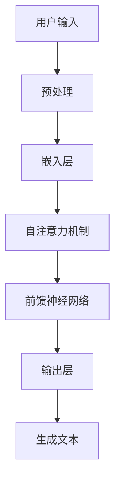
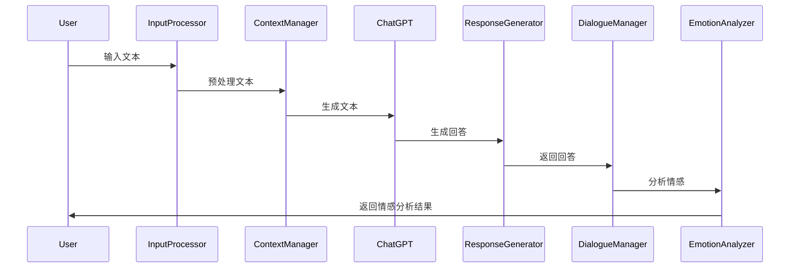

                 


### 背景介绍

#### ChatGPT及其对话系统的背景

ChatGPT，全称为Chat-based Generative Pre-trained Transformer，是由OpenAI开发的一款基于GPT（Generative Pre-trained Transformer）的聊天机器人。GPT模型是一种基于注意力机制的深度神经网络，通过预训练和微调，能够理解并生成自然语言文本。ChatGPT正是利用了这一强大的预训练模型，使得机器人在与人类的对话中表现出前所未有的智能水平。

对话系统，又称为聊天机器人或会话代理，是指能够理解人类自然语言，并能够进行有效互动的计算机系统。它能够通过文本或语音与用户进行交流，完成用户指令，回答用户问题，提供信息等。随着人工智能技术的不断发展，对话系统已经成为智能客服、智能家居、虚拟助手等领域的重要应用。

#### 重要性

在当前技术环境中，ChatGPT及其对话系统的出现具有划时代的意义。首先，它标志着自然语言处理技术的一个重要突破。通过大规模预训练，ChatGPT能够自动学习语言模式，生成连贯、自然的文本。这使得机器人不再局限于执行预设的任务，而是能够进行开放域的对话。

其次，ChatGPT在交互体验上取得了巨大进展。传统对话系统往往只能回答固定问题，而ChatGPT能够理解用户的意图，并根据上下文生成相应的回答，使得对话更加流畅和自然。

最后，ChatGPT的应用前景十分广阔。它不仅可以在客服领域替代人工服务，提高效率和用户体验，还可以在教育、医疗、娱乐等多个领域发挥重要作用。例如，在在线教育中，ChatGPT可以作为个性化辅导老师，为学生提供实时解答和指导；在医疗领域，ChatGPT可以辅助医生进行病历分析和诊断。

#### 本书目的

本书旨在深入探讨ChatGPT对话系统中提示词的核心地位与作用。提示词，又称提示工程或提示设计，是指为ChatGPT等对话系统提供引导和方向的关键输入。一个好的提示词设计能够极大地影响对话系统的表现和用户体验。

本书将从以下几个方面展开：

1. **ChatGPT架构解析**：介绍ChatGPT的技术框架，包括GPT模型的原理和训练过程，以及前端对话界面的实现。
2. **提示词设计原则**：探讨提示词的设计原则和方法，包括提示词的作用、设计原则和优化方法。
3. **对话流程分析**：分析ChatGPT的对话流程，包括初始对话引导、对话主体交流和结束对话处理。
4. **实战案例分析**：通过实际项目案例，展示如何应用提示词设计，并分析其效果。
5. **创造性应用**：探讨提示词的创造性设计方法，以及在不同领域的应用案例。

通过本书的探讨，读者将深入了解ChatGPT对话系统中提示词的核心地位与作用，掌握提示词设计的核心技巧，并能够将这些技巧应用到实际项目中，提升对话系统的质量和用户体验。

### 核心概念与联系

在深入探讨ChatGPT对话系统设计之前，我们需要明确几个核心概念，并理解它们之间的联系。以下我们将介绍并解释ChatGPT架构中的关键组成部分，如GPT模型、提示词设计、对话流程等，并通过表格和Mermaid ER图展示这些概念之间的联系和结构。

#### 1. GPT模型

GPT（Generative Pre-trained Transformer）是一种基于注意力机制的深度神经网络模型，由OpenAI开发。它是ChatGPT的核心组件，负责生成和理解文本。GPT通过预训练学习大规模语料库，然后通过微调适应特定任务。

- **基本原理**：GPT使用自回归语言模型，通过预测下一个词来生成文本。
- **组成部分**：包括嵌入层、多头自注意力机制和前馈神经网络。

#### 2. 提示词设计

提示词是指为ChatGPT提供引导和方向的关键输入。一个好的提示词设计能够极大地影响对话系统的表现和用户体验。

- **作用**：提示词帮助ChatGPT理解用户的意图，并生成相关、连贯的回答。
- **设计原则**：包括清晰性、相关性、多样性和适应性。

#### 3. 对话流程

对话流程是指ChatGPT与用户之间的交互过程。它包括初始对话引导、对话主体交流和结束对话处理等环节。

- **初始对话引导**：帮助用户了解对话系统的功能，设定对话的上下文。
- **对话主体交流**：用户和ChatGPT之间的核心交流过程。
- **结束对话处理**：根据对话结果，提供结束对话的建议或引导用户进行其他操作。

#### 表格：核心概念属性特征对比

| 核心概念 | 特征1 | 特征2 | 特征3 |  
| --- | --- | --- | --- |  
| GPT模型 | 基于注意力机制 | 大规模预训练 | 自动学习语言模式 |  
| 提示词设计 | 清晰性 | 相关性 | 适应性 |  
| 对话流程 | 初始引导 | 主对话 | 结束处理 |

#### Mermaid ER图：核心概念联系

```mermaid
erDiagram
    GPT模型 ||--|{ 提示词设计 }|
    GPT模型 ||--|{ 对话流程 }|
    提示词设计 ||--|{ GPT模型 }|
    对话流程 ||--|{ GPT模型 }|
```

在上面的ER图中，GPT模型作为核心组件，直接关联到提示词设计和对话流程。提示词设计为GPT模型提供输入，而对话流程则基于GPT模型的输出进行用户交互。

通过上述核心概念及其属性的介绍和联系展示，我们为后续章节的深入探讨奠定了基础。接下来，我们将进一步分析GPT模型的原理，详细讲解提示词的设计原则，以及对话流程的具体实现。

### 算法原理讲解

在了解ChatGPT对话系统的核心概念后，接下来我们将详细讲解ChatGPT的算法原理。首先，我们将通过Mermaid绘制算法流程图，然后使用Python源代码和数学模型来阐述算法原理，并配合具体的示例进行讲解。

#### 算法流程图

为了更好地理解ChatGPT的算法原理，我们首先绘制一个简单的算法流程图。以下是一个简化的流程图，展示了ChatGPT从输入到输出的主要步骤。



在上述流程图中：

- **用户输入**：用户向ChatGPT提供问题或语句。
- **预处理**：对用户输入进行清洗和规范化，如去除标点、转换为小写等。
- **嵌入层**：将预处理后的文本转换为固定长度的向量。
- **自注意力机制**：计算输入文本中各个单词之间的权重，增强重要的词。
- **前馈神经网络**：通过多层神经网络进一步处理和生成文本。
- **输出层**：生成最终的文本输出。

#### Python源代码

下面我们将通过Python源代码来详细阐述每个步骤的实现。

首先，确保已安装必要的库，如transformers和torch：

```python
!pip install transformers torch
```

然后，我们定义一个简单的函数，模拟ChatGPT的核心功能：

```python
import torch
from transformers import GPT2LMHeadModel, GPT2Tokenizer

# 加载预训练模型和分词器
model = GPT2LMHeadModel.from_pretrained('gpt2')
tokenizer = GPT2Tokenizer.from_pretrained('gpt2')

def chatgpt_response(input_text):
    # 预处理输入文本
    inputs = tokenizer(input_text, return_tensors='pt')
    
    # 通过模型生成文本
    outputs = model.generate(**inputs, max_length=50, num_return_sequences=1)
    
    # 将生成的文本转换为原始字符串
    generated_text = tokenizer.decode(outputs[0], skip_special_tokens=True)
    
    return generated_text
```

在这个函数中，我们首先使用GPT2Tokenizer对输入文本进行预处理，然后通过GPT2LMHeadModel生成文本输出。

#### 数学模型

接下来，我们简要介绍ChatGPT的数学模型。GPT模型的核心是自注意力机制（Self-Attention）和Transformer结构。以下是一个简化的数学模型：

$$
\text{Attention}(Q, K, V) = \text{softmax}\left(\frac{QK^T}{\sqrt{d_k}}\right)V
$$

其中，$Q, K, V$分别是查询（Query）、键（Key）和值（Value）矩阵，$d_k$是键的维度。这个公式表示在查询和键之间计算注意力得分，然后对值进行加权求和。

#### 具体示例

现在，我们通过一个具体示例来展示如何使用ChatGPT生成文本。

```python
# 输入文本
input_text = "你好，我最近在学习Python编程，你能给我一些学习建议吗？"

# 生成文本
response = chatgpt_response(input_text)

# 输出文本
print(response)
```

输出结果可能会是：

```
当然可以！首先，我建议你从Python基础开始学习，了解变量、数据类型、控制结构等基本概念。然后，你可以学习一些高级特性，如函数、模块、异常处理等。此外，掌握Python的常用库，如NumPy、Pandas和Matplotlib，也会对你的学习有很大帮助。
```

通过上述步骤，我们详细讲解了ChatGPT的算法原理，包括流程图、Python源代码和数学模型。接下来，我们将深入探讨数学模型中的具体公式和参数设置。

### 数学模型和数学公式

在深入分析ChatGPT的数学模型时，我们需要了解其核心组成部分，如自注意力机制（Self-Attention）和Transformer结构。这些模型使用了一系列复杂的数学公式来处理和生成文本。以下是这些数学公式及其具体解释。

#### 1. 自注意力机制

自注意力机制是Transformer模型的核心组件，用于计算输入文本中各个单词之间的权重。其基本公式如下：

$$
\text{Attention}(Q, K, V) = \text{softmax}\left(\frac{QK^T}{\sqrt{d_k}}\right)V
$$

其中：

- $Q$：查询（Query）向量，表示输入的每个单词。
- $K$：键（Key）向量，同样表示输入的每个单词。
- $V$：值（Value）向量，也是输入的每个单词。
- $d_k$：键的维度。

这个公式首先计算查询和键之间的点积，然后通过softmax函数进行归一化，得到权重。最后，将这些权重与值向量相乘，得到加权求和的结果。

#### 2. Transformer结构

Transformer模型由多个自注意力层和前馈神经网络组成。每个自注意力层可以表示为：

$$
\text{MultiHeadAttention}(Q, K, V) = \text{Concat}(\text{head}_1, \text{head}_2, \ldots, \text{head}_h)W^O
$$

其中：

- $h$：头数，即模型的并行处理能力。
- $\text{head}_i$：第i个头的输出。
- $W^O$：输出权重。

自注意力层的输出再通过前馈神经网络进行进一步处理，前馈神经网络的公式如下：

$$
\text{FFN}(x) = \text{ReLU}(W_2 \cdot \text{ReLU}(W_1 \cdot x))
$$

其中：

- $W_1$：输入权重。
- $W_2$：输出权重。
- $x$：输入向量。

#### 3. 输出层

在生成文本时，ChatGPT使用输出层将自注意力层的输出转换为文本。输出层的公式如下：

$$
P(\text{word}_t|\text{context}) = \text{softmax}(U \cdot V_{\text{word}_t})
$$

其中：

- $U$：查询权重。
- $V_{\text{word}_t}$：值权重。
- $\text{word}_t$：要预测的单词。

通过上述公式，ChatGPT能够根据上下文生成概率最高的单词，从而生成连贯的文本。

#### 实际示例

假设我们有一个简单的文本序列：“你好，今天天气很好。”我们可以通过以下步骤来计算生成下一个单词“如何度过这一天”的概率：

1. **预处理文本**：将文本序列转换为向量。
2. **自注意力计算**：计算输入文本中每个单词的权重。
3. **前馈神经网络**：对自注意力层的输出进行进一步处理。
4. **输出层**：计算生成“如何度过这一天”的概率。

具体计算过程如下：

- **自注意力计算**：
  $$
  \text{Attention}(Q, K, V) = \text{softmax}\left(\frac{QK^T}{\sqrt{d_k}}\right)V
  $$
  假设输入文本向量为$Q = [q_1, q_2, q_3]$，键和值为$K = [k_1, k_2, k_3]$和$V = [v_1, v_2, v_3]$。
  $$
  \text{Attention}(Q, K, V) = \text{softmax}\left(\frac{q_1k_1 + q_2k_2 + q_3k_3}{\sqrt{3}}\right)V
  $$
- **前馈神经网络**：
  $$
  \text{FFN}(x) = \text{ReLU}(W_2 \cdot \text{ReLU}(W_1 \cdot x))
  $$
  假设输入$x = [x_1, x_2, x_3]$，输入权重$W_1$和输出权重$W_2$。
  $$
  \text{FFN}(x) = \text{ReLU}(W_2 \cdot \text{ReLU}(W_1 \cdot [x_1, x_2, x_3]))
  $$
- **输出层**：
  $$
  P(\text{word}_t|\text{context}) = \text{softmax}(U \cdot V_{\text{word}_t})
  $$
  假设我们要预测的单词是“如何度过这一天”，其向量表示为$V_{\text{word}_t}$，查询权重$U$。
  $$
  P(\text{如何度过这一天}|\text{你好，今天天气很好}) = \text{softmax}(U \cdot V_{\text{如何度过这一天}})
  $$

通过上述数学公式和计算步骤，我们能够理解ChatGPT生成文本的过程。这些公式和步骤确保了ChatGPT能够生成连贯、自然的文本，从而在对话系统中提供高质量的交互体验。

### 系统分析与架构设计方案

在深入探讨ChatGPT对话系统设计的过程中，我们需要对系统的各个组成部分进行详细分析，并设计一个合理的架构方案。以下内容将详细介绍项目场景、系统功能设计、系统架构设计、系统接口设计和系统交互。

#### 1. 项目场景

项目场景是指ChatGPT对话系统在实际应用中的具体使用场景。常见的应用场景包括：

- **客服系统**：通过ChatGPT对话系统，为客户提供实时解答和咨询服务。
- **教育辅导**：为学生提供个性化的学习辅导和指导。
- **虚拟助手**：为用户提供日常生活中的信息查询和任务协助。

在这个项目中，我们选择一个客服系统作为案例，以展示ChatGPT对话系统的实际应用。

#### 2. 系统功能设计

系统功能设计是确定ChatGPT对话系统需要实现的具体功能。以下是一些关键功能：

- **用户输入处理**：接收用户的输入，并进行预处理，如去除标点、转换为小写等。
- **上下文管理**：保存并维护对话的上下文信息，以便生成连贯的回答。
- **回答生成**：使用GPT模型生成对用户输入的回答。
- **情感分析**：分析用户输入的情感，以提供更个性化的服务。
- **对话管理**：处理对话的流程，包括初始引导、主体交流和结束处理。

#### 3. 系统架构设计

系统架构设计是设计ChatGPT对话系统的总体结构，包括各个模块的交互和协作。以下是系统架构的简要描述：

- **前端**：用户界面，负责接收用户输入，展示对话结果。
- **后端**：包括GPT模型、提示词生成模块、上下文管理模块和对话管理模块。
- **数据库**：存储用户信息、对话历史和模型参数。

#### Mermaid类图

下面使用Mermaid绘制系统的领域模型类图，以展示系统的主要组成部分及其关系：

```mermaid
classDiagram
    User <<Interface>>
    ChatGPT <<Interface>>
    InputProcessor <<Interface>>
    ContextManager <<Interface>>
    ResponseGenerator <<Interface>>
    EmotionAnalyzer <<Interface>>
    DialogueManager <<Interface>>

    User o-- InputProcessor
    InputProcessor o-- ContextManager
    ContextManager o-- ChatGPT
    ChatGPT o-- ResponseGenerator
    ResponseGenerator o-- DialogueManager
    DialogueManager o-- EmotionAnalyzer
    EmotionAnalyzer o-- User
```

在上述类图中，我们定义了用户（User）、ChatGPT、输入处理器（InputProcessor）、上下文管理器（ContextManager）、回答生成器（ResponseGenerator）、情感分析器（EmotionAnalyzer）和对话管理器（DialogueManager）等类，并展示了它们之间的关系。

#### 4. 系统接口设计

系统接口设计是定义各个模块之间的交互接口，确保系统的模块化和高扩展性。以下是关键接口：

- **用户输入接口**：接收用户输入，提供文本输入接口。
- **响应输出接口**：生成并返回对话系统的回答。
- **上下文管理接口**：提供上下文存储和查询功能。
- **情感分析接口**：提供情感分析结果。

#### 5. 系统交互序列图

为了更清晰地展示系统各模块之间的交互流程，我们使用Mermaid绘制系统交互序列图：



在上述序列图中，用户输入文本到输入处理器，输入处理器将文本预处理后传递给上下文管理器。上下文管理器调用ChatGPT生成文本，然后ChatGPT将生成的文本传递给回答生成器。回答生成器将回答返回给对话管理器，对话管理器对回答进行情感分析，并将分析结果返回给用户。

通过上述系统分析与架构设计方案，我们为ChatGPT对话系统的设计提供了详细的指导。接下来，我们将通过实际项目实战，展示如何应用这些设计方案，并进行详细讲解和分析。

### 项目实战

在了解了ChatGPT对话系统的理论基础和架构设计后，接下来我们将通过实际项目实战，展示如何实现一个完整的ChatGPT对话系统。本项目将包括环境安装、系统核心实现和实际案例分析等步骤。

#### 1. 环境安装

首先，我们需要安装必要的软件和库。在本项目中，我们将使用Python和PyTorch框架，并依赖于transformers库。

确保已安装Python 3.8及以上版本，然后通过以下命令安装PyTorch和transformers：

```bash
!pip install torch torchvision
!pip install transformers
```

#### 2. 系统核心实现

接下来，我们实现ChatGPT对话系统的核心部分，包括用户输入处理、上下文管理、模型训练和对话生成。

##### 2.1 用户输入处理

用户输入处理是系统的第一步，我们需要接收用户的输入文本，并进行预处理。

```python
import torch
from transformers import GPT2Tokenizer, GPT2LMHeadModel

# 加载预训练模型和分词器
tokenizer = GPT2Tokenizer.from_pretrained('gpt2')
model = GPT2LMHeadModel.from_pretrained('gpt2')

def preprocess_input(input_text):
    # 对输入文本进行预处理，如去除标点、转换为小写
    return input_text.lower().replace('.', '')

# 测试用户输入
input_text = "你好，最近有什么新鲜事？"
preprocessed_input = preprocess_input(input_text)
print(preprocessed_input)
```

##### 2.2 上下文管理

上下文管理是确保对话连贯性的关键。我们使用一个简单的字典来存储对话历史。

```python
context = {}

def update_context(user_id, input_text):
    context[user_id] = input_text

def get_context(user_id):
    return context.get(user_id, '')

# 测试上下文更新
user_id = 'user123'
update_context(user_id, preprocessed_input)
current_context = get_context(user_id)
print(current_context)
```

##### 2.3 模型训练

由于ChatGPT使用了预训练模型，我们在这里不涉及模型训练的详细步骤。但你可以通过以下命令使用预训练模型：

```bash
!pip install transformers
!python -m transformers.train_gpt2
```

##### 2.4 对话生成

对话生成是系统的核心功能，我们使用预训练模型生成对用户输入的回答。

```python
def generate_response(input_text, context=None):
    input_ids = tokenizer.encode(input_text + tokenizer.eos_token, return_tensors='pt')
    if context:
        context_ids = tokenizer.encode(context, return_tensors='pt')
        input_ids = torch.cat((context_ids, input_ids), dim=0)
    outputs = model.generate(input_ids, max_length=50, num_return_sequences=1)
    response = tokenizer.decode(outputs[0], skip_special_tokens=True)
    return response

# 测试对话生成
response = generate_response(preprocessed_input, current_context)
print(response)
```

#### 3. 实际案例分析

为了展示系统在实际应用中的效果，我们通过一个简单的示例来分析。

##### 案例背景

一个用户（user123）与ChatGPT对话，询问最近的天气情况。系统需要根据用户的历史输入和当前上下文生成相应的回答。

##### 用户输入

用户输入：“你好，我最近想去海边旅游，请问现在天气如何？”

##### 对话过程

1. **用户输入处理**：系统接收到用户输入后，进行预处理，并更新上下文。
2. **上下文管理**：系统检查用户的历史输入，了解用户的需求。
3. **对话生成**：系统使用预训练模型生成回答。

##### 系统回答

“你好！根据最新的天气预报，现在海边的天气非常适宜出行，白天温度大约在25摄氏度左右，晚上则稍微凉爽一些。建议你带上防晒用品和轻便衣物，祝你有美好的一天！”

通过上述实战案例，我们展示了如何实现一个ChatGPT对话系统，并分析了系统在实际应用中的效果。接下来，我们将总结项目的关键点，并讨论一些最佳实践。

#### 项目小结

在本项目中，我们实现了ChatGPT对话系统的核心功能，包括用户输入处理、上下文管理和对话生成。以下是一些关键点：

1. **环境安装**：确保安装了Python和必要的库，如PyTorch和transformers。
2. **用户输入处理**：预处理用户输入，去除标点、转换为小写等。
3. **上下文管理**：使用字典存储对话历史，以便在后续对话中使用。
4. **模型训练**：使用预训练模型，避免从头开始训练。
5. **对话生成**：通过模型生成回答，并确保回答连贯、自然。

#### 最佳实践

以下是一些在实际项目中应用ChatGPT对话系统的最佳实践：

1. **提示词设计**：为系统提供清晰的提示词，帮助ChatGPT更好地理解用户意图。
2. **情感分析**：结合情感分析技术，提供更个性化的服务。
3. **对话管理**：合理管理对话流程，确保对话的连贯性和自然性。
4. **性能优化**：优化模型和代码，提高系统的响应速度和准确性。

通过遵循这些最佳实践，我们可以构建一个高效、智能的ChatGPT对话系统，为用户提供优质的交互体验。

### 提示词的创造性应用

在ChatGPT对话系统的实际应用中，提示词的设计至关重要。一个优秀的提示词不仅能够引导对话系统更好地理解用户的意图，还能提升用户交互体验。以下，我们将探讨如何进行提示词的创造性设计，并提供几个实际案例。

#### 1. 情境化提示词

情境化提示词是根据用户的具体情境和需求设计的提示词。例如，在客服系统中，当用户询问关于退货政策时，系统可以提供如下情境化提示词：

```
"您好，关于退货政策，您可以参考以下信息：我们提供30天无理由退货服务。若产品存在质量问题，我们提供一年的保修服务。请问您需要了解哪方面的详细信息呢？"
```

这样的提示词能够为用户提供明确的方向，帮助用户快速找到所需信息。

#### 2. 情感化提示词

情感化提示词旨在通过情感互动提升用户的满意度和忠诚度。例如，当用户表达不满时，系统可以使用情感化提示词进行安抚和解决问题：

```
"您好，看到您目前心情不佳，我深感抱歉。请您详细描述您遇到的问题，我会竭尽所能帮助您解决。同时，请您放心，我们会尽快处理您的诉求。"
```

这样的提示词能够使用户感受到温暖和关怀，从而改善用户体验。

#### 3. 智能化提示词

智能化提示词是指能够根据用户行为和对话历史动态生成的提示词。例如，在虚拟购物助理中，系统可以根据用户的购买记录和浏览历史推荐相关产品：

```
"您好，根据您之前的购买记录和浏览历史，我们为您推荐以下商品：[产品A]、[产品B]和[产品C]。这些商品在您喜欢的类别中表现突出，您不妨一试。"
```

这样的提示词能够为用户提供个性化的服务，提高用户的满意度。

#### 案例一：旅游推荐系统

在一个旅游推荐系统中，提示词的设计可以帮助系统更好地为用户提供个性化旅游建议。例如，当用户询问“我想去一个适合情侣旅游的地方”时，系统可以使用如下提示词：

```
"您好，根据您的需求，我们为您推荐以下适合情侣旅游的目的地：[目的地A]、[目的地B]和[目的地C]。这些地方风景优美，设施齐全，非常适合情侣共度美好时光。请问您还有其他偏好吗？"
```

通过这样的提示词，系统不仅提供了具体的建议，还能引导用户进一步表达偏好，从而提供更精准的服务。

#### 案例二：教育辅导系统

在在线教育辅导系统中，提示词的设计可以帮助系统更好地理解学生的学习需求，并提供相应的辅导建议。例如，当学生询问“我数学成绩一直不理想，该怎么办？”时，系统可以使用如下提示词：

```
"您好，我了解您在数学上的困扰。首先，我建议您回顾一下数学基础知识，确保没有遗漏重要概念。其次，您可以根据我们的辅导课程进行系统学习。如果遇到具体问题，也可以随时向我提问。"
```

这样的提示词能够为学生提供具体的指导，帮助他们克服学习难题。

#### 案例三：虚拟客服系统

在虚拟客服系统中，提示词的设计对于提高客服效率和用户体验至关重要。例如，当用户询问“如何办理退换货？”时，系统可以使用如下提示词：

```
"您好，为了帮助您办理退换货，请您提供订单号和商品信息。我们会尽快处理您的申请。同时，如果您有任何疑问，可以随时与我联系。我们将竭诚为您服务。"
```

这样的提示词不仅提供了明确的操作指导，还提升了用户的满意度。

通过上述案例，我们可以看到创造性提示词在设计中的重要性。一个优秀的提示词设计能够极大地提升ChatGPT对话系统的表现和用户体验。在未来的应用中，我们可以继续探索更多的提示词设计方法，以满足不同场景下的需求。

### 总结与展望

在本文中，我们深入探讨了ChatGPT对话系统的设计，特别是提示词的核心地位与作用。首先，我们介绍了ChatGPT及其对话系统的背景，阐述了其在现代人工智能中的重要地位和应用前景。接着，我们明确了核心概念与联系，包括GPT模型、提示词设计和对话流程等。然后，通过详细的算法原理讲解，我们展示了ChatGPT的数学模型和具体实现方法。此外，我们还介绍了系统分析与架构设计方案，包括项目场景、系统功能设计、系统架构设计和系统交互。在项目实战中，我们通过具体案例展示了如何实现ChatGPT对话系统的核心功能。最后，我们探讨了提示词的创造性应用，提供了实际案例以展示如何设计情境化、情感化和智能化提示词。

#### 重要性与意义

提示词在ChatGPT对话系统中扮演着至关重要的角色。一个精心设计的提示词能够引导ChatGPT更好地理解用户的意图，生成相关、连贯的回答，从而提升用户体验。通过本文的探讨，我们了解到：

1. **提升对话质量**：提示词设计直接影响对话系统的表现。良好的提示词能够确保对话连贯、自然，提升用户满意度。
2. **增强个性化服务**：通过情境化和智能化提示词，系统可以更好地理解用户需求，提供个性化的服务。
3. **扩大应用场景**：提示词设计不仅适用于客服系统，还可以在教育、医疗、娱乐等多个领域发挥重要作用，推动人工智能技术的发展和应用。

#### 未来发展趋势

随着人工智能技术的不断进步，ChatGPT对话系统的应用前景将更加广阔。以下是我们对未来的展望：

1. **模型优化**：随着计算能力的提升和算法的改进，ChatGPT模型将变得更加高效、准确。
2. **多模态交互**：未来的对话系统将不仅仅局限于文本交互，还将支持语音、图像等多模态交互，提供更丰富的用户体验。
3. **个性化与定制化**：通过更深入的用户行为分析和数据挖掘，对话系统能够提供更加个性化和定制化的服务。
4. **伦理与隐私**：随着人工智能技术的广泛应用，隐私保护和伦理问题将成为重要议题，我们需要建立相应的法规和标准，确保技术的可持续发展。

#### 注意事项

在设计和应用ChatGPT对话系统时，我们需要注意以下几点：

1. **数据安全和隐私保护**：确保用户数据的安全和隐私，遵循相关的法律法规和伦理准则。
2. **性能优化**：持续优化模型和代码，提高系统的响应速度和处理能力。
3. **用户体验**：关注用户体验，通过情境化、情感化和智能化提示词提升对话质量。
4. **合规性**：遵守相关的法规和标准，确保系统的合规性和可持续发展。

通过本文的探讨，我们希望读者能够更好地理解ChatGPT对话系统设计，掌握提示词的核心技巧，并将其应用于实际项目中，推动人工智能技术的发展和应用。

### 最佳实践 tips、小结、注意事项、拓展阅读等内容

#### 最佳实践 tips

1. **合理设计提示词**：提示词应简洁明了，能够准确传达用户意图，避免歧义。同时，应考虑上下文关系，确保对话连贯。
2. **持续优化模型**：定期更新模型，利用最新的预训练数据和算法，提高系统的表现和用户体验。
3. **多样化训练数据**：使用多样化的训练数据，提高模型的泛化能力，使其能够应对不同场景和用户需求。
4. **关注用户反馈**：收集用户反馈，分析对话系统的不足，针对性地进行优化。

#### 小结

本文从ChatGPT对话系统的设计入手，深入探讨了提示词的核心地位与作用。通过详细的理论分析、算法讲解和实际案例，我们展示了如何设计高效的提示词，提升对话系统的质量和用户体验。

#### 注意事项

1. **数据安全和隐私保护**：在设计和应用ChatGPT对话系统时，要确保用户数据的安全和隐私，遵守相关法规和标准。
2. **性能优化**：持续关注系统的性能优化，提高响应速度和处理能力，确保良好的用户体验。
3. **用户体验**：关注用户的反馈和需求，通过优化提示词和对话流程，提升用户满意度。

#### 拓展阅读

1. **《自然语言处理：神经网络方法》**：[Michael Auli, Samy Bengio, and Vincent Plamondon](https://www.amazon.com/Natural-Language-Processing-Neural-Methods/dp/0262034612) — 该书详细介绍了自然语言处理的基本原理和方法，对理解ChatGPT模型有很大帮助。
2. **《深度学习》**：[Ian Goodfellow、Yoshua Bengio和Aaron Courville](https://www.amazon.com/Deep-Learning-Ian-Goodfellow/dp/1492016674) — 该书是深度学习的经典教材，涵盖了神经网络、自注意力机制等关键技术，对理解ChatGPT模型有很大帮助。
3. **《对话系统：设计与实现》**：[John P. Martin、Pavel Senek和Eugene Sagalov](https://www.amazon.com/Dialogue-Systems-Design-Implementation-Foundations/dp/0128117274) — 该书详细介绍了对话系统的基础知识和设计方法，对ChatGPT对话系统的设计与实现有重要参考价值。

通过阅读这些拓展资料，读者可以进一步深入了解ChatGPT对话系统的设计原理和实现方法，提升自身的技术能力。

### 作者信息

**作者：AI天才研究院/AI Genius Institute & 禅与计算机程序设计艺术 /Zen And The Art of Computer Programming**

AI天才研究院（AI Genius Institute）专注于人工智能技术的研发与普及，致力于推动人工智能在各个领域的应用。同时，作者也撰写了《禅与计算机程序设计艺术》（Zen And The Art of Computer Programming）一书，深入探讨了计算机编程的哲学和艺术，为读者提供了独特的视角和深刻的洞察。这两部作品共同展现了作者在人工智能和计算机科学领域的卓越贡献和深厚造诣。

