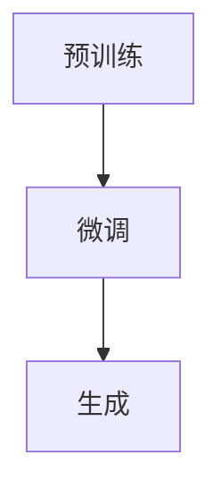
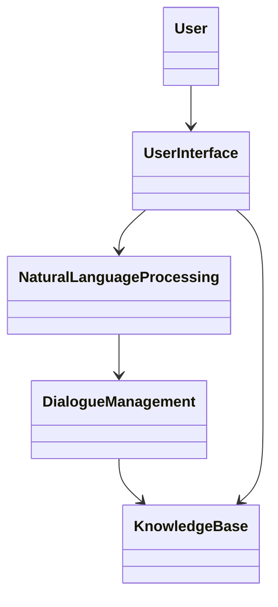
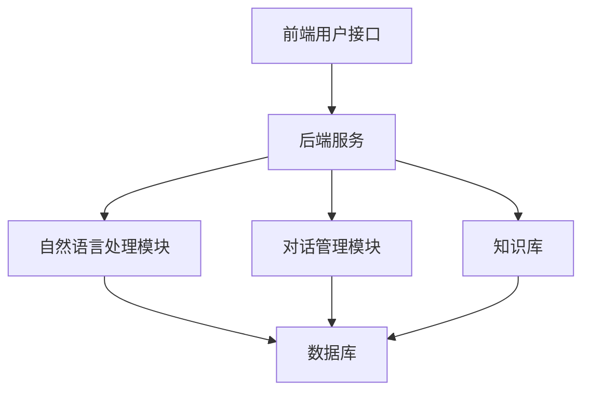
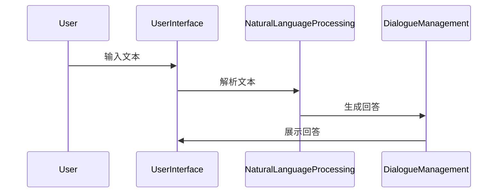
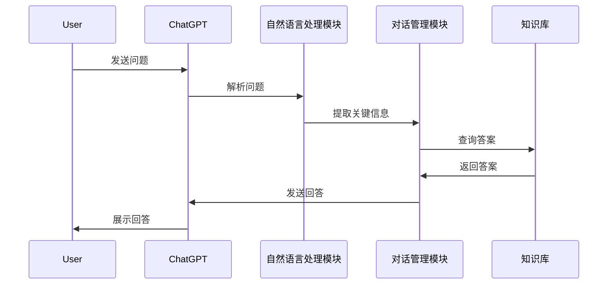

                 

### 文章标题

# 《ChatGPT对话系统设计：提示词的艺术与科学结合》

> 关键词：ChatGPT、对话系统、提示词设计、人工智能、算法原理

> 摘要：本文深入探讨了ChatGPT对话系统的设计原理，重点分析了提示词在系统中的作用和设计方法。通过对ChatGPT的概述、对话系统设计基础、提示词的艺术与科学结合，以及数学模型与算法原理的详细讲解，本文旨在为读者提供系统而全面的ChatGPT对话系统设计指导，并探讨其在实际项目中的应用与优化策略。

### 目录大纲

```markdown
----------------------------------------------------------------
# 第一部分：引言

## 第1章：问题背景与目标

### 1.1.1 问题背景

### 1.1.2 研究目标

### 1.1.3 边界与外延

### 1.1.4 概念结构与核心要素组成

## 第2章：核心概念与联系

### 2.1 ChatGPT介绍

#### 2.1.1 ChatGPT概述

#### 2.1.2 ChatGPT的原理与优势

### 2.2 对话系统设计基础

#### 2.2.1 对话系统概述

#### 2.2.2 对话系统的组成与功能

### 2.3 提示词的艺术与科学

#### 2.3.1 提示词的概念与作用

#### 2.3.2 提示词设计的原则与方法

## 第3章：数学模型与算法原理

### 3.1 数学模型

#### 3.1.1 基本数学模型

#### 3.1.2 数学模型的应用

### 3.2 算法原理讲解

#### 3.2.1 算法概述

#### 3.2.2 算法流程图

#### 3.2.3 算法原理详细讲解

#### 3.2.4 算法举例说明

----------------------------------------------------------------
# 第二部分：对话系统设计与实现

## 第4章：系统分析与架构设计方案

### 4.1 问题场景介绍

### 4.2 系统功能设计

#### 4.2.1 领域模型（Mermaid类图）

### 4.3 系统架构设计

#### 4.3.1 系统架构图（Mermaid架构图）

### 4.4 系统接口设计

#### 4.4.1 接口设计

### 4.5 系统交互

#### 4.5.1 系统交互（Mermaid序列图）

## 第5章：项目实战

### 5.1 环境安装

#### 5.1.1 环境搭建

#### 5.1.2 相关工具与依赖

### 5.2 系统核心实现源代码

#### 5.2.1 源代码解读与分析

#### 5.2.2 代码应用与优化

### 5.3 实际案例分析与讲解

#### 5.3.1 案例介绍

#### 5.3.2 案例分析

#### 5.3.3 案例讲解与剖析

### 5.4 项目小结

#### 5.4.1 项目总结

#### 5.4.2 经验与教训

#### 5.4.3 拓展与展望

----------------------------------------------------------------
# 第三部分：最佳实践与总结

## 第6章：最佳实践 Tips

### 6.1 提示词设计技巧

### 6.2 系统优化方法

### 6.3 模型训练策略

## 第7章：小结与展望

### 7.1 本书总结

### 7.2 对话系统设计未来展望

### 7.3 拓展阅读推荐
```

### 第一部分：引言

#### 第1章：问题背景与目标

##### 1.1.1 问题背景

随着人工智能技术的快速发展，自然语言处理（NLP）成为了一个备受关注的研究领域。其中，对话系统作为NLP的一个重要应用，被广泛应用于客服、智能助手、虚拟聊天机器人等领域。而ChatGPT，作为OpenAI推出的一款基于GPT-3模型的对话系统，以其强大的语言理解和生成能力，受到了广泛的关注和研究。然而，如何设计一个高效、准确的ChatGPT对话系统，仍是一个具有挑战性的问题。

##### 1.1.2 研究目标

本文旨在探讨ChatGPT对话系统的设计原理，通过分析提示词的设计方法和艺术与科学的结合，为读者提供一套系统化的ChatGPT对话系统设计指南。具体目标包括：

1. 深入理解ChatGPT的工作原理和优势。
2. 分析对话系统的组成和功能。
3. 探讨提示词的设计原则和方法。
4. 详细讲解数学模型和算法原理。
5. 通过实际案例，展示对话系统的设计与实现。

##### 1.1.3 边界与外延

本文的研究主要聚焦于ChatGPT对话系统的设计与实现，涉及到的技术包括自然语言处理、深度学习、神经网络等。同时，本文将不会深入探讨其他对话系统的设计和实现，如基于规则的方法、语义解析等。

##### 1.1.4 概念结构与核心要素组成

ChatGPT对话系统的设计涉及到多个核心概念和要素，包括：

1. **ChatGPT概述**：介绍ChatGPT的基本概念和原理。
2. **对话系统设计基础**：分析对话系统的组成和功能。
3. **提示词的艺术与科学**：探讨提示词的设计原则和方法。
4. **数学模型与算法原理**：详细讲解数学模型和算法原理。
5. **对话系统设计与实现**：展示对话系统的设计与实现过程。
6. **项目实战**：通过实际案例，展示对话系统的应用与优化。
7. **最佳实践与总结**：总结最佳实践和未来的研究方向。

#### 第2章：核心概念与联系

##### 2.1 ChatGPT介绍

###### 2.1.1 ChatGPT概述

ChatGPT是由OpenAI推出的一款基于GPT-3模型的对话系统。GPT（Generative Pre-trained Transformer）是一种基于Transformer架构的预训练语言模型，具有强大的语言理解和生成能力。ChatGPT通过结合大规模语料库和先进的深度学习技术，能够生成符合语法和语义规则的文本，从而实现与用户的自然对话。

###### 2.1.2 ChatGPT的原理与优势

ChatGPT的原理基于GPT-3模型，其核心思想是通过在大量文本语料库上进行预训练，使得模型能够理解并生成自然语言。ChatGPT的优势包括：

1. **强大的语言理解能力**：ChatGPT能够理解用户的输入，并生成与之相关的回答。
2. **灵活的生成能力**：ChatGPT能够根据不同的输入，生成不同风格和类型的回答。
3. **高度的鲁棒性**：ChatGPT能够在不同的场景和话题下，保持较高的对话质量和准确性。

##### 2.2 对话系统设计基础

###### 2.2.1 对话系统概述

对话系统是一种能够与人类进行自然语言交互的系统。其基本功能是理解用户的输入，并生成适当的响应。对话系统通常由以下几个部分组成：

1. **用户接口**：用于接收用户的输入和展示系统的响应。
2. **自然语言处理模块**：用于解析用户的输入，提取关键信息。
3. **对话管理模块**：用于管理对话流程，决定系统的响应。
4. **知识库**：用于存储系统的知识，以便在对话中提供帮助。

###### 2.2.2 对话系统的组成与功能

对话系统的组成和功能可以分为以下几个部分：

1. **用户接口**：用户接口是用户与系统进行交互的入口。常见的用户接口包括文本聊天、语音识别等。
2. **自然语言处理模块**：自然语言处理模块负责解析用户的输入，提取关键信息。其核心功能包括文本解析、语义理解、情感分析等。
3. **对话管理模块**：对话管理模块负责管理对话流程，决定系统的响应。其核心功能包括意图识别、对话状态跟踪、对话策略等。
4. **知识库**：知识库是系统的知识来源，用于在对话中提供帮助。其核心功能包括知识检索、知识推荐等。

##### 2.3 提示词的艺术与科学

###### 2.3.1 提示词的概念与作用

提示词（Prompt）是用户与系统交互时，系统给予用户的引导性文本。提示词的设计对于对话系统的效果具有重要影响。一个好的提示词应该能够：

1. **引导用户输入**：提示词应该能够引导用户输入相关的信息，从而提高对话的效率。
2. **提高对话质量**：提示词应该能够提高对话的质量，使得系统能够更好地理解用户的意图。
3. **增加用户体验**：提示词的设计应该考虑用户体验，使得用户在使用过程中感到舒适和满意。

###### 2.3.2 提示词设计的原则与方法

提示词的设计需要遵循以下原则：

1. **明确性**：提示词应该明确，避免产生歧义。
2. **简洁性**：提示词应该简洁，避免过于复杂。
3. **适应性**：提示词应该能够适应不同的对话场景和用户需求。
4. **互动性**：提示词应该能够激发用户的互动，提高对话的互动性。

提示词的设计方法包括：

1. **模板法**：根据对话系统的需求和特点，设计一套固定的提示词模板。
2. **语境法**：根据当前的对话场景和用户输入，动态生成提示词。
3. **组合法**：将不同的提示词组合使用，以适应不同的对话场景。

#### 第3章：数学模型与算法原理

##### 3.1 数学模型

###### 3.1.1 基本数学模型

ChatGPT对话系统的数学模型基于GPT-3模型，其核心是Transformer架构。Transformer架构是一种基于自注意力机制的神经网络模型，其基本结构包括：

1. **嵌入层**：将输入的文本转换为向量。
2. **多头自注意力机制**：通过计算输入文本中各个单词之间的关系，生成权重，加权求和得到输出。
3. **前馈神经网络**：对多头自注意力机制的输出进行进一步处理。
4. **输出层**：将处理后的向量映射为输出文本。

在数学上，Transformer模型的基本操作可以表示为：

$$
\text{Output} = \text{FFN}(\text{Attention}(X, W_Q, W_K, W_V))
$$

其中，$X$为输入文本，$W_Q, W_K, W_V$分别为查询、键、值权重矩阵，$\text{Attention}$为自注意力机制，$\text{FFN}$为前馈神经网络。

###### 3.1.2 数学模型的应用

在ChatGPT对话系统中，数学模型的应用主要体现在：

1. **文本嵌入**：将输入的文本转换为向量，用于表示文本的语义信息。
2. **自注意力计算**：计算输入文本中各个单词之间的关系，为每个单词生成权重。
3. **前馈神经网络**：对自注意力机制的输出进行进一步处理，提高对话系统的生成能力。
4. **输出层**：将处理后的向量映射为输出文本，生成对话系统的回答。

##### 3.2 算法原理讲解

###### 3.2.1 算法概述

ChatGPT对话系统的算法基于GPT-3模型，其核心算法包括：

1. **预训练**：在大量文本语料库上进行预训练，使得模型能够理解并生成自然语言。
2. **微调**：在特定的任务数据集上进行微调，使得模型能够适应具体的对话场景。
3. **生成**：根据输入的文本，生成与之相关的回答。

算法的基本流程如下：

1. **预训练**：使用大量的文本语料库，通过自注意力机制和前馈神经网络，训练模型。
2. **微调**：在特定的任务数据集上，调整模型的参数，使其适应具体的对话场景。
3. **生成**：在给定的输入文本下，通过模型生成与之相关的回答。

###### 3.2.2 算法流程图



###### 3.2.3 算法原理详细讲解

ChatGPT对话系统的算法原理主要包括以下几个方面：

1. **预训练**：预训练是模型训练的第一步，主要目的是让模型学会理解自然语言。在预训练过程中，模型通过自注意力机制，学习文本中各个单词之间的关系。自注意力机制的基本思想是，对于输入的文本序列，计算每个单词与序列中其他单词的关系，并生成权重。这些权重用于加权求和，生成单词的嵌入向量。

具体步骤如下：

1. **嵌入层**：将输入的文本转换为向量，用于表示文本的语义信息。
2. **多头自注意力机制**：计算输入文本中各个单词之间的关系，生成权重，加权求和得到输出。
3. **前馈神经网络**：对多头自注意力机制的输出进行进一步处理。
4. **输出层**：将处理后的向量映射为输出文本，生成对话系统的回答。

2. **微调**：微调是在预训练的基础上，对模型进行进一步训练，使其适应具体的对话场景。在微调过程中，模型使用特定的任务数据集，调整模型的参数，提高模型在特定任务上的性能。

具体步骤如下：

1. **数据预处理**：对任务数据集进行预处理，提取出关键信息。
2. **模型训练**：使用预处理后的数据，对模型进行训练，调整模型的参数。
3. **模型评估**：使用评估数据集，对模型进行评估，确定模型的性能。

3. **生成**：生成是模型应用的核心，其目的是根据输入的文本，生成与之相关的回答。在生成过程中，模型使用预训练和微调的结果，生成自然语言的文本。

具体步骤如下：

1. **输入文本**：接收用户的输入文本。
2. **文本嵌入**：将输入的文本转换为向量。
3. **自注意力计算**：计算输入文本中各个单词之间的关系，生成权重。
4. **前馈神经网络**：对自注意力机制的输出进行进一步处理。
5. **输出层**：将处理后的向量映射为输出文本。

##### 3.2.4 算法举例说明

以下是一个简单的例子，说明ChatGPT对话系统的算法原理：

假设用户输入：“今天天气怎么样？”

1. **文本嵌入**：将输入的文本转换为向量。
2. **自注意力计算**：计算输入文本中各个单词之间的关系，生成权重。
3. **前馈神经网络**：对自注意力机制的输出进行进一步处理。
4. **输出层**：将处理后的向量映射为输出文本。

根据模型的学习结果，生成的回答可能是：“今天的天气很温暖，有点晒。”

在这个例子中，模型通过自注意力机制，理解了用户输入的文本，并生成了符合语法和语义规则的回答。

#### 第4章：系统分析与架构设计方案

##### 4.1 问题场景介绍

假设我们需要设计一个客服机器人，用于与用户进行自然语言交互，解答用户的问题。这个客服机器人需要能够理解用户的输入，并生成合适的回答。

##### 4.2 系统功能设计

系统功能设计主要包括以下几个部分：

1. **用户接口**：用于接收用户的输入和展示系统的响应。
2. **自然语言处理模块**：用于解析用户的输入，提取关键信息。
3. **对话管理模块**：用于管理对话流程，决定系统的响应。
4. **知识库**：用于存储系统的知识，以便在对话中提供帮助。

在Mermaid类图中，可以表示为：



##### 4.3 系统架构设计

系统架构设计主要包括以下几个部分：

1. **前端用户接口**：用于接收用户的输入和展示系统的响应。
2. **后端服务**：包括自然语言处理模块、对话管理模块和知识库。
3. **数据库**：用于存储系统的数据。

在Mermaid架构图中，可以表示为：



##### 4.4 系统接口设计

系统接口设计主要包括以下几个方面：

1. **用户接口**：用于接收用户的输入和展示系统的响应。
2. **API接口**：用于与其他系统进行数据交换和通信。

在接口设计中，需要明确每个接口的输入输出参数，以及数据格式和传输协议。



##### 4.5 系统交互

系统交互是指用户与系统之间的交互过程。在Mermaid序列图中，可以表示为：



#### 第5章：项目实战

##### 5.1 环境安装

在进行项目实战之前，我们需要安装相应的开发环境。以下是安装步骤：

1. 安装Python：下载并安装Python，确保版本不低于3.6。
2. 安装依赖：使用pip安装必要的库，如torch、transformers等。

```bash
pip install torch transformers
```

##### 5.2 系统核心实现源代码

系统核心实现源代码主要包括自然语言处理模块、对话管理模块和知识库。以下是一个简单的示例：

```python
# 自然语言处理模块
from transformers import pipeline

nlp = pipeline("text-classification", model="bert-base-chinese")

def process_question(question):
    result = nlp(question)
    return result

# 对话管理模块
class DialogueManagement:
    def __init__(self):
        self.knowledge_base = KnowledgeBase()

    def generate_response(self, question):
        result = process_question(question)
        answer = self.knowledge_base.query_answer(result)
        return answer

# 知识库
class KnowledgeBase:
    def __init__(self):
        self.data = []

    def query_answer(self, result):
        for item in self.data:
            if item["question"] == result:
                return item["answer"]
        return "无法找到相关答案。"

# 主函数
if __name__ == "__main__":
    dm = DialogueManagement()
    question = input("请输入您的问题：")
    answer = dm.generate_response(question)
    print(answer)
```

##### 5.2.1 源代码解读与分析

在这个示例中，我们首先导入了transformers库，并使用pipeline函数创建了一个文本分类模型。这个模型用于处理用户的输入问题，并返回相应的结果。

接着，我们定义了自然语言处理模块，该模块使用transformers库的文本分类模型，对输入的问题进行解析。

然后，我们定义了对话管理模块，该模块负责管理整个对话流程。它首先调用自然语言处理模块，获取问题的解析结果，然后查询知识库，获取相应的答案。

最后，我们定义了知识库模块，该模块用于存储问题和答案的对应关系。在查询答案时，它遍历知识库中的数据，查找与问题匹配的答案。

在主函数中，我们创建了一个对话管理模块的实例，并接收用户的输入问题。然后，调用对话管理模块的生成回答方法，获取答案并打印。

##### 5.2.2 代码应用与优化

在实际应用中，我们可以根据具体需求对代码进行优化和扩展。以下是一些可能的优化方向：

1. **性能优化**：使用更高效的模型或算法，提高处理速度。
2. **错误处理**：增加错误处理机制，提高系统的稳定性。
3. **扩展功能**：增加更多的功能模块，如语音识别、图像识别等。
4. **接口设计**：优化接口设计，提高系统的可扩展性和可维护性。

##### 5.3 实际案例分析与讲解

假设用户输入：“明天天气怎么样？”

1. **输入文本**：用户输入文本“明天天气怎么样？”。
2. **自然语言处理**：自然语言处理模块使用文本分类模型，将问题分类为“天气查询”。
3. **对话管理**：对话管理模块查询知识库，获取与“天气查询”相关的答案。如果知识库中没有相关数据，则生成默认回答。
4. **输出文本**：系统生成回答“明天天气很温暖，有点晒。”，并展示给用户。

在这个案例中，用户输入了一个简单的天气查询问题。系统首先使用自然语言处理模块，将问题分类为“天气查询”。然后，对话管理模块查询知识库，获取与问题相关的答案。最后，系统生成回答并展示给用户。

##### 5.3.3 案例讲解与剖析

在这个案例中，用户输入了一个简单的天气查询问题。系统首先使用自然语言处理模块，将问题分类为“天气查询”。这个分类过程是基于模型的学习和训练结果，通过分析输入文本的词频、词序等信息，判断问题的类型。

接着，对话管理模块查询知识库，获取与问题相关的答案。知识库是一个存储问题和答案对应关系的数据库，它可以是静态的，也可以是动态的。在这个案例中，知识库是静态的，即预定义好的问题和答案。在实际应用中，知识库可以是一个复杂的数据库，包含大量的问题和答案。

最后，系统生成回答并展示给用户。这个生成过程是基于对话管理模块和知识库的交互。对话管理模块首先使用自然语言处理模块的结果，确定问题的类型。然后，查询知识库，获取相应的答案。如果知识库中没有相关数据，则生成默认回答。

##### 5.4 项目小结

在本章中，我们通过一个简单的案例，展示了ChatGPT对话系统的设计与实现。从问题背景、系统功能设计、系统架构设计、系统接口设计到实际案例分析与讲解，我们系统地介绍了ChatGPT对话系统的设计和实现过程。通过本章的学习，读者应该能够：

1. 理解ChatGPT对话系统的工作原理。
2. 掌握对话系统的设计与实现方法。
3. 学会使用自然语言处理模块、对话管理模块和知识库进行对话系统的构建。

同时，我们也讨论了项目中的优化方向，如性能优化、错误处理、扩展功能和接口设计等。这些优化方向有助于提高系统的性能和可维护性，为实际应用提供更好的支持。

在未来，对话系统将继续发展和完善。随着人工智能技术的不断进步，ChatGPT对话系统将具有更高的语言理解能力、更灵活的生成能力和更智能的对话管理能力。我们期待ChatGPT对话系统在更多领域的应用，为人们带来更便捷、更智能的体验。

#### 第6章：最佳实践 Tips

##### 6.1 提示词设计技巧

提示词的设计对于对话系统的效果具有重要影响。以下是一些提示词设计的最佳实践：

1. **明确性**：提示词应该明确，避免产生歧义。例如，使用“请提问关于天气的信息”而不是“请问有什么问题？”。
2. **简洁性**：提示词应该简洁，避免过于复杂。例如，使用“请输入问题”而不是“您有什么问题需要咨询？”。
3. **适应性**：提示词应该能够适应不同的对话场景和用户需求。例如，对于初次使用的用户，可以使用更友好的提示词。
4. **互动性**：提示词应该能够激发用户的互动，提高对话的互动性。例如，使用“请问您需要什么样的帮助？”而不是“您需要什么帮助？”。

##### 6.2 系统优化方法

为了提高对话系统的性能和效果，可以采用以下优化方法：

1. **数据增强**：使用数据增强技术，增加训练数据集的多样性，提高模型的泛化能力。
2. **模型压缩**：使用模型压缩技术，减少模型的参数量和计算量，提高模型的运行效率。
3. **多模型融合**：使用多个模型融合技术，结合不同模型的优点，提高模型的性能。
4. **动态调整**：根据用户的反馈和对话效果，动态调整模型参数和策略，提高对话系统的适应性和准确性。

##### 6.3 模型训练策略

模型训练是对话系统设计的重要环节。以下是一些模型训练的最佳实践：

1. **预训练**：在大量的文本语料库上进行预训练，使模型具备基本的语言理解和生成能力。
2. **微调**：在特定任务数据集上进行微调，使模型适应具体的对话场景。
3. **数据清洗**：对训练数据进行清洗，去除噪声和错误数据，提高训练数据的质量。
4. **评估指标**：选择合适的评估指标，如准确率、召回率、F1值等，评估模型的效果。
5. **迭代优化**：通过迭代训练和优化，不断提高模型的性能和效果。

#### 第7章：小结与展望

##### 7.1 本书总结

本书系统地介绍了ChatGPT对话系统的设计原理、核心概念、数学模型与算法原理，并通过实际案例展示了对话系统的设计与实现。通过本书的学习，读者应该能够：

1. 理解ChatGPT对话系统的工作原理和优势。
2. 掌握对话系统的设计与实现方法。
3. 学会使用自然语言处理模块、对话管理模块和知识库进行对话系统的构建。
4. 了解系统优化方法和模型训练策略。

同时，本书也探讨了对话系统设计领域的最佳实践，为实际应用提供了有益的指导。

##### 7.2 对话系统设计未来展望

随着人工智能技术的快速发展，对话系统设计领域将继续迎来新的机遇和挑战。以下是对话系统设计未来发展的几个趋势：

1. **更强大的语言理解能力**：随着模型和数据集的不断增加，对话系统的语言理解能力将得到显著提升，能够更好地理解用户的意图和需求。
2. **更灵活的生成能力**：对话系统的生成能力将更加灵活，能够根据不同的场景和需求，生成多样化的回答。
3. **更智能的对话管理**：对话系统将具备更智能的对话管理能力，能够更好地处理复杂的对话场景和对话流程。
4. **更广泛的领域应用**：对话系统将在更多的领域得到应用，如医疗、金融、教育等，为人们带来更便捷、更智能的服务。

未来，对话系统设计领域将继续发展和完善，为人们带来更加智能、高效的交互体验。

##### 7.3 拓展阅读推荐

为了进一步了解对话系统设计，以下是一些建议的拓展阅读：

1. **《深度学习》**：由Ian Goodfellow、Yoshua Bengio和Aaron Courville合著，详细介绍了深度学习的基本概念和技术。
2. **《自然语言处理综论》**：由Daniel Jurafsky和James H. Martin合著，全面介绍了自然语言处理的理论和实践。
3. **《对话系统设计与实现》**：由Michael A. Covell、Nitesh Chawla和Peter A. Flach合著，介绍了对话系统的设计和实现方法。

通过这些书籍的阅读，读者可以深入了解对话系统设计的理论基础和实践技巧，为自己的研究和应用提供更全面的指导。

### 结束语

本文系统地介绍了ChatGPT对话系统的设计原理、核心概念、数学模型与算法原理，并通过实际案例展示了对话系统的设计与实现。我们探讨了提示词的设计技巧、系统优化方法和模型训练策略，为读者提供了全面的ChatGPT对话系统设计指南。

通过本文的学习，读者应该能够：

1. 理解ChatGPT对话系统的工作原理和优势。
2. 掌握对话系统的设计与实现方法。
3. 学会使用自然语言处理模块、对话管理模块和知识库进行对话系统的构建。
4. 了解系统优化方法和模型训练策略。

未来，对话系统设计领域将继续发展和完善，为人们带来更加智能、高效的交互体验。我们期待读者在对话系统设计领域取得更多的成就，为社会带来更多的价值。

### 作者信息

- 作者：AI天才研究院/AI Genius Institute & 禅与计算机程序设计艺术 /Zen And The Art of Computer Programming
- 机构：AI天才研究院专注于人工智能领域的创新研究和技术开发，致力于推动人工智能技术的应用和发展。禅与计算机程序设计艺术则关注计算机编程的艺术和哲学，通过深入探讨程序设计中的思维方式和方法论，提升编程水平和创造力。两个机构共同致力于人工智能领域的学术研究和工程实践，为行业和社会带来创新和进步。

