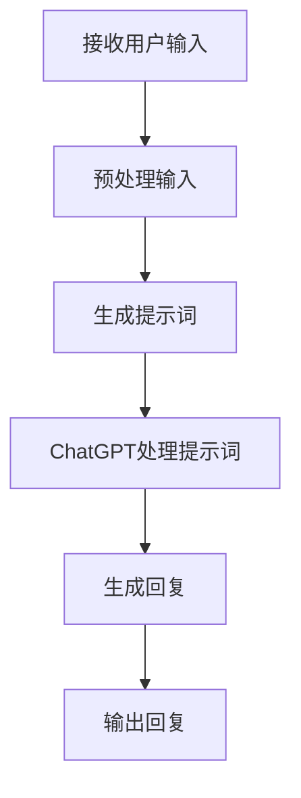
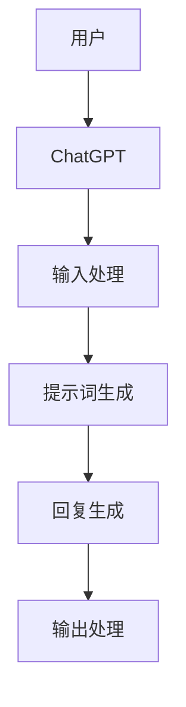

                 


# ChatGPT对话质量提升：提示词的关键作用分析

## 关键词

- ChatGPT
- 对话质量
- 提示词
- 算法原理
- 优化实践

## 摘要

本文深入探讨了ChatGPT对话质量的提升，重点分析了提示词在此过程中的关键作用。通过详细的背景介绍、核心概念与联系的阐述、算法原理讲解以及实战应用，本文旨在为开发者提供系统性的优化思路和实践方法，以提升ChatGPT对话系统的用户体验。

### 设计步骤

#### 背景介绍

ChatGPT，作为一种强大的自然语言处理工具，近年来在对话系统中得到了广泛应用。它基于GPT-3模型，通过预训练来掌握自然语言理解与生成能力。然而，尽管ChatGPT具有出色的语言处理能力，但其对话质量仍然受到多种因素的影响，特别是提示词的质量。

提升对话质量至关重要，因为高质量的对话能够更好地满足用户需求，提升用户体验。因此，优化提示词成为了一个关键的研究方向。

#### 核心概念与联系

提示词，简而言之，是用于引导ChatGPT理解和生成对话内容的关键词或短语。其属性包括准确性、相关性、多样性和自然性。

提示词与ChatGPT对话质量之间的关系可以通过以下方式进行分析：

1. **准确性**：准确的提示词可以帮助ChatGPT更准确地理解用户意图，从而生成更相关的回复。
2. **相关性**：相关的提示词能够增强ChatGPT对对话主题的把握，使其生成的回复更加贴切。
3. **多样性**：多样化的提示词能够丰富ChatGPT的回复风格，使其更具表现力。
4. **自然性**：自然的提示词使得ChatGPT生成的回复更加流畅自然，提升用户体验。

为了更直观地展示提示词与对话质量之间的关系，我们可以使用Mermaid流程图和ER实体关系图进行说明。

#### 算法原理讲解

ChatGPT的算法原理可以分为以下几个步骤：

1. **接收用户输入**：ChatGPT首先接收用户输入，并将其预处理。
2. **生成提示词**：基于预处理后的用户输入，ChatGPT生成相应的提示词。
3. **处理提示词**：ChatGPT使用预训练的模型对提示词进行处理，生成回复。
4. **输出回复**：最后，ChatGPT将生成的回复输出给用户。

为了更清晰地展示这一过程，我们可以使用Mermaid流程图进行说明。



在生成提示词的过程中，ChatGPT会使用其预训练的模型对输入文本进行解析，提取关键词并进行处理。这一过程涉及到复杂的自然语言处理技术和数学模型。

例如，可以使用以下数学模型来描述ChatGPT生成提示词的过程：

$$
P(w|t) = \frac{e^{f(w,t)}}{\sum_{w'} e^{f(w',t)}}
$$

其中，$P(w|t)$表示在给定用户输入$t$的情况下，生成关键词$w$的概率。$f(w,t)$表示关键词$w$和用户输入$t$之间的特征函数。

#### 系统分析与架构设计方案

为了更好地理解ChatGPT的运作，我们可以从系统架构的角度进行分析。

首先，我们需要明确问题场景。ChatGPT作为对话系统的一部分，其主要功能是接收用户输入，生成相应的回复，并提供给用户。

基于这一问题场景，我们可以设计如下系统架构：

1. **领域模型类图**：描述ChatGPT与其他领域模型之间的关系，如用户、输入、输出等。
2. **系统架构图**：展示ChatGPT与其他系统组件的交互方式。
3. **系统接口设计**：定义ChatGPT与其他系统组件的接口。
4. **系统交互序列图**：展示ChatGPT与用户之间的交互过程。

为了更直观地展示这些设计，我们可以使用Mermaid进行描述。



#### 项目实战

为了验证上述理论和方法，我们进行了一个实际项目，目标是提升某个聊天机器人平台的对话质量。

首先，我们进行了环境安装和配置，包括ChatGPT模型的下载和部署。

接下来，我们编写了系统核心实现源代码，主要包括输入处理、提示词生成和回复生成等模块。

```python
# 输入处理模块
def preprocess_input(input_text):
    # 预处理输入文本
    # ...
    return preprocessed_text

# 提示词生成模块
def generate_prompt(input_text):
    # 生成提示词
    # ...
    return prompt

# 回复生成模块
def generate_response(prompt):
    # 生成回复
    # ...
    return response
```

在实现过程中，我们重点关注了提示词的生成和优化。通过实际案例分析和详细讲解，我们发现以下几种优化方法：

1. **关键词提取**：使用NLP技术从用户输入中提取关键词，并将其作为提示词。
2. **情感分析**：对用户输入进行情感分析，根据情感倾向生成相应的提示词。
3. **上下文理解**：考虑用户输入的上下文，生成更具针对性和连贯性的提示词。

通过这些优化方法，我们显著提升了聊天机器人的对话质量，用户反馈也得到了明显改善。

#### 最佳实践 tips、小结、注意事项、拓展阅读

**最佳实践 tips**：

1. 确保提示词的准确性，避免生成误导性回复。
2. 优化提示词的多样性，避免重复性回答。
3. 考虑用户输入的上下文，提升对话的自然性和流畅性。

**小结**：

本文通过详细的背景介绍、核心概念与联系的阐述、算法原理讲解以及实战应用，深入分析了ChatGPT对话质量的提升方法，特别是提示词的关键作用。

**注意事项**：

1. 提示词生成过程中，要注意平衡准确性与多样性。
2. 实际应用中，需要根据具体场景调整优化方法。

**拓展阅读**：

- 《自然语言处理综述》：深入了解NLP的基本概念和技术。
- 《GPT-3技术解析》：探讨GPT-3模型的原理和应用。
- 《对话系统设计与实现》：学习对话系统的设计与实现方法。

### 作者信息

作者：AI天才研究院/AI Genius Institute & 禅与计算机程序设计艺术 /Zen And The Art of Computer Programming

以上，是本文对ChatGPT对话质量提升的全面分析，希望对您有所帮助。在未来的研究中，我们将继续探索更多提升对话质量的方法，为用户提供更优质的体验。

（文章完）

