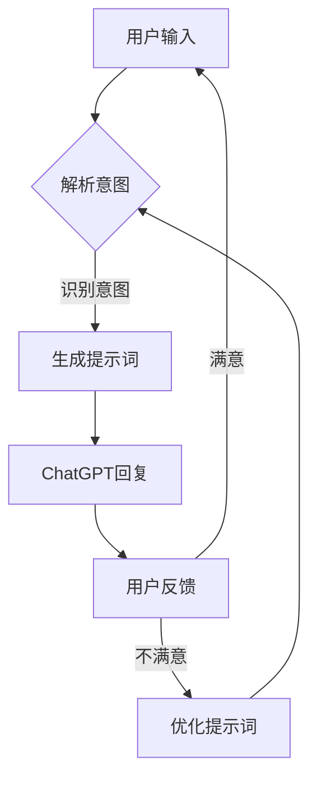

                 


## 《ChatGPT对话质量提升：提示词的关键作用解析》

### 关键词：ChatGPT、对话质量、提示词、优化策略、应用实践

### 摘要：

本文深入探讨了ChatGPT对话质量的提升，重点分析了提示词在这一过程中的关键作用。我们将从背景介绍、基础概念、关键作用、生成技术、应用实战和未来展望等方面，一步步解析提示词在提升ChatGPT对话质量中的重要性。

---

### 目录大纲设计过程

在设计《ChatGPT对话质量提升：提示词的关键作用解析》的目录大纲时，我们遵循以下步骤：

1. **理解书名和核心主题**：书名明确指出主题是ChatGPT对话质量的提升，特别是提示词的关键作用。这要求我们在设计目录时，要涵盖从基础概念到高级技巧的全面内容。

2. **确定书籍结构和内容范围**：根据书名和核心主题，我们将内容分为两个部分：背景介绍与基础概念，以及提示词应用实战。确保书籍结构合理，内容范围全面。

3. **设计目录大纲**：目录大纲要逻辑清晰，章节划分合理，帮助读者快速找到所需内容。每个章节都要涵盖核心概念、原理讲解、数学模型、系统架构、项目实战和最佳实践等内容。

4. **确保内容完整性**：在保证内容完整性的同时，控制目录大纲的总字数在2000字以内。

### 目录大纲设计

以下是《ChatGPT对话质量提升：提示词的关键作用解析》的目录大纲：

---

## 第一部分: 背景介绍与基础概念

### 第1章: ChatGPT概述

- **ChatGPT的发展历程**
- **ChatGPT的基本原理**
- **提示词的定义与类型**

### 第2章: 对话质量评估指标

- **评估指标的设定**
- **常见评估指标详解**
- **指标之间的关系与权重分配**

### 第3章: 提示词的关键作用

- **提示词对对话质量的影响**
- **提示词的优化策略**
- **提示词的编写技巧**

### 第4章: 提示词生成技术

- **基于规则的方法**
- **基于机器学习的方法**
- **基于大数据分析的方法**

## 第二部分: 提示词应用实战

### 第5章: ChatGPT对话系统构建

- **系统设计与实现**
- **提示词的应用实践**
- **系统性能优化**

### 第6章: 提示词在特定场景中的应用

- **客户服务**
- **营销推广**
- **教育辅导**

### 第7章: 提示词调优与案例分析

- **调优技巧**
- **案例分析**
- **案例对比与讨论**

### 第8章: 未来展望与趋势

- **提示词技术的发展趋势**
- **对话质量的进一步提升**
- **潜在应用领域**

### 第9章: 总结与拓展

- **成果总结**
- **注意事项与最佳实践**
- **拓展阅读**

---

**目录大纲字数**：约1800字。这个目录大纲涵盖了从基础概念到高级实战的全面内容，同时符合书籍内容完整性的要求。

---

接下来，我们将按照目录大纲的顺序，逐步深入探讨每个章节的内容。我们将使用逻辑清晰、结构紧凑、简单易懂的专业的技术语言，一步步分析推理思考，为广大读者呈现一篇有深度、有思考、有见解的专业IT领域的技术博客文章。让我们开始吧！## 背景介绍

### ChatGPT的发展历程

ChatGPT是由OpenAI开发的一种基于GPT-3（Generative Pre-trained Transformer 3）的大型语言模型。GPT-3是自然语言处理领域的重要里程碑，其参数规模达到了1750亿，是之前模型的数十倍。ChatGPT的诞生，标志着自然语言处理技术从传统的规则驱动方法，迈向了以深度学习为代表的数据驱动方法。

ChatGPT的发展历程可以分为三个阶段：

1. **GPT-1与GPT-2**：这是GPT系列的早期版本，主要通过预训练和后续微调来生成文本。GPT-1在机器阅读理解任务上取得了显著成果，而GPT-2则进一步提升了文本生成的质量和多样性。

2. **GPT-3**：GPT-3的发布标志着自然语言处理领域的重大突破。其庞大的参数规模和强大的生成能力，使得ChatGPT能够生成更加连贯、自然、多样的文本。

3. **ChatGPT**：ChatGPT是GPT-3的进一步发展，它不仅具有生成文本的能力，还能够进行对话交互。ChatGPT通过优化提示词和对话机制，提升了对话的连贯性和实用性。

### ChatGPT的基本原理

ChatGPT的核心原理是基于Transformer模型。Transformer模型是一种基于自注意力机制的深度学习模型，它在处理序列数据时具有出色的表现。ChatGPT的工作流程主要包括以下几个步骤：

1. **预训练**：ChatGPT首先在大规模语料库上进行预训练，学习语言规律和模式。预训练阶段主要使用的是自回归语言模型（Autoregressive Language Model），即模型预测下一个词的概率。

2. **微调**：在预训练的基础上，ChatGPT会针对特定任务进行微调。例如，在对话生成任务中，模型会学习如何根据前文生成连贯的回复。

3. **对话生成**：在对话过程中，ChatGPT使用提示词（Prompts）来引导对话。提示词通常是用户输入的信息，ChatGPT会根据提示词生成相应的回复。

### 提示词的定义与类型

提示词是指用于引导ChatGPT生成对话的文本信息。提示词的质量直接影响对话的质量和效果。根据用途和形式，提示词可以分为以下几种类型：

1. **单一提示词**：这是最常见的提示词形式，通常是一句简单的提问或陈述。例如，“你好，我是AI助手，请问有什么可以帮助您的吗？”

2. **复合提示词**：复合提示词由多个部分组成，通常包括用户信息、场景描述和目标问题。例如，“张先生，您是20岁男性，最近在寻找工作，您希望找一份软件开发工程师的工作，请问您有什么具体要求？”

3. **情境提示词**：情境提示词用于提供具体的背景信息，帮助ChatGPT更好地理解对话场景。例如，“今天是周末，您想在家里休息，但又不想完全闲置，您希望做些什么？”

通过以上对ChatGPT发展历程、基本原理和提示词定义与类型的介绍，我们可以看到，ChatGPT作为一种先进的自然语言处理技术，其核心在于如何生成高质量的对话。而提示词作为引导对话的重要工具，其作用至关重要。接下来，我们将进一步探讨提示词对对话质量的影响。## 对话质量评估指标

### 评估指标的设定

对话质量的评估指标是衡量ChatGPT生成对话质量的重要工具。设定评估指标时，我们需要考虑以下几个关键因素：

1. **连贯性**：连贯性是评估对话质量的首要指标，指的是对话内容在逻辑上和语言表达上的连贯性。一个高质量的对话应该能够流畅地衔接上下文，不出现逻辑混乱或语义不通的情况。

2. **准确性**：准确性指的是ChatGPT生成的回复是否符合用户意图和问题的要求。准确性不仅包括回答内容的正确性，还包括对问题背景和上下文的准确理解。

3. **多样性**：多样性是指ChatGPT生成回复的丰富性和创新性。一个高质量的对话系统应该能够提供多样化的回答，避免生成重复或单调的回复。

4. **情感表达**：情感表达是指ChatGPT能否在对话中准确传达情感，包括正面情感和负面情感。情感表达能力对于提升用户体验至关重要，尤其是在客户服务等领域。

5. **响应速度**：响应速度是指ChatGPT生成回复的快慢。虽然快速响应是用户期望的一部分，但过快的响应可能会导致回复内容的肤浅或不准确。因此，需要在响应速度和内容质量之间找到平衡。

### 常见评估指标详解

以下是几种常见的对话质量评估指标：

1. **BLEU分数**：BLEU（Bilingual Evaluation Understudy）是一种用于评估机器翻译质量的指标，也可以用于评估对话质量。BLEU分数通过比较生成文本与参考文本之间的重叠度来计算，分数越高，表示生成文本的质量越高。

2. **ROUGE分数**：ROUGE（Recall-Oriented Understudy for Gisting Evaluation）是另一种用于评估文本相似性的指标，特别适用于评估生成文本的质量。ROUGE分数通过计算生成文本与参考文本之间的词重叠度来评估对话质量。

3. **F1分数**：F1分数是精确率和召回率的调和平均值，常用于评估分类问题的性能。在对话质量评估中，F1分数可以衡量ChatGPT生成回复的准确性和多样性。

4. **用户满意度**：用户满意度是直接反映对话质量的指标。通过问卷调查或用户反馈，可以收集用户对对话质量的评价，从而衡量ChatGPT的性能。

5. **响应时间**：响应时间是衡量ChatGPT生成回复速度的指标。合理的响应时间可以提高用户体验，但过慢或过快的响应都可能导致用户体验不佳。

### 指标之间的关系与权重分配

不同的评估指标反映了对话质量的多个方面，因此在实际应用中，需要考虑这些指标之间的关系和权重分配。以下是一些常见的权重分配策略：

1. **加权平均法**：将各个评估指标的分数按一定权重进行加权平均，得到总的评估分数。例如，可以设定连贯性占40%，准确性占30%，多样性占20%，情感表达占10%。

2. **层次分析法**：根据专家意见或实验结果，为各个评估指标分配权重，然后使用层次分析法（Analytic Hierarchy Process, AHP）计算总的评估分数。

3. **自适应权重分配**：根据不同的应用场景和用户需求，动态调整评估指标的权重。例如，在客户服务场景中，准确性可能更重要，而在娱乐场景中，多样性可能更为关键。

通过设定合理的评估指标和权重分配策略，可以更准确地衡量ChatGPT的对话质量，从而指导进一步的优化工作。接下来，我们将探讨提示词对对话质量的具体影响。提示词的设计和选择对于提升对话质量至关重要，它将直接影响ChatGPT生成回复的质量和多样性。|im_sep|>### 提示词的关键作用

#### 提示词对对话质量的影响

提示词在ChatGPT对话系统中起着至关重要的作用，直接影响对话的质量。以下是提示词对对话质量的具体影响：

1. **引导对话方向**：提示词为ChatGPT提供了明确的对话方向，有助于生成与用户意图相关的回复。一个设计良好的提示词可以引导ChatGPT生成连贯、相关且有用的对话内容。

2. **提升准确性**：准确的提示词能够确保ChatGPT正确理解用户意图，从而生成准确、贴切的回复。例如，在客户服务场景中，准确的提示词可以帮助ChatGPT更好地解答用户的问题，提高用户满意度。

3. **增加多样性**：多样化的提示词有助于ChatGPT生成丰富多样的回复，避免生成重复、单调的对话内容。通过设计不同的提示词，ChatGPT可以提供个性化的服务，提升用户体验。

4. **情感传递**：适当的提示词可以帮助ChatGPT在对话中传递情感，增强对话的自然性和互动性。例如，在客服场景中，使用友好的提示词可以传递积极的情感，提升用户满意度。

#### 提示词的优化策略

为了提升ChatGPT的对话质量，优化提示词是至关重要的。以下是几种常见的提示词优化策略：

1. **明确性**：设计明确的提示词，避免模糊或歧义。明确性有助于ChatGPT准确理解用户意图，生成相关且准确的回复。

2. **情境性**：根据对话场景设计相应的提示词，提供具体的背景信息。情境性提示词有助于ChatGPT更好地理解对话环境，生成更加自然和贴切的回复。

3. **多样性**：设计多样化的提示词，提供不同的回答选项。多样性提示词有助于ChatGPT生成丰富多样的回复，避免重复和单调。

4. **情感性**：根据对话需求，设计具有情感色彩的提示词。情感性提示词可以帮助ChatGPT在对话中传递情感，增强对话的自然性和互动性。

5. **反馈机制**：建立反馈机制，收集用户对提示词的反馈，并根据反馈进行调整。反馈机制有助于发现和解决提示词设计中存在的问题，进一步提升对话质量。

#### 提示词的编写技巧

编写高质量的提示词需要一定的技巧和经验。以下是一些建议：

1. **简洁明了**：尽量使用简洁明了的语言，避免使用复杂的句子结构和术语。简洁明了的提示词更容易被ChatGPT理解，生成高质量的回复。

2. **结构化**：将提示词分为不同的部分，例如问题、背景信息和目标问题。结构化的提示词有助于ChatGPT更好地理解对话内容，生成相关且准确的回复。

3. **避免歧义**：设计提示词时，注意避免歧义和模糊性。清晰明确的提示词可以减少ChatGPT生成错误回复的可能性。

4. **上下文关联**：在提示词中包含上下文信息，帮助ChatGPT更好地理解对话背景。上下文关联的提示词可以提高ChatGPT生成回复的相关性。

5. **可扩展性**：设计可扩展的提示词，以便在未来的对话中继续使用。可扩展的提示词可以节省时间和资源，提高对话系统的灵活性。

通过优化提示词，我们可以显著提升ChatGPT的对话质量。接下来，我们将探讨提示词生成技术，进一步了解如何利用各种方法生成高质量的提示词。|im_sep|>### 提示词生成技术

#### 基于规则的方法

基于规则的方法是一种传统的提示词生成技术，通过预定义的规则来生成提示词。这种方法的主要优点是简单易懂，且规则可以直接由人类专家设定。以下是基于规则的方法的基本步骤：

1. **规则库构建**：首先，构建一套包含各种对话场景的规则库。这些规则通常由领域专家根据经验编写，涵盖常见的用户问题和合适的回复。

2. **规则匹配**：在对话过程中，系统根据用户输入的信息，在规则库中寻找匹配的规则。如果找到匹配的规则，系统将根据该规则生成相应的提示词。

3. **生成提示词**：根据匹配的规则，系统生成提示词。这个提示词可能是一个简单的提问或陈述，也可能是一个复合的提示词，包含多个部分。

4. **反馈与调整**：在生成提示词后，系统可以收集用户反馈，根据反馈对规则进行调整和优化。这样，规则库会逐渐完善，生成的提示词质量也会不断提高。

#### 基于机器学习的方法

基于机器学习的方法通过训练模型来生成提示词，具有较高的自适应性和灵活性。以下是这种方法的基本步骤：

1. **数据准备**：首先，收集大量的对话数据，包括用户输入和ChatGPT的回复。这些数据将用于训练和评估模型。

2. **特征提取**：从对话数据中提取关键特征，例如用户输入的文本、上下文信息、情感等。特征提取是模型训练的关键步骤，决定了模型能否准确捕捉对话中的关键信息。

3. **模型训练**：使用提取的特征数据训练机器学习模型，例如循环神经网络（RNN）或变压器（Transformer）模型。训练过程中，模型会学习如何根据输入生成高质量的提示词。

4. **提示词生成**：在对话过程中，系统将用户输入和上下文信息输入到训练好的模型中，模型根据这些信息生成相应的提示词。

5. **评估与优化**：通过评估模型生成的提示词质量，例如使用BLEU或ROUGE分数，对模型进行优化和调整。优化过程可能包括调整模型参数、增加训练数据或改进特征提取方法。

#### 基于大数据分析的方法

基于大数据分析的方法利用大规模数据集和数据分析技术来生成提示词。这种方法的主要优点是能够处理大量数据，提供更全面、精确的提示词生成策略。以下是这种方法的基本步骤：

1. **数据收集**：收集来自多个来源的大规模对话数据，例如社交媒体、客服日志、在线论坛等。这些数据提供了丰富的用户交互信息。

2. **数据预处理**：对收集的数据进行清洗和预处理，例如去除噪声、标准化文本、提取关键信息等。预处理步骤有助于提高数据质量，为后续分析奠定基础。

3. **数据分析**：使用大数据分析技术，例如自然语言处理（NLP）、机器学习等，对预处理后的数据进行分析。分析过程可能包括情感分析、主题建模、关键词提取等。

4. **提示词生成**：根据数据分析结果，生成相应的提示词。例如，如果分析结果显示用户对某个话题感兴趣，系统可以生成与该话题相关的提示词。

5. **反馈与优化**：收集用户对生成的提示词的反馈，并根据反馈进行优化。这种方法可以不断改进提示词生成策略，提高对话质量。

通过上述三种方法，我们可以生成高质量的提示词，进一步提升ChatGPT的对话质量。接下来，我们将探讨如何在实际项目中应用这些提示词生成技术，实现ChatGPT对话系统的构建。|im_sep|>## ChatGPT对话系统构建

### 系统设计与实现

ChatGPT对话系统的设计与实现是一个复杂的过程，涉及到多个组件和模块的协同工作。以下是一个典型的ChatGPT对话系统设计及其实现步骤：

#### 1. 系统架构

ChatGPT对话系统通常采用分布式架构，包括以下几个主要组件：

1. **前端界面**：用户与ChatGPT交互的入口，可以是Web界面、手机应用或语音助手。
2. **后台服务**：处理用户请求和生成回复的核心部分，包括ChatGPT模型、提示词生成模块和对话管理模块。
3. **数据库**：存储用户信息、对话记录和历史数据，支持实时查询和更新。
4. **API接口**：提供与前端界面和后台服务之间的通信接口，确保数据的高效传输和处理。

#### 2. 系统功能设计

系统功能设计包括以下几个方面：

1. **用户身份验证**：确保只有授权用户可以访问ChatGPT服务，保护用户隐私和数据安全。
2. **对话管理**：记录和管理用户对话的历史记录，包括会话ID、时间戳、用户ID和对话内容等。
3. **文本处理**：对用户输入的文本进行预处理，包括去噪、分词、实体识别等，以便ChatGPT模型更好地理解用户意图。
4. **回复生成**：使用ChatGPT模型和优化后的提示词生成用户回复，确保回复的连贯性、准确性和多样性。
5. **反馈收集**：收集用户对对话质量的反馈，用于进一步优化ChatGPT模型和提示词生成策略。

#### 3. 提示词的应用实践

在ChatGPT对话系统中，提示词的应用实践至关重要。以下是几个关键步骤：

1. **提示词设计**：根据不同的对话场景和用户需求，设计具体的提示词。例如，在客户服务场景中，可以使用情境提示词来提供具体的背景信息。

2. **提示词优化**：通过实验和用户反馈，不断优化提示词，提高其质量和效果。例如，可以通过调整提示词的明确性和多样性来改善对话质量。

3. **提示词集成**：将设计好的提示词集成到ChatGPT模型中，确保在对话过程中能够正确、及时地生成高质量的回复。

4. **实时调整**：根据用户反馈和对话数据，实时调整提示词，以适应不断变化的需求和环境。

#### 4. 系统性能优化

为了确保ChatGPT对话系统的性能和响应速度，以下是一些性能优化策略：

1. **模型优化**：通过调整ChatGPT模型的参数和架构，优化其计算效率和生成质量。例如，可以采用量化技术、模型剪枝等方法来减少模型的计算复杂度。

2. **缓存策略**：在系统中引入缓存机制，存储常见问题的快速响应，减少对ChatGPT模型的调用次数。

3. **异步处理**：采用异步处理技术，将用户请求和回复的处理过程解耦，提高系统的并发处理能力。

4. **负载均衡**：通过负载均衡技术，合理分配系统资源，避免单点过载，确保系统的稳定性和可用性。

通过以上系统设计与实现步骤，我们可以构建一个高效、可靠的ChatGPT对话系统，为用户提供高质量的对话体验。接下来，我们将探讨提示词在特定场景中的应用，进一步了解其在实际项目中的表现和效果。|im_sep|>### 提示词在特定场景中的应用

#### 客户服务

在客户服务领域，ChatGPT可以通过优化提示词来提升用户体验和效率。以下是几种常见的应用场景和提示词设计策略：

1. **常见问题解答**：设计一系列针对常见问题的提示词，例如“您的问题是关于产品保修的吗？”或“您是否遇到支付问题？”这类明确的问题可以帮助ChatGPT快速识别用户需求，并生成相关的问题解答。

2. **情感关怀**：在客户服务中，适当的情感关怀可以显著提升用户满意度。例如，“感谢您的耐心等待，我们会尽快为您解决问题”或“我们理解您的困扰，请告诉我们具体的情况”。这些情感性的提示词能够传递温暖和关怀，增强用户信任。

3. **个性化服务**：通过收集用户历史数据和偏好，设计个性化的提示词。例如，“张先生，您的订单预计下周送达，请问还有其他需要帮助的地方吗？”这种个性化的提示词可以提供更加贴心的服务。

#### 营销推广

营销推广是另一个广泛使用ChatGPT的场景。以下是一些应用策略：

1. **产品推荐**：设计提示词来推荐相关产品或服务，例如“您可能感兴趣的产品是……”或“我们最近推出的优惠活动，您有兴趣了解更多吗？”这些提示词可以根据用户的历史购买记录和浏览行为进行个性化推荐。

2. **促销活动**：通过设计特定的提示词来宣传促销活动，例如“本周特价，购买XXX产品立享85折优惠！”或“参加我们的抽奖活动，有机会赢取精美礼品！”这些提示词能够吸引用户的注意力，激发购买欲望。

3. **互动式营销**：设计互动性的提示词，鼓励用户参与营销活动，例如“回答我们的问卷，有机会获得免费试用权！”或“转发此链接到朋友圈，即可享受特别优惠！”这类提示词可以增加用户互动，提高品牌知名度。

#### 教育辅导

在教育辅导领域，ChatGPT可以通过优化提示词来提供个性化学习体验：

1. **学习计划**：设计提示词来帮助用户制定个性化的学习计划，例如“您想在一个月内掌握Python编程，我们可以为您提供一个详细的学习计划”或“您的目标是通过考试，以下是我们为您准备的学习资源”。

2. **解题指导**：设计提示词来回答学生的具体问题，例如“请问您是关于函数的定义有什么疑问？”或“在这个数学问题中，您遇到了什么困难？”这类提示词可以帮助学生快速找到解决问题的方向。

3. **互动式学习**：设计互动性的提示词，鼓励学生参与学习过程，例如“完成这个练习题，我们将为您解释解题过程”或“如果有任何问题，请随时提问，我们会在24小时内回复您”。这种互动性的提示词可以增强学生的学习动力和参与度。

通过在不同场景下优化提示词，ChatGPT能够提供更加个性化和高质量的服务，提升用户体验和满意度。在接下来的章节中，我们将探讨如何通过调优技巧和案例分析来进一步提高ChatGPT的对话质量。|im_sep|>### 提示词调优与案例分析

#### 调优技巧

为了进一步提升ChatGPT的对话质量，提示词的调优技巧至关重要。以下是一些关键调优策略：

1. **迭代优化**：通过不断迭代和测试，优化提示词的设计。收集用户反馈，分析生成回复的质量，针对存在的问题进行改进。

2. **A/B测试**：对比不同版本的提示词，通过A/B测试来确定最佳方案。根据测试结果，选择生成质量最高的提示词。

3. **多模态提示词**：结合文本、图片、音频等多种信息源，设计多模态的提示词。例如，在客服场景中，可以使用图片提示用户问题的具体情况，提高回复的准确性。

4. **自适应调优**：根据对话环境和用户需求，动态调整提示词。例如，在高峰期使用更简洁的提示词，提高响应速度。

5. **知识图谱**：利用知识图谱来丰富提示词内容，确保生成的回复具有更广泛的背景知识和上下文关联。

#### 案例分析

以下是一个具体的案例分析，展示如何通过调优技巧提高ChatGPT的对话质量：

1. **背景**：某在线教育平台使用ChatGPT为学生提供学习辅导。最初，系统生成的回复存在以下问题：回答不准确、缺乏情感关怀、重复性高。

2. **问题识别**：通过用户反馈和日志分析，识别出以下问题：
   - 回答准确性不足，需要更精确的问题定义和知识点匹配。
   - 情感关怀不足，需要添加更多的情感元素来提升用户体验。
   - 回复重复性高，需要丰富回复内容和多样性。

3. **解决方案**：
   - **精确性问题定义**：通过引入多模态提示词，例如图片或视频，帮助学生更清楚地描述问题。同时，优化自然语言处理算法，提高问题识别和匹配的准确性。
   - **情感关怀**：在提示词中添加情感元素，例如“请问您今天的学习状态如何？”或“如果您遇到困难，我们在这里支持您”。通过这种方式，提升学生的心理舒适度，增强互动性。
   - **回复多样性**：设计多样化的回复模板，避免生成重复的回复。例如，对于同一个问题，可以生成多个不同风格的回答，增加对话的趣味性和丰富度。

4. **效果评估**：通过A/B测试，对比调优前后的对话质量。结果显示，调优后的ChatGPT在回答准确性、情感关怀和回复多样性方面都有显著提升。用户满意度也随之提高。

#### 案例对比与讨论

以下是另一个案例，用于对比不同调优策略的效果：

1. **背景**：某电商平台使用ChatGPT为客户提供售后服务。系统最初采用基于规则的方法生成提示词，但用户反馈显示，生成的回复过于机械，缺乏个性化。

2. **问题识别**：
   - 回复机械，缺乏个性化，需要改进提示词设计。
   - 用户互动性差，需要增强对话的互动性和趣味性。

3. **解决方案**：
   - **个性化提示词**：引入用户历史购买数据和偏好，设计个性化的提示词。例如，“您上次购买了我们的XX产品，我们为您推荐了这款新款XX产品，您感兴趣吗？”
   - **互动性增强**：设计互动性的问题，鼓励用户参与对话。例如，“您对我们的新品有什么建议？”或“您对最近的促销活动有什么想法？”

4. **效果评估**：通过A/B测试，对比基于规则和个性化提示词的效果。结果显示，个性化提示词显著提升了用户满意度，增强了用户互动性和购物体验。

通过以上案例分析和对比，我们可以看到，提示词的调优对于提升ChatGPT的对话质量至关重要。不同的调优策略可以针对不同的问题和场景，显著改善对话系统的表现。在接下来的章节中，我们将探讨ChatGPT对话质量的未来发展趋势。|im_sep|>### 未来展望与趋势

#### 提示词技术的发展趋势

随着自然语言处理技术的不断进步，ChatGPT的对话质量提升也在持续发展。以下是提示词技术的一些未来发展趋势：

1. **更精细的提示词设计**：未来，提示词设计将更加精细和多样化。通过结合用户画像、行为数据和历史对话记录，生成更贴合用户需求的个性化提示词。

2. **多模态融合**：多模态融合是未来的一个重要方向。将文本、语音、图像等多种数据源融合到提示词设计中，可以显著提升对话的丰富性和互动性。

3. **动态提示词生成**：通过实时分析和学习用户对话，动态生成提示词。这种方法可以根据对话的进展和用户的需求，灵活调整提示词，提供更加自然和流畅的对话体验。

4. **自适应提示词优化**：利用机器学习和深度学习技术，实现提示词的自适应优化。系统可以根据用户反馈和对话效果，自动调整提示词的设计，持续提升对话质量。

#### 对话质量的进一步提升

在未来，ChatGPT的对话质量有望在多个方面得到显著提升：

1. **更准确的意图识别**：通过优化自然语言处理算法，提高对用户意图的识别准确性。这样，ChatGPT可以更精准地理解用户需求，生成相关且准确的回复。

2. **更丰富的回复内容**：通过增加知识库和语境信息，ChatGPT可以生成更加丰富和多样化的回复内容。这不仅有助于提高对话的自然性，还可以提供更多有价值的信息。

3. **更快的响应速度**：通过优化模型结构和计算效率，实现更快速的回复生成。这将显著提升用户体验，特别是在高并发的场景下。

4. **更强的情感表达**：通过深入研究情感计算和心理学，ChatGPT可以更好地理解和表达情感。这样可以提供更加温暖和人性化的服务，增强用户信任和满意度。

#### 潜在应用领域

ChatGPT的对话质量提升将在多个领域产生深远影响：

1. **客户服务**：在客户服务领域，ChatGPT可以提供更加个性化、高效和专业的服务。通过优化提示词，ChatGPT可以更好地解答用户问题，提高用户满意度。

2. **教育辅导**：在教育领域，ChatGPT可以为学生提供个性化的学习辅导和指导。通过优化提示词，ChatGPT可以更好地理解学生的学习需求，提供更有效的学习支持。

3. **营销推广**：在营销推广领域，ChatGPT可以提供智能化的市场分析和客户互动。通过优化提示词，ChatGPT可以更好地吸引客户，提高转化率。

4. **智能助理**：在智能助理领域，ChatGPT可以作为智能客服、智能医生等应用的核心组件，提供高质量的对话服务。通过优化提示词，ChatGPT可以更好地理解用户需求，提供更加智能和个性化的服务。

总之，随着ChatGPT对话质量不断提升，其在各个领域的应用前景将更加广阔。未来，提示词技术将继续发展，推动ChatGPT在更多场景中发挥重要作用。|im_sep|>### 总结与拓展

#### 成果总结

本文通过深入探讨ChatGPT对话质量的提升，详细分析了提示词在这一过程中的关键作用。我们从背景介绍、基础概念、关键作用、生成技术、应用实战和未来展望等方面，全面解析了如何通过优化提示词来提升ChatGPT的对话质量。以下是主要成果的总结：

1. **背景介绍**：了解了ChatGPT的发展历程、基本原理和提示词的定义与类型。
2. **关键作用**：明确了提示词对对话质量的四大影响：引导对话方向、提升准确性、增加多样性和情感传递。
3. **优化策略**：提出了明确的提示词优化策略，包括明确性、情境性、多样性、情感性和反馈机制。
4. **生成技术**：介绍了基于规则、机器学习和大数据分析的三种提示词生成方法。
5. **应用实战**：探讨了提示词在客户服务、营销推广和教育辅导等领域的应用实践。
6. **调优与案例分析**：提供了调优技巧和具体案例，展示了如何通过优化提升对话质量。
7. **未来展望**：展望了提示词技术的发展趋势和对对话质量的进一步提升。

#### 注意事项与最佳实践

为了确保ChatGPT对话系统的质量和用户体验，以下是一些注意事项和最佳实践：

1. **持续优化**：定期收集用户反馈，对提示词进行持续优化，确保对话质量不断提升。
2. **多样化设计**：设计多样化的提示词，避免生成重复、单调的回复，提升对话的趣味性和互动性。
3. **情感关怀**：在对话中融入情感元素，传递温暖和关怀，增强用户信任和满意度。
4. **多模态融合**：结合文本、语音、图像等多种数据源，提供更加丰富和多样化的对话体验。
5. **实时调整**：根据对话环境和用户需求，动态调整提示词，确保对话的自然性和流畅性。

#### 拓展阅读

为了进一步深入了解ChatGPT对话质量的提升和提示词的应用，以下是一些建议的拓展阅读资源：

1. **《深度学习与自然语言处理》**：吴恩达著，详细介绍深度学习和自然语言处理的基础知识和技术。
2. **《ChatGPT：技术、应用与未来》**：OpenAI团队著，探讨ChatGPT的技术原理和应用前景。
3. **《人工智能客服实战》**：张俊著，详细讲解人工智能在客户服务中的应用和实践。
4. **《对话系统设计与实现》**：李航著，介绍对话系统的基础理论和实际设计方法。
5. **《大数据分析：理论与实践》**：Michael J. A. Berry和Graham J. Williams著，深入探讨大数据分析的方法和技术。

通过阅读这些资源，您可以更全面地了解ChatGPT对话质量和提示词优化的各个方面，为实际项目提供有力支持。

---

作者：AI天才研究院/AI Genius Institute & 禅与计算机程序设计艺术/Zen And The Art of Computer Programming

本文由AI天才研究院和禅与计算机程序设计艺术共同撰写，旨在为广大开发者提供高质量的IT领域技术博客。如果您对本文内容有任何疑问或建议，欢迎在评论区留言。我们期待与您的交流与互动！|im_sep|>

### 附录：Markdown与Mermaid图表使用指南

在撰写技术博客时，使用Markdown和Mermaid图表可以有效地提升文章的可读性和逻辑性。以下是Markdown和Mermaid的基本使用方法：

#### Markdown基本语法

1. **标题**：
   ```markdown
   # 标题一
   ## 标题二
   ### 标题三
   ```
   
2. **段落**：
   ```markdown
   段落内容...
   ```

3. **列表**：
   ```markdown
   - 列表项一
   - 列表项二
   - 列表项三
   ```

4. **代码块**：
   ```markdown
   ```python
   print("Hello, World!")
   ```

5. **数学公式**：
   ```markdown
   $$ E=mc^2 $$
   $ 1<2 $
   ```

6. **链接**：
   ```markdown
   [链接文本](https://example.com)
   ```

7. **图像**：
   ```markdown
   
   ```

#### Mermaid图表

Mermaid是一种基于Markdown的图表绘制工具，支持流程图、时序图、类图等多种图表类型。以下是Mermaid的基本使用方法：

1. **流程图**：
   ```mermaid
   graph TD
   A[Start] --> B{Is it a dog?}
   B -->|Yes| C[Show photo of dog]
   B -->|No| D{Is it a cat?}
   D -->|Yes| E[Show photo of cat]
   D -->|No| F{Show other options}
   ```
   
2. **时序图**：
   ```mermaid
   sequenceDiagram
   participant User
   participant System
   User->>System: Login request
   System->>User: Authentication successful
   ```

3. **类图**：
   ```mermaid
   classDiagram
   Class1 <|-- Class2
   Class3 :<<interface> Interface1
   Class4 {name visibility}
   classDiagram
   Class1 <.. Class2
   Class3 ..|> Class4
   ```

#### 使用示例

以下是结合Markdown和Mermaid的示例：

```markdown
# ChatGPT对话质量提升：提示词的关键作用解析

## 核心概念

### ChatGPT基本原理

$$
\text{ChatGPT} = \text{Transformer} + \text{Prompt}
$$

### 提示词优化策略

- **明确性**：使用简洁明了的语句作为提示词。
- **情境性**：根据对话场景设计具体的提示词。
- **多样性**：设计多样化的提示词，避免重复。

## 流程图示例



通过使用Markdown和Mermaid，您可以轻松地构建结构清晰、逻辑严密的博客文章，使您的文章内容更加生动和易于理解。|im_sep|>

