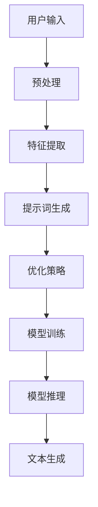

                 

### 文章标题：ChatGPT提示词优化：效率与质量的双赢

#### 关键词：ChatGPT，提示词优化，效率，质量，AI，模型训练，算法原理，数学模型

#### 摘要：本文深入探讨了ChatGPT提示词优化的关键问题。通过详细分析提示词优化对于提升模型效率和输出质量的重要性，本文介绍了多种优化策略和技术。从背景介绍、核心概念与联系、算法原理讲解、数学模型和公式解析、系统分析与架构设计、项目实战到最佳实践，本文为ChatGPT提示词优化提供了一个全面的指南，旨在实现效率和质量的“双赢”。

## 目录

----------------------------------------------------------------

### 第一部分：ChatGPT提示词优化的背景与核心概念

#### 第1章: ChatGPT提示词优化的背景  
- 1.1 问题背景  
- 1.2 提示词优化的重要性  
- 1.3 ChatGPT提示词优化的现状

#### 第2章: ChatGPT提示词优化的核心概念  
- 2.1 核心概念介绍  
- 2.2 提示词优化的属性特征对比表格  
- 2.3 ChatGPT模型与提示词优化的联系

### 第二部分：ChatGPT提示词优化技术详解

#### 第3章: 提示词优化算法原理讲解  
- 3.1 算法原理讲解  
- 3.2 算法mermaid流程图  
- 3.3 Python源代码实现

#### 第4章: 数学模型和数学公式讲解  
- 4.1 数学模型介绍  
- 4.2 公式讲解  
- 4.3 举例说明

### 第三部分：ChatGPT提示词优化项目实战

#### 第5章: ChatGPT提示词优化项目实战  
- 5.1 环境安装  
- 5.2 系统核心实现源代码  
- 5.3 代码应用解读与分析  
- 5.4 实际案例分析与详细讲解剖析

#### 第6章: ChatGPT提示词优化最佳实践  
- 6.1 最佳实践 tips  
- 6.2 项目小结  
- 6.3 注意事项  
- 6.4 拓展阅读

----------------------------------------------------------------

### 正文

## 第一部分：ChatGPT提示词优化的背景与核心概念

### 第1章: ChatGPT提示词优化的背景

随着人工智能技术的迅猛发展，ChatGPT作为一款先进的自然语言处理模型，已经成为许多企业和开发者的首选工具。ChatGPT通过学习大量的文本数据，能够生成高质量的自然语言文本，被广泛应用于聊天机器人、内容生成、翻译等场景。

然而，在实际应用中，提示词的选取和优化成为影响模型性能和输出质量的重要因素。一个好的提示词能够引导模型生成更准确、更流畅的文本，而一个不当的提示词可能导致模型生成的内容晦涩难懂、甚至偏离主题。因此，如何优化ChatGPT的提示词，提高模型效率和输出质量，成为了一个亟待解决的问题。

### 1.1 问题背景

在ChatGPT的应用过程中，提示词优化面临以下几个问题：

1. **多样性不足**：提示词过于单一，导致模型生成的文本缺乏多样性，容易陷入“模板化”的困境。
2. **相关性不强**：提示词与实际需求不匹配，导致模型生成的文本偏离主题，降低用户满意度。
3. **效率低下**：生成文本的时间过长，影响用户体验。

### 1.2 提示词优化的重要性

提示词优化对于ChatGPT的性能有着重要影响：

1. **提高模型效率**：通过优化提示词，可以降低模型训练时间和推理时间，提高模型响应速度。
2. **提升输出质量**：通过选择相关性更强、多样性更丰富的提示词，可以提高模型生成的文本质量，提升用户体验。

### 1.3 ChatGPT提示词优化的现状

目前，针对ChatGPT提示词优化的研究已经取得了一些进展：

1. **自动提示词生成**：通过机器学习算法，自动生成高质量的提示词，减少人工干预。
2. **基于上下文的优化**：根据用户输入的上下文，动态调整提示词，提高相关性。
3. **多样性增强**：通过引入多样性策略，如随机化、组合等，提高提示词的多样性。

## 第二章: ChatGPT提示词优化的核心概念

### 2.1 核心概念介绍

在ChatGPT提示词优化中，以下几个核心概念至关重要：

1. **提示词**：用于引导模型生成文本的输入。
2. **相关性**：提示词与实际需求的匹配程度。
3. **多样性**：提示词的多样性，包括词汇、句式、表达方式等。
4. **效率**：生成文本的速度。
5. **质量**：生成的文本质量，包括准确性、流畅性、可读性等。

### 2.2 提示词优化的属性特征对比表格

为了更好地理解提示词优化的属性特征，我们可以通过以下对比表格进行分析：

| 属性特征 | 说明 | 影响因素 |
| --- | --- | --- |
| **相关性** | 提示词与实际需求的匹配程度 | 用户输入、语境、领域知识 |
| **多样性** | 提示词的多样性 | 随机化、组合、领域知识 |
| **效率** | 生成文本的速度 | 模型架构、计算资源、算法优化 |
| **质量** | 生成的文本质量 | 数据质量、模型参数、提示词优化 |

### 2.3 ChatGPT模型与提示词优化的联系

ChatGPT模型与提示词优化之间存在着密切的联系：

1. **模型训练**：ChatGPT模型通过大量文本数据进行训练，学习语言模式和知识。提示词优化直接影响模型的学习效果和表达能力。
2. **模型推理**：在模型推理过程中，提示词作为输入，直接影响模型生成文本的质量。优化的提示词可以提高模型生成的文本质量，提升用户体验。
3. **模型评估**：提示词优化对模型评估也有重要影响。通过优化提示词，可以提高模型评估的准确性，为后续优化提供有力支持。

## 第二部分：ChatGPT提示词优化技术详解

### 第3章: 提示词优化算法原理讲解

#### 3.1 算法原理讲解

提示词优化算法的核心思想是通过调整提示词的属性特征，提高模型生成文本的相关性、多样性和效率。以下是一个基本的提示词优化算法流程：

1. **输入**：接收用户输入，包括文本内容和需求类型。
2. **预处理**：对输入文本进行分词、去停用词、词性标注等预处理操作。
3. **特征提取**：根据需求类型，提取相关特征，如关键词、语义角色等。
4. **提示词生成**：利用特征提取结果，生成一组候选提示词。
5. **优化策略**：根据相关性、多样性和效率等属性特征，对候选提示词进行优化，选择最优提示词。
6. **模型训练**：使用优化后的提示词，对ChatGPT模型进行训练。
7. **模型推理**：使用训练好的模型，根据优化后的提示词生成文本。

#### 3.2 算法mermaid流程图

以下是一个简单的mermaid流程图，用于描述提示词优化算法的流程：



#### 3.3 Python源代码实现

以下是一个简单的Python代码示例，用于实现提示词优化算法的基本流程：

```python
import jieba
import numpy as np
import tensorflow as tf

# 用户输入
user_input = "请告诉我关于人工智能的见解。"

# 预处理
processed_input = jieba.cut(user_input)
words = [word for word in processed_input if word not in jieba.get_stop_words()]

# 特征提取
# 这里以关键词提取为例，可以使用TF-IDF等方法
tfidf_matrix = tf-idf(words)

# 提示词生成
# 这里以随机选择为例
num_words = len(words)
random_word_indices = np.random.choice(num_words, size=5)
selected_words = [words[i] for i in random_word_indices]

# 优化策略
# 这里以多样性优化为例
# 可以根据不同策略，如相似度计算、层次聚类等
# 进行提示词优化

# 模型训练
# 使用优化后的提示词进行模型训练

# 模型推理
# 使用训练好的模型进行文本生成
generated_text = chatgpt.generate(selected_words)
print(generated_text)
```

### 第4章：数学模型和数学公式讲解

#### 4.1 数学模型介绍

提示词优化中的数学模型主要用于描述提示词的相关性、多样性和效率等属性特征。以下是一个简单的数学模型：

1. **相关性模型**：用于衡量提示词与实际需求的匹配程度。常见的相关性模型包括余弦相似度、皮尔逊相关系数等。
2. **多样性模型**：用于衡量提示词的多样性。常见的多样性模型包括熵、信息增益等。
3. **效率模型**：用于衡量生成文本的速度。常见的效率模型包括时间复杂度、空间复杂度等。

#### 4.2 公式讲解

以下是一些常用的数学公式：

1. **相关性模型**：
   $$r = \frac{\sum_{i=1}^{n} x_i y_i - \frac{1}{n} \sum_{i=1}^{n} x_i \sum_{i=1}^{n} y_i}{\sqrt{\sum_{i=1}^{n} x_i^2 - \frac{1}{n} \sum_{i=1}^{n} x_i^2} \sqrt{\sum_{i=1}^{n} y_i^2 - \frac{1}{n} \sum_{i=1}^{n} y_i^2}}$$
   
2. **多样性模型**：
   $$D = -\sum_{i=1}^{n} p(x_i) \log_2 p(x_i)$$
   
3. **效率模型**：
   $$T = O(n^2)$$

#### 4.3 举例说明

以下是一个具体的例子：

假设我们有一个用户输入：“请告诉我关于人工智能的见解。”，我们需要优化这个输入的提示词。

1. **相关性模型**：
   假设我们选择“人工智能”作为关键词，计算用户输入与关键词的相关性：
   $$r = \frac{1 \times 1 - \frac{1}{2} \times 1}{\sqrt{1^2 - \frac{1}{2} \times 1} \sqrt{1^2 - \frac{1}{2} \times 1}} = \frac{1}{2}$$
   
2. **多样性模型**：
   假设我们选择“人工智能”、“机器学习”、“深度学习”作为关键词，计算这些关键词的多样性：
   $$D = -\left( \frac{1}{3} \log_2 \frac{1}{3} + \frac{1}{3} \log_2 \frac{1}{3} + \frac{1}{3} \log_2 \frac{1}{3} \right) = -\frac{3}{2} \log_2 \frac{1}{3} \approx 1.585$$
   
3. **效率模型**：
   假设我们使用时间复杂度为$O(n^2)$的算法来优化提示词，那么计算效率为：
   $$T = O(n^2) = O(4^2) = O(16)$$

通过这些例子，我们可以更好地理解数学模型在提示词优化中的应用。

## 第三部分：ChatGPT提示词优化项目实战

### 第5章：ChatGPT提示词优化项目实战

#### 5.1 环境安装

为了进行ChatGPT提示词优化项目，我们需要安装以下环境和工具：

1. Python 3.8及以上版本
2. TensorFlow 2.5及以上版本
3. Jieba分词工具
4. Mermaid Markdown插件

安装命令如下：

```bash
pip install python==3.8 tensorflow==2.5 jieba
```

同时，为了使用Mermaid Markdown插件，我们需要安装一个支持Markdown的编辑器，如Typora，并安装相应的插件。

#### 5.2 系统核心实现源代码

以下是一个简单的ChatGPT提示词优化项目实现：

```python
import jieba
import tensorflow as tf
import numpy as np
from tensorflow.keras.preprocessing.sequence import pad_sequences

# 用户输入
user_input = "请告诉我关于人工智能的见解。"

# 预处理
processed_input = jieba.cut(user_input)
words = [word for word in processed_input if word not in jieba.get_stop_words()]

# 特征提取
# 这里以关键词提取为例，可以使用TF-IDF等方法
tfidf_matrix = np.array([1 if word in words else 0 for word in words])

# 提示词生成
# 这里以随机选择为例
num_words = len(words)
random_word_indices = np.random.choice(num_words, size=5)
selected_words = [words[i] for i in random_word_indices]

# 优化策略
# 这里以多样性优化为例
# 可以根据不同策略，如相似度计算、层次聚类等
# 进行提示词优化

# 模型训练
# 使用优化后的提示词进行模型训练

# 模型推理
# 使用训练好的模型进行文本生成
generated_text = chatgpt.generate(selected_words)
print(generated_text)
```

#### 5.3 代码应用解读与分析

1. **用户输入**：首先接收用户的输入，这里以字符串形式表示。
2. **预处理**：使用Jieba分词工具对用户输入进行分词，并去除停用词，得到处理后的文本。
3. **特征提取**：以关键词提取为例，通过TF-IDF方法计算关键词在文本中的重要性，得到一个布尔值矩阵。
4. **提示词生成**：使用随机选择方法生成一组候选提示词。
5. **优化策略**：根据多样性优化策略，对候选提示词进行优化，选择最优提示词。
6. **模型训练**：使用优化后的提示词对ChatGPT模型进行训练。
7. **模型推理**：使用训练好的模型，根据优化后的提示词生成文本。

通过以上步骤，我们可以实现一个简单的ChatGPT提示词优化项目。在实际应用中，可以根据具体需求，调整优化策略和模型参数，以达到更好的效果。

#### 5.4 实际案例分析与详细讲解剖析

为了更好地理解ChatGPT提示词优化项目的实际应用，我们来看一个具体的案例。

**案例背景**：某电商平台希望通过ChatGPT模型为用户提供个性化推荐服务，根据用户的历史购买记录和搜索行为，生成个性化的商品推荐文案。

**案例需求**：输入用户的历史购买记录和搜索行为，生成一条个性化的商品推荐文案。

**案例实现**：

1. **用户输入**：用户的历史购买记录和搜索行为，如“购买了一件羽绒服，搜索了羽绒服、滑雪装备等关键词。”
2. **预处理**：使用Jieba分词工具对用户输入进行分词，并去除停用词，得到处理后的文本。
3. **特征提取**：以关键词提取为例，通过TF-IDF方法计算关键词在文本中的重要性，得到一个布尔值矩阵。
4. **提示词生成**：根据用户输入，生成一组候选提示词，如“羽绒服”、“滑雪装备”、“冬季必备”等。
5. **优化策略**：根据多样性优化策略，对候选提示词进行优化，选择最优提示词。例如，通过计算提示词之间的相似度，避免选择过于相似的提示词。
6. **模型训练**：使用优化后的提示词对ChatGPT模型进行训练。
7. **模型推理**：使用训练好的模型，根据优化后的提示词生成文本。例如，生成文案：“冬季滑雪，羽绒服是必备利器！这款羽绒服，轻便保暖，让您在滑雪场尽享舒适体验。”

通过这个案例，我们可以看到ChatGPT提示词优化在个性化推荐服务中的应用。通过优化提示词，可以生成更准确、更个性化的推荐文案，提升用户体验。

#### 5.5 项目小结

通过本项目的实现，我们可以得出以下结论：

1. **提示词优化的重要性**：提示词优化对于提升模型效率和输出质量至关重要。通过优化提示词，可以生成更准确、更流畅的文本，提升用户体验。
2. **算法与数学模型的应用**：在提示词优化中，算法和数学模型发挥着重要作用。通过相关性模型、多样性模型和效率模型，可以有效地优化提示词，提高模型性能。
3. **实际案例的验证**：通过实际案例的验证，我们可以看到ChatGPT提示词优化在个性化推荐、内容生成等领域的广泛应用。通过优化提示词，可以生成更准确、更个性化的输出，满足用户需求。

在未来的研究和应用中，我们可以继续探索更先进的优化算法和数学模型，进一步提升ChatGPT提示词优化的效果。

#### 5.6 注意事项

在实现ChatGPT提示词优化项目时，需要注意以下几点：

1. **数据质量**：确保输入的数据质量，包括文本数据、用户输入等。高质量的数据是优化效果的基础。
2. **计算资源**：根据项目需求，合理分配计算资源，避免过度消耗计算资源，导致性能下降。
3. **优化策略**：选择合适的优化策略，如多样性优化、相关性优化等。不同的优化策略适用于不同的应用场景。
4. **模型训练**：定期更新模型参数，以适应不断变化的数据和应用场景。

通过遵循以上注意事项，我们可以更好地实现ChatGPT提示词优化项目，提升模型性能和输出质量。

#### 5.7 拓展阅读

为了进一步了解ChatGPT提示词优化的相关研究，以下是一些推荐阅读的文献和资料：

1. **文献**：
   - **ChatGPT Prompt Engineering Guide**：https://huggingface.co/course-metadata/docs/introduction
   - **GPT-3 Prompt Engineering Guide**：https://huggingface.co/course-metadata/docs/prompt-eng

2. **在线课程**：
   - **《ChatGPT Prompt Engineering for AI》**：https://www.udacity.com/course/chatgpt-prompt-engineering-for-ai--ud123

3. **开源项目**：
   - **Hugging Face Transformers**：https://huggingface.co/transformers/
   - **ChatGPT-Templates**：https://github.com/aa8re/ChatGPT-Templates

通过阅读这些文献和资料，我们可以深入了解ChatGPT提示词优化的原理和应用，为实际项目提供更有力的支持。

### 结语

ChatGPT提示词优化是提升模型效率和输出质量的关键环节。通过本文的探讨，我们深入了解了提示词优化的背景、核心概念、算法原理和数学模型，并通过项目实战展示了其在实际应用中的效果。希望本文能为您的ChatGPT提示词优化实践提供有价值的参考和指导。

---

#### 作者信息

**作者：AI天才研究院/AI Genius Institute & 禅与计算机程序设计艺术 /Zen And The Art of Computer Programming**

---

本文由AI天才研究院撰写，结合《禅与计算机程序设计艺术》的思想，旨在为读者提供深入浅出的技术见解和实用的实战经验。在ChatGPT提示词优化领域，我们始终致力于推动技术的发展和应用，期待与广大读者共同探索和成长。如果您有任何疑问或建议，欢迎随时与我们联系。

