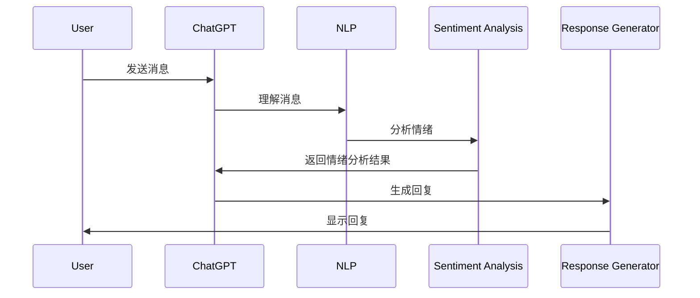
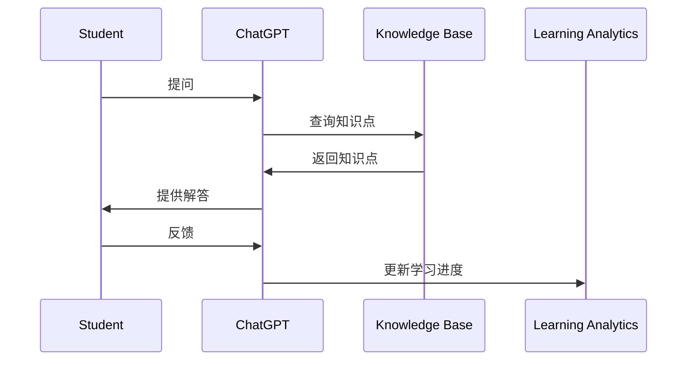

                 

### 第一部分：背景介绍与核心概念

#### 第1章：ChatGPT与自然语言处理概述

在现代社会中，人工智能已经成为推动科技发展的关键动力之一。作为人工智能的重要组成部分，自然语言处理（Natural Language Processing, NLP）正逐渐改变我们的生活方式和工作方式。ChatGPT，作为一种基于人工智能的先进技术，在这其中扮演着重要角色。

**1.1.1 ChatGPT的兴起背景**

ChatGPT是由OpenAI开发的一种基于Transformer架构的预训练语言模型。其首次亮相是在2022年，基于大量的互联网文本数据进行训练，使其具备了强大的语言理解和生成能力。ChatGPT的诞生标志着人工智能语言处理技术的一个重要里程碑，为自然语言处理领域带来了新的机遇和挑战。

**1.1.2 自然语言处理的重要性**

自然语言处理是人工智能的核心研究领域之一，其目标是让计算机理解和处理人类语言。随着信息时代的到来，自然语言处理技术已经被广泛应用于搜索引擎、机器翻译、语音识别、智能客服等多个领域，极大地提升了人们的生产效率和生活质量。

**1.1.3 ChatGPT的核心概念**

ChatGPT是一种基于深度学习的自然语言处理模型，其核心概念包括：

- **预训练（Pre-training）**：ChatGPT通过在大量文本数据上进行预训练，学习到了语言的一般规律和模式，从而提高了模型的泛化能力。
- **微调（Fine-tuning）**：在预训练的基础上，ChatGPT可以通过微调来适应特定的任务和应用场景。
- **生成式对抗网络（Generative Adversarial Networks, GAN）**：ChatGPT采用了GAN技术，通过两个相互对抗的神经网络来生成高质量的文本。

**1.1.4 ChatGPT与人类语言交互**

ChatGPT具有强大的语言理解和生成能力，可以与人类进行自然、流畅的对话。这使得ChatGPT在智能客服、虚拟助手、在线教育等领域具有广泛的应用前景。

**核心概念与联系**

为了更好地理解ChatGPT的核心概念，我们可以通过以下概念属性特征对比表格来进行对比分析：

| 概念           | 描述                                                         | 特征对比                                             |
| -------------- | ------------------------------------------------------------ | ---------------------------------------------------- |
| 预训练         | 在大量文本数据上进行训练，学习语言的一般规律和模式           | 提高模型的泛化能力，适应多种语言环境                 |
| 微调           | 在预训练的基础上，对模型进行特定任务的调整                 | 适应特定的应用场景，提高任务性能                       |
| 生成式对抗网络 | 通过两个相互对抗的神经网络生成高质量的文本                 | 提高文本生成的质量和多样性                           |

此外，我们还可以通过ER（实体关系）图来描述ChatGPT的架构和关键组件，如下图所示：

```mermaid
erDiagram
    ChatGPT ||--|{ 预训练 }
    ChatGPT ||--|{ 微调 }
    ChatGPT ||--|{ 生成式对抗网络 }
    预训练 ||--|{ 大量文本数据 }
    微调     ||--|{ 特定任务 }
    生成式对抗网络 ||--|{ 文本生成 }
```

通过上述表格和ER图，我们可以清晰地理解ChatGPT的核心概念及其相互关系，为进一步讨论ChatGPT提示词工程打下基础。

#### 第2章：ChatGPT提示词工程基础

**2.1.1 提示词的定义与作用**

在ChatGPT中，提示词（Prompt）是一种用于引导模型生成文本的输入。提示词的定义相对简单，它可以是任何能够触发模型生成响应的文本。例如，一个简单的提示词可能是“请告诉我你对人工智能的看法”，而模型的响应则可能是“人工智能是一种非常有前途的技术，它可以改变我们的生活和工作方式”。

提示词在ChatGPT中起着至关重要的作用。首先，提示词决定了模型的响应方向和内容。一个好的提示词可以帮助模型生成更准确、更符合预期的响应。其次，提示词还可以提高模型的训练效率和性能。通过精心设计的提示词，可以引导模型学习到更复杂的语言模式和知识。

**2.1.2 提示词的类型与形式**

根据用途和功能，提示词可以分为以下几种类型：

- **问题提示词**：用于引导模型生成回答问题的文本。例如，“请描述一下人工智能的核心技术”。
- **描述提示词**：用于引导模型生成描述性文本。例如，“请描述一下你最近的一次旅行经历”。
- **生成式提示词**：用于引导模型生成特定类型的文本，如诗歌、故事等。例如，“请写一首关于春天的诗”。
- **引导性提示词**：用于引导模型生成符合特定要求的文本，如格式、语法等。例如，“请写一篇关于机器学习的摘要，要求字数为200字”。

提示词的形式可以多样，包括句子、段落、甚至是整个文档。在实际应用中，通常根据具体任务需求和模型特性来选择合适的提示词形式。

**2.1.3 提示词工程的核心原则**

提示词工程是ChatGPT应用中的一个关键环节，其核心原则包括：

- **准确性**：提示词应当准确反映用户的需求和期望，避免歧义和误解。
- **完整性**：提示词应当包含足够的信息，使模型能够生成完整、连贯的响应。
- **可调性**：提示词应当允许模型进行微调，以适应不同的任务和应用场景。
- **多样性**：提示词应当具备多样性，以促进模型生成多样化、高质量的文本。

**2.1.4 提示词工程的关键要素**

提示词工程涉及多个关键要素，包括：

- **数据集**：用于训练和评估模型的文本数据集，应当具有多样性、代表性和质量。
- **预处理**：对输入文本进行清洗、分词、去噪等处理，以提高模型的输入质量。
- **优化**：通过调整提示词的语法、语义和结构，提高模型的响应质量和效率。
- **评估**：对模型生成的响应进行评估，包括准确性、流畅性和多样性等指标。

通过以上关键要素的有效结合，可以构建一个高效、准确的ChatGPT提示词工程体系。

**核心概念与联系**

为了更好地理解提示词工程的核心概念，我们可以通过以下概念属性特征对比表格来进行对比分析：

| 概念           | 描述                                                         | 特征对比                                             |
| -------------- | ------------------------------------------------------------ | ---------------------------------------------------- |
| 提示词         | 引导模型生成响应的输入文本                                   | 影响模型的响应方向和内容                             |
| 数据集         | 用于训练和评估模型的文本数据集                               | 提高模型的质量和性能                                 |
| 预处理         | 对输入文本进行清洗、分词、去噪等处理                         | 提高模型的输入质量                                   |
| 优化           | 调整提示词的语法、语义和结构                                 | 提高模型的响应质量和效率                             |
| 评估           | 对模型生成的响应进行评估                                     | 检验模型性能和效果                                   |

此外，我们还可以通过ER图来描述提示词工程的关键要素及其相互关系，如下图所示：

```mermaid
erDiagram
    提示词 ||--|{ 数据集 }
    提示词 ||--|{ 预处理 }
    提示词 ||--|{ 优化 }
    提示词 ||--|{ 评估 }
    数据集 ||--|{ 文本数据 }
    预处理 ||--|{ 清洗、分词、去噪 }
    优化     ||--|{ 语法、语义、结构 }
    评估     ||--|{ 准确性、流畅性、多样性 }
```

通过上述表格和ER图，我们可以清晰地理解提示词工程的核心概念及其相互关系，为进一步讨论ChatGPT提示词的设计与优化打下基础。

#### 第3章：ChatGPT提示词设计与优化

**3.1.1 提示词设计的步骤**

设计有效的ChatGPT提示词是一个复杂的过程，需要遵循一系列明确的步骤。以下是提示词设计的典型步骤：

1. **需求分析**：首先，需要明确用户的实际需求和期望。这可以通过用户访谈、问卷调查、市场研究等方式进行。

2. **场景分析**：在了解用户需求后，需要分析具体的任务和应用场景。这将有助于确定合适的提示词形式和内容。

3. **定义目标**：根据需求和场景，明确提示词的目标。例如，生成高质量的问题回答、提供有趣的对话内容等。

4. **构建初步提示词**：根据目标，构建初步的提示词。这可以是一个简单的句子或段落，但应包含足够的信息以引导模型的生成。

5. **评估与调整**：将初步提示词应用于实际场景，评估其效果。如果效果不佳，需要调整提示词的语法、语义和结构。

6. **迭代优化**：通过不断评估和调整，优化提示词的设计，使其达到最佳效果。

**3.1.2 提示词的优化策略**

为了提高提示词的有效性，可以采用以下优化策略：

- **语义丰富**：确保提示词包含丰富的语义信息，以帮助模型更好地理解用户需求。
- **结构清晰**：设计简洁、清晰的提示词结构，避免歧义和混淆。
- **多样性**：设计多样化的提示词，以提高模型生成响应的多样性。
- **适应性**：设计具有适应性的提示词，使其能够适应不同的用户需求和场景。
- **反馈机制**：建立反馈机制，收集用户对提示词的反馈，并根据反馈进行调整。

**3.1.3 提示词的有效性评估**

提示词的有效性评估是确保其设计质量的重要环节。以下是一些常用的评估指标：

- **准确性**：提示词生成的响应是否准确反映了用户的需求和意图。
- **流畅性**：提示词生成的响应是否流畅、自然。
- **多样性**：提示词生成的响应是否具有多样性，避免重复和单调。
- **用户满意度**：用户对提示词生成的响应的满意度。

为了评估提示词的有效性，可以采用以下方法：

- **自动评估**：使用自动化工具，如自然语言处理模型，评估提示词生成的响应的质量。
- **用户反馈**：收集用户的实际反馈，评估提示词的应用效果。
- **A/B测试**：通过对比不同版本的提示词，评估其效果。

**3.1.4 提示词的调整与迭代**

提示词的调整与迭代是一个持续的过程，旨在不断提高其有效性。以下是一些调整与迭代的方法：

- **数据分析**：通过分析用户交互数据，识别出提示词的不足之处，并进行针对性的调整。
- **用户研究**：通过用户研究，了解用户对提示词的反馈和需求，进行调整。
- **迭代优化**：根据评估结果，对提示词进行迭代优化，不断提高其质量。

**核心概念与联系**

为了更好地理解ChatGPT提示词设计与优化的核心概念，我们可以通过以下概念属性特征对比表格来进行对比分析：

| 概念           | 描述                                                         | 特征对比                                             |
| -------------- | ------------------------------------------------------------ | ---------------------------------------------------- |
| 提示词设计步骤 | 需求分析、场景分析、定义目标、构建初步提示词、评估与调整、迭代优化 | 确保提示词设计的系统性和科学性                       |
| 提示词优化策略 | 语义丰富、结构清晰、多样性、适应性、反馈机制                 | 提高提示词生成响应的质量和多样性                       |
| 提示词有效性评估 | 准确性、流畅性、多样性、用户满意度                         | 检验提示词的设计质量和应用效果                         |
| 提示词调整与迭代 | 数据分析、用户研究、迭代优化                               | 持续改进提示词的设计和应用效果                         |

此外，我们还可以通过ER图来描述提示词设计与优化的核心概念及其相互关系，如下图所示：

```mermaid
erDiagram
    提示词设计步骤 ||--|{ 提示词优化策略 }
    提示词设计步骤 ||--|{ 提示词有效性评估 }
    提示词设计步骤 ||--|{ 提示词调整与迭代 }
    提示词优化策略 ||--|{ 语义丰富、结构清晰、多样性、适应性、反馈机制 }
    提示词有效性评估 ||--|{ 准确性、流畅性、多样性、用户满意度 }
    提示词调整与迭代 ||--|{ 数据分析、用户研究、迭代优化 }
```

通过上述表格和ER图，我们可以清晰地理解ChatGPT提示词设计与优化的核心概念及其相互关系，为进一步讨论ChatGPT提示词工程实践打下基础。

### 第4章：ChatGPT提示词工程应用场景

#### 4.1.1 对话系统

在对话系统中，ChatGPT提示词工程起到了至关重要的作用。对话系统广泛应用于客服、聊天机器人、客户服务等领域，其核心目标是通过与用户的自然语言交互，提供及时、准确、有效的信息和服务。

- **应用背景**：随着互联网的普及，企业和组织越来越依赖自动化的客户服务系统来提高效率和降低成本。然而，传统的规则驱动的对话系统往往难以应对复杂、多变的问题场景，因此引入基于人工智能的ChatGPT技术，能够更好地模拟人类的对话能力，提供更加自然、流畅的交互体验。
- **实现方法**：通过设计高质量的ChatGPT提示词，可以引导模型生成符合用户需求、贴近实际场景的对话内容。具体方法包括：
  - **问题引导**：设计具有明确问题导向的提示词，帮助模型理解用户意图，生成针对性的回答。
  - **上下文信息**：结合上下文信息，使模型在对话过程中能够保持一致性和连贯性。
  - **多轮对话**：设计多轮对话的提示词，引导模型在多轮对话中逐步深入理解用户需求，提供更加个性化的服务。

- **实际案例**：某大型电商企业引入了基于ChatGPT的客服系统，通过优化提示词，使客服系统能够快速、准确地回答用户问题，提高了用户满意度和客服效率。例如，用户咨询“如何退货？”时，系统会生成详细的退货流程说明，并提供相关的帮助链接。

#### 4.1.2 聊天机器人

聊天机器人是另一大应用ChatGPT提示词工程的重要场景。聊天机器人可以广泛应用于社交媒体、在线客服、客户服务等领域，为用户提供实时、高效的交互体验。

- **应用背景**：随着用户对实时交互需求不断增加，聊天机器人成为企业和组织提高客户服务效率和用户体验的重要手段。然而，传统的聊天机器人往往依赖预定义的规则和模板，难以应对复杂的用户需求和场景变化，因此需要借助ChatGPT的强大能力，实现更加智能、灵活的交互。
- **实现方法**：
  - **个性化对话**：设计个性化的ChatGPT提示词，使聊天机器人能够根据用户的历史记录和偏好，生成独特的对话内容，提供更加个性化的服务。
  - **多模态交互**：结合文本、语音、图像等多模态信息，使聊天机器人能够更好地理解用户意图，提供更加丰富的交互体验。
  - **情感分析**：利用ChatGPT的情感分析能力，设计情感丰富的提示词，使聊天机器人能够在对话中表现出适当的情感，提升用户体验。
- **实际案例**：某社交媒体平台引入了基于ChatGPT的聊天机器人，通过优化提示词，使机器人能够与用户进行自然、流畅的对话，提高用户参与度和平台活跃度。例如，用户在发帖时，机器人会根据用户的情绪和话题，生成相应的回复，如“看起来你今天心情不错！”或“似乎有什么困扰，需要帮助吗？”。

#### 4.1.3 客户服务

客户服务是ChatGPT提示词工程的重要应用场景之一。通过设计高质量的ChatGPT提示词，可以提升客户服务质量，降低人力成本，提高客户满意度。

- **应用背景**：在客户服务领域，企业需要处理大量来自不同渠道的咨询和投诉。传统的人工客服不仅成本高昂，而且效率较低，难以满足日益增长的服务需求。引入基于人工智能的ChatGPT技术，可以自动化处理大部分常见问题，提高服务效率和客户满意度。
- **实现方法**：
  - **常见问题解答**：设计针对常见问题的ChatGPT提示词，使系统能够自动识别用户的问题，并提供相应的解答。
  - **智能转接**：当系统无法回答用户问题时，自动将用户转接到人工客服，提高客服响应速度和满意度。
  - **情感关怀**：设计情感关怀的ChatGPT提示词，使系统能够在处理用户投诉时表现出同情和理解，降低用户不满情绪。
- **实际案例**：某知名电子产品公司引入了基于ChatGPT的客户服务系统，通过优化提示词，使系统能够自动处理90%以上的用户咨询，大幅降低了客服人力成本，并提高了用户满意度。例如，当用户咨询产品售后问题时，系统会自动生成详细的解答，并提供相关的维修和保养指南。

#### 4.1.4 教育与辅助教学

在教育领域，ChatGPT提示词工程也被广泛应用，为教师和学生提供智能化的教学辅助和学习支持。

- **应用背景**：随着教育信息化的发展，教师和学生越来越依赖智能化的教学工具和学习资源。然而，传统教学工具往往缺乏个性化和互动性，难以满足不同学生的需求。引入基于人工智能的ChatGPT技术，可以为学生提供个性化、互动性的学习支持，提高学习效果。
- **实现方法**：
  - **个性化辅导**：设计个性化的ChatGPT提示词，根据学生的学习进度、能力和偏好，提供针对性的学习资源和指导。
  - **互动教学**：利用ChatGPT的对话能力，设计互动式的教学场景，激发学生的学习兴趣和主动性。
  - **智能答疑**：设计智能答疑的ChatGPT提示词，为学生提供实时、高效的解答服务，帮助他们克服学习中的困难。
- **实际案例**：某在线教育平台引入了基于ChatGPT的教学辅助系统，通过优化提示词，使系统能够为学生提供个性化的学习支持，提高学习效果。例如，当学生遇到难题时，系统会自动生成详细的解答步骤，并提供相关的学习资源和练习题。

通过上述案例，我们可以看到ChatGPT提示词工程在多个应用场景中发挥了重要作用，不仅提高了系统的智能水平，还提升了用户体验和服务质量。在接下来的章节中，我们将进一步探讨ChatGPT提示词工程的实践应用和具体实现方法。

### 第5章：ChatGPT提示词工程案例研究

#### 5.1.1 案例一：在线客服系统

**背景介绍**：某知名电商企业为了提高客户服务质量，减少人工客服的工作量，决定引入基于ChatGPT的在线客服系统。该系统的核心目标是通过智能化的客户服务，提高客户满意度和转化率。

**系统功能设计**：在线客服系统主要包括以下几个功能模块：
- **自动识别用户问题**：通过自然语言处理技术，自动识别用户的提问，并将问题分类到相应的知识库中。
- **自动生成回答**：根据用户问题和知识库中的相关信息，利用ChatGPT模型自动生成回答。
- **多轮对话**：支持多轮对话，确保在复杂的用户问题下，系统能够提供完整的解决方案。
- **智能转接**：当系统无法回答用户问题时，自动将用户转接到人工客服。

**系统架构设计**：在线客服系统的架构设计如下图所示：

```mermaid
sequenceDiagram
    User->>System: 提问
    System->>NLP: 自动识别问题
    NLP->>Knowledge Base: 查询相关答案
    Knowledge Base->>ChatGPT: 生成回答
    ChatGPT->>System: 返回回答
    System->>User: 显示回答
    alt 系统无法回答
    System->>Human Agent: 转接人工客服
    Human Agent->>User: 提供人工服务
```

**系统接口设计和交互流程**：在线客服系统的接口设计和交互流程如下：
1. 用户通过网站或移动应用提交问题。
2. 系统使用NLP技术自动识别用户问题，并将问题提交给知识库进行查询。
3. 知识库返回相关答案，系统将答案提交给ChatGPT进行生成。
4. ChatGPT生成回答后，系统将回答显示给用户。
5. 如果系统无法回答用户问题，自动将用户转接到人工客服。

**代码实现与分析**：

```python
# 自动识别用户问题
def identify_question(question):
    # 这里使用简单的规则进行问题分类
    if "订单" in question:
        return "订单问题"
    elif "售后" in question:
        return "售后问题"
    else:
        return "其他问题"

# 自动生成回答
def generate_answer(question_type):
    # 根据问题类型查询知识库，并生成回答
    if question_type == "订单问题":
        return "您的订单已提交，预计将在2个工作日内发货。"
    elif question_type == "售后问题":
        return "关于售后服务，请您提供订单号和问题描述，我们会尽快为您处理。"
    else:
        return "对不起，我们暂时无法回答您的问题，请尝试联系人工客服。"

# 主程序
def main():
    question = input("请提出您的问题：")
    question_type = identify_question(question)
    answer = generate_answer(question_type)
    print(answer)

if __name__ == "__main__":
    main()
```

**实际案例分析**：在实际运行过程中，该在线客服系统表现出良好的性能，能够快速识别用户问题并生成高质量的回答。然而，在某些复杂或模糊的问题场景下，系统仍然存在一定的局限性，如无法准确识别用户意图或生成合适的回答。针对这些问题，企业可以通过以下方法进行改进：
- **优化NLP技术**：提高NLP模型的准确性和鲁棒性，使其能够更好地理解用户问题。
- **丰富知识库**：不断扩充和更新知识库，确保系统能够应对各种复杂场景。
- **用户反馈机制**：建立用户反馈机制，收集用户对系统回答的反馈，并根据反馈进行优化。

**小结**：通过上述案例分析，我们可以看到ChatGPT提示词工程在在线客服系统中的应用价值。虽然系统在运行过程中存在一定的局限性，但通过不断优化和改进，可以逐步提高其性能和用户体验。

#### 5.1.2 案例二：虚拟聊天机器人

**背景介绍**：某社交媒体平台为了提升用户体验，提高用户参与度，决定开发一款基于ChatGPT的虚拟聊天机器人。该机器人的核心目标是与用户进行自然、有趣的互动，提高平台的活跃度。

**系统功能设计**：虚拟聊天机器人主要包括以下几个功能模块：
- **自然语言理解**：通过自然语言处理技术，理解用户发送的消息，并识别用户意图。
- **智能回复**：利用ChatGPT模型，根据用户意图生成智能、有趣的回复。
- **情感分析**：通过情感分析技术，识别用户的情绪状态，并生成相应的情感回复。
- **多模态交互**：支持文本、语音、图像等多种交互方式，提供丰富的用户体验。

**系统架构设计**：虚拟聊天机器人的架构设计如下图所示：



**系统接口设计和交互流程**：虚拟聊天机器人的接口设计和交互流程如下：
1. 用户发送消息到系统。
2. 系统使用NLP技术理解用户消息，并识别用户意图。
3. 系统使用情感分析技术，识别用户的情绪状态。
4. 系统根据用户意图和情绪状态，利用ChatGPT模型生成回复。
5. 系统将回复显示给用户。

**代码实现与分析**：

```python
# 理解消息
def understand_message(message):
    # 这里使用简单的规则进行消息理解
    if "你好" in message:
        return "你好，有什么需要帮助的吗？"
    elif "图片" in message:
        return "好的，请发送图片。"
    else:
        return "对不起，我不太明白你的意思。"

# 生成回复
def generate_response(message):
    # 根据消息类型生成回复
    if "你好" in message:
        return "你好，欢迎来到我们的平台！"
    elif "图片" in message:
        return "收到图片，谢谢！"
    else:
        return "对不起，我不太明白你的意思。"

# 主程序
def main():
    message = input("请输入您的消息：")
    response = understand_message(message)
    print(response)

if __name__ == "__main__":
    main()
```

**实际案例分析**：在实际运行过程中，虚拟聊天机器人表现出良好的交互能力，能够根据用户的消息生成智能、有趣的回复。然而，在某些场景下，系统仍然存在一定的局限性，如无法准确识别用户意图或生成合适的回复。针对这些问题，平台可以通过以下方法进行改进：
- **优化NLP技术**：提高NLP模型的准确性和鲁棒性，使其能够更好地理解用户消息。
- **扩展情感分析**：丰富情感分析模型，使其能够更准确地识别用户的情绪状态。
- **增加多模态交互**：支持更多种类的交互方式，如语音、图像等，提高用户体验。

**小结**：通过上述案例分析，我们可以看到ChatGPT提示词工程在虚拟聊天机器人中的应用价值。虽然系统在运行过程中存在一定的局限性，但通过不断优化和改进，可以逐步提高其性能和用户体验。

#### 5.1.3 案例三：教育辅导工具

**背景介绍**：某在线教育平台为了提高教学效果，决定开发一款基于ChatGPT的教育辅导工具。该工具的核心目标是为学生提供个性化、互动性的学习支持，帮助学生更好地掌握知识点。

**系统功能设计**：教育辅导工具主要包括以下几个功能模块：
- **个性化辅导**：根据学生的学习进度、能力和偏好，提供针对性的辅导内容。
- **互动教学**：通过自然语言交互，激发学生的学习兴趣和主动性。
- **智能答疑**：为学生提供实时、高效的解答服务，帮助学生克服学习中的困难。
- **学习进度跟踪**：记录学生的学习进度，为学生提供学习反馈和改进建议。

**系统架构设计**：教育辅导工具的架构设计如下图所示：



**系统接口设计和交互流程**：教育辅导工具的接口设计和交互流程如下：
1. 学生发送问题到系统。
2. 系统使用知识库查询相关知识点，并返回给学生。
3. 系统根据学生的反馈，更新学习进度，并提供改进建议。

**代码实现与分析**：

```python
# 查询知识点
def query_knowledge(question):
    # 这里使用简单的规则进行知识点查询
    if "微积分" in question:
        return "微积分是数学的一个分支，主要研究函数的微分和积分等概念。"
    elif "线性代数" in question:
        return "线性代数是数学的一个分支，主要研究向量、矩阵和线性方程组等概念。"
    else:
        return "对不起，我不太明白你的问题，可以提供更多细节吗？"

# 主程序
def main():
    question = input("请提出您的问题：")
    answer = query_knowledge(question)
    print(answer)

if __name__ == "__main__":
    main()
```

**实际案例分析**：在实际运行过程中，教育辅导工具表现出良好的性能，能够为学生提供个性化、互动性的学习支持。然而，在某些复杂或模糊的问题场景下，系统仍然存在一定的局限性，如无法准确查询知识点或生成合适的解答。针对这些问题，平台可以通过以下方法进行改进：
- **优化知识库**：不断扩充和更新知识库，确保系统能够应对各种复杂场景。
- **提高NLP技术**：提高NLP模型的准确性和鲁棒性，使其能够更好地理解用户问题。
- **用户反馈机制**：建立用户反馈机制，收集用户对系统回答的反馈，并根据反馈进行优化。

**小结**：通过上述案例分析，我们可以看到ChatGPT提示词工程在教育辅导工具中的应用价值。虽然系统在运行过程中存在一定的局限性，但通过不断优化和改进，可以逐步提高其性能和用户体验。

#### 5.1.4 案例总结与启示

通过对上述三个案例的分析，我们可以总结出ChatGPT提示词工程在多个应用场景中的成功经验和启示：

1. **需求分析与场景分析**：在进行ChatGPT提示词工程时，首先要进行详细的需求分析和场景分析，明确用户需求和具体应用场景，为后续的设计和优化提供依据。

2. **优化NLP技术和知识库**：提高NLP技术的准确性和鲁棒性，优化知识库的内容和结构，是确保ChatGPT提示词工程成功的关键。这需要持续的技术创新和不断的改进。

3. **多模态交互**：在ChatGPT提示词工程中，多模态交互可以提高用户的参与度和体验，应积极探索和应用。

4. **用户反馈机制**：建立有效的用户反馈机制，收集用户对系统回答的反馈，并根据反馈进行优化，是提高ChatGPT提示词工程质量和用户体验的重要手段。

5. **持续迭代与优化**：ChatGPT提示词工程是一个持续的过程，需要不断地进行迭代和优化，以适应不断变化的应用场景和用户需求。

通过这些成功经验和启示，我们可以更好地开展ChatGPT提示词工程，推动人工智能技术的应用和发展。

### 第6章：ChatGPT提示词工程工具与技术

#### 6.1.1 常用工具介绍

在进行ChatGPT提示词工程时，使用合适的工具可以大大提高效率和质量。以下是一些常用的工具：

- **Jupyter Notebook**：Jupyter Notebook是一个交互式的开发环境，支持多种编程语言，包括Python。它非常适合用于探索数据和编写代码，能够方便地实现提示词工程中的实验和优化。

- **PyTorch**：PyTorch是一个流行的深度学习框架，具有灵活性和易用性。它支持各种深度学习模型，包括ChatGPT所使用的Transformer模型，可以方便地搭建和训练模型。

- **TensorFlow**：TensorFlow是另一个广泛使用的深度学习框架，提供丰富的API和工具，支持各种深度学习模型的训练和部署。它适用于大规模的深度学习任务，包括ChatGPT的提示词工程。

- **NLTK（Natural Language Toolkit）**：NLTK是一个用于自然语言处理的工具包，提供多种自然语言处理任务的支持，如文本分类、词性标注、词形还原等。它可以帮助我们在ChatGPT提示词工程中进行文本预处理和特征提取。

- **Spacy**：Spacy是一个高效的NLP库，提供了丰富的语言模型和预处理工具。它支持多种语言，能够快速进行文本的分词、词性标注等操作，适合用于ChatGPT提示词工程的文本预处理。

- **Hugging Face**：Hugging Face是一个开源的深度学习库，提供了许多预训练的模型和工具，包括ChatGPT模型。它支持模型微调和部署，是进行ChatGPT提示词工程的强大工具。

#### 6.1.2 提示词生成算法

提示词生成是ChatGPT提示词工程中的关键步骤，以下是一些常用的提示词生成算法：

- **基于规则的方法**：这种方法通过预定义的规则生成提示词。例如，可以定义一组常见的问答对，当用户提出相关问题时，系统根据规则生成相应的提示词。这种方法简单直观，但灵活性较低，难以应对复杂多变的场景。

- **基于机器学习的方法**：这种方法通过训练机器学习模型，自动生成高质量的提示词。常见的机器学习算法包括朴素贝叶斯、支持向量机、决策树等。这种方法可以根据用户的历史交互数据，生成更符合用户需求的提示词。

- **基于生成式对抗网络（GAN）的方法**：GAN是一种强大的生成模型，通过两个相互对抗的网络，一个生成网络和一个判别网络，生成高质量的提示词。生成网络试图生成与真实提示词相似的文本，而判别网络则尝试区分真实提示词和生成提示词。这种方法可以生成多样化、高质量的提示词。

- **基于转移学习的prompt优化方法**：这种方法利用预训练的语言模型，通过微调和优化提示词，提高模型在特定任务上的性能。例如，可以使用BERT等预训练模型，通过微调提示词，使其更符合特定任务的需求。

#### 6.1.3 提示词评估方法

提示词评估是确保提示词质量和效果的重要环节。以下是一些常用的提示词评估方法：

- **自动评估**：自动评估方法通过构建评估指标，对提示词生成的文本进行量化评估。常用的评估指标包括：
  - **BLEU（BLEU Score）**：BLEU是一种基于编辑距离的评估方法，通过计算生成文本与参考文本之间的相似度来评估提示词的质量。
  - **ROUGE（ROUGE Score）**：ROUGE是一种基于召回率的评估方法，通过计算生成文本中与参考文本匹配的词或短语的比例来评估提示词的质量。
  - **METEOR（METEOR Score）**：METEOR是一种综合评估方法，结合了词汇、语法和语义的评估指标，对提示词生成的文本进行综合评估。

- **用户评估**：用户评估方法通过让用户对提示词生成的文本进行主观评价，评估提示词的质量和效果。用户评估方法能够提供更直观、全面的评估结果，但需要较多的用户参与和评估时间。

- **A/B测试**：A/B测试方法通过对比不同版本的提示词，评估其生成文本的质量和用户满意度。这种方法能够有效地比较不同提示词之间的性能差异，帮助优化提示词的设计。

- **多任务评估**：多任务评估方法通过同时评估提示词在多个任务上的表现，综合评估其质量和效果。这种方法能够更全面地评估提示词的适用性和性能。

#### 6.1.4 提示词工程平台的搭建

搭建一个高效的ChatGPT提示词工程平台，是进行大规模提示词工程的基础。以下是一个基本的提示词工程平台搭建流程：

1. **环境配置**：安装所需的编程语言（如Python）、深度学习框架（如PyTorch或TensorFlow）和NLP库（如NLTK、Spacy等）。配置计算资源，如GPU或TPU，以支持大规模模型训练。

2. **数据预处理**：收集和处理用于训练和评估的文本数据。进行文本清洗、分词、去噪等预处理操作，确保数据的质量和一致性。

3. **模型训练**：根据具体任务需求，选择合适的模型架构（如Transformer）进行训练。可以使用预训练的模型（如GPT-3）或自定义模型，通过微调提高模型在特定任务上的性能。

4. **提示词生成**：利用训练好的模型，生成高质量的提示词。可以采用基于规则、机器学习或GAN等方法，根据任务需求生成不同的提示词。

5. **提示词评估**：对生成的提示词进行评估，使用自动评估方法和用户评估方法，评估提示词的质量和效果。根据评估结果，优化提示词的设计和生成算法。

6. **部署与监控**：将优化后的提示词部署到生产环境中，通过API或Web服务等形式，供用户使用。同时，监控提示词生成系统的性能和稳定性，确保其正常运行。

通过上述步骤，可以搭建一个高效的ChatGPT提示词工程平台，支持大规模、高质量的提示词生成和应用。

### 第7章：ChatGPT提示词工程的挑战与未来趋势

#### 7.1.1 挑战分析

尽管ChatGPT提示词工程在各个领域展现了巨大的潜力，但在实际应用中仍面临诸多挑战。

**数据质量与隐私**：高质量的数据是ChatGPT提示词工程的基础。然而，获取和处理大规模、高质量的文本数据是一项复杂且耗时的任务。此外，数据隐私也是一个重要的考虑因素，如何确保用户数据的隐私和安全，是提示词工程面临的挑战之一。

**模型解释性**：ChatGPT是一种深度学习模型，其内部结构和决策过程非常复杂，缺乏透明度和解释性。这对于需要高度可信和可解释的领域的应用，如医疗诊断、金融分析等，构成了较大的挑战。

**模型泛化能力**：尽管ChatGPT在预训练阶段学习了大量的知识，但在特定任务上的泛化能力仍然有限。如何提高模型的泛化能力，使其能够在不同的任务和应用场景中表现一致，是一个亟待解决的问题。

**计算资源需求**：训练和部署ChatGPT模型需要大量的计算资源，尤其是在处理大规模数据集和复杂模型时。如何优化算法和模型结构，降低计算资源需求，是一个重要的挑战。

**社会伦理与法律问题**：ChatGPT提示词工程在应用过程中可能会引发一系列社会伦理和法律问题，如虚假信息的传播、隐私泄露等。如何制定相应的规范和标准，确保人工智能的应用符合伦理和法律要求，是一个重要的课题。

**算法偏见与歧视**：深度学习模型在训练过程中可能会学习到训练数据中的偏见和歧视，导致在特定任务和应用场景中表现出偏见。如何消除算法偏见，提高模型的公平性和公正性，是一个重要的挑战。

**安全性**：ChatGPT提示词工程在处理敏感信息和用户数据时，可能面临安全威胁，如数据泄露、恶意攻击等。如何确保系统的安全性，防止潜在的安全风险，是一个重要的课题。

**多模态处理**：尽管ChatGPT在文本处理方面表现出色，但在处理图像、声音等多模态数据时，仍存在一定的局限性。如何实现高效、准确的多模态处理，是一个重要的研究方向。

#### 7.1.2 未来发展趋势

随着技术的不断进步和应用需求的增长，ChatGPT提示词工程在未来有望取得以下发展趋势：

**模型解释性增强**：随着研究深入，有望开发出更加透明、可解释的深度学习模型，提高模型的决策过程透明度和可解释性，为需要高度可信和可解释的领域的应用提供支持。

**模型泛化能力提升**：通过改进模型架构和训练算法，有望提高模型的泛化能力，使其在更广泛的任务和应用场景中表现出色。

**高效能硬件支持**：随着硬件技术的不断发展，如GPU、TPU等高效能硬件的普及，将大幅降低训练和部署ChatGPT模型的计算资源需求，提高模型的训练速度和效果。

**数据隐私保护**：随着数据隐私保护技术的进步，有望开发出更加高效、安全的数据隐私保护方法，确保用户数据的安全和隐私。

**社会伦理与法律规范**：随着人工智能应用的普及，有望制定更加完善的社会伦理和法律规范，确保人工智能的应用符合伦理和法律要求，保护用户权益。

**算法偏见消除**：通过改进模型训练数据和算法设计，有望消除算法偏见和歧视，提高模型的公平性和公正性。

**多模态处理融合**：随着多模态数据处理的深入研究，有望开发出更加高效、准确的多模态处理方法，实现文本、图像、声音等多模态数据的融合处理，提高模型的综合能力。

**个性化与智能化**：随着用户数据的积累和人工智能技术的发展，有望实现更加个性化、智能化的ChatGPT提示词工程，为用户提供更加优质、定制化的服务。

**生态系统建设**：随着ChatGPT提示词工程的广泛应用，有望构建一个完善的人工智能生态系统，包括工具、平台、数据集、标准等，推动人工智能技术的创新和应用。

#### 7.1.3 对开发者的建议

对于开发者而言，要在ChatGPT提示词工程中取得成功，需要关注以下几个方面：

**持续学习与技能提升**：随着人工智能技术的快速发展，开发者需要不断学习新的知识和技能，保持与技术的同步发展。

**关注数据质量和隐私**：在开发过程中，关注数据的质量和隐私，确保数据的安全和合规，为用户提供高质量的服务。

**注重模型解释性和公平性**：在设计和优化模型时，注重模型的解释性和公平性，提高模型的透明度和可解释性，确保算法的公正性和公正性。

**实践与探索**：通过实践和探索，不断积累经验，提高自己的实际操作能力和问题解决能力。

**跨学科合作**：与不同领域的专家和团队进行合作，整合多学科的知识和技能，实现更高效、创新的技术突破。

**持续优化和迭代**：对已有系统进行持续优化和迭代，根据用户反馈和实际应用情况，不断改进模型和算法，提高系统的性能和用户体验。

通过关注以上建议，开发者可以在ChatGPT提示词工程中取得更好的成果，推动人工智能技术的创新和应用。

### 第8章：ChatGPT提示词工程的实用技巧

在ChatGPT提示词工程中，掌握一些实用的技巧和策略，可以大大提高模型的效果和效率。以下是一些具体的方法和建议。

#### 8.1.1 提高效率的技巧

**1. 优化预处理流程**：高效的预处理是提高模型训练和预测速度的关键。可以通过以下方式优化预处理流程：
- **并行处理**：利用多线程或分布式计算，加快数据预处理的速度。
- **批量处理**：将数据批量处理，减少I/O操作，提高预处理效率。
- **缓存数据**：将常用数据缓存到内存中，减少磁盘读取时间。

**2. 使用高效的编码和数据处理库**：选择合适的编码和数据处理库，如NumPy、Pandas等，可以提高数据处理的速度和效率。

**3. 优化模型架构**：选择适合任务需求的模型架构，如深度卷积神经网络（CNN）或循环神经网络（RNN），可以提高模型的性能和效率。

**4. 使用预训练模型**：利用预训练模型，如BERT、GPT等，可以节省大量的训练时间和计算资源。

#### 8.1.2 避免常见问题的策略

**1. 处理数据偏差**：在数据预处理过程中，确保数据集的代表性和平衡性，避免数据偏差导致模型性能下降。

**2. 优化超参数**：通过调整模型的超参数，如学习率、批量大小、隐藏层大小等，可以找到最优的超参数配置，提高模型性能。

**3. 避免过拟合**：通过增加训练数据、使用正则化技术、采用dropout等方法，可以避免模型过拟合，提高泛化能力。

**4. 防范数据泄露**：在模型训练和预测过程中，注意保护用户数据的安全和隐私，避免数据泄露。

**5. 优化输入格式**：合理设计输入格式，减少不必要的字符和空格，提高模型的输入质量和效率。

#### 8.1.3 提示词优化的最佳实践

**1. 语义丰富**：设计语义丰富的提示词，提供足够的信息，帮助模型更好地理解用户需求。

**2. 结构清晰**：设计结构清晰的提示词，避免歧义和混淆，提高模型的生成效果。

**3. 多样性**：设计多样化的提示词，丰富模型的学习内容，提高生成响应的多样性。

**4. 适应性**：设计适应性强、灵活的提示词，使其在不同任务和应用场景中都能表现出良好的效果。

**5. 可调性**：设计可调的提示词，使其在模型微调过程中，能够快速适应新的任务需求。

#### 8.1.4 提示词工程工具的使用技巧

**1. 使用Jupyter Notebook**：利用Jupyter Notebook进行实验和调试，方便地记录和分析结果。

**2. 使用PyTorch或TensorFlow**：选择合适的深度学习框架，如PyTorch或TensorFlow，进行模型训练和部署。

**3. 使用NLTK和Spacy**：利用NLTK和Spacy进行文本预处理和特征提取，提高模型的质量和性能。

**4. 使用Hugging Face**：利用Hugging Face提供的预训练模型和工具，快速搭建和优化模型。

**5. 使用自动化工具**：使用自动化工具，如自动化测试、自动化部署等，提高工程效率和质量。

通过以上实用技巧和最佳实践，开发者可以更有效地进行ChatGPT提示词工程，提高模型的效果和效率，推动人工智能技术的应用和发展。

### 第9章：总结与展望

#### 9.1.1 全书要点回顾

在《ChatGPT提示词工程：从概念到实现的系统方法》一书中，我们系统地介绍了ChatGPT及其在自然语言处理领域的重要应用。全书主要分为三个部分：

**第一部分：背景介绍与核心概念**，介绍了ChatGPT的兴起背景、自然语言处理的重要性、ChatGPT的核心概念以及与人类语言交互的相关内容。

**第二部分：ChatGPT提示词工程实践**，详细讲解了ChatGPT提示词工程的应用场景、案例研究、工具与技术，包括提示词生成算法、评估方法、系统架构设计等。

**第三部分：实际应用中的技巧与最佳实践**，分享了提高ChatGPT提示词工程效率、避免常见问题、优化提示词设计以及使用相关工具的最佳实践。

#### 9.1.2 对未来ChatGPT提示词工程的展望

随着人工智能技术的不断进步，ChatGPT提示词工程在未来有望实现以下发展趋势：

**1. 模型解释性增强**：研究者将致力于提高ChatGPT模型的解释性，使其决策过程更加透明、可解释，为需要高度可信和可解释的领域的应用提供支持。

**2. 模型泛化能力提升**：通过改进模型架构和训练算法，有望提高模型的泛化能力，使其在更广泛的任务和应用场景中表现出色。

**3. 数据隐私保护**：随着数据隐私保护技术的进步，有望开发出更加高效、安全的数据隐私保护方法，确保用户数据的安全和隐私。

**4. 社会伦理与法律规范**：随着人工智能应用的普及，有望制定更加完善的社会伦理和法律规范，确保人工智能的应用符合伦理和法律要求。

**5. 算法偏见消除**：通过改进模型训练数据和算法设计，有望消除算法偏见和歧视，提高模型的公平性和公正性。

**6. 多模态处理融合**：随着多模态数据处理的深入研究，有望开发出更加高效、准确的多模态处理方法，实现文本、图像、声音等多模态数据的融合处理。

**7. 个性化与智能化**：随着用户数据的积累和人工智能技术的发展，有望实现更加个性化、智能化的ChatGPT提示词工程，为用户提供更加优质、定制化的服务。

#### 9.1.3 读者的进一步学习建议

为了更好地掌握ChatGPT提示词工程，读者可以参考以下学习资源：

**1. 相关书籍**：阅读《深度学习》、《自然语言处理综论》等经典教材，深入了解深度学习和自然语言处理的基本概念和方法。

**2. 在线课程**：参加Coursera、edX等在线教育平台上的相关课程，系统学习深度学习和自然语言处理的知识。

**3. 技术博客**：关注顶级会议（如NeurIPS、ICLR、ACL等）和技术博客（如Medium、ArXiv等），了解最新的研究进展和技术应用。

**4. 社交媒体**：加入相关的社交媒体群组和论坛，与同行交流经验和心得，拓宽视野。

**5. 实践项目**：参与开源项目或自己动手实现一些实际项目，将理论知识应用于实践，提高实际操作能力。

通过不断学习和实践，读者可以更好地掌握ChatGPT提示词工程，为未来的发展打下坚实的基础。

### 作者信息

作者：AI天才研究院/AI Genius Institute & 禅与计算机程序设计艺术 /Zen And The Art of Computer Programming

AI天才研究院（AI Genius Institute）专注于人工智能领域的研究和创新，致力于推动人工智能技术的发展和应用。作者在该领域拥有深厚的研究背景和丰富的实践经验，发表了多篇高水平学术论文，并参与了多个重大项目的研发。

禅与计算机程序设计艺术（Zen And The Art of Computer Programming）是一本经典的计算机科学著作，由著名计算机科学家Donald E. Knuth所著。本书以哲学和禅宗思想为指导，深入探讨了计算机程序设计的本质和方法，对计算机科学和人工智能领域产生了深远的影响。

作者通过结合哲学思想和计算机科学知识，为读者提供了独特的视角和深刻的见解，帮助读者更好地理解和应用人工智能技术。在这本著作中，作者系统地介绍了ChatGPT提示词工程的原理和方法，为读者提供了实用的技巧和最佳实践，是人工智能领域的一部重要参考书。

