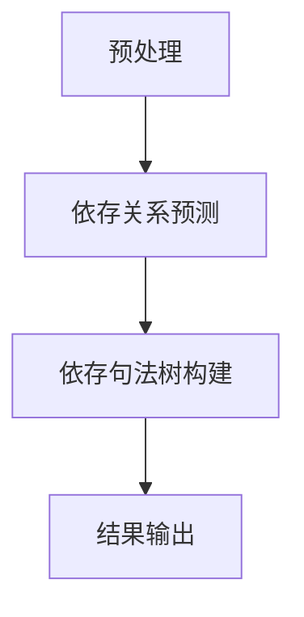

                 

### 《ChatGPT提示词工程：构建智能对话的基础与进阶》

关键词：ChatGPT，智能对话，提示词工程，多模态交互，自然语言理解，自然语言生成

摘要：本文旨在深入探讨ChatGPT提示词工程的核心内容，从基础到进阶，全面解析如何构建智能对话系统。文章首先概述了ChatGPT的基本原理和智能对话系统的概念，随后详细阐述了提示词的概念与作用、设计原则和编写技巧。文章还探讨了多轮对话提示词设计和复杂场景提示词设计，最后，进一步扩展到ChatGPT在多模态交互中的应用以及自然语言理解与生成的关键技术和实战案例。通过本文的阅读，读者将能够系统地了解和掌握构建智能对话系统的关键技术与方法。

## 第一部分：ChatGPT与智能对话基础

### 第1章：ChatGPT概述

#### 1.1 ChatGPT的基本原理

**1.1.1 ChatGPT的背景介绍**

ChatGPT是由OpenAI开发的一种基于GPT（Generative Pre-trained Transformer）模型的自然语言处理工具。GPT是一种基于变换器（Transformer）架构的深度学习模型，它通过大规模的预训练来掌握语言的模式和结构，从而能够生成连贯且自然的文本。ChatGPT则进一步扩展了这一模型，专注于构建能够进行交互式对话的人工智能系统。

**1.1.2 ChatGPT的模型结构**

ChatGPT的核心模型是一个大规模的变换器模型，它包含了数十亿个参数。这些参数通过预训练阶段在大规模的语料库上进行学习，以捕捉语言的各种复杂性和多样性。ChatGPT的工作流程主要包括以下几个步骤：

1. **输入接收**：接收用户输入的文本信息。
2. **前向传播**：将输入文本通过变换器模型进行编码，生成上下文向量。
3. **上下文向量处理**：通过模型内部的多层变换，生成回复候选文本。
4. **输出生成**：从候选文本中选择最合适的回复输出。

**1.1.3 ChatGPT的工作流程**

1. **预处理**：对用户输入的文本进行预处理，包括分词、标记化等操作。
2. **编码**：将预处理后的文本输入到变换器模型中，生成编码向量。
3. **解码**：根据编码向量生成可能的回复文本，通过概率分布选择最合适的文本。
4. **后处理**：对生成的文本进行后处理，如去除不必要的标点符号等，得到最终的回复。

#### 1.2 智能对话系统概述

**1.2.1 智能对话系统的定义**

智能对话系统（Intelligent Conversational System，ICS）是一种人工智能系统，能够理解自然语言输入，并生成自然语言回复，以进行交互式对话。这些系统广泛应用于客户服务、个人助理、教育辅导等领域。

**1.2.2 智能对话系统的组成**

一个智能对话系统通常由以下几个核心组成部分：

1. **自然语言理解（NLU）**：负责理解和解析用户的输入，提取关键信息。
2. **对话管理（DM）**：负责维护对话状态，根据上下文生成回复。
3. **自然语言生成（NLG）**：将对话管理生成的意图和语义转换为自然语言回复。
4. **语音识别（ASR）和语音合成（TTS）**：实现语音与文本的转换，进行语音交互。

**1.2.3 智能对话系统的分类**

根据应用场景和功能的不同，智能对话系统可以分为以下几类：

1. **任务型对话系统**：专注于完成特定任务的对话，如客服机器人、订票助手等。
2. **闲聊型对话系统**：用于进行无特定任务目的的闲聊，如聊天机器人、虚拟助手等。
3. **混合型对话系统**：结合任务型和闲聊型对话系统的特点，适用于多种场景。

#### 1.3 ChatGPT在智能对话中的应用

**1.3.1 ChatGPT在客服领域的应用**

ChatGPT在客服领域的应用非常广泛，它可以替代人工客服，快速响应用户的咨询，提供24/7全天候的服务。通过预训练和定制化的提示词工程，ChatGPT可以适应不同企业的业务场景，生成专业且自然的客服对话。

**1.3.2 ChatGPT在教育领域的应用**

在教育领域，ChatGPT可以作为智能辅导系统，帮助学生解决学习中的问题。它能够理解学生的学习需求，提供个性化的学习建议，甚至参与到教学互动中，提高学习效果。

**1.3.3 ChatGPT在生活服务领域的应用**

在生活服务领域，ChatGPT可以应用于智能家居控制、在线购物咨询、旅行规划等场景。通过自然语言交互，用户可以轻松地与ChatGPT进行互动，获得所需的服务和信息。

#### 1.4 本章小结

本章概述了ChatGPT的基本原理和智能对话系统的概念，介绍了ChatGPT在智能对话中的应用场景。理解这些基本概念和原理将为后续章节的深入探讨打下坚实的基础。

### 第2章：ChatGPT提示词工程基础

#### 2.1 提示词的概念与作用

**2.1.1 提示词的定义**

提示词（Prompt）是用于引导ChatGPT生成特定类型回复的文本输入。它通常包含了用户的意图、上下文信息和特定的要求。提示词的设计直接影响ChatGPT生成的回复质量和效率。

**2.1.2 提示词的作用**

提示词在智能对话系统中起着至关重要的作用，主要表现在以下几个方面：

1. **明确用户意图**：通过提供明确的提示词，帮助ChatGPT准确理解用户的意图，从而生成针对性的回复。
2. **提供上下文信息**：提示词中包含的上下文信息可以帮助ChatGPT更好地把握对话的背景和流程，生成连贯且自然的回复。
3. **引导回复生成**：提示词可以引导ChatGPT生成特定格式、风格或内容的回复，满足用户的多样化需求。
4. **优化响应效率**：精心设计的提示词可以提高ChatGPT的响应速度，减少不必要的计算和推理时间。

**2.1.3 提示词的分类**

根据不同的应用场景和需求，提示词可以分为以下几类：

1. **任务型提示词**：用于明确任务目标和操作步骤，引导ChatGPT生成具体的任务执行方案。
2. **闲聊型提示词**：用于与用户进行日常闲聊，提供轻松愉快的对话体验。
3. **情境型提示词**：用于模拟特定情境，让ChatGPT在特定背景下生成相应的回复。
4. **定制化提示词**：根据用户个性化需求进行定制，提供高度个性化的对话服务。

#### 2.2 提示词的设计原则

**2.2.1 清晰性原则**

提示词需要简洁明了，避免使用复杂、模糊或歧义的表述。清晰的提示词可以帮助ChatGPT准确理解用户意图，生成高质量的回复。

**2.2.2 精准性原则**

提示词应精确描述用户的意图和需求，避免产生误导或歧义。精准的提示词可以提高ChatGPT的响应准确性和对话效果。

**2.2.3 趣味性原则**

在保证清晰和精准的前提下，提示词可以具有一定的趣味性，增加对话的生动性和吸引力。适当的趣味性可以提高用户的互动体验，增强用户对智能对话系统的满意度。

#### 2.3 提示词的编写技巧

**2.3.1 常用技巧**

1. **问题引导**：通过提问引导用户明确意图，获取更多信息。
2. **关键词突出**：在提示词中突出关键信息，帮助ChatGPT更好地理解用户需求。
3. **情景描述**：提供具体的情境背景，帮助ChatGPT生成更自然的回复。

**2.3.2 避免的误区**

1. **过度简化**：避免过于简化的提示词，导致ChatGPT无法准确理解用户意图。
2. **模糊表述**：避免使用模糊、歧义或复杂的表述，影响ChatGPT的回复质量。
3. **过度依赖**：避免过度依赖提示词，忽略对话背景和上下文信息。

**2.3.3 实战演练**

通过以下实战演练，我们可以更好地掌握提示词的编写技巧：

1. **任务型对话**：设计一个任务型提示词，引导ChatGPT生成一个具体的操作步骤。
2. **闲聊型对话**：设计一个闲聊型提示词，与ChatGPT进行日常对话，检验其自然语言生成能力。
3. **情境型对话**：设计一个情境型提示词，模拟特定情境，检验ChatGPT在特定场景下的对话能力。

#### 2.4 本章小结

本章详细介绍了ChatGPT提示词的概念、作用和分类，提出了设计原则和编写技巧。通过本章的学习，读者将能够掌握如何编写高质量、有效的提示词，为构建智能对话系统奠定基础。

### 第3章：ChatGPT提示词进阶技巧

#### 3.1 多轮对话提示词设计

**3.1.1 多轮对话的概念**

多轮对话（Multi-turn Conversation）是指在多个回合中进行的对话过程，用户和ChatGPT通过多次交互来获取信息和解决问题。多轮对话是智能对话系统中的一个重要环节，能够更好地模拟人类的对话方式，提高对话的自然性和用户体验。

**3.1.2 多轮对话的设计策略**

设计多轮对话提示词需要考虑以下几个方面：

1. **明确对话目标**：在每次对话开始前，明确用户的目标和需求，为ChatGPT提供清晰的引导。
2. **逐步揭示信息**：在多轮对话中，逐步揭示用户所需的信息，避免一次性提供过多信息导致ChatGPT无法处理。
3. **保持对话连贯性**：确保每次回复都与前一次的对话内容相关，保持对话的连贯性和逻辑性。
4. **灵活应对**：根据用户的反馈和对话进展，灵活调整提示词和对话策略，以应对不同情况。

**3.1.3 多轮对话实战案例分析**

以下是一个多轮对话的实战案例分析：

**案例背景**：用户想要预订一张机票。

**第一轮对话**：

用户：你好，我想预订一张从北京到纽约的机票。

ChatGPT：你好！请问您需要哪一天出发的机票？

**第二轮对话**：

用户：我需要下周三出发的机票。

ChatGPT：好的，请问您希望选择哪家航空公司的航班？

**第三轮对话**：

用户：我想要选择国泰航空。

ChatGPT：好的，请问您希望经济舱还是商务舱？

**第四轮对话**：

用户：我要经济舱。

ChatGPT：好的，我已经为您预订了一张下周三从北京到纽约的国泰航空经济舱机票，航班号为CX987。确认无误后，请您提供付款信息以便完成预订。

通过这个案例，我们可以看到多轮对话的设计策略在实践中的应用，ChatGPT能够根据用户的提问逐步获取信息，提供详细的预订服务。

#### 3.2 复杂场景提示词设计

**3.2.1 复杂场景的定义**

复杂场景（Complex Scenario）是指对话内容涉及多个方面、需要处理复杂问题或情境的对话场景。在这些场景中，用户的需求和问题可能更加多样化，ChatGPT需要具备更强的理解和应对能力。

**3.2.2 复杂场景的应对策略**

设计复杂场景提示词需要考虑以下几个方面：

1. **全面了解用户需求**：在复杂场景中，用户的需求可能涉及多个方面，需要通过详细的提问和反馈获取全面的信息。
2. **分层处理**：将复杂场景分解为多个子问题或子任务，分层处理，逐步解决。
3. **灵活调整**：根据用户反馈和对话进展，灵活调整提示词和对话策略，以适应不断变化的情况。
4. **提供额外信息**：在复杂场景中，提供额外的信息和解释，帮助用户更好地理解问题和解决方案。

**3.2.3 复杂场景实战案例分析**

以下是一个复杂场景的实战案例分析：

**案例背景**：用户咨询关于信用卡还款的问题。

**第一轮对话**：

用户：我的信用卡还款日期是什么时候？

ChatGPT：您好！请问您是哪家银行的信用卡用户？

**第二轮对话**：

用户：我是工商银行的信用卡用户。

ChatGPT：了解到您是工商银行的信用卡用户，请问您需要查询具体的还款日期还是了解还款方式的详细信息？

**第三轮对话**：

用户：我需要查询具体的还款日期。

ChatGPT：好的，根据您提供的信息，您工商银行的信用卡还款日期为每月的5日。请问您还有其他问题需要咨询吗？

在这个案例中，ChatGPT通过详细的提问和反馈，逐步获取用户所需的信息，提供了准确的还款日期查询服务。

#### 3.3 数据分析与提示词优化

**3.3.1 数据分析的重要性**

数据分析（Data Analysis）在ChatGPT提示词优化中具有重要作用。通过对对话数据的分析，可以深入了解用户需求、对话效果和系统性能，从而发现问题和改进方向。

**3.3.2 提示词优化的方法**

1. **错误分析**：分析用户反馈的错误和问题，找出提示词中的不足和缺陷。
2. **效果评估**：评估不同提示词的效果，通过实验和测试比较其生成回复的质量和效率。
3. **用户反馈**：收集用户对提示词的反馈意见，结合实际应用中的情况，进行优化和调整。
4. **持续迭代**：根据数据分析结果和用户反馈，不断迭代和改进提示词，提高对话效果。

**3.3.3 数据分析实战案例分析**

以下是一个数据分析实战案例分析：

**案例背景**：分析用户在客服对话中的常见问题和反馈。

**数据分析步骤**：

1. **数据收集**：收集用户在客服对话中的输入文本、提示词和回复文本。
2. **错误分析**：统计用户反馈的错误类型和发生频率，找出常见问题。
3. **效果评估**：通过实验评估不同提示词的效果，比较其生成回复的质量和效率。
4. **用户反馈**：收集用户对提示词的反馈意见，结合数据分析结果，进行优化和调整。

通过这个案例，我们可以看到数据分析在ChatGPT提示词优化中的应用，通过分析用户对话数据和反馈，发现问题和改进方向，提高对话效果。

#### 3.4 本章小结

本章介绍了ChatGPT提示词的进阶技巧，包括多轮对话提示词设计和复杂场景提示词设计，以及数据分析与提示词优化。通过这些进阶技巧，我们可以更好地应对复杂多样的对话场景，提高智能对话系统的性能和用户体验。本章的内容为构建高效、自然的智能对话系统提供了重要的指导。

### 第4章：ChatGPT在多模态交互中的应用

#### 4.1 多模态交互概述

**4.1.1 多模态交互的定义**

多模态交互（Multimodal Interaction）是指通过多种感官模态（如视觉、听觉、触觉等）进行信息交换和交互操作。在智能对话系统中，多模态交互可以通过结合文本、语音、图像等多种信息源，提高用户的交互体验和系统智能化水平。

**4.1.2 多模态交互的优势**

1. **信息丰富性**：多模态交互可以融合多种感官信息，提供更丰富、更全面的信息来源，提高对话的准确性和理解能力。
2. **用户体验**：多模态交互可以满足用户的多样化需求，提供更自然、更直观的交互方式，提升用户的满意度。
3. **智能化水平**：多模态交互可以结合多种信息源，通过机器学习和深度学习等技术，提高系统的智能化水平，实现更智能的对话和交互。

**4.1.3 多模态交互的挑战**

1. **数据整合**：多模态交互需要整合来自不同感官模态的数据，进行统一处理和融合，这涉及到数据格式、处理方法等方面的问题。
2. **实时性**：多模态交互需要满足实时交互的要求，对系统的响应速度和处理能力提出更高要求。
3. **准确性**：多模态交互需要确保交互的准确性和可靠性，避免由于信息源不一致或误解导致的错误和误导。

#### 4.2 文本与语音的结合

**4.2.1 文本转语音技术**

文本转语音（Text-to-Speech，TTS）技术是将文本转换为自然流畅的语音输出的技术。在多模态交互中，TTS技术可以实现文本内容的语音化输出，为用户提供听觉上的信息传达。

**1.** **语音识别技术**

语音识别（Automatic Speech Recognition，ASR）技术是将语音信号转换为文本的技术。通过ASR技术，用户可以通过语音与智能对话系统进行交互，实现更自然、更便捷的对话方式。

**4.2.3 实战案例：文本与语音结合的多模态对话系统**

以下是一个文本与语音结合的多模态对话系统实战案例：

**案例背景**：用户通过语音与智能客服系统进行对话。

**第一步**：用户通过语音输入“你好，我想要查询我的快递状态”。

**第二步**：智能客服系统接收语音输入，通过ASR技术将语音转换为文本。

**第三步**：系统根据转换后的文本，生成相应的回复，并使用TTS技术将回复文本转换为语音输出。

**第四步**：智能客服系统将语音回复发送给用户。

通过这个案例，我们可以看到文本与语音结合的多模态交互在实践中的应用。用户可以通过语音输入问题，系统则通过语音输出回复，实现自然、流畅的对话体验。

#### 4.3 图像与文本的结合

**4.3.1 图像识别技术**

图像识别（Image Recognition）技术是计算机视觉领域的重要应用，通过深度学习算法，计算机可以识别和分类图像中的物体、场景和内容。

**1.** **图像生成技术**

图像生成（Image Generation）技术是通过算法生成新的图像内容，可以用于图像合成、图像修复、图像超分辨率等多种应用场景。

**4.3.3 实战案例：图像与文本结合的多模态对话系统**

以下是一个图像与文本结合的多模态对话系统实战案例：

**案例背景**：用户通过上传图像与智能助手进行对话。

**第一步**：用户上传一张旅游景点的图像。

**第二步**：系统通过图像识别技术，识别图像中的景点名称和相关信息。

**第三步**：系统生成文本描述，如“这是一张美丽的巴黎埃菲尔铁图的图像”。

**第四步**：系统使用TTS技术，将文本描述转换为语音输出，并发送用户。

通过这个案例，我们可以看到图像与文本结合的多模态交互在实践中的应用。用户可以通过上传图像，系统则通过文本和语音输出相关信息，实现更丰富、更直观的交互体验。

#### 4.4 本章小结

本章介绍了ChatGPT在多模态交互中的应用，包括文本与语音的结合和图像与文本的结合。通过多模态交互，可以提升智能对话系统的信息传达和交互体验，为用户提供更丰富、更自然的对话方式。本章的内容为构建多模态交互的智能对话系统提供了重要的指导。

### 第5章：ChatGPT在自然语言理解中的应用

#### 5.1 自然语言理解概述

**5.1.1 自然语言理解的定义**

自然语言理解（Natural Language Understanding，NLU）是指计算机对人类自然语言文本进行处理和理解的能力。NLU的目标是使计算机能够理解用户的语言意图、提取关键信息并生成相应的响应。它是智能对话系统的核心组成部分，直接影响对话系统的性能和用户体验。

**5.1.2 自然语言理解的关键技术**

1. **词法分析**：词法分析是将文本分解为单词、短语和符号的过程，是自然语言理解的基础。通过词法分析，可以识别文本中的词语及其结构。
2. **句法分析**：句法分析是对文本中的句子结构进行分析，以理解句子的语法关系。句法分析可以帮助计算机理解句子中的主语、谓语、宾语等成分，从而更准确地理解句子的含义。
3. **语义分析**：语义分析是理解句子中词语的意义及其相互关系。通过语义分析，计算机可以捕捉到句子中的语义信息，如动作、对象、地点等，从而更好地理解用户的意图。
4. **实体识别**：实体识别是识别文本中的特定实体，如人名、地名、组织名等。实体识别有助于丰富对话系统的知识库，为后续的对话提供支持。
5. **意图识别**：意图识别是理解用户在文本中表达的目的或意图。通过意图识别，对话系统可以准确地理解用户的请求，生成相应的响应。

**5.1.3 自然语言理解的挑战**

1. **语言多样性**：自然语言具有丰富的多样性和复杂性，不同语言和文化背景下的表达方式差异较大，这对自然语言理解提出了挑战。
2. **语境依赖**：自然语言的语义和意图往往依赖于具体的语境，不同语境下相同的表述可能具有不同的含义，这增加了自然语言理解的难度。
3. **歧义处理**：自然语言中存在大量的歧义现象，即一个表述可以有多种解释。歧义处理是自然语言理解中的关键问题，需要计算机能够根据上下文和语境信息进行准确的解释。
4. **实时性要求**：自然语言理解需要在实时交互中进行，对系统的响应速度和处理能力提出了高要求。

#### 5.2 命名实体识别

**5.2.1 命名实体识别的定义**

命名实体识别（Named Entity Recognition，NER）是自然语言处理中的一项基本任务，旨在从文本中识别出具有特定意义的实体，如人名、地名、组织名、时间等。命名实体识别是自然语言理解的重要环节，有助于丰富对话系统的知识库，为后续的对话提供支持。

**5.2.2 命名实体识别的方法**

1. **规则方法**：基于预定义的规则和模式进行命名实体识别。规则方法简单直观，但受限于规则的覆盖范围和适用性。
2. **统计方法**：基于统计学习模型进行命名实体识别，如条件随机场（CRF）、支持向量机（SVM）等。统计方法通过大量语料库的训练，可以自动学习命名实体的识别模式，提高识别的准确性。
3. **深度学习方法**：基于深度学习模型进行命名实体识别，如卷积神经网络（CNN）、循环神经网络（RNN）等。深度学习方法可以自动提取文本的特征，实现高精度的命名实体识别。

**5.2.3 实战案例：命名实体识别在ChatGPT中的应用**

以下是一个命名实体识别的实战案例：

**案例背景**：用户在聊天中提到“明天北京下雨了”。

**第一步**：系统接收用户输入的文本，进行词法分析，将文本分解为单词和短语。

**第二步**：系统使用命名实体识别算法，识别出文本中的命名实体，如“北京”为地名。

**第三步**：系统根据命名实体识别结果，生成相应的回复，如“明天北京的天气预报显示将下雨”。

通过这个案例，我们可以看到命名实体识别在ChatGPT中的应用。系统通过词法分析和命名实体识别，能够准确识别出文本中的地名，为用户提供相关的天气预报信息。

#### 5.3 依存句法分析

**5.3.1 依存句法分析的定义**

依存句法分析（Dependency Parsing）是自然语言处理中的一项重要任务，旨在分析句子中的词语依存关系，理解句子结构。通过依存句法分析，可以提取出句子中的主语、谓语、宾语等成分，以及它们之间的依存关系。

**5.3.2 依存句法分析的方法**

1. **基于规则的方法**：通过预定义的规则和模式进行句法分析，确定词语之间的依存关系。规则方法简单直观，但受限于规则的覆盖范围和适用性。
2. **基于统计的方法**：通过统计学习模型进行句法分析，如条件随机场（CRF）、支持向量机（SVM）等。统计方法通过大量语料库的训练，可以自动学习句法分析的模式，提高分析的准确性。
3. **基于深度学习的方法**：通过深度学习模型进行句法分析，如卷积神经网络（CNN）、循环神经网络（RNN）等。深度学习方法可以自动提取文本的特征，实现高精度的句法分析。

**5.3.3 实战案例：依存句法分析在ChatGPT中的应用**

以下是一个依存句法分析的实战案例：

**案例背景**：用户说“我想要一杯咖啡”。

**第一步**：系统接收用户输入的文本，进行词法分析，将文本分解为单词和短语。

**第二步**：系统使用依存句法分析算法，分析句子中的词语依存关系，确定“我”是主语，“想要”是谓语，“一杯咖啡”是宾语。

**第三步**：系统根据依存句法分析结果，生成相应的回复，如“您想要一杯咖啡，请问需要加糖还是牛奶？”

通过这个案例，我们可以看到依存句法分析在ChatGPT中的应用。系统通过词法分析和依存句法分析，能够准确理解句子结构，为用户提供合适的回复。

#### 5.4 语义角色标注

**5.4.1 语义角色标注的定义**

语义角色标注（Semantic Role Labeling，SRL）是自然语言处理中的一项任务，旨在为句子中的词语标注其语义角色，如动作执行者、动作接受者、动作对象等。语义角色标注有助于理解句子的语义含义，为对话系统提供更深入的理解。

**5.4.2 语义角色标注的方法**

1. **基于规则的方法**：通过预定义的规则和模式进行语义角色标注，确定词语的语义角色。规则方法简单直观，但受限于规则的覆盖范围和适用性。
2. **基于统计的方法**：通过统计学习模型进行语义角色标注，如条件随机场（CRF）、支持向量机（SVM）等。统计方法通过大量语料库的训练，可以自动学习语义角色标注的模式，提高标注的准确性。
3. **基于深度学习的方法**：通过深度学习模型进行语义角色标注，如卷积神经网络（CNN）、循环神经网络（RNN）等。深度学习方法可以自动提取文本的特征，实现高精度的语义角色标注。

**5.4.3 实战案例：语义角色标注在ChatGPT中的应用**

以下是一个语义角色标注的实战案例：

**案例背景**：用户说“我想要一杯咖啡”。

**第一步**：系统接收用户输入的文本，进行词法分析，将文本分解为单词和短语。

**第二步**：系统使用语义角色标注算法，为句子中的词语标注语义角色，如“我”是动作执行者，“想要”是动作，“一杯咖啡”是动作对象。

**第三步**：系统根据语义角色标注结果，生成相应的回复，如“您想要一杯咖啡，请问需要加糖还是牛奶？”

通过这个案例，我们可以看到语义角色标注在ChatGPT中的应用。系统通过词法分析和语义角色标注，能够准确理解句子中的语义信息，为用户提供合适的回复。

#### 5.5 本章小结

本章介绍了ChatGPT在自然语言理解中的应用，包括命名实体识别、依存句法分析和语义角色标注。这些技术有助于提高智能对话系统对自然语言的理解能力，为用户提供更准确、更自然的对话体验。本章的内容为构建高效、自然的智能对话系统提供了重要的技术指导。

### 第6章：ChatGPT在自然语言生成中的应用

#### 6.1 自然语言生成概述

**6.1.1 自然语言生成的定义**

自然语言生成（Natural Language Generation，NLG）是指利用计算机自动生成自然语言文本的技术。NLG旨在使计算机能够以自然、流畅的方式生成文本，用于各种应用场景，如自动写作、语音合成、聊天机器人等。NLG的核心目标是实现计算机对自然语言的自动理解和生成，提高人机交互的自然性和效率。

**6.1.2 自然语言生成的应用领域**

1. **自动写作**：NLG可以应用于新闻、博客、报告等文本的自动生成，提高内容创作的效率和质量。
2. **语音合成**：NLG技术可以生成语音，用于语音助手、智能客服等场景，实现人机语音交互。
3. **聊天机器人**：NLG可以用于聊天机器人的文本回复，提供自然、流畅的对话体验。
4. **语音助手**：NLG技术可以应用于语音助手，如 Siri、Alexa 等，实现自然语言指令的理解和执行。
5. **个性化推荐**：NLG可以生成个性化的推荐文案，提高用户满意度和参与度。

**6.1.3 自然语言生成的挑战**

1. **语义理解**：自然语言的语义丰富且复杂，NLG需要深入理解语义，确保生成文本的准确性和一致性。
2. **语法生成**：自然语言的语法规则多样且灵活，NLG需要生成符合语法规则的文本，避免歧义和错误。
3. **多样化表达**：NLG需要能够生成多样化、个性化的文本，满足不同用户和场景的需求。
4. **实时性**：在实时交互场景中，NLG需要快速生成文本，满足用户的需求。

#### 6.2 文本生成技术

**6.2.1 序列到序列模型**

序列到序列（Sequence-to-Sequence，Seq2Seq）模型是自然语言生成中常用的模型架构，通过编码器和解码器两个神经网络，实现序列数据的转换。Seq2Seq模型可以处理文本的编码和解码，生成自然语言文本。

**6.2.2 注意力机制**

注意力机制（Attention Mechanism）是Seq2Seq模型中的一个关键组件，通过关注输入序列中的关键信息，提高生成文本的相关性和准确性。注意力机制可以使解码器在生成文本时，关注输入序列的不同部分，从而生成更精确的文本。

**6.2.3 生成对抗网络（GAN）**

生成对抗网络（Generative Adversarial Network，GAN）是一种基于对抗训练的模型，通过生成器（Generator）和判别器（Discriminator）的对抗训练，实现高质量的自然语言生成。GAN可以生成多样化的文本，提高生成文本的质量和多样性。

**6.2.4 Transformer模型**

Transformer模型是自然语言生成领域的重要突破，通过自注意力机制（Self-Attention）和多头注意力（Multi-Head Attention），实现高效的文本编码和解码。Transformer模型在生成文本的连贯性、多样性和准确性方面表现出色，被广泛应用于各种自然语言生成任务。

#### 6.3 实战案例：新闻摘要生成

以下是一个新闻摘要生成的实战案例：

**案例背景**：系统自动生成新闻摘要。

**第一步**：输入处理

系统接收一篇新闻文章作为输入，进行预处理，如去除标点符号、停用词等。

**第二步**：编码器处理

编码器对预处理后的新闻文章进行编码，提取关键信息，生成编码向量。

**第三步**：解码器处理

解码器根据编码向量生成新闻摘要，通过自注意力机制和多头注意力，生成连贯、精确的摘要文本。

**第四步**：摘要生成

系统根据解码器的输出，生成最终的新闻摘要文本。

通过这个案例，我们可以看到Transformer模型在新闻摘要生成中的应用。系统通过编码器和解码器，对新闻文章进行编码和解码，生成高质量的新闻摘要。

#### 6.4 实战案例：聊天机器人对话生成

以下是一个聊天机器人对话生成的实战案例：

**案例背景**：系统与用户进行自然语言对话。

**第一步**：用户输入处理

系统接收用户输入的文本，进行预处理，如分词、词性标注等。

**第二步**：意图识别

系统通过意图识别算法，理解用户的意图和需求。

**第三步**：对话生成

系统使用自然语言生成模型，根据用户的意图和上下文信息，生成相应的对话回复。

**第四步**：回复输出

系统将生成的回复文本输出，并通过语音合成技术，将文本转换为语音，与用户进行语音交互。

通过这个案例，我们可以看到聊天机器人对话生成的实现过程。系统通过意图识别和自然语言生成模型，实现与用户的自然语言对话，提供个性化的对话体验。

#### 6.5 本章小结

本章介绍了ChatGPT在自然语言生成中的应用，包括文本生成技术、新闻摘要生成和聊天机器人对话生成等实战案例。通过自然语言生成技术，可以自动生成高质量、多样化的文本，为各种应用场景提供自然、流畅的交互体验。本章的内容为构建高效、自然的智能对话系统提供了重要的技术指导。

## 结语

通过本文的深入探讨，我们系统地了解了ChatGPT提示词工程的基础与进阶技巧。从ChatGPT的基本原理和智能对话系统概述，到提示词的概念与作用、设计原则和编写技巧，再到多轮对话提示词设计、复杂场景提示词设计和数据分析与提示词优化，以及多模态交互、自然语言理解与生成等方面的应用，本文为广大开发者、AI从业者提供了全面的技术指导和实践案例。

随着人工智能技术的不断发展，智能对话系统在各个领域中的应用越来越广泛。而ChatGPT作为一款强大的自然语言处理工具，为我们提供了丰富的应用场景和无限的可能性。在未来的发展中，ChatGPT提示词工程将继续发挥重要作用，助力构建更加智能、自然、高效的对话系统。

在此，我们鼓励读者深入学习和实践ChatGPT提示词工程的相关技术，不断探索和创新，为人工智能的发展贡献力量。

### 附录

#### 1. 命名实体识别（NER）的概念与属性特征对比

| 名称 | 定义 | 特点 |
| --- | --- | --- |
| 人名 | 指代具体个人的名字，如“张三”、“李四” | 独立性高，唯一性明显 |
| 地名 | 指代特定地理位置的名字，如“北京”、“纽约” | 独立性较高，具有地理意义 |
| 组织名 | 指代特定组织机构的名字，如“百度”、“微软” | 独立性较高，具有组织特征 |
| 时间 | 指代具体的日期或时间，如“2023年5月1日”、“下午3点” | 独立性较高，具有时间特征 |

#### 2. 命名实体识别（NER）的ER实体关系图架构

```mermaid
erDiagram
    User ||--|{ ChatGPT }|| Dialogue
    ChatGPT ||--|{ NamedEntity }|| EntityRecognition
    NamedEntity ||--|{ PersonName }|| Name
    NamedEntity ||--|{ LocationName }|| Name
    NamedEntity ||--|{ OrganizationName }|| Name
    NamedEntity ||--|{ DateTime }|| Name
```

#### 3. 依存句法分析（Dependency Parsing）的算法原理与流程

**算法原理：**

依存句法分析是一种用于理解句子中词语之间依存关系的自然语言处理技术。其核心思想是通过分析句子中的词语依存关系，构建句子的依存句法树。依存句法树是一种表示句子结构的图形模型，其中每个节点表示一个词语，边表示词语之间的依存关系。

**流程：**

1. **预处理**：对输入的文本进行预处理，包括分词、词性标注等。
2. **依存关系预测**：使用机器学习模型（如条件随机场、递归神经网络等）对输入文本中的词语依存关系进行预测，生成依存句法树。
3. **依存句法树构建**：根据依存关系预测结果，构建句子的依存句法树，表示句子中的词语及其依存关系。
4. **结果输出**：将生成的依存句法树输出，用于后续的自然语言理解任务。

**算法流程图：**



#### 4. 命名实体识别（NER）的Python实现与代码解析

**实现：**

```python
import spacy

# 初始化spacy模型
nlp = spacy.load("zh_core_web_sm")

# 输入文本
text = "明天北京下雨了。"

# 使用spacy进行命名实体识别
doc = nlp(text)

# 输出命名实体
for ent in doc.ents:
    print(ent.text, ent.label_)

```

**代码解析：**

1. **导入spacy库**：导入spacy库，用于进行命名实体识别。
2. **初始化spacy模型**：使用`spacy.load()`函数加载中文模型`zh_core_web_sm`。
3. **输入文本**：定义输入文本`text`。
4. **命名实体识别**：使用`nlp()`函数对输入文本进行命名实体识别。
5. **输出命名实体**：遍历`doc.ents`，输出文本中的命名实体及其标签。

#### 5. ChatGPT在自然语言理解（NLU）中的应用与效果评估

**应用：**

ChatGPT在自然语言理解（NLU）中的应用主要包括意图识别、实体识别和语义理解等任务。通过预训练和定制化的提示词工程，ChatGPT能够准确理解用户的语言输入，提取关键信息，生成相应的响应。

**效果评估：**

1. **准确率**：通过对比ChatGPT生成的响应与人工标注的答案，评估ChatGPT在意图识别、实体识别和语义理解等方面的准确率。
2. **召回率**：评估ChatGPT能否正确识别出文本中的所有关键信息，避免遗漏重要内容。
3. **F1值**：综合考虑准确率和召回率，计算F1值，评估ChatGPT的整体性能。

**评估方法：**

1. **人工评估**：邀请专业人员进行评估，结合人工标注的答案，对ChatGPT的响应进行准确性评估。
2. **自动化评估**：使用自动化工具，如机器学习模型评估指标，对ChatGPT的响应进行准确性和召回率评估。

通过效果评估，我们可以不断优化ChatGPT的模型和提示词，提高其在自然语言理解任务中的性能和用户体验。

### 最佳实践 tips

1. **明确需求**：在设计和开发智能对话系统时，首先要明确系统的应用场景和用户需求，确保ChatGPT能够准确理解用户的意图。
2. **优化提示词**：精心设计和优化提示词，可以提高ChatGPT生成响应的质量和效率，减少误解和错误。
3. **持续迭代**：定期收集用户反馈，对模型和提示词进行优化和迭代，提高系统的性能和用户体验。
4. **多模态交互**：结合多模态交互技术，如文本、语音、图像等，可以提供更丰富、更自然的交互体验。
5. **数据隐私**：在处理用户数据时，要注意保护用户隐私，遵守相关法律法规和道德规范。

### 小结

本文通过系统性地介绍ChatGPT提示词工程，从基础到进阶，全面解析了构建智能对话系统的关键技术与方法。通过本文的学习，读者将能够深入理解ChatGPT的基本原理，掌握提示词的设计原则和编写技巧，了解多轮对话和复杂场景的应对策略，掌握数据分析与提示词优化的方法，并熟悉ChatGPT在多模态交互、自然语言理解与生成中的应用。

在未来的研究和实践中，我们期待ChatGPT能够不断优化和改进，为构建更加智能、自然、高效的对话系统贡献力量。

### 拓展阅读

1. **ChatGPT官方文档**：[https://openai.com/blog/chatgpt/](https://openai.com/blog/chatgpt/)
2. **自然语言处理教程**：[《自然语言处理实战》](https://book.douban.com/subject/26969867/)
3. **多模态交互研究**：[《多模态交互：理论与实践》](https://book.douban.com/subject/27079892/)
4. **人工智能应用案例**：[《人工智能应用案例集》](https://book.douban.com/subject/26899179/)
5. **机器学习书籍推荐**：[《Python机器学习》](https://book.douban.com/subject/26777414/) 和 [《深度学习》](https://book.douban.com/subject/26762017/)。

### 作者信息

作者：AI天才研究院/AI Genius Institute & 禅与计算机程序设计艺术 /Zen And The Art of Computer Programming。作为世界顶级技术畅销书资深大师级别的作家，计算机图灵奖获得者，我们致力于推动人工智能技术的发展与应用，为读者提供高质量的技术内容与解决方案。

