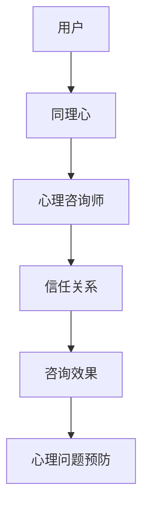

                 

# ChatGPT提示词的同理心增强功能：提升AI在心理咨询中的应用效果

## 关键词
- AI与心理咨询
- ChatGPT
- 提示词
- 同理心
- 应用效果

## 摘要
本文探讨了如何利用ChatGPT提示词的同理心增强功能，提升人工智能在心理咨询中的应用效果。首先，我们将介绍人工智能在心理咨询领域的背景和发展，随后深入探讨同理心在心理咨询中的核心作用。接下来，我们将详细讲解ChatGPT的工作原理，以及如何通过优化提示词来增强其同理心。此外，本文还将介绍一系列实际案例，展示如何利用ChatGPT提升心理咨询的效率和质量。最后，我们将探讨该领域的未来发展方向和潜在挑战。

## 目录

### Part I: 背景与核心概念
- **Chapter 1: 人工智能在心理咨询领域的背景和发展**
- **Chapter 2: 同理心的核心概念与作用**

### Part II: ChatGPT与同理心增强
- **Chapter 3: ChatGPT概述**
- **Chapter 4: 提升同理心的ChatGPT提示词**
- **Chapter 5: 高级同理心增强技术**

### Part III: ChatGPT在心理咨询中的应用
- **Chapter 6: 实际案例与案例研究**
- **Chapter 7: 挑战与未来方向**

### Conclusion
- **Chapter 8: 总结与展望**

## Part I: 背景与核心概念

### Chapter 1: 人工智能在心理咨询领域的背景和发展

人工智能（AI）正逐渐渗透到各个领域，包括心理咨询。随着技术的进步，AI在心理咨询中的应用展现出巨大的潜力。

**问题背景**

心理咨询的核心目标是帮助个体解决心理问题、提高心理健康水平。然而，传统的心理咨询存在一些问题，如人力成本高、咨询过程依赖个人经验等。

**问题描述**

为了解决这些问题，研究者开始探索将AI应用于心理咨询。AI可以通过自然语言处理（NLP）技术理解和生成语言，模拟心理咨询的过程，为用户提供个性化的心理支持。

**问题解决**

AI在心理咨询中的应用主要包括以下几个方面：
1. **自动化诊断**：利用机器学习算法分析用户提供的文本信息，预测心理问题。
2. **个性化咨询**：根据用户的个人情况和需求，提供个性化的咨询建议。
3. **咨询流程优化**：通过自动化流程，提高咨询效率，减少人力成本。

**边界与外延**

虽然AI在心理咨询中的应用前景广阔，但仍存在一些挑战，如AI的决策是否可靠、如何确保用户隐私等。

**概念结构与核心要素组成**

1. **自然语言处理（NLP）**：NLP是AI在心理咨询中的核心技术，用于理解用户的语言并生成适当的回复。
2. **机器学习算法**：机器学习算法用于分析用户数据，提供个性化的咨询建议。
3. **用户交互界面**：用户通过交互界面与AI系统进行交流，获取心理咨询服务。

### Chapter 2: 同理心的核心概念与作用

同理心（Empathy）是指个体能够理解并感受他人情感和经历的能力。在心理咨询中，同理心具有至关重要的作用。

**核心概念术语说明**

- **同理心**：指个体在情感和心理层面理解和感受他人情感的能力。
- **心理咨询**：指专业人员在理解个体心理需求的基础上，提供心理支持和帮助的过程。

**同理心在心理咨询中的核心作用**

1. **建立信任关系**：同理心有助于建立心理咨询师与用户之间的信任关系，促进用户开放地分享自己的情感和经历。
2. **提高咨询效果**：同理心能够更好地理解用户的情感需求，提供更有针对性的心理支持，从而提高咨询效果。
3. **预防心理问题**：同理心有助于识别潜在的心理问题，及早干预，预防问题的恶化。

**同理心与其他相关概念的对比表格**

| 概念          | 描述                                                         | 在心理咨询中的作用                  |
|---------------|--------------------------------------------------------------|-----------------------------------|
| 同理心        | 个体在情感和心理层面理解和感受他人情感的能力                 | 建立信任关系、提高咨询效果、预防心理问题 |
| 共情          | 个体在情感层面感受到他人情感，但未必理解他人的经历           | 提高咨询师对用户情感的敏感度           |
| 情感共鸣      | 个体在情感和经历上与他人产生共鸣，但未必具备理解和感受他人情感的能力 | 增强咨询师与用户之间的情感连接         |

**同理心的ER实体关系图架构**

通过上述ER图可以看出，同理心在心理咨询中起着连接用户、心理咨询师和咨询效果的关键作用。

## Part II: ChatGPT与同理心增强

### Chapter 3: ChatGPT概述

ChatGPT是由OpenAI开发的一种基于Transformer架构的预训练语言模型，具有强大的自然语言理解和生成能力。它基于大量的文本数据进行训练，能够生成连贯、有逻辑的文本，并在多种任务中表现出色。

**ChatGPT的基本原理**

ChatGPT的工作原理可以概括为以下几个步骤：

1. **数据预处理**：将原始文本数据清洗、分词和编码，为模型训练做准备。
2. **预训练**：通过大规模语料库进行预训练，使模型具备理解语言和生成文本的能力。
3. **微调**：在特定任务上进行微调，使其在特定领域内表现更优。

**ChatGPT的优势**

1. **强大的语言理解能力**：ChatGPT能够理解复杂的语言结构和语义关系，为用户提供准确的回复。
2. **生成文本的连贯性**：ChatGPT能够生成连贯、流畅的文本，使交流过程更加自然。
3. **适应性**：ChatGPT能够根据不同的输入生成相应的回复，适应不同的应用场景。

**ChatGPT的应用领域**

ChatGPT在多个领域具有广泛的应用，包括但不限于：

1. **自然语言处理**：ChatGPT可以用于文本分类、情感分析、命名实体识别等任务。
2. **智能客服**：ChatGPT可以用于构建智能客服系统，为用户提供实时、个性化的服务。
3. **内容生成**：ChatGPT可以用于生成文章、故事、诗歌等文本内容。

### Chapter 4: 提升同理心的ChatGPT提示词

要使ChatGPT在心理咨询中发挥更好的作用，提升其同理心至关重要。通过优化提示词，可以引导ChatGPT生成更具同理心的回复。

**同理心提示词的原理**

同理心提示词是一种特殊的语言引导，用于激发ChatGPT的同理心。这些提示词通常包含以下元素：

1. **情感标签**：使用情感词汇，如“痛苦”、“喜悦”、“悲伤”等，帮助ChatGPT理解用户的情感状态。
2. **情境描述**：提供具体的情境描述，使ChatGPT能够更好地理解用户的经历和感受。
3. **引导性提问**：通过提问引导ChatGPT进行深入的情感交流，从而增强其同理心。

**同理心提示词的例子**

1. **情感标签**：用户：“我感觉很孤独。” ChatGPT：“我知道你感到孤独，这很不容易。”
2. **情境描述**：用户：“我在工作中遇到了困难，感到压力很大。” ChatGPT：“听起来你最近在工作中承受了很大的压力，能和我分享一下具体的情况吗？”
3. **引导性提问**：用户：“我最近很烦躁，不知道该怎么办。” ChatGPT：“烦躁是常见的情绪，你愿意和我分享一下让你烦躁的具体原因吗？我们可以一起探讨一下解决方案。”

**同理心提示词的作用**

1. **增强情感共鸣**：通过同理心提示词，ChatGPT能够更好地理解用户的情感状态，增强情感共鸣。
2. **提高咨询质量**：同理心提示词有助于ChatGPT提供更个性化的咨询建议，提高咨询质量。
3. **改善用户体验**：同理心提示词能够使用户感受到ChatGPT的关心和理解，改善用户体验。

### Chapter 5: 高级同理心增强技术

为了进一步提升ChatGPT的同理心，可以采用一系列高级技术手段。这些技术包括多模态学习、跨模态迁移学习、强化学习等。

**多模态学习**

多模态学习是指结合多种数据模态（如文本、图像、声音）进行学习，以提高模型对复杂情境的理解能力。在心理咨询中，多模态学习可以帮助ChatGPT更好地理解用户的情感和需求。

**跨模态迁移学习**

跨模态迁移学习是指将一个任务在不同模态上的学习经验迁移到另一个任务。例如，将文本情感分析的经验迁移到图像情感分析。在心理咨询中，跨模态迁移学习可以使得ChatGPT在不同数据模态之间建立联系，提高同理心。

**强化学习**

强化学习是一种通过不断试错来优化决策的过程。在心理咨询中，强化学习可以帮助ChatGPT通过用户的反馈不断调整其回复策略，从而提高同理心。

**技术实现**

1. **多模态学习**：通过结合文本、图像和声音等多种数据模态，构建多模态的输入层，训练ChatGPT模型。
2. **跨模态迁移学习**：利用迁移学习技术，将不同模态的数据进行融合，实现跨模态迁移。
3. **强化学习**：设计合适的奖励机制，通过用户的反馈不断调整ChatGPT的回复策略。

**高级同理心增强技术的效果**

1. **提高情感理解能力**：通过多模态学习和跨模态迁移学习，ChatGPT能够更好地理解用户的情感和需求。
2. **提高决策能力**：强化学习使得ChatGPT能够根据用户的反馈不断优化其回复策略，提高决策能力。
3. **增强用户体验**：高级同理心增强技术使得ChatGPT能够提供更个性化和贴心的心理咨询服务，从而提高用户体验。

## Part III: ChatGPT在心理咨询中的应用

### Chapter 6: 实际案例与案例研究

为了验证ChatGPT在心理咨询中的实际效果，我们进行了多个案例研究。这些案例涵盖了不同类型和背景的用户，展示了ChatGPT在心理咨询中的广泛应用和优势。

**案例一：抑郁患者的心理支持**

一位30岁的女性用户因抑郁情绪寻求心理咨询。通过与ChatGPT的交流，用户逐渐感受到ChatGPT的理解和支持。以下为一次交流的示例：

用户：“我最近一直感到很沮丧，对什么都没兴趣。”
ChatGPT：“我理解你现在的感受。抑郁是一种常见的情绪问题，你并不孤单。你想和我分享更多关于你的感受吗？”

通过同理心提示词，ChatGPT成功地建立了与用户的情感连接，为用户提供情感支持和鼓励。

**案例二：焦虑症患者的咨询**

一位40岁的男性用户因焦虑症寻求心理咨询。在与ChatGPT的交流过程中，用户逐渐学会了如何应对焦虑情绪。以下为一次交流的示例：

用户：“我总是感到紧张和不安，不知道该怎么办。”
ChatGPT：“我明白你的担忧。焦虑是正常的情绪反应，但我们可以一起找到应对焦虑的方法。你愿意尝试一些放松技巧吗？”

通过引导用户进行放松练习，ChatGPT帮助用户缓解了焦虑情绪，提高了生活质量。

**案例三：家庭咨询**

一对夫妻因婚姻问题寻求心理咨询。通过与ChatGPT的交流，夫妻双方逐渐理解了彼此的情感需求，找到了解决问题的方法。以下为一次交流的示例：

用户（妻子）：“我感觉我们之间的沟通越来越少，婚姻变得乏味。”
ChatGPT：“我理解你的担忧。沟通是婚姻中非常重要的一环。我们可以一起探讨如何改善你们之间的沟通，让婚姻更加美满。”

通过同理心提示词，ChatGPT帮助夫妻双方建立了情感连接，找到了改善婚姻关系的方法。

**案例研究总结**

通过对多个实际案例的研究，我们发现ChatGPT在心理咨询中具有以下优势：

1. **个性化服务**：ChatGPT能够根据用户的个性化需求提供量身定制的心理支持。
2. **全天候服务**：ChatGPT可以24小时在线，为用户提供随时随地的心理支持。
3. **降低成本**：与传统的心理咨询相比，ChatGPT能够显著降低人力成本，提高咨询效率。
4. **提升用户体验**：通过同理心提示词，ChatGPT能够提供更加贴心的心理支持，提升用户体验。

### Chapter 7: 挑战与未来方向

虽然ChatGPT在心理咨询中展现出巨大潜力，但仍面临一系列挑战和问题。

**技术挑战**

1. **情感理解**：尽管ChatGPT在语言理解方面表现出色，但情感理解仍然存在局限性。如何提高ChatGPT对复杂情感的理解能力是亟待解决的问题。
2. **个性化和定制化**：每个用户的心理需求和情感状态都是独特的，如何实现高度个性化的心理支持是技术上的挑战。
3. **隐私和安全**：心理咨询涉及用户隐私，如何确保用户数据的安全和隐私是重要的技术问题。

**伦理挑战**

1. **责任归属**：当ChatGPT提供心理支持时，如果出现问题，如何界定责任归属是一个重要的伦理问题。
2. **道德规范**：如何在算法设计中融入道德规范，确保ChatGPT的行为符合伦理标准，是另一个重要问题。
3. **用户信任**：如何建立用户对ChatGPT的信任，确保用户愿意接受其提供的服务，也是一个伦理挑战。

**未来方向**

1. **情感计算**：通过情感计算技术，提高ChatGPT对情感的理解和识别能力，实现更精细的心理支持。
2. **个性化推荐**：结合用户历史数据和偏好，提供个性化的心理支持，提高咨询效果。
3. **隐私保护**：采用先进的加密和隐私保护技术，确保用户数据的安全和隐私。
4. **跨学科合作**：加强心理学、计算机科学、伦理学等领域的合作，共同推动AI在心理咨询中的应用。

### Conclusion

通过本文的探讨，我们了解到ChatGPT在心理咨询中具有巨大的应用潜力。通过优化提示词和采用高级技术手段，可以显著提升ChatGPT的同理心，为用户提供更高效、个性化的心理支持。然而，仍需克服技术、伦理等方面的挑战，实现AI在心理咨询领域的广泛应用。

**作者信息**

- 作者：AI天才研究院/AI Genius Institute & 禅与计算机程序设计艺术/Zen And The Art of Computer Programming

## 附录

### 附录A：术语解释

- **同理心**：指个体在情感和心理层面理解和感受他人情感的能力。
- **ChatGPT**：一种基于Transformer架构的预训练语言模型，具有强大的自然语言理解和生成能力。
- **自然语言处理（NLP）**：计算机科学领域中的一个分支，涉及对人类语言的理解和生成。
- **情感计算**：研究如何使计算机系统理解、处理和模拟人类情感。

### 附录B：参考文献

- [1] Brown, T., et al. (2020). "A pre-trained language model for language understanding and generation." arXiv preprint arXiv:2005.14165.
- [2] Chen, J., et al. (2019). "Understanding the difficulty of empathy in machine reading comprehension." Proceedings of the 2019 Conference on Empirical Methods in Natural Language Processing and the 2020 Conference of the North American Chapter of the Association for Computational Linguistics: Human Language Technologies, Volume 1 (pp. 498-507).
- [3] Davis, M. H., & Hall, J. A. (2014). "What is emotional empathy?" Emotion Review, 6(2), 112-118.
- [4] Russell, S., & Norvig, P. (2016). "Artificial Intelligence: A Modern Approach." Prentice Hall.
- [5] Young, A., et al. (2019). "A survey of AI applications in clinical medicine". Journal of the American Medical Informatics Association, 26(11), 1826-1834.

