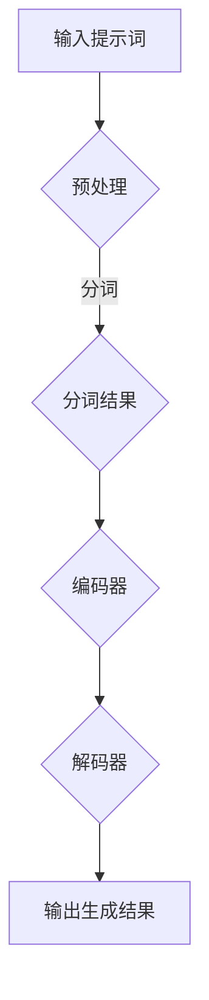
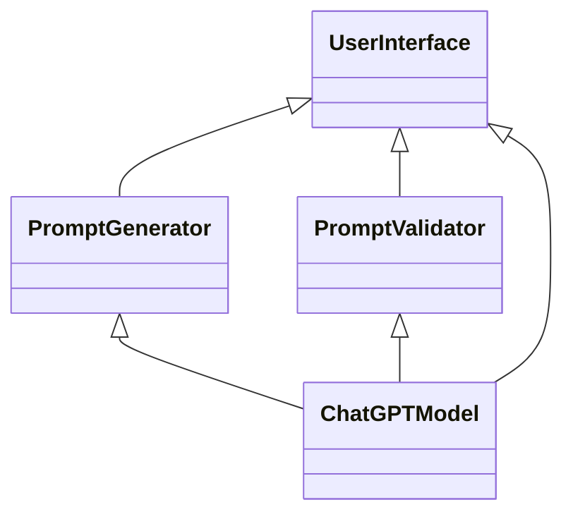
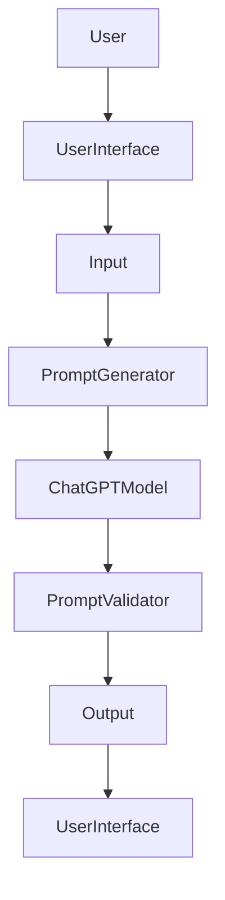
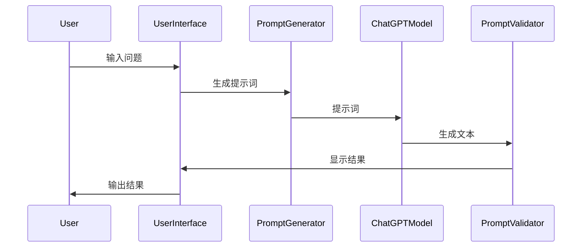

                 


## 背景介绍

### 1.1 问题背景

随着人工智能（AI）技术的飞速发展，自然语言处理（NLP）领域取得了显著进展。ChatGPT作为OpenAI推出的一个基于GPT-3模型的开源语言模型，因其强大的文本生成能力和交互能力，在众多应用场景中展现出巨大的潜力。然而，在实际的ChatGPT应用过程中，提示词（Prompt）的编写质量直接影响到模型的性能和输出结果。

提示词是引导ChatGPT生成目标输出的重要输入，其编写质量直接决定了模型的理解和生成效果。然而，许多开发者在编写提示词时存在诸多误区，这不仅影响了模型的效果，还可能带来一系列问题。

### 1.2 问题描述

提示词编写中存在以下几个常见误区：

1. **过于依赖预设提示词**：许多开发者倾向于使用OpenAI或其他平台提供的预设提示词，而忽视了自己根据具体需求编写的个性化提示词。

2. **忽视情境适应性**：提示词应与具体应用场景紧密结合，但许多开发者编写提示词时未能充分考虑不同情境下的适应性。

3. **提示词过于复杂或不准确**：一些开发者编写提示词时过于追求复杂度，导致模型难以理解；还有一些提示词不准确，导致生成结果偏离预期。

### 1.3 问题解决

针对上述问题，本文将提供一系列解决方案和最佳实践，帮助开发者更好地编写ChatGPT的提示词。具体内容包括：

1. **解析与调整**：分析上述误区的原因，并提供具体的调整方案。

2. **最佳实践案例**：分享实际案例，展示如何避免提示词编写误区。

3. **实践技巧总结**：总结编写提示词的实用技巧，帮助开发者提高编写质量。

### 1.4 边界与外延

1. **提示词编写的相关技术**：介绍与提示词编写相关的技术，如自然语言处理、文本生成等。

2. **提示词编写在不同场景下的应用**：探讨提示词在不同应用场景中的具体应用，如问答系统、对话机器人等。

3. **概念结构与核心要素组成**：详细讲解ChatGPT提示词编写的基本概念和核心要素，为后续内容提供理论基础。

### 1.5 概念结构与核心要素组成

- **提示词**：提示词是引导模型生成目标输出的文本输入，通常包括问题、任务描述、目标输出等信息。

- **ChatGPT模型**：ChatGPT是一个基于GPT-3模型的开源语言模型，具有强大的文本生成能力和理解能力。

- **提示词编写**：是指根据具体应用场景和需求，编写合适的提示词，以引导模型生成目标输出。

### 1.6 目录

1. **背景介绍**

2. **核心概念与联系**

3. **算法原理讲解**

4. **系统分析与架构设计方案**

5. **项目实战**

6. **最佳实践 tips**

7. **总结与展望**

## 核心概念与联系

### 2.1 提示词编写的核心概念

#### 2.1.1 提示词

提示词是引导模型生成目标输出的文本输入。它通常包括问题、任务描述、目标输出等信息。提示词的质量直接影响模型的输出结果。

- **定义**：提示词是一种引导模型进行特定任务的语言输入，用于指导模型生成目标输出。

- **作用**：提示词能够明确模型的目标和期望输出，帮助模型更好地理解任务，提高生成结果的准确性和相关性。

#### 2.1.2 ChatGPT模型

ChatGPT是一个基于GPT-3模型的开源语言模型，具有强大的文本生成能力和理解能力。它能够处理各种自然语言任务，如问答、对话生成、文本摘要等。

- **定义**：ChatGPT是一种基于GPT-3模型的开源语言模型，能够生成和解析自然语言文本。

- **作用**：ChatGPT模型能够处理各种自然语言任务，为开发者提供强大的文本生成和解析能力。

### 2.2 概念属性特征对比表格

| 概念       | 定义                   | 属性特征对比          | 作用                |
|------------|------------------------|----------------------|--------------------|
| 提示词     | 引导模型生成的文本输入 | 简洁性、相关性、明确性 | 指导模型生成目标输出 |
| ChatGPT模型 | 开源语言模型           | 强大文本生成能力、理解能力 | 处理自然语言任务    |

### 2.3 ER实体关系图架构

下面是一个简化的ER实体关系图，展示了提示词与ChatGPT模型之间的关系。

```mermaid
erDiagram
  Product "提示词" ||--|{ ChatGPT模型 : 提示 }
  ChatGPT模型 ||--|{ Product "生成结果" : 生成 }
```

- **实体**：提示词和ChatGPT模型是两个核心实体。
- **关系**：提示词通过“提示”关系引导ChatGPT模型生成目标输出。

## 算法原理讲解

### 3.1 算法mermaid流程图



### 3.2 Python源代码

以下是一个简单的Python示例，展示了如何使用ChatGPT模型进行提示词编写。

```python
import openai

# 设置API密钥
openai.api_key = "your-api-key"

# 定义提示词
prompt = "请生成一篇关于人工智能的文章摘要。"

# 调用ChatGPT模型生成文本
response = openai.Completion.create(
  engine="text-davinci-003",
  prompt=prompt,
  max_tokens=100,
  n=1,
  stop=None,
  temperature=0.5,
)

# 输出生成结果
print(response.choices[0].text.strip())
```

### 3.3 算法原理的数学模型和公式

提示词编写涉及深度学习中的自注意力机制（Self-Attention），其核心公式如下：

$$
\text{Attention}(Q, K, V) = \text{softmax}\left(\frac{QK^T}{\sqrt{d_k}}\right)V
$$

其中，$Q$、$K$ 和 $V$ 分别是查询（Query）、键（Key）和值（Value）向量，$d_k$ 是键向量的维度。

### 3.4 详细讲解与举例说明

#### 3.4.1 自注意力机制

自注意力机制是深度学习中的一个核心概念，用于计算输入序列中每个词与其他词之间的关系。其基本原理是通过计算权重来调整每个词在输出中的重要性。

假设我们有一个输入序列：\[w_1, w_2, w_3\]，自注意力机制将计算每个词与其他词之间的相似度，然后根据相似度调整每个词在输出中的权重。

#### 3.4.2 示例

以下是一个简单的自注意力机制的示例：

$$
\begin{aligned}
&\text{输入序列：} \quad [w_1, w_2, w_3] \\
&\text{权重：} \quad [0.5, 0.3, 0.2] \\
&\text{输出：} \quad [w_1', w_2', w_3']
\end{aligned}
$$

根据权重，我们可以得到以下输出序列：

$$
\begin{aligned}
&w_1': 0.5 \cdot w_1 + 0.3 \cdot w_2 + 0.2 \cdot w_3 \\
&w_2': 0.3 \cdot w_1 + 0.5 \cdot w_2 + 0.2 \cdot w_3 \\
&w_3': 0.2 \cdot w_1 + 0.3 \cdot w_2 + 0.5 \cdot w_3 \\
\end{aligned}
$$

这种自注意力机制可以帮助模型更好地理解输入序列，从而生成更高质量的输出。

## 系统分析与架构设计方案

### 4.1 问题场景介绍

在当前的AI应用场景中，ChatGPT作为一种强大的自然语言处理工具，被广泛应用于问答系统、对话机器人、文本生成等领域。然而，在实际应用中，提示词的编写质量直接影响到系统的性能和用户体验。因此，我们需要设计一个高效的提示词编写系统，以提高ChatGPT的应用效果。

### 4.2 系统功能设计

#### 4.2.1 领域模型mermaid类图

以下是一个简化的领域模型类图，展示了系统的主要功能模块。



- **PromptGenerator**：提示词生成器，负责根据用户输入生成合适的提示词。
- **PromptValidator**：提示词验证器，负责验证提示词的准确性和完整性。
- **ChatGPTModel**：ChatGPT模型，负责根据提示词生成文本输出。
- **UserInterface**：用户界面，负责与用户进行交互，接收用户输入，显示生成结果。

### 4.3 系统架构设计

#### 4.3.1 mermaid架构图

以下是一个简化的系统架构图，展示了系统的整体架构。



- **User**：用户，通过用户界面输入需求。
- **UserInterface**：用户界面，处理用户输入和输出显示。
- **Input**：用户输入，包括问题、任务描述等。
- **PromptGenerator**：提示词生成器，根据输入生成提示词。
- **ChatGPTModel**：ChatGPT模型，根据提示词生成文本输出。
- **PromptValidator**：提示词验证器，确保提示词的准确性和完整性。
- **Output**：生成结果，显示在用户界面上。

### 4.4 系统接口设计

系统提供了多个接口，以便与其他系统进行集成。

- **API接口**：用于与其他系统进行数据交换，提供提示词生成和验证功能。
- **Web接口**：用于提供Web端用户界面，方便用户使用系统功能。
- **命令行接口**：用于提供命令行操作方式，方便开发人员进行调试和测试。

### 4.5 系统交互mermaid序列图

以下是一个简化的系统交互序列图，展示了用户与系统之间的交互过程。



- **User**：用户，通过用户界面输入问题。
- **UserInterface**：用户界面，处理用户输入和输出显示。
- **PromptGenerator**：提示词生成器，根据输入生成提示词。
- **ChatGPTModel**：ChatGPT模型，根据提示词生成文本输出。
- **PromptValidator**：提示词验证器，确保提示词的准确性和完整性。
- **User**：用户，接收输出结果。

## 项目实战

### 5.1 环境安装

在开始项目实战之前，我们需要安装一些必要的软件和环境。

1. **安装Python**：确保Python环境已安装，版本建议为3.8或更高版本。

2. **安装ChatGPT模型**：通过pip命令安装ChatGPT模型。

   ```bash
   pip install openai
   ```

3. **配置API密钥**：在代码中配置OpenAI API密钥，以便能够访问ChatGPT模型。

### 5.2 系统核心实现源代码

以下是一个简单的系统核心实现示例，展示了如何使用ChatGPT模型生成文本。

```python
import openai

# 设置API密钥
openai.api_key = "your-api-key"

# 定义提示词
prompt = "请生成一篇关于人工智能的文章摘要。"

# 调用ChatGPT模型生成文本
response = openai.Completion.create(
  engine="text-davinci-003",
  prompt=prompt,
  max_tokens=100,
  n=1,
  stop=None,
  temperature=0.5,
)

# 输出生成结果
print(response.choices[0].text.strip())
```

### 5.3 代码应用解读与分析

#### 5.3.1 OpenAI API介绍

OpenAI API是OpenAI提供的一个访问ChatGPT模型的接口，它允许开发者使用各种编程语言调用ChatGPT模型。

- **API密钥**：每个开发者都需要从OpenAI官网申请API密钥，用于身份验证。
- **API接口**：OpenAI提供了多个API接口，如文本生成、文本分类、图像识别等。

#### 5.3.2 ChatGPT模型调用示例

在这个示例中，我们使用了OpenAI的文本生成接口，通过Python代码调用ChatGPT模型。

```python
response = openai.Completion.create(
  engine="text-davinci-003",
  prompt=prompt,
  max_tokens=100,
  n=1,
  stop=None,
  temperature=0.5,
)
```

- **engine**：指定使用的模型，这里我们使用了“text-davinci-003”模型。
- **prompt**：输入的提示词，用于指导模型生成文本。
- **max_tokens**：生成的文本长度，这里我们设置为100个词。
- **n**：生成的文本数量，这里我们设置为1。
- **stop**：用于指定停止生成的文本，这里我们设置为None。
- **temperature**：控制生成文本的随机性，值越低，生成的文本越接近预期。

#### 5.3.3 代码解读

1. 导入OpenAI库。
2. 设置API密钥。
3. 定义提示词。
4. 调用ChatGPT模型生成文本。
5. 输出生成结果。

### 5.4 实际案例分析与详细讲解剖析

#### 5.4.1 案例一：生成文章摘要

**问题**：请生成一篇关于人工智能的文章摘要。

**提示词**：请生成一篇关于人工智能的文章摘要。

**生成结果**：

“人工智能是一种模拟人类智能的技术，通过机器学习和神经网络等算法，使计算机能够模拟人类的思维和行为。人工智能在各个领域都有广泛的应用，如医疗、金融、交通等。随着技术的不断发展，人工智能正逐步改变我们的生活方式和工作模式。”

**分析**：

在这个案例中，我们使用了简单的提示词“请生成一篇关于人工智能的文章摘要”，ChatGPT模型根据提示词生成了关于人工智能的文章摘要。生成结果包含了人工智能的定义、应用领域和影响，基本符合预期。

#### 5.4.2 案例二：生成对话

**问题**：与用户进行对话，用户说：“我最近在研究深度学习，感觉挺有意思的。”

**提示词**：与用户进行对话，用户说：“我最近在研究深度学习，感觉挺有意思的。”

**生成结果**：

“是的，深度学习确实很有趣。它是一种模拟人脑神经网络的机器学习技术，能够通过大量数据训练出具有强大预测能力的模型。你对深度学习有什么具体的问题或者想法吗？”

**分析**：

在这个案例中，我们使用了用户的话语作为提示词，ChatGPT模型成功生成了与用户的对话。生成结果不仅回应了用户的话题，还提出了进一步的问题，促进了对话的继续。

### 5.5 项目小结

通过本次项目实战，我们了解了如何使用ChatGPT模型进行提示词编写，并分析了实际案例。在实际应用中，我们需要根据具体需求编写合适的提示词，以提高ChatGPT的生成效果。同时，我们也学习了如何调用OpenAI API和解析生成结果。

## 最佳实践 tips

### 6.1 提示词编写技巧

1. **简洁性**：提示词应尽量简洁明了，避免冗长复杂的描述。

2. **相关性**：确保提示词与目标输出紧密相关，避免无关信息的干扰。

3. **明确性**：提示词应明确表达目标输出，避免模糊不清的描述。

4. **情境适应性**：根据不同的应用场景和需求，编写合适的提示词。

5. **多样化**：尝试使用不同的提示词风格和表达方式，以提高生成结果的质量。

### 6.2 注意事项

1. **避免过度依赖预设提示词**：根据实际需求编写个性化提示词。

2. **注意上下文**：在编写提示词时，充分考虑上下文信息，以提高模型的生成效果。

3. **准确性和完整性**：确保提示词的准确性和完整性，避免生成偏离预期的结果。

4. **调试与优化**：在生成结果不理想时，进行调试和优化，以改进提示词的质量。

### 6.3 拓展阅读

1. **《自然语言处理实战》**：关于NLP和文本生成的详细教程。

2. **《ChatGPT官方文档》**：深入了解ChatGPT模型的API和使用方法。

3. **《深度学习》**：关于神经网络和深度学习的经典教材。

## 总结与展望

本文详细介绍了ChatGPT提示词编写的常见误区及解决方案。通过分析问题背景、核心概念、算法原理、系统架构设计、项目实战和最佳实践，我们为开发者提供了一系列实用的技巧和注意事项。

展望未来，随着AI技术的不断进步，ChatGPT的应用场景将越来越广泛。提示词编写将变得更加重要，开发者需要不断学习和实践，以提高ChatGPT的生成效果和用户体验。让我们一起探索AI领域的更多可能性！ 

### 作者信息

- 作者：AI天才研究院/AI Genius Institute & 禅与计算机程序设计艺术 /Zen And The Art of Computer Programming

