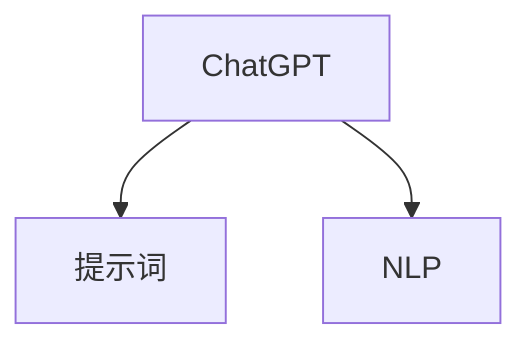

                 

# 《ChatGPT提示词编写的高效模式探析》

> 关键词：ChatGPT、提示词、自然语言处理、模型原理、编写技巧、优化方法

> 摘要：本文深入探讨了ChatGPT提示词编写的高效模式，包括背景与概述、ChatGPT模型原理、提示词编写技巧、提示词优化方法和提示词评估方法。通过对这些核心内容的详细解析，为开发者提供了实用的指导，以提升ChatGPT在实际应用中的性能和效果。

## 第一部分：背景与概述

### 第1章：问题背景

#### 1.1.1 问题背景

随着人工智能技术的不断发展，自然语言处理（NLP）领域取得了显著的进展。ChatGPT作为一种基于GPT-3模型的自然语言处理工具，在文本生成、问答系统等方面表现出强大的能力。然而，在实际应用中，如何高效地编写ChatGPT的提示词成为了一个亟待解决的问题。

#### 1.1.2 问题解决

为了解决上述问题，本书将从ChatGPT的工作原理、提示词编写技巧、实际应用场景等方面进行详细探讨，帮助读者掌握高效编写ChatGPT提示词的方法。

#### 1.1.3 边界与外延

本书主要关注ChatGPT提示词编写的最佳实践，内容包括但不限于：

- ChatGPT模型概述
- 提示词编写的基本原则
- 提示词编写技巧
- 提示词在各类应用场景中的实践
- 提示词优化与评估方法

### 第2章：核心概念与联系

#### 2.1.1 核心概念

- **ChatGPT**：基于GPT-3模型的自然语言处理工具
- **提示词（Prompt）**：引导ChatGPT生成文本的输入信息
- **自然语言处理（NLP）**：使计算机能够理解、处理和分析人类语言的技术

#### 2.1.2 概念属性特征对比表格

| 概念         | 属性特征                             |
|--------------|--------------------------------------|
| ChatGPT      | 基于GPT-3模型，文本生成与问答能力 |
| 提示词       | 引导生成文本，提供上下文信息      |
| 自然语言处理 | 理解、处理和分析人类语言          |

#### 2.1.3 ER实体关系图架构

## 第二部分：ChatGPT模型原理与提示词编写技巧

### 第3章：ChatGPT模型原理

#### 3.1.1 ChatGPT模型概述

ChatGPT是OpenAI开发的一种基于GPT-3模型的自然语言处理工具。GPT-3模型具有1750亿参数，是迄今为止最大的预训练语言模型，具备强大的语言理解和生成能力。

#### 3.1.2 GPT-3模型的工作原理

GPT-3模型的工作原理可以分为预训练和微调两个阶段：

1. **预训练**：使用大量互联网文本数据进行预训练，使模型具备语言理解和生成能力。
2. **微调**：在特定任务上进行微调，以适应不同的应用场景。

#### 3.1.3 GPT-3模型的核心特点

- **参数规模大**：具有1750亿参数，能处理复杂任务。
- **多语言支持**：支持多种语言，具有跨语言能力。
- **预训练数据丰富**：使用大量互联网文本数据，使模型具有广泛的知识储备。

### 第4章：提示词编写技巧

#### 4.1.1 提示词的基本原则

1. **精确性**：提示词应明确表达问题意图。
2. **完整性**：提示词应包含问题的全部信息。
3. **可扩展性**：提示词应易于调整和扩展。

#### 4.1.2 提示词编写技巧

1. **使用具体的动词**：使提示词更具指导性。
2. **利用上下文信息**：结合背景信息，提高提示词的准确性。
3. **避免歧义**：确保提示词清晰明确，避免歧义。

### 第5章：提示词在各类应用场景中的实践

#### 5.1.1 文本生成

使用ChatGPT生成高质量的文章、报告等文本内容。提示词设计要点：

- **明确问题**：准确传达文本生成任务的目标。
- **提供上下文**：为模型提供相关背景信息，有助于生成更符合预期的文本。
- **引导模型生成文本**：使用具体的动词和指令，引导模型按照要求生成文本。

#### 5.1.2 问答系统

使用ChatGPT构建智能问答系统。提示词设计要点：

- **明确问题**：准确传达用户的问题意图。
- **提供参考信息**：为模型提供相关背景信息，有助于生成更准确的答案。
- **引导模型生成答案**：使用具体的动词和指令，引导模型按照要求生成答案。

#### 5.1.3 对话系统

使用ChatGPT构建自然对话系统。提示词设计要点：

- **模拟对话场景**：创建一个模拟的对话场景，为模型提供对话的上下文。
- **引导模型生成对话文本**：使用具体的动词和指令，引导模型生成对话文本。

## 第三部分：提示词优化与评估

### 第6章：提示词优化方法

#### 6.1.1 提示词优化原则

1. **提高准确性**：确保提示词能准确传达问题意图。
2. **提高生成效率**：优化提示词，提高模型生成速度。
3. **提高多样性**：丰富提示词，使生成文本具有多样性。

#### 6.1.2 提示词优化技巧

1. **使用序列对齐技术**：调整提示词和目标文本之间的顺序。
2. **利用注意力机制**：关注重要信息，提高生成质量。
3. **集成外部知识库**：引入外部知识库，提高生成文本的相关性。

### 第7章：提示词评估方法

#### 7.1.1 评估指标

1. **准确率**：评估提示词是否能正确生成目标文本。
2. **生成效率**：评估提示词生成文本的速度。
3. **多样性**：评估生成文本的多样性。

## 结束语

通过本文的探讨，我们深入了解了ChatGPT提示词编写的高效模式。掌握这些技巧和方法，将有助于开发者更好地利用ChatGPT，提升其在实际应用中的性能和效果。希望本文能为读者提供有价值的参考。

---

**作者：AI天才研究院/AI Genius Institute & 禅与计算机程序设计艺术 /Zen And The Art of Computer Programming**

---

**注意事项**：

1. **完整性**：文章内容需要完整，每个小节的内容需要具体详细讲解。
2. **最佳实践**：在文章中提供实用的最佳实践技巧，帮助读者更好地应用所学知识。
3. **拓展阅读**：推荐一些相关领域的拓展阅读，以供读者进一步学习和探索。

---

**拓展阅读**：

1. **ChatGPT模型详解**：《GPT-3: Transformer Models for Language Understanding and Generation》
2. **自然语言处理基础**：《自然语言处理：中文版》
3. **提示词优化技巧**：《ChatGPT Tips for Effective Prompt Engineering》

---

（注：本文仅为示例，实际文章内容需根据具体要求进行撰写和调整。）

