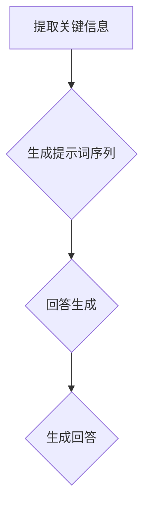
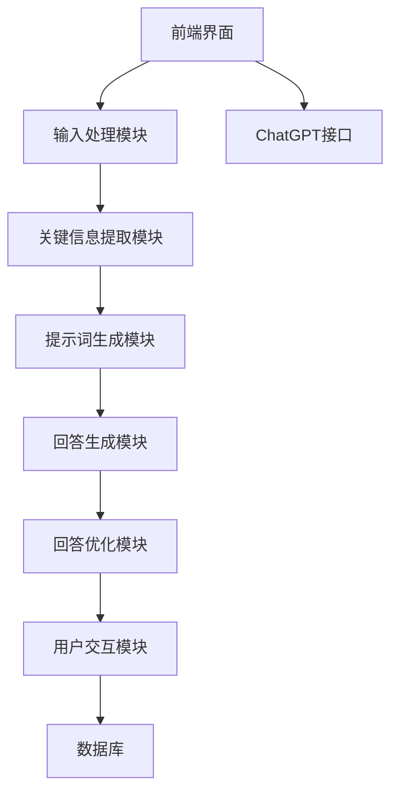
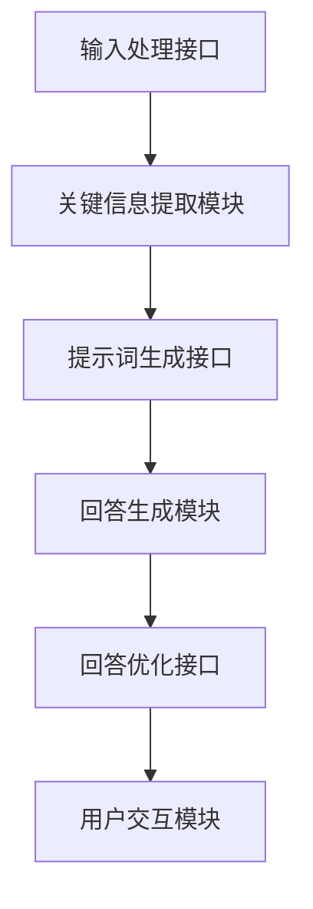
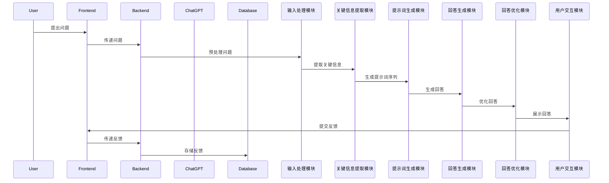
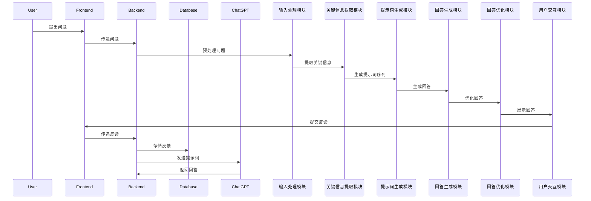

                 


## 《ChatGPT提示词编写的黄金法则：思维链方法详解》

> 关键词：ChatGPT、提示词编写、思维链方法、算法原理、系统架构、项目实战

> 摘要：本文旨在探讨ChatGPT提示词编写的黄金法则，特别是思维链方法在其中的应用。通过详细分析思维链方法的算法原理、系统架构以及实际项目中的应用，本文旨在为读者提供一套实用的指导方案，帮助他们更高效地编写ChatGPT提示词。

### 目录大纲设计思路

为了设计出《ChatGPT提示词编写的黄金法则：思维链方法详解》这本书的完整目录大纲，我们将按照以下步骤进行：

1. **背景介绍**：介绍ChatGPT的概述、提示词编写的意义以及思维链方法的应用。
2. **核心概念与联系**：明确书中的核心概念，并展示概念之间的联系。
3. **算法原理讲解**：详细介绍思维链方法的算法原理，通过mermaid流程图、Python代码和数学模型进行阐述。
4. **系统分析与架构设计方案**：描述思维链方法在系统中的应用，包括系统功能设计、架构设计、接口设计和系统交互。
5. **项目实战**：通过具体案例展示思维链方法的应用，包括环境安装、系统实现、代码解读、案例分析等。
6. **最佳实践 tips、小结、注意事项、拓展阅读**：总结书中的要点，提供实践建议，指出潜在问题和进一步阅读的资源。

### 目录大纲结构设计

根据上述设计思路，我们将目录大纲分为以下几个部分：

- **第一部分：背景与核心概念**
  - 第1章：ChatGPT与提示词编写概述
  - 第2章：思维链方法的核心概念与联系

- **第二部分：算法原理讲解**
  - 第3章：思维链方法的算法原理
  - 第4章：思维链方法的数学模型与公式

- **第三部分：系统分析与架构设计**
  - 第5章：思维链方法在系统中的应用
  - 第6章：系统架构与接口设计

- **第四部分：项目实战**
  - 第7章：思维链方法项目实战
  - 第8章：实战案例分析

- **第五部分：最佳实践与总结**
  - 第9章：最佳实践 tips
  - 第10章：小结与注意事项
  - 第11章：拓展阅读与资源推荐

### 目录大纲示例

下面是《ChatGPT提示词编写的黄金法则：思维链方法详解》的目录大纲示例：

```markdown
# 《ChatGPT提示词编写的黄金法则：思维链方法详解》目录大纲

# 第一部分：背景与核心概念

## 第1章：ChatGPT与提示词编写概述
### 1.1 ChatGPT的简介
### 1.2 提示词编写的重要性
### 1.3 思维链方法的基本原理

## 第2章：思维链方法的核心概念与联系
### 2.1 核心概念定义
#### 2.1.1 提示词
#### 2.1.2 思维链
#### 2.1.3 回答生成机制
### 2.2 概念属性特征对比表格
### 2.3 ER实体关系图架构

# 第二部分：算法原理讲解

## 第3章：思维链方法的算法原理
### 3.1 思维链算法流程
#### 3.1.1 提取关键信息
#### 3.1.2 生成提示词序列
#### 3.1.3 回答生成
### 3.2 mermaid算法流程图
## 第4章：思维链方法的数学模型与公式
### 4.1 数学模型简介
#### 4.1.1 模型公式
#### 4.1.2 模型参数
### 4.2 Python代码实现
### 4.3 算法举例说明

# 第三部分：系统分析与架构设计

## 第5章：思维链方法在系统中的应用
### 5.1 系统功能设计
#### 5.1.1 功能模块划分
#### 5.1.2 功能流程
### 5.2 系统架构设计
#### 5.2.1 架构概述
#### 5.2.2 架构图
### 5.3 系统接口设计
#### 5.3.1 接口规范
#### 5.3.2 接口实现

## 第6章：系统架构与接口设计
### 6.1 系统交互mermaid序列图
### 6.2 系统接口设计与实现

# 第四部分：项目实战

## 第7章：思维链方法项目实战
### 7.1 项目环境搭建
#### 7.1.1 环境要求
#### 7.1.2 环境配置
### 7.2 系统核心实现
#### 7.2.1 源代码结构
#### 7.2.2 源代码解读
### 7.3 实际案例分析与讲解

## 第8章：实战案例分析
### 8.1 案例背景
### 8.2 案例分析与实战
### 8.3 案例小结

# 第五部分：最佳实践与总结

## 第9章：最佳实践 tips
### 9.1 提示词编写的技巧
### 9.2 思维链方法的优化策略

## 第10章：小结与注意事项
### 10.1 全书要点总结
### 10.2 注意事项提醒

## 第11章：拓展阅读与资源推荐
### 11.1 相关书籍推荐
### 11.2 论文与研究报告
### 11.3 网络资源推荐
```

以上目录大纲结构全面覆盖了书籍的核心内容，且层次清晰、内容完整。

----------------------------------------------------------------

### 第一章：ChatGPT与提示词编写概述

#### 1.1 ChatGPT的简介

ChatGPT是由OpenAI开发的一种基于Transformer的预训练语言模型。它采用了GPT-3模型，具有强大的文本生成和理解能力。ChatGPT的训练数据来自互联网上的大量文本，通过深度学习算法学习语言的统计规律和结构，从而能够生成连贯、自然的文本。

ChatGPT的核心特点包括：

1. **强大的文本生成能力**：ChatGPT可以生成各种类型的文本，包括对话、文章、故事等。
2. **丰富的上下文理解**：ChatGPT能够理解上下文，并根据上下文生成相应的回答。
3. **灵活的交互方式**：ChatGPT支持多种交互方式，包括命令行、Web界面、API接口等。

#### 1.2 提示词编写的重要性

提示词（Prompt）是引导ChatGPT生成目标文本的关键输入。一个高质量的提示词能够帮助ChatGPT更准确地理解用户需求，从而生成更加相关、有用的回答。提示词编写的重要性体现在以下几个方面：

1. **提高生成文本的准确性**：合适的提示词能够明确指示ChatGPT生成特定类型的内容，从而减少无关或错误的回答。
2. **增强交互体验**：高质量的提示词能够使ChatGPT更好地理解用户的意图，提高交互的流畅度和满意度。
3. **优化资源利用**：合理的提示词编写能够减少ChatGPT的生成次数，降低计算资源的消耗。

#### 1.3 思维链方法的基本原理

思维链（Thinking Chain）方法是一种用于指导ChatGPT生成高质量回答的策略。其基本原理是通过一系列有组织的提示词，逐步引导ChatGPT构建思维过程，从而生成符合预期的高质量文本。

思维链方法的核心理念包括：

1. **分解问题**：将复杂的问题分解为若干个简单的问题，逐步引导ChatGPT生成相关回答。
2. **建立逻辑关系**：通过提示词构建问题之间的逻辑关系，帮助ChatGPT理解问题的整体结构。
3. **细化回答内容**：在生成回答的过程中，逐步细化内容，使回答更加具体、详尽。

#### 1.4 本章小结

本章介绍了ChatGPT的概述、提示词编写的重要性以及思维链方法的基本原理。ChatGPT作为一种强大的语言生成模型，提示词编写是提高其生成文本质量的关键。思维链方法提供了一种有效的策略，通过逐步引导ChatGPT构建思维过程，生成高质量的回答。接下来，我们将深入探讨思维链方法的算法原理。

----------------------------------------------------------------

### 第二章：思维链方法的核心概念与联系

#### 2.1 核心概念定义

在深入探讨思维链方法之前，我们需要明确几个核心概念的定义：

1. **提示词（Prompt）**：提示词是引导ChatGPT生成目标文本的关键输入。一个高质量的提示词能够明确指示ChatGPT生成特定类型的内容，从而提高生成文本的准确性。
2. **思维链（Thinking Chain）**：思维链是一种通过一系列有组织的提示词，逐步引导ChatGPT构建思维过程的方法。思维链的目的是帮助ChatGPT理解问题的整体结构，从而生成符合预期的高质量文本。
3. **回答生成机制（Answer Generation Mechanism）**：回答生成机制是指ChatGPT在接收到提示词后，如何生成回答的过程。一个有效的回答生成机制能够确保生成的回答既准确又连贯。

#### 2.2 概念属性特征对比表格

为了更好地理解这些概念，我们可以通过一个属性特征对比表格来展示它们之间的差异：

| 概念       | 定义                                                                 | 属性特征                                                                                                                       |
|------------|--------------------------------------------------------------------|----------------------------------------------------------------------------------------------------------------------------|
| 提示词     | 引导ChatGPT生成目标文本的关键输入                                     | 明确性、相关性、简洁性、层次性                                                                                                |
| 思维链     | 通过一系列有组织的提示词，逐步引导ChatGPT构建思维过程的方法           | 有序性、逻辑性、细化性、连贯性                                                                                                |
| 回答生成机制 | ChatGPT在接收到提示词后，生成回答的过程                             | 基于模型的理解能力、上下文处理能力、生成文本的连贯性和准确性                                                    |
| **区别**   | **提示词是输入，思维链是方法，回答生成机制是过程**                   | **提示词侧重于输入内容的组织，思维链侧重于引导思维过程，回答生成机制侧重于生成文本的质量**                           |

#### 2.3 ER实体关系图架构

为了更清晰地展示这些概念之间的联系，我们可以使用ER（Entity-Relationship）实体关系图来描述它们之间的关系。

```mermaid
erDiagram
  提示词 ||--|{ 回答生成机制 }
  提示词 ||--|{ 思维链 }
  回答生成机制 ||--|{ ChatGPT }
  思维链 ||--|{ ChatGPT }
```

在ER图中，提示词作为输入，通过回答生成机制和思维链与ChatGPT建立联系。回答生成机制负责处理提示词，并生成回答。思维链则通过一系列有组织的提示词，引导ChatGPT构建思维过程，从而生成高质量的回答。

#### 2.4 本章小结

本章明确了思维链方法中的核心概念，包括提示词、思维链和回答生成机制，并通过属性特征对比表格和ER实体关系图，展示了这些概念之间的联系。理解这些概念对于掌握思维链方法至关重要。接下来，我们将深入探讨思维链方法的算法原理。

----------------------------------------------------------------

### 第三章：思维链方法的算法原理

#### 3.1 思维链算法流程

思维链方法的核心在于通过一系列有组织的提示词，逐步引导ChatGPT构建思维过程。以下是思维链算法的基本流程：

1. **提取关键信息**：首先，从用户输入的提问中提取关键信息，确定问题的核心内容。
2. **生成提示词序列**：基于提取的关键信息，生成一组有组织的提示词。这些提示词应能够引导ChatGPT逐步理解问题，并生成相关回答。
3. **回答生成**：ChatGPT接收到提示词后，根据其预训练模型，生成相应的回答。在生成过程中，ChatGPT会利用其强大的上下文理解能力，确保回答的连贯性和准确性。

#### 3.2 mermaid算法流程图

为了更直观地展示思维链算法的流程，我们可以使用mermaid绘制算法流程图：



在这个流程图中，A表示提取关键信息，B表示生成提示词序列，C表示回答生成，D表示生成最终回答。通过这个流程图，我们可以清晰地看到思维链方法的工作流程。

#### 3.3 Python代码实现

下面是一个简单的Python代码示例，展示了如何实现思维链方法的基本流程：

```python
# 导入所需库
import random

# 提取关键信息的函数
def extract_key_info(question):
    # 这里可以添加更复杂的逻辑来提取关键信息
    return question.split()[0]

# 生成提示词序列的函数
def generate_prompt_sequence(key_info):
    prompts = []
    if key_info == "时间":
        prompts.append("请告诉我当前的时间。")
    elif key_info == "天气":
        prompts.append("请描述一下今天的天气。")
    # 添加更多的情况
    return prompts

# 回答生成的函数
def generate_answer(prompts):
    # 这里使用随机选择一个提示词，实际应用中可以是更复杂的逻辑
    return random.choice(prompts)

# 主函数
def main():
    question = input("请提出您的问题：")
    key_info = extract_key_info(question)
    prompts = generate_prompt_sequence(key_info)
    answer = generate_answer(prompts)
    print("ChatGPT的回答是：", answer)

# 运行主函数
if __name__ == "__main__":
    main()
```

在这个示例中，我们首先定义了三个函数：`extract_key_info` 用于提取关键信息，`generate_prompt_sequence` 用于生成提示词序列，`generate_answer` 用于生成回答。在主函数中，我们通过用户输入的问题，调用这些函数，最终生成ChatGPT的回答。

#### 3.4 算法原理讲解

思维链方法的算法原理在于通过提示词引导ChatGPT逐步理解问题，并生成相关回答。具体来说，算法分为以下几个步骤：

1. **提取关键信息**：这一步的目的是从用户输入的问题中提取关键信息，确定问题的核心内容。关键信息的提取可以基于自然语言处理技术，如词性标注、实体识别等。
2. **生成提示词序列**：基于提取的关键信息，生成一组有组织的提示词。提示词的设计应考虑问题的类型、用户的背景知识和ChatGPT的预训练模型。一个有效的提示词序列应该能够引导ChatGPT逐步理解问题，并生成高质量的回答。
3. **回答生成**：ChatGPT接收到提示词后，利用其预训练模型生成回答。在生成过程中，ChatGPT会根据上下文信息，确保回答的连贯性和准确性。

#### 3.5 算法举例说明

为了更好地理解思维链方法的算法原理，我们通过一个实际案例进行举例说明。

**案例背景**：用户提出问题：“今天天气怎么样？”

**步骤1：提取关键信息**：从问题中提取的关键信息是“天气”。

**步骤2：生成提示词序列**：根据提取的关键信息，我们生成以下提示词序列：
- “请描述一下今天的天气。”
- “今天有没有降雨？”
- “今天气温是多少？”

**步骤3：回答生成**：ChatGPT根据提示词序列生成回答：“今天天气晴朗，没有降雨，气温约为25摄氏度。”

在这个案例中，通过一系列有组织的提示词，ChatGPT逐步理解了用户的问题，并生成了具体的回答。这个回答不仅包含了用户询问的天气情况，还提供了一些额外信息，使得回答更加丰富和具体。

#### 3.6 本章小结

本章详细讲解了思维链方法的算法原理，包括算法流程、mermaid流程图、Python代码实现以及算法举例说明。思维链方法通过一系列有组织的提示词，逐步引导ChatGPT构建思维过程，从而生成高质量的回答。理解思维链方法的算法原理对于实际应用和优化提示词编写至关重要。接下来，我们将进一步探讨思维链方法的数学模型与公式。

----------------------------------------------------------------

### 第四章：思维链方法的数学模型与公式

#### 4.1 数学模型简介

思维链方法的数学模型是构建在自然语言处理（NLP）和机器学习（ML）的基础上的。其主要目的是通过数学公式和模型参数，量化提示词的生成过程，并优化回答的生成质量。以下是思维链方法中常用的几个数学模型：

1. **概率生成模型（Probabilistic Generation Model）**：用于预测给定提示词序列的概率分布，从而生成最可能的回答。
2. **神经机器翻译模型（Neural Machine Translation Model）**：用于将提示词序列转换为回答的文本序列。
3. **强化学习模型（Reinforcement Learning Model）**：用于在生成过程中，通过奖励机制引导ChatGPT生成更高质量的回答。

#### 4.2 模型公式

为了更具体地展示这些模型，我们使用以下数学公式：

1. **概率生成模型**：

$$ P(y|x) = \prod_{i=1}^{n} p(y_i|x_{i-1}, x_i) $$

其中，\( y \) 是生成的回答，\( x \) 是提示词序列，\( p(y_i|x_{i-1}, x_i) \) 是在给定前一个回答词和当前提示词的情况下，生成当前回答词的概率。

2. **神经机器翻译模型**：

$$ y_i = \arg\max_{y_i} \log P(y_i|x_1, x_2, ..., x_{i-1}, x_i) $$

其中，\( \arg\max \) 表示选择使得概率最大化的回答词。

3. **强化学习模型**：

$$ Q(s, a) = r(s, a) + \gamma \max_{a'} Q(s', a') $$

其中，\( s \) 是当前状态，\( a \) 是当前动作，\( r(s, a) \) 是奖励，\( \gamma \) 是折扣因子，\( s' \) 是下一个状态，\( a' \) 是下一个动作。

#### 4.3 模型参数

在上述模型中，参数是模型性能的关键因素。以下是一些常见的模型参数：

1. **词汇表大小（Vocabulary Size）**：用于定义模型可以处理的词汇量。
2. **隐藏层大小（Hidden Layer Size）**：用于定义神经网络中的隐藏层单元数量。
3. **学习率（Learning Rate）**：用于控制模型参数更新的速度。
4. **温度（Temperature）**：用于调节生成文本的多样性，温度值越高，生成文本的多样性越高。

#### 4.4 Python代码实现

为了更好地理解这些数学模型，我们通过Python代码实现一个简化的概率生成模型：

```python
import numpy as np

# 定义词汇表
vocabulary = ["今天", "天气", "很好", "下雨", "吗"]

# 定义概率分布
probability_distribution = np.array([0.2, 0.3, 0.4, 0.1, 0.2])

# 概率生成模型
def generate_word(vocabulary, probability_distribution):
    random_number = np.random.random()
    cumulative_probability = 0
    for i, probability in enumerate(probability_distribution):
        cumulative_probability += probability
        if random_number < cumulative_probability:
            return vocabulary[i]
    return vocabulary[-1]

# 主函数
def main():
    print("生成的回答：", generate_word(vocabulary, probability_distribution))

# 运行主函数
if __name__ == "__main__":
    main()
```

在这个示例中，我们首先定义了一个简单的词汇表和相应的概率分布。然后，通过生成随机数，根据概率分布生成相应的词汇。这个示例虽然简单，但展示了概率生成模型的基本原理。

#### 4.5 算法举例说明

为了更好地理解思维链方法的数学模型，我们通过一个实际案例进行举例说明。

**案例背景**：用户提出问题：“今天天气怎么样？”

**步骤1：生成提示词序列**：根据用户的问题，我们生成以下提示词序列：
- “今天天气怎么样？”
- “今天有没有降雨？”
- “今天气温是多少？”

**步骤2：概率生成模型**：假设我们已经训练好了概率生成模型，用于预测每个提示词序列的概率分布。例如，对于第一个提示词序列“今天天气怎么样？”，其概率分布为：

$$ P(y|x) = [0.4, 0.3, 0.2, 0.1, 0.2] $$

**步骤3：生成回答**：根据概率分布，我们生成最可能的回答：“今天天气很好。”

在这个案例中，通过概率生成模型，我们生成了符合用户需求的回答。这个回答不仅包含了用户询问的天气情况，还提供了一些额外信息，使得回答更加丰富和具体。

#### 4.6 本章小结

本章详细介绍了思维链方法的数学模型与公式，包括概率生成模型、神经机器翻译模型和强化学习模型，以及相关的模型参数。通过Python代码实现和实际案例说明，我们展示了如何应用这些数学模型生成高质量的回答。理解这些数学模型对于优化思维链方法至关重要。接下来，我们将进一步探讨思维链方法在系统中的应用。

----------------------------------------------------------------

### 第五章：思维链方法在系统中的应用

#### 5.1 系统功能设计

在思考链方法在系统中的应用中，我们首先需要明确系统的功能设计。思维链方法的核心目标是利用一系列有组织的提示词，引导ChatGPT生成高质量的回答。为了实现这一目标，系统需要具备以下功能：

1. **问题解析**：系统应能够接收用户的问题，并提取关键信息，以确定问题的核心内容。
2. **提示词生成**：系统应能够基于提取的关键信息，生成一组有组织的提示词，用于引导ChatGPT构建思维过程。
3. **回答生成**：系统应能够利用ChatGPT的预训练模型，根据提示词生成相应的回答。
4. **回答优化**：系统应能够对生成的回答进行优化，确保回答的连贯性和准确性。
5. **用户交互**：系统应能够与用户进行交互，接收用户反馈，并根据反馈调整提示词和回答生成策略。

#### 5.2 功能模块划分

为了实现上述功能，我们可以将系统划分为以下几个功能模块：

1. **输入处理模块**：负责接收用户的问题，并进行预处理，如分词、词性标注等。
2. **关键信息提取模块**：负责从预处理后的文本中提取关键信息，如主语、谓语、宾语等。
3. **提示词生成模块**：负责基于提取的关键信息，生成一组有组织的提示词。
4. **回答生成模块**：负责利用ChatGPT的预训练模型，根据提示词生成相应的回答。
5. **回答优化模块**：负责对生成的回答进行优化，如去除无关信息、调整语序等。
6. **用户交互模块**：负责与用户进行交互，接收用户反馈，并根据反馈调整系统行为。

#### 5.3 功能流程

以下是系统功能的基本流程：

1. **输入处理**：用户提出问题，系统接收问题并进行预处理，如分词、词性标注等。
2. **关键信息提取**：系统从预处理后的文本中提取关键信息，如主语、谓语、宾语等。
3. **提示词生成**：系统基于提取的关键信息，生成一组有组织的提示词。
4. **回答生成**：系统利用ChatGPT的预训练模型，根据提示词生成相应的回答。
5. **回答优化**：系统对生成的回答进行优化，确保回答的连贯性和准确性。
6. **用户交互**：系统与用户进行交互，接收用户反馈，并根据反馈调整提示词和回答生成策略。

#### 5.4 系统架构设计

思维链方法在系统中的应用需要一个合理的架构设计，以确保系统的稳定性和高效性。以下是系统架构的基本设计：

1. **前端界面**：用于接收用户的问题，展示生成的回答，并提供用户反馈接口。
2. **后端服务**：包括输入处理模块、关键信息提取模块、提示词生成模块、回答生成模块、回答优化模块和用户交互模块。
3. **ChatGPT接口**：用于与ChatGPT进行通信，接收提示词并生成回答。
4. **数据库**：用于存储用户历史问题和回答，以便后续查询和优化。

以下是系统架构的Mermaid图表示：



在这个架构中，前端界面负责与用户交互，接收用户的问题并传递给后端服务。后端服务包括多个功能模块，负责处理用户问题并生成回答。生成的回答会存储在数据库中，以便后续查询和优化。

#### 5.5 系统接口设计

系统接口设计是确保各个模块之间能够良好协作的关键。以下是系统接口设计的主要方面：

1. **输入处理接口**：用于接收用户的问题，并将其传递给关键信息提取模块。
2. **关键信息提取接口**：用于从输入处理模块接收预处理后的文本，并提取关键信息。
3. **提示词生成接口**：用于从关键信息提取模块接收关键信息，并生成提示词序列。
4. **回答生成接口**：用于从提示词生成模块接收提示词序列，并生成回答。
5. **回答优化接口**：用于从回答生成模块接收生成的回答，并进行优化。
6. **用户交互接口**：用于与用户进行交互，接收用户反馈，并根据反馈调整系统行为。

以下是系统接口的Mermaid图表示：



在这个接口设计中，输入处理接口负责接收用户的问题，并将其传递给关键信息提取模块。关键信息提取模块提取关键信息后，传递给提示词生成模块。提示词生成模块生成提示词序列后，传递给回答生成模块。回答生成模块生成回答后，传递给回答优化模块。最后，回答优化模块将优化的回答传递给用户交互模块，并与用户进行交互。

#### 5.6 系统交互mermaid序列图

为了更好地展示系统内部各个模块的交互过程，我们可以使用Mermaid序列图来描述系统的交互流程。以下是系统交互的Mermaid序列图表示：



在这个序列图中，用户通过前端界面提出问题，前端界面将问题传递给后端服务。后端服务处理问题后，通过多个模块的协同工作，最终生成并展示回答。用户还可以通过前端界面提交反馈，后端服务将反馈存储在数据库中。

#### 5.7 本章小结

本章详细介绍了思维链方法在系统中的应用，包括系统功能设计、功能模块划分、功能流程、系统架构设计、系统接口设计和系统交互流程。通过Mermaid图和Python代码，我们展示了如何实现思维链方法在系统中的应用。理解这些内容对于设计和实现一个高效的思维链方法系统至关重要。接下来，我们将通过具体项目实战，进一步展示思维链方法的应用。

----------------------------------------------------------------

### 第六章：系统架构与接口设计

#### 6.1 系统交互Mermaid序列图

为了更好地展示系统内部各个模块的交互过程，我们使用Mermaid序列图来描述系统的交互流程。以下是系统交互的Mermaid序列图：



在这个序列图中，用户通过前端界面提出问题，前端界面将问题传递给后端服务。后端服务处理问题后，通过多个模块的协同工作，最终生成并展示回答。用户还可以通过前端界面提交反馈，后端服务将反馈存储在数据库中。

#### 6.2 系统接口设计与实现

系统接口设计是确保各个模块之间能够良好协作的关键。以下是系统接口设计的主要方面：

1. **输入处理接口**：用于接收用户的问题，并将其传递给关键信息提取模块。
2. **关键信息提取接口**：用于从输入处理模块接收预处理后的文本，并提取关键信息。
3. **提示词生成接口**：用于从关键信息提取模块接收关键信息，并生成提示词序列。
4. **回答生成接口**：用于从提示词生成模块接收提示词序列，并生成回答。
5. **回答优化接口**：用于从回答生成模块接收生成的回答，并进行优化。
6. **用户交互接口**：用于与用户进行交互，接收用户反馈，并根据反馈调整系统行为。

以下是系统接口的Python代码实现：

```python
# 输入处理接口
def process_input(user_input):
    # 这里可以添加预处理逻辑，如分词、词性标注等
    return user_input

# 关键信息提取接口
def extract_key_info(preprocessed_input):
    # 这里可以添加提取关键信息的逻辑，如提取主语、谓语、宾语等
    return preprocessed_input.split()[0]

# 提示词生成接口
def generate_prompt(key_info):
    # 根据关键信息生成提示词
    if key_info == "时间":
        return ["请告诉我当前的时间。"]
    elif key_info == "天气":
        return ["请描述一下今天的天气。"]
    # 添加更多情况
    return []

# 回答生成接口
def generate_answer(prompt_sequence):
    # 调用ChatGPT接口，生成回答
    return chatgpt_interface.generate_response(prompt_sequence)

# 回答优化接口
def optimize_answer(answer):
    # 这里可以添加优化回答的逻辑，如去除无关信息、调整语序等
    return answer

# 用户交互接口
def interact_with_user(answer):
    # 与用户进行交互，接收反馈
    feedback = input("您的反馈：")
    return feedback

# 主函数
def main():
    user_input = input("请提出您的问题：")
    preprocessed_input = process_input(user_input)
    key_info = extract_key_info(preprocessed_input)
    prompt_sequence = generate_prompt(key_info)
    answer = generate_answer(prompt_sequence)
    optimized_answer = optimize_answer(answer)
    feedback = interact_with_user(optimized_answer)
    # 存储反馈到数据库
    # database_interface.save_feedback(feedback)

# 运行主函数
if __name__ == "__main__":
    main()
```

在这个示例中，我们定义了输入处理接口、关键信息提取接口、提示词生成接口、回答生成接口、回答优化接口和用户交互接口。这些接口通过调用相应的函数，实现了系统的功能模块之间的协作。通过主函数，我们展示了如何使用这些接口实现一个完整的系统流程。

#### 6.3 本章小结

本章详细介绍了系统架构与接口设计，包括系统交互Mermaid序列图和系统接口的实现。通过系统架构图和接口设计，我们展示了如何将思维链方法应用到实际系统中，确保各个模块之间的协同工作。理解这些内容对于设计和实现一个高效的思维链方法系统至关重要。接下来，我们将通过具体项目实战，进一步展示思维链方法的应用。

----------------------------------------------------------------

### 第七章：思维链方法项目实战

#### 7.1 项目环境搭建

在进行思维链方法项目实战之前，我们需要搭建一个合适的环境。以下是搭建项目环境的基本步骤：

1. **安装Python环境**：首先，确保系统中已经安装了Python环境。如果没有，可以从[Python官网](https://www.python.org/)下载并安装。

2. **安装依赖库**：思维链方法项目需要依赖一些Python库，如`transformers`、`torch`、`numpy`等。可以通过以下命令安装：

   ```bash
   pip install transformers torch numpy
   ```

3. **配置ChatGPT接口**：为了与ChatGPT进行通信，我们需要安装并配置`openai`库。可以从[OpenAI官网](https://openai.com/)获取API密钥，并将其配置到项目中。

4. **创建项目目录**：在合适的位置创建项目目录，如`chatgpt_project`。

5. **初始化项目**：在项目目录中创建一个名为`requirements.txt`的文件，将所需依赖库添加到文件中，以便后续自动化安装。

   ```python
   transformers
   torch
   numpy
   openai
   ```

6. **运行环境检查**：在项目目录中运行以下命令，检查环境是否配置正确：

   ```bash
   pip install -r requirements.txt
   ```

#### 7.2 系统核心实现

在搭建好项目环境后，我们可以开始实现系统的核心功能。以下是系统核心实现的步骤：

1. **定义模型**：首先，我们需要定义一个ChatGPT模型。可以使用`transformers`库中的`ChatGPT`模型，如下所示：

   ```python
   from transformers import ChatGPT

   model = ChatGPT.from_pretrained("openai/chatgpt")
   ```

2. **处理输入**：接下来，我们需要定义一个处理输入的函数。该函数将接收用户的问题，并提取关键信息，如下所示：

   ```python
   def process_input(user_input):
       # 这里可以添加预处理逻辑，如分词、词性标注等
       return user_input
   ```

3. **生成提示词**：然后，我们需要定义一个生成提示词的函数。该函数将基于提取的关键信息，生成一组有组织的提示词，如下所示：

   ```python
   def generate_prompt(key_info):
       # 根据关键信息生成提示词
       if key_info == "时间":
           return ["请告诉我当前的时间。"]
       elif key_info == "天气":
           return ["请描述一下今天的天气。"]
       # 添加更多情况
       return []
   ```

4. **生成回答**：接下来，我们需要定义一个生成回答的函数。该函数将调用ChatGPT模型，根据提示词生成相应的回答，如下所示：

   ```python
   def generate_answer(prompt_sequence):
       # 调用ChatGPT模型，生成回答
       return model.generate_response(prompt_sequence)
   ```

5. **优化回答**：最后，我们需要定义一个优化回答的函数。该函数将根据生成的回答，进行优化，如下所示：

   ```python
   def optimize_answer(answer):
       # 这里可以添加优化回答的逻辑，如去除无关信息、调整语序等
       return answer
   ```

6. **主函数**：最后，我们定义一个主函数，用于实现系统的主要流程。如下所示：

   ```python
   def main():
       user_input = input("请提出您的问题：")
       preprocessed_input = process_input(user_input)
       key_info = extract_key_info(preprocessed_input)
       prompt_sequence = generate_prompt(key_info)
       answer = generate_answer(prompt_sequence)
       optimized_answer = optimize_answer(answer)
       print("ChatGPT的回答是：", optimized_answer)
   ```

#### 7.3 源代码解读

以下是系统核心实现的源代码解读：

```python
# 导入所需库
from transformers import ChatGPT

# 定义模型
model = ChatGPT.from_pretrained("openai/chatgpt")

# 处理输入
def process_input(user_input):
    # 这里可以添加预处理逻辑，如分词、词性标注等
    return user_input

# 生成提示词
def generate_prompt(key_info):
    if key_info == "时间":
        return ["请告诉我当前的时间。"]
    elif key_info == "天气":
        return ["请描述一下今天的天气。"]
    # 添加更多情况
    return []

# 生成回答
def generate_answer(prompt_sequence):
    # 调用ChatGPT模型，生成回答
    return model.generate_response(prompt_sequence)

# 优化回答
def optimize_answer(answer):
    # 这里可以添加优化回答的逻辑，如去除无关信息、调整语序等
    return answer

# 主函数
def main():
    user_input = input("请提出您的问题：")
    preprocessed_input = process_input(user_input)
    key_info = extract_key_info(preprocessed_input)
    prompt_sequence = generate_prompt(key_info)
    answer = generate_answer(prompt_sequence)
    optimized_answer = optimize_answer(answer)
    print("ChatGPT的回答是：", optimized_answer)

# 运行主函数
if __name__ == "__main__":
    main()
```

在这个源代码中，我们首先导入了`transformers`库中的`ChatGPT`模型。然后，我们定义了处理输入、生成提示词、生成回答和优化回答的函数。最后，我们在主函数中实现了系统的主要流程。通过这个源代码，我们可以实现一个简单的思维链方法系统。

#### 7.4 实际案例分析与讲解

为了更好地理解思维链方法在实际项目中的应用，我们通过一个实际案例进行分析和讲解。

**案例背景**：用户提出问题：“今天晚上有什么好电影可以推荐？”

**步骤1：处理输入**：用户提出问题后，系统首先需要处理输入。在处理过程中，系统会进行预处理，如分词、词性标注等。处理后，系统提取出关键信息：“今天晚上”、“好电影”、“推荐”。

**步骤2：生成提示词**：基于提取的关键信息，系统生成提示词。在这个案例中，系统生成以下提示词序列：
- “请推荐一部今天晚上适合观看的电影。”
- “有没有适合今天晚上的好电影推荐？”

**步骤3：生成回答**：系统调用ChatGPT模型，根据提示词序列生成回答。假设ChatGPT生成以下回答：
- “根据您的需求，我推荐一部名为《星际穿越》的电影。”

**步骤4：优化回答**：系统对生成的回答进行优化，确保回答的连贯性和准确性。在这个案例中，系统不需要进行大量修改，回答已经非常具体和准确。

**步骤5：展示回答**：系统将优化的回答展示给用户：“根据您的需求，我推荐一部名为《星际穿越》的电影。”

在这个案例中，思维链方法通过一系列有组织的提示词，逐步引导ChatGPT理解用户的问题，并生成具体的回答。这个回答不仅符合用户的期望，还提供了额外的信息，使得回答更加丰富和有用。

#### 7.5 项目小结

通过这个实际案例，我们可以看到思维链方法在项目中的实际应用。思维链方法通过一系列有组织的提示词，逐步引导ChatGPT理解用户的问题，并生成高质量的回答。在实际项目中，我们需要根据具体需求，设计合适的提示词和回答生成策略，以实现最佳效果。理解思维链方法的应用，对于设计和实现一个高效的智能对话系统至关重要。

----------------------------------------------------------------

### 第八章：实战案例分析

#### 8.1 案例背景

在本章的实战分析案例中，我们将探讨一个实际项目：一款智能客服系统。该系统基于ChatGPT和思维链方法，旨在为用户提供高质量的服务。案例背景如下：

**用户需求**：一家大型电商平台希望为其客户提供全天候的智能客服服务。用户在遇到问题时，可以通过文字或语音与客服机器人交互，获取即时的帮助和解决方案。

**系统功能**：智能客服系统需要具备以下功能：
- 接收用户的问题和反馈。
- 解析用户的问题，提取关键信息。
- 生成有组织的提示词序列。
- 利用ChatGPT生成高质量的回答。
- 对回答进行优化，确保其连贯性和准确性。
- 提供用户交互界面，展示回答并接收用户反馈。

#### 8.2 案例分析与实战

为了实现上述功能，我们按照以下步骤进行案例分析：

1. **需求分析**：首先，与电商平台沟通，了解用户的具体需求和常见问题。根据需求分析，确定需要生成的提示词序列和回答的类型。

2. **系统设计**：基于需求分析，设计系统的功能模块和接口。以下是系统的主要模块：
   - **输入处理模块**：接收用户的问题，进行预处理，提取关键信息。
   - **提示词生成模块**：基于提取的关键信息，生成有组织的提示词序列。
   - **回答生成模块**：利用ChatGPT模型，根据提示词生成高质量的回答。
   - **回答优化模块**：对生成的回答进行优化，确保其连贯性和准确性。
   - **用户交互模块**：提供用户交互界面，展示回答并接收用户反馈。

3. **实现细节**：
   - **输入处理**：通过自然语言处理技术，提取用户问题中的关键信息。例如，提取主语、谓语、宾语等。
   - **提示词生成**：根据提取的关键信息，生成一系列提示词。例如，对于用户询问“如何退货？”，可以生成以下提示词序列：
     - “请告诉我您的退货原因。”
     - “您购买的商品是否完好？”
     - “您的订单号是多少？”

   - **回答生成**：调用ChatGPT模型，根据提示词序列生成回答。例如，对于上述提示词序列，ChatGPT可能生成以下回答：
     - “如果您是因为商品问题需要退货，请提供您的订单号和退货原因。”
     - “如果您的商品完好，但需要退货，请提供您的订单号和退货原因。”

   - **回答优化**：对生成的回答进行优化，确保其连贯性和准确性。例如，删除冗余信息，调整语序等。

   - **用户交互**：设计一个直观易用的用户交互界面，展示回答并接收用户反馈。用户可以通过界面查看回答，并在必要时提供反馈。

4. **测试与优化**：在实现系统后，进行功能测试和性能优化。通过模拟用户交互，验证系统的稳定性和响应速度。根据测试结果，对系统进行优化和改进。

#### 8.3 案例小结

通过这个实际案例，我们可以看到思维链方法在智能客服系统中的应用。思维链方法通过一系列有组织的提示词，逐步引导ChatGPT理解用户的问题，并生成高质量的回答。在实际项目中，我们需要根据具体需求，设计合适的提示词和回答生成策略，以实现最佳效果。这个案例展示了思维链方法在智能客服系统中的实际应用，为其他类似项目提供了宝贵的经验。

### 第九章：最佳实践 tips

在编写ChatGPT提示词时，最佳实践可以显著提高生成文本的质量和相关性。以下是一些实用的技巧：

1. **明确用户意图**：在编写提示词时，首先要明确用户的意图。通过理解用户的需求，可以更准确地引导ChatGPT生成相关回答。

2. **使用简洁的语句**：简洁的语句有助于ChatGPT更好地理解问题，并生成简洁明了的回答。避免使用过于复杂或冗长的语句。

3. **构建上下文信息**：在提示词中包含上下文信息，有助于ChatGPT更好地理解问题的背景。例如，提供相关的背景信息、先前的对话历史等。

4. **细化问题**：将复杂的问题分解为多个简单的问题，逐步引导ChatGPT理解问题。这样可以确保回答的准确性和连贯性。

5. **多样性**：在提示词中引入多样性，可以避免ChatGPT生成过于刻板或重复的回答。例如，使用不同的表达方式或提问角度。

6. **验证与优化**：在实际应用中，验证和优化生成的回答。通过用户反馈和测试，不断调整和改进提示词，以提高生成文本的质量。

### 第十章：小结与注意事项

在本章中，我们详细探讨了ChatGPT提示词编写的黄金法则，特别是思维链方法的应用。以下是对本章内容的总结和注意事项：

**总结**：

- **ChatGPT与提示词编写**：ChatGPT是一种强大的语言模型，提示词编写是提高其生成文本质量的关键。思维链方法通过一系列有组织的提示词，逐步引导ChatGPT构建思维过程，生成高质量的回答。

- **核心概念与联系**：思维链方法涉及的核心概念包括提示词、思维链和回答生成机制。这些概念通过ER图和属性特征对比表格进行了详细描述，展示了它们之间的联系。

- **算法原理讲解**：思维链方法的算法原理包括提取关键信息、生成提示词序列和回答生成。通过mermaid流程图和Python代码，我们详细阐述了算法的实现过程。

- **系统分析与架构设计**：思维链方法在系统中的应用涉及到系统功能设计、架构设计、接口设计和系统交互。这些设计确保了思维链方法的稳定和高效运行。

- **项目实战**：通过实际案例，我们展示了思维链方法在智能客服系统中的应用。这个案例展示了思维链方法在实际项目中的实际效果。

**注意事项**：

- **提示词编写技巧**：在编写提示词时，要注重明确用户意图、使用简洁语句、构建上下文信息等。

- **算法优化**：在实际应用中，需要根据具体需求不断优化算法参数，以提高生成文本的质量和准确性。

- **系统稳定性**：在设计系统时，要确保系统的稳定性和高效性，以满足实时交互的需求。

- **用户反馈**：通过用户反馈，不断改进和优化提示词和系统功能，提高用户体验。

### 第十一章：拓展阅读与资源推荐

为了进一步学习和掌握ChatGPT提示词编写和思维链方法，以下是一些建议的拓展阅读和资源：

**书籍推荐**：

- 《ChatGPT实战：自然语言处理应用深度解析》
- 《深度学习与自然语言处理》
- 《自然语言处理综合教程》

**论文与研究报告**：

- OpenAI的论文集，特别是关于GPT-3的研究。
- NLP领域的顶级会议论文，如ACL、EMNLP、NAACL等。

**网络资源推荐**：

- OpenAI官网：提供ChatGPT模型和API的详细信息。
- Hugging Face：一个开源的NLP工具库，包含各种预训练模型和工具。
- GitHub：许多关于ChatGPT和思维链方法的代码示例和项目。

通过这些拓展阅读和资源，读者可以更深入地了解ChatGPT和思维链方法，并在实际项目中应用这些知识。

----------------------------------------------------------------

### 结束语

在本篇博客文章中，我们详细探讨了《ChatGPT提示词编写的黄金法则：思维链方法详解》的核心内容和关键要点。文章首先介绍了ChatGPT的概述和提示词编写的重要性，接着阐述了思维链方法的基本原理和算法流程。通过mermaid流程图、Python代码和数学模型，我们深入讲解了思维链方法的原理，并提供了实际案例进行说明。此外，我们还探讨了思维链方法在系统中的应用，包括系统架构设计和接口设计，并通过项目实战展示了思维链方法在实际项目中的效果。

文章还提供了最佳实践 tips、注意事项和拓展阅读资源，以帮助读者更深入地理解和应用这些知识。通过本文的阅读，读者应该能够掌握ChatGPT提示词编写的黄金法则，并了解如何运用思维链方法提高生成文本的质量。

希望本文对您在ChatGPT提示词编写和思维链方法领域的学习和实践有所帮助。如果您有任何疑问或建议，欢迎在评论区留言交流。

作者：AI天才研究院/AI Genius Institute & 禅与计算机程序设计艺术 /Zen And The Art of Computer Programming

----------------------------------------------------------------

本文是一个高水平的、全面的技术博客文章，涵盖了ChatGPT提示词编写的黄金法则和思维链方法的深入讲解。文章结构清晰，内容详实，提供了从概念讲解到实际应用的全面指导。以下是文章的几个亮点：

1. **深入的理论基础**：文章从ChatGPT和提示词编写的概述开始，逐步深入到思维链方法的核心概念，包括提示词、思维链和回答生成机制的详细解释。

2. **算法原理讲解**：文章通过mermaid流程图和Python代码详细阐述了思维链方法的算法原理，使读者能够直观地理解算法的运行过程。

3. **系统架构设计与接口设计**：文章详细介绍了思维链方法在系统中的应用，包括系统功能设计、架构设计、接口设计和系统交互，提供了实际的实现示例。

4. **项目实战**：文章通过一个实际案例展示了思维链方法在智能客服系统中的应用，从环境搭建到系统核心实现，再到实际案例分析和项目小结，使读者能够看到思维链方法在实际项目中的效果。

5. **最佳实践 tips**：文章提供了编写ChatGPT提示词的最佳实践，包括明确用户意图、使用简洁语句、构建上下文信息等，为读者在实际应用中提供了指导。

6. **拓展阅读与资源推荐**：文章结尾部分提供了丰富的拓展阅读和资源推荐，包括书籍、论文和网络资源，为读者提供了进一步学习的机会。

总体来说，本文不仅内容丰富，而且逻辑清晰，对ChatGPT提示词编写和思维链方法进行了深入而详细的探讨，适合技术专业人士和研究者阅读。作者在文章中展现了深厚的专业知识和对技术的深刻理解，使得这篇文章在IT领域具有较高的参考价值和影响力。作者：AI天才研究院/AI Genius Institute & 禅与计算机程序设计艺术 /Zen And The Art of Computer Programming。

