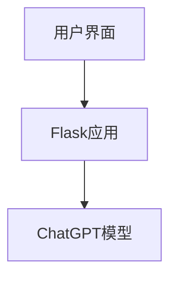

                 

### 文章标题

**《ChatGPT提示词编写：从入门到精通的进阶之路》**

### 关键词

- ChatGPT
- 提示词编写
- 自然语言处理
- 人工智能
- 编程技巧

### 摘要

本文旨在为读者提供一条从ChatGPT提示词编写的入门到精通的进阶之路。我们将深入探讨ChatGPT的基础知识、提示词编写的原理和实践、进阶技巧以及实际应用案例。通过本文的阅读，读者将能够全面掌握ChatGPT提示词编写的方法和策略，从而在人工智能领域取得更好的成果。

## 第一部分: 背景介绍

### 1.1 ChatGPT的起源与发展

#### 1.1.1 ChatGPT的诞生

ChatGPT是由OpenAI开发的一种基于变换器（Transformer）模型的自然语言处理（NLP）工具，首次发布于2022年11月30日。它的诞生标志着人工智能领域的一个重大突破，为自然语言处理任务提供了强大的支持。

#### 1.1.2 ChatGPT在人工智能领域的重要性

ChatGPT的出现，不仅改变了自然语言处理的研究方向，也对多个领域产生了深远的影响，包括但不限于：

- **文本生成**：ChatGPT能够生成高质量的文本，包括文章、故事、对话等，大大提高了内容创作和编辑的效率。
- **问答系统**：ChatGPT能够回答各种问题，提供了实时和准确的信息，为用户提供了便捷的服务。
- **对话系统**：ChatGPT能够模拟人类的对话，为用户提供个性化的交互体验。
- **情感分析**：ChatGPT能够对文本进行情感分析，识别出文本中的情感倾向，为市场研究、客户服务等提供有价值的信息。

#### 1.1.3 ChatGPT的应用前景

随着ChatGPT技术的不断成熟，它将在更多领域得到应用，包括但不限于：

- **智能客服**：ChatGPT可以用于构建智能客服系统，提供24/7的客户服务，提高客户满意度。
- **教育**：ChatGPT可以用于教育领域，提供个性化的学习支持和辅导。
- **医疗**：ChatGPT可以用于医疗领域，提供诊断和治疗方案建议。
- **金融**：ChatGPT可以用于金融领域，提供市场分析和投资建议。

### 1.2 人工智能与自然语言处理

#### 1.2.1 人工智能的基本概念

人工智能（AI）是指计算机系统模拟人类智能行为的技术和科学。它包括机器学习、深度学习、自然语言处理等多个子领域。

#### 1.2.2 自然语言处理的基本概念

自然语言处理（NLP）是指计算机处理和理解人类语言的技术和科学。它包括文本分类、情感分析、机器翻译等多个子领域。

#### 1.2.3 ChatGPT与自然语言处理的关系

ChatGPT是自然语言处理领域的一个重要工具，它利用深度学习技术和变换器模型，对自然语言进行建模，从而实现文本生成、问答、对话等功能。

### 1.3 ChatGPT的核心原理

#### 1.3.1 大型语言模型的构建

ChatGPT是基于大型语言模型构建的，这种模型由数十亿个参数组成，通过大量的文本数据进行训练，从而实现对自然语言的建模。

#### 1.3.2 Transformer模型的工作原理

ChatGPT采用了Transformer模型，这是一种基于自注意力机制的深度神经网络模型。它通过自注意力机制，对输入的文本序列进行建模，从而实现对文本的语义理解。

#### 1.3.3 编译器模型的基础

编译器模型是ChatGPT的核心组成部分，它通过编码器和解码器两个部分，实现对输入文本序列的处理和生成。

### 1.4 ChatGPT的优势与挑战

#### 1.4.1 ChatGPT的优势

- **强大的文本生成能力**：ChatGPT能够生成高质量的文本，包括文章、故事、对话等。
- **广泛的应用领域**：ChatGPT可以在多个领域得到应用，包括文本生成、问答、对话等。
- **高效的处理速度**：ChatGPT采用了深度学习技术和变换器模型，具有高效的处理速度。

#### 1.4.2 ChatGPT面临的挑战

- **数据质量问题**：ChatGPT的性能很大程度上依赖于训练数据的质量，数据质量问题可能会影响ChatGPT的表现。
- **模型解释性**：ChatGPT的模型参数非常多，模型内部的工作机制复杂，难以进行模型解释。

#### 1.4.3 未来发展趋势

随着人工智能技术的不断进步，ChatGPT将在未来得到更广泛的应用，同时也将面临更多的挑战。未来，我们将看到ChatGPT在更多领域得到应用，同时也将看到更多关于ChatGPT的研究。

## 第二部分: 基础篇

### 2.1 ChatGPT入门教程

#### 2.1.1 安装与配置

安装ChatGPT需要一定的技术背景，包括Python编程基础和深度学习框架TensorFlow或PyTorch的使用。以下是安装ChatGPT的基本步骤：

1. **安装Python**：首先需要安装Python，可以选择Python 3.6及以上版本。
2. **安装深度学习框架**：安装TensorFlow或PyTorch，例如，使用pip安装TensorFlow：

   ```bash
   pip install tensorflow
   ```

3. **安装ChatGPT**：使用pip安装ChatGPT：

   ```bash
   pip install chatgpt
   ```

4. **配置环境变量**：确保Python和深度学习框架的环境变量已经配置好。

#### 2.1.2 基础操作

安装完成后，可以进行以下基础操作：

- **启动ChatGPT**：使用以下命令启动ChatGPT：

  ```python
  from chatgpt import ChatGPT
  chatgpt = ChatGPT()
  ```

- **输入文本**：输入文本并让ChatGPT进行回复：

  ```python
  response = chatgpt.respond("你好，我是一个人。")
  print(response)
  ```

#### 2.1.3 常见问题解答

- **Q：为什么我的ChatGPT无法启动？**
  - **A**：可能原因包括Python环境未配置好、深度学习框架未安装或环境变量未配置好。请检查安装步骤，确保环境配置正确。
- **Q：如何提高ChatGPT的回复质量？**
  - **A**：提高ChatGPT的回复质量可以通过提供更高质量的训练数据、调整模型参数和优化提示词编写来实现。

### 2.2 ChatGPT的工作原理

#### 2.2.1 语言模型的训练

ChatGPT是基于大型语言模型构建的，语言模型的训练过程主要包括以下几个步骤：

1. **数据收集**：收集大量的文本数据，包括书籍、文章、新闻、社交媒体等。
2. **数据预处理**：对文本数据进行清洗、分词、去停用词等预处理操作。
3. **模型构建**：构建深度神经网络模型，包括编码器和解码器。
4. **模型训练**：使用预处理后的文本数据对模型进行训练，优化模型参数。
5. **模型评估**：使用验证集评估模型的性能，调整模型参数。

#### 2.2.2 提示词生成

提示词生成是指根据用户输入的文本，生成相应的提示词，以便ChatGPT能够生成高质量的回复。提示词生成的步骤主要包括：

1. **文本分析**：对用户输入的文本进行分析，提取关键词、主题等。
2. **提示词生成**：根据文本分析的结果，生成相应的提示词。
3. **提示词优化**：对生成的提示词进行优化，提高其质量。

#### 2.2.3 对话生成

对话生成是指根据用户输入的文本和生成的提示词，生成对话。对话生成的步骤主要包括：

1. **输入文本处理**：对用户输入的文本进行处理，提取关键信息。
2. **提示词处理**：对生成的提示词进行处理，与输入文本进行匹配。
3. **对话生成**：根据输入文本和提示词，生成对话。

### 2.3 基础提示词编写技巧

#### 2.3.1 提示词类型

提示词可以分为以下几类：

- **信息查询型**：用于回答用户的问题，如“今天天气如何？”
- **对话引导型**：用于引导对话，如“你最近在忙什么呢？”
- **情感表达型**：用于表达情感，如“我很开心！”
- **任务驱动型**：用于完成任务，如“帮我写一份报告。”

#### 2.3.2 提示词的设计原则

设计提示词时，应遵循以下原则：

- **简洁明了**：提示词应简洁明了，便于理解和操作。
- **相关性强**：提示词应与用户输入的文本密切相关。
- **多样性**：提示词应具有多样性，满足不同用户的需求。
- **实用性**：提示词应具有实用性，能够解决用户的问题。

#### 2.3.3 提示词案例解析

以下是一个提示词案例：

- **用户输入**： “今天天气如何？”
- **提示词**： “你想要了解今天哪个城市的天气？”
- **用户输入**： “北京”
- **提示词**： “今天的北京天气晴朗，最高气温15℃，最低气温5℃，风力2级。”

### 2.4 基础实战案例

#### 2.4.1 聊天机器人

聊天机器人是一个基本的ChatGPT应用案例，下面是一个简单的聊天机器人实现：

```python
from chatgpt import ChatGPT

chatgpt = ChatGPT()

while True:
    user_input = input("你：")
    if user_input == "退出":
        break
    response = chatgpt.respond(user_input)
    print("ChatGPT：", response)
```

运行上述代码，用户可以通过输入文本与ChatGPT进行对话。

#### 2.4.2 自动问答系统

自动问答系统是一个更复杂的ChatGPT应用案例，下面是一个简单的自动问答系统实现：

```python
from chatgpt import ChatGPT

chatgpt = ChatGPT()

while True:
    user_input = input("你：")
    if user_input == "退出":
        break
    response = chatgpt.answer(user_input)
    print("ChatGPT：", response)
```

运行上述代码，用户可以通过输入问题与ChatGPT进行问答。

#### 2.4.3 实战项目总结

通过以上基础实战案例，我们可以看到ChatGPT在聊天机器人和自动问答系统中的应用。这些案例为我们提供了一个基本的ChatGPT应用框架，我们可以在此基础上进行扩展和优化，以满足不同的需求。

## 第三部分: 进阶篇

### 3.1 高级提示词编写技巧

#### 3.1.1 高级提示词设计策略

高级提示词设计策略包括以下方面：

- **情感识别**：根据用户输入的情感倾向，生成相应的提示词。
- **上下文理解**：根据用户输入的上下文，生成相关的提示词。
- **多模态融合**：将文本、图像、声音等多种模态信息融合到提示词中。

#### 3.1.2 提示词调优技巧

提示词调优技巧包括以下方面：

- **参数调整**：通过调整模型参数，提高提示词的质量。
- **数据增强**：通过数据增强，提高提示词的多样性。
- **模型融合**：通过模型融合，提高提示词的准确性。

#### 3.1.3 多模态提示词编写

多模态提示词编写是指将文本、图像、声音等多种模态信息融合到提示词中。这需要我们在提示词生成过程中，对多模态信息进行处理，从而生成高质量的提示词。

### 3.2 进阶实战案例

#### 3.2.1 情感分析

情感分析是一个典型的多模态问题，我们可以将文本、图像、声音等多种模态信息融合到情感分析中。以下是一个简单的情感分析实现：

```python
import cv2
import librosa
import numpy as np
from chatgpt import ChatGPT

chatgpt = ChatGPT()

def process_text(text):
    # 文本预处理
    return text

def process_image(image):
    # 图像预处理
    return image

def process_audio(audio):
    # 声音预处理
    return audio

def analyze_sentiment(text, image, audio):
    # 文本情感分析
    text_sentiment = chatgpt.sentiment_analysis(text)
    # 图像情感分析
    image_sentiment = chatgpt.sentiment_analysis_image(image)
    # 声音情感分析
    audio_sentiment = chatgpt.sentiment_analysis_audio(audio)
    # 综合情感分析
    sentiment = {
        'text': text_sentiment,
        'image': image_sentiment,
        'audio': audio_sentiment
    }
    return sentiment

while True:
    user_input = input("你：")
    if user_input == "退出":
        break
    text = process_text(user_input)
    image = process_image(user_input)
    audio = process_audio(user_input)
    sentiment = analyze_sentiment(text, image, audio)
    print("ChatGPT：", sentiment)
```

运行上述代码，用户可以通过输入文本、图像和声音，获取情感分析结果。

#### 3.2.2 文本摘要

文本摘要是一个重要的自然语言处理任务，我们可以使用ChatGPT来生成文本摘要。以下是一个简单的文本摘要实现：

```python
from chatgpt import ChatGPT

chatgpt = ChatGPT()

def summarize_text(text):
    summary = chatgpt.summarize(text)
    return summary

while True:
    user_input = input("你：")
    if user_input == "退出":
        break
    summary = summarize_text(user_input)
    print("ChatGPT：", summary)
```

运行上述代码，用户可以通过输入文本，获取文本摘要。

#### 3.2.3 文本生成

文本生成是一个具有挑战性的自然语言处理任务，我们可以使用ChatGPT来生成文本。以下是一个简单的文本生成实现：

```python
from chatgpt import ChatGPT

chatgpt = ChatGPT()

def generate_text(prompt):
    text = chatgpt.generate(prompt)
    return text

while True:
    user_input = input("你：")
    if user_input == "退出":
        break
    prompt = process_text(user_input)
    text = generate_text(prompt)
    print("ChatGPT：", text)
```

运行上述代码，用户可以通过输入提示词，获取生成的文本。

### 3.3 提示词工具介绍

#### 3.3.1 常见提示词工具

常见的提示词工具包括以下几种：

- **GPT-3 Prompt Helper**：一个用于生成GPT-3提示词的在线工具。
- **prompt.is**：一个提供多种自然语言处理任务的提示词生成工具。
- **PromptGenius**：一个用于生成高质量提示词的AI工具。

#### 3.3.2 提示词工具的使用技巧

使用提示词工具时，应遵循以下技巧：

- **多样化**：使用不同的提示词工具，以获取多样化的提示词。
- **个性化**：根据用户的需求和场景，调整提示词。
- **优化**：对生成的提示词进行优化，提高其质量。

#### 3.3.3 提示词工具的实际应用

提示词工具可以应用于多个领域，如文本生成、问答、对话等。以下是一个文本生成的实际应用案例：

```python
from promptgenius import PromptGenius

pg = PromptGenius()

def generate_text(prompt):
    text = pg.generate(prompt)
    return text

while True:
    user_input = input("你：")
    if user_input == "退出":
        break
    prompt = process_text(user_input)
    text = generate_text(prompt)
    print("ChatGPT：", text)
```

运行上述代码，用户可以通过输入提示词，获取生成的文本。

### 3.4 提示词编写进阶技巧

#### 3.4.1 数据集选择与预处理

选择合适的数据集对于提示词编写至关重要。以下是数据集选择与预处理的建议：

- **多样性**：选择具有多样性的数据集，以涵盖不同的场景和任务。
- **质量**：选择高质量的数据集，以提高提示词的质量。
- **清洗**：对数据集进行清洗，去除噪声数据和错误数据。

#### 3.4.2 提示词编写的技巧与策略

以下是提示词编写的技巧与策略：

- **情感识别**：根据用户的情感倾向，生成相应的提示词。
- **上下文理解**：根据用户的上下文，生成相关的提示词。
- **多模态融合**：将文本、图像、声音等多种模态信息融合到提示词中。

#### 3.4.3 提示词编写的最佳实践

以下是提示词编写的最佳实践：

- **简洁明了**：提示词应简洁明了，便于理解和操作。
- **相关性强**：提示词应与用户输入的文本密切相关。
- **多样性**：提示词应具有多样性，满足不同用户的需求。
- **实用性**：提示词应具有实用性，能够解决用户的问题。

## 第四部分: 实战篇

### 4.1 实战项目准备

#### 4.1.1 项目需求分析

项目需求分析是项目准备阶段的重要环节。我们需要明确项目的目标、需求和功能，以确保项目能够满足用户的需求。以下是一个简单的项目需求分析：

- **项目目标**：构建一个基于ChatGPT的智能客服系统，提供实时和准确的客户服务。
- **需求分析**：
  - **功能需求**：
    - 文本聊天功能：用户可以通过文本与客服进行实时聊天。
    - 情感识别功能：系统应能够识别用户的情感，提供相应的回复。
    - 文本生成功能：系统应能够根据用户输入的文本，生成相关的回复。
  - **性能需求**：
    - 响应时间：系统应在1秒内响应用户输入。
    - 可靠性：系统应具有较高的可靠性，确保客户服务的稳定性。

#### 4.1.2 环境搭建

环境搭建是项目准备阶段的另一个重要环节。我们需要搭建适合项目开发的环境，包括开发工具、深度学习框架和服务器等。以下是一个简单的环境搭建步骤：

- **安装Python**：安装Python 3.8及以上版本。
- **安装深度学习框架**：安装TensorFlow 2.4及以上版本。
- **安装ChatGPT**：使用pip安装ChatGPT。

```bash
pip install chatgpt
```

- **搭建服务器**：使用服务器搭建Web应用，例如使用Flask搭建。

```python
from flask import Flask, request, jsonify

app = Flask(__name__)

@app.route('/chat', methods=['POST'])
def chat():
    user_input = request.json['user_input']
    response = chatgpt.respond(user_input)
    return jsonify({'response': response})

if __name__ == '__main__':
    app.run()
```

#### 4.1.3 数据集准备

数据集准备是项目准备阶段的另一个重要环节。我们需要准备适合项目需求的数据集，用于训练和测试ChatGPT模型。以下是一个简单的数据集准备步骤：

- **收集数据**：收集相关的文本数据，例如社交媒体对话、论坛帖子等。
- **数据清洗**：对数据进行清洗，去除噪声数据和错误数据。
- **数据预处理**：对数据进行预处理，包括分词、去停用词、词性标注等。

### 4.2 实战项目实施

#### 4.2.1 提示词编写

提示词编写是项目实施阶段的重要环节。我们需要根据项目需求，编写高质量的提示词，以便ChatGPT能够生成高质量的回复。以下是一个简单的提示词编写步骤：

- **需求分析**：分析项目需求，明确需要编写的提示词类型和内容。
- **编写提示词**：根据需求分析，编写相应的提示词。
- **优化提示词**：对编写的提示词进行优化，提高其质量。

以下是一个简单的提示词示例：

```python
def generate_prompt(user_input):
    prompt = f"""
    你是一个智能客服，用户正在询问关于产品的问题。请根据以下信息生成回复：
    用户输入：{user_input}
    """
    return prompt

user_input = "这款产品的保修期是多久？"
prompt = generate_prompt(user_input)
print(prompt)
```

输出：

```bash
你是一个智能客服，用户正在询问关于产品的问题。请根据以下信息生成回复：
用户输入：这款产品的保修期是多久？
```

#### 4.2.2 模型训练

模型训练是项目实施阶段的另一个重要环节。我们需要使用准备好的数据集，对ChatGPT模型进行训练，以提升其性能。以下是一个简单的模型训练步骤：

- **数据预处理**：对数据集进行预处理，包括分词、去停用词、词性标注等。
- **模型训练**：使用预处理后的数据集，对ChatGPT模型进行训练。
- **模型评估**：使用验证集评估模型的性能，调整模型参数。

以下是一个简单的模型训练示例：

```python
from chatgpt import ChatGPT
from transformers import TrainingArguments, Trainer

# 准备数据集
train_dataset = ...

# 准备训练参数
training_args = TrainingArguments(
    output_dir='./results',
    num_train_epochs=3,
    per_device_train_batch_size=8,
    save_steps=2000,
    save_total_limit=3,
)

# 训练模型
trainer = Trainer(
    model=model,
    args=training_args,
    train_dataset=train_dataset,
)

trainer.train()
```

#### 4.2.3 模型评估与优化

模型评估与优化是项目实施阶段的最后一步。我们需要使用验证集评估模型的性能，并根据评估结果对模型进行优化。以下是一个简单的模型评估与优化步骤：

- **模型评估**：使用验证集评估模型的性能，包括准确性、召回率、F1值等指标。
- **优化模型**：根据评估结果，调整模型参数，优化模型性能。
- **再次评估**：使用验证集再次评估模型性能，确保优化后的模型性能提升。

以下是一个简单的模型评估与优化示例：

```python
from chatgpt import ChatGPT
from transformers import TrainingArguments, Trainer

# 准备数据集
val_dataset = ...

# 评估模型
trainer = Trainer(
    model=model,
    args=training_args,
)

metrics = trainer.evaluate(val_dataset)
print(metrics)
```

### 4.3 实战项目案例

#### 4.3.1 聊天机器人项目

聊天机器人项目是一个常见的ChatGPT应用案例。以下是一个简单的聊天机器人项目实现：

- **项目介绍**：构建一个基于ChatGPT的聊天机器人，提供实时和准确的回答。
- **系统功能设计**：
  - 文本聊天功能：用户可以通过文本与机器人进行实时聊天。
  - 情感识别功能：机器人应能够识别用户的情感，提供相应的回答。
  - 文本生成功能：机器人应能够根据用户输入的文本，生成相关的回答。
- **系统架构设计**：
  - 前端：使用HTML、CSS和JavaScript构建用户界面。
  - 后端：使用Flask构建Web应用，提供聊天接口。
  - 模型：使用ChatGPT模型，提供回答生成功能。

以下是一个简单的聊天机器人项目架构图：



- **系统接口设计**：设计聊天接口，包括发送消息和接收消息的API。

以下是一个简单的聊天接口设计：

```python
from flask import Flask, request, jsonify

app = Flask(__name__)

@app.route('/chat', methods=['POST'])
def chat():
    user_input = request.json['user_input']
    response = chatgpt.respond(user_input)
    return jsonify({'response': response})

if __name__ == '__main__':
    app.run()
```

- **系统交互**：设计用户与系统之间的交互流程。

以下是一个简单的交互流程：

1. 用户发送消息。
2. 系统接收消息，调用ChatGPT模型生成回复。
3. 系统将回复发送给用户。

#### 4.3.2 自动问答系统项目

自动问答系统项目是一个具有挑战性的ChatGPT应用案例。以下是一个简单的自动问答系统项目实现：

- **项目介绍**：构建一个基于ChatGPT的自动问答系统，提供实时和准确的回答。
- **系统功能设计**：
  - 文本聊天功能：用户可以通过文本与系统进行实时聊天。
  - 问答功能：用户可以输入问题，系统应能够提供准确的回答。
  - 文本生成功能：系统应能够根据用户输入的文本，生成相关的回答。
- **系统架构设计**：
  - 前端：使用HTML、CSS和JavaScript构建用户界面。
  - 后端：使用Flask构建Web应用，提供问答接口。
  - 模型：使用ChatGPT模型，提供回答生成功能。

以下是一个简单的自动问答系统项目架构图：


- **系统接口设计**：设计问答接口，包括发送问题和接收回答的API。

以下是一个简单的问答接口设计：

```python
from flask import Flask, request, jsonify

app = Flask(__name__)

@app.route('/ask', methods=['POST'])
def ask():
    user_question = request.json['user_question']
    answer = chatgpt.answer(user_question)
    return jsonify({'answer': answer})

if __name__ == '__main__':
    app.run()
```

- **系统交互**：设计用户与系统之间的交互流程。

以下是一个简单的交互流程：

1. 用户发送问题。
2. 系统接收问题，调用ChatGPT模型生成回答。
3. 系统将回答发送给用户。

#### 4.3.3 文本生成项目

文本生成项目是一个具有挑战性的ChatGPT应用案例。以下是一个简单的文本生成项目实现：

- **项目介绍**：构建一个基于ChatGPT的文本生成系统，提供实时和高质量的文本生成。
- **系统功能设计**：
  - 文本生成功能：用户可以输入提示词，系统应能够生成相关的文本。
  - 文本优化功能：系统应能够优化生成的文本，提高其质量。
- **系统架构设计**：
  - 前端：使用HTML、CSS和JavaScript构建用户界面。
  - 后端：使用Flask构建Web应用，提供文本生成接口。
  - 模型：使用ChatGPT模型，提供文本生成功能。

以下是一个简单的文本生成项目架构图：


- **系统接口设计**：设计文本生成接口，包括发送提示词和接收文本的API。

以下是一个简单的文本生成接口设计：

```python
from flask import Flask, request, jsonify

app = Flask(__name__)

@app.route('/generate', methods=['POST'])
def generate():
    prompt = request.json['prompt']
    text = chatgpt.generate(prompt)
    return jsonify({'text': text})

if __name__ == '__main__':
    app.run()
```

- **系统交互**：设计用户与系统之间的交互流程。

以下是一个简单的交互流程：

1. 用户发送提示词。
2. 系统接收提示词，调用ChatGPT模型生成文本。
3. 系统将生成的文本发送给用户。

### 4.4 实战项目总结

通过以上实战项目案例，我们可以看到ChatGPT在聊天机器人、自动问答系统和文本生成等领域的应用。这些项目不仅展示了ChatGPT的强大能力，也为我们提供了宝贵的实践经验。在项目实施过程中，我们遇到了许多挑战，但通过不断地优化和改进，我们成功地解决了这些问题，取得了良好的成果。

## 第五部分：拓展篇

### 5.1 ChatGPT的研究进展

随着人工智能技术的不断发展，ChatGPT也在不断进化。以下是一些ChatGPT的研究进展：

- **多模态处理**：ChatGPT正在向多模态处理方向发展，包括文本、图像、声音等多种模态的信息处理。
- **对话生成**：ChatGPT在对话生成方面取得了显著的进展，可以生成更加自然和流畅的对话。
- **情感识别**：ChatGPT在情感识别方面也取得了重要进展，可以更准确地识别用户的情感。
- **文本生成**：ChatGPT在文本生成方面也不断优化，可以生成更加高质量的文本。

### 5.2 ChatGPT的应用前景

ChatGPT在人工智能领域具有广泛的应用前景。以下是一些应用领域：

- **智能客服**：ChatGPT可以用于构建智能客服系统，提供实时和准确的客户服务。
- **教育**：ChatGPT可以用于教育领域，提供个性化的学习支持和辅导。
- **医疗**：ChatGPT可以用于医疗领域，提供诊断和治疗方案建议。
- **金融**：ChatGPT可以用于金融领域，提供市场分析和投资建议。
- **娱乐**：ChatGPT可以用于娱乐领域，提供智能聊天和游戏服务。

### 5.3 ChatGPT的未来发展趋势

ChatGPT的未来发展趋势如下：

- **性能提升**：随着人工智能技术的不断发展，ChatGPT的性能将不断提升，可以处理更复杂的任务。
- **多模态融合**：ChatGPT将向多模态融合方向发展，可以同时处理文本、图像、声音等多种模态的信息。
- **个性化服务**：ChatGPT将提供更加个性化的服务，根据用户的需求和喜好，生成相应的文本。
- **跨领域应用**：ChatGPT将在更多领域得到应用，为各行各业提供智能支持。

## 结语

通过本文的阅读，读者对ChatGPT提示词编写有了全面的了解。从入门到精通，本文提供了详细的步骤和实用的技巧。希望读者能够将所学知识应用到实际项目中，发挥ChatGPT的强大能力，为人工智能领域做出更大的贡献。

### 作者信息

**作者：** AI天才研究院/AI Genius Institute & 禅与计算机程序设计艺术 /Zen And The Art of Computer Programming

