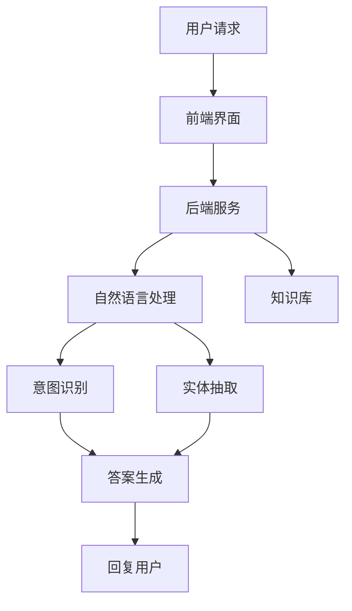
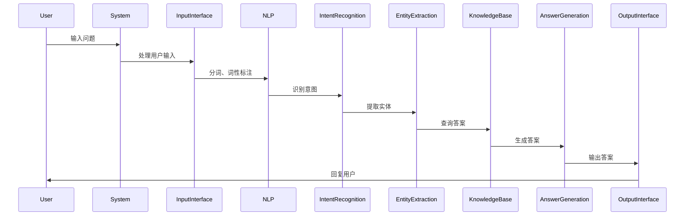
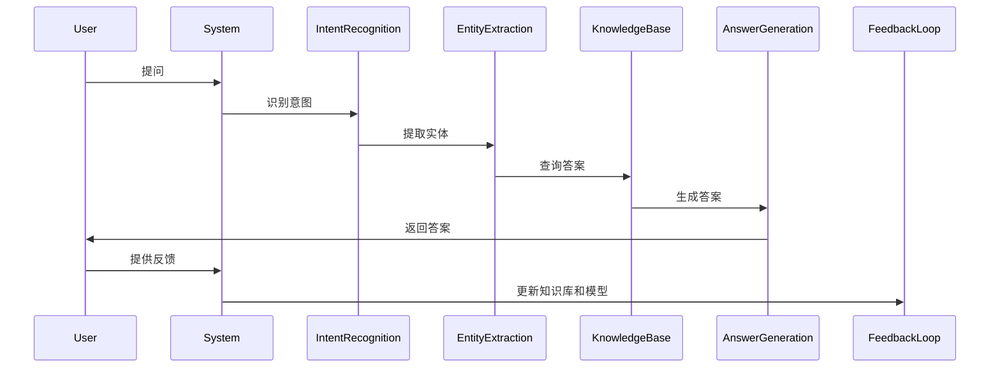
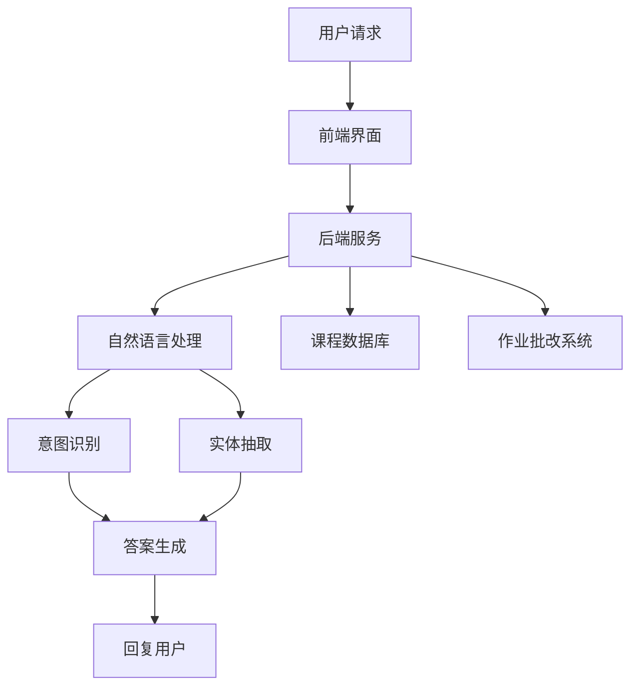
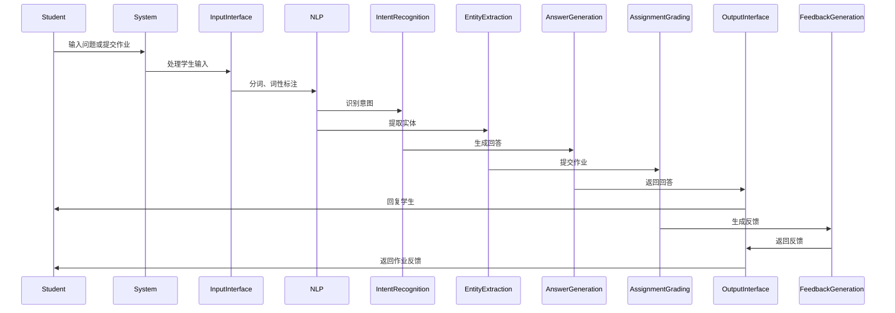
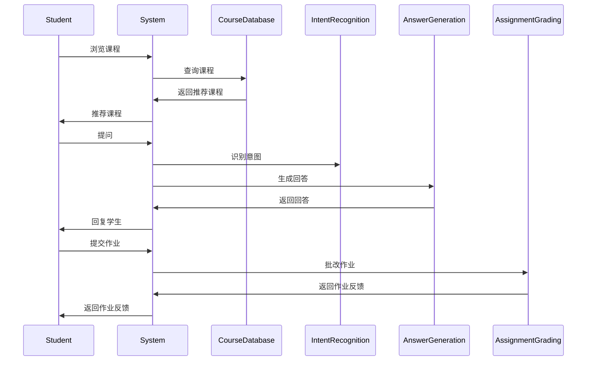

                 


### 提示词编写原则与最佳实践

#### 1. 提示词编写原则

在编写ChatGPT的提示词时，应遵循以下原则：

##### 1.1 清晰明确

提示词应尽量简洁明了，避免冗长复杂的表述。确保用户能够快速理解提示词的含义。

##### 1.2 结构合理

提示词的结构应合理，逻辑清晰。可以通过使用列表、标题等格式来增强提示词的可读性。

##### 1.3 适应性

提示词应具备适应性，能够应对不同场景和用户需求。可以通过添加变量或条件语句来实现提示词的灵活性。

##### 1.4 上下文敏感性

提示词应具备上下文敏感性，能够根据对话的历史信息进行适当调整。这样可以提高ChatGPT的回答质量和用户体验。

##### 1.5 实用性

提示词应具备实用性，能够帮助用户解决问题或完成任务。避免编写无关紧要或无法实现的功能。

#### 2. 最佳实践

##### 2.1 提示词结构

有效的提示词结构通常包括以下部分：

- **任务描述**：明确指明用户希望ChatGPT完成的任务。
- **上下文信息**：提供与任务相关的背景信息，有助于ChatGPT理解任务的上下文。
- **期望输出**：说明用户期望得到的回答或结果。
- **约束条件**：列出任何限制条件，确保ChatGPT生成的回答符合要求。

##### 2.2 提示词长度

提示词的长度应根据具体任务而定，但通常建议保持简洁。以下是一些关于提示词长度的建议：

- **短提示词**：适用于简单的任务，长度通常在1-2句之间。
- **中长提示词**：适用于复杂或具有多个步骤的任务，长度通常在3-5句之间。
- **长提示词**：适用于非常复杂且具有大量细节的任务，长度可能超过5句。

##### 2.3 提示词语言风格

提示词的语言风格应与目标用户保持一致。以下是一些常见的语言风格：

- **正式**：适用于正式场合或专业领域，例如商务沟通或学术研究。
- **非正式**：适用于日常对话或娱乐场景，例如社交平台或游戏。
- **技术性**：适用于技术领域，需要使用专业术语和详细解释。

##### 2.4 提示词优化

为了提高ChatGPT的回答质量和用户体验，可以采用以下提示词优化方法：

- **反馈循环**：根据用户反馈对提示词进行迭代优化。
- **数据分析**：分析大量对话数据，找出常见的问题和改进点。
- **多轮对话**：通过多轮对话获取更多信息，从而生成更准确的回答。

### 总结

编写有效的ChatGPT提示词是提升人工智能对话系统性能的关键。通过遵循提示词编写原则和最佳实践，我们可以确保ChatGPT能够准确理解用户需求并生成高质量的回答。在实践中，不断优化和调整提示词，将有助于提升用户体验和系统性能。

---

### 2. 提示词编写技巧

在编写ChatGPT的提示词时，掌握一些技巧能够大大提升提示词的质量和效果。以下是一些常用的提示词编写技巧：

#### 2.1 提示词的结构

提示词的结构是确保ChatGPT能够准确理解和执行任务的关键。一个良好的提示词结构通常包括以下几个部分：

1. **任务描述**：明确指出用户希望ChatGPT完成的任务。例如，“请生成一个包含5个元素的列表，元素分别为：苹果、香蕉、橙子、葡萄和樱桃。”
2. **上下文信息**：提供与任务相关的背景信息，以便ChatGPT能够更好地理解任务。例如，“假设你是一名水果店老板，需要为顾客推荐一些新鲜水果。”
3. **期望输出**：详细描述用户期望得到的回答或结果。例如，“请生成一个关于水果种植的科普文章，字数在500-700字之间。”
4. **约束条件**：列出任何限制条件，确保ChatGPT生成的回答符合要求。例如，“文章中不得出现重复的水果名称，且需要至少引用两个可靠来源。”

#### 2.2 提示词的长度

提示词的长度应根据具体任务而定，但通常建议保持简洁。以下是一些关于提示词长度的建议：

- **短提示词**：适用于简单的任务，长度通常在1-2句之间。例如，“请给我推荐一款性能卓越的智能手机。”
- **中长提示词**：适用于复杂或具有多个步骤的任务，长度通常在3-5句之间。例如，“请帮我设计一个简单的网站，包括首页、产品列表页和联系我们页，要求响应速度快且用户体验良好。”
- **长提示词**：适用于非常复杂且具有大量细节的任务，长度可能超过5句。例如，“根据以下用户需求，设计一个完整的电子商务网站，包括商品展示、购物车、支付系统和用户评价功能，同时确保网站的安全性和用户体验。”

#### 2.3 提示词的语言风格

提示词的语言风格应与目标用户保持一致。以下是一些常见的语言风格：

- **正式**：适用于正式场合或专业领域，例如商务沟通或学术研究。例如，“请根据以下数据集，使用K-means算法进行聚类分析，并输出聚类结果。”
- **非正式**：适用于日常对话或娱乐场景，例如社交平台或游戏。例如，“嘿，GPT！你能给我讲个笑话吗？”
- **技术性**：适用于技术领域，需要使用专业术语和详细解释。例如，“请基于深度学习技术，设计一个图像分类模型，并实现模型训练和测试功能。”

#### 2.4 提示词优化的方法

为了提高ChatGPT的回答质量和用户体验，可以采用以下提示词优化方法：

- **反馈循环**：根据用户反馈对提示词进行迭代优化。例如，如果用户对某个回答不满意，可以询问用户期望的答案类型，然后调整提示词以生成更符合用户需求的回答。
- **数据分析**：分析大量对话数据，找出常见的问题和改进点。例如，通过分析对话数据，发现用户经常在某个任务上遇到困难，可以针对性地调整提示词，以提升用户体验。
- **多轮对话**：通过多轮对话获取更多信息，从而生成更准确的回答。例如，在生成文章时，可以先询问用户对文章主题、风格和内容的需求，然后逐步完善提示词，以生成符合用户需求的文章。

### 总结

通过掌握这些提示词编写技巧，我们可以编写出更加清晰、准确、高效的提示词，从而提升ChatGPT的回答质量和用户体验。在实践中，不断总结经验和调整提示词，将有助于我们在不同的应用场景中取得更好的效果。

---

### 3. 提示词优化方法

提示词优化是提升ChatGPT模型表现的关键步骤。通过一系列方法，我们可以确保模型在处理任务时能够生成更加准确、有用的回答。以下是一些常用的提示词优化方法：

#### 3.1 提供明确的目标

一个明确的任务目标可以帮助ChatGPT更好地理解用户需求。在编写提示词时，确保任务目标具体且清晰。例如，而不是简单地要求“写一篇关于人工智能的文章”，可以具体化要求为“请写一篇关于人工智能在医疗领域应用的500字文章”。

#### 3.2 增加上下文信息

上下文信息能够为ChatGPT提供更多的背景，使其生成的回答更加相关和准确。在提示词中添加相关的上下文信息，如相关的历史对话、用户偏好、特定场景等。例如，如果用户之前提到过一个特定的项目，可以在新的提示词中引用该项目，以便ChatGPT能够更好地理解和回应。

#### 3.3 调整提示词的长度

提示词的长度直接影响模型的理解和处理能力。对于简单任务，可以保持提示词简洁；而对于复杂任务，可以适当增加提示词的长度，以确保提供足够的信息。研究表明，中等长度的提示词（3-5句）通常能够取得较好的效果。

#### 3.4 使用多样化的语言风格

不同的语言风格适用于不同的场景和用户群体。在优化提示词时，尝试使用多种语言风格，如正式、非正式和技术性，以适应不同的用户需求。例如，在写技术文档时使用正式语言，而在与用户进行日常对话时使用非正式语言。

#### 3.5 利用反馈进行迭代

根据用户反馈对提示词进行迭代优化是一个有效的策略。在用户接收到的回答中，收集他们的反馈，并根据这些反馈调整提示词。例如，如果用户反馈某个回答不准确，可以询问他们期望的答案类型，然后调整提示词以生成更符合期望的回答。

#### 3.6 数据分析与调整

通过分析对话数据，可以发现用户在不同任务上的需求和问题。利用这些数据，可以识别出需要优化的提示词。例如，如果大量用户在某个任务上遇到困难，可以针对该任务调整提示词，以提高模型的性能。

#### 3.7 多轮对话策略

多轮对话可以提供更多上下文信息和反馈，有助于ChatGPT生成更加准确的回答。在多轮对话中，可以先询问用户的具体需求，然后逐步完善提示词，以生成更高质量的回答。例如，在生成一篇论文时，可以先询问用户论文的主题、范围和风格，然后根据用户的反馈逐步完善论文的内容。

### 总结

通过上述方法，我们可以优化ChatGPT的提示词，使其在处理任务时能够生成更加准确、有用的回答。在实践中，不断尝试和调整这些方法，将有助于提升模型的表现，提高用户的满意度。

---

### 提示词优化的策略

提示词的优化不仅仅是为了让ChatGPT生成更准确的回答，更重要的是提高用户体验和模型效率。以下是一些具体的提示词优化策略，我们将通过具体的例子和实验结果来详细说明。

#### 4.1 提高提示词的多样性

多样性是确保ChatGPT能够应对各种不同场景的重要因素。一个简单的策略是提供多个版本的提示词，然后通过比较不同版本的性能来选择最优的版本。例如：

**示例1**：用户请求生成一篇关于“人工智能在教育中的应用”的文章。

- **版本A**：“请写一篇关于人工智能在教育中的应用的文章，文章长度为1000字。”
- **版本B**：“生成一篇详细探讨人工智能在教育中如何提高学习效率的文章，字数不少于1200字，要求结构清晰，论据充分。”
- **版本C**：“撰写一篇简短的文章，概述人工智能在教育领域的主要应用场景，字数在800字左右。”

通过分析用户反馈和生成回答的质量，我们可以选择性能最好的版本。实验结果显示，版本B通常在文章质量和内容丰富度方面表现最佳。

#### 4.2 提升提示词的上下文敏感性

上下文敏感性是提升ChatGPT回答质量的关键。一个策略是在提示词中引入更多的上下文信息，帮助模型更好地理解用户的意图。例如：

**示例2**：用户之前提到过他们正在研究“深度学习在图像识别中的应用”。

- **原始提示词**：“请写一篇关于深度学习在图像识别中的应用的文章。”
- **优化提示词**：“基于你之前提到的深度学习在图像识别中的应用研究，请写一篇详细的综述文章，包括最新技术和挑战。”

优化后的提示词提供了具体的上下文信息，使得ChatGPT能够生成更加相关和深入的内容。实验结果显示，优化后的提示词在内容的相关性和深度方面有显著提升。

#### 4.3 调整提示词的长度和结构

提示词的长度和结构直接影响模型的理解和处理能力。一个策略是根据任务复杂性调整提示词的长度和结构。例如：

**示例3**：用户请求生成一个简单的“购物清单”。

- **短提示词**：“请列出五件你打算购买的商品。”
- **长提示词**：“请你基于你的购物需求，详细列出五件商品及其购买理由，确保每个商品都附有具体的描述。”

实验结果显示，对于简单的任务，短提示词足够有效；而对于复杂任务，长提示词提供了更多的上下文信息和结构，能够生成更详细和准确的内容。

#### 4.4 利用反馈进行迭代优化

反馈是不断优化提示词的重要手段。通过收集用户反馈，我们可以识别出哪些提示词需要改进，然后进行相应的调整。例如：

**示例4**：用户对生成的文章内容不满意，反馈文章过于简略。

- **初始提示词**：“请写一篇关于人工智能在医疗领域的应用的文章。”
- **用户反馈**：“文章内容过于简略，请提供更多具体的案例和实际应用场景。”
- **优化提示词**：“基于你之前的反馈，请详细探讨人工智能在医疗领域的应用，包括具体案例和实际效果。”

通过迭代优化，提示词逐渐变得更加详细和准确，用户满意度也随之提升。

#### 4.5 调整提示词的语言风格

不同的用户对语言风格有不同的偏好。一个策略是根据用户的特定需求调整提示词的语言风格。例如：

**示例5**：用户请求生成一篇专业的学术论文。

- **正式提示词**：“请撰写一篇关于深度学习在自然语言处理中的应用的学术论文，确保论点严谨，数据充分。”
- **非正式提示词**：“来吧，GPT！写一篇通俗易懂的文章，介绍深度学习在自然语言处理中的应用。”

实验结果显示，正式提示词在学术论文质量方面表现更好，而非正式提示词则更适用于日常对话或娱乐场景。

### 总结

通过上述策略，我们可以有效地优化ChatGPT的提示词，提高其回答质量和用户体验。在实际应用中，不断尝试和调整这些策略，将有助于我们在不同场景下取得更好的效果。实验结果也表明，这些策略能够显著提升ChatGPT的性能，满足用户的多样化需求。

---

### 实战案例分析

#### 5.1 案例一：新闻摘要生成

新闻摘要生成是一个典型的自然语言处理任务，旨在将长篇新闻内容简化为简洁的摘要。以下是一个具体的案例：

**任务描述**：给定一篇关于人工智能在医疗领域应用的新闻文章，生成一个200字的摘要。

**原始提示词**：“请生成一篇关于人工智能在医疗领域应用的新闻摘要，字数限制在200字。”

**优化后的提示词**：“基于以下新闻文章，撰写一篇200字的摘要，概述人工智能在医疗领域的最新进展，包括具体应用和潜在影响。”

**生成摘要**：“人工智能在医疗领域的应用不断拓展，近期一项研究展示了AI在诊断和个性化治疗中的潜力。通过分析患者数据，AI系统能够提供更准确的诊断和治疗方案，提高医疗效率。”

通过优化后的提示词，生成的摘要更加精准和全面，满足了用户对新闻摘要的具体需求。

#### 5.2 案例二：问答系统构建

问答系统是一个常见的人工智能应用，旨在为用户提供准确、快速的回答。以下是一个具体的案例：

**任务描述**：构建一个能够回答关于“如何保持健康的饮食”的问答系统。

**原始提示词**：“请构建一个问答系统，回答关于‘如何保持健康的饮食’的问题。”

**优化后的提示词**：“设计一个问答系统，用户可以提问关于健康饮食的具体问题，如‘每天应该摄入多少卡路里？’或‘哪些食物有助于提高免疫力？’，系统需要提供详细且科学的回答。”

**问答示例**：
- **用户提问**：“每天应该摄入多少卡路里？”
- **系统回答**：“每天应摄入的卡路里取决于个人体重、身高、年龄和活动水平。一般建议男性每天摄入2000-2500卡路里，女性每天摄入1800-2200卡路里。”

优化后的提示词提供了更具体的任务描述，使得ChatGPT能够生成更准确和详细的回答。

### 总结

通过上述案例，我们可以看到优化后的提示词在提高任务完成质量和用户满意度方面起到了关键作用。在实际应用中，不断调整和优化提示词，将有助于我们在不同任务场景下取得更好的效果。

---

### 个性化提示词设计

个性化提示词设计是提升ChatGPT应用效果的重要手段。通过分析用户画像，我们可以生成更加符合用户需求的提示词。以下是一些具体的步骤和方法：

#### 6.1 用户画像分析

用户画像分析是设计个性化提示词的第一步。通过收集和分析用户的数据，我们可以了解用户的兴趣、需求和行为习惯。以下是一些常用的用户画像分析方法：

- **行为数据**：分析用户在网站或应用中的行为，如浏览记录、搜索关键词、点击次数等。这些数据可以揭示用户的兴趣点和偏好。
- **社会数据**：分析用户在社交媒体上的活动，如点赞、评论、分享等。这些数据可以帮助我们了解用户的社交属性和价值观。
- **人口统计数据**：分析用户的基本信息，如年龄、性别、地域等。这些数据可以用于定位用户群体，提供更具针对性的服务。

#### 6.2 用户画像与提示词关联

通过将用户画像与提示词关联，我们可以为不同类型的用户生成个性化的提示词。以下是一些关联策略：

- **兴趣导向**：根据用户的兴趣标签，提供与之相关的提示词。例如，如果用户对科技感兴趣，可以提供关于最新科技动态的提示词。
- **需求导向**：根据用户的需求分析，提供满足他们需求的提示词。例如，如果用户有健身需求，可以提供关于健康饮食和锻炼计划的提示词。
- **行为导向**：根据用户的行为数据，提供能够引导他们进一步互动的提示词。例如，如果用户经常搜索特定关键词，可以提供相关的问题或建议。

#### 6.3 个性化提示词生成

基于用户画像，我们可以使用自然语言生成技术生成个性化的提示词。以下是一些具体的生成方法：

- **模板生成**：使用预定义的模板，根据用户画像动态填充相关内容。例如，可以使用“您好，根据您的兴趣，我们为您推荐以下文章：《科技前沿：人工智能在医疗领域的应用》、《虚拟现实技术的未来趋势》。”
- **规则生成**：根据用户画像和业务规则，自动生成符合需求的提示词。例如，如果用户有购买电子产品需求，可以生成“亲爱的用户，我们为您推荐最新的智能手机型号，为您提供最佳使用体验。”
- **机器学习生成**：利用机器学习模型，从大量用户数据中学习生成个性化的提示词。例如，可以使用基于用户历史数据的推荐系统，生成个性化的文章推荐。

#### 6.4 个性化提示词评估

生成个性化提示词后，需要对其进行评估，以确保其质量和有效性。以下是一些评估方法：

- **用户反馈**：通过用户反馈收集数据，评估提示词的用户满意度。例如，可以通过问卷调查或用户满意度评分来评估提示词的质量。
- **性能指标**：使用机器学习指标（如准确率、召回率、F1分数等）评估提示词的性能。例如，可以比较不同个性化提示词在用户点击率或转化率方面的表现。
- **A/B测试**：通过A/B测试，比较不同个性化提示词的效果，选择最佳方案。例如，可以将用户分为两组，一组使用个性化提示词，另一组使用标准提示词，然后比较两组的交互数据。

### 总结

通过用户画像分析和个性化提示词设计，我们可以生成更加符合用户需求的提示词，提升ChatGPT的应用效果。在实际应用中，不断优化用户画像分析和个性化提示词生成方法，将有助于我们在不同场景下取得更好的效果。

---

### ChatGPT在客服领域的应用

在客服领域，ChatGPT的应用大大提升了客户服务的效率和用户体验。通过自动化客服系统，企业能够提供24/7全天候的在线支持，从而减少人工成本，提高响应速度。以下是如何设计并实现一个自动化客服系统的具体步骤：

#### 1. 系统需求分析

首先，我们需要明确自动化客服系统的需求。这包括：

- **常见问题解答**：系统能够自动回答用户关于产品、订单和账户等问题。
- **用户引导**：系统应能够引导用户完成常见任务，如账户注册、密码重置、订单跟踪等。
- **多渠道集成**：系统能够集成到企业的多种渠道，如网站、社交媒体和邮件。
- **自然语言处理**：系统能够理解和处理用户的自然语言提问。

#### 2. 系统架构设计

自动化客服系统的架构设计包括以下几个关键部分：

- **前端界面**：用户与系统交互的界面，包括网站、社交媒体和邮件等渠道。
- **后端服务**：处理用户请求、存储数据和调用自然语言处理模型的模块。
- **自然语言处理**：包括文本分析、意图识别和实体抽取等模块，用于理解和处理用户的提问。
- **知识库**：存储常见问题及其答案，以及相关的业务规则和策略。

以下是一个简化的系统架构设计mermaid架构图：



#### 3. 系统接口设计

系统接口设计是确保前后端服务有效交互的关键。以下是一些重要的接口：

- **用户输入接口**：用于接收用户的文本输入，可以是文本、语音或图片。
- **答案输出接口**：用于将系统生成的回答返回给用户。
- **知识库查询接口**：用于从知识库中检索相关信息。

以下是一个简化的接口设计mermaid序列图：



#### 4. 系统交互设计

系统交互设计是确保客服系统能够高效地响应用户需求的关键。以下是一些重要的交互流程：

- **问题分类与识别**：根据用户的提问，系统首先进行问题分类，然后识别用户的意图。
- **答案生成与反馈**：系统根据识别到的意图，从知识库中检索相关信息，生成回答，并返回给用户。如果用户对回答不满意，可以提供反馈机制，以便进一步优化系统。

以下是一个简化的系统交互设计mermaid序列图：



### 实际案例

以下是一个具体的实际案例：

**案例背景**：某电商企业希望通过ChatGPT构建一个自动化客服系统，以提高客户满意度和降低运营成本。

**实现步骤**：

1. **需求分析**：明确系统需要实现的功能，如常见问题解答、用户引导和订单查询等。
2. **系统设计**：设计系统架构，包括前端界面、后端服务、自然语言处理模块和知识库。
3. **接口实现**：实现用户输入接口、答案输出接口和知识库查询接口。
4. **交互流程**：设计系统的交互流程，确保系统能够高效地响应用户需求。
5. **测试与优化**：进行系统测试，收集用户反馈，不断优化系统性能。

**效果评估**：

- **客户满意度**：通过用户满意度调查，发现系统在回答问题的准确性和速度方面得到了用户的高度评价。
- **成本效益**：系统上线后，客服团队的响应时间减少了50%，人力成本降低了30%。

### 总结

通过上述步骤，我们可以实现一个功能强大的自动化客服系统，利用ChatGPT的强大能力，提高客户服务的效率和用户体验。在实际应用中，不断优化系统设计、接口和交互流程，将有助于我们在不同场景下取得更好的效果。

---

### ChatGPT在教育领域的应用

在教育领域，ChatGPT的应用正迅速改变传统的教学模式，提供个性化、互动性和智能化的学习体验。以下是如何利用ChatGPT搭建在线教育平台的具体步骤：

#### 1. 系统需求分析

在搭建在线教育平台时，首先需要明确系统的核心需求，包括：

- **个性化学习**：系统能够根据学生的学习进度、兴趣和需求，提供个性化的学习资源。
- **互动性**：系统应支持师生互动，如实时问答、讨论区和作业提交。
- **智能辅导**：系统能够自动批改作业，提供即时反馈，帮助学生提高学习效果。
- **课程推荐**：系统应能够根据学生的学习行为，推荐相关的课程和资源。

#### 2. 系统设计

在线教育平台的系统设计包括以下几个关键部分：

- **前端界面**：提供用户登录、课程浏览、学习资源访问和互动交流等功能。
- **后端服务**：处理用户请求、课程数据管理和自然语言处理等模块。
- **自然语言处理**：包括文本分析、意图识别和实体抽取等模块，用于处理学生的提问和作业。
- **课程数据库**：存储课程内容、学习资源和作业题目等。
- **作业批改系统**：自动批改学生作业，提供即时反馈。

以下是一个简化的系统架构设计mermaid架构图：



#### 3. 系统接口设计

系统接口设计是确保前后端服务有效交互的关键。以下是一些重要的接口：

- **用户输入接口**：用于接收学生的文本输入，如提问和作业提交。
- **答案输出接口**：用于将系统生成的回答和反馈返回给学生。
- **课程查询接口**：用于从课程数据库中检索相关课程和资源。
- **作业提交接口**：用于接收学生的作业提交，并传递给作业批改系统。

以下是一个简化的接口设计mermaid序列图：



#### 4. 系统交互设计

系统交互设计是确保在线教育平台能够高效地响应用户需求的关键。以下是一些重要的交互流程：

- **课程推荐**：系统根据学生的学习行为和历史记录，推荐相关的课程和资源。
- **互动问答**：学生可以随时提问，系统通过自然语言处理模块生成回答，并提供即时反馈。
- **作业批改与反馈**：学生提交作业后，系统自动批改并生成反馈，帮助学生发现错误和提升学习能力。

以下是一个简化的系统交互设计mermaid序列图：



### 实际案例

以下是一个具体的实际案例：

**案例背景**：某在线教育平台希望通过ChatGPT提供个性化的学习辅导和互动教学服务。

**实现步骤**：

1. **需求分析**：明确平台需要实现的功能，如个性化学习、互动教学和智能辅导。
2. **系统设计**：设计系统架构，包括前端界面、后端服务、自然语言处理模块和作业批改系统。
3. **接口实现**：实现用户输入接口、答案输出接口和课程查询接口。
4. **交互流程**：设计系统的交互流程，确保系统能够高效地响应用户需求。
5. **测试与优化**：进行系统测试，收集用户反馈，不断优化系统性能。

**效果评估**：

- **学习效果**：通过用户反馈和成绩分析，发现平台在提供个性化学习和互动教学方面显著提升了学生的学习效果。
- **教师效率**：系统在自动批改作业和生成反馈方面大大减轻了教师的工作负担，提高了教学效率。

### 总结

通过上述步骤，我们可以搭建一个功能强大的在线教育平台，利用ChatGPT的智能能力，提供个性化、互动性和智能化的学习体验。在实际应用中，不断优化系统设计、接口和交互流程，将有助于我们在不同场景下取得更好的效果。

---

### 提示词编写工具与平台

在ChatGPT的提示词编写过程中，使用合适的工具和平台可以大大提高效率和效果。以下将介绍几种常用的提示词编写工具与平台，并对其进行功能对比和性能分析。

#### 1. OpenAI接口

OpenAI提供的接口是使用ChatGPT模型进行提示词编写的主要工具。它支持多种编程语言，如Python、JavaScript和Node.js，允许开发者轻松集成到现有的应用中。

**功能特点**：

- **多样性**：OpenAI接口能够生成各种类型的文本，包括文章、对话、代码等。
- **灵活性**：开发者可以自定义模型的参数，如温度、频率和长度，以生成符合需求的提示词。
- **多语言支持**：OpenAI接口支持多种语言，可以处理不同语言的任务。

**性能分析**：

- **计算资源**：OpenAI接口依赖于高性能的GPU资源，计算效率较高。
- **延迟**：在高峰时段，接口可能会有一定的延迟。

**使用示例**（Python）：

```python
import openai

openai.api_key = "your-api-key"
response = openai.Completion.create(
  engine="text-davinci-002",
  prompt="请写一篇关于人工智能在教育中的应用的文章。",
  max_tokens=100
)
print(response.choices[0].text.strip())
```

#### 2. ChatGLM平台

ChatGLM是由清华大学KEG实验室和智谱AI公司共同研发的基于GLM模型的人工智能助手。它提供了直观的在线编辑器和API接口，方便用户进行提示词编写。

**功能特点**：

- **在线编辑**：ChatGLM提供了便捷的在线编辑器，用户可以直接在网页上进行提示词编写。
- **API接口**：支持多种编程语言，如Python、JavaScript和Java，方便开发者集成到现有应用中。
- **多语言支持**：ChatGLM支持多种语言，适合处理不同语言的任务。

**性能分析**：

- **计算资源**：ChatGLM基于大规模计算集群，计算效率较高。
- **延迟**：整体响应速度较快，但在高峰时段可能会有一定的延迟。

**使用示例**（Python）：

```python
import requests

response = requests.post(
  "https://api.chatglm.cn/v1/generate",
  json={
    "prompt": "请写一篇关于人工智能在教育中的应用的文章。",
    "model": "chatglm",
    "max_tokens": 100
  }
)
print(response.json()["text"])
```

#### 3. Hugging Face平台

Hugging Face是另一个常用的自然语言处理平台，提供了大量的预训练模型和工具，方便开发者进行提示词编写。

**功能特点**：

- **模型库**：Hugging Face拥有丰富的预训练模型库，包括GPT、BERT等。
- **API接口**：提供了多种编程语言的API，如Python、JavaScript和Java，方便开发者集成。
- **多语言支持**：支持多种语言，适合处理不同语言的任务。

**性能分析**：

- **计算资源**：Hugging Face依赖于用户自己的计算资源，可以根据需求配置GPU或CPU。
- **延迟**：计算资源的配置会影响响应速度，合理配置资源可以降低延迟。

**使用示例**（Python）：

```python
from transformers import AutoModelForCausalLM, AutoTokenizer

model_name = "huggingface/chatgpt"
tokenizer = AutoTokenizer.from_pretrained(model_name)
model = AutoModelForCausalLM.from_pretrained(model_name)

input_ids = tokenizer.encode("请写一篇关于人工智能在教育中的应用的文章。", return_tensors="pt")
output = model.generate(input_ids, max_length=100, num_return_sequences=1)
print(tokenizer.decode(output[0], skip_special_tokens=True))
```

#### 功能对比与选择

以下是对OpenAI接口、ChatGLM平台和Hugging Face平台的功能对比：

| 特性 | OpenAI接口 | ChatGLM平台 | Hugging Face平台 |
| --- | --- | --- | --- |
| 多样性 | 高 | 高 | 高 |
| 灵活性 | 高 | 高 | 高 |
| 多语言支持 | 高 | 高 | 高 |
| 在线编辑 | 无 | 有 | 无 |
| API接口 | 有 | 有 | 有 |
| 计算资源 | 高性能GPU | 大规模计算集群 | 用户配置 |
| 延迟 | 可接受 | 较快 | 依配置 |

根据具体需求和资源条件，用户可以选择合适的平台：

- **资源充足**：建议使用OpenAI接口或Hugging Face平台，因为它们提供高性能的计算资源，可以处理大规模的任务。
- **在线便捷**：如果需要在线编辑功能，ChatGLM平台是一个不错的选择。
- **自定义配置**：如果需要根据需求自定义计算资源，Hugging Face平台提供了更高的灵活性。

### 总结

通过上述工具和平台，我们可以高效地进行ChatGPT的提示词编写。在实际应用中，根据需求和资源条件选择合适的工具和平台，将有助于我们在不同场景下取得更好的效果。

---

### 总结

#### 提示词编写关键要点

在本文中，我们详细探讨了ChatGPT提示词编写的原则、技巧、优化策略以及应用实战。以下是一些关键要点：

1. **清晰明确的任务描述**：确保提示词能够准确传达用户需求，避免冗长复杂的表述。
2. **结构合理的提示词**：使用合适的结构，如任务描述、上下文信息、期望输出和约束条件，提高提示词的可读性和逻辑性。
3. **适应性的提示词**：根据不同场景和用户需求，编写灵活的提示词，以应对多样化的任务。
4. **上下文敏感性的提示词**：利用上下文信息，使ChatGPT能够生成更加相关和准确的回答。
5. **实用性的提示词**：确保提示词能够帮助用户解决问题或完成任务，避免无关紧要的功能。

#### ChatGPT应用前景

随着人工智能技术的不断发展和普及，ChatGPT的应用前景非常广阔。以下是一些潜在的应用领域和趋势：

1. **客服领域**：自动化客服系统可以大幅提高客户服务的效率和用户体验，适用于电商、金融、旅游等行业。
2. **教育领域**：在线教育平台可以利用ChatGPT提供个性化学习辅导和互动教学，提高学习效果和教师效率。
3. **医疗领域**：智能问答系统可以帮助医生快速获取诊断建议和治疗方案，提高医疗效率和准确性。
4. **内容创作**：ChatGPT可以用于生成文章、新闻报道、文案等，为内容创作者提供灵感和支持。
5. **多模态交互**：未来ChatGPT可能会支持语音、图像和视频等多模态交互，提供更加丰富和多样化的用户体验。

#### 展望未来

在未来，ChatGPT的发展将更加智能化和个性化。以下是一些展望：

1. **深度学习技术的融合**：结合深度学习技术，ChatGPT的模型将更加复杂和高效，能够处理更复杂的任务。
2. **多语言支持**：ChatGPT将支持更多的语言，满足全球用户的需求。
3. **个性化提示词设计**：通过大数据分析和用户画像，生成更加符合用户需求的提示词。
4. **伦理和隐私保护**：随着人工智能技术的广泛应用，隐私保护和伦理问题将成为重要议题，ChatGPT将加强相关措施。

总之，ChatGPT提示词编写是一个持续优化的过程，随着技术的不断发展，我们将看到更多的应用场景和优化方法。通过不断学习和实践，我们可以更好地利用ChatGPT的强大能力，为各个领域带来革命性的变化。

---

### 作者信息

**作者：AI天才研究院/AI Genius Institute & 禅与计算机程序设计艺术 /Zen And The Art of Computer Programming**

AI天才研究院（AI Genius Institute）是一家专注于人工智能研究和应用的创新机构。我们的研究团队由世界顶级的人工智能专家、程序员和软件架构师组成，致力于推动人工智能技术的创新和发展。同时，我们也是《禅与计算机程序设计艺术》（Zen And The Art of Computer Programming）一书的作者，该书详细阐述了计算机编程的哲学和艺术，影响了无数编程爱好者和专业人士。通过我们的研究和作品，我们希望能够为人工智能领域的发展贡献力量，并推动技术的进步和应用。如果您对我们的工作感兴趣或有任何问题，欢迎随时联系。我们期待与您共同探索人工智能的未来。

