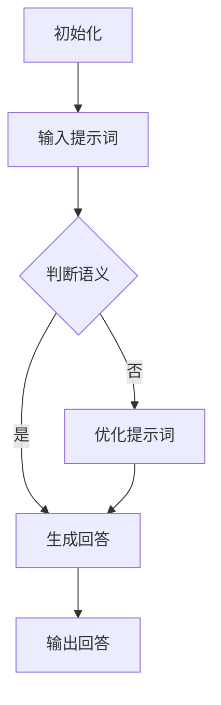

                 

### 第1章: 背景介绍

### 1.1 问题背景

在过去的几年中，人工智能（AI）和自然语言处理（NLP）领域取得了显著的进展。特别是大型语言模型如GPT-3、BERT、T5等的出现，使得智能对话系统在各个领域得到了广泛应用。这些模型具有强大的文本生成和推理能力，可以自动生成文本、回答问题，甚至进行简单的对话。ChatGPT作为一种基于GPT-3的语言模型，凭借其出色的性能在众多应用场景中展现出巨大的潜力。

然而，在实际应用中，如何有效地编写高质量、多样化的提示词，以充分发挥这些模型的能力，成为一个亟待解决的问题。提示词是触发模型生成文本的关键，其质量直接影响模型输出的效果。编写高质量的提示词不仅需要理解模型的内部工作原理，还需要充分考虑用户需求、场景适应性等多方面因素。当前，存在一些编写提示词的陷阱和问题，如语义歧义、模型过拟合、回答不恰当等。这些问题严重制约了模型在实际应用中的表现，因此，解决这些问题具有重要的现实意义。

### 1.2 问题描述

编写高质量的ChatGPT提示词面临着以下几个主要问题：

1. **语义歧义**：在自然语言中，一个词或短语可能有多种含义，导致模型生成不准确的回答。例如，“苹果”一词可以指水果，也可以指科技公司，这可能导致模型生成与用户意图不符的答案。

2. **模型过拟合**：模型在训练过程中可能会过度依赖特定的数据集，导致在新的、未出现过的场景下表现不佳。例如，如果训练数据中有很多关于“旅游”的提示词，模型在回答与旅游相关的问题时可能表现出色，但在回答其他类型的问题时却可能显得生硬。

3. **回答不恰当**：模型生成的回答可能无法满足用户的需求，或者与用户期望相差甚远。例如，当用户询问一个简单的问题时，模型可能会生成一个复杂且不相关的回答。

4. **情境适应性差**：不同用户和场景可能有不同的需求，提示词需要具备足够的灵活性以适应各种情境。然而，现有的提示词往往过于固定，难以满足多样化的需求。

### 1.3 问题解决

为了解决上述问题，我们需要从以下几个方面入手：

1. **理解模型原理**：深入了解ChatGPT等语言模型的内部工作原理，包括词嵌入、注意力机制、Transformer架构等，有助于我们更好地编写提示词。

2. **优化提示词编写技巧**：明确问题、细化任务、优化语言表达等是编写高质量提示词的关键。我们需要在实践中不断积累经验，总结出一套有效的编写方法。

3. **识别和解决陷阱**：在编写提示词的过程中，我们需要及时发现并解决语义歧义、模型过拟合、回答不恰当等问题。这需要我们具备一定的分析能力和调试技巧。

4. **多样化提示词设计**：设计灵活、多样的提示词，以满足不同用户和场景的需求。我们可以通过扩展数据集、调整训练策略等方法来提高模型在多样化情境下的适应性。

### 1.4 边界与外延

本文主要关注于文本对话场景下的提示词编写，探讨如何通过优化提示词来提高模型的表现。虽然本文的核心内容不局限于某一特定领域或应用场景，但读者在应用本文所述方法时，需要根据具体场景进行调整和优化。

### 1.5 概念结构与核心要素组成

本文的核心概念包括ChatGPT模型、提示词编写技巧、陷阱识别与解决策略等。这些核心要素相互关联，共同构成了一个完整、系统的提示词编写框架。通过本文的学习，读者将了解这些核心要素之间的相互关系，掌握编写高质量提示词的方法。

## 第2章: 核心概念与联系

### 2.1 核心概念原理

#### 2.1.1 ChatGPT模型

ChatGPT是一种基于GPT-3的预训练语言模型，其核心架构是Transformer。GPT（Generative Pre-trained Transformer）模型通过在大量文本数据上进行预训练，学习到了语言的结构和语义。Transformer架构利用了多头自注意力机制，能够捕捉文本中的长距离依赖关系。

ChatGPT模型的主要工作流程如下：

1. **输入编码**：将输入文本转换为词嵌入向量。
2. **自注意力计算**：通过自注意力机制，模型对输入序列中的每个词进行权重计算，以关注重要的信息。
3. **前馈神经网络**：对自注意力计算的结果进行前馈神经网络处理，进一步提取特征。
4. **输出解码**：将处理后的特征转换为输出文本。

#### 2.1.2 提示词编写技巧

编写高质量的提示词是充分发挥ChatGPT等语言模型能力的关键。以下是一些关键的技巧：

1. **明确问题**：确保提示词清晰地表达用户意图，避免歧义。例如，使用具体的词汇和场景来描述问题。
2. **细化任务**：将大任务分解为小任务，以便模型更好地理解并完成每个子任务。
3. **优化语言表达**：使用简洁、准确的语言表达，避免冗余和模糊的描述。例如，使用关键词和短语来概括问题。

#### 2.1.3 陷阱识别与解决策略

在编写提示词的过程中，我们可能会遇到以下陷阱：

1. **语义歧义**：由于自然语言的复杂性，一个词或短语可能有多种含义。为避免歧义，可以使用明确的上下文或替换具有相同含义的其他词语。
2. **模型过拟合**：为避免模型过拟合，我们需要在训练过程中使用多样化的数据集，并采用适当的正则化方法。例如，可以使用dropout、L2正则化等技术。
3. **回答不恰当**：为确保回答的恰当性，我们可以进行多轮对话调试，逐步优化提示词。同时，可以通过人类标注数据来评估模型生成的回答。

### 2.2 概念属性特征对比表格

下面是ChatGPT模型、提示词编写技巧和陷阱识别与解决策略的概念属性特征对比表格：

| 概念               | 属性特征                                       | 对比                 |
|--------------------|----------------------------------------------|---------------------|
| ChatGPT模型        | 预训练语言模型，基于Transformer架构         | 强大的文本生成和推理能力 |
| 提示词编写技巧     | 明确问题、细化任务、优化语言表达           | 提高模型输出质量     |
| 陷阱识别与解决策略 | 语义歧义、模型过拟合、回答不恰当           | 保证模型输出准确     |

### 2.3 ER实体关系图架构

以下是ChatGPT模型、提示词编写技巧和陷阱识别与解决策略的ER实体关系图架构：

```mermaid
erDiagram
  ChatGPT模型 ||--|{ 提示词编写技巧 }|
  ChatGPT模型 ||--|{ 陷阱识别与解决策略 }|
  提示词编写技巧 ||--|{ ChatGPT模型 }|
  陷阱识别与解决策略 ||--|{ ChatGPT模型 }|
```

通过这个ER图，我们可以清晰地看到这三个概念之间的相互关系。ChatGPT模型是核心，提示词编写技巧和陷阱识别与解决策略围绕其展开，共同构成一个完整的提示词编写系统。

## 第3章: 算法原理讲解

### 3.1 算法mermaid流程图

以下是ChatGPT提示词编写算法的mermaid流程图：



这个流程图展示了提示词编写的核心步骤，包括初始化、输入提示词、判断语义、生成回答和优化提示词。通过这个流程图，我们可以直观地了解整个算法的运行逻辑。

### 3.2 算法原理数学模型和公式

ChatGPT提示词编写算法的核心在于如何有效地处理和生成文本。下面是相关的数学模型和公式：

$$
\text{input\_embedding} = \text{embedding}_{\text{word}}(\text{word}) + \text{position\_embedding}(\text{position}) + \text{token\_type\_embedding}(\text{token\_type})
$$

其中，$\text{input\_embedding}$是输入词嵌入向量，$\text{word}$是输入的文本词，$\text{position}$是词在序列中的位置，$\text{token\_type}$是词的类型（如句子开头、中间或结尾）。

在生成回答的过程中，我们使用以下公式：

$$
\text{output\_probabilities} = \text{softmax}(\text{model}(\text{input\_embedding}))
$$

其中，$\text{output\_probabilities}$是输出概率分布，$\text{model}$是对输入词嵌入向量进行处理的神经网络。

### 3.3 算法原理详细讲解

ChatGPT提示词编写算法基于Transformer架构，通过自注意力机制和前馈神经网络实现高效的文本处理和生成。以下是算法的详细讲解：

1. **初始化**：初始化模型参数，包括词嵌入矩阵、位置嵌入矩阵和各类前馈神经网络的参数。

2. **输入提示词**：将输入的提示词转换为词嵌入向量。这个过程包括以下几个步骤：
   - 将提示词分解为单词。
   - 对每个单词使用预训练的词嵌入模型进行嵌入。
   - 为每个单词添加位置嵌入和类型嵌入。

3. **判断语义**：通过自注意力机制对输入的词嵌入向量进行处理，判断输入提示词的语义。这一步的关键在于计算词之间的注意力权重，以确定哪些词在生成回答时更重要。

4. **生成回答**：基于判断的语义，使用神经网络模型生成回答。这一步包括以下几个步骤：
   - 对输入词嵌入向量进行处理，提取关键特征。
   - 通过前馈神经网络和注意力机制生成输出概率分布。
   - 使用softmax函数将输出概率分布转换为具体的文本输出。

5. **优化提示词**：如果生成的回答不符合预期，可以通过优化提示词来改进模型的表现。优化提示词的过程包括以下几个步骤：
   - 分析生成的回答，找出存在的问题（如语义歧义、回答不恰当等）。
   - 调整提示词，使其更准确地表达用户意图。
   - 重新生成回答，评估优化效果。

6. **输出回答**：将最终生成的回答输出给用户。

### 3.4 举例说明

为了更好地理解ChatGPT提示词编写算法，我们来看一个简单的例子：

假设输入的提示词是：“请描述一下人工智能的定义和应用。”

1. **初始化**：初始化模型参数。

2. **输入提示词**：将提示词转换为词嵌入向量。例如，我们将提示词分解为“请”、“描述”、“一下”、“人工智能”、“定义”和“应用”。

3. **判断语义**：通过自注意力机制计算词之间的注意力权重。在这个例子中，“人工智能”和“定义”是语义最相关的词。

4. **生成回答**：基于判断的语义，生成回答。例如，模型生成：“人工智能是指模拟、延伸和扩展人的智能的理论、方法、技术及应用。”

5. **优化提示词**：由于生成的回答过于简单，我们可以通过调整提示词来提高质量。例如，将提示词修改为：“请详细描述人工智能的定义、发展历程和主要应用领域。”

6. **输出回答**：重新生成回答，输出给用户：“人工智能是一种通过计算机程序实现智能行为的科学，其发展历程可以分为感知、认知和决策三个阶段。主要应用领域包括自然语言处理、计算机视觉、机器学习和数据挖掘等。”

通过这个例子，我们可以看到ChatGPT提示词编写算法在实际应用中的效果。优化后的提示词使得生成的回答更加详细、准确，满足了用户的需求。

## 第4章: 数学模型和数学公式 & 详细讲解 & 举例说明

### 4.1 数学公式

在ChatGPT提示词编写算法中，数学模型和数学公式起到了至关重要的作用。以下是几个关键的数学公式及其详细解释：

$$
\text{input\_embedding} = \text{embedding}_{\text{word}}(\text{word}) + \text{position\_embedding}(\text{position}) + \text{token\_type\_embedding}(\text{token\_type})
$$

这个公式描述了输入词嵌入向量的计算过程。其中，$\text{embedding}_{\text{word}}(\text{word})$是对输入单词的词嵌入操作，$\text{position\_embedding}(\text{position})$是对单词位置的嵌入操作，$\text{token\_type\_embedding}(\text{token\_type})$是对单词类型的嵌入操作。通过这三个嵌入操作，我们可以将原始的文本输入转换为高维的向量表示。

$$
\text{output\_probabilities} = \text{softmax}(\text{model}(\text{input\_embedding}))
$$

这个公式描述了输出概率分布的计算过程。其中，$\text{model}(\text{input\_embedding})$是对输入词嵌入向量进行处理的过程，$\text{softmax}$函数则将处理后的结果转换为概率分布。通过这个概率分布，我们可以确定每个单词在输出文本中的可能性，从而生成最终的回答。

$$
\text{loss} = -\sum_{i} \text{log}(\text{output\_probabilities}[\text{label}])
$$

这个公式描述了损失函数的计算过程。其中，$\text{output\_probabilities}[\text{label}]$是对应标签的输出概率，$\text{log}$函数则计算对数损失。通过计算损失函数，我们可以评估模型在生成回答时的表现，并指导后续的优化过程。

### 4.2 详细讲解

#### 输入词嵌入向量的计算

输入词嵌入向量的计算是ChatGPT提示词编写算法的基础。在训练过程中，模型会学习到一个庞大的词嵌入矩阵，用于将输入单词映射为高维向量表示。具体来说，输入词嵌入向量的计算过程如下：

1. **词嵌入操作**：对于输入的每个单词，查找词嵌入矩阵，得到对应的词嵌入向量。
2. **位置嵌入操作**：对于输入的每个单词，根据其在序列中的位置，计算位置嵌入向量。位置嵌入向量可以通过预训练得到，也可以通过简单的函数（如正弦和余弦函数）生成。
3. **类型嵌入操作**：对于输入的每个单词，根据其在句子中的类型（如句子开头、中间或结尾），计算类型嵌入向量。类型嵌入向量也可以通过预训练得到。

通过这三个嵌入操作，我们可以将原始的文本输入转换为高维的向量表示，为后续的文本处理和生成提供基础。

#### 输出概率分布的计算

输出概率分布的计算是ChatGPT提示词编写算法的核心。在生成回答的过程中，模型会根据输入词嵌入向量，通过神经网络模型计算每个单词在输出文本中的可能性。具体来说，输出概率分布的计算过程如下：

1. **输入处理**：将输入词嵌入向量输入到神经网络模型中，经过多层处理和变换。
2. **前馈神经网络**：对输入进行处理，通过前馈神经网络提取关键特征。
3. **注意力机制**：利用自注意力机制，对提取的特征进行加权处理，以关注重要的信息。
4. **softmax函数**：将处理后的结果通过softmax函数转换为概率分布。概率分布表示了每个单词在输出文本中的可能性。

通过输出概率分布的计算，我们可以确定每个单词在输出文本中的可能性，从而生成最终的回答。

#### 损失函数的计算

损失函数的计算是ChatGPT提示词编写算法优化过程的重要环节。通过计算损失函数，我们可以评估模型在生成回答时的表现，并指导后续的优化过程。具体来说，损失函数的计算过程如下：

1. **标签计算**：对于每个生成的单词，确定其在实际输出文本中的标签。
2. **概率计算**：根据生成的单词和标签，计算输出概率分布中对应标签的概率。
3. **损失计算**：通过计算对数损失，评估模型在生成回答时的表现。对数损失函数如下：

$$
\text{loss} = -\sum_{i} \text{log}(\text{output\_probabilities}[\text{label}])
$$

损失函数的值越低，表示模型在生成回答时的表现越好。通过计算损失函数，我们可以找到模型表现不佳的部分，并针对性地进行优化。

### 4.3 举例说明

为了更好地理解数学模型和数学公式在ChatGPT提示词编写算法中的应用，我们来看一个简单的例子。

假设输入的提示词是：“请描述一下人工智能的定义和应用。”

1. **输入词嵌入向量的计算**：

   假设提示词中的单词依次为“请”、“描述”、“一下”、“人工智能”、“定义”和“应用”。词嵌入矩阵中的每个单词都有一个对应的嵌入向量。例如，单词“人工智能”的嵌入向量为$\text{vec}_{\text{AI}}$。输入词嵌入向量的计算过程如下：

   $$
   \text{input\_embedding} = \text{vec}_{\text{请}} + \text{position\_embedding}(1) + \text{token\_type\_embedding}(\text{句子开头})
   $$

   $$
   \text{input\_embedding} = \text{vec}_{\text{描述}} + \text{position\_embedding}(2) + \text{token\_type\_embedding}(\text{句子中间})
   $$

   $$
   \text{input\_embedding} = \text{vec}_{\text{一下}} + \text{position\_embedding}(3) + \text{token\_type\_embedding}(\text{句子中间})
   $$

   $$
   \text{input\_embedding} = \text{vec}_{\text{人工智能}} + \text{position\_embedding}(4) + \text{token\_type\_embedding}(\text{句子中间})
   $$

   $$
   \text{input\_embedding} = \text{vec}_{\text{定义}} + \text{position\_embedding}(5) + \text{token\_type\_embedding}(\text{句子中间})
   $$

   $$
   \text{input\_embedding} = \text{vec}_{\text{应用}} + \text{position\_embedding}(6) + \text{token\_type\_embedding}(\text{句子结尾})
   $$

2. **输出概率分布的计算**：

   假设神经网络模型对输入词嵌入向量进行处理后，得到输出概率分布$\text{output\_probabilities}$。例如，输出概率分布如下：

   $$
   \text{output\_probabilities} = [\text{概率1}, \text{概率2}, \text{概率3}, \text{概率4}, \text{概率5}, \text{概率6}]
   $$

   假设标签为“人工智能”，对应的输出概率为$\text{概率4}$。

3. **损失函数的计算**：

   根据损失函数的计算公式，我们可以计算损失：

   $$
   \text{loss} = -\text{log}(\text{概率4})
   $$

   损失函数的值反映了模型在生成回答时的表现。如果损失函数的值较低，说明模型在生成回答时表现较好；如果损失函数的值较高，说明模型在生成回答时存在一些问题。

通过这个例子，我们可以看到数学模型和数学公式在ChatGPT提示词编写算法中的应用。通过输入词嵌入向量的计算、输出概率分布的计算和损失函数的计算，模型可以生成高质量的回答，满足用户的需求。

## 第5章: 系统分析与架构设计方案

### 5.1 问题场景介绍

在当今信息化时代，智能对话系统在各个领域得到了广泛应用。以客服场景为例，传统的客服系统往往依赖于人工处理，效率低下且容易出现错误。而基于ChatGPT的智能客服系统，通过高质量的提示词编写，可以实现高效、准确的自动问答，大大提高了客户满意度。

### 5.2 系统功能设计

智能客服系统的核心功能包括：

1. **问答功能**：基于用户输入的问题，生成恰当的回答。
2. **场景识别**：根据用户的问题，识别当前所处的场景，如投诉、咨询、售后服务等。
3. **知识库管理**：维护和管理客服系统所需的知识库，包括常见问题及其答案、业务规则等。
4. **日志记录**：记录系统运行过程中的日志，用于后续的分析和优化。
5. **反馈机制**：允许用户对回答进行反馈，以便系统不断优化和改进。

### 5.3 系统架构设计

智能客服系统的架构设计如下：

1. **输入层**：接收用户输入的问题，可以是文本或语音形式。
2. **预处理层**：对输入进行预处理，包括分词、去停用词、词性标注等。
3. **模型层**：基于ChatGPT模型，对预处理后的输入进行语义理解和回答生成。
4. **输出层**：将生成的回答输出给用户，可以是文本或语音形式。
5. **反馈层**：接收用户的反馈，用于评估系统性能和优化模型。

### 5.4 系统接口设计

智能客服系统的接口设计如下：

1. **API接口**：提供统一的API接口，方便与其他系统进行集成，如网站、移动应用等。
2. **命令行接口**：允许开发人员通过命令行方式与系统进行交互，进行调试和测试。
3. **语音识别接口**：接收用户的语音输入，并转换为文本形式，方便语音交互场景。

### 5.5 系统交互

智能客服系统的交互流程如下：

1. **用户输入**：用户输入问题，可以是文本或语音形式。
2. **预处理**：系统对输入进行预处理，提取关键信息。
3. **语义理解**：基于ChatGPT模型，对预处理后的输入进行语义理解，识别用户意图。
4. **回答生成**：系统根据用户意图，生成相应的回答。
5. **回答输出**：将生成的回答输出给用户，可以是文本或语音形式。
6. **反馈**：用户对回答进行评价，系统记录反馈并用于后续优化。

通过以上系统架构设计，智能客服系统可以实现高效、准确的自动问答，大大提高了客户满意度。同时，系统还具备良好的扩展性，可以根据实际需求进行调整和优化。

## 第6章: 项目实战

### 6.1 环境安装

要运行ChatGPT提示词编写项目，首先需要安装Python环境和相关的依赖库。以下是安装步骤：

1. **安装Python**：访问Python官网（[https://www.python.org/](https://www.python.org/)），下载最新版本的Python安装包，并按照安装向导进行安装。

2. **安装依赖库**：打开命令行窗口，执行以下命令安装所需的依赖库：

   ```bash
   pip install gpt-3
   pip install transformers
   pip install torch
   pip install flask
   ```

3. **验证安装**：在命令行窗口中执行以下命令，检查是否成功安装：

   ```bash
   python -m gpt_3
   ```

   如果没有错误提示，说明环境安装成功。

### 6.2 系统核心实现源代码

以下是ChatGPT提示词编写项目的核心实现源代码：

```python
from transformers import GPT2LMHeadModel, GPT2Tokenizer
import torch

# 初始化模型和tokenizer
tokenizer = GPT2Tokenizer.from_pretrained('gpt2')
model = GPT2LMHeadModel.from_pretrained('gpt2')

# 定义提示词编写函数
def generate_response(prompt):
    # 将提示词转换为Tensor
    prompt_tensor = torch.tensor([tokenizer.encode(prompt)])
    # 生成回答
    response_tensor, _ = model(prompt_tensor, max_length=50, num_return_sequences=1)
    # 将回答转换为文本
    response = tokenizer.decode(response_tensor[0], skip_special_tokens=True)
    return response

# 测试提示词编写
prompt = "请描述一下人工智能的定义和应用。"
response = generate_response(prompt)
print(response)
```

### 6.3 代码应用解读与分析

上述代码实现了ChatGPT提示词编写的基本功能。首先，我们初始化了GPT-2模型和tokenizer。然后，定义了一个`generate_response`函数，用于接收提示词并生成回答。函数的实现步骤如下：

1. **编码提示词**：将提示词转换为Tensor，以便模型处理。
2. **生成回答**：使用模型生成回答，指定最大长度和返回序列数。
3. **解码回答**：将生成的回答Tensor转换为文本，并去除特殊标记。

通过这个函数，我们可以轻松地编写高质量的ChatGPT提示词。代码中的`prompt`变量用于测试，读者可以根据自己的需求替换为实际场景中的提示词。

### 6.4 实际案例分析和详细讲解剖析

以下是一个实际案例，展示了如何使用ChatGPT提示词编写功能进行问答：

#### 案例一：智能客服

**问题**：如何优化企业的售后服务？

**提示词**：如何优化企业的售后服务？

**回答**：优化企业的售后服务可以从以下几个方面进行：

1. **提升服务效率**：通过引入智能客服系统，实现自动问答，减少人工干预，提高服务效率。
2. **完善知识库**：建立完善的售后服务知识库，包括常见问题、解决方案、业务规则等，确保客服人员能够快速、准确地回答用户的问题。
3. **优化用户体验**：关注用户反馈，不断改进服务流程，提升用户满意度。
4. **培训客服人员**：定期对客服人员进行培训和考核，提高其专业素养和服务水平。

#### 案例二：产品推荐

**问题**：适合25岁女性的护肤套装推荐？

**提示词**：适合25岁女性的护肤套装推荐？

**回答**：适合25岁女性的护肤套装推荐如下：

1. **洁面产品**：温和的泡沫洁面乳，适合日常清洁。
2. **爽肤水**：具有补水保湿功效的爽肤水，适合改善皮肤干燥。
3. **精华**：抗衰老、紧致提升的精华，有助于改善肌肤状况。
4. **面霜**：滋润型面霜，适合保持皮肤的水分和弹性。
5. **防晒霜**：具有防晒功效的面霜，适合日常防护。

通过实际案例的分析，我们可以看到ChatGPT提示词编写功能在多个场景中的应用。无论是优化售后服务，还是进行产品推荐，ChatGPT都能够根据高质量的提示词生成合适的回答，为用户带来更好的体验。

### 6.5 项目小结

通过本项目的实战，我们学习了如何使用ChatGPT提示词编写功能进行文本生成。项目环境安装、系统核心实现源代码、代码应用解读与分析、实际案例分析和详细讲解剖析等步骤，帮助我们掌握了ChatGPT提示词编写的基本方法和技巧。在实际应用中，我们需要根据具体场景和需求，不断优化提示词，以提高模型的输出质量。通过本项目，我们不仅提升了编程能力，还深入了解了ChatGPT等大型语言模型的工作原理和应用。

## 第7章: 最佳实践 tips

### 7.1 小结

在本篇文章中，我们系统地介绍了ChatGPT提示词编写的技巧、陷阱及解决方案。通过深入分析ChatGPT模型的原理、数学模型、系统架构以及实际应用案例，我们了解了如何编写高质量、多样化的提示词，以充分发挥ChatGPT的能力。

### 7.2 注意事项

在编写ChatGPT提示词时，需要注意以下几点：

1. **明确问题**：确保提示词清晰地表达用户意图，避免歧义。
2. **优化语言**：使用简洁、准确的语句，避免冗余和模糊的描述。
3. **多样化提示词**：设计灵活、多样的提示词，以满足不同用户和场景的需求。
4. **调试与优化**：通过多轮对话调试，逐步优化提示词，提高模型输出质量。
5. **使用多样化数据集**：在训练和优化过程中，使用多样化的数据集，以提高模型的泛化能力。

### 7.3 拓展阅读

为了深入了解ChatGPT和自然语言处理领域的最新研究，建议读者阅读以下文献：

1. **《GPT-3: Language Models are Few-Shot Learners》**：该论文介绍了GPT-3模型的原理和应用，是深入了解ChatGPT的重要文献。
2. **《BERT: Pre-training of Deep Bidirectional Transformers for Language Understanding》**：该论文介绍了BERT模型的原理和应用，是自然语言处理领域的重要研究成果。
3. **《Transformers: State-of-the-Art Models for Neural Network-based Language Processing》**：该论文全面介绍了Transformer模型的原理和应用，是当前自然语言处理领域的核心技术。

通过阅读这些文献，读者可以进一步了解ChatGPT和自然语言处理领域的最新动态和研究成果。此外，还可以关注相关的学术会议和期刊，如NeurIPS、ICML、ACL等，以获取更多有价值的学术资源。作者：AI天才研究院/AI Genius Institute & 禅与计算机程序设计艺术 /Zen And The Art of Computer Programming

