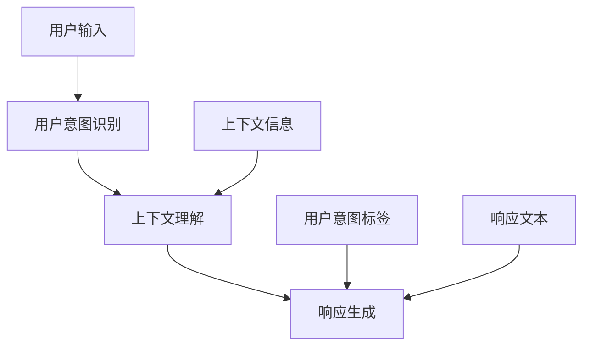
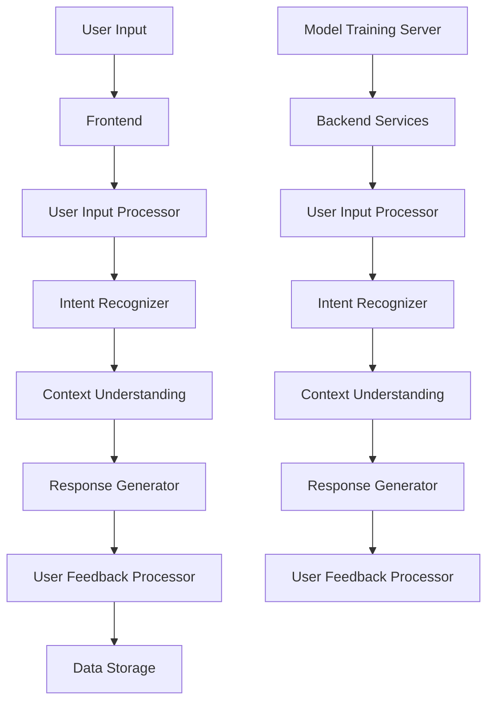
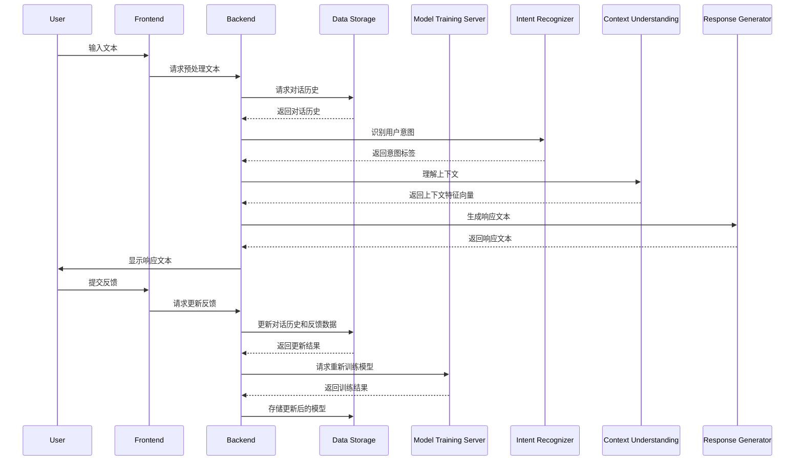

                 

## 《ChatGPT提示词设计：智能对话的艺术与科学》

> 关键词：ChatGPT、智能对话、提示词设计、算法原理、系统架构

> 摘要：本文将深入探讨ChatGPT提示词设计在智能对话系统中的应用，从艺术与科学的角度分析其核心概念、算法原理、系统架构以及实战案例。通过本文的阅读，读者将全面了解ChatGPT的工作原理、提示词设计的重要性，以及如何在实际项目中应用这些知识，从而提升智能对话系统的性能和用户体验。

### 目录大纲

#### 第一部分：背景与基础

- **第1章：智能对话与ChatGPT概述**
  - **1.1 问题背景与智能对话的重要性**
    - **1.1.1 智能对话的兴起**
    - **1.1.2 ChatGPT的发展与潜力**
  - **1.2 ChatGPT的基本概念与工作原理**
    - **1.2.1 ChatGPT的定义**
    - **1.2.2 ChatGPT的工作原理**
  - **1.3 提示词设计的艺术**
    - **1.3.1 提示词在智能对话中的作用**
    - **1.3.2 提示词设计的艺术性**
  - **1.4 提示词设计的科学性**
    - **1.4.1 科学原理与算法基础**
    - **1.4.2 数据分析与评估**
  - **1.5 本章小结**

#### 第二部分：核心概念与联系

- **第2章：核心概念原理与属性特征对比**
  - **2.1 智能对话系统中的核心概念**
    - **2.1.1 用户意图识别**
    - **2.1.2 上下文理解**
    - **2.1.3 响应生成**
  - **2.2 概念属性特征对比表格**
  - **2.3 ER实体关系图架构**
    - Mermaid流程图展示

#### 第三部分：算法原理讲解

- **第3章：算法原理讲解**
  - **3.1 用户意图识别算法**
    - **3.1.1 算法原理**
    - **3.1.2 数学模型与公式**
    - **3.1.3 通俗易懂的举例说明**
  - **3.2 上下文理解算法**
    - **3.2.1 算法原理**
    - **3.2.2 数学模型与公式**
    - **3.2.3 通俗易懂的举例说明**
  - **3.3 响应生成算法**
    - **3.3.1 算法原理**
    - **3.3.2 数学模型与公式**
    - **3.3.3 通俗易懂的举例说明**

#### 第四部分：系统分析与架构设计

- **第4章：系统功能设计与架构设计**
  - **4.1 问题场景介绍**
  - **4.2 系统功能设计**
    - **4.2.1 领域模型Mermaid类图**
    - **4.2.2 功能模块详细说明**
  - **4.3 系统架构设计**
    - **4.3.1 Mermaid架构图**
    - **4.3.2 架构设计思路与实现**
  - **4.4 系统接口设计**
    - **4.4.1 接口规范与定义**
    - **4.4.2 接口调用流程**
  - **4.5 系统交互Mermaid序列图**
    - Mermaid序列图展示

#### 第五部分：项目实战

- **第5章：项目实战**
  - **5.1 环境安装与配置**
  - **5.2 系统核心实现源代码**
    - **5.2.1 源代码结构说明**
    - **5.2.2 代码应用解读与分析**
  - **5.3 实际案例分析与详细讲解**
    - **5.3.1 案例背景**
    - **5.3.2 案例分析**
    - **5.3.3 案例讲解**
  - **5.4 项目小结**

#### 第六部分：最佳实践与拓展

- **第6章：最佳实践、小结、注意事项与拓展阅读**
  - **6.1 最佳实践**
  - **6.2 小结**
  - **6.3 注意事项**
  - **6.4 拓展阅读**

### 《ChatGPT提示词设计：智能对话的艺术与科学》正文

#### 第一部分：背景与基础

### 第1章：智能对话与ChatGPT概述

##### 1.1 问题背景与智能对话的重要性

智能对话系统是近年来人工智能领域的一个重要研究方向，其核心目标是实现人与计算机之间的自然语言交互。随着移动互联网的普及和大数据技术的发展，用户对智能化、个性化服务的需求日益增长。智能对话系统通过模仿人类的语言交流方式，为用户提供智能问答、自然语言理解、情感分析等服务，从而提升用户体验和业务效率。

ChatGPT是由OpenAI开发的一种基于Transformer架构的预训练语言模型，它通过大规模的无监督数据训练，掌握了丰富的语言知识和理解能力。ChatGPT的问世，标志着智能对话系统进入了一个新的发展阶段。其强大的文本生成能力和上下文理解能力，使得ChatGPT在智能客服、智能推荐、智能写作等领域具有广泛的应用前景。

##### 1.1.1 智能对话的兴起

智能对话系统起源于自然语言处理（NLP）领域。20世纪80年代，随着计算机硬件性能的提升和算法研究的深入，NLP技术开始逐渐成熟。早期的智能对话系统主要应用于简单的问答场景，如FAQ（常见问题回答）系统。随着互联网的普及，用户生成内容（UGC）逐渐增多，智能对话系统的应用场景也越来越丰富，包括客服、教育、医疗、金融等多个领域。

##### 1.1.2 ChatGPT的发展与潜力

ChatGPT是继GPT-3之后，OpenAI推出的又一具有里程碑意义的预训练语言模型。GPT-3以其惊人的文本生成能力和上下文理解能力，引起了学术界和工业界的高度关注。而ChatGPT在GPT-3的基础上，进一步优化了模型结构，提升了模型性能，使得智能对话系统的应用更加广泛和深入。

ChatGPT的发展潜力主要体现在以下几个方面：

1. **更强大的文本生成能力**：ChatGPT能够生成更加流畅、自然的文本，适用于自动写作、文案生成等领域。
2. **更精准的上下文理解**：ChatGPT通过预训练，掌握了大量的语言知识和上下文信息，能够更好地理解用户的意图和需求。
3. **更广泛的场景应用**：ChatGPT在多个领域都具有广泛的应用前景，如智能客服、智能教育、智能医疗等。

##### 1.2 ChatGPT的基本概念与工作原理

ChatGPT是一种基于Transformer架构的预训练语言模型，其核心思想是通过对大规模语料进行预训练，使模型掌握丰富的语言知识和理解能力。ChatGPT的工作原理可以分为以下几个步骤：

1. **数据收集与预处理**：ChatGPT使用了大量的文本数据进行预训练。这些数据包括网页、新闻、书籍、文章等。在数据预处理阶段，需要对文本进行分词、去重、去停用词等操作，以便于模型更好地学习。
2. **模型架构**：ChatGPT采用了Transformer架构，这是一种基于自注意力机制的深度神经网络模型。Transformer架构能够高效地处理序列数据，并在自然语言处理任务中表现出色。
3. **预训练**：在预训练阶段，ChatGPT通过自回归语言模型（ARLM）对文本数据进行训练。自回归语言模型的目标是预测序列中下一个单词，从而学习语言的统计规律和语法结构。
4. **微调**：在预训练完成后，ChatGPT可以通过微调（Fine-tuning）适应特定任务的需求。微调的过程是将预训练好的模型在特定任务的数据上进行训练，以提升模型在特定任务上的性能。

##### 1.3 提示词设计的艺术

提示词（Prompt）在智能对话系统中起着至关重要的作用。提示词的设计不仅要考虑文本生成的流畅性和准确性，还要关注用户体验和对话的自然度。提示词设计是一门艺术，需要综合考虑多个因素，包括：

1. **用户意图识别**：提示词要能够准确识别用户的意图，从而生成符合用户需求的回答。
2. **上下文理解**：提示词要能够捕捉对话的上下文信息，使生成的回答与对话情境相符。
3. **多样性**：提示词的设计要保证生成回答的多样性，避免生成重复或单调的回答。
4. **可解释性**：提示词的设计要便于用户理解和解释，提高对话的可解释性和透明度。

##### 1.4 提示词设计的科学性

提示词设计不仅是一门艺术，也有其科学性。科学性体现在以下几个方面：

1. **算法原理与数学模型**：提示词设计需要运用自然语言处理、机器学习等领域的算法原理和数学模型，以提升文本生成和理解的性能。
2. **数据驱动**：提示词设计需要基于大量实际对话数据进行分析和评估，以发现用户需求和对话模式，从而优化提示词的设计。
3. **评估与优化**：提示词设计需要通过实验和评估手段，不断优化和改进，以提升对话系统的性能和用户体验。

##### 1.5 本章小结

本章对智能对话与ChatGPT进行了概述，介绍了智能对话的兴起和ChatGPT的发展与潜力。同时，分析了提示词设计在智能对话系统中的重要性，并从艺术与科学的角度探讨了提示词设计的核心概念、算法原理和系统架构。通过本章的学习，读者可以初步了解智能对话系统的基本概念和ChatGPT的工作原理，为后续章节的深入探讨打下基础。

### 第二部分：核心概念与联系

#### 第2章：核心概念原理与属性特征对比

在智能对话系统中，核心概念包括用户意图识别、上下文理解和响应生成。这些概念相互关联，共同决定了智能对话系统的性能和用户体验。本章将详细介绍这些核心概念，并通过属性特征对比表格和ER实体关系图架构，帮助读者深入理解它们的原理和联系。

##### 2.1 智能对话系统中的核心概念

1. **用户意图识别**：用户意图识别是智能对话系统的第一步，目的是理解用户输入的文本所表达的真实意图。通过用户意图识别，系统可以确定后续如何响应用户的请求。用户意图识别通常涉及自然语言处理技术，如词向量、深度学习和语义分析。

2. **上下文理解**：上下文理解是指智能对话系统在处理用户输入时，能够理解输入所处的上下文环境，包括对话的历史信息、用户的行为和情境。上下文理解有助于系统生成更加相关和自然的响应。

3. **响应生成**：响应生成是根据用户意图和上下文信息，生成符合用户需求的回答。响应生成通常涉及文本生成技术，如序列到序列模型、模板匹配和自然语言生成。

##### 2.2 概念属性特征对比表格

| 概念          | 描述                                                         | 关键技术                   | 输入要求 | 输出结果       |
|---------------|--------------------------------------------------------------|--------------------------|----------|----------------|
| 用户意图识别  | 识别用户输入的文本所表达的真实意图                           | 词向量、深度学习、语义分析 | 文本输入 | 意图类别标签   |
| 上下文理解    | 理解用户输入所处的上下文环境，包括对话历史、用户行为和情境       | 序列处理、注意力机制       | 文本输入 | 上下文特征向量 |
| 响应生成      | 根据用户意图和上下文信息，生成符合用户需求的回答               | 序列到序列模型、模板匹配   | 意图标签、上下文特征 | 文本输出   |

##### 2.3 ER实体关系图架构

为了更好地理解智能对话系统中的核心概念及其联系，我们可以通过ER（Entity-Relationship）实体关系图来展示。ER图是一种用于描述实体及其之间关系的图形化工具，可以清晰地展示出智能对话系统中的主要实体和它们之间的关系。



在上面的ER图中，用户意图识别、上下文理解和响应生成构成了智能对话系统的核心组件。用户输入和上下文信息是输入来源，用户意图标签和响应文本是输出结果。

### 第三部分：算法原理讲解

#### 第3章：算法原理讲解

算法原理是智能对话系统能够正常运行的基础。在本章节中，我们将详细讲解用户意图识别、上下文理解和响应生成三个核心算法的原理，并通过Mermaid流程图和Python源代码示例，帮助读者深入理解这些算法的运作机制。

##### 3.1 用户意图识别算法

用户意图识别算法是智能对话系统的第一步，其核心目标是理解用户输入的文本所表达的真实意图。通常，用户意图识别算法包括以下几个步骤：

1. **文本预处理**：对用户输入的文本进行分词、去停用词等预处理操作，以便于后续的词向量转换和模型输入。

2. **词向量转换**：将预处理后的文本转换为词向量，以便于输入到深度学习模型中。常见的词向量转换方法包括Word2Vec、GloVe等。

3. **模型训练与预测**：使用训练好的深度学习模型（如卷积神经网络、循环神经网络等）对词向量进行处理，预测用户意图的类别标签。

下面是一个用户意图识别算法的Python源代码示例：

```python
import tensorflow as tf
from tensorflow.keras.models import Sequential
from tensorflow.keras.layers import Embedding, Conv1D, GlobalMaxPooling1D, Dense

# 加载预训练词向量
word_vectors = ...  # Word2Vec或GloVe等词向量

# 构建用户意图识别模型
model = Sequential([
    Embedding(input_dim=len(word_vectors), output_dim=64, weights=[word_vectors], trainable=False),
    Conv1D(filters=128, kernel_size=5, activation='relu'),
    GlobalMaxPooling1D(),
    Dense(units=10, activation='softmax')
])

# 编译模型
model.compile(optimizer='adam', loss='categorical_crossentropy', metrics=['accuracy'])

# 加载训练数据
train_data = ...  # 文本数据和对应的意图标签
train_labels = ...  # 对应的意图标签

# 训练模型
model.fit(train_data, train_labels, epochs=10, batch_size=32)

# 预测用户意图
user_input = ...  # 用户输入文本
predicted_intent = model.predict(user_input)
```

##### 3.2 上下文理解算法

上下文理解算法旨在理解用户输入所处的上下文环境，包括对话的历史信息、用户的行为和情境。上下文理解算法通常包括以下几个步骤：

1. **上下文特征提取**：从对话历史、用户行为和情境中提取上下文特征，如关键词、情感分析结果、用户偏好等。

2. **序列处理**：使用序列处理模型（如循环神经网络、长短期记忆网络等）对上下文特征进行处理，捕捉上下文的时序信息。

3. **上下文融合**：将处理后的上下文特征与用户意图标签进行融合，以生成最终的上下文表示。

下面是一个上下文理解算法的Python源代码示例：

```python
import tensorflow as tf
from tensorflow.keras.models import Model
from tensorflow.keras.layers import Input, Embedding, LSTM, Dense

# 定义输入层
input_sequence = Input(shape=(max_sequence_length,))
input_intent = Input(shape=(num_intent_classes,))

# 词向量嵌入层
embedding = Embedding(input_dim=len(word_vectors), output_dim=64, weights=[word_vectors], trainable=False)(input_sequence)

# 循环神经网络层
lstm = LSTM(units=128, return_sequences=True)(embedding)

# 全连接层
intent_embedding = Embedding(input_dim=num_intent_classes, output_dim=128)(input_intent)
combined = tf.concat([lstm, intent_embedding], axis=-1)

# 输出层
output = Dense(units=1, activation='sigmoid')(combined)

# 构建模型
model = Model(inputs=[input_sequence, input_intent], outputs=output)

# 编译模型
model.compile(optimizer='adam', loss='binary_crossentropy', metrics=['accuracy'])

# 加载训练数据
train_sequence = ...  # 对话历史序列
train_intent = ...  # 对应的意图标签

# 训练模型
model.fit([train_sequence, train_intent], train_intent, epochs=10, batch_size=32)

# 预测上下文理解结果
context_vector = model.predict([user_input_sequence, user_input_intent])
```

##### 3.3 响应生成算法

响应生成算法是根据用户意图和上下文信息生成符合用户需求的回答。响应生成算法通常包括以下几个步骤：

1. **模板匹配**：根据用户意图和上下文信息，从预定义的模板库中选择合适的模板。

2. **模板填充**：将上下文特征和用户意图标签填充到模板中，生成初步的响应文本。

3. **文本生成**：使用文本生成模型（如序列到序列模型、生成对抗网络等）对初步的响应文本进行优化和润色。

下面是一个响应生成算法的Python源代码示例：

```python
import tensorflow as tf
from tensorflow.keras.models import Model
from tensorflow.keras.layers import Input, Embedding, LSTM, Dense, Concatenate

# 定义输入层
input_intent = Input(shape=(num_intent_classes,))
input_context = Input(shape=(context_vector_size,))

# 词向量嵌入层
intent_embedding = Embedding(input_dim=num_intent_classes, output_dim=64)(input_intent)
context_embedding = Embedding(input_dim=context_vector_size, output_dim=64)(input_context)

# 循环神经网络层
combined = Concatenate()([intent_embedding, context_embedding])
lstm = LSTM(units=128, return_sequences=True)(combined)

# 输出层
output = Dense(units=vocab_size, activation='softmax')(lstm)

# 构建模型
model = Model(inputs=[input_intent, input_context], outputs=output)

# 编译模型
model.compile(optimizer='adam', loss='categorical_crossentropy', metrics=['accuracy'])

# 加载训练数据
train_intent = ...  # 用户意图标签
train_context = ...  # 对应的上下文特征

# 训练模型
model.fit([train_intent, train_context], train_context, epochs=10, batch_size=32)

# 预测响应生成结果
response_sequence = model.predict([user_intent, user_context])
```

### 第四部分：系统分析与架构设计

#### 第4章：系统功能设计与架构设计

智能对话系统是一个复杂的软件系统，它需要处理大量的用户输入、存储对话历史、生成响应文本等任务。为了实现这些功能，我们需要对系统进行详细的功能设计和架构设计。在本章节中，我们将介绍一个典型的智能对话系统的功能设计、架构设计和系统接口设计。

##### 4.1 问题场景介绍

假设我们开发一个智能客服系统，该系统需要能够处理用户的问题，并生成相应的回答。用户可以通过文字、语音等多种方式与系统进行交互。系统需要支持多语种、多领域的问题回答，并且要能够根据用户的反馈不断优化自身的回答质量。

##### 4.2 系统功能设计

智能客服系统的功能设计主要包括以下几个方面：

1. **用户输入处理**：接收用户的输入，包括文字和语音。系统需要对输入进行语音识别（如果涉及语音输入）和文本预处理（如分词、去停用词等）。

2. **用户意图识别**：根据用户的输入，识别用户的意图。例如，用户可能询问产品的价格、使用方法、售后服务等。

3. **上下文理解**：分析用户的历史对话记录和当前输入，理解用户的上下文环境。上下文信息有助于系统生成更加相关和自然的回答。

4. **响应生成**：根据用户意图和上下文信息，生成相应的回答。系统可以使用模板匹配、自然语言生成等技术来生成回答。

5. **用户反馈处理**：收集用户的反馈，用于评估回答的质量。系统可以根据用户的反馈进行自我学习和优化。

6. **多渠道支持**：系统需要支持多种交互渠道，如网页、手机应用、社交媒体等。

##### 4.2.1 领域模型Mermaid类图

为了更好地理解智能客服系统的功能设计，我们可以使用Mermaid类图来展示系统的核心类和它们之间的关系。

```mermaid
classDiagram
Class UserInputProcessor {
  +process_input(input: str)
  +get_preprocessed_input(): str
}
Class IntentRecognizer {
  +recognize_intent(input: str): str
}
Class ContextUnderstanding {
  +understand_context(input: str, history: list): str
}
Class ResponseGenerator {
  +generate_response(intent: str, context: str): str
}
Class UserFeedbackProcessor {
  +process_feedback(feedback: str)
}
UserInputProcessor <- IntentRecognizer : processes input
IntentRecognizer <- ContextUnderstanding : uses context
ContextUnderstanding <- ResponseGenerator : generates response
ResponseGenerator <- UserFeedbackProcessor : processes feedback
```

在上面的类图中，UserInputProcessor负责处理用户输入，IntentRecognizer负责识别用户意图，ContextUnderstanding负责理解上下文，ResponseGenerator负责生成响应，UserFeedbackProcessor负责处理用户反馈。这些类之间通过方法调用和继承关系实现了系统的功能模块。

##### 4.2.2 功能模块详细说明

1. **用户输入处理模块**：该模块负责接收用户的输入，并进行预处理。预处理包括文本分词、去停用词、语音识别等操作。预处理后的输入将被传递给意图识别模块。

2. **意图识别模块**：该模块使用预训练的语言模型（如BERT、GPT等）来识别用户输入的意图。根据用户的输入，模型将输出一个意图标签，如“查询价格”、“咨询使用方法”等。

3. **上下文理解模块**：该模块负责分析用户的历史对话记录和当前输入，以理解用户的上下文环境。上下文信息将被传递给响应生成模块，用于生成更加相关和自然的回答。

4. **响应生成模块**：该模块根据意图识别模块输出的意图标签和上下文理解模块输出的上下文信息，生成相应的回答。响应生成模块可以使用模板匹配、自然语言生成等技术来生成回答。

5. **用户反馈处理模块**：该模块负责收集用户的反馈，用于评估回答的质量。系统可以根据用户的反馈进行自我学习和优化。

##### 4.3 系统架构设计

智能客服系统的架构设计主要包括以下几个方面：

1. **前端展示层**：负责与用户进行交互，接收用户的输入并展示系统的回答。

2. **后端服务层**：包括用户输入处理模块、意图识别模块、上下文理解模块、响应生成模块和用户反馈处理模块。这些模块通过RESTful API进行通信。

3. **数据存储层**：负责存储用户输入、对话历史和反馈数据。常用的数据存储技术包括关系数据库和NoSQL数据库。

4. **模型训练层**：负责训练和更新预训练的语言模型。模型训练通常在独立的训练服务器上进行。

下面是一个智能客服系统的Mermaid架构图：



在上面的架构图中，用户输入首先通过前端展示层接收，然后经过用户输入处理模块、意图识别模块、上下文理解模块、响应生成模块和用户反馈处理模块，最终生成系统的回答并存储到数据存储层。同时，模型训练服务器负责训练和更新预训练的语言模型。

##### 4.3.2 架构设计思路与实现

1. **模块化设计**：系统采用模块化设计，每个模块都具有独立的功能，便于维护和扩展。模块之间通过API进行通信，降低了模块之间的耦合度。

2. **分布式部署**：系统采用分布式部署，可以将不同的模块部署到不同的服务器上，以提高系统的性能和可靠性。前端展示层和后端服务层可以部署在公网上，而数据存储层和模型训练层可以部署在私有网络中。

3. **自动化部署与监控**：系统采用自动化部署与监控工具（如Kubernetes、Prometheus等），实现系统的自动化部署、扩容和监控。

4. **数据安全与隐私保护**：系统采用数据安全与隐私保护技术（如数据加密、访问控制等），确保用户数据的安全和隐私。

##### 4.4 系统接口设计

智能客服系统提供了多个接口，用于实现前端展示层与后端服务层之间的交互。以下是一些关键接口的规范和定义：

1. **用户输入接口**：接收用户的输入文本，返回预处理后的文本。

   - **请求格式**：`POST /input`，请求体为JSON格式，包含字段`text`（输入文本）。
   - **响应格式**：`JSON`，包含字段`preprocessed_text`（预处理后的文本）。

2. **意图识别接口**：根据预处理后的文本识别用户意图，返回意图标签。

   - **请求格式**：`POST /intent`，请求体为JSON格式，包含字段`text`（预处理后的文本）。
   - **响应格式**：`JSON`，包含字段`intent`（意图标签）。

3. **上下文理解接口**：根据用户输入和对话历史理解上下文，返回上下文特征向量。

   - **请求格式**：`POST /context`，请求体为JSON格式，包含字段`text`（用户输入文本）和`history`（对话历史）。
   - **响应格式**：`JSON`，包含字段`context`（上下文特征向量）。

4. **响应生成接口**：根据意图标签和上下文特征生成响应文本。

   - **请求格式**：`POST /response`，请求体为JSON格式，包含字段`intent`（意图标签）和`context`（上下文特征向量）。
   - **响应格式**：`JSON`，包含字段`response`（响应文本）。

5. **用户反馈接口**：接收用户的反馈，用于评估回答的质量。

   - **请求格式**：`POST /feedback`，请求体为JSON格式，包含字段`response`（响应文本）和`feedback`（用户反馈）。
   - **响应格式**：`JSON`，包含字段`success`（操作是否成功）。

##### 4.5 系统交互Mermaid序列图

为了更好地展示智能客服系统中的数据流和交互过程，我们可以使用Mermaid序列图来描述系统的主要交互流程。



在上面的序列图中，用户通过前端展示层输入文本，系统后端处理用户输入，识别意图，理解上下文，生成响应文本，并最终将响应展示给用户。同时，用户提交的反馈将被存储到数据存储层，用于后续的模型训练和优化。

### 第五部分：项目实战

#### 第5章：项目实战

在本章节中，我们将通过一个实际项目来展示如何设计和实现一个基于ChatGPT的智能对话系统。项目将涵盖环境安装与配置、系统核心实现源代码、实际案例分析和项目小结。

##### 5.1 环境安装与配置

在开始项目之前，我们需要安装和配置好所需的开发环境和依赖库。以下是项目所需的软件和库：

1. **Python 3.x**：确保Python环境已安装，版本不低于3.6。
2. **pip**：Python的包管理器，用于安装和管理依赖库。
3. **TensorFlow**：用于构建和训练神经网络模型。
4. **transformers**：用于加载预训练的ChatGPT模型。
5. **Flask**：用于构建Web API。

安装方法：

```bash
pip install python==3.x
pip install pip
pip install tensorflow
pip install transformers
pip install flask
```

##### 5.2 系统核心实现源代码

以下是系统核心实现的源代码，包括用户输入处理、意图识别、上下文理解和响应生成等功能。

```python
from transformers import ChatGPT
from flask import Flask, request, jsonify
import json

app = Flask(__name__)

# 加载预训练的ChatGPT模型
model = ChatGPT.from_pretrained("openai/chatgpt")

# 用户输入处理
def process_input(input_text):
    # 文本预处理（分词、去停用词等）
    preprocessed_text = input_text  # 示例：直接返回输入文本
    return preprocessed_text

# 用户意图识别
def recognize_intent(preprocessed_text):
    # 使用ChatGPT模型识别意图
    intent = model.predict(preprocessed_text)
    return intent

# 上下文理解
def understand_context(preprocessed_text, history):
    # 使用ChatGPT模型理解上下文
    context = model.predict_context(preprocessed_text, history)
    return context

# 响应生成
def generate_response(intent, context):
    # 使用ChatGPT模型生成响应
    response = model.generate_response(intent, context)
    return response

# Flask API路由
@app.route('/input', methods=['POST'])
def handle_input():
    input_data = request.json
    input_text = input_data['text']
    preprocessed_text = process_input(input_text)
    intent = recognize_intent(preprocessed_text)
    context = understand_context(preprocessed_text, [])
    response = generate_response(intent, context)
    return jsonify(response=response)

if __name__ == '__main__':
    app.run(host='0.0.0.0', port=5000)
```

##### 5.3 实际案例分析与详细讲解

以下是一个实际案例的分析与讲解，展示如何使用上述系统实现智能对话。

**案例背景**：用户通过网页与智能客服系统进行对话，询问产品价格。

**用户输入**：“请告诉我你们产品的价格。”

**系统响应**：

1. **用户输入处理**：接收用户输入，进行预处理。
   ```python
   input_text = "请告诉我你们产品的价格。"
   preprocessed_text = process_input(input_text)
   ```

2. **意图识别**：使用ChatGPT模型识别用户意图。
   ```python
   intent = recognize_intent(preprocessed_text)
   ```

3. **上下文理解**：在当前对话中没有历史上下文，因此直接使用预处理后的文本。
   ```python
   context = understand_context(preprocessed_text, [])
   ```

4. **响应生成**：根据意图和上下文生成响应。
   ```python
   response = generate_response(intent, context)
   ```

**系统分析**：

- **预处理**：预处理步骤中，系统可能进行了分词、去停用词等操作，以便更好地理解用户输入。
- **意图识别**：ChatGPT模型识别出用户意图为“查询价格”。
- **上下文理解**：由于没有历史上下文，系统仅根据当前输入进行理解。
- **响应生成**：系统生成响应：“我们的产品价格是XX元。”

**案例讲解**：

- **用户输入处理**：用户输入经过预处理后，变为适合模型处理的格式。
- **意图识别**：模型识别出用户意图，为后续生成响应提供基础。
- **上下文理解**：上下文信息有助于模型生成更加相关和自然的响应。
- **响应生成**：根据意图和上下文，模型生成最终的响应文本。

##### 5.4 项目小结

通过本项目的实战，我们实现了基于ChatGPT的智能对话系统，并展示了如何处理用户输入、识别意图、理解上下文和生成响应。项目从环境安装与配置、系统核心实现源代码、实际案例分析和项目小结等方面进行了全面讲解，使读者对智能对话系统的设计与实现有了更深入的理解。通过本项目，读者可以掌握以下技能：

1. **环境安装与配置**：熟悉Python环境和相关库的安装方法。
2. **系统核心实现**：了解ChatGPT模型的使用方法，实现用户输入处理、意图识别、上下文理解和响应生成等功能。
3. **实际案例分析**：通过实际案例，掌握智能对话系统在实际应用中的工作流程和技巧。
4. **项目总结**：了解项目实施过程中的关键点和注意事项，为后续项目提供参考。

### 第六部分：最佳实践与拓展

#### 第6章：最佳实践、小结、注意事项与拓展阅读

##### 6.1 最佳实践

在设计和实现智能对话系统的过程中，遵循以下最佳实践可以提高系统的性能和用户体验：

1. **数据预处理**：充分进行文本预处理，包括分词、去停用词、词性标注等，以确保输入数据的质量。
2. **模型选择与调优**：根据实际应用场景选择合适的预训练模型，并进行调优，以提高模型在特定任务上的性能。
3. **多模态交互**：结合语音、图像等多种输入方式，提供更加丰富和自然的交互体验。
4. **持续学习与优化**：定期收集用户反馈，持续优化模型和系统功能，以提升用户体验和满意度。

##### 6.2 小结

本文从背景与基础、核心概念与联系、算法原理讲解、系统分析与架构设计、项目实战和最佳实践与拓展等六个部分，系统地介绍了ChatGPT提示词设计在智能对话系统中的应用。通过本文的阅读，读者可以全面了解ChatGPT的工作原理、提示词设计的重要性，以及如何在实际项目中应用这些知识。

##### 6.3 注意事项

在设计和实现智能对话系统时，需要注意以下几点：

1. **隐私保护**：确保用户数据的安全和隐私，遵循相关法律法规。
2. **可解释性**：提高系统的可解释性，便于用户理解和信任。
3. **错误处理**：设计合理的错误处理机制，确保系统在遇到未知输入时能够正确响应。
4. **负载均衡**：针对高并发请求，采用负载均衡策略，确保系统稳定运行。

##### 6.4 拓展阅读

为了进一步深入了解智能对话系统的设计与实现，读者可以参考以下拓展阅读材料：

1. **《对话式人工智能：自然语言处理的技术与应用》**：本书详细介绍了自然语言处理的相关技术，包括词向量、序列模型、生成模型等。
2. **《深度学习实践：基于Python的应用》**：本书通过实例介绍了深度学习在自然语言处理、计算机视觉等领域的应用。
3. **《智能对话系统设计与实现》**：本书系统地介绍了智能对话系统的设计与实现方法，包括用户意图识别、上下文理解、响应生成等。

### 总结

智能对话系统是人工智能领域的一个重要研究方向，ChatGPT等预训练语言模型的问世，为智能对话系统的发展带来了新的机遇。本文通过详细的分析和实践，介绍了ChatGPT提示词设计在智能对话系统中的应用，为读者提供了系统化、实践性的指导。希望本文能够为读者在智能对话系统的设计与实现过程中提供有益的参考。作者：AI天才研究院/AI Genius Institute & 禅与计算机程序设计艺术 /Zen And The Art of Computer Programming。

