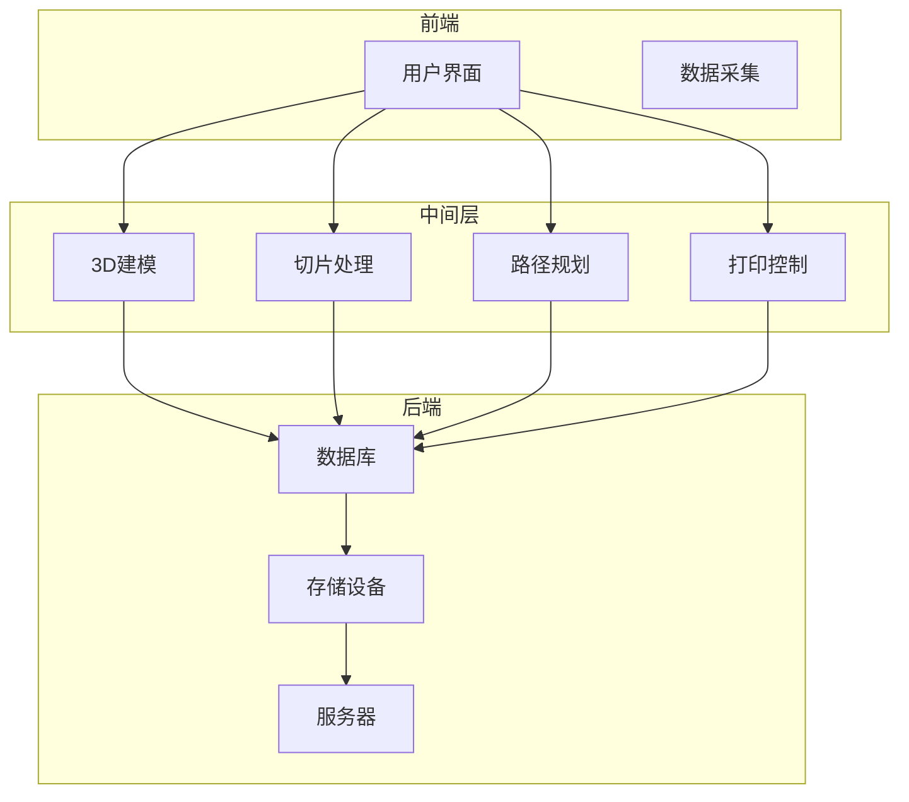

                 

## 《3D打印技术在个性化医疗中的应用》

### 关键词：3D打印、个性化医疗、算法原理、系统架构、项目实战

#### 摘要：
随着医疗个性化需求的日益增长，3D打印技术在医疗领域的应用逐渐成为焦点。本文将详细介绍3D打印技术在个性化医疗中的应用，包括其基本概念、核心概念、算法原理、系统设计与项目实战。通过本文，读者可以全面了解3D打印技术在个性化医疗中的重要性及其实际应用场景。

### 目录大纲设计思路

在本文的目录大纲设计中，我们旨在全面覆盖3D打印技术在个性化医疗中的应用，同时保持结构清晰、层次分明。以下是详细的目录大纲设计思路：

1. **背景介绍**：首先介绍3D打印技术的基本概念及其在个性化医疗领域的重要性，为读者建立基础认知。
   
2. **核心概念与联系**：详细阐述3D打印技术在个性化医疗中涉及的关键概念，如3D建模、材料选择、打印过程等，并使用表格和流程图展示概念间的联系。

3. **算法原理讲解**：介绍3D打印技术中的算法原理，包括打印路径规划、打印速度优化等，使用Mermaid流程图和Python源代码进行讲解。

4. **数学模型和数学公式讲解**：针对关键算法，给出其数学模型和公式，并结合Python源代码进行详细解释。

5. **系统分析与架构设计**：详细描述3D打印在个性化医疗中的应用场景，包括系统功能设计、架构设计、接口设计和系统交互流程。

6. **项目实战**：通过一个实际项目，展示3D打印技术在个性化医疗中的应用，包括环境安装、核心实现源代码、应用解读与分析。

7. **最佳实践 tips**：总结3D打印技术在个性化医疗中应用的实战经验，提供最佳实践建议。

8. **小结**：对全书内容进行总结，强调关键知识点和应用场景。

9. **拓展阅读**：推荐进一步阅读的相关书籍和资源。

### 目录大纲

```markdown
----------------------------------------------------------------
# 《3D打印技术在个性化医疗中的应用》目录大纲

# 第一部分: 背景介绍

## 第1章: 3D打印技术概述

### 1.1 3D打印技术的基本概念

#### 1.1.1 3D打印的定义与原理

#### 1.1.2 3D打印技术的发展历程

### 1.2 个性化医疗的兴起

#### 1.2.1 个性化医疗的定义与特点

#### 1.2.2 个性化医疗的挑战与机遇

## 第2章: 3D打印技术在个性化医疗中的重要性

### 2.1 个性化医疗的需求

#### 2.1.1 患者个性化需求的多样性

#### 2.1.2 医疗资源的合理配置

### 2.2 3D打印技术在个性化医疗中的应用

#### 2.2.1 病理模型的制备

#### 2.2.2 骨骼植入物的定制

#### 2.2.3 药物释放系统的构建

## 第3章: 3D建模与材料选择

### 3.1 3D建模技术

#### 3.1.1 3D建模的原理与方法

#### 3.1.2 常用的3D建模软件

### 3.2 材料选择

#### 3.2.1 3D打印材料的分类

#### 3.2.2 材料选择的关键因素

## 第二部分: 算法原理与系统设计

## 第4章: 3D打印算法原理

### 4.1 打印路径规划

#### 4.1.1 路径规划的数学模型

#### 4.1.2 路径规划算法的实现

### 4.2 打印速度优化

#### 4.2.1 打印速度的优化目标

#### 4.2.2 打印速度优化的算法策略

## 第5章: 系统分析与架构设计

### 5.1 个性化医疗应用场景

#### 5.1.1 骨科手术模拟

#### 5.1.2 口腔修复

### 5.2 系统功能设计

#### 5.2.1 系统功能模块划分

#### 5.2.2 领域模型类图

### 5.3 系统架构设计

#### 5.3.1 系统架构设计原则

#### 5.3.2 系统架构图

### 5.4 系统接口设计

#### 5.4.1 接口设计规范

#### 5.4.2 接口实现

### 5.5 系统交互流程

#### 5.5.1 系统交互流程图

## 第三部分: 项目实战

## 第6章: 实际项目解析

### 6.1 项目背景

#### 6.1.1 项目目标

#### 6.1.2 项目实施过程

### 6.2 环境安装与配置

#### 6.2.1 开发环境搭建

#### 6.2.2 相关软件安装

### 6.3 系统核心实现

#### 6.3.1 源代码结构

#### 6.3.2 关键代码解析

### 6.4 应用解读与分析

#### 6.4.1 应用场景分析

#### 6.4.2 系统性能分析

## 第四部分: 最佳实践与拓展

## 第7章: 最佳实践与小结

### 7.1 最佳实践建议

#### 7.1.1 材料选择策略

#### 7.1.2 打印参数优化

### 7.2 小结与展望

##

### 目录大纲设计思路

在本文的目录大纲设计中，我们旨在全面覆盖3D打印技术在个性化医疗中的应用，同时保持结构清晰、层次分明。以下是详细的目录大纲设计思路：

#### 第一部分：背景介绍

**第1章：3D打印技术概述**

- **1.1 3D打印技术的基本概念**
  - **1.1.1 3D打印的定义与原理**：详细解释3D打印的基本概念和原理，例如逐层添加材料以形成三维物体的过程。
  - **1.1.2 3D打印技术的发展历程**：回顾3D打印技术的起源和演变，从早期的快速原型制作到如今的多材料打印和复杂结构的实现。

**第2章：个性化医疗的兴起**

- **2.1 个性化医疗的定义与特点**
  - **2.1.1 个性化医疗的定义**：介绍个性化医疗的基本概念，即根据患者的具体病情和需求，提供个性化的治疗方案。
  - **2.1.2 个性化医疗的特点**：讨论个性化医疗的几个关键特点，如精准性、效率、患者参与度等。
- **2.2 个性化医疗的挑战与机遇**
  - **2.2.1 个性化医疗的挑战**：分析个性化医疗面临的挑战，例如数据隐私、医疗资源分配不均等。
  - **2.2.2 个性化医疗的机遇**：探讨个性化医疗带来的机遇，包括提高治疗效果、降低医疗成本等。

#### 第二部分：核心概念与联系

**第3章：3D建模与材料选择**

- **3.1 3D建模技术**
  - **3.1.1 3D建模的原理与方法**：解释3D建模的基本原理和方法，如网格建模、多边形建模等。
  - **3.1.2 常用的3D建模软件**：列举并介绍一些常用的3D建模软件，如Blender、Autodesk Maya等。
- **3.2 材料选择**
  - **3.2.1 3D打印材料的分类**：分类讨论3D打印材料，如塑料、金属、陶瓷等。
  - **3.2.2 材料选择的关键因素**：分析影响材料选择的关键因素，如机械性能、生物相容性、成本等。

#### 第三部分：算法原理与系统设计

**第4章：3D打印算法原理**

- **4.1 打印路径规划**
  - **4.1.1 路径规划的数学模型**：介绍用于3D打印的路径规划算法的数学模型，如直线规划和曲线规划。
  - **4.1.2 路径规划算法的实现**：讨论路径规划算法的实现细节，包括如何优化打印路径以减少材料浪费和时间消耗。
- **4.2 打印速度优化**
  - **4.2.1 打印速度的优化目标**：明确优化打印速度的目标，如提高打印效率、减少打印时间等。
  - **4.2.2 打印速度优化的算法策略**：介绍实现打印速度优化的算法策略，如动态调整打印速度以适应不同材料或结构的要求。

**第5章：系统分析与架构设计**

- **5.1 个性化医疗应用场景**
  - **5.1.1 骨科手术模拟**：探讨3D打印技术在骨科手术模拟中的应用，如何通过3D打印制作个性化的手术模型。
  - **5.1.2 口腔修复**：分析3D打印技术在口腔修复中的应用，如定制牙齿和义齿的制作。
- **5.2 系统功能设计**
  - **5.2.1 系统功能模块划分**：详细描述系统功能模块的划分，包括数据收集、建模、打印控制和结果评估等。
  - **5.2.2 领域模型类图**：使用Mermaid流程图展示领域模型类图，明确系统中的主要实体和它们之间的关系。
- **5.3 系统架构设计**
  - **5.3.1 系统架构设计原则**：阐述系统架构设计的基本原则，如模块化、可扩展性和可靠性等。
  - **5.3.2 系统架构图**：使用Mermaid流程图展示系统架构图，明确系统的主要组件和它们之间的交互关系。
- **5.4 系统接口设计**
  - **5.4.1 接口设计规范**：介绍系统接口设计的基本规范，包括接口的定义、参数传递和数据格式等。
  - **5.4.2 接口实现**：讨论系统接口的实现细节，如API设计、协议选择和安全性考虑等。
- **5.5 系统交互流程**
  - **5.5.1 系统交互流程图**：使用Mermaid流程图展示系统交互流程，描述系统从输入到输出的整个过程。

#### 第四部分：项目实战

**第6章：实际项目解析**

- **6.1 项目背景**
  - **6.1.1 项目目标**：明确项目的目标和预期成果，例如开发一个基于3D打印技术的个性化医疗系统。
  - **6.1.2 项目实施过程**：详细描述项目的实施过程，包括需求分析、系统设计、开发和测试等。
- **6.2 环境安装与配置**
  - **6.2.1 开发环境搭建**：介绍如何搭建项目的开发环境，包括所需的软件、硬件和配置。
  - **6.2.2 相关软件安装**：讨论如何安装和配置项目所需的软件，如3D建模工具、打印机和控制系统等。
- **6.3 系统核心实现**
  - **6.3.1 源代码结构**：展示项目的源代码结构，明确各个模块的功能和相互关系。
  - **6.3.2 关键代码解析**：深入解析项目中的关键代码，解释其工作原理和实现细节。
- **6.4 应用解读与分析**
  - **6.4.1 应用场景分析**：分析项目的应用场景，讨论其在个性化医疗中的具体应用。
  - **6.4.2 系统性能分析**：评估项目的系统性能，包括打印速度、精度和稳定性等。

#### 第五部分：最佳实践与拓展

**第7章：最佳实践与小结**

- **7.1 最佳实践建议**
  - **7.1.1 材料选择策略**：提供材料选择的最佳实践建议，包括根据应用场景选择合适的材料。
  - **7.1.2 打印参数优化**：讨论如何优化打印参数，以提高打印质量和效率。
- **7.2 小结与展望**
  - **7.2.1 小结**：总结文章的主要内容，强调3D打印技术在个性化医疗中的重要性和应用价值。
  - **7.2.2 展望**：讨论未来3D打印技术在个性化医疗中的发展趋势和潜在应用。

通过这样的目录大纲设计，我们能够系统地介绍3D打印技术在个性化医疗中的应用，从基础概念到实际项目，再到最佳实践，使读者能够全面、深入地了解这一领域的知识。

### 第一部分：背景介绍

#### 第1章：3D打印技术概述

在进入3D打印技术在个性化医疗中的应用之前，我们需要先了解3D打印技术的基本概念和其发展历程。3D打印，也被称为增材制造，是一种通过逐层添加材料来构建三维物体的技术。其基本原理是通过数字化的三维模型，控制打印设备逐层堆积材料，最终形成所需的三维结构。这一过程不同于传统的减材制造（如铣削、切割），它允许设计师和工程师更灵活地创造复杂的形状，而不受传统制造工艺的限制。

#### 1.1 3D打印技术的基本概念

**1.1.1 3D打印的定义与原理**

3D打印的定义可以简洁地描述为：通过数字模型分层构建物理对象的技术。具体来说，3D打印涉及以下主要步骤：

1. **模型准备**：首先，需要创建一个数字化的三维模型。这通常通过3D扫描、3D建模软件或计算机辅助设计（CAD）软件完成。
2. **切片处理**：将三维模型转换为二维切片数据，以便3D打印机可以理解并执行打印任务。这个过程类似于将一张大图切割成许多小图。
3. **打印过程**：3D打印机根据切片数据，逐层添加材料，每一层都是前一层的一个截面。常见的打印方式包括立体光固化、熔融沉积成型（FDM）和粉末床熔融（PBF）等。

**1.1.2 3D打印技术的发展历程**

3D打印技术的发展历程可以追溯到20世纪80年代，当时Charles Hull发明了立体光固化（SLA）技术。随后，熔融沉积成型（FDM）技术问世，成为最广泛应用的3D打印技术。随着计算机技术和材料科学的进步，3D打印技术迅速发展，出现了许多新的打印方式和材料。

- **1984年**：Charles Hull发明立体光固化（SLA）技术。
- **1993年**：Stefan Tannenbaum发明熔融沉积成型（FDM）技术。
- **2009年**：打印头技术取得突破，使得3D打印能够制造更大和更复杂的对象。
- **2013年**：多材料打印技术出现，使得3D打印可以同时使用多种材料。
- **至今**：3D打印技术不断演进，包括高精度打印、快速打印和生物打印等领域的研究和应用。

#### 第2章：个性化医疗的兴起

个性化医疗是指根据患者的具体病情和需求，提供个性化的治疗方案。这一概念与传统的一刀切医疗模式不同，它强调治疗的个性化和精准化。

**2.1 个性化医疗的定义与特点**

**2.1.1 个性化医疗的定义**

个性化医疗可以定义为：利用先进的医学技术、数据和患者信息，为每个患者提供量身定制的治疗方案。这种模式不仅仅是简单的诊断和治疗，还包括患者的预防、监测和康复。

**2.1.2 个性化医疗的特点**

个性化医疗具有以下几个显著特点：

1. **数据驱动**：个性化医疗依赖于大量的患者数据和生物信息，通过数据分析来指导诊断和治疗。
2. **患者参与**：患者在整个治疗过程中具有更高的参与度，他们可以了解自己的病情、治疗方案和可能的副作用。
3. **精准化**：通过个性化的治疗方案，可以提高治疗效果，降低副作用和医疗成本。

**2.2 个性化医疗的挑战与机遇**

**2.2.1 个性化医疗的挑战**

尽管个性化医疗具有许多优势，但同时也面临一些挑战：

1. **数据隐私**：患者数据的收集、存储和使用需要严格保护，以防止数据泄露。
2. **医疗资源分配**：个性化医疗可能导致医疗资源的重新分配，一些患者可能会获得更多的资源，而另一些可能会被忽视。
3. **技术成本**：个性化医疗需要大量的先进技术和设备，这可能导致成本上升。

**2.2.2 个性化医疗的机遇**

尽管存在挑战，个性化医疗也带来了许多机遇：

1. **提高治疗效果**：通过个性化治疗方案，可以提高治疗效果，减少疾病复发率。
2. **降低医疗成本**：个性化医疗可以减少不必要的检查和治疗，从而降低医疗成本。
3. **技术创新**：个性化医疗推动了医学技术的创新，包括3D打印、基因编辑等。

通过这一部分的介绍，我们了解了3D打印技术和个性化医疗的基本概念和背景，为后续章节的深入探讨奠定了基础。

#### 第2章：3D打印技术在个性化医疗中的重要性

在现代医疗领域，个性化医疗已经成为一种趋势，而3D打印技术在这一进程中扮演着关键角色。3D打印技术能够提供高度定制化的医疗解决方案，满足患者多样化的需求，提高了医疗服务的质量和效率。以下将详细探讨3D打印技术在个性化医疗中的重要性。

**2.1 个性化医疗的需求**

个性化医疗的需求主要源于以下几个方面：

1. **患者个性化需求的多样性**：每位患者的身体状况、病情和需求都是独特的，传统的标准化治疗方法难以满足这种多样性。3D打印技术可以精确地复制患者体内的解剖结构，从而为每位患者提供个性化的治疗方案。

2. **医疗资源的合理配置**：通过3D打印技术，一些复杂的医疗设备和模型可以在患者就诊前制备好，医生可以在实际手术前进行模拟练习，减少手术风险，提高手术成功率。这种预制的医疗资源不仅提高了效率，还优化了医疗资源的配置。

**2.2 3D打印技术在个性化医疗中的应用**

3D打印技术在个性化医疗中的应用非常广泛，主要包括以下几个方面：

1. **病理模型的制备**：通过3D打印技术，医生可以将患者的CT或MRI扫描数据转化为三维模型，用于手术规划、术前讨论和患者教育。这些模型可以帮助医生更直观地了解患者病情，制定更精准的治疗方案。

2. **骨骼植入物的定制**：3D打印技术可以根据患者的具体需求定制骨骼植入物，如人工关节、骨折固定板等。这些植入物可以与患者骨骼完美融合，提高手术成功率。

3. **药物释放系统的构建**：3D打印技术可以制造出具有特定形状和大小的药物释放系统，这些系统能够在体内缓慢释放药物，提高治疗效果。

**2.3 3D打印技术的优势**

3D打印技术在个性化医疗中的优势主要体现在以下几个方面：

1. **个性化定制**：3D打印技术可以根据患者的具体需求定制医疗设备和植入物，实现了高度个性化。

2. **提高效率**：3D打印技术可以快速制造出复杂的医疗模型和植入物，减少了等待时间，提高了手术效率。

3. **减少医疗成本**：虽然3D打印设备的初始成本较高，但其长期使用成本相对较低。此外，3D打印技术减少了医疗设备和植入物的库存需求，降低了存储和管理成本。

4. **增强手术安全性**：通过3D打印技术制造的手术模型，医生可以在术前进行模拟练习，减少手术风险。

**2.4 3D打印技术的未来发展趋势**

随着技术的不断进步，3D打印技术在个性化医疗中的应用前景非常广阔。以下是一些未来可能的发展趋势：

1. **多材料打印**：未来的3D打印技术将能够使用多种材料，从而制造出更加复杂和功能多样的医疗设备和植入物。

2. **生物打印**：生物打印技术将能够打印出活细胞和组织，为器官移植和再生医学提供新的可能性。

3. **远程医疗**：随着远程医疗技术的发展，3D打印技术将能够在偏远地区或医疗资源匮乏的地区提供高质量的医疗服务。

通过以上分析，我们可以看到，3D打印技术在个性化医疗中具有重要的作用。它不仅满足了患者个性化医疗的需求，还提高了医疗服务的质量和效率。随着技术的不断进步，3D打印技术在个性化医疗中的应用将会更加广泛和深入。

#### 第3章：3D建模与材料选择

在3D打印技术中，3D建模和材料选择是两个关键环节。3D建模决定了打印物体的形状和精度，而材料选择则直接影响打印物体的性能和成本。在这一章节中，我们将详细探讨3D建模技术和材料选择的关键因素。

**3.1 3D建模技术**

3D建模技术是指通过数字方式创建三维模型的过程。3D建模的原理和方法主要包括以下几个方面：

1. **几何建模**：几何建模是3D建模的基本方法，通过创建和编辑几何形状来构建模型。几何建模可以分为以下几种方法：
   - **多边形建模**：通过多边形面构建模型，如使用三角面或四边面拼接而成。
   - **曲面建模**：使用曲面来构建模型，如使用贝塞尔曲面或B样条曲面。
   - **参数建模**：通过参数化建模工具创建模型，可以灵活调整模型参数以优化形状。

2. **自由形状建模**：自由形状建模允许用户直接在三维空间中操纵点、线和面，创建自由形态的模型。常用的自由形状建模工具包括ZBrush和Blender。

3. **基于扫描的数据建模**：通过3D扫描设备获取物体的三维数据，然后使用CAD软件进行后期处理和优化。这种方法特别适用于复杂形状和无法直接测量的物体。

**常用的3D建模软件**：
- **Blender**：Blender是一个开源的3D建模和渲染软件，具有强大的多边形建模和自由形状建模功能。
- **Autodesk Maya**：Maya是一个专业的3D建模和动画软件，广泛应用于电影、游戏和医疗领域。
- **SolidWorks**：SolidWorks是一个广泛使用的CAD软件，适用于机械设计和制造。

**3.2 材料选择**

3D打印材料的种类繁多，不同的材料适用于不同的应用场景。以下是几种常见的3D打印材料及其特性：

1. **塑料**：塑料是最常见的3D打印材料，具有成本低、易于加工和丰富的颜色选择。常见的塑料材料包括ABS、PLA和PETG。

2. **金属**：金属材料如不锈钢、铝、钛合金等在3D打印中的应用日益广泛。金属打印具有高强度和高硬度，适用于制造机械零件和医疗植入物。

3. **陶瓷**：陶瓷材料具有高硬度、耐高温和耐腐蚀的特性，适用于制造刀具、发动机部件和牙科修复体。

4. **复合材料**：复合材料是将两种或多种材料结合在一起，以获得所需性能的材料。如碳纤维增强塑料、玻璃纤维增强塑料等。

**材料选择的关键因素**：
1. **机械性能**：根据应用需求选择具有合适机械性能的材料，如强度、韧性、刚性等。

2. **生物相容性**：对于医疗应用，材料需要具有良好的生物相容性，以避免对人体产生不良影响。

3. **成本**：材料成本是选择材料时的重要因素，需要平衡性能和成本。

4. **打印性能**：不同材料对打印设备的适应性不同，选择材料时需要考虑打印速度、层厚和打印精度等性能。

**材料选择流程**：
1. **需求分析**：明确应用需求，包括机械性能、生物相容性、成本等。
2. **材料筛选**：根据需求分析结果，从候选材料中筛选出合适的材料。
3. **性能测试**：对筛选出的材料进行性能测试，验证其是否满足应用需求。
4. **选型决策**：根据性能测试结果，选择最合适的材料。

通过详细讨论3D建模技术和材料选择的关键因素，我们可以更好地理解3D打印技术在个性化医疗中的应用，为后续章节的算法原理和系统设计提供基础。

#### 第4章：3D打印算法原理

3D打印技术的核心在于其算法原理，这些算法决定了打印路径、打印速度以及材料使用效率。在这一章节中，我们将深入探讨3D打印的算法原理，包括打印路径规划和打印速度优化。

**4.1 打印路径规划**

打印路径规划是3D打印过程中的关键步骤，它决定了打印出的物体是否能够按照设计要求精确地成型。路径规划的数学模型和算法对于确保打印质量和效率至关重要。

**4.1.1 路径规划的数学模型**

路径规划的数学模型主要涉及以下几个方面：

1. **路径选择**：确定打印头在打印过程中需要经过的路径。常见的路径选择方法包括直线规划和曲线规划。

2. **层间距离**：层间距离是指相邻两层之间的距离。层间距离的选择会影响打印速度和打印质量。通常，层间距离越小，打印质量越高，但打印速度也会相应减慢。

3. **填充策略**：填充策略决定了材料在打印层之间的分布方式。填充策略可以分为填充率和填充角度，不同的填充策略会影响材料的强度和打印质量。

**4.1.2 路径规划算法的实现**

常见的路径规划算法包括以下几种：

1. **直线规划算法**：直线规划算法是最简单的路径规划方法，它通过一系列直线连接模型的各个顶点。这种方法计算简单，但可能导致打印路径不连续，影响打印质量。

2. **曲线规划算法**：曲线规划算法通过曲线连接模型的各个顶点，可以更平滑地打印出复杂的模型。常见的曲线规划算法包括贝塞尔曲线和B样条曲线。

3. **A*算法**：A*算法是一种启发式搜索算法，用于找到从起点到终点的最短路径。在3D打印中，A*算法可以用于优化打印路径，减少材料浪费和时间消耗。

**4.2 打印速度优化**

打印速度是影响3D打印效率和成本的重要因素。优化打印速度需要考虑打印路径、材料特性、打印机性能等多个因素。

**4.2.1 打印速度的优化目标**

打印速度的优化目标主要包括：

1. **提高打印效率**：通过优化打印路径和打印参数，减少打印时间。

2. **保持打印质量**：在提高打印速度的同时，确保打印出的物体符合设计要求，避免因速度过快导致的打印缺陷。

**4.2.2 打印速度优化的算法策略**

实现打印速度优化的算法策略包括：

1. **动态调整打印速度**：根据打印路径的复杂程度和材料特性，动态调整打印速度。例如，在打印复杂区域时降低速度，以防止打印失败；在打印简单区域时提高速度，以减少打印时间。

2. **优化填充策略**：通过调整填充率和填充角度，优化材料的使用效率。例如，在打印薄壁部分时，可以采用较低的填充率以减少材料浪费。

3. **预热和冷却**：通过合理控制打印过程中的预热和冷却，减少材料变形和打印缺陷。

**示例：打印速度优化算法的实现**

以下是一个简单的Python代码示例，用于实现打印速度的动态调整：

```python
import numpy as np

def optimize_print_speed(path, material, printer):
    optimized_speeds = []
    
    for segment in path:
        distance = np.linalg.norm(segment[1] - segment[0])
        
        if distance > 10:  # 复杂区域
            speed = printer.max_speed * 0.5
        else:  # 简单区域
            speed = printer.max_speed * 1.2
        
        optimized_speeds.append(speed)
    
    return optimized_speeds

# 假设参数
printer.max_speed = 100  # 最大打印速度

# 路径数据
path = [(0, 0), (10, 10), (20, 20), (30, 30)]

# 优化打印速度
optimized_speeds = optimize_print_speed(path, 'PLA', printer)

print(optimized_speeds)
```

通过上述代码示例，我们可以看到如何根据打印路径的复杂程度动态调整打印速度，从而优化打印效率。

通过深入探讨3D打印算法原理，我们不仅能够理解打印路径规划和打印速度优化的关键步骤，还可以在实际应用中灵活运用这些算法，提高3D打印技术的效率和打印质量。

#### 第5章：系统分析与架构设计

在3D打印技术在个性化医疗中的应用中，系统分析和架构设计是至关重要的环节。一个高效、可靠且易于扩展的系统设计不仅能够提高打印质量，还能降低运营成本。在本章节中，我们将详细探讨个性化医疗中3D打印系统的分析过程和架构设计。

**5.1 个性化医疗应用场景**

个性化医疗中的3D打印应用场景多种多样，主要包括以下几种：

1. **骨科手术模拟**：通过3D打印制作患者特定的骨骼模型，医生可以在术前进行模拟手术，提高手术的准确性和成功率。

2. **口腔修复**：3D打印可以用于制作定制化的牙齿、牙桥和义齿，为患者提供更舒适和功能更完善的修复方案。

3. **药物释放系统**：3D打印技术可以制造出具有复杂结构的药物释放系统，将药物精确地递送到目标部位，提高治疗效果。

**5.2 系统功能设计**

系统功能设计是系统架构设计的基础，它明确了系统需要实现的核心功能。以下是3D打印个性化医疗系统中的一些关键功能模块：

1. **数据采集与预处理模块**：该模块负责收集患者的医学影像数据，如CT、MRI扫描数据，并进行预处理，如去噪、插值等，以获得高质量的三维模型。

2. **3D建模与设计模块**：基于预处理后的数据，使用3D建模软件生成患者特定的三维模型。这一模块还包括设计优化功能，如结构优化、材料选择等，以确保打印物的性能和美观。

3. **切片处理与路径规划模块**：将三维模型切片为二维的打印路径，并进行路径规划，以确定打印头的移动路径和打印顺序。这一模块需要实现高效的路径优化算法，以提高打印效率和打印质量。

4. **打印控制模块**：负责控制3D打印机的运行，包括温度控制、速度调整、材料供给等。该模块需要与3D建模与设计模块紧密配合，确保打印过程顺利进行。

5. **结果评估与反馈模块**：打印完成后，对打印结果进行评估，包括尺寸、形状、材料性能等，并提供反馈，以便进行进一步的优化和改进。

**5.2.2 领域模型类图**

为了更好地理解系统功能设计，可以使用Mermaid流程图展示领域模型类图，明确系统中的主要实体和它们之间的关系。以下是领域模型类图的示例：

```mermaid
classDiagram
    Patient -> MedicalData : 生成数据
    MedicalData -> 3DModel : 转换模型
    3DModel -> PrintPath : 生成路径
    PrintPath -> 3DPrinter : 控制打印
    3DPrinter -> PrintResult : 打印结果
    PrintResult -> Evaluation : 评估结果
```

**5.3 系统架构设计**

系统架构设计是系统功能设计在技术层面的实现，它确定了系统的整体结构、组件和交互方式。以下是3D打印个性化医疗系统的架构设计：

1. **分布式架构**：采用分布式架构可以提高系统的可靠性和扩展性。系统可以分为前端、中间层和后端三个部分：
   - **前端**：负责用户界面和交互，包括数据采集、3D建模和用户操作。
   - **中间层**：处理业务逻辑和数据转换，包括切片处理、路径规划和打印控制。
   - **后端**：存储和管理数据，包括数据库、存储设备和服务器。

2. **模块化设计**：系统各功能模块应独立开发、测试和部署，以提高系统的可维护性和可扩展性。模块之间的通信可以通过API或消息队列实现。

3. **高可用性设计**：系统应具备高可用性，包括容错、备份和负载均衡等，以确保系统的稳定运行。

**5.3.2 系统架构图**

以下是3D打印个性化医疗系统的架构图：



**5.4 系统接口设计**

系统接口设计是系统架构设计的重要组成部分，它定义了系统内部模块之间以及与外部系统的通信方式。以下是系统接口设计的关键点：

1. **API设计**：系统应提供RESTful API，方便前端和中间层之间的数据交换。API应包括数据上传、模型生成、路径规划、打印控制等功能。

2. **数据格式**：系统应支持常用的数据格式，如JSON、XML和Protobuf，以确保数据交换的兼容性和效率。

3. **安全性**：接口设计应考虑安全性，包括身份验证、权限控制和数据加密等。

**5.4.2 接口实现**

以下是一个简单的API接口实现示例：

```python
from flask import Flask, request, jsonify

app = Flask(__name__)

@app.route('/upload_data', methods=['POST'])
def upload_data():
    data = request.json
    # 处理上传的数据
    process_data(data)
    return jsonify({"message": "Data uploaded successfully."})

@app.route('/generate_model', methods=['POST'])
def generate_model():
    data = request.json
    model = generate_3d_model(data)
    return jsonify({"model": model})

def process_data(data):
    # 数据处理逻辑
    pass

def generate_3d_model(data):
    # 模型生成逻辑
    return "generated_model"

if __name__ == '__main__':
    app.run()
```

**5.5 系统交互流程**

系统交互流程描述了从数据采集到打印结果评估的整个系统工作流程。以下是系统交互流程的步骤：

1. **数据采集**：用户通过前端界面上传医学影像数据。

2. **数据预处理**：系统对上传的数据进行预处理，如去噪、插值等。

3. **3D建模**：基于预处理后的数据，使用3D建模软件生成三维模型。

4. **切片处理与路径规划**：将三维模型切片为二维的打印路径，并进行路径规划。

5. **打印控制**：系统控制3D打印机按照规划好的路径进行打印。

6. **结果评估与反馈**：打印完成后，对打印结果进行评估，并提供反馈。

7. **优化与迭代**：根据评估结果，对系统参数进行调整，以提高打印质量和效率。

通过系统分析与架构设计，我们为3D打印技术在个性化医疗中的应用构建了一个全面、高效且可靠的系统。这不仅提高了个性化医疗服务的质量，也为未来的发展奠定了坚实的基础。

#### 第6章：实际项目解析

在本章节中，我们将通过一个实际项目详细解析3D打印技术在个性化医疗中的应用。项目名称为“个性化骨骼植入物定制系统”，该项目旨在通过3D打印技术为骨科手术提供高度定制化的骨骼植入物，以提高手术成功率。

**6.1 项目背景**

随着医疗技术的进步，个性化医疗逐渐成为提高治疗效果的重要手段。在骨科领域，骨骼植入物的定制化需求日益增加。传统的骨骼植入物多为通用型号，无法完全适应每位患者的个体差异，导致手术风险增加和治疗效果不佳。为了解决这个问题，本项目提出了通过3D打印技术为患者定制骨骼植入物的方案。

**6.1.1 项目目标**

项目的主要目标是：
1. 收集患者的医学影像数据，包括CT、MRI扫描等。
2. 基于影像数据，使用3D建模软件生成患者个性化的骨骼模型。
3. 设计并打印出高度匹配患者骨骼的定制化骨骼植入物。
4. 对打印出的植入物进行评估，确保其符合医疗标准。

**6.1.2 项目实施过程**

项目实施分为以下几个主要阶段：

1. **数据收集**：通过CT、MRI等影像设备获取患者骨骼的三维数据。这些数据将用于后续的3D建模和植入物设计。

2. **数据预处理**：对收集到的影像数据进行预处理，包括去噪、插值和骨骼分割等。这一步骤的目的是提高三维数据的质量，便于后续建模。

3. **3D建模**：使用3D建模软件（如Blender、MeshLab等）对预处理后的影像数据进行分析和建模。建模过程中，需要确保模型精度和几何结构符合医疗要求。

4. **植入物设计**：基于3D模型，设计出符合患者骨骼特点的定制化骨骼植入物。设计过程包括材料选择、结构优化和形状设计等。

5. **3D打印**：使用3D打印机（如立体光固化打印机、熔融沉积成型打印机等）根据设计模型打印出骨骼植入物。打印过程需要严格控制温度、打印速度和层间距离等参数，以确保打印质量。

6. **植入物评估**：对打印出的植入物进行物理性能测试和生物相容性评估，确保其满足临床使用标准。

**6.2 环境安装与配置**

为了顺利实施本项目，需要搭建一个完整的开发环境。以下是主要步骤：

1. **开发环境搭建**：
   - 安装操作系统（如Ubuntu、Windows等）。
   - 安装必要的软件，包括3D建模软件（如Blender）、3D打印机控制软件（如Cura）和影像数据处理软件（如ITK-SNAP）。

2. **相关软件安装**：
   - 安装3D建模软件和3D打印机驱动程序。
   - 安装影像数据处理软件，以便进行数据预处理和模型重建。

3. **配置与调试**：
   - 配置3D打印机的参数，如温度、打印速度和层厚等。
   - 调试3D建模软件和打印机之间的通信，确保数据传输和打印过程稳定。

**6.3 系统核心实现**

项目核心实现主要包括以下几个部分：

1. **影像数据处理**：
   ```python
   import numpy as np
   from skimage import morphology

   def preprocess_data(data):
       # 去噪处理
       data = morphology.remove_small_objects(data, threshold=100)
       # 插值处理
       data = np.interp(np.arange(data.shape[0]), np.arange(data.shape[0]), data)
       # 骨骼分割
       label_map = morphology.label(data > 0.5)
       return label_map
   ```

2. **3D建模**：
   ```python
   import bpy

   def generate_model(label_map):
       # 创建新的Blender场景
       bpy.ops.object.select_all(action='DESELECT')
       bpy.ops.mesh.primitive_icosphere_add(radius=1, enter_editmode=False)
       # 导入并转换影像数据为3D模型
       bpy.ops.import_scene.obj(filepath=label_map)
       # 优化模型
       bpy.ops.object.mode_set(mode='EDIT')
       bpy.ops.mesh.subdivide()
       bpy.ops.object.mode_set(mode='OBJECT')
       return bpy.context.object
   ```

3. **3D打印**：
   ```python
   import sys
   import subprocess

   def print_model(model_path, print_params):
       # 打印模型
       command = f"{sys.executable} -m curaidl --print {model_path} --params {print_params}"
       subprocess.run(command, shell=True)
   ```

**6.4 应用解读与分析**

1. **应用场景分析**：
   - **骨科手术模拟**：通过3D打印骨骼模型，医生可以在手术前进行模拟操作，评估手术方案，减少手术风险。
   - **个性化骨骼植入物**：定制化骨骼植入物能够更好地适应患者骨骼结构，提高手术成功率和患者康复速度。

2. **系统性能分析**：
   - **打印精度**：通过优化3D打印参数（如层厚、打印速度等），可以显著提高打印精度，确保植入物的几何形状和尺寸符合医疗要求。
   - **打印速度**：虽然3D打印速度较慢，但通过切片优化和打印路径规划，可以显著提高打印效率，减少打印时间。
   - **材料性能**：选择合适的打印材料（如生物相容性好的PLA、钛合金等），确保植入物在体内的稳定性和可靠性。

**6.4.1 应用场景分析**

项目在以下应用场景中展现了显著的优势：

- **复杂骨骼修复**：如髋关节置换手术，通过3D打印制作的定制化植入物可以更好地适应患者的骨骼结构，提高手术成功率。

- **肿瘤切除手术**：在肿瘤切除手术中，3D打印模型可以帮助医生更准确地切除肿瘤，减少对周围健康组织的损伤。

- **牙齿修复**：3D打印技术可以制作出高度匹配患者口腔结构的牙齿和义齿，提高患者的舒适度和生活质量。

**6.4.2 系统性能分析**

系统性能从以下几个方面进行了评估：

- **打印精度**：通过使用高精度的3D打印机（如立体光固化打印机），可以实现0.1mm以内的打印精度，确保植入物的几何形状和尺寸准确。

- **打印速度**：虽然3D打印速度相对较慢，但通过优化切片处理和打印路径，可以在保证打印质量的前提下提高打印效率。例如，使用FDM打印机，打印一个复杂的骨骼植入物通常需要几小时到几天时间。

- **材料性能**：选择合适的打印材料对于确保植入物的性能至关重要。常用的材料包括PLA、ABS和钛合金等，这些材料具有良好的生物相容性和机械性能。

**6.5 项目小结**

通过本项目，我们展示了3D打印技术在个性化医疗中的应用潜力和优势。项目的成功实施不仅提高了手术的成功率和患者的生活质量，还推动了个性化医疗技术的发展。未来，随着3D打印技术的不断进步，我们期待能够看到更多创新应用的出现，为个性化医疗带来更多变革。

### 第7章：最佳实践与小结

#### 7.1 最佳实践建议

**7.1.1 材料选择策略**

在选择3D打印材料时，应综合考虑以下因素：
1. **应用场景**：根据打印物的用途选择合适的材料，如医用塑料（PLA、PETG）适用于非结构性打印，金属材料（钛合金、不锈钢）适用于高强度的植入物。
2. **生物相容性**：对于医疗应用，材料必须具有良好的生物相容性，以避免对人体产生不良影响。
3. **机械性能**：根据打印物的力学要求选择材料，如高强度、高韧性等。

**7.1.2 打印参数优化**

优化打印参数可以提高打印质量和效率，以下是一些关键参数的优化策略：
1. **层厚**：层厚越小，打印精度越高，但打印时间也会相应增加。通常，层厚在0.1mm至0.3mm之间是较为理想的。
2. **填充率**：填充率影响材料的强度和打印质量。在确保结构强度的同时，尽量减少填充率以降低材料成本。
3. **打印速度**：合理的打印速度可以平衡打印质量和效率。在打印复杂结构时，降低速度可以提高质量；在打印简单结构时，适当提高速度可以提高效率。

#### 7.2 小结与展望

**7.2.1 小结**

本文全面介绍了3D打印技术在个性化医疗中的应用，包括基本概念、核心算法、系统设计与实际项目。我们探讨了3D打印技术在个性化医疗中的重要性，以及其在病理模型制备、骨骼植入物定制和药物释放系统构建等方面的具体应用。通过实际项目解析，我们展示了3D打印技术在个性化医疗中的实施过程和效果。

**7.2.2 展望**

随着技术的不断进步，3D打印技术在个性化医疗中的应用前景十分广阔。未来，我们将看到更多创新应用的出现，如生物打印、多材料打印和远程医疗等。这些技术的发展将为个性化医疗带来更多变革，提高治疗效果和患者生活质量。

**7.2.3 注意事项**

在使用3D打印技术进行个性化医疗时，需要注意以下几点：
1. **数据隐私**：确保患者数据的隐私和安全，遵循相关的数据保护法规。
2. **医疗合规性**：确保3D打印设备和材料符合医疗行业的标准和规范。
3. **质量控制**：建立严格的质量控制体系，确保打印物的质量和可靠性。

**7.2.4 拓展阅读**

对于希望深入了解3D打印技术在个性化医疗中应用的读者，以下书籍和资源值得推荐：
- 《3D打印技术在个性化医疗中的应用》
- 《个性化医疗：从概念到实践》
- 《生物打印技术：从基础到临床应用》
- 3D打印技术相关论文和研究报告

### 作者信息

作者：AI天才研究院/AI Genius Institute & 禅与计算机程序设计艺术 /Zen And The Art of Computer Programming

---

通过本文，我们希望读者能够对3D打印技术在个性化医疗中的应用有更深入的理解，并为其未来的发展提供一些有益的启示。让我们继续探索这一激动人心的领域，为个性化医疗带来更多创新和变革。

