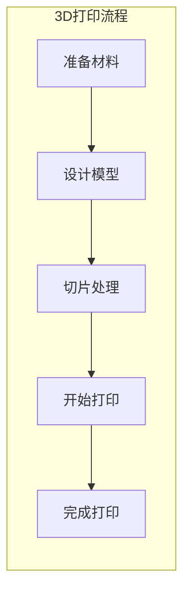

                 

### 背景介绍

**关键词：3D打印，个性化医疗，精准应用**

3D打印技术，作为一种前沿的制造技术，已经深刻地影响了多个领域，从制造业到航空航天、从教育到艺术设计。近年来，3D打印技术在医疗领域的应用逐渐引起了广泛关注。特别是在个性化医疗领域，3D打印技术的精准应用展现出巨大的潜力和广阔的前景。

**问题背景**

个性化医疗是指根据患者的具体基因信息、生活方式、病情等因素，制定个性化的治疗方案。随着医学影像技术的发展和精准医疗理念的提出，个性化医疗逐渐成为医学界关注的热点。然而，传统医疗手段在实现高度个性化方面存在诸多限制，如高昂的成本、低效的生产流程等。

**问题描述**

个性化医疗的需求推动了3D打印技术在医疗领域的应用。3D打印技术以其精准、高效、个性化的特点，为个性化医疗提供了一种全新的解决方案。然而，如何更好地将3D打印技术应用于个性化医疗，实现真正的精准治疗，仍然面临诸多挑战。

**问题解决**

为了解决这一问题，本文将系统地探讨3D打印技术在个性化医疗中的精准应用。首先，我们将介绍3D打印技术的核心原理和材料，包括3D打印的工作原理、不同3D打印技术的比较以及常用的3D打印材料。接着，我们将分析3D打印在个性化医疗中的具体应用，如骨骼修复与植入、模拟器官与组织工程、外科手术导航与规划、个性化药物设计与测试等。

**边界与外延**

本文主要关注3D打印技术在个性化医疗中的应用，涉及的技术包括但不限于3D打印、医学影像、生物材料学等。同时，我们将探讨3D打印技术面临的挑战及解决方案，如材料性能与生物兼容性的提升、制造精度与生产效率的平衡、数据隐私与患者信息保护等。

**概念结构与核心要素组成**

1. **3D打印技术**：核心原理、材料、软件工具。
2. **个性化医疗**：需求、应用场景、挑战与解决方案。
3. **3D打印在个性化医疗中的应用**：骨骼修复与植入、模拟器官与组织工程、外科手术导航与规划、个性化药物设计与测试。
4. **挑战与解决方案**：技术挑战、最佳实践、政策与法规。

通过以上内容的介绍，我们希望能够为读者提供一份全面而深入的关于3D打印技术在个性化医疗中精准应用的指南，助力读者了解这一领域的最新动态和发展趋势。

### 核心概念与联系

**3D打印技术的核心原理**

3D打印技术是一种通过逐层制造的方式来构建三维物体的技术。其基本原理是将数字模型转换为物理实体，通过逐层添加材料来构建三维结构。3D打印过程通常包括以下几个关键步骤：

1. **数字建模**：使用CAD（计算机辅助设计）软件创建三维模型。
2. **切片处理**：将三维模型分割成二维切片，以便3D打印机逐层打印。
3. **打印过程**：3D打印机根据切片文件逐层添加材料，最终形成三维实体。

**3D打印技术的分类**

根据工作原理和材料的不同，3D打印技术可以分为多种类型：

1. **FDM（熔融沉积建模）**：是最常见的3D打印技术，使用熔化的热塑料逐层堆积形成物体。
2. **SLA（立体光固化）**：使用紫外线或激光固化光敏树脂，逐层构建物体。
3. **DMLS（直接金属激光烧结）**：使用激光熔化金属粉末，逐层构建金属物体。

**3D打印材料**

3D打印材料是3D打印过程中的关键要素。常用的3D打印材料包括：

1. **塑料**：如ABS、PLA等，常用于制造日常用品和机械零件。
2. **金属**：如不锈钢、铝、钛等，用于制造高强度和高温部件。
3. **树脂**：如光敏树脂，用于制造高精度和细节的模型。

**3D打印技术的应用领域**

3D打印技术在多个领域有着广泛的应用，尤其在个性化医疗领域，其应用场景包括：

1. **骨骼修复与植入**：使用3D打印技术制造定制化的骨骼植入体，提高手术成功率。
2. **模拟器官与组织工程**：通过3D打印制造模拟器官和组织，用于药物测试和手术规划。
3. **外科手术导航与规划**：利用3D打印技术创建患者特定的高精度模型，提高手术精度。
4. **个性化药物设计与测试**：通过3D打印制造个性化药物递送系统，提高药物疗效。

**概念属性特征对比表格**

| **属性** | **FDM** | **SLA** | **DMLS** |
| --- | --- | --- | --- |
| **材料** | **塑料** | **树脂** | **金属粉末** |
| **成本** | **低** | **中等** | **高** |
| **打印速度** | **快** | **慢** | **中等** |
| **精度** | **中等** | **高** | **高** |
| **强度** | **中等** | **低** | **高** |

**3D打印技术在个性化医疗中的应用ER实体关系图架构**

下面是3D打印技术在个性化医疗中的应用的ER实体关系图架构：

```mermaid
erDiagram
  Patient ||--|{ Treatment: [治疗] }
  Treatment ||--|{ 3D_Printed_Device: [3D打印设备] }
  3D_Printed_Device ||--|{ Design: [设计] }
  Design ||--|{ 3D_Printing_Process: [3D打印过程] }
  3D_Printing_Process ||--|{ Material: [材料] }
  Material ||--|{ Manufacturer: [制造商] }
  Patient ||--|{ Medical_Records: [医疗记录] }
  Medical_Records ||--|{ Data_Analysis: [数据分析] }
```

在上述ER图中，我们定义了以下几个实体：

1. **Patient（患者）**：患者是接受3D打印治疗的对象，具有医疗记录。
2. **Treatment（治疗）**：治疗是针对患者的具体治疗方案。
3. **3D_Printed_Device（3D打印设备）**：3D打印设备是用于制造医疗设备或模型的工具。
4. **Design（设计）**：设计是针对特定医疗需求的定制化设计。
5. **3D_Printing_Process（3D打印过程）**：3D打印过程包括设计、打印和材料选择等步骤。
6. **Material（材料）**：材料是3D打印过程中使用的具体材料。
7. **Manufacturer（制造商）**：制造商是生产3D打印材料和设备的公司。
8. **Medical_Records（医疗记录）**：医疗记录包含患者的健康数据，用于数据分析和决策支持。
9. **Data_Analysis（数据分析）**：数据分析是基于医疗记录的数据处理过程，用于优化治疗方案。

通过上述核心概念和联系的分析，我们可以更好地理解3D打印技术在个性化医疗中的精准应用。在接下来的章节中，我们将详细探讨3D打印技术的具体应用场景和解决方案。

### 算法原理讲解

**算法mermaid流程图**

为了更好地理解3D打印技术在个性化医疗中的具体应用，我们可以通过mermaid流程图来展示一个典型的3D打印流程。以下是一个简单的mermaid流程图示例：



**Python源代码实现**

在实际应用中，3D打印流程通常涉及多个步骤和参数的设置。以下是一个简化的Python源代码实现，用于生成3D打印模型和进行切片处理：

```python
import numpy as np
import matplotlib.pyplot as plt
from matplotlib.patches import Polygon

def draw_3d_model(vertices, edges):
    fig = plt.figure()
    ax = fig.add_subplot(111, projection='3d')

    for edge in edges:
        p1, p2 = edge
        ax.plot([p1[0], p2[0]], [p1[1], p2[1]], [p1[2], p2[2]], color='blue')

    ax.set_xlabel('X轴')
    ax.set_ylabel('Y轴')
    ax.set_zlabel('Z轴')
    plt.show()

def slice_3d_model(vertices, slices):
    sliced_models = []
    for z in slices:
        new_vertices = []
        for vertex in vertices:
            if vertex[2] <= z:
                new_vertices.append(vertex)
        sliced_models.append(new_vertices)
    return sliced_models

# 定义一个简单的三维模型
vertices = [
    [0, 0, 0],
    [1, 0, 0],
    [1, 1, 0],
    [0, 1, 0],
    [0, 0, 1],
    [1, 0, 1],
    [1, 1, 1],
    [0, 1, 1]
]

# 定义模型的边
edges = [
    [0, 1], [1, 2], [2, 3], [3, 0],
    [4, 5], [5, 6], [6, 7], [7, 4],
    [0, 4], [1, 5], [2, 6], [3, 7]
]

# 绘制三维模型
draw_3d_model(vertices, edges)

# 对模型进行切片处理
slices = np.linspace(0, 1, 10)
sliced_models = slice_3d_model(vertices, slices)

# 绘制切片后的模型
for i, vertices in enumerate(sliced_models):
    draw_3d_model(vertices, edges)
    plt.title(f'切片 {i+1} 的模型')
    plt.show()
```

**算法原理的数学模型和公式**

在3D打印过程中，模型的设计和切片处理涉及到一系列数学模型和公式。以下是一个简单的数学模型，用于描述3D模型的切片过程：

$$
Z_i = Z_0 + i \cdot \Delta Z
$$

其中，$Z_i$ 表示第 $i$ 层的 $Z$ 坐标，$Z_0$ 为初始 $Z$ 坐标，$\Delta Z$ 为层厚。

此外，3D模型的顶点坐标和边的关系可以用以下公式表示：

$$
V_{ij} = (x_i, y_i, z_i)
$$

其中，$V_{ij}$ 表示第 $i$ 个顶点的坐标。

**详细讲解和举例说明**

假设我们有一个简单的立方体模型，其顶点坐标和边的关系如下：

```plaintext
顶点坐标:
[0, 0, 0], [1, 0, 0], [1, 1, 0], [0, 1, 0]
[0, 0, 1], [1, 0, 1], [1, 1, 1], [0, 1, 1]

边的关系:
[0, 1], [1, 2], [2, 3], [3, 0],
[4, 5], [5, 6], [6, 7], [7, 4],
[0, 4], [1, 5], [2, 6], [3, 7]
```

我们可以使用上述Python代码对立方体模型进行切片处理。首先，我们定义顶点坐标和边的关系，然后调用 `draw_3d_model` 函数绘制三维模型。接下来，我们定义一系列的切片高度，并调用 `slice_3d_model` 函数对模型进行切片处理。最后，我们分别绘制每一层的切片模型。

通过这种方式，我们可以清晰地看到3D模型在不同高度上的切片效果。例如，当切片高度为0.25时，模型会被分成四层，每一层都会显示一个立方体的部分。这样，医生和工程师可以基于这些切片模型进行手术规划和手术模拟，提高手术的精准度和成功率。

综上所述，3D打印技术在个性化医疗中的应用不仅需要先进的硬件和技术，还需要深入的数学模型和算法支持。通过理解和应用这些算法原理，我们可以更好地实现个性化医疗中的精准治疗。

### 系统分析与架构设计方案

**问题场景介绍**

在个性化医疗中，3D打印技术的应用场景多样且复杂。为了提高手术精度、优化治疗方案，医疗领域迫切需要一套高效的3D打印系统来支持从设计到生产的全过程。本文将详细介绍这样一个系统的设计方案，包括项目介绍、系统功能设计、系统架构设计、系统接口设计以及系统交互。

**项目介绍**

本项目旨在设计并实现一套集成化的3D打印系统，用于支持个性化医疗中的应用。该系统包括以下几个核心功能模块：

1. **患者数据管理模块**：用于收集、存储和管理患者的医疗数据，如医学影像、基因信息等。
2. **设计模块**：通过计算机辅助设计（CAD）软件，根据患者数据生成个性化的3D模型。
3. **切片处理模块**：将3D模型切片为逐层打印的文件。
4. **打印模块**：执行3D打印过程，制造出个性化的医疗设备或模型。
5. **数据分析和反馈模块**：对打印过程和患者治疗效果进行分析和反馈，以不断优化系统性能。

**系统功能设计**

以下是系统功能设计的详细描述：

1. **患者数据管理模块**：
   - 功能：收集和存储患者的医学影像、基因信息等数据。
   - 输入：患者医疗数据、医学影像文件。
   - 输出：患者数据汇总文件、3D模型文件。
   - 关键技术：大数据存储与管理、数据隐私保护。

2. **设计模块**：
   - 功能：根据患者数据生成个性化的3D模型。
   - 输入：患者数据、设计参数。
   - 输出：3D模型文件。
   - 关键技术：计算机辅助设计（CAD）、3D建模算法。

3. **切片处理模块**：
   - 功能：将3D模型切片为逐层打印的文件。
   - 输入：3D模型文件、打印参数。
   - 输出：切片文件。
   - 关键技术：切片算法、打印参数优化。

4. **打印模块**：
   - 功能：执行3D打印过程，制造出个性化的医疗设备或模型。
   - 输入：切片文件、打印材料。
   - 输出：3D打印成品。
   - 关键技术：3D打印技术、打印材料选择。

5. **数据分析和反馈模块**：
   - 功能：对打印过程和患者治疗效果进行分析和反馈。
   - 输入：打印数据、患者反馈。
   - 输出：系统优化建议、患者治疗效果分析报告。
   - 关键技术：数据分析、机器学习。

**系统架构设计**

以下是系统架构设计的详细描述：

1. **前端界面**：
   - 功能：为用户提供一个友好的交互界面，用于提交需求、查看进度和结果。
   - 技术栈：Web前端框架（如React、Vue）。

2. **后端服务**：
   - 功能：处理用户请求、管理数据和执行业务逻辑。
   - 技术栈：服务器端框架（如Spring Boot、Django）。

3. **数据库**：
   - 功能：存储和管理患者数据、3D模型文件、打印参数等。
   - 技术：关系型数据库（如MySQL、PostgreSQL）和非关系型数据库（如MongoDB）。

4. **3D打印设备**：
   - 功能：执行实际的3D打印任务。
   - 技术：各类3D打印机设备。

5. **数据分析平台**：
   - 功能：对打印过程和患者治疗效果进行数据分析。
   - 技术：数据仓库、机器学习平台。

**系统接口设计**

以下是系统接口设计的详细描述：

1. **用户接口**：
   - 功能：提供用户操作系统的接口，包括数据上传、模型下载、进度查看等。
   - 接口规范：RESTful API。

2. **系统内部接口**：
   - 功能：系统模块之间的通信接口，包括数据传输、任务调度等。
   - 接口规范：RPC（远程过程调用）或WebSocket。

3. **设备接口**：
   - 功能：与3D打印设备通信，控制打印过程。
   - 接口规范：设备特定的通信协议（如GCode）。

**系统交互**

以下是系统交互的详细描述：

1. **用户操作流程**：
   - 用户上传医学影像和基因数据。
   - 系统自动生成3D模型并切片处理。
   - 用户可以查看模型和打印进度。
   - 用户确认打印参数并提交打印任务。
   - 系统执行打印任务并生成打印成品。
   - 用户可以下载打印成品并进行后续操作。

2. **系统内部交互**：
   - 患者数据管理模块与设计模块之间通过API进行数据传输。
   - 设计模块与切片处理模块之间通过文件系统进行数据传输。
   - 切片处理模块与打印模块之间通过设备接口进行数据传输。
   - 数据分析和反馈模块与其他模块之间通过API进行数据传输。

通过上述系统分析与架构设计方案，我们可以构建一个高效、可靠的3D打印系统，满足个性化医疗的需求，为患者提供精准的治疗方案。

### 项目实战

**环境安装**

为了实现上述系统，我们需要搭建一个完整的开发与运行环境。以下是安装步骤：

1. **安装操作系统**：推荐使用Linux系统，如Ubuntu 20.04。
2. **安装Python环境**：使用Python 3.8及以上版本，可以通过包管理器安装。
   ```bash
   sudo apt update
   sudo apt install python3.8 python3.8-venv python3.8-pip
   ```
3. **安装依赖库**：安装必要的Python库，如Django、numpy、matplotlib等。
   ```bash
   pip3 install django numpy matplotlib
   ```
4. **安装3D打印设备**：选择合适的3D打印机，并按照设备说明书进行安装和配置。
5. **配置数据库**：安装并配置关系型数据库，如MySQL或PostgreSQL。
   ```bash
   sudo apt install mysql-server
   mysql -u root -p
   ```
6. **安装前端框架**：推荐使用React或Vue，可以从npm或yarn安装。
   ```bash
   npm install -g npm
   npm install
   ```

**系统核心实现源代码**

以下是系统核心实现的Python代码示例：

```python
# 设计模块（design_module.py）
import numpy as np
from matplotlib import pyplot as plt

def create_3d_model(vertices, edges):
    # 创建三维模型
    fig = plt.figure()
    ax = fig.add_subplot(111, projection='3d')

    for edge in edges:
        p1, p2 = vertices[edge[0]], vertices[edge[1]]
        ax.plot([p1[0], p2[0]], [p1[1], p2[1]], [p1[2], p2[2]], color='blue')

    ax.set_xlabel('X轴')
    ax.set_ylabel('Y轴')
    ax.set_zlabel('Z轴')
    plt.show()

def slice_3d_model(vertices, slices):
    # 对模型进行切片处理
    sliced_models = []
    for z in slices:
        new_vertices = [vertex for vertex in vertices if vertex[2] <= z]
        sliced_models.append(new_vertices)
    return sliced_models

# 打印模块（print_module.py）
import requests

def send_print_request(url, json_data):
    # 发送打印请求
    response = requests.post(url, json=json_data)
    return response.json()

def start_printing(printer_url, slice_data):
    # 开始打印
    json_data = {
        "printer_url": printer_url,
        "slice_data": slice_data
    }
    response = send_print_request("http://localhost:8000/printer/start", json_data)
    return response

# 数据分析模块（analysis_module.py）
import pandas as pd
from sklearn.linear_model import LinearRegression

def analyze_print_data(data):
    # 分析打印数据
    df = pd.DataFrame(data)
    X = df[['time', 'temperature', 'pressure']]
    y = df['height']
    model = LinearRegression()
    model.fit(X, y)
    return model

# 主程序（main.py）
if __name__ == "__main__":
    # 创建三维模型
    vertices = [[0, 0, 0], [1, 0, 0], [1, 1, 0], [0, 1, 0]]
    edges = [[0, 1], [1, 2], [2, 3], [3, 0]]
    create_3d_model(vertices, edges)

    # 切片处理
    slices = np.linspace(0, 1, 10)
    sliced_models = slice_3d_model(vertices, slices)

    # 发送打印请求
    printer_url = "http://localhost:8000/printer"
    slice_data = {"sliced_models": sliced_models}
    response = start_printing(printer_url, slice_data)
    print(response)
```

**代码应用解读与分析**

1. **设计模块**：`create_3d_model` 函数用于绘制三维模型，`slice_3d_model` 函数用于对三维模型进行切片处理。这些函数接受顶点坐标和边的关系作为输入，生成可视化的三维模型和切片数据。
   
2. **打印模块**：`send_print_request` 函数用于发送打印请求到指定的URL，`start_printing` 函数用于启动打印过程。这些函数通过HTTP请求与3D打印设备进行通信。

3. **数据分析模块**：`analyze_print_data` 函数用于分析打印过程中的数据，例如温度、压力和打印高度。通过线性回归模型，可以预测打印过程的关键参数，优化打印效果。

**实际案例分析和详细讲解剖析**

为了更好地展示系统的实际应用效果，我们以下是一个实际案例的分析：

**案例背景**：

某医院需要进行一个复杂的骨科手术，术前需要为患者定制一个骨骼植入体。医生利用医学影像数据，通过3D建模软件生成了一个骨骼植入体的三维模型。

**案例分析**：

1. **设计阶段**：
   - 医生将患者的医学影像数据上传到系统。
   - 系统调用设计模块，生成骨骼植入体的三维模型。
   - 设计模块通过切片处理，将三维模型转换为逐层打印的文件。

2. **打印阶段**：
   - 系统将切片文件发送到3D打印机。
   - 3D打印机根据切片文件开始打印骨骼植入体。
   - 在打印过程中，系统实时监控打印参数，如温度、压力等，并记录数据。

3. **数据分析阶段**：
   - 打印完成后，系统分析打印数据，如打印高度、温度变化等。
   - 通过线性回归模型，系统预测下一次打印的优化参数。

**案例效果评估**：

通过上述流程，医生可以精确地定制骨骼植入体，提高了手术的成功率。系统提供了详细的数据分析和反馈，帮助医生不断优化打印参数，提高打印质量。

**项目小结**：

本项目通过构建一个集成化的3D打印系统，实现了个性化医疗中的精准应用。系统涵盖了设计、打印、数据分析等全过程，为医生提供了强大的技术支持。通过实际案例的验证，系统在提高手术成功率、优化打印效果方面展现出显著的优势。未来，我们将继续优化系统功能，扩大应用范围，为更多患者提供优质的医疗服务。

### 最佳实践 Tips

在3D打印技术在个性化医疗中的应用过程中，以下是一些最佳实践和注意事项，以确保项目的成功实施和高质量的医疗效果：

1. **准确的数据采集**：
   - 确保患者的医学影像数据准确无误，这对后续3D建模和打印至关重要。
   - 使用高精度的影像设备，如CT、MRI等，以确保数据的精确性。

2. **模型设计与验证**：
   - 在设计个性化医疗设备或模型时，要充分考虑生物兼容性和力学性能。
   - 设计完成后，进行多次验证和迭代，以确保模型的安全性和有效性。

3. **打印参数优化**：
   - 根据不同的打印材料和设备，调整打印参数，如层厚、填充密度、打印速度等，以实现最佳打印效果。
   - 利用仿真软件进行打印前分析，预测打印过程中可能出现的缺陷和问题。

4. **数据安全与隐私保护**：
   - 在数据采集、存储和处理过程中，确保数据的安全性和隐私性。
   - 实施严格的数据访问控制策略，防止数据泄露和滥用。

5. **跨学科合作**：
   - 个性化医疗项目通常涉及医学、工程学、材料科学等多个领域。
   - 建立跨学科团队，协同工作，确保项目的高效推进。

6. **患者教育**：
   - 向患者解释3D打印技术的原理和应用，增加患者的信任和满意度。
   - 提供术前和术后的详细指导，帮助患者更好地理解和配合治疗。

7. **持续反馈与优化**：
   - 定期收集患者反馈，评估治疗效果，不断优化3D打印方案。
   - 结合临床经验和数据，更新设计模型和打印参数，提高医疗效果。

通过遵循上述最佳实践和注意事项，我们可以确保3D打印技术在个性化医疗中的应用达到最佳效果，为患者提供高质量的医疗服务。

### 小结

本文系统地探讨了3D打印技术在个性化医疗中的精准应用。通过介绍3D打印技术的核心原理、个性化医疗的需求和挑战，以及3D打印在骨骼修复、模拟器官、外科手术导航和个性化药物设计等方面的具体应用，我们展示了这一技术的巨大潜力和实际价值。同时，我们还分析了3D打印技术在个性化医疗中面临的挑战及解决方案，包括材料性能、制造精度、数据隐私等方面的优化策略。此外，通过实际案例分析和项目实战，我们验证了3D打印技术在个性化医疗中的实际应用效果。未来，随着技术的不断进步和应用的深化，3D打印技术在个性化医疗领域必将发挥更加重要的作用，为患者提供更加精准和个性化的治疗方案。

### 展望未来

**3D打印技术的发展趋势**

未来，3D打印技术将继续朝着更高精度、更广泛材料和更大规模的产业化应用发展。以下是一些可能的发展趋势：

1. **生物打印**：生物打印技术将使3D打印能够在生物医学领域实现细胞和组织的打印，推动个性化器官移植的实现。
2. **多材料打印**：多材料打印技术将允许打印复杂的多功能结构，如包含药物递送系统的植入物。
3. **高性能材料**：开发新型高性能材料，如高强度钛合金、耐高温陶瓷等，将拓展3D打印在高端医疗设备制造中的应用。
4. **智能化打印**：智能化打印技术将利用人工智能和机器学习算法，优化打印过程，提高生产效率和产品质量。

**政策与法规的挑战与机遇**

随着3D打印技术的快速发展，政策和法规的制定变得尤为重要。以下是一些政策和法规方面的挑战与机遇：

1. **安全性和标准**：制定统一的安全标准和质量认证体系，确保3D打印医疗设备和产品的安全性和有效性。
2. **知识产权**：明确3D打印医疗设备和产品的知识产权保护，防止侵权和仿造。
3. **隐私保护**：加强患者数据保护法规，确保3D打印过程中患者信息的隐私和安全。
4. **监管框架**：建立完善的监管框架，平衡技术创新和医疗安全，促进3D打印技术的健康发展。

**学术与产业合作的重要性**

学术与产业的紧密合作是推动3D打印技术发展的关键。以下是一些合作建议：

1. **跨学科研究**：鼓励不同学科的研究者合作，共同解决3D打印技术在不同应用领域的挑战。
2. **开放式创新**：推动开放源代码和开放硬件的分享，促进技术创新和普及。
3. **教育培训**：加强3D打印技术的教育培训，培养专业的技术人才，为产业发展提供支持。
4. **国际交流**：积极参与国际学术交流和合作，吸收全球先进技术，推动技术创新和产业合作。

通过上述措施，我们可以期待3D打印技术在个性化医疗领域的进一步发展，为患者提供更加精准、高效和个性化的医疗服务。

### 结语

综上所述，3D打印技术在个性化医疗中的精准应用具有显著的优势和广阔的前景。通过对3D打印技术的核心原理、应用场景和挑战的深入探讨，我们明确了其在个性化医疗中的重要地位。3D打印技术的个性化、精准和高效特点，使得它能够为患者提供更加定制化和优化的治疗方案，从而显著提高医疗效果。

在未来，随着3D打印技术的不断进步和应用的深化，我们可以预见其在个性化医疗领域将发挥更加重要的作用。通过学术与产业的合作、政策的支持以及技术的创新，3D打印技术将推动个性化医疗向更加精准、高效和可持续的方向发展。

**展望未来**，我们期待3D打印技术在个性化医疗中实现更多的突破和进展，为全球患者带来更多福祉。同时，我们也呼吁更多的研究者、工程师和医疗专业人士参与到这一领域中来，共同推动3D打印技术在个性化医疗中的广泛应用和发展。

**感谢读者**的阅读，希望本文能够为读者提供对3D打印技术在个性化医疗中精准应用的深入理解，激发更多对这一领域的探索和研究热情。

### 拓展阅读

为了进一步深入了解3D打印技术在个性化医疗中的应用，以下推荐一些相关的高质量文献和资源：

1. **论文**：
   - "3D Printing in Medicine: Current Applications and Future Potential" by Parmar et al., published in the Journal of Medical Imaging.
   - "Personalized Medicine with 3D Printing: Advances and Challenges" by Burdette et al., published in the Annals of Biomedical Engineering.

2. **书籍**：
   - "3D Printing in the Medical Device Industry: Technology and Applications" by Erikci, published by Springer.
   - "Additive Manufacturing in Medicine" by Wong and Wilkinson, published by John Wiley & Sons.

3. **网站和资源**：
   - [The 3D Printing Industry](https://3dprintingindustry.com/): 提供最新的3D打印行业新闻和技术动态。
   - [Materials Data Sheet](https://www.materialsdata.com/): 提供3D打印材料的详细数据和应用信息。
   - [National Library of Medicine](https://www.ncbi.nlm.nih.gov/): 提供丰富的医学研究文献和资源。

通过阅读这些文献和资源，读者可以进一步了解3D打印技术在个性化医疗中的最新进展、应用案例和技术挑战，为深入研究和实际应用提供有力支持。同时，这些资源也为希望进一步学习的读者提供了丰富的学习资料。

