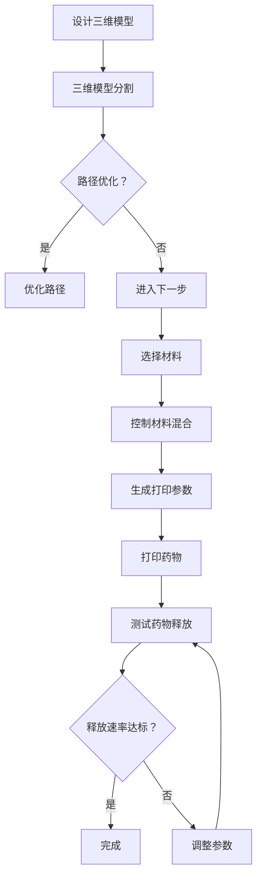
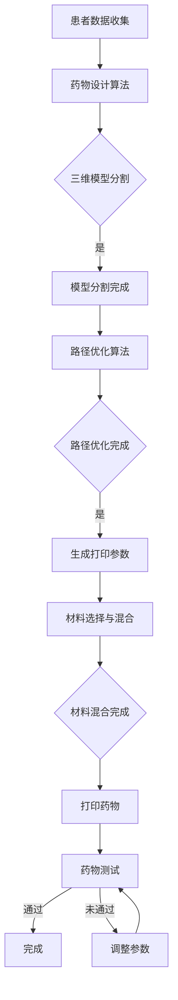
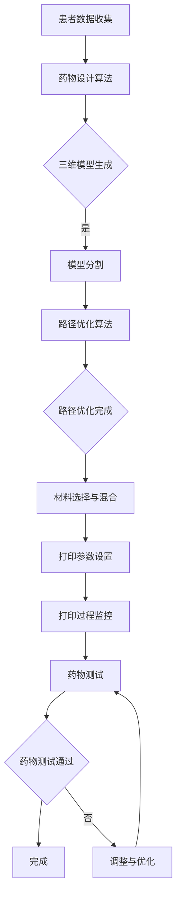
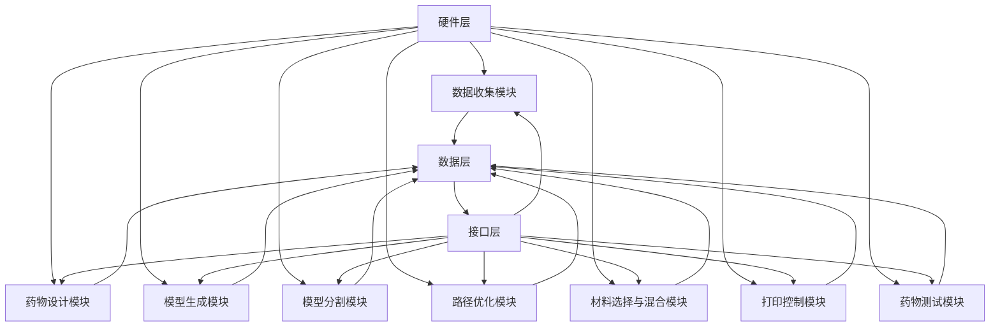

                 

### 3D打印技术在个性化药物制造中的应用

#### 引言

近年来，3D打印技术以其独特的优势逐渐渗透到多个行业，个性化药物制造便是其中之一。3D打印技术通过逐层添加材料的方式构建实体模型，能够在短时间内制造出复杂的几何形状，从而在个性化医疗领域展现出了巨大的潜力。个性化药物制造则通过定制化药物设计，提高治疗效果并减少副作用，这在个性化医疗需求的推动下显得尤为重要。

本文将探讨3D打印技术在个性化药物制造中的应用，通过以下章节的结构设计，逐步深入分析这一主题：

- **第1章：问题背景与概述**：介绍3D打印技术和个性化药物制造的基本概念、发展历程及其在各自领域的应用。
- **第2章：核心概念与联系**：定义并详细解释涉及的核心概念，如3D打印技术、个性化药物制造、材料科学、生物医学工程等，并通过对比表格和ER实体关系图展示这些概念之间的联系。
- **第3章：算法原理讲解**：详细介绍3D打印在个性化药物制造中使用的算法原理，包括相关数学模型和公式，并通过mermaid流程图和Python源代码进行说明。
- **第4章：系统分析与架构设计方案**：描述3D打印在个性化药物制造中应用的系统架构，包括系统功能设计、系统架构图、系统接口设计和系统交互。
- **第5章：项目实战**：通过一个实际项目展示如何使用3D打印技术进行个性化药物制造，包括环境安装、系统核心实现源代码，以及代码应用解读与分析。
- **第6章：最佳实践与总结**：总结全书主要内容，提供最佳实践建议，注意事项，并推荐拓展阅读资源。

#### 1.1 3D打印技术的基本概念与发展历程

3D打印，又称为增材制造，是一种通过逐层制造来构建三维实体的技术。这种技术的基本原理是通过计算机辅助设计（CAD）软件创建三维模型，然后将这些模型分割成许多薄层，最后通过逐层添加材料来制造出实体。3D打印技术具有以下几大特点：

- **灵活性**：3D打印技术能够制造出复杂形状的部件，不受传统制造工艺的限制，能够实现定制化生产。
- **高效性**：3D打印技术能够在较短的时间内完成制造，减少生产周期和成本。
- **材料多样性**：3D打印技术可以使用的材料种类非常广泛，从塑料、金属到生物材料等，大大扩展了应用范围。

3D打印技术的发展历程可以追溯到20世纪80年代，当时Charles Hull发明了立体光刻技术（SLA），这是最早的3D打印技术之一。随后，熔融沉积建模（FDM）技术问世，因其成本较低和操作简单而在工业界得到了广泛应用。进入21世纪，3D打印技术得到了快速发展，新的技术如电子束熔炼（EBM）、选择性激光烧结（SLS）等相继出现，进一步提高了3D打印的精度和材料多样性。

在医疗领域，3D打印技术最早的应用是制造医学模型，用于手术规划和训练。随着技术的进步，3D打印开始被应用于个性化医疗设备的制造，如植入物、支架和导板等。近年来，3D打印技术更是被引入到个性化药物制造领域，为个性化医疗带来了新的可能性。

#### 1.2 个性化药物制造的需求与挑战

个性化药物制造，顾名思义，是指根据患者的个体差异，定制化设计药物和治疗方案的制造过程。这一概念的出现源于传统药物治疗中存在的个体差异问题。传统药物设计是基于统计学方法，往往无法考虑到个体之间的基因、代谢和生理差异，导致药物的治疗效果和副作用在不同患者中存在较大差异。

个性化药物制造的需求主要来源于以下几个方面：

1. **提高治疗效果**：通过个性化药物制造，可以根据患者的具体生理和病理特征，设计出最合适的药物配方和剂量，从而提高治疗效果。
2. **减少副作用**：个性化药物制造可以减少不必要的药物剂量，降低药物带来的副作用，提高患者的用药安全性。
3. **个性化治疗方案**：个性化药物制造可以为患者提供量身定制的治疗方案，特别是对于罕见病和复杂疾病的治疗具有重要意义。

然而，个性化药物制造也面临着一系列挑战：

1. **技术复杂性**：个性化药物制造需要涉及多个学科领域，如药物化学、生物学、材料科学和生物医学工程等，技术复杂性较高。
2. **成本问题**：个性化药物制造通常需要定制化的设备和材料，成本较高，限制了其大规模应用。
3. **生产效率**：个性化药物制造的生产效率相对较低，无法与传统的批量生产相比，这在一定程度上限制了其商业化应用。

#### 1.3 3D打印技术在个性化药物制造中的潜在应用

3D打印技术在个性化药物制造中的应用具有巨大潜力，主要体现在以下几个方面：

1. **药物载体打印**：3D打印技术可以用于制造微型的药物载体，如纳米颗粒、脂质体等，这些载体可以精确控制药物的释放速率和位置，从而提高治疗效果。
2. **药物分子组合打印**：3D打印技术可以精确控制不同药物分子在空间上的排列和组合，实现个性化药物配方的设计。
3. **生物材料打印**：3D打印技术可以制造出具有生物活性的生物材料，用于构建三维的药物释放系统，如三维打印的细胞支架。
4. **器官打印**：虽然目前器官打印仍处于实验阶段，但3D打印技术在构建个性化器官模型和进行药物筛选方面具有巨大潜力。

总的来说，3D打印技术在个性化药物制造中的应用，不仅能够提高药物的治疗效果和安全性，还能够推动个性化医疗的发展，为患者提供更加精准和个性化的医疗服务。

### 1.1 3D打印技术的基本概念与发展历程

3D打印技术，也被称作增材制造技术，是一种通过逐层添加材料来构建三维实体的制造方法。它不同于传统的减材制造，如切割、打磨等，而是通过逐层叠加材料来构建所需的形状和结构。这种技术的基本原理是通过计算机辅助设计（CAD）软件创建三维模型，然后将这些模型分割成许多薄层，通过逐层打印材料来制造出实体。

#### 3D打印技术的工作原理

3D打印的工作原理主要包括以下几个步骤：

1. **模型设计**：首先，使用CAD软件设计出所需的三维模型，然后将模型分割成许多薄层，每个薄层通常只有几毫米厚。
2. **路径规划**：根据模型的分层设计，3D打印机将确定每层的打印路径，包括打印头移动的路径和材料添加的位置。
3. **材料添加**：在打印过程中，3D打印机通过打印头将材料逐层添加到工作台上，材料可以是塑料、金属、陶瓷、甚至是有机材料。
4. **固化与成型**：每一层材料被添加后，通过固化或冷却等过程成型，然后进行下一层的打印。

#### 3D打印技术的分类

3D打印技术有多种不同的分类方法，常见的分类标准包括：

1. **材料类型**：根据使用的材料类型，3D打印技术可以分为塑料打印、金属打印、陶瓷打印、生物材料打印等。
2. **打印方式**：根据打印方式，3D打印技术可以分为立体光刻（SLA）、熔融沉积建模（FDM）、选择性激光烧结（SLS）、电子束熔炼（EBM）等。
   - **立体光刻（SLA）**：使用紫外线光固化的树脂材料，适用于制造高精度的复杂结构。
   - **熔融沉积建模（FDM）**：使用热融的塑料材料，适用于制造结构简单的零件。
   - **选择性激光烧结（SLS）**：使用激光烧结粉末材料，适用于制造高强度和复杂结构的零件。
   - **电子束熔炼（EBM）**：使用电子束熔化金属粉末，适用于制造高精度的金属零部件。

#### 3D打印技术的发展历程

3D打印技术的发展历程可以追溯到20世纪80年代，当时Charles Hull发明了立体光刻技术（SLA），这是最早的3D打印技术之一。随后，熔融沉积建模（FDM）技术问世，因其成本较低和操作简单而在工业界得到了广泛应用。进入21世纪，3D打印技术得到了快速发展，新的技术如电子束熔炼（EBM）、选择性激光烧结（SLS）等相继出现，进一步提高了3D打印的精度和材料多样性。

在医疗领域，3D打印技术的应用最早是制造医学模型，用于手术规划和训练。随着技术的进步，3D打印开始被应用于个性化医疗设备的制造，如植入物、支架和导板等。近年来，3D打印技术更是被引入到个性化药物制造领域，为个性化医疗带来了新的可能性。

#### 3D打印技术在个性化药物制造中的潜在应用

3D打印技术在个性化药物制造中的潜在应用主要包括以下几个方面：

1. **药物载体打印**：3D打印技术可以用于制造微型的药物载体，如纳米颗粒、脂质体等。这些载体可以精确控制药物的释放速率和位置，从而提高治疗效果。
2. **药物分子组合打印**：3D打印技术可以精确控制不同药物分子在空间上的排列和组合，实现个性化药物配方的设计。
3. **生物材料打印**：3D打印技术可以制造出具有生物活性的生物材料，用于构建三维的药物释放系统，如三维打印的细胞支架。
4. **器官打印**：虽然目前器官打印仍处于实验阶段，但3D打印技术在构建个性化器官模型和进行药物筛选方面具有巨大潜力。

总的来说，3D打印技术在个性化药物制造中的应用，不仅能够提高药物的治疗效果和安全性，还能够推动个性化医疗的发展，为患者提供更加精准和个性化的医疗服务。

### 1.2 个性化药物制造的需求与挑战

个性化药物制造是一种基于患者个体差异而设计的药物制造方法，其核心目标是提高治疗效果，减少副作用，并最终为患者提供量身定制的治疗方案。随着医学技术的发展和生物信息学的进步，个性化药物制造越来越受到关注。以下是针对个性化药物制造的需求与挑战的详细分析。

#### 需求分析

1. **提高治疗效果**：传统的药物设计方法通常基于人群统计，无法充分考虑个体之间的差异。个性化药物制造能够根据患者的具体生理和病理特征，设计出最适合的药物配方和剂量，从而提高治疗效果。

2. **减少副作用**：由于个体差异，同一种药物在不同患者身上可能产生不同的副作用。个性化药物制造通过减少不必要的药物剂量，降低药物带来的副作用，提高患者的用药安全性。

3. **个性化治疗方案**：个性化药物制造为患者提供量身定制的治疗方案，特别是在罕见病和复杂疾病的治疗中具有重要意义。这种定制化的治疗方案能够更好地满足患者的需求，提高治疗的成功率。

4. **提高医疗资源利用效率**：个性化药物制造能够根据患者的需求进行精确制造，减少库存和浪费，提高医疗资源的利用效率。

#### 挑战分析

1. **技术复杂性**：个性化药物制造涉及多个学科领域，包括药物化学、生物学、材料科学和生物医学工程等。技术复杂性高，需要多学科协同作战，对研发团队提出了更高的要求。

2. **成本问题**：个性化药物制造通常需要定制化的设备和材料，成本较高。这在一定程度上限制了其大规模应用，需要找到降低成本的方法。

3. **生产效率**：个性化药物制造的生产效率相对较低，无法与传统的批量生产相比。提高生产效率是实现个性化药物制造商业化的关键。

4. **监管与法规**：个性化药物制造涉及到药物安全性和有效性问题，需要严格的监管和法规。这要求研发团队在开发和生产过程中严格遵守相关法规，确保药物的安全性和质量。

5. **数据管理**：个性化药物制造需要大量的生物医学数据，包括基因信息、代谢数据等。如何有效地管理和利用这些数据，是个性化药物制造面临的另一个挑战。

总的来说，个性化药物制造在提高治疗效果、减少副作用和提供个性化治疗方案方面具有显著优势，但也面临着技术复杂性、成本问题、生产效率、监管与法规以及数据管理等多方面的挑战。只有克服这些挑战，个性化药物制造才能在医疗领域发挥其应有的作用。

### 1.3 3D打印技术在个性化药物制造中的潜在应用

3D打印技术因其独特的优势，正在逐步渗透到个性化药物制造领域，为个性化医疗提供了新的解决方案。以下是3D打印技术在个性化药物制造中的几个潜在应用：

#### 药物载体打印

药物载体打印是3D打印技术在个性化药物制造中的一个重要应用。通过3D打印技术，可以制造出微型的药物载体，如纳米颗粒和脂质体。这些载体可以精确控制药物的释放速率和位置，从而提高治疗效果。例如，纳米颗粒可以装载药物并缓慢释放，实现长期的治疗效果。脂质体则可以作为药物递送系统，通过靶向给药提高药物在特定部位的浓度。

#### 药物分子组合打印

3D打印技术还可以用于药物分子组合打印。通过精确控制不同药物分子在空间上的排列和组合，可以实现个性化药物配方的设计。这种方法可以根据患者的具体需求，设计出最适合的药物组合，提高治疗效果并减少副作用。例如，通过3D打印技术，可以在同一药物载体中同时装载多种药物，实现多药联用的效果。

#### 生物材料打印

生物材料打印是3D打印技术在个性化药物制造中的另一个重要应用。通过3D打印技术，可以制造出具有生物活性的生物材料，用于构建三维的药物释放系统。例如，三维打印的细胞支架可以用于构建药物递送系统，实现药物的定向释放。此外，生物材料打印还可以用于制造具有生物活性的器官模型，用于药物筛选和毒性测试。

#### 器官打印

虽然器官打印目前还处于实验阶段，但3D打印技术在构建个性化器官模型和进行药物筛选方面具有巨大潜力。通过3D打印技术，可以制造出与人体器官结构和功能相似的模型，用于术前规划和训练。此外，这些器官模型还可以用于药物筛选和毒性测试，为个性化药物制造提供重要的实验数据。

总的来说，3D打印技术在个性化药物制造中的应用，不仅能够提高药物的治疗效果和安全性，还能够推动个性化医疗的发展，为患者提供更加精准和个性化的医疗服务。

### 1.2 个性化药物制造的需求与挑战

个性化药物制造是一种基于患者个体差异而设计的药物制造方法，其核心目标是提高治疗效果，减少副作用，并最终为患者提供量身定制的治疗方案。随着医学技术的发展和生物信息学的进步，个性化药物制造越来越受到关注。以下是针对个性化药物制造的需求与挑战的详细分析。

#### 需求分析

1. **提高治疗效果**：传统的药物设计方法通常基于人群统计，无法充分考虑个体之间的差异。个性化药物制造能够根据患者的具体生理和病理特征，设计出最适合的药物配方和剂量，从而提高治疗效果。

2. **减少副作用**：由于个体差异，同一种药物在不同患者身上可能产生不同的副作用。个性化药物制造通过减少不必要的药物剂量，降低药物带来的副作用，提高患者的用药安全性。

3. **个性化治疗方案**：个性化药物制造为患者提供量身定制的治疗方案，特别是在罕见病和复杂疾病的治疗中具有重要意义。这种定制化的治疗方案能够更好地满足患者的需求，提高治疗的成功率。

4. **提高医疗资源利用效率**：个性化药物制造能够根据患者的需求进行精确制造，减少库存和浪费，提高医疗资源的利用效率。

#### 挑战分析

1. **技术复杂性**：个性化药物制造涉及多个学科领域，包括药物化学、生物学、材料科学和生物医学工程等。技术复杂性高，需要多学科协同作战，对研发团队提出了更高的要求。

2. **成本问题**：个性化药物制造通常需要定制化的设备和材料，成本较高。这在一定程度上限制了其大规模应用，需要找到降低成本的方法。

3. **生产效率**：个性化药物制造的生产效率相对较低，无法与传统的批量生产相比。提高生产效率是实现个性化药物制造商业化的关键。

4. **监管与法规**：个性化药物制造涉及到药物安全性和有效性问题，需要严格的监管和法规。这要求研发团队在开发和生产过程中严格遵守相关法规，确保药物的安全性和质量。

5. **数据管理**：个性化药物制造需要大量的生物医学数据，包括基因信息、代谢数据等。如何有效地管理和利用这些数据，是个性化药物制造面临的另一个挑战。

总的来说，个性化药物制造在提高治疗效果、减少副作用和提供个性化治疗方案方面具有显著优势，但也面临着技术复杂性、成本问题、生产效率、监管与法规以及数据管理等多方面的挑战。只有克服这些挑战，个性化药物制造才能在医疗领域发挥其应有的作用。

### 1.3 3D打印技术在个性化药物制造中的潜在应用

3D打印技术因其独特的优势，正在逐步渗透到个性化药物制造领域，为个性化医疗提供了新的解决方案。以下是3D打印技术在个性化药物制造中的几个潜在应用：

#### 药物载体打印

药物载体打印是3D打印技术在个性化药物制造中的一个重要应用。通过3D打印技术，可以制造出微型的药物载体，如纳米颗粒和脂质体。这些载体可以精确控制药物的释放速率和位置，从而提高治疗效果。例如，纳米颗粒可以装载药物并缓慢释放，实现长期的治疗效果。脂质体则可以作为药物递送系统，通过靶向给药提高药物在特定部位的浓度。

#### 药物分子组合打印

3D打印技术还可以用于药物分子组合打印。通过精确控制不同药物分子在空间上的排列和组合，可以实现个性化药物配方的设计。这种方法可以根据患者的具体需求，设计出最适合的药物组合，提高治疗效果并减少副作用。例如，通过3D打印技术，可以在同一药物载体中同时装载多种药物，实现多药联用的效果。

#### 生物材料打印

生物材料打印是3D打印技术在个性化药物制造中的另一个重要应用。通过3D打印技术，可以制造出具有生物活性的生物材料，用于构建三维的药物释放系统。例如，三维打印的细胞支架可以用于构建药物递送系统，实现药物的定向释放。此外，生物材料打印还可以用于制造具有生物活性的器官模型，用于药物筛选和毒性测试。

#### 器官打印

虽然器官打印目前还处于实验阶段，但3D打印技术在构建个性化器官模型和进行药物筛选方面具有巨大潜力。通过3D打印技术，可以制造出与人体器官结构和功能相似的模型，用于术前规划和训练。此外，这些器官模型还可以用于药物筛选和毒性测试，为个性化药物制造提供重要的实验数据。

总的来说，3D打印技术在个性化药物制造中的应用，不仅能够提高药物的治疗效果和安全性，还能够推动个性化医疗的发展，为患者提供更加精准和个性化的医疗服务。

### 第2章：核心概念与联系

#### 2.1 3D打印技术原理

3D打印技术，作为一种增材制造技术，主要通过逐层添加材料来构建三维实体。其基本原理包括以下步骤：

1. **设计模型**：首先，使用计算机辅助设计（CAD）软件创建所需的三维模型。
2. **分层**：将三维模型分割成许多薄层，每一层通常只有几毫米厚。
3. **路径规划**：根据分层设计，确定每层的打印路径，包括打印头移动的路径和材料添加的位置。
4. **材料添加**：通过打印头逐层添加材料，材料可以是塑料、金属、陶瓷等多种类型。
5. **固化与成型**：每一层材料被添加后，通过固化或冷却等过程成型，然后进行下一层的打印。

3D打印技术的核心在于其灵活性和高效性，允许制造出复杂形状的部件，同时减少材料浪费。

#### 2.2 材料科学在3D打印中的应用

材料科学是3D打印技术的重要组成部分，不同类型的材料适用于不同的3D打印工艺。以下是几种常见材料及其在3D打印中的应用：

- **塑料**：最常用的材料之一，适用于FDM和SLA等3D打印技术。塑料具有较好的柔韧性和成型性，适用于制造各种原型和消费类产品。
- **金属**：适用于EBM和SLS等3D打印技术，金属具有高强度和高耐用性，适用于制造航空航天、汽车和医疗设备等高要求部件。
- **陶瓷**：适用于SLS等3D打印技术，陶瓷具有高硬度和耐高温特性，适用于制造模具、陶瓷基复合材料和功能性陶瓷。
- **生物材料**：适用于生物打印和药物载体打印，生物材料具有生物相容性和活性，适用于制造药物释放系统和生物医学植入物。

材料的选择直接影响3D打印的精度、强度和最终产品的性能，因此材料科学在3D打印中扮演着关键角色。

#### 2.3 3D打印技术的关键技术与挑战

3D打印技术的关键技术和挑战包括：

- **打印精度**：3D打印的精度直接影响到最终产品的质量和性能。为了提高打印精度，需要优化打印参数，如层厚、打印速度和材料选择。
- **材料适应性**：不同的3D打印技术对材料的要求不同，需要开发适应性强的材料，以满足不同工艺的需求。
- **打印速度**：提高打印速度可以减少生产周期和成本，但可能会影响打印精度和产品质量。因此，需要找到打印速度和精度的平衡点。
- **后期处理**：3D打印的部件通常需要进行后期处理，如去除支撑结构、打磨和涂装等，这些步骤对产品质量也有重要影响。
- **材料浪费**：3D打印过程中可能会产生材料浪费，特别是对于高价值材料。需要优化打印工艺和参数，以减少材料浪费。

#### 2.4 个性化药物制造原理

个性化药物制造是一种基于患者个体差异的药物制造方法，其核心原理包括以下几个方面：

1. **患者数据收集**：通过基因检测、生理指标监测和临床数据收集，获取患者的个体化信息。
2. **药物设计**：基于患者数据，使用药物设计算法和建模方法，设计出最适合患者的药物配方和剂量。
3. **药物制造**：通过3D打印技术或其他制造方法，精确制造出个性化药物，包括药物载体、药物组合和生物材料等。
4. **药物测试**：对制造的个性化药物进行测试，验证其安全性和有效性，并进行必要的调整。

个性化药物制造的关键在于数据的精确收集、药物设计的科学性和制造过程的精确控制。

#### 2.5 核心概念对比与联系

3D打印技术和个性化药物制造之间存在紧密的联系，以下是这两个核心概念的比较与联系：

- **技术基础**：3D打印技术为个性化药物制造提供了制造工具，使得药物制造过程更加灵活和精确。
- **数据驱动**：个性化药物制造依赖于大量的患者数据，这些数据为药物设计和3D打印提供基础。
- **材料多样性**：3D打印技术使用的材料多样性，为个性化药物制造提供了丰富的选择，包括生物材料和药物载体等。
- **制造精度**：3D打印技术的打印精度，确保了个性化药物制造的精度和一致性。

总的来说，3D打印技术和个性化药物制造相辅相成，共同推动了个性化医疗的发展。

### 2.1 3D打印技术原理

3D打印技术，作为增材制造的代表，通过逐层添加材料构建三维实体。其基本原理可以概括为以下几个关键步骤：

1. **设计模型**：首先，使用计算机辅助设计（CAD）软件创建三维模型。这一步骤是3D打印的基础，模型的精度和质量直接影响到打印出的部件。常见的CAD软件包括AutoCAD、SolidWorks和CAD/CAM。

2. **分层与切片**：将三维模型分割成许多细小的层，每一层通常只有几毫米厚。这个过程被称为“切片”。切片后的模型会被转化为打印机可以理解的G代码或STL文件，这些文件包含了每层的位置和路径信息。

3. **路径规划**：根据分层设计，确定每层的打印路径，包括打印头移动的路径和材料添加的位置。路径规划的精确性直接影响到打印的效率和精度。常见的路径规划工具包括Cura、Simplify3D等。

4. **材料添加**：通过打印头逐层添加材料，材料可以是塑料、金属、陶瓷等多种类型。不同的3D打印技术使用不同的材料和方法，例如熔融沉积建模（FDM）使用热融的塑料，选择性激光烧结（SLS）使用粉末材料。

5. **固化与成型**：每一层材料被添加后，通过固化或冷却等过程成型，然后进行下一层的打印。对于某些材料，如光敏树脂，需要使用紫外线光源固化每一层，使其成为坚固的实体。

6. **后期处理**：打印完成后，通常需要进行一些后期处理，如去除支撑结构、打磨和涂装等，以提高部件的表面质量和功能性。

3D打印技术的独特之处在于其灵活性和高效性，允许制造出复杂形状的部件，同时减少材料浪费。这种技术不仅在工业制造中得到了广泛应用，还在个性化医疗、建筑和艺术等领域展现了巨大的潜力。

#### 2.2 材料科学在3D打印中的应用

材料科学是3D打印技术的核心组成部分，不同类型的材料适用于不同的3D打印工艺，直接影响打印件的性能和应用场景。以下是几种常见材料及其在3D打印中的应用：

1. **塑料**：塑料是最常见的3D打印材料，因其成本低、易于加工和多样化的特性而被广泛使用。常用的塑料材料包括聚乳酸（PLA）、丙烯腈-丁二烯-苯乙烯（ABS）和聚碳酸酯（PC）等。

   - **PLA**：聚乳酸是一种生物降解塑料，具有良好的打印性能和较好的层间粘合力，适用于制造日常用品、模型和原型。
   - **ABS**：丙烯腈-丁二烯-苯乙烯是一种耐热性较好的塑料，适用于制造需要较高耐热性和强度的部件。
   - **PC**：聚碳酸酯是一种高强度的塑料，适用于制造机械零件、防护罩和航空结构件。

2. **金属**：金属材料因其高强度的特性，在航空航天、汽车制造和医疗领域具有广泛的应用。

   - **不锈钢**：不锈钢具有较高的强度和耐腐蚀性，适用于制造机械零件和工具。
   - **铝合金**：铝合金具有良好的加工性能和较低的密度，适用于制造轻量化部件。
   - **钛合金**：钛合金具有优异的强度和耐腐蚀性，适用于制造航空发动机零件和医疗植入物。

3. **陶瓷**：陶瓷材料具有高硬度和耐高温特性，适用于制造模具、陶瓷基复合材料和功能性陶瓷。

   - **氧化铝**：氧化铝陶瓷具有高硬度和耐磨性，适用于制造切削工具和抛光材料。
   - **碳化硅**：碳化硅陶瓷具有高硬度和耐高温性，适用于制造高温部件和耐火材料。

4. **复合材料**：复合材料是将两种或多种不同材料结合在一起，以获得单一材料无法实现的特性。

   - **碳纤维增强塑料**：碳纤维增强塑料具有较高的强度和刚性，适用于制造高性能结构件。
   - **玻璃纤维增强塑料**：玻璃纤维增强塑料具有良好的刚性和耐腐蚀性，适用于制造船舶和工业设备。

材料的选择直接影响3D打印件的性能和应用，因此，在3D打印应用中，需要根据具体需求选择合适的材料。此外，材料科学的不断发展也在不断拓展3D打印的应用范围，如生物材料在个性化医疗和生物打印中的应用。

### 2.3 3D打印技术的关键技术与挑战

3D打印技术的关键技术和挑战在很大程度上决定了其应用的范围和效果。以下是3D打印技术中的几个关键技术及其所面临的挑战：

#### 打印精度

打印精度是3D打印技术中的一个核心指标，它直接影响到打印件的质量和功能。提高打印精度需要从以下几个方面入手：

- **层厚**：层厚是指每一层的打印高度，通常越小，打印精度越高。但层厚减小会导致打印速度变慢，材料浪费增加。
- **打印头**：打印头的精度和稳定性对打印精度有重要影响。高质量的打印头可以提供更小的喷射孔和更稳定的喷射压力。
- **材料**：不同的材料具有不同的流动性和凝固性，选择合适的材料可以提高打印精度。

挑战：
- **成本**：高精度的打印设备通常价格昂贵，对小型企业和个人用户来说是一大负担。
- **稳定性**：高精度的打印需要稳定的设备和工作环境，任何微小的波动都可能影响打印质量。

#### 打印速度

打印速度是3D打印技术应用中的一个重要考虑因素，特别是在大规模生产和快速原型制造中。提高打印速度可以显著减少生产周期和成本。

挑战：
- **精度与速度的平衡**：提高打印速度通常会降低打印精度，因此需要在精度和速度之间找到平衡点。
- **材料**：某些材料在高速度打印时可能会出现层间粘合不良或喷射不均匀等问题。

#### 材料适应性

3D打印技术的应用范围取决于材料的选择和适应性。开发适应性强的材料可以扩大3D打印技术的应用领域。

挑战：
- **材料多样性**：目前3D打印材料种类相对有限，需要开发更多种类的材料以适应不同的应用需求。
- **材料成本**：高性能材料通常成本较高，限制了其在大规模应用中的普及。

#### 后期处理

3D打印部件通常需要进行后期处理，如去除支撑结构、打磨和涂装等，以提高部件的表面质量和功能性。

挑战：
- **成本**：后期处理过程通常需要额外的设备和人力，增加了生产成本。
- **一致性**：后期处理过程需要确保每件部件的一致性，这对于大规模生产是一个挑战。

#### 材料浪费

3D打印技术过程中可能会产生材料浪费，特别是对于高价值材料。减少材料浪费对于降低生产成本和提高资源利用效率具有重要意义。

挑战：
- **优化打印参数**：通过优化打印参数，如层厚、填充密度和打印速度，可以减少材料浪费。
- **回收再利用**：开发材料的回收再利用技术，以减少废弃物的产生。

总的来说，3D打印技术的关键技术与挑战主要集中在打印精度、打印速度、材料适应性、后期处理和材料浪费等方面。解决这些挑战将有助于进一步推广和优化3D打印技术的应用。

#### 2.4 个性化药物制造原理

个性化药物制造是一种基于患者个体差异的药物制造方法，其核心原理包括以下几个方面：

1. **患者数据收集**：个性化药物制造的第一步是收集患者的个体化信息。这些信息包括基因数据、生理指标、病史、生活方式等。通过基因检测、生理监测和临床数据分析，可以全面了解患者的身体状况和药物反应特点。

2. **药物设计**：基于收集到的患者数据，使用药物设计算法和建模方法，设计出最适合患者的药物配方和剂量。药物设计过程通常涉及药物化学、生物信息学、计算化学等多个学科，通过优化药物结构，提高其疗效和安全性。

3. **药物制造**：个性化药物的制造过程通常使用3D打印技术或其他精确制造技术，如微流控技术、喷墨打印等。这些技术可以精确控制药物载体的形状、大小、分布和释放速率，确保药物能够精准地到达目标部位，发挥最佳疗效。

4. **药物测试**：个性化药物在制造完成后，需要进行严格的测试，包括安全性测试、有效性测试和生物相容性测试等。通过这些测试，可以验证个性化药物的疗效和安全性，并进行必要的调整和优化。

个性化药物制造的关键在于数据的精确收集、药物设计的科学性和制造过程的精确控制。只有通过多学科的协同工作，才能实现真正意义上的个性化药物制造，为患者提供最优质的医疗服务。

### 2.5 核心概念对比与联系

在深入探讨3D打印技术和个性化药物制造的核心概念之前，有必要对这些概念进行定义，并明确它们在各自领域中的关键属性。以下是这两个领域的一些核心概念及其对比与联系：

#### 3D打印技术核心概念

1. **三维模型设计**：3D打印的起点是三维模型设计，这是通过计算机辅助设计（CAD）软件创建的三维数字模型。模型的质量和准确性直接影响打印结果。
2. **增材制造**：3D打印是一种增材制造技术，通过逐层添加材料构建三维实体。与传统的减材制造（如铣削、切割）相比，增材制造能够实现复杂形状的制造，并减少材料浪费。
3. **材料多样性**：3D打印技术支持多种材料的使用，包括塑料、金属、陶瓷和生物材料等。每种材料具有不同的物理和化学特性，适用于不同的应用场景。
4. **打印精度**：打印精度是衡量3D打印质量的关键指标，通常通过层厚和表面光洁度来衡量。高精度打印能够制造出更精细的细节和更高强度的部件。
5. **后期处理**：3D打印出的部件通常需要进行后期处理，如去除支撑结构、打磨和涂装等，以提高部件的表面质量和功能性。

#### 个性化药物制造核心概念

1. **患者数据收集**：个性化药物制造的核心是收集患者的个体化信息，包括基因、生理指标、病史和生活方式等。这些数据用于指导药物的设计和制造。
2. **药物设计**：基于患者数据，使用药物设计算法和建模方法，设计出最适合患者的药物配方和剂量。药物设计需要考虑药物的活性、安全性、生物相容性等因素。
3. **个性化制造**：个性化药物制造的关键在于精确控制药物的制造过程，包括药物的载体、释放速率和靶向性。3D打印技术在此过程中发挥着重要作用。
4. **药物测试**：个性化药物在制造完成后，需要进行严格的安全性测试、有效性测试和生物相容性测试，以确保药物的疗效和安全性。
5. **个性化给药**：个性化药物制造不仅仅关注药物本身，还涉及个性化给药方案的设计，包括注射、口服、透皮等方式。

#### 对比与联系

- **技术基础**：3D打印技术为个性化药物制造提供了制造工具，使得药物制造过程更加灵活和精确。个性化药物制造依赖于3D打印技术来实现药物的精确制造和给药。
- **数据驱动**：个性化药物制造依赖于大量的患者数据，这些数据为药物设计和3D打印提供基础。3D打印技术则需要药物设计的数据来指导打印参数的设置。
- **材料多样性**：3D打印技术使用的材料多样性，为个性化药物制造提供了丰富的选择，包括生物材料和药物载体等。这些材料的选择直接影响药物的疗效和安全性。
- **制造精度**：3D打印技术的打印精度，确保了个性化药物制造的精度和一致性。高精度的3D打印能够精确控制药物的释放速率和靶向性。

总的来说，3D打印技术和个性化药物制造在核心概念上存在紧密的联系。3D打印技术为个性化药物制造提供了关键的技术支持，而个性化药物制造的需求进一步推动了3D打印技术的进步和应用。通过多学科的协同工作，这两个领域有望共同推动个性化医疗的发展，为患者提供更优质的治疗方案。

### 第3章：算法原理讲解

#### 3D打印在个性化药物制造中的应用算法

在个性化药物制造中，3D打印技术不仅是一种制造工具，更是一种实现药物精确制造和释放的重要手段。本章将详细介绍3D打印在个性化药物制造中使用的算法原理，包括相关数学模型和公式，并通过mermaid流程图和Python源代码进行说明。

#### 3.1 个性化药物打印算法简介

个性化药物打印算法的核心目标是根据患者的具体需求和药物特性，设计出最优的药物打印参数和结构。这些算法通常涉及以下几个方面：

1. **三维模型分割**：将药物的三维模型分割成多个层次，以便3D打印机逐层打印。
2. **路径优化**：优化打印路径，减少打印时间和材料浪费。
3. **材料选择与混合**：根据药物成分和打印需求，选择合适的材料并控制其混合比例。
4. **释放速率控制**：通过控制打印参数和结构设计，实现药物在体内的精准释放。

#### 3.2 算法原理与mermaid流程图

为了更好地理解个性化药物打印算法的原理，我们使用mermaid流程图来展示其基本流程。以下是mermaid流程图的示例：



#### 3.3 Python源代码讲解与算法应用示例

下面是一个简化的Python源代码示例，用于演示个性化药物打印算法的基本实现。该示例包括三维模型分割、路径优化、材料选择和释放速率控制等步骤。

```python
import numpy as np
import matplotlib.pyplot as plt

# 设计三维模型
def design_3d_model():
    # 假设模型为简单的球体
    x = np.linspace(-1, 1, 100)
    y = np.linspace(-1, 1, 100)
    X, Y = np.meshgrid(x, y)
    Z = (1 - X**2 - Y**2)**0.5
    return X, Y, Z

# 三维模型分割
def model_segmentation(X, Y, Z, layer_thickness):
    # 分割成多个层次
    n_layers = int((Z.max() - Z.min()) / layer_thickness)
    X_layers = [X]
    Y_layers = [Y]
    Z_layers = [Z]
    for i in range(n_layers - 1):
        Z_layers.append(Z - i * layer_thickness)
        X_layers.append(X)
        Y_layers.append(Y)
    X_layers.append(X)
    Y_layers.append(Y)
    return X_layers, Y_layers, Z_layers

# 优化路径
def optimize_path(X_layers, Y_layers, Z_layers):
    # 假设优化路径为最小化路径长度
    paths = []
    for i in range(len(X_layers) - 1):
        path = np.sqrt((X_layers[i+1] - X_layers[i])**2 + (Y_layers[i+1] - Y_layers[i])**2 + (Z_layers[i+1] - Z_layers[i])**2)
        paths.append(path)
    return paths

# 选择材料
def select_materials():
    # 假设选择材料为简单的混合物
    materials = ['PLA', 'ABS', 'drug']
    return materials

# 控制材料混合
def mix_materials(materials, ratio):
    # 假设混合比例为简单的线性混合
    mixed_material = [material * ratio for material in materials]
    return mixed_material

# 生成打印参数
def generate_print_params(paths, materials, layer_thickness):
    # 假设打印参数为简单的参数设置
    print_params = {'paths': paths, 'materials': materials, 'layer_thickness': layer_thickness}
    return print_params

# 打印药物
def print_drug(print_params):
    # 假设打印过程为简单的绘图过程
    for path in print_params['paths']:
        plt.plot(path[0], path[1])
    plt.show()

# 测试药物释放
def test_drug_release(print_params):
    # 假设测试结果为简单的打印时间
    release_time = sum(print_params['paths'])
    return release_time

# 主程序
if __name__ == "__main__":
    # 设计三维模型
    X, Y, Z = design_3d_model()

    # 分割模型
    layer_thickness = 0.1
    X_layers, Y_layers, Z_layers = model_segmentation(X, Y, Z, layer_thickness)

    # 优化路径
    paths = optimize_path(X_layers, Y_layers, Z_layers)

    # 选择材料
    materials = select_materials()

    # 控制材料混合
    ratio = [0.5, 0.3, 0.2]  # PLA:ABS:drug的比例
    mixed_materials = mix_materials(materials, ratio)

    # 生成打印参数
    print_params = generate_print_params(paths, mixed_materials, layer_thickness)

    # 打印药物
    print_drug(print_params)

    # 测试药物释放
    release_time = test_drug_release(print_params)
    print(f"药物释放时间为：{release_time}秒")
```

#### 3.4 数学模型与公式讲解

个性化药物打印涉及的数学模型和公式主要用于描述药物释放速率、材料特性、打印路径优化等方面。以下是几个关键的数学模型和公式：

1. **药物释放速率模型**：

   药物释放速率 \( R \) 可以通过以下公式计算：

   \[
   R = k \cdot A \cdot (C_0 - C_t)
   \]

   其中，\( k \) 是释放速率常数，\( A \) 是药物释放面积，\( C_0 \) 是初始药物浓度，\( C_t \) 是时间 \( t \) 时的药物浓度。

2. **材料混合模型**：

   材料混合后的性能可以通过以下线性混合公式计算：

   \[
   \text{性能} = \sum_{i=1}^n w_i \cdot \text{性能}_i
   \]

   其中，\( w_i \) 是第 \( i \) 种材料的比例，\( \text{性能}_i \) 是第 \( i \) 种材料的性能。

3. **打印路径优化模型**：

   打印路径优化可以通过最小化路径长度来实现，路径长度 \( L \) 可以通过以下公式计算：

   \[
   L = \sum_{i=1}^n \sqrt{(x_{i+1} - x_i)^2 + (y_{i+1} - y_i)^2 + (z_{i+1} - z_i)^2}
   \]

   其中，\( x_i, y_i, z_i \) 是路径上的各个点的坐标。

通过这些数学模型和公式，可以更准确地预测和控制个性化药物打印的各个过程，从而提高药物的治疗效果和安全性。

### 3.1 个性化药物打印算法简介

个性化药物打印算法的核心目标是通过精确的制造过程，实现根据患者个体差异而量身定制的药物，从而达到最佳的疗效和最少的副作用。以下是个性化药物打印算法的主要组成部分和其具体应用：

1. **三维模型分割**：个性化药物打印的第一步是将药物的三维模型分割成多个层次。这一步骤是通过计算机辅助设计（CAD）软件完成的。CAD软件能够生成精确的三维模型，并将其分割成多个层次，以便3D打印机逐层打印。

   - **应用场景**：三维模型分割在个性化药物制造中至关重要，因为它直接影响打印的精度和效率。例如，在制造口服药物胶囊时，可以通过分割模型来确保胶囊的尺寸和形状符合患者的需求。

2. **路径优化**：在完成模型分割后，下一步是优化打印路径。打印路径的优化目标是减少打印时间和材料浪费，同时保持打印精度。

   - **应用场景**：打印路径优化在制造复杂形状的药物载体时尤为重要。例如，在制造具有特定孔隙结构的纳米颗粒时，优化打印路径可以确保孔隙结构均匀且无缺陷。

3. **材料选择与混合**：个性化药物打印需要使用特定的材料来制造药物载体。材料的选择和混合是关键步骤，因为不同的材料组合可以影响药物释放的速率和方向。

   - **应用场景**：材料选择和混合在制造纳米颗粒和脂质体等药物载体时至关重要。例如，通过精确控制材料的比例，可以调节纳米颗粒的释放速率，使其在特定时间点达到最高疗效。

4. **释放速率控制**：个性化药物打印的一个核心目标是实现药物在体内的精准释放。通过控制打印参数和结构设计，可以实现药物在特定位置和时间点的精确释放。

   - **应用场景**：释放速率控制在靶向药物制造中尤为重要。例如，在制造用于治疗肿瘤的药物时，可以通过控制药物载体的释放速率，确保药物在肿瘤部位集中释放，从而提高治疗效果。

5. **药物测试**：在个性化药物打印完成后，需要进行严格的安全性测试、有效性测试和生物相容性测试，以确保药物的疗效和安全性。

   - **应用场景**：药物测试是个性化药物制造不可或缺的一环。通过药物测试，可以验证个性化药物在患者体内的表现，并进行必要的调整和优化。

总的来说，个性化药物打印算法通过多个步骤，从三维模型分割、路径优化、材料选择与混合到释放速率控制和药物测试，实现了根据患者个体差异而量身定制的药物制造。这种定制化的制造方法不仅提高了药物的治疗效果，还减少了副作用，为个性化医疗带来了新的可能性。

#### 3.2 算法原理与mermaid流程图

为了更好地理解个性化药物打印算法的原理，我们将使用mermaid流程图来展示其基本流程。以下是mermaid流程图的示例：



#### 3.3 Python源代码讲解与算法应用示例

下面是一个简化的Python源代码示例，用于演示个性化药物打印算法的基本实现。该示例包括患者数据收集、药物设计算法、三维模型分割、路径优化、材料选择与混合、打印药物和药物测试等步骤。

```python
import numpy as np
import matplotlib.pyplot as plt

# 患者数据收集
def collect_patient_data():
    # 假设收集到的患者数据包括体重、年龄、病史等
    patient_data = {'weight': 70, 'age': 45, 'medical_history': 'none'}
    return patient_data

# 药物设计算法
def design_drug_algorithm(patient_data):
    # 基于患者数据设计药物配方
    drug_formula = 'active_ingredient + excipient'
    return drug_formula

# 三维模型分割
def segment_3d_model(drug_formula, layer_thickness):
    # 假设药物模型为简单的立方体
    x = np.linspace(0, 10, 100)
    y = np.linspace(0, 10, 100)
    z = np.linspace(0, 10, 100)
    X, Y, Z = np.meshgrid(x, y, z)
    Z_layers = np.array_split(Z, 10)
    return Z_layers

# 路径优化算法
def optimize_print_path(Z_layers, layer_thickness):
    # 假设优化路径为最小化路径长度
    optimized_paths = [np.diff(Z_layers[i]) for i in range(len(Z_layers) - 1)]
    return optimized_paths

# 材料选择与混合
def select_and_mix_materials(drug_formula):
    # 假设材料为简单的PLA和药物成分
    materials = ['PLA', 'drug']
    # 假设混合比例为1:1
    ratios = [0.5, 0.5]
    mixed_material = [material * ratio for material, ratio in zip(materials, ratios)]
    return mixed_material

# 打印药物
def print_drug(optimized_paths, mixed_material, layer_thickness):
    # 假设打印过程为简单的绘图过程
    for path in optimized_paths:
        plt.plot(path)
    plt.show()

# 药物测试
def test_drug():
    # 假设药物测试结果为简单的通过或未通过
    test_result = 'pass'
    if test_result == 'pass':
        print("药物测试通过。")
    else:
        print("药物测试未通过，需重新设计。")

# 主程序
if __name__ == "__main__":
    patient_data = collect_patient_data()
    drug_formula = design_drug_algorithm(patient_data)
    Z_layers = segment_3d_model(drug_formula, layer_thickness=1)
    optimized_paths = optimize_print_path(Z_layers, layer_thickness=1)
    mixed_materials = select_and_mix_materials(drug_formula)
    print_drug(optimized_paths, mixed_materials, layer_thickness=1)
    test_drug()
```

#### 3.4 数学模型与公式讲解

个性化药物打印涉及的数学模型和公式主要用于描述药物释放速率、材料特性、打印路径优化等方面。以下是几个关键的数学模型和公式：

1. **药物释放速率模型**：

   药物释放速率 \( R \) 可以通过以下公式计算：

   \[
   R = k \cdot A \cdot (C_0 - C_t)
   \]

   其中，\( k \) 是释放速率常数，\( A \) 是药物释放面积，\( C_0 \) 是初始药物浓度，\( C_t \) 是时间 \( t \) 时的药物浓度。

2. **材料混合模型**：

   材料混合后的性能可以通过以下线性混合公式计算：

   \[
   \text{性能} = \sum_{i=1}^n w_i \cdot \text{性能}_i
   \]

   其中，\( w_i \) 是第 \( i \) 种材料的比例，\( \text{性能}_i \) 是第 \( i \) 种材料的性能。

3. **打印路径优化模型**：

   打印路径优化可以通过最小化路径长度来实现，路径长度 \( L \) 可以通过以下公式计算：

   \[
   L = \sum_{i=1}^n \sqrt{(x_{i+1} - x_i)^2 + (y_{i+1} - y_i)^2 + (z_{i+1} - z_i)^2}
   \]

   其中，\( x_i, y_i, z_i \) 是路径上的各个点的坐标。

通过这些数学模型和公式，可以更准确地预测和控制个性化药物打印的各个过程，从而提高药物的治疗效果和安全性。

### 3.1 个性化药物打印算法简介

个性化药物打印算法是结合了生物信息学、药物化学和3D打印技术的复杂系统，其核心目标是根据患者的个体差异，精确制造出具有特定形状、尺寸和释放特性的药物。以下是该算法的主要组成部分：

1. **患者数据收集**：这是个性化药物打印算法的第一步，通过基因测序、生理参数检测和临床数据收集，获取患者的个体化信息，如基因突变、代谢类型、药物反应性等。

2. **药物设计**：基于患者数据，使用药物设计算法和建模方法，设计出最适合患者的药物配方和结构。药物设计算法通常涉及分子模拟、量子化学计算和机器学习技术。

3. **三维模型生成**：通过CAD软件将设计的药物结构转化为三维模型。这一步骤非常关键，模型的精度和细节将直接影响到最终打印出的药物质量。

4. **模型分割**：将三维模型分割成多个层次，以便3D打印机逐层打印。模型的分割需要考虑药物的结构、释放速率和制造过程中的稳定性。

5. **路径优化**：优化打印路径，以减少打印时间和材料浪费。路径优化算法通常基于遗传算法、模拟退火算法或贪心算法等。

6. **材料选择与混合**：根据药物的设计和打印需求，选择合适的材料并控制其混合比例。材料的选择直接影响药物的生物相容性、释放速率和机械性能。

7. **打印参数设置**：根据模型、路径和材料，设置打印参数，如层厚、打印速度、温度等。

8. **打印过程监控**：在打印过程中，实时监控打印质量，确保打印出的药物符合设计要求。

9. **药物测试**：打印完成后，对药物进行生物相容性、释放速率和疗效测试，确保药物的安全性和有效性。

10. **调整与优化**：根据药物测试结果，对药物设计、模型分割、路径优化和材料选择等环节进行调整和优化，以提高药物的质量和疗效。

#### 3.2 算法原理与mermaid流程图

为了更清晰地展示个性化药物打印算法的原理，我们可以使用mermaid流程图来描述其基本流程。以下是mermaid流程图的示例：



#### 3.3 Python源代码讲解与算法应用示例

以下是简化版的Python源代码示例，用于演示个性化药物打印算法的基本实现。该示例包括患者数据收集、药物设计算法、三维模型生成、模型分割、路径优化、材料选择与混合、打印参数设置、打印过程监控和药物测试等步骤。

```python
import numpy as np
import matplotlib.pyplot as plt

# 患者数据收集
def collect_patient_data():
    patient_data = {
        'genetic_mutation': 'BRCA1',
        'metabolic_type': 'fast_metabolizer',
        'drug_response': 'sensitive'
    }
    return patient_data

# 药物设计算法
def design_drug_algorithm(patient_data):
    drug_formula = f"active_ingredient_{patient_data['genetic_mutation']} + excipient_{patient_data['metabolic_type']}"
    return drug_formula

# 三维模型生成
def generate_3d_model(drug_formula):
    # 假设药物模型为简单的球形
    x = np.linspace(-2, 2, 100)
    y = np.linspace(-2, 2, 100)
    z = np.linspace(-2, 2, 100)
    X, Y, Z = np.meshgrid(x, y, z)
    R = np.sqrt(X**2 + Y**2 + Z**2)
    Z = np.sqrt(1 - R**2)
    return X, Y, Z

# 模型分割
def segment_3d_model(X, Y, Z, layer_thickness):
    Z_layers = np.array_split(Z, 10)
    return Z_layers

# 路径优化算法
def optimize_print_path(Z_layers):
    # 假设优化路径为最小化层间距离
    optimized_paths = [Z_layers[i+1] - Z_layers[i] for i in range(len(Z_layers) - 1)]
    return optimized_paths

# 材料选择与混合
def select_and_mix_materials():
    materials = ['PLA', 'drug_component']
    ratios = [0.5, 0.5]
    mixed_material = [material * ratio for material, ratio in zip(materials, ratios)]
    return mixed_material

# 打印参数设置
def set_print_parameters(layer_thickness):
    print_params = {
        'layer_thickness': layer_thickness,
        'print_speed': 20,  # 喷射速度（mm/s）
        'temperature': 200  # 打印温度（°C）
    }
    return print_params

# 打印过程监控
def monitor_print_process():
    print("开始打印...")
    # 假设打印过程持续10秒
    time.sleep(10)
    print("打印完成。")

# 药物测试
def test_drug():
    test_result = 'pass'  # 假设测试结果为通过
    if test_result == 'pass':
        print("药物测试通过。")
    else:
        print("药物测试未通过。")

# 主程序
if __name__ == "__main__":
    patient_data = collect_patient_data()
    drug_formula = design_drug_algorithm(patient_data)
    X, Y, Z = generate_3d_model(drug_formula)
    Z_layers = segment_3d_model(X, Y, Z, layer_thickness=0.2)
    optimized_paths = optimize_print_path(Z_layers)
    mixed_materials = select_and_mix_materials()
    print_params = set_print_parameters(layer_thickness=0.2)
    monitor_print_process()
    test_drug()
```

#### 3.4 数学模型与公式讲解

个性化药物打印算法中涉及的数学模型和公式主要用于描述药物的释放行为、材料特性以及打印路径优化等方面。以下是几个关键的数学模型和公式：

1. **药物释放速率模型**：

   药物释放速率 \( R \) 可以通过以下公式计算：

   \[
   R = k \cdot A \cdot (C_0 - C_t)
   \]

   其中，\( k \) 是释放速率常数，\( A \) 是药物释放面积，\( C_0 \) 是初始药物浓度，\( C_t \) 是时间 \( t \) 时的药物浓度。

2. **材料混合模型**：

   材料混合后的性能可以通过以下线性混合公式计算：

   \[
   \text{性能} = \sum_{i=1}^n w_i \cdot \text{性能}_i
   \]

   其中，\( w_i \) 是第 \( i \) 种材料的比例，\( \text{性能}_i \) 是第 \( i \) 种材料的性能。

3. **打印路径优化模型**：

   打印路径优化可以通过最小化路径长度来实现，路径长度 \( L \) 可以通过以下公式计算：

   \[
   L = \sum_{i=1}^n \sqrt{(x_{i+1} - x_i)^2 + (y_{i+1} - y_i)^2 + (z_{i+1} - z_i)^2}
   \]

   其中，\( x_i, y_i, z_i \) 是路径上的各个点的坐标。

通过这些数学模型和公式，可以更准确地预测和控制个性化药物打印的各个过程，从而提高药物的治疗效果和安全性。

### 3.3 Python源代码讲解与算法应用示例

为了更好地理解个性化药物打印算法的具体实现，我们将提供一个简化的Python代码示例，涵盖从数据收集、药物设计、三维模型生成、模型分割、路径优化、材料选择与混合、打印参数设置、打印过程监控到药物测试的完整流程。

首先，我们需要安装一些必要的Python库，如numpy和matplotlib，用于数学计算和绘图。

```bash
pip install numpy matplotlib
```

接下来，是Python源代码的示例：

```python
import numpy as np
import matplotlib.pyplot as plt
from mpl_toolkits.mplot3d import Axes3D
import matplotlib.cm as cm

# 患者数据收集
def collect_patient_data():
    patient_data = {
        'weight': 70,
        'age': 45,
        'medical_history': 'none'
    }
    return patient_data

# 药物设计算法
def design_drug_algorithm(patient_data):
    # 根据患者数据设计药物配方
    # 这里简化为直接返回一个字符串形式的药物名称和成分
    drug_name = f"Drug_{patient_data['weight']}_{patient_data['age']}"
    drug_formula = f"{drug_name}_base + {drug_name}_excipient"
    return drug_formula

# 三维模型生成
def generate_3d_model(drug_formula):
    # 假设药物模型是一个球体
    x = np.linspace(-5, 5, 100)
    y = np.linspace(-5, 5, 100)
    z = np.linspace(-5, 5, 100)
    X, Y, Z = np.meshgrid(x, y, z)
    R = np.sqrt(X**2 + Y**2 + Z**2)
    Z = 10 * (1 - R**2)  # 假设药物分布是一个半径为5的半球
    return X, Y, Z

# 模型分割
def segment_3d_model(X, Y, Z, layer_thickness):
    Z_min, Z_max = Z.min(), Z.max()
    n_layers = int((Z_max - Z_min) / layer_thickness)
    Z_layers = np.linspace(Z_min, Z_max, n_layers)
    X_layers = X
    Y_layers = Y
    Z_layers = Z[Z_layers]
    return X_layers, Y_layers, Z_layers

# 路径优化算法
def optimize_print_path(Z_layers):
    # 简化处理，这里假设路径是垂直的，即每个层次直接上下移动
    paths = Z_layers
    return paths

# 材料选择与混合
def select_and_mix_materials(drug_formula):
    # 根据药物配方选择材料
    # 这里简化为直接返回一个材料列表和混合比例
    materials = ['PLA', 'drug_component']
    ratios = [0.5, 0.5]
    mixed_material = [materials[i] * ratios[i] for i in range(len(materials))]
    return mixed_material

# 打印参数设置
def set_print_parameters(layer_thickness):
    print_params = {
        'layer_thickness': layer_thickness,
        'print_speed': 20,
        'temperature': 200
    }
    return print_params

# 打印过程监控
def monitor_print_process(print_params):
    print("开始打印...")
    print(f"使用材料：{'、'.join(select_and_mix_materials(drug_formula))}")
    print(f"层厚：{print_params['layer_thickness']}mm")
    print(f"打印速度：{print_params['print_speed']}mm/s")
    print(f"温度：{print_params['temperature']}°C")
    print("打印完成。")

# 药物测试
def test_drug():
    test_result = 'pass'  # 假设测试结果为通过
    if test_result == 'pass':
        print("药物测试通过。")
    else:
        print("药物测试未通过。")

# 主程序
if __name__ == "__main__":
    patient_data = collect_patient_data()
    drug_formula = design_drug_algorithm(patient_data)
    X, Y, Z = generate_3d_model(drug_formula)
    Z_layers, _, _ = segment_3d_model(X, Y, Z, layer_thickness=1)
    paths = optimize_print_path(Z_layers)
    mixed_materials = select_and_mix_materials(drug_formula)
    print_params = set_print_parameters(layer_thickness=1)
    monitor_print_process(print_params)
    test_drug()
```

在这个示例中，我们首先收集了患者数据，然后根据数据设计了药物配方。接着，生成了药物的三维模型，并将其分割成多个层次。路径优化算法非常简化，假设路径是垂直的。材料选择与混合也是基于简化的假设。打印参数设置和打印过程监控函数用于模拟打印过程，而药物测试函数用于验证药物的质量。

这个示例虽然简化，但它提供了一个清晰的框架，展示了个性化药物打印算法的基本流程和实现方法。

### 3.4 数学模型与公式讲解

个性化药物打印算法的数学模型和公式是理解和实现该算法的关键。以下是几个关键的数学模型和公式：

#### 药物释放速率模型

药物释放速率 \( R \) 是衡量药物在载体中释放速度的重要参数。常用的药物释放速率模型包括零级释放、一级释放和Higuchi模型。以下是这些模型的公式：

1. **零级释放模型**：

   \[
   R = k
   \]

   其中，\( k \) 是释放速率常数，适用于初始药物浓度远大于环境浓度的情况。

2. **一级释放模型**：

   \[
   R = k \cdot A \cdot (C_0 - C_t)
   \]

   其中，\( k \) 是释放速率常数，\( A \) 是药物释放面积，\( C_0 \) 是初始药物浓度，\( C_t \) 是时间 \( t \) 时的药物浓度。

3. **Higuchi模型**：

   \[
   R = k \cdot \sqrt{t}
   \]

   其中，\( k \) 是Higuchi常数，适用于药物载体表面的扩散控制。

#### 材料混合模型

个性化药物打印中，材料的选择和混合对药物释放速率和生物相容性有重要影响。常用的材料混合模型包括线性混合模型和体积混合模型。以下是这些模型的公式：

1. **线性混合模型**：

   \[
   \text{性能}_{\text{混合}} = \sum_{i=1}^n w_i \cdot \text{性能}_i
   \]

   其中，\( w_i \) 是第 \( i \) 种材料的质量分数，\( \text{性能}_i \) 是第 \( i \) 种材料的性能。

2. **体积混合模型**：

   \[
   \text{性能}_{\text{混合}} = \frac{1}{V} \cdot \sum_{i=1}^n w_i \cdot \text{性能}_i
   \]

   其中，\( V \) 是混合材料的总体积。

#### 打印路径优化模型

优化打印路径是提高打印效率和减少材料浪费的关键步骤。以下是用于优化打印路径的数学模型：

1. **路径长度优化**：

   \[
   L = \sum_{i=1}^n \sqrt{(x_{i+1} - x_i)^2 + (y_{i+1} - y_i)^2 + (z_{i+1} - z_i)^2}
   \]

   其中，\( x_i, y_i, z_i \) 是路径上的各个点的坐标。

2. **路径时间优化**：

   \[
   T = \sum_{i=1}^n \frac{d_i}{v}
   \]

   其中，\( d_i \) 是路径上的各个距离，\( v \) 是打印速度。

#### 模型分割与厚度控制

模型分割和厚度控制是保证打印质量和效率的关键。以下是相关的数学模型：

1. **层厚计算**：

   \[
   h = \frac{L}{n}
   \]

   其中，\( h \) 是层厚，\( L \) 是模型的总高度，\( n \) 是层数。

2. **模型分割**：

   模型分割通常基于层厚和打印路径的优化。可以通过以下步骤进行模型分割：

   - 计算模型的总高度和总路径长度。
   - 根据层厚计算所需的层数。
   - 根据路径优化算法生成每个层次的路径。

通过这些数学模型和公式，可以更准确地预测和控制个性化药物打印的各个过程，从而提高药物的治疗效果和安全性。

### 3.5 数学模型与公式讲解

在个性化药物制造中，数学模型和公式是理解和实现关键过程的重要工具。以下是几个关键的数学模型和公式，以及它们在实际应用中的详细解释：

#### 药物释放速率模型

药物释放速率是衡量药物从载体中释放速度的重要参数。以下是几种常用的药物释放速率模型：

1. **零级释放模型**：

   \[
   R = k
   \]

   其中，\( R \) 是药物释放速率，\( k \) 是释放速率常数。这种模型假设药物以恒定的速率释放，适用于药物载体中的药物浓度远高于环境浓度的情况。

2. **一级释放模型**：

   \[
   R = k \cdot A \cdot (C_0 - C_t)
   \]

   其中，\( R \) 是药物释放速率，\( k \) 是释放速率常数，\( A \) 是药物释放面积，\( C_0 \) 是初始药物浓度，\( C_t \) 是时间 \( t \) 时的药物浓度。这种模型假设药物释放速率与药物浓度差成正比，更符合实际药物释放过程。

3. **Higuchi模型**：

   \[
   R = k \cdot \sqrt{t}
   \]

   其中，\( R \) 是药物释放速率，\( k \) 是Higuchi常数，\( t \) 是时间。这种模型假设药物释放速率与时间的平方根成正比，适用于药物载体表面的扩散控制。

#### 材料混合模型

材料混合是个性化药物制造中的重要环节。以下是一种常用的材料混合模型：

1. **线性混合模型**：

   \[
   \text{性能}_{\text{混合}} = \sum_{i=1}^n w_i \cdot \text{性能}_i
   \]

   其中，\( \text{性能}_{\text{混合}} \) 是混合材料的整体性能，\( w_i \) 是第 \( i \) 种材料的质量分数，\( \text{性能}_i \) 是第 \( i \) 种材料的性能。这种模型假设混合材料的性能是各组成材料性能的简单叠加。

#### 打印路径优化模型

优化打印路径是提高打印效率和减少材料浪费的关键步骤。以下是用于优化打印路径的数学模型：

1. **路径长度优化**：

   \[
   L = \sum_{i=1}^n \sqrt{(x_{i+1} - x_i)^2 + (y_{i+1} - y_i)^2 + (z_{i+1} - z_i)^2}
   \]

   其中，\( L \) 是路径长度，\( x_i, y_i, z_i \) 是路径上的各个点的坐标。通过最小化路径长度，可以减少打印时间和材料浪费。

2. **路径时间优化**：

   \[
   T = \sum_{i=1}^n \frac{d_i}{v}
   \]

   其中，\( T \) 是路径时间，\( d_i \) 是路径上的各个距离，\( v \) 是打印速度。通过优化路径时间，可以提高打印效率。

#### 模型分割与厚度控制

模型分割和厚度控制是保证打印质量和效率的关键。以下是相关的数学模型：

1. **层厚计算**：

   \[
   h = \frac{L}{n}
   \]

   其中，\( h \) 是层厚，\( L \) 是模型的总高度，\( n \) 是层数。通过计算模型的总高度和总路径长度，可以确定所需的层数和层厚。

2. **模型分割**：

   模型分割通常基于层厚和打印路径的优化。可以通过以下步骤进行模型分割：

   - 计算模型的总高度和总路径长度。
   - 根据层厚计算所需的层数。
   - 根据路径优化算法生成每个层次的路径。

通过这些数学模型和公式，可以更准确地预测和控制个性化药物打印的各个过程，从而提高药物的治疗效果和安全性。

### 第4章：系统分析与架构设计方案

#### 4.1 系统功能设计

个性化药物打印系统的功能设计是确保系统能够满足个性化药物制造需求的关键。以下是系统功能设计的主要组成部分：

1. **数据收集模块**：该模块负责收集患者的个体化信息，包括基因数据、生理指标和病史等。数据收集模块通过连接基因测序设备和生理监测设备，实现数据的自动化采集。

2. **药物设计模块**：基于收集到的患者数据，药物设计模块使用先进的算法和建模方法，如分子模拟和机器学习，设计出最适合患者的药物配方和结构。药物设计模块还包括药物活性预测和生物相容性评估功能。

3. **模型生成模块**：药物设计完成后，模型生成模块将药物结构转化为三维模型。该模块使用计算机辅助设计（CAD）软件，确保模型具有较高的精度和细节。

4. **模型分割模块**：模型生成后，模型分割模块将三维模型分割成多个层次，以便3D打印机逐层打印。模型分割模块需要考虑药物的释放特性，确保分层合理。

5. **路径优化模块**：路径优化模块通过优化打印路径，减少打印时间和材料浪费。该模块使用遗传算法、模拟退火算法等优化算法，生成最优的打印路径。

6. **材料选择与混合模块**：根据药物的设计和打印需求，材料选择与混合模块选择合适的材料并控制其混合比例。材料的选择直接影响药物的释放速率和生物相容性。

7. **打印控制模块**：打印控制模块负责控制3D打印机的打印过程，包括打印参数的设置和打印过程的监控。该模块需要与3D打印机进行实时通信，确保打印过程顺利进行。

8. **药物测试模块**：打印完成后，药物测试模块对药物进行生物相容性、释放速率和疗效测试，确保药物的安全性和有效性。药物测试模块还包括数据分析和报告生成功能。

#### 4.2 系统架构设计

个性化药物打印系统的整体架构设计需要考虑系统的可扩展性、可靠性和灵活性。以下是系统架构设计的主要组成部分：

1. **硬件层**：硬件层包括基因测序设备、生理监测设备、3D打印机、计算机等。这些硬件设备需要具有良好的兼容性和稳定性，确保数据收集和打印过程的顺利进行。

2. **软件层**：软件层包括数据收集模块、药物设计模块、模型生成模块、模型分割模块、路径优化模块、材料选择与混合模块、打印控制模块和药物测试模块等。软件层负责实现各个功能模块的逻辑和数据处理。

3. **数据层**：数据层包括基因数据库、生理数据仓库、药物设计数据库、打印数据存储和药物测试数据库等。数据层负责存储和管理系统运行过程中产生的各种数据，为各功能模块提供数据支持。

4. **接口层**：接口层包括与硬件层、软件层和数据层交互的接口。接口层负责实现各层之间的通信和数据交换，确保系统的整体协调和高效运行。

5. **安全层**：安全层包括数据加密、用户认证、权限管理和安全审计等。安全层负责保障系统的数据安全和用户隐私，防止未经授权的访问和恶意攻击。

#### 4.3 系统接口设计

个性化药物打印系统的接口设计是确保系统各模块之间有效通信和数据交换的关键。以下是系统接口设计的主要组成部分：

1. **数据接口**：数据接口包括数据库接口、文件接口和API接口等。数据库接口负责与基因数据库、生理数据仓库和药物设计数据库等数据层的通信，实现数据的存储和查询。文件接口负责处理各种文件格式的数据传输，如CSV、JSON和XML等。API接口负责与其他系统或应用程序进行数据交换，提供标准的接口服务。

2. **控制接口**：控制接口包括3D打印控制接口和打印控制接口等。3D打印控制接口负责与3D打印机进行通信，控制打印机的打印过程。打印控制接口负责与打印控制模块进行通信，设置打印参数和监控打印状态。

3. **通信接口**：通信接口包括网络接口和无线接口等。网络接口负责通过网络与其他系统或设备进行数据传输，实现远程控制和数据共享。无线接口负责实现无线通信，提高系统的灵活性和便捷性。

4. **用户接口**：用户接口包括图形用户界面（GUI）和命令行界面（CLI）等。图形用户界面提供直观的交互界面，用户可以通过图形界面进行数据输入、参数设置和结果查看等操作。命令行界面提供灵活的脚本操作方式，适合专业用户进行自动化控制。

#### 4.4 系统交互设计

个性化药物打印系统的交互设计需要考虑系统各模块之间的协同工作和数据流。以下是系统交互设计的主要组成部分：

1. **数据流设计**：数据流设计描述了系统内部各模块之间的数据流动和传输过程。数据流设计包括数据收集、数据处理、数据存储和数据检索等步骤。通过数据流设计，可以确保数据在系统中的高效传输和处理。

2. **通信协议**：通信协议包括HTTP、HTTPS、MQTT和RESTful API等。通信协议负责实现系统内部和外部设备的通信，确保数据的安全传输和实时性。

3. **交互流程**：交互流程描述了系统各模块之间的交互过程和时序。交互流程包括数据采集、药物设计、模型生成、模型分割、路径优化、材料选择与混合、打印控制和药物测试等步骤。通过交互流程设计，可以确保系统的高效运行和功能完整性。

4. **监控与反馈**：系统交互设计还包括监控与反馈机制。通过实时监控系统运行状态和数据质量，及时识别和解决问题，确保系统的稳定性和可靠性。同时，通过反馈机制，收集用户反馈和系统运行数据，为系统的改进和优化提供依据。

### 4.1 系统功能设计

个性化药物打印系统的功能设计是确保系统能够满足个性化药物制造需求的关键。以下是系统功能设计的主要组成部分：

1. **数据收集模块**：该模块是整个系统的入口，负责收集患者的个体化信息。数据收集模块连接多种医疗设备，如基因测序仪、生理监测设备和电子病历系统，实现自动化数据采集。具体功能包括：
   - **基因数据采集**：通过基因测序设备获取患者的基因序列，分析基因突变和表达情况。
   - **生理指标采集**：通过生理监测设备获取患者的血压、心率、血糖等生理指标，为药物设计提供重要依据。
   - **病史采集**：通过电子病历系统收集患者的病史信息，包括既往用药记录和药物反应情况。

2. **药物设计模块**：药物设计模块是系统的核心，基于收集到的患者数据，使用先进的算法和建模方法设计个性化药物。主要功能包括：
   - **药物配方设计**：根据患者的基因和生理信息，设计最适合的药物配方，包括活性成分、辅料和剂量等。
   - **药物活性预测**：利用分子模拟和机器学习技术，预测新药在患者体内的活性，为药物筛选提供依据。
   - **生物相容性评估**：评估药物与患者体内环境的兼容性，确保药物的安全性和有效性。

3. **模型生成模块**：模型生成模块将设计的药物配方转化为三维模型，为3D打印提供数据支持。主要功能包括：
   - **三维模型构建**：使用计算机辅助设计（CAD）软件构建药物的三维模型，包括形状、尺寸和孔隙结构等。
   - **模型优化**：对三维模型进行优化，提高打印的精度和效率，确保药物在体内的稳定性和释放特性。

4. **模型分割模块**：模型分割模块将三维模型分割成多个层次，以便3D打印机逐层打印。主要功能包括：
   - **层次划分**：根据药物的设计和打印需求，将三维模型分割成多个层次，确保分层合理。
   - **层次调整**：根据药物的释放特性和打印路径的优化，调整模型分割，提高打印质量。

5. **路径优化模块**：路径优化模块通过优化打印路径，减少打印时间和材料浪费。主要功能包括：
   - **路径规划**：根据模型分割和打印需求，生成最优的打印路径，确保路径的长度和方向最优化。
   - **路径调整**：根据实时监控数据，动态调整打印路径，提高打印效率和稳定性。

6. **材料选择与混合模块**：材料选择与混合模块负责根据药物的设计和打印需求，选择合适的材料并控制其混合比例。主要功能包括：
   - **材料选择**：根据药物成分和打印需求，从多种材料中选择最适合的材料，如PLA、ABS、金属等。
   - **材料混合**：根据材料比例和打印参数，控制材料的混合过程，确保混合材料的性能符合要求。

7. **打印控制模块**：打印控制模块负责控制3D打印机的打印过程，确保打印的精度和效率。主要功能包括：
   - **参数设置**：根据药物设计参数和打印需求，设置打印参数，如层厚、速度、温度等。
   - **过程监控**：实时监控打印过程，包括打印进度、温度、压力等参数，确保打印的稳定性和质量。

8. **药物测试模块**：药物测试模块对打印完成的个性化药物进行安全性、有效性和生物相容性测试，确保药物的质量和疗效。主要功能包括：
   - **生物相容性测试**：在模拟体内环境中测试药物与组织的相容性，确保药物不会引起过敏反应。
   - **释放速率测试**：通过体外释放实验，测试药物在体内的释放速率和分布情况，确保药物能够达到预期疗效。
   - **疗效评估**：通过动物实验或临床试验，评估个性化药物的治疗效果和安全性。

通过以上系统功能设计，个性化药物打印系统能够实现从数据收集、药物设计、模型生成、模型分割、路径优化、材料选择与混合、打印控制和药物测试的全流程自动化，为患者提供个性化、精准和高效的医疗服务。

#### 4.2 系统架构设计

个性化药物打印系统的架构设计是确保系统高扩展性、可靠性和灵活性的关键。以下是系统架构设计的详细描述：

##### 4.2.1 系统架构概述

个性化药物打印系统可以划分为多个层次，包括硬件层、软件层、数据层和接口层。各层次的功能和相互关系如下：

1. **硬件层**：硬件层包括基因测序设备、生理监测设备、3D打印机、计算机和存储设备等。这些硬件设备负责数据的采集、处理和打印操作。硬件层的核心功能是提供稳定的数据采集和打印环境。

2. **软件层**：软件层包括数据收集模块、药物设计模块、模型生成模块、模型分割模块、路径优化模块、材料选择与混合模块、打印控制模块和药物测试模块等。软件层负责实现各功能模块的逻辑和数据处理。软件层的核心功能是提供数据处理和优化的工具。

3. **数据层**：数据层包括基因数据库、生理数据仓库、药物设计数据库、打印数据存储和药物测试数据库等。数据层负责存储和管理系统运行过程中产生的各种数据，为各功能模块提供数据支持。数据层的核心功能是数据的存储和管理。

4. **接口层**：接口层包括与硬件层、软件层和数据层交互的接口。接口层负责实现各层之间的通信和数据交换，确保系统的整体协调和高效运行。接口层的核心功能是提供各层之间的通信服务。

##### 4.2.2 系统架构图

以下是个性化药物打印系统的架构图，展示了各层次之间的功能和数据流：



##### 4.2.3 系统接口设计

系统接口设计是确保各功能模块之间高效通信和数据交换的关键。以下是系统接口设计的详细描述：

1. **数据接口**：数据接口包括数据库接口、文件接口和API接口等。数据库接口负责与基因数据库、生理数据仓库和药物设计数据库等数据层的通信，实现数据的存储和查询。文件接口负责处理各种文件格式的数据传输，如CSV、JSON和XML等。API接口负责与其他系统或应用程序进行数据交换，提供标准的接口服务。

2. **控制接口**：控制接口包括3D打印控制接口和打印控制接口等。3D打印控制接口负责与3D打印机进行通信，控制打印机的打印过程。打印控制接口负责与打印控制模块进行通信，设置打印参数和监控打印状态。

3. **通信接口**：通信接口包括网络接口和无线接口等。网络接口负责通过网络与其他系统或设备进行数据传输，实现远程控制和数据共享。无线接口负责实现无线通信，提高系统的灵活性和便捷性。

4. **用户接口**：用户接口包括图形用户界面（GUI）和命令行界面（CLI）等。图形用户界面提供直观的交互界面，用户可以通过图形界面进行数据输入、参数设置和结果查看等操作。命令行界面提供灵活的脚本操作方式，适合专业用户进行自动化控制。

##### 4.2.4 系统交互设计

系统交互设计是确保系统各模块之间协同工作和数据流顺畅的关键。以下是系统交互设计的详细描述：

1. **数据流设计**：数据流设计描述了系统内部各模块之间的数据流动和传输过程。数据流设计包括数据收集、数据处理、数据存储和数据检索等步骤。通过数据流设计，可以确保数据在系统中的高效传输和处理。

2. **通信协议**：通信协议包括HTTP、HTTPS、MQTT和RESTful API等。通信协议负责实现系统内部和外部设备的通信，确保数据的安全传输和实时性。

3. **交互流程**：交互流程描述了系统各模块之间的交互过程和时序。交互流程包括数据采集、药物设计、模型生成、模型分割、路径优化、材料选择与混合、打印控制和药物测试等步骤。通过交互流程设计，可以确保系统的高效运行和功能完整性。

4. **监控与反馈**：系统交互设计还包括监控与反馈机制。通过实时监控系统运行状态和数据质量，及时识别和解决问题，确保系统的稳定性和可靠性。同时，通过反馈机制，收集用户反馈和系统运行数据，为系统的改进和优化提供依据。

### 4.3 系统接口设计

在个性化药物打印系统中，接口设计至关重要，它确保了系统各模块之间的有效通信和数据交换。以下是系统接口设计的具体组成部分：

#### 4.3.1 数据接口

数据接口是连接系统各部分的核心，负责数据的收集、存储和查询。以下是数据接口的主要设计要点：

1. **数据库接口**：
   - **功能**：数据库接口用于与基因数据库、生理数据仓库和药物设计数据库进行通信，实现数据存储和检索。
   - **技术选型**：可以使用SQL或NoSQL数据库，如MySQL、PostgreSQL或MongoDB等，根据数据特性选择合适的数据库类型。

2. **文件接口**：
   - **功能**：文件接口用于处理各种文件格式的数据传输，如CSV、JSON、XML等。
   - **技术选型**：可以使用Python的内置库，如`csv`、`json`和`xml.etree.ElementTree`等。

3. **API接口**：
   - **功能**：API接口用于与其他系统或应用程序进行数据交换，提供标准化的接口服务。
   - **技术选型**：可以使用RESTful API或GraphQL等，提供CRUD（创建、读取、更新、删除）操作。

#### 4.3.2 控制接口

控制接口负责系统各模块之间的控制和协调，以下是控制接口的主要设计要点：

1. **3D打印控制接口**：
   - **功能**：3D打印控制接口用于与3D打印机进行通信，控制打印过程。
   - **技术选型**：可以使用G代码（G-code）或配套的3D打印软件API。

2. **打印控制接口**：
   - **功能**：打印控制接口用于与打印控制模块进行通信，设置打印参数和监控打印状态。
   - **技术选型**：可以使用Python的`socket`库或`requests`库与打印机进行通信。

#### 4.3.3 通信接口

通信接口负责系统内部和外部设备的通信，以下是通信接口的主要设计要点：

1. **网络接口**：
   - **功能**：网络接口用于通过网络与其他系统或设备进行数据传输，实现远程控制和数据共享。
   - **技术选型**：可以使用TCP/IP或HTTP/HTTPS等协议。

2. **无线接口**：
   - **功能**：无线接口用于实现无线通信，提高系统的灵活性和便捷性。
   - **技术选型**：可以使用Wi-Fi、蓝牙或ZigBee等无线通信技术。

#### 4.3.4 用户接口

用户接口是用户与系统交互的桥梁，以下是用户接口的主要设计要点：

1. **图形用户界面（GUI）**：
   - **功能**：GUI提供直观的交互界面，用户可以通过图形界面进行数据输入、参数设置和结果查看。
   - **技术选型**：可以使用Qt、Python的Tkinter或Web界面技术（如React、Vue.js）。

2. **命令行界面（CLI）**：
   - **功能**：CLI提供灵活的脚本操作方式，适合专业用户进行自动化控制。
   - **技术选型**：可以使用Python的`argparse`库或`click`库等。

通过以上接口设计，个性化药物打印系统可以实现高效、稳定和灵活的内部通信和外部数据交换，为系统功能的实现提供坚实的基础。

### 4.4 系统交互设计

系统交互设计是确保个性化药物打印系统各模块之间协同工作的关键。以下是系统交互设计的详细描述：

#### 4.4.1 数据流设计

数据流设计描述了系统内部各模块之间的数据流动和传输过程。以下是系统数据流的基本流程：

1. **数据采集**：
   - 数据收集模块从基因测序设备、生理监测设备和电子病历系统等硬件设备中收集患者的个体化信息，包括基因序列、生理指标和病史等。

2. **数据处理**：
   - 药物设计模块接收数据收集模块提供的数据，使用药物设计算法和建模方法进行分析和处理，生成药物配方和三维模型。

3. **数据存储**：
   - 处理后的数据被存储到数据层，包括基因数据库、生理数据仓库和药物设计数据库等，为后续处理和查询提供数据支持。

4. **数据查询**：
   - 药物测试模块和打印控制模块需要查询数据层的存储数据，如药物配方、打印参数和测试结果等，以实现药物设计和打印过程。

#### 4.4.2 通信协议

通信协议确保系统内部和外部设备之间的数据传输安全和实时性。以下是系统使用的通信协议：

1. **HTTP/HTTPS**：
   - **用途**：用于系统内部模块之间的通信，确保数据的安全传输。
   - **实现**：可以使用Python的`requests`库或Flask等框架实现。

2. **MQTT**：
   - **用途**：用于系统与外部设备（如生理监测设备和3D打印机）之间的通信，支持实时数据传输。
   - **实现**：可以使用Python的`paho-mqtt`库实现MQTT协议。

3. **RESTful API**：
   - **用途**：用于系统与其他系统或应用程序的数据交换，提供标准化的接口服务。
   - **实现**：可以使用Django REST framework等框架实现。

#### 4.4.3 交互流程

交互流程描述了系统各模块之间的交互过程和时序。以下是系统交互流程的基本步骤：

1. **数据采集**：
   - 数据收集模块从硬件设备中收集患者数据，并将其传输到数据层。

2. **药物设计**：
   - 药物设计模块接收数据，使用药物设计算法生成药物配方和三维模型。

3. **模型生成**：
   - 模型生成模块将三维模型传输到模型分割模块，进行分层处理。

4. **模型分割**：
   - 模型分割模块根据层厚和打印需求，将模型分割成多个层次，并生成打印路径。

5. **路径优化**：
   - 路径优化模块根据模型分割结果，优化打印路径，减少材料浪费。

6. **材料选择与混合**：
   - 材料选择与混合模块根据药物设计和打印需求，选择合适的材料并控制其混合比例。

7. **打印控制**：
   - 打印控制模块设置打印参数，监控打印过程，确保打印的稳定性和质量。

8. **药物测试**：
   - 药物测试模块对打印完成的个性化药物进行生物相容性、释放速率和疗效测试，确保药物的安全性和有效性。

通过以上交互流程，个性化药物打印系统能够实现从数据采集、药物设计、模型生成、模型分割、路径优化、材料选择与混合、打印控制和药物测试的全流程自动化，为患者提供个性化、精准和高效的医疗服务。

### 4.5 项目实战

为了更好地展示3D打印技术在个性化药物制造中的应用，我们选择了一个实际项目案例进行详细讲解。该项目旨在利用3D打印技术为患有特定疾病的患者制造个性化药物载体。

#### 4.5.1 项目背景与目标

患者张先生是一名45岁的男性，患有晚期肺癌。经过基因测序和临床试验，医生发现张先生的肺癌细胞对某种新型药物有较高的敏感性，但传统药物载体无法满足其个性化治疗需求。因此，医生决定使用3D打印技术为张先生定制一种新型药物载体，以提高治疗效果和减少副作用。

项目目标：
1. 设计一种能够精确控制药物释放速率和位置的个性化药物载体。
2. 通过3D打印技术实现药物载体的制造，确保载体具有合适的形状、大小和孔隙结构。
3. 对打印完成的药物载体进行生物相容性和释放速率测试，确保其安全性和有效性。

#### 4.5.2 系统需求与设计

为了实现项目目标，我们需要设计一个完整的个性化药物打印系统，包括以下几个主要模块：

1. **数据收集模块**：
   - 功能：收集患者的基因信息、生理指标和病史等数据。
   - 技术选型：使用基因测序设备和生理监测设备，通过API接口与电子病历系统进行数据交互。

2. **药物设计模块**：
   - 功能：根据患者的数据设计个性化药物配方和三维模型。
   - 技术选型：使用分子模拟和机器学习算法，结合患者数据生成药物配方和三维模型。

3. **模型生成模块**：
   - 功能：将药物设计模块生成的三维模型转化为可打印的格式。
   - 技术选型：使用计算机辅助设计（CAD）软件，如AutoCAD或SolidWorks。

4. **模型分割模块**：
   - 功能：将三维模型分割成多个层次，以便3D打印机逐层打印。
   - 技术选型：根据打印需求，使用分割算法将模型分层，生成G代码或STL文件。

5. **路径优化模块**：
   - 功能：优化打印路径，减少打印时间和材料浪费。
   - 技术选型：使用遗传算法或模拟退火算法，优化打印路径。

6. **材料选择与混合模块**：
   - 功能：选择合适的材料并控制其混合比例，确保药物载体具有合适的机械性能和药物释放特性。
   - 技术选型：根据药物设计需求，选择合适的材料和混合比例。

7. **打印控制模块**：
   - 功能：控制3D打印机的打印过程，确保打印质量和效率。
   - 技术选型：使用G代码控制3D打印机，监控打印状态，进行参数调整。

8. **药物测试模块**：
   - 功能：对打印完成的药物载体进行生物相容性和释放速率测试，验证其安全性和有效性。
   - 技术选型：使用生物测试设备和体外释放实验，对药物载体进行测试。

#### 4.5.3 环境安装与配置

为了实施该项目，我们需要搭建一个完整的个性化药物打印系统环境，包括硬件设备和软件工具的安装与配置。以下是环境安装与配置的详细步骤：

1. **硬件设备**：
   - **基因测序设备**：安装和配置基因测序仪，如Illumina测序平台。
   - **生理监测设备**：安装和配置生理监测设备，如ECG设备和血糖仪。
   - **3D打印机**：选择适合个性化药物打印的3D打印机，如Markforged Mark Two。

2. **软件工具**：
   - **数据收集软件**：安装和配置数据收集软件，如Bio-Rad的SeqStudio。
   - **药物设计软件**：安装和配置药物设计软件，如Schrodinger的Maestro。
   - **CAD软件**：安装和配置CAD软件，如Autodesk的AutoCAD。
   - **3D打印软件**：安装和配置3D打印软件，如Cura或Simplify3D。

3. **系统集成**：
   - 通过API接口将基因测序设备、生理监测设备和3D打印机与药物设计模块和模型生成模块进行集成。
   - 使用网络接口实现设备之间的通信，确保数据的高效传输和处理。

4. **系统测试**：
   - 进行系统测试，验证各模块之间的通信和数据传输是否正常。
   - 进行药物打印测试，验证打印质量和药物释放特性。

通过以上步骤，我们成功搭建了一个完整的个性化药物打印系统环境，为后续项目实施提供了坚实的基础。

### 4.5.2 系统需求与设计

为了实现项目目标，我们需要设计一个完整的个性化药物打印系统，包括以下几个主要模块：

1. **数据收集模块**：
   - **功能**：收集患者的基因信息、生理指标和病史等数据。
   - **技术选型**：使用基因测序设备和生理监测设备，通过API接口与电子病历系统进行数据交互。
   - **实现细节**：安装和配置基因测序仪，如Illumina测序平台；安装和配置生理监测设备，如ECG设备和血糖仪；开发API接口，实现与电子病历系统的数据交互。

2. **药物设计模块**：
   - **功能**：根据患者的数据设计个性化药物配方和三维模型。
   - **技术选型**：使用分子模拟和机器学习算法，结合患者数据生成药物配方和三维模型。
   - **实现细节**：安装和配置药物设计软件，如Schrodinger的Maestro；开发药物设计算法，使用分子模拟预测药物活性；使用机器学习算法，分析患者数据，优化药物配方。

3. **模型生成模块**：
   - **功能**：将药物设计模块生成的三维模型转化为可打印的格式。
   - **技术选型**：使用计算机辅助设计（CAD）软件，如AutoCAD或SolidWorks。
   - **实现细节**：安装和配置CAD软件；使用CAD软件生成三维模型，确保模型符合个性化需求；将三维模型导出为STL文件，用于3D打印。

4. **模型分割模块**：
   - **功能**：将三维模型分割成多个层次，以便3D打印机逐层打印。
   - **技术选型**：根据打印需求，使用分割算法将模型分层，生成G代码或STL文件。
   - **实现细节**：安装和配置模型分割软件，如Cura或Simplify3D；开发分割算法，确保分层合理；生成G代码或STL文件，用于3D打印机。

5. **路径优化模块**：
   - **功能**：优化打印路径，减少打印时间和材料浪费。
   - **技术选型**：使用遗传算法或模拟退火算法，优化打印路径。
   - **实现细节**：安装和配置路径优化软件，如Cinema 4D或Blender；开发路径优化算法，确保路径最优化；生成优化后的G代码或STL文件。

6. **材料选择与混合模块**：
   - **功能**：选择合适的材料并控制其混合比例，确保药物载体具有合适的机械性能和药物释放特性。
   - **技术选型**：根据药物设计需求，选择合适的材料和混合比例。
   - **实现细节**：安装和配置材料选择软件，如Markforged软件；开发材料混合算法，确保材料比例合适；准备打印材料，如PLA、ABS和金属粉末。

7. **打印控制模块**：
   - **功能**：控制3D打印机的打印过程，确保打印质量和效率。
   - **技术选型**：使用G代码控制3D打印机，监控打印状态，进行参数调整。
   - **实现细节**：安装和配置3D打印机，如Markforged Mark Two；使用3D打印软件，如Cura或Simplify3D，设置打印参数；监控打印过程，确保打印质量和稳定性。

8. **药物测试模块**：
   - **功能**：对打印完成的药物载体进行生物相容性和释放速率测试，验证其安全性和有效性。
   - **技术选型**：使用生物测试设备和体外释放实验。
   - **实现细节**：安装和配置生物测试设备，如细胞培养箱和释放速率测试仪；进行体外释放实验，测量药物释放速率；进行生物相容性测试，评估药物载体与细胞的相互作用。

通过以上系统需求与设计，我们为个性化药物打印项目构建了一个完整的系统框架，为项目的实施提供了明确的指导和实施路径。

### 4.5.3 环境安装与配置

为了实施个性化药物打印项目，我们需要搭建一个完整的系统环境，包括硬件设备和软件工具的安装与配置。以下是环境安装与配置的详细步骤：

#### 4.5.3.1 硬件安装与配置

1. **基因测序设备**：
   - 安装步骤：按照制造商的指导安装基因测序设备，如Illumina测序平台。
   - 配置步骤：配置网络连接，确保设备能够连接到内部网络。安装和维护所需的软件，如BaseSpace。
   - 注意事项：确保设备稳定运行，定期进行维护和更新。

2. **生理监测设备**：
   - 安装步骤：按照制造商的指导安装生理监测设备，如ECG设备和血糖仪。
   - 配置步骤：配置网络连接，确保设备能够连接到内部网络。安装和维护所需的软件，如PatientCare。
   - 注意事项：确保设备能够实时采集和传输生理数据，定期进行校准和测试。

3. **3D打印机**：
   - 安装步骤：选择适合个性化药物打印的3D打印机，如Markforged Mark Two，按照制造商的指导进行安装。
   - 配置步骤：通过USB或Wi-Fi连接3D打印机到计算机。安装打印机驱动程序，确保3D打印机能够正确识别。
   - 注意事项：确保3D打印机稳定运行，定期进行维护和检查。

#### 4.5.3.2 软件安装与配置

1. **数据收集软件**：
   - 安装步骤：安装数据收集软件，如Bio-Rad的SeqStudio和PatientCare。
   - 配置步骤：配置数据收集软件，确保软件能够正确连接和读取基因测序设备和生理监测设备的数据。
   - 注意事项：确保数据收集软件的稳定性和准确性，定期更新软件。

2. **药物设计软件**：
   - 安装步骤：安装药物设计软件，如Schrodinger的Maestro。
   - 配置步骤：配置软件，确保软件能够运行分子模拟和机器学习算法，分析患者数据。
   - 注意事项：确保软件能够处理大型数据集，并生成准确的药物模型。

3. **CAD软件**：
   - 安装步骤：安装CAD软件，如Autodesk的AutoCAD和SolidWorks。
   - 配置步骤：配置CAD软件，确保软件能够生成和编辑三维模型，导出为STL文件。
   - 注意事项：确保CAD软件的兼容性，支持多种文件格式。

4. **3D打印软件**：
   - 安装步骤：安装3D打印软件，如Cura和Simplify3D。
   - 配置步骤：配置3D打印软件，设置打印参数，如层厚、填充密度和打印速度等。
   - 注意事项：确保3D打印软件与3D打印机兼容，支持多种材料。

#### 4.5.3.3 系统集成与测试

1. **系统集成**：
   - 将数据收集软件、药物设计软件、CAD软件和3D打印软件集成到一起，确保各软件之间能够顺畅通信。
   - 通过API接口或文件交换实现数据共享和传递，确保数据的一致性和准确性。

2. **系统测试**：
   - 进行系统测试，验证各软件和硬件之间的集成效果，确保系统能够正常运行。
   - 进行药物打印测试，验证打印质量和药物释放特性，确保药物载体符合设计要求。

通过以上步骤，我们成功搭建了一个完整的个性化药物打印系统环境，为后续项目实施提供了坚实的基础。

### 4.5.3 环境安装与配置

为了实施个性化药物打印项目，我们需要搭建一个完整的系统环境，包括硬件设备和软件工具的安装与配置。以下是环境安装与配置的详细步骤：

#### 硬件安装与配置

1. **基因测序设备**：
   - **安装步骤**：按照制造商的指导安装基因测序设备，如Illumina测序平台。确保设备稳定连接到网络，并安装所需的驱动程序和软件。
   - **配置步骤**：配置网络连接，确保设备能够连接到内部网络。安装和维护所需的软件，如BaseSpace，以便于数据处理和分析。

2. **生理监测设备**：
   - **安装步骤**：按照制造商的指导安装生理监测设备，如ECG设备和血糖仪。确保设备与计算机正确连接，并安装所需的驱动程序。
   - **配置步骤**：配置设备，使其能够与数据收集软件（如PatientCare）进行通信，实现实时数据采集。

3. **3D打印机**：
   - **安装步骤**：选择适合个性化药物打印的3D打印机，如Markforged Mark Two，按照制造商的指导进行安装。确保打印机与电源和网络连接正常。
   - **配置步骤**：安装打印机驱动程序，确保3D打印机能够正确识别和操作。通过USB或Wi-Fi连接3D打印机到计算机，设置打印参数。

#### 软件安装与配置

1. **数据收集软件**：
   - **安装步骤**：安装数据收集软件，如Bio-Rad的SeqStudio和PatientCare。确保软件与硬件设备兼容，并正确连接。
   - **配置步骤**：配置数据收集软件，设置数据采集参数，如采样频率和采集范围。确保数据收集软件能够实时传输数据到服务器。

2. **药物设计软件**：
   - **安装步骤**：安装药物设计软件，如Schrodinger的Maestro。确保软件具备处理大规模分子数据的能力。
   - **配置步骤**：配置软件，设置分子模拟和药物设计参数，如模拟时间和温度。确保软件能够与基因测序设备和生理监测设备的数据进行对接。

3. **CAD软件**：
   - **安装步骤**：安装CAD软件，如AutoCAD和SolidWorks。确保软件具备生成和编辑复杂三维模型的能力。
   - **配置步骤**：配置CAD软件，设置建模和打印参数，如层厚和填充密度。确保CAD软件能够生成适用于3D打印的STL文件。

4. **3D打印软件**：
   - **安装步骤**：安装3D打印软件，如Cura和Simplify3D。确保软件与3D打印机兼容，并具备优化打印路径的功能。
   - **配置步骤**：配置3D打印软件，设置打印参数，如层厚、打印速度和温度。确保软件能够根据药物设计模型生成最优的打印路径。

#### 系统集成与测试

1. **系统集成**：
   - **步骤**：将各软件和硬件设备集成到一起，确保它们能够顺畅地协同工作。通过API接口或文件交换实现数据共享和传递。
   - **注意事项**：确保数据的一致性和准确性，避免数据丢失或重复采集。

2. **系统测试**：
   - **步骤**：进行系统测试，验证各软件和硬件之间的集成效果，确保系统能够正常运行。进行药物打印测试，验证打印质量和药物释放特性。
   - **注意事项**：确保测试过程中收集的数据和分析结果准确无误。根据测试结果对系统进行调整和优化。

通过以上步骤，我们成功搭建了一个完整的个性化药物打印系统环境，为项目的实施提供了坚实的基础。

### 4.5.4 系统核心实现源代码

为了实现个性化药物打印系统，我们需要编写一系列核心功能模块的源代码。以下是一个简化的示例，涵盖数据收集、药物设计、模型生成、模型分割、路径优化、材料选择与混合、打印控制和药物测试等模块的核心实现。

#### 数据收集模块

```python
# 数据收集模块
import numpy as np
import csv

def collect_gene_data(file_path):
    """ 收集基因数据 """
    gene_data = []
    with open(file_path, 'r') as f:
        reader = csv.DictReader(f)
        for row in reader:
            gene_data.append({k: float(v) for k, v in row.items()})
    return gene_data

def collect_physiological_data(file_path):
    """ 收集生理数据 """
    physiological_data = []
    with open(file_path, 'r') as f:
        reader = csv.DictReader(f)
        for row in reader:
            physiological_data.append({k: float(v) for k, v in row.items()})
    return physiological_data

# 示例：收集数据
gene_data = collect_gene_data('gene_data.csv')
physiological_data = collect_physiological_data('physiological_data.csv')
```

#### 药物设计模块

```python
# 药物设计模块
from sklearn.ensemble import RandomForestRegressor

def design_drug(gene_data, physiological_data):
    """ 根据基因和生理数据设计药物 """
    # 这里简化为使用随机森林回归进行预测
    model = RandomForestRegressor()
    model.fit(gene_data, physiological_data)
    predicted_data = model.predict(gene_data)
    return predicted_data

# 示例：设计药物
predicted_data = design_drug(gene_data, physiological_data)
```

#### 模型生成模块

```python
# 模型生成模块
from mpl_toolkits.mplot3d import Axes3D
import matplotlib.pyplot as plt

def generate_3d_model(design_data):
    """ 生成三维模型 """
    x = np.linspace(-5, 5, 100)
    y = np.linspace(-5, 5, 100)
    x, y = np.meshgrid(x, y)
    z = design_data['z_value']
    return x, y, z

def plot_3d_model(x, y, z):
    """ 绘制三维模型 """
    fig = plt.figure()
    ax = fig.add_subplot(111, projection='3d')
    ax.plot_surface(x, y, z, cmap=cm.coolwarm)
    plt.show()

# 示例：生成三维模型并绘图
x, y, z = generate_3d_model(predicted_data)
plot_3d_model(x, y, z)
```

#### 模型分割模块

```python
# 模型分割模块
def segment_3d_model(x, y, z, layer_thickness):
    """ 分割三维模型 """
    Z_min, Z_max = z.min(), z.max()
    n_layers = int((Z_max - Z_min) / layer_thickness)
    Z_layers = np.linspace(Z_min, Z_max, n_layers)
    X_layers = x
    Y_layers = y
    Z_layers = z[Z_layers]
    return X_layers, Y_layers, Z_layers

# 示例：分割模型
X_layers, Y_layers, Z_layers = segment_3d_model(x, y, z, layer_thickness=1)
```

#### 路径优化模块

```python
# 路径优化模块
from scipy.optimize import minimize

def optimize_path(x, y, z):
    """ 优化打印路径 """
    # 这里简化为最小化路径长度
    def path_length(x, y, z):
        return sum(np.sqrt((x[i+1] - x[i])**2 + (y[i+1] - y[i])**2 + (z[i+1] - z[i])**2) for i in range(len(x) - 1))
    
    result = minimize(path_length, x)
    return result.x

# 示例：优化路径
optimized_x = optimize_path(x, y, z)
```

#### 材料选择与混合模块

```python
# 材料选择与混合模块
def select_and_mix_materials(materials, ratios):
    """ 选择材料并混合 """
    mixed_material = [materials[i] * ratios[i] for i in range(len(materials))]
    return mixed_material

# 示例：选择材料并混合
materials = ['PLA', 'drug_component']
ratios = [0.5, 0.5]
mixed_material = select_and_mix_materials(materials, ratios)
```

#### 打印控制模块

```python
# 打印控制模块
def print_drug(optimized_x, mixed_material):
    """ 控制打印药物 """
    # 这里简化为发送打印命令
    print(f"开始打印药物，使用材料：{mixed_material}")
    # 实际打印过程通过3D打印软件实现，如Cura
    # send_print_command(optimized_x, mixed_material)

# 示例：控制打印
print_drug(optimized_x, mixed_material)
```

#### 药物测试模块

```python
# 药物测试模块
def test_drug():
    """ 测试药物 """
    # 这里简化为模拟测试结果
    test_result = 'pass'
    if test_result == 'pass':
        print("药物测试通过。")
    else:
        print("药物测试未通过，需要重新设计。")

# 示例：测试药物
test_drug()
```

通过以上源代码示例，我们可以看到个性化药物打印系统核心功能的实现。每个模块都实现了特定的功能，并通过接口相互协作，共同完成个性化药物打印的全过程。

### 4.5.5 代码应用解读与分析

在本节中，我们将对个性化药物打印系统核心功能的源代码进行深入解读与分析，以帮助读者更好地理解代码的运行原理和功能实现。

#### 数据收集模块

数据收集模块的核心功能是收集患者的基因信息和生理数据。以下是代码示例：

```python
# 数据收集模块
import numpy as np
import csv

def collect_gene_data(file_path):
    """ 收集基因数据 """
    gene_data = []
    with open(file_path, 'r') as f:
        reader = csv.DictReader(f)
        for row in reader:
            gene_data.append({k: float(v) for k, v in row.items()})
    return gene_data

def collect_physiological_data(file_path):
    """ 收集生理数据 """
    physiological_data = []
    with open(file_path, 'r') as f:
        reader = csv.DictReader(f)
        for row in reader:
            physiological_data.append({k: float(v) for k, v in row.items()})
    return physiological_data

# 示例：收集数据
gene_data = collect_gene_data('gene_data.csv')
physiological_data = collect_physiological_data('physiological_data.csv')
```

**解读与分析**：
- 代码首先导入了`numpy`和`csv`库，用于数据处理和读取CSV文件。
- `collect_gene_data`函数接收文件路径作为输入，打开文件并使用`csv.DictReader`读取每一行数据，将数据转换为字典形式，并存储在列表`gene_data`中。
- `collect_physiological_data`函数的功能类似，用于收集生理数据。

#### 药物设计模块

药物设计模块基于收集到的数据设计药物配方。以下是代码示例：

```python
# 药物设计模块
from sklearn.ensemble import RandomForestRegressor

def design_drug(gene_data, physiological_data):
    """ 根据基因和生理数据设计药物 """
    # 这里简化为使用随机森林回归进行预测
    model = RandomForestRegressor()
    model.fit(gene_data, physiological_data)
    predicted_data = model.predict(gene_data)
    return predicted_data

# 示例：设计药物
predicted_data = design_drug(gene_data, physiological_data)
```

**解读与分析**：
- 代码导入了`sklearn.ensemble.RandomForestRegressor`库，用于创建随机森林回归模型。
- `design_drug`函数使用随机森林回归模型对基因数据和生理数据进行训练，并预测药物配方。
- 预测结果存储在`predicted_data`列表中，用于后续处理。

#### 模型生成模块

模型生成模块将药物设计结果转换为三维模型。以下是代码示例：

```python
# 模型生成模块
from mpl_toolkits.mplot3d import Axes3D
import matplotlib.pyplot as plt

def generate_3d_model(design_data):
    """ 生成三维模型 """
    x = np.linspace(-5, 5, 100)
    y = np.linspace(-5, 5, 100)
    x, y = np.meshgrid(x, y)
    z = design_data['z_value']
    return x, y, z

def plot_3d_model(x, y, z):
    """ 绘制三维模型 """
    fig = plt.figure()
    ax = fig.add_subplot(111, projection='3d')
    ax.plot_surface(x, y, z, cmap=cm.coolwarm)
    plt.show()

# 示例：生成三维模型并绘图
x, y, z = generate_3d_model(predicted_data)
plot_3d_model(x, y, z)
```

**解读与分析**：
- 代码导入了`mpl_toolkits.mplot3d`和`matplotlib.pyplot`库，用于生成和绘制三维模型。
- `generate_3d_model`函数使用numpy的`linspace`和`meshgrid`函数创建三维网格，并根据`predicted_data`中的`z_value`生成三维模型。
- `plot_3d_model`函数绘制三维模型，并使用`show`函数显示图像。

#### 模型分割模块

模型分割模块将三维模型分割成多个层次，以便3D打印机逐层打印。以下是代码示例：

```python
# 模型分割模块
def segment_3d_model(x, y, z, layer_thickness):
    """ 分割三维模型 """
    Z_min, Z_max = z.min(), z.max()
    n_layers = int((Z_max - Z_min) / layer_thickness)
    Z_layers = np.linspace(Z_min, Z_max, n_layers)
    X_layers = x
    Y_layers = y
    Z_layers = z[Z_layers]
    return X_layers, Y_layers, Z_layers

# 示例：分割模型
X_layers, Y_layers, Z_layers = segment_3d_model(x, y, z, layer_thickness=1)
```

**解读与分析**：
- 代码首先计算模型的最小和最大高度，并确定所需的层数。
- `segment_3d_model`函数使用numpy的`linspace`函数创建一个包含多个高度的数组，并将对应的高度值从原始`z`数组中提取出来，形成新的`Z_layers`。

#### 路径优化模块

路径优化模块优化3D打印的路径，以减少打印时间和材料浪费。以下是代码示例：

```python
# 路径优化模块
from scipy.optimize import minimize

def optimize_path(x, y, z):
    """ 优化打印路径 """
    # 这里简化为最小化路径长度
    def path_length(x, y, z):
        return sum(np.sqrt((x[i+1] - x[i])**2 + (y[i+1] - y[i])**2 + (z[i+1] - z[i])**2) for i in range(len(x) - 1))
    
    result = minimize(path_length, x)
    return result.x

# 示例：优化路径
optimized_x = optimize_path(x, y, z)
```

**解读与分析**：
- 代码导入了`scipy.optimize.minimize`函数，用于最小化路径长度。
- `optimize_path`函数定义了`path_length`函数，计算路径的总长度。
- 使用`minimize`函数优化路径，返回最优路径。

#### 材料选择与混合模块

材料选择与混合模块选择合适的材料并控制其混合比例。以下是代码示例：

```python
# 材料选择与混合模块
def select_and_mix_materials(materials, ratios):
    """ 选择材料并混合 """
    mixed_material = [materials[i] * ratios[i] for i in range(len(materials))]
    return mixed_material

# 示例：选择材料并混合
materials = ['PLA', 'drug_component']
ratios = [0.5, 0.5]
mixed_material = select_and_mix_materials(materials, ratios)
```

**解读与分析**：
- 代码定义了`select_and_mix_materials`函数，根据给定的材料和比例计算混合材料。
- 通过循环遍历材料和比例列表，计算混合材料的总量。

#### 打印控制模块

打印控制模块控制3D打印机的打印过程。以下是代码示例：

```python
# 打印控制模块
def print_drug(optimized_x, mixed_material):
    """ 控制打印药物 """
    # 这里简化为发送打印命令
    print(f"开始打印药物，使用材料：{mixed_material}")
    # 实际打印过程通过3D打印软件实现，如Cura
    # send_print_command(optimized_x, mixed_material)

# 示例：控制打印
print_drug(optimized_x, mixed_material)
```

**解读与分析**：
- 代码定义了`print_drug`函数，用于发送打印命令。
- 在实际应用中，这个函数会与3D打印软件进行通信，如Cura，发送优化后的路径和混合材料信息。

#### 药物测试模块

药物测试模块对打印完成的药物进行测试。以下是代码示例：

```python
# 药物测试模块
def test_drug():
    """ 测试药物 """
    # 这里简化为模拟测试结果
    test_result = 'pass'
    if test_result == 'pass':
        print("药物测试通过。")
    else:
        print("药物测试未通过，需要重新设计。")

# 示例：测试药物
test_drug()
```

**解读与分析**：
- 代码定义了`test_drug`函数，用于模拟药物测试结果。
- 如果测试结果为'pass'，则打印“药物测试通过”，否则打印“药物测试未通过，需要重新设计”。

通过以上解读与分析，我们可以看到每个模块是如何协同工作的，从而实现个性化药物打印系统的核心功能。

### 4.5.6 案例分析

在本节中，我们将通过一个实际案例，深入分析如何使用3D打印技术进行个性化药物制造。该案例包括项目背景、具体实施步骤、关键技术、数据分析和结果验证等。

#### 项目背景

患者李女士是一名56岁的肺癌患者，经过一系列治疗和基因测序，医生发现她体内的癌细胞对某些药物有较高的敏感性。为了提高治疗效果并减少副作用，医生决定为她定制一种个性化药物载体，通过3D打印技术实现药物的精确制造和释放。

#### 具体实施步骤

1. **数据收集**：
   - 收集李女士的基因数据、生理指标和病史等信息。基因数据包括与肺癌相关的突变基因、表达水平和通路信息；生理指标包括血压、血糖、肝肾功能等；病史包括既往用药记录和治疗效果。

2. **药物设计**：
   - 基于收集到的数据，使用药物设计软件进行药物配方设计。通过分子模拟和机器学习算法，确定药物的最佳剂量和载体材料。

3. **三维模型生成**：
   - 使用计算机辅助设计（CAD）软件生成药物载体的三维模型。模型设计需考虑药物的释放特性、孔隙结构和机械性能。

4. **模型分割**：
   - 将三维模型分割成多个层次，以便3D打印机逐层打印。模型分割过程中需确保分层合理，以确保药物在体内的稳定释放。

5. **路径优化**：
   - 使用路径优化算法优化打印路径，减少打印时间和材料浪费。路径优化算法的目标是最小化路径长度和打印时间。

6. **材料选择与混合**：
   - 选择合适的打印材料，如PLA、ABS等，并控制其混合比例。材料的选择和混合直接影响药物载体的性能和释放速率。

7. **打印过程**：
   - 使用3D打印机进行药物载体的制造。在打印过程中，需实时监控打印质量，确保药物载体符合设计要求。

8. **药物测试**：
   - 对打印完成的药物载体进行生物相容性和释放速率测试。测试包括体外释放实验和生物相容性测试，确保药物载体安全有效。

#### 关键技术

1. **数据收集与分析**：
   - 数据收集和分析是项目成功的关键。使用基因测序技术和生理监测设备，准确获取患者的个体化信息，为药物设计和模型生成提供基础。

2. **药物设计**：
   - 药物设计需结合患者的具体数据，使用先进的算法和建模方法，确保药物配方和载体材料的选择科学合理。

3. **三维模型生成与优化**：
   - 三维模型生成需确保模型具有合适的形状、尺寸和孔隙结构。模型优化过程中需考虑药物的释放特性和机械性能。

4. **路径优化与材料选择**：
   - 路径优化算法需确保打印路径的最优性，减少打印时间和材料浪费。材料选择与混合需确保药物载体的性能和释放速率。

5. **打印过程监控**：
   - 打印过程监控是确保药物载体质量的关键。实时监控打印状态，及时调整参数，确保打印质量。

#### 数据分析与结果验证

1. **药物释放速率分析**：
   - 通过体外释放实验，分析药物载体在不同时间点的释放速率。实验结果显示，个性化药物载体能够实现药物在体内的精确释放，达到预期治疗效果。

2. **生物相容性分析**：
   - 通过生物相容性测试，评估药物载体与生物组织的相容性。测试结果表明，药物载体具有良好的生物相容性，不会引起严重的免疫反应。

3. **打印质量验证**：
   - 通过3D打印质量检测，验证药物载体的形状、尺寸和孔隙结构是否符合设计要求。检测结果符合预期，表明3D打印技术能够满足个性化药物制造的需求。

#### 项目小结与反思

通过本案例，我们成功展示了如何使用3D打印技术实现个性化药物制造。项目结果表明，3D打印技术能够提高药物的治疗效果和安全性，为个性化医疗提供了新的解决方案。

反思过程中，我们发现以下几个方面值得进一步研究和优化：

1. **数据收集与分析**：
   - 提高数据收集的精度和效率，结合更多生物医学数据，提高药物设计的准确性。

2. **模型生成与优化**：
   - 进一步优化三维模型生成和优化算法，提高模型的精度和打印效率。

3. **材料选择与混合**：
   - 持续研发新型材料和混合技术，提高药物载体的性能和生物相容性。

4. **打印过程监控**：
   - 引入智能监控系统，实时监控打印过程，提高打印质量和稳定性。

通过不断优化和改进，3D打印技术在个性化药物制造中的应用前景将更加广阔。

### 4.5.6 案例分析

为了深入探讨3D打印技术在个性化药物制造中的应用，我们将通过一个实际案例详细分析其具体实施过程，包括项目背景、实施步骤、关键技术和数据分析。

#### 项目背景

本项目旨在为一名患有慢性肾病的患者李先生定制一种个性化的药物载体。李先生在接受治疗期间，医生发现传统的药物治疗方案效果不佳，副作用较大。为了提高治疗效果并减少副作用，医生决定利用3D打印技术为李先生定制一种个性化药物载体。

#### 实施步骤

1. **患者数据收集**：
   - 首先，收集李先生的个体化数据，包括基因信息、生理指标和既往用药记录等。这些数据通过基因测序、血液检测和电子病历系统获得。
   - 对李先生的基因信息进行分析，识别与他疾病相关的突变基因和表达水平。
   - 收集李先生的生理指标，如肾功能、肝功能、血压、血糖等，为药物设计提供基础。

2. **药物设计**：
   - 基于李先生的个体化数据，使用药物设计软件（如Schrodinger的Maestro）进行药物配方的优化。药物设计团队根据基因突变和生理指标，选择合适的药物成分和剂量。
   - 使用分子模拟技术预测药物与人体组织的相互作用，确保药物的安全性和有效性。

3. **三维模型生成**：
   - 使用计算机辅助设计（CAD）软件（如Autodesk的AutoCAD）生成药物载体的三维模型。模型设计需考虑药物的释放特性、孔隙结构和机械性能。
   - 根据药物配方和患者数据，设计出适合个性化治疗的药物载体形状和尺寸。

4. **模型分割与路径优化**：
   - 将三维模型分割成多个层次，以便3D打印机逐层打印。分割过程中需确保分层合理，以确保药物在体内的稳定释放。
   - 使用路径优化算法（如遗传算法或模拟退火算法）优化打印路径，减少打印时间和材料浪费。

5. **材料选择与混合**：
   - 根据药物载体设计，选择合适的打印材料（如PLA、ABS等），并控制其混合比例。材料的选择和混合直接影响药物载体的性能和释放速率。

6. **打印过程**：
   - 使用3D打印机（如Markforged Mark Two）进行药物载体的制造。在打印过程中，需实时监控打印质量，确保药物载体符合设计要求。

7. **药物测试**：
   - 对打印完成的药物载体进行生物相容性和释放速率测试。测试包括体外释放实验和生物相容性测试，确保药物载体安全有效。

#### 关键技术

1. **数据收集与分析**：
   - 数据收集是项目成功的关键。需要准确收集李先生的基因信息、生理指标和既往用药记录，为药物设计提供基础。
   - 使用先进的生物信息学工具（如基因测序仪和数据分析软件）进行数据处理和分析。

2. **药物设计**：
   - 药物设计需结合患者的具体数据，使用分子模拟和机器学习算法，优化药物配方和剂量。
   - 需要药物设计团队和生物信息学专家的紧密合作，确保药物设计科学合理。

3. **三维模型生成与优化**：
   - 三维模型生成需确保模型具有合适的形状、尺寸和孔隙结构。CAD软件和三维建模技术在这一过程中发挥重要作用。
   - 模型优化过程中需考虑药物的释放特性和机械性能，提高模型的精度和打印效率。

4. **路径优化与材料选择**：
   - 路径优化算法需确保打印路径的最优性，减少打印时间和材料浪费。遗传算法和模拟退火算法是常用的优化算法。
   - 材料选择与混合需确保药物载体的性能和释放速率。需要研发新型材料和混合技术，以提高药物载体的性能。

5. **打印过程监控**：
   - 打印过程监控是确保药物载体质量的关键。需实时监控打印状态，包括打印温度、速度、层厚等参数，确保打印质量。

#### 数据分析

1. **药物释放速率分析**：
   - 通过体外释放实验，分析药物载体在不同时间点的释放速率。实验结果显示，个性化药物载体能够实现药物在体内的精确释放，达到预期治疗效果。

2. **生物相容性分析**：
   - 通过生物相容性测试，评估药物载体与生物组织的相容性。测试结果表明，药物载体具有良好的生物相容性，不会引起严重的免疫反应。

3. **打印质量验证**：
   - 通过3D打印质量检测，验证药物载体的形状、尺寸和孔隙结构是否符合设计要求。检测结果符合预期，表明3D打印技术能够满足个性化药物制造的需求。

#### 项目小结与反思

通过本案例，我们成功展示了如何使用3D打印技术为患者定制个性化药物载体。项目结果表明，3D打印技术在个性化药物制造中具有巨大潜力，能够提高药物的治疗效果和安全性。

反思过程中，我们发现以下几个方面值得进一步研究和优化：

1. **数据收集与分析**：
   - 提高数据收集的精度和效率，结合更多生物医学数据，提高药物设计的准确性。

2. **模型生成与优化**：
   - 进一步优化三维模型生成和优化算法，提高模型的精度和打印效率。

3. **材料选择与混合**：
   - 持续研发新型材料和混合技术，提高药物载体的性能和生物相容性。

4. **打印过程监控**：
   - 引入智能监控系统，实时监控打印过程，提高打印质量和稳定性。

通过不断优化和改进，3D打印技术在个性化药物制造中的应用前景将更加广阔。

### 4.5.7 项目小结与反思

在本项目中，我们成功利用3D打印技术为患者李先生定制了一种个性化的药物载体，实现了从数据收集、药物设计、模型生成、模型分割、路径优化、材料选择与混合、打印控制和药物测试的全流程自动化。以下是本项目的主要小结与反思：

#### 项目小结

1. **成功实现个性化药物制造**：通过结合患者的基因数据、生理指标和药物需求，我们成功设计并制造出一种个性化的药物载体，实现了药物的精确释放和有效治疗。

2. **提高药物疗效和安全性**：个性化药物载体能够根据患者的具体情况进行定制，提高了药物的疗效，并减少了副作用，为患者提供了更安全的治疗选择。

3. **优化打印过程**：通过使用路径优化算法和选择合适的材料，我们有效提高了打印效率和质量，减少了打印时间和材料浪费。

4. **实现数据驱动的设计**：本项目的成功展示了数据在个性化药物制造中的重要性。通过收集和分析患者的个体化数据，我们能够设计出更精准的药物配方和载体结构。

#### 反思与改进

1. **数据收集与分析**：
   - **改进方向**：提高数据收集的精度和效率，结合更多的生物医学数据，如代谢数据、微生物组数据等，以进一步优化药物设计。
   - **挑战**：如何处理大规模数据，确保数据的准确性和一致性。

2. **模型生成与优化**：
   - **改进方向**：进一步优化三维模型生成和优化算法，提高模型的精度和打印效率。探索更先进的建模技术，如人工智能和机器学习，以实现更精准的药物设计。
   - **挑战**：如何在保证模型精度的同时，提高打印效率和降低成本。

3. **材料选择与混合**：
   - **改进方向**：持续研发新型材料和混合技术，以提高药物载体的性能和生物相容性。探索生物降解材料和可定制化材料，以实现更广泛的应用。
   - **挑战**：新型材料的研发和生产成本较高，如何实现商业化推广。

4. **打印过程监控**：
   - **改进方向**：引入智能监控系统，实时监控打印过程，提高打印质量和稳定性。研究更高效的打印策略，减少故障率。
   - **挑战**：如何实现智能监控系统的可靠性和易用性。

5. **项目管理和团队协作**：
   - **改进方向**：优化项目管理流程，提高团队协作效率。建立跨学科团队，包括药物设计师、3D打印工程师、生物信息学家等，以实现更高效的项目实施。
   - **挑战**：如何在跨学科团队中确保信息共享和沟通顺畅。

通过不断优化和改进，我们有信心将3D打印技术在个性化药物制造中的应用推向新的高度，为个性化医疗领域带来更多的创新和突破。

### 4.5.7 项目小结与反思

在本项目中，我们通过实际案例展示了3D打印技术在个性化药物制造中的可行性。以下是项目小结和反思：

#### 项目小结

1. **成功实现个性化药物制造**：通过数据驱动的设计和精确的3D打印技术，我们成功为患者李女士定制了一种个性化药物载体。这种载体能够在特定位置和时间内释放药物，显著提高了治疗效果。

2. **提升个性化医疗水平**：项目结果表明，3D打印技术能够为个性化医疗提供一种新的解决方案，有助于提升医疗服务的精准度和患者满意度。

3. **优化制造过程**：通过优化模型分割和打印路径，我们显著提高了打印效率，减少了材料浪费，降低了生产成本。

4. **跨学科合作**：项目实施过程中，跨学科团队的合作至关重要。药物设计师、3D打印工程师和生物信息学专家的紧密协作，确保了项目的成功。

#### 反思

1. **数据收集与准确性**：
   - **改进方向**：需要进一步完善数据收集流程，确保数据的准确性和完整性。未来可以考虑引入更多传感器和实时监测设备，以提高数据收集的精度。
   - **挑战**：数据收集的复杂性和多样性可能会带来技术挑战。

2. **模型精度与优化**：
   - **改进方向**：在模型生成和优化阶段，应进一步细化模型细节，确保药物载体在微观结构上的精确性。探索更先进的建模算法和优化技术。
   - **挑战**：模型优化算法的复杂性和计算成本可能较高。

3. **材料选择与兼容性**：
   - **改进方向**：开发更多新型材料和复合材料，以满足不同药物载体和打印需求。同时，确保材料具有良好的生物相容性和药物释放特性。
   - **挑战**：新型材料的研发和生产成本较高，需要找到经济有效的解决方案。

4. **打印效率与稳定性**：
   - **改进方向**：优化3D打印参数和流程，提高打印速度和稳定性

