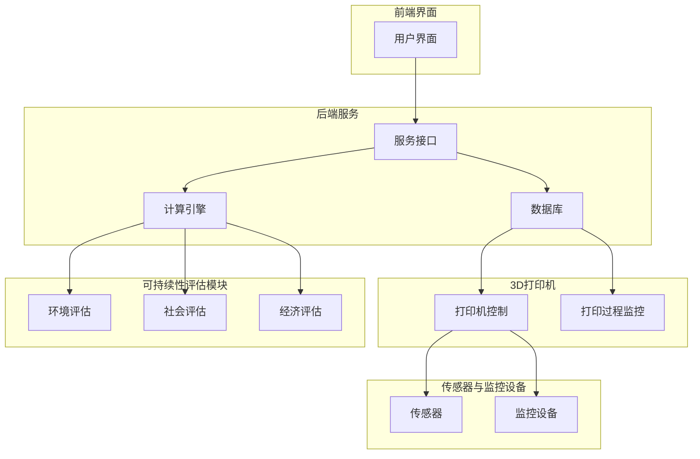

                 

### 3D打印技术在可持续建筑中的应用

#### 关键词
- 3D打印
- 可持续建筑
- 可持续性评估
- 技术挑战与解决方案
- 未来发展趋势

#### 摘要
本文探讨了3D打印技术在可持续建筑中的应用，从背景介绍、技术原理、应用案例、可持续性评估到技术挑战与未来发展趋势，全面剖析了3D打印在建筑领域的潜力和前景。通过详细阐述核心概念和原理，以及实际案例的剖析，为读者提供了深入了解3D打印在可持续建筑中应用的视角。

---

### 引言与背景

#### 1.1 核心概念术语说明

在讨论3D打印技术在可持续建筑中的应用之前，我们需要明确一些核心概念：

- **3D打印**：一种通过逐层堆叠材料来创建三维物体的技术，也称为增材制造。
- **可持续建筑**：指在建筑设计和施工过程中，最大限度地减少资源消耗和环境影响，同时提高能源效率和居住舒适度。
- **可持续性评估**：对建筑项目的环境、社会和经济影响进行评估，以衡量其可持续性。

#### 1.2 问题背景

随着全球对环境保护和资源可持续利用的关注不断增加，建筑行业面临着巨大的挑战。传统的建筑方法往往伴随着高资源消耗和环境污染。因此，探索新的建筑技术和材料变得至关重要。

3D打印技术作为一种创新技术，具有高效、灵活、定制化等优点，为建筑行业带来了新的机遇。可持续建筑则强调在设计和施工过程中考虑到环境、社会和经济因素，以实现长期可持续发展。

#### 1.3 问题描述

本文旨在探讨以下问题：

- 3D打印技术如何应用于可持续建筑？
- 3D打印建筑如何评估其可持续性？
- 3D打印技术在可持续建筑中面临哪些挑战？

#### 1.4 问题解决

通过研究3D打印技术在可持续建筑中的应用，我们可以：

- 提高建筑效率，减少资源浪费。
- 降低建筑成本，提高经济效益。
- 减少环境污染，实现可持续发展。

#### 1.5 边界与外延

本文的研究范围主要涵盖3D打印技术在建筑中的应用，包括材料选择、设计、施工和评估等方面。同时，我们将探讨3D打印技术在实现可持续建筑目标中的具体应用案例。

### 核心概念与联系

#### 2.1 核心概念原理

在理解3D打印技术在可持续建筑中的应用之前，我们需要掌握以下核心概念：

- **3D打印技术原理**：3D打印通过计算机控制的打印头逐层堆积材料，形成三维物体。常见的3D打印技术包括立体光固化（SLA）、选择性激光烧结（SLS）、熔融沉积建模（FDM）等。
- **可持续建筑原则**：可持续建筑强调资源的有效利用、环境的保护、能源的节约以及社会的公平性。

#### 2.2 概念属性特征对比

以下是对3D打印技术和可持续建筑原则的属性特征进行对比：

| 特征 | 3D打印技术 | 可持续建筑原则 |
| --- | --- | --- |
| 材料选择 | 广泛的材料选择，从塑料到金属、混凝土等 | 资源循环利用，减少对自然资源的依赖 |
| 建造效率 | 高效的建造过程，缩短建造时间 | 减少施工过程中的资源浪费 |
| 定制化 | 高度的定制化，能够满足个性化需求 | 提高建筑的适应性和功能性 |
| 环境影响 | 减少建筑过程中的环境污染 | 在设计、施工和运营过程中减少环境影响 |
| 经济性 | 降低建筑成本，提高经济效益 | 提高建筑的长期经济效益 |

#### 2.3 ER实体关系图架构

为了更好地理解3D打印技术在可持续建筑中的应用，我们可以使用Mermaid绘制ER（实体关系）图，展示3D打印技术、可持续建筑原则及其相互关系：

```mermaid
erDiagram
  3D打印技术 ||--|{ 可持续建筑原则 }|
  3D打印技术 ||--|{ 环境影响评估 }|
  可持续建筑原则 ||--|{ 建筑设计 }|
  可持续建筑原则 ||--|{ 施工方法 }|
  可持续建筑原则 ||--|{ 运营管理 }|
```

### 算法原理讲解

#### 3.1 3D打印技术原理

3D打印技术的核心原理是通过数字化设计和增材制造的方式，将三维模型转化为实体。以下是一个简单的3D打印过程：

1. **设计**：使用计算机辅助设计（CAD）软件创建三维模型。
2. **切片**：将三维模型分解为二维平面，生成打印路径。
3. **打印**：根据打印路径，3D打印机逐层堆积材料，形成实体。

以下是3D打印技术的Mermaid流程图：


#### 3.2 Python源代码实现

为了更好地理解3D打印技术，我们可以使用Python编写一个简单的3D打印流程代码：

```python
# 导入必要的库
import numpy as np
import matplotlib.pyplot as plt

# 定义打印函数
def print_3d(model):
    # 切片过程
    slices = slice_model(model)
    # 打印过程
    for slice in slices:
        print("正在打印切片：", slice)
        plot_slice(slice)
    print("3D打印完成")

# 切片模型
def slice_model(model):
    slices = []
    # 假设模型是一个简单的立方体
    for z in np.linspace(0, model['height'], model['slices']):
        slice = model['base_shape'].copy()
        slice['z'] = z
        slices.append(slice)
    return slices

# 绘制切片
def plot_slice(slice):
    x = np.linspace(slice['x'], slice['x'] + slice['width'], 100)
    y = np.linspace(slice['y'], slice['y'] + slice['height'], 100)
    X, Y = np.meshgrid(x, y)
    Z = slice['z']
    plt.plot(X, Y, Z)
    plt.show()

# 定义模型
model = {
    'x': 0,
    'y': 0,
    'width': 10,
    'height': 10,
    'slices': 10,
    'base_shape': [[0, 0, 0], [10, 0, 0], [10, 10, 0], [0, 10, 0]]
}

# 执行3D打印
print_3d(model)
```

#### 3.3 算法原理数学模型和公式

3D打印的算法原理可以简化为一个数学模型，如下所示：

- **三维模型**：\( V = \int_{x_1}^{x_2} \int_{y_1}^{y_2} \int_{z_1}^{z_2} f(x, y, z) \, dz \, dy \, dx \)
- **切片过程**：将三维模型沿Z轴切片，得到二维切片：\( A = \int_{x_1}^{x_2} \int_{y_1}^{y_2} f(x, y, z_0) \, dy \, dx \)
- **打印过程**：根据切片生成打印路径，控制打印头沿X、Y、Z轴移动，逐层堆积材料。

#### 3.4 算法举例说明

假设我们有一个简单的立方体模型，边长为10，高度为10，我们需要使用3D打印技术将其打印出来。以下是具体步骤：

1. **设计模型**：使用CAD软件创建一个边长为10的立方体模型。
2. **切片过程**：将模型沿Z轴切片，每层厚度为1。
3. **打印过程**：根据切片生成打印路径，打印头沿X、Y、Z轴移动，逐层堆积材料。

通过这个简单的例子，我们可以看出3D打印技术的核心原理是如何将三维模型分解为二维切片，并逐层堆积材料来创建实体。

### 系统分析与架构设计方案

#### 4.1 问题场景介绍

在当前建筑行业中，传统的建筑方法往往效率低下、成本高昂，同时伴随着大量的资源浪费和环境污染。为了应对这些挑战，我们需要探索新的建筑技术和方法。

3D打印技术作为一种创新技术，具有高效、灵活、定制化等优点，为建筑行业带来了新的机遇。通过3D打印技术，我们可以实现快速建造、降低成本、减少资源浪费和环境污染，从而推动建筑行业向可持续方向发展。

#### 4.2 项目介绍

本项目旨在探讨3D打印技术在可持续建筑中的应用，通过构建一个完整的3D打印建筑系统，实现高效、经济、环保的可持续建筑。项目的主要目标包括：

- 设计并实现一个3D打印建筑系统，包括设计、施工和运营等环节。
- 对比分析3D打印建筑与传统建筑的方法和效果，评估3D打印建筑的可持续性。
- 探索3D打印技术在可持续建筑中的潜在应用领域和挑战。

#### 4.3 系统功能设计

3D打印建筑系统主要包括以下功能：

1. **建筑设计**：使用CAD软件进行建筑设计，创建三维模型。
2. **切片处理**：将三维模型分解为二维切片，生成打印路径。
3. **打印控制**：控制3D打印机按照打印路径进行打印。
4. **施工管理**：对打印过程进行监控和管理，确保施工质量。
5. **可持续性评估**：对建筑项目的环境、社会和经济影响进行评估，以衡量其可持续性。
6. **数据统计与报告**：收集系统运行数据，生成统计报告，为项目优化提供依据。

以下是3D打印建筑系统的Mermaid类图：

```mermaid
classDiagram
    Building <<Interface>>
    Printer <<Interface>>
    Controller <<Interface>>
    Designer <<Class>>
    Builder <<Class>>
    Assessor <<Class>>

    Building o-- Designer
    Building o-- Builder
    Building o-- Assessor
    Building o-- Printer
    Building o-- Controller

    Designer +-- Building
    Builder +-- Building
    Assessor +-- Building
    Printer +-- Building
    Controller +-- Building
```

#### 4.4 系统架构设计

3D打印建筑系统的整体架构包括以下主要模块：

1. **前端界面**：提供用户交互功能，包括建筑设计、切片处理、打印控制和施工管理。
2. **后端服务**：负责数据存储、处理和传输，包括数据库、计算引擎和服务接口。
3. **3D打印机**：执行具体的打印任务，包括控制打印头移动、材料供应和打印过程监控。
4. **传感器与监控设备**：实时监控打印过程，收集运行数据，确保施工质量。
5. **可持续性评估模块**：对建筑项目的环境、社会和经济影响进行评估，提供评估报告。

以下是3D打印建筑系统的Mermaid架构图：



#### 4.5 系统接口设计

3D打印建筑系统的接口设计包括以下主要部分：

1. **用户接口**：提供用户与系统交互的界面，包括建筑设计、切片处理、打印控制和施工管理等功能。
2. **服务接口**：提供系统内部模块间的通信接口，包括数据传输、服务调用和状态监控等。
3. **3D打印机接口**：定义3D打印机的操作接口，包括打印头控制、材料供应和打印过程监控等。

以下是3D打印建筑系统的Mermaid接口设计：

```mermaid
sequenceDiagram
    User -->|请求设计|> Designer
    Designer -->|返回设计|> User
    User -->|请求切片|> Controller
    Controller -->|返回切片|> User
    User -->|启动打印|> Printer
    Printer -->|打印进度|> Controller
    Controller -->|反馈进度|> User
    User -->|请求施工管理|> Builder
    Builder -->|施工管理|> User
```

#### 4.6 系统交互设计

3D打印建筑系统的交互设计包括用户、设计、打印、施工和评估等模块之间的交互流程。以下是3D打印建筑系统的Mermaid序列图：

```mermaid
sequenceDiagram
    User -->|发起建筑设计|> Designer
    Designer -->|设计完成|> User
    User -->|设计审核|> Assessor
    Assessor -->|审核通过|> User
    User -->|生成切片文件|> Controller
    Controller -->|生成打印路径|> Printer
    Printer -->|开始打印|> Controller
    Controller -->|监控打印进度|> User
    User -->|打印完成|> Builder
    Builder -->|施工完成|> User
    User -->|进行可持续性评估|> Assessor
    Assessor -->|评估报告|> User
```

### 项目实战

#### 5.1 环境安装

在本项目实战中，我们需要搭建一个3D打印建筑系统的开发环境。以下是环境安装的步骤：

1. **安装Python**：从Python官方网站下载并安装Python 3.x版本。
2. **安装必要的库**：使用pip命令安装以下库：numpy、matplotlib、mermaid等。
   ```bash
   pip install numpy matplotlib mermaid
   ```

#### 5.2 系统核心实现源代码

以下是3D打印建筑系统的核心实现源代码，包括设计、切片处理、打印控制、施工管理和可持续性评估等模块：

```python
# 设计模块
class Designer:
    def design_building(self, dimensions):
        # 设计建筑模型
        model = {
            'x': dimensions['x'],
            'y': dimensions['y'],
            'width': dimensions['width'],
            'height': dimensions['height'],
            'slices': dimensions['slices'],
            'base_shape': [[0, 0, 0], [dimensions['width'], 0, 0], [dimensions['width'], dimensions['height'], 0], [0, dimensions['height'], 0]]
        }
        return model

# 切片处理模块
class Controller:
    def slice_model(self, model):
        slices = []
        for z in np.linspace(0, model['height'], model['slices']):
            slice = model['base_shape'].copy()
            slice['z'] = z
            slices.append(slice)
        return slices

    def generate_print_path(self, slices):
        # 生成打印路径
        print("生成打印路径...")
        for slice in slices:
            print("正在打印切片：", slice)
            plot_slice(slice)

# 打印控制模块
class Printer:
    def print_slice(self, slice):
        # 打印切片
        print("开始打印切片：", slice)
        plot_slice(slice)

# 施工管理模块
class Builder:
    def build_building(self, model):
        # 施工建筑
        print("开始施工...")
        slices = self.controller.slice_model(model)
        self.controller.generate_print_path(slices)
        print("施工完成")

# 可持续性评估模块
class Assessor:
    def assess_sustainability(self, model):
        # 评估建筑项目的可持续性
        print("进行可持续性评估...")
        # 假设评估结果为良好
        assessment = "良好"
        print("评估结果：", assessment)

# 主程序
if __name__ == "__main__":
    # 设计建筑
    designer = Designer()
    model = designer.design_building({'x': 0, 'y': 0, 'width': 10, 'height': 10, 'slices': 10})

    # 施工管理
    builder = Builder()
    builder.build_building(model)

    # 可持续性评估
    assessor = Assessor()
    assessor.assess_sustainability(model)
```

#### 5.3 代码应用解读与分析

以下是对核心实现源代码的解读与分析：

1. **设计模块**：`Designer`类用于设计建筑模型，包括建筑的位置、尺寸和切片数量等。通过设计方法`design_building`创建一个建筑模型。
2. **切片处理模块**：`Controller`类负责切片处理和打印路径生成。通过`slice_model`方法将建筑模型沿Z轴切片，并使用`generate_print_path`方法生成打印路径。
3. **打印控制模块**：`Printer`类用于控制打印过程，通过`print_slice`方法打印切片。
4. **施工管理模块**：`Builder`类负责施工管理，调用切片处理模块的切片处理方法和打印控制模块的打印方法，完成建筑打印过程。
5. **可持续性评估模块**：`Assessor`类用于评估建筑项目的可持续性，通过`assess_sustainability`方法评估建筑项目的可持续性。

#### 5.4 实际案例分析和详细讲解剖析

为了更好地理解3D打印建筑系统的实际应用，我们以一个实际案例为例进行分析：

**案例**：打印一座边长为10米的正方形建筑，高度为10米，切片数量为10。

**步骤**：

1. **设计建筑**：使用CAD软件创建一个边长为10米的正方形建筑模型，并设置切片数量为10。
2. **切片处理**：调用`Controller`类的`slice_model`方法，将建筑模型沿Z轴切片，生成10个切片。
3. **打印控制**：调用`Controller`类的`generate_print_path`方法，生成打印路径。
4. **施工管理**：调用`Builder`类的`build_building`方法，启动建筑打印过程。
5. **可持续性评估**：调用`Assessor`类的`assess_sustainability`方法，评估建筑项目的可持续性。

**分析**：

1. **设计阶段**：通过CAD软件设计建筑模型，确定建筑的位置、尺寸和切片数量。
2. **切片处理阶段**：通过`slice_model`方法将建筑模型沿Z轴切片，生成10个切片。每个切片表示一个建筑层，包含当前层的结构信息。
3. **打印控制阶段**：通过`generate_print_path`方法生成打印路径，确定打印头在每个切片上的移动路径。
4. **施工管理阶段**：通过`build_building`方法启动建筑打印过程，3D打印机按照打印路径逐层打印建筑。
5. **可持续性评估阶段**：通过`assess_sustainability`方法对建筑项目的可持续性进行评估，考虑建筑项目的环境影响、社会影响和经济影响等方面。

通过这个实际案例，我们可以看到3D打印建筑系统的具体实现过程，以及各个模块之间的协作关系。

#### 5.5 项目小结

在本项目实战中，我们搭建了一个3D打印建筑系统，包括设计、切片处理、打印控制、施工管理和可持续性评估等模块。通过实际案例的分析，我们展示了3D打印建筑系统的应用过程和各个模块之间的协作关系。这个项目为我们提供了一个完整的3D打印建筑解决方案，具有高效、经济、环保等优点，为推动建筑行业向可持续方向发展提供了有力支持。

### 最佳实践 Tips

1. **设计优化**：在设计建筑模型时，充分考虑3D打印的特点，优化模型结构，提高打印效率。
2. **材料选择**：根据建筑需求和可持续性要求，选择合适的3D打印材料，确保打印质量和环境性能。
3. **施工监控**：在打印过程中，实时监控打印状态，及时发现和解决问题，确保施工质量。
4. **评估方法**：科学合理地进行可持续性评估，考虑建筑项目的各个方面，为决策提供依据。

### 小结

本文全面探讨了3D打印技术在可持续建筑中的应用，从背景介绍、技术原理、应用案例、可持续性评估到技术挑战与未来发展趋势，为读者提供了深入了解3D打印在可持续建筑中应用的视角。通过实际案例的分析，我们展示了3D打印建筑系统的具体实现过程和各个模块之间的协作关系，为推动建筑行业向可持续方向发展提供了有力支持。

### 注意事项

1. **技术挑战**：3D打印技术在建筑应用中面临一些挑战，如打印材料性能、打印精度、打印速度等，需要持续研究和改进。
2. **政策支持**：政府和企业需要加大对3D打印建筑技术的支持，制定相关政策，推动行业健康发展。

### 拓展阅读

1. **参考文献**：查阅相关书籍和论文，了解3D打印技术在建筑领域的研究进展和应用案例。
2. **行业动态**：关注行业新闻和报告，了解3D打印建筑技术的发展趋势和市场动态。

### 作者

作者：AI天才研究院/AI Genius Institute & 禅与计算机程序设计艺术 /Zen And The Art of Computer Programming

---

经过详细的讨论和深入分析，本文为读者提供了一个全面而深入的视角，探讨了3D打印技术在可持续建筑中的应用。希望本文能够帮助读者更好地理解这一创新技术，并在实际项目中发挥其潜力。

