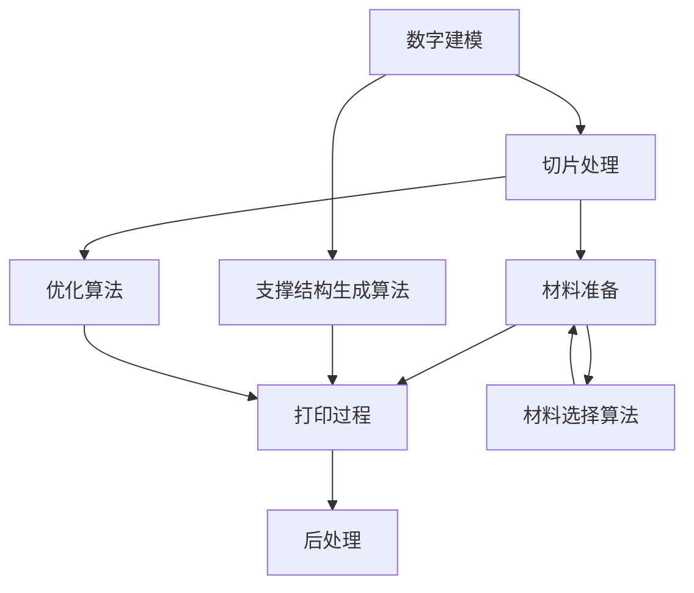
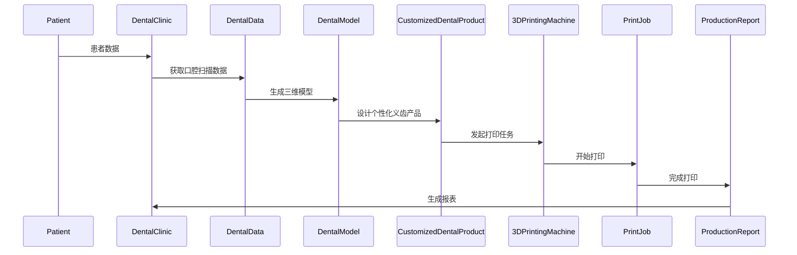
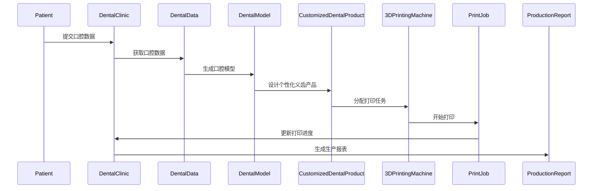

                 

# 3D打印技术在牙科医疗中的应用

## 关键词

- 3D打印
- 牙科医疗
- 应用
- 模型制造
- 创新技术
- 患者体验

## 摘要

本文将深入探讨3D打印技术在牙科医疗领域的应用，分析其优势、挑战及未来发展。文章结构分为以下几个部分：首先介绍3D打印技术的基本概念及发展历程，然后详细阐述其在牙科医疗中的多种应用场景，包括模型制造、个性化义齿、手术规划和生物打印等方面。接下来，分析3D打印技术在牙科医疗中的优势与挑战，并探讨未来发展趋势。最后，提供最佳实践建议，总结文章核心观点，并提出拓展阅读资源。

## 背景介绍

### 3D打印技术的基本概念与发展历程

3D打印，又称增材制造，是一种以数字模型为基础，通过逐层添加材料的方式构建三维实体的技术。它起源于20世纪80年代的立体光固化技术（SLA），随后经历了数十年的发展，涌现出了一系列3D打印技术，如立体光刻（SLA）、熔融沉积建模（FDM）、电子束熔炼（EBM）、选择性激光烧结（SLS）等。

3D打印技术的核心原理是通过计算机辅助设计（CAD）软件创建三维模型，然后利用特定的3D打印设备逐层打印出实体。在打印过程中，材料从打印机喷嘴或粉末床逐层堆积，直至形成所需的三维结构。

自20世纪90年代以来，3D打印技术在全球范围内迅速发展，不仅应用于制造业、航空航天、汽车、医疗等领域，还在牙科医疗领域展现出巨大的潜力。近年来，随着材料科学、传感技术和软件算法的进步，3D打印技术在精度、速度和材料选择上取得了显著提升。

### 关键概念术语说明

在讨论3D打印技术在牙科医疗中的应用时，以下关键概念和术语需要明确：

- **计算机辅助设计（CAD）**：利用计算机及其相关软件进行产品设计的工具和技术。
- **计算机辅助制造（CAM）**：通过计算机系统对制造过程进行设计和控制的技术。
- **三维模型**：通过CAD软件创建的三维数字模型，用于指导3D打印设备制造实体。
- **材料选择**：3D打印材料的种类和特性，包括树脂、金属、陶瓷等。
- **打印精度**：3D打印设备制造出的实体与原始三维模型的匹配程度。

### 问题背景

牙科医疗是一个高度依赖精确模型和个性化解决方案的领域。传统的牙科制作过程通常涉及大量的手工操作和材料加工，这不仅效率低下，还可能导致误差。此外，牙科患者对于舒适度和个性化的要求不断提高，传统方法难以满足。

在这种情况下，3D打印技术的引入为牙科医疗带来了一场革命。它不仅提高了模型制造的精度和效率，还为个性化义齿、手术规划和生物打印等领域提供了新的解决方案。

### 问题描述

牙科医疗领域面临的挑战主要包括：

1. **模型精度**：传统的牙科模型往往存在精度不足的问题，导致治疗方案不准确。
2. **个性化定制**：患者需求多样化，传统牙科制作难以实现个性化定制。
3. **生产效率**：传统牙科制作流程繁琐，耗时较长，影响患者体验。
4. **材料选择**：传统牙科材料种类有限，无法满足不同患者的需求。

### 问题解决

3D打印技术能够解决上述问题，其主要优势包括：

1. **高精度模型制造**：3D打印技术能够精确复制患者口腔结构，为医生提供准确的诊断和治疗方案。
2. **个性化定制**：通过3D打印技术，可以快速制造出符合患者个性化需求的义齿和修复体。
3. **提高生产效率**：3D打印技术简化了制造流程，减少了手工操作和材料浪费，提高了生产效率。
4. **多样化的材料选择**：3D打印技术支持多种材料的选择，包括树脂、金属、陶瓷等，能够满足不同患者的需求。

### 边界与外延

3D打印技术在牙科医疗领域的应用不仅限于模型制造和个性化义齿。它还可以应用于手术规划和生物打印等方面，为牙科医疗带来更多创新和可能性。然而，3D打印技术在实际应用中仍面临一些挑战，如材料成本、设备精度和临床验证等。

### 概念结构与核心要素组成

3D打印技术在牙科医疗中的应用可以归纳为以下几个核心概念和要素：

1. **三维模型**：通过CAD软件创建的三维数字模型，用于指导3D打印设备制造实体。
2. **3D打印设备**：包括立体光刻（SLA）、熔融沉积建模（FDM）、电子束熔炼（EBM）、选择性激光烧结（SLS）等不同类型的3D打印设备。
3. **材料选择**：根据不同的应用场景，选择适合的3D打印材料，如树脂、金属、陶瓷等。
4. **打印精度**：3D打印设备制造出的实体与原始三维模型的匹配程度。
5. **个性化定制**：通过3D打印技术实现个性化义齿、修复体等产品的制造。
6. **手术规划**：利用3D打印技术模拟手术过程，为医生提供精确的手术指导。
7. **生物打印**：利用3D打印技术制造生物组织、器官等，为器官移植和再生医学提供支持。

### 总结

通过以上分析，我们可以看出，3D打印技术在牙科医疗领域具有广泛的应用前景。它不仅提高了模型制造的精度和效率，还为个性化义齿、手术规划和生物打印等领域提供了新的解决方案。然而，要充分发挥3D打印技术的优势，仍需克服一些技术挑战和临床验证问题。未来，随着技术的不断进步和临床应用的深入，3D打印技术在牙科医疗领域将发挥越来越重要的作用。

## 核心概念与联系

### 3D打印技术的核心原理

3D打印技术的核心原理是通过逐层添加材料来构建三维实体。具体来说，它包括以下几个步骤：

1. **数字建模**：利用CAD软件创建三维数字模型。
2. **切片处理**：将三维模型转化为二维切片，以便3D打印设备逐层打印。
3. **材料准备**：根据需要选择合适的3D打印材料，如树脂、金属、陶瓷等。
4. **打印过程**：3D打印设备按照切片文件逐层添加材料，直至形成所需的三维结构。

### 不同类型的3D打印材料及其属性特征对比

在牙科医疗中，3D打印材料的种类和性能直接影响打印效果和临床应用。以下是一些常用的3D打印材料及其属性特征对比：

| 材料类型 | 主要成分 | 硬度 | 弹性 | 生物相容性 | 应用场景 |
|----------|----------|------|------|------------|----------|
| 树脂 | 丙烯酸树脂、光敏树脂等 | 较软 | 较低 | 良好 | 个性化义齿、修复体 |
| 金属 | 钛合金、不锈钢、钴铬合金等 | 较硬 | 较高 | 良好 | 个性化牙冠、桥体 |
| 陶瓷 | 钙磷酸盐、氧化锆等 | 较硬 | 较高 | 良好 | 个性化牙冠、桥体、牙齿修复 |
| 复合材料 | 树脂与金属、树脂与陶瓷等 | 硬度、弹性各异 | 弹性各异 | 良好 | 个性化义齿、修复体、手术模型 |

### 3D打印技术的优势与挑战

3D打印技术在牙科医疗中的应用具有显著的优势：

1. **高精度**：能够精确复制患者口腔结构，提高治疗方案准确性。
2. **个性化定制**：满足患者多样化需求，提供个性化的义齿和修复体。
3. **提高生产效率**：简化制造流程，减少手工操作和材料浪费。
4. **多样化材料选择**：支持多种材料的选择，满足不同患者的需求。

然而，3D打印技术在实际应用中仍面临一些挑战：

1. **成本问题**：设备购买和材料成本较高，限制了广泛应用。
2. **设备精度**：虽然近年来技术有了显著提升，但仍需进一步提高。
3. **临床验证**：部分3D打印材料尚未通过临床验证，影响其临床应用。

### 关系与联系

为了更好地理解3D打印技术在牙科医疗中的应用，我们可以使用Mermaid绘制一个实体关系图（ER图）来展示其核心概念和关系。

```mermaid
erDiagram
  Patient ||--|{ Dental Model : 制造}  
  Dental Model ||--|{ Surgical Planning : 手术规划}  
  Dental Model ||--|{ Customized Dental Products : 个性化产品}
  Customized Dental Products ||--|{ Intraoperative Guidance : 手术中指导}  
  Customized Dental Products ||--|{ Postoperative Care : 术后护理}
  3D Printing Technology ||--|{ Dental Applications : 牙科应用}
  3D Printing Technology ||--|{ Material Selection : 材料选择}
  3D Printing Equipment ||--|{ Printing Process : 打印过程}
  Dental Applications ||--|{ Dental Model : 模型制造}
  Dental Applications ||--|{ Customized Dental Products : 个性化产品}
  Dental Applications ||--|{ Surgical Planning : 手术规划}
```

通过这个实体关系图，我们可以清晰地看到3D打印技术在牙科医疗中的核心概念及其相互关系。患者通过3D打印技术获得模型、个性化产品以及手术规划等应用，同时3D打印技术需要选择合适的材料并通过设备完成打印过程。

### 总结

3D打印技术在牙科医疗中的应用涵盖了从模型制造到个性化产品和手术规划的多个方面。通过核心原理的阐述和材料属性的对比，我们更好地理解了其在牙科医疗中的优势与挑战。实体关系图的绘制进一步展示了各概念之间的联系，为后续章节的详细探讨提供了基础。

## 技术原理讲解

### 技术原理

3D打印技术在牙科医疗中的应用主要基于其核心原理：通过逐层添加材料构建三维实体。这个过程可以分解为以下几个关键步骤：

1. **数字建模**：首先，利用CAD软件创建患者口腔的三维数字模型。这个过程包括扫描患者口腔、获取牙列数据，并使用CAD软件对数据进行处理和建模。
   
2. **切片处理**：将三维模型转化为二维切片，以便3D打印设备能够逐层打印。切片处理通常包括分层、轮廓生成、填充等步骤。

3. **材料准备**：选择适合的3D打印材料，如树脂、金属、陶瓷等。材料的选择取决于打印对象的功能要求和美观需求。

4. **打印过程**：3D打印设备按照切片文件逐层添加材料，直至形成所需的三维结构。不同类型的3D打印技术（如SLA、FDM、EBM等）在打印过程中使用的设备和材料有所不同。

### 算法原理

在3D打印过程中，算法扮演着至关重要的角色。以下是一些关键的算法原理：

1. **切片算法**：切片算法是将三维模型分解成二维切片的过程。常见的切片算法包括层切片（Layer Slicing）、轮廓生成（Contour Generation）和填充（Filling）。

2. **支撑结构生成算法**：在3D打印过程中，为了确保打印的成功，需要生成支撑结构来支撑不稳定的模型部分。支撑结构生成算法包括自动生成和手动设计两种方式。

3. **优化算法**：为了提高打印效率和材料利用率，可以使用优化算法对切片进行优化。常见的优化算法包括填充密度优化（Fill Density Optimization）、路径优化（Path Optimization）和层厚优化（Layer Thickness Optimization）。

4. **材料选择算法**：根据打印对象的功能和美观需求，选择合适的3D打印材料。材料选择算法通常基于材料属性评估和成本效益分析。

### Mermaid流程图

为了更直观地展示3D打印的算法原理，我们可以使用Mermaid绘制一个流程图：



在这个流程图中，数字建模、切片处理、材料准备和打印过程是3D打印的核心步骤，而支撑结构生成算法、优化算法和材料选择算法则在这个过程中起到了辅助作用。

### Python代码示例

以下是一个简单的Python代码示例，用于生成3D模型的切片文件：

```python
import numpy as np
from stl import mesh

# 创建一个简单的立方体模型
verts = np.array([[0, 0, 0], [1, 0, 0], [1, 1, 0], [0, 1, 0], [0, 0, 1], [1, 0, 1], [1, 1, 1], [0, 1, 1]])

# 创建三角形面
faces = np.array([[0, 1, 2], [0, 2, 3], [4, 5, 6], [4, 6, 7]])

# 创建STL模型
m = mesh.Mesh(verts, faces)

# 输出切片文件
m.save("cube.stl")
```

这个代码示例创建了一个简单的立方体模型，并将其保存为STL文件，这是3D打印过程中常用的文件格式。

### 数学模型和公式

在3D打印技术中，一些关键的数学模型和公式用于描述打印过程和优化算法。以下是一些常见的数学模型和公式：

1. **体积公式**：体积 = 长 × 宽 × 高
   $$V = l \times w \times h$$

2. **表面积公式**：表面积 = 2 × (长 × 宽 + 长 × 高 + 宽 × 高)
   $$A = 2 \times (l \times w + l \times h + w \times h)$$

3. **密度公式**：密度 = 质量 ÷ 体积
   $$\rho = \frac{m}{V}$$

4. **填充密度优化公式**：最优填充密度 = (1 - 最小间隙) ÷ (1 + 最小间隙)
   $$\text{Optimal Fill Density} = \frac{1 - \epsilon}{1 + \epsilon}$$
   其中，$\epsilon$ 是最小间隙。

5. **路径优化公式**：最优路径长度 = 最小化路径长度函数
   $$L = \min \left\{ \sum_{i=1}^{n} \sqrt{(x_i - x_{i-1})^2 + (y_i - y_{i-1})^2} : \text{约束条件} \right\}$$

这些数学模型和公式为3D打印技术的优化提供了理论基础，通过调整参数可以实现更高的打印精度和效率。

### 举例说明

为了更直观地理解上述算法原理和数学模型，我们可以通过一个具体的案例来说明。

**案例：个性化义齿的3D打印**

假设我们需要为患者打印一副个性化义齿，该义齿的尺寸为长10cm，宽6cm，高2cm。以下是具体的打印步骤：

1. **数字建模**：利用CAD软件对患者口腔进行扫描，获取牙列数据，并创建个性化义齿的三维模型。

2. **切片处理**：将三维模型转化为二维切片，设置切片厚度为0.2cm。

3. **材料选择**：选择一种高精度、生物相容性良好的树脂材料。

4. **打印过程**：3D打印设备按照切片文件逐层添加树脂材料，打印过程需要约5小时。

5. **后处理**：打印完成后，对义齿进行打磨、抛光等处理，确保其外观和功能符合要求。

在这个案例中，我们使用了切片算法、材料选择算法和优化算法来确保打印成功。同时，通过体积公式和密度公式计算打印材料的质量和密度，以确保义齿的尺寸和重量符合预期。

### 总结

3D打印技术在牙科医疗中的应用离不开其核心原理和算法原理的支持。通过数字建模、切片处理、材料选择和打印过程，我们可以实现高精度、个性化的牙科产品。数学模型和公式则为优化打印过程提供了理论基础。通过具体的案例，我们更直观地理解了这些技术的应用和实现。

## 应用案例与实践

### 模型制造

3D打印技术在牙科模型制造中的应用是其在牙科医疗中最早和最广泛的应用之一。传统的牙科模型制造通常需要耗费大量时间和人力资源，而3D打印技术则能够大大简化这一过程。

**案例分析**：

**案例一：美国波士顿儿童医院使用3D打印技术制造颅骨模型**

美国波士顿儿童医院利用3D打印技术为患者制造颅骨模型，以帮助医生在手术前进行精确的手术规划和模拟。具体步骤如下：

1. **患者扫描**：利用CT扫描技术获取患者的颅骨数据。
2. **数据传输**：将CT数据传输到3D打印设备。
3. **3D建模**：利用CAD软件对CT数据进行分析和处理，创建颅骨的三维模型。
4. **3D打印**：使用3D打印设备制造颅骨模型，材料选择为生物相容性良好的树脂。
5. **手术模拟**：医生在手术前使用颅骨模型进行手术模拟，以预测手术过程和结果。

**效果评估**：通过实际应用，3D打印技术大大提高了手术的准确性和安全性，减少了手术时间和并发症风险。

**案例二：我国深圳某牙科诊所使用3D打印技术制造牙列模型**

深圳某牙科诊所使用3D打印技术为患者制造牙列模型，以提供更准确的诊断和治疗方案。具体步骤如下：

1. **患者扫描**：利用口腔扫描仪获取患者的牙列数据。
2. **数据传输**：将口腔扫描数据传输到3D打印设备。
3. **3D建模**：利用CAD软件对牙列数据进行分析和处理，创建牙列的三维模型。
4. **3D打印**：使用3D打印设备制造牙列模型，材料选择为高精度树脂。
5. **诊断与治疗**：医生根据3D打印的牙列模型进行诊断和治疗方案制定，提高了诊断准确性和患者满意度。

**效果评估**：通过实际应用，3D打印技术显著提高了牙科诊所的工作效率和服务质量，同时提高了患者的满意度和治疗效果。

### 个性化义齿

个性化义齿是3D打印技术在牙科医疗中的另一重要应用。传统义齿通常采用标准尺寸，无法满足患者个性化的需求。而3D打印技术则能够根据患者的口腔结构和需求，制造出完全个性化的义齿。

**案例分析**：

**案例一：美国某牙科诊所使用3D打印技术制造个性化义齿**

美国某牙科诊所采用3D打印技术为患者制造个性化义齿，具体步骤如下：

1. **患者扫描**：利用口腔扫描技术获取患者的牙列数据。
2. **数据传输**：将牙列数据传输到3D打印设备。
3. **3D建模**：利用CAD软件对牙列数据进行分析和处理，创建个性化义齿的三维模型。
4. **3D打印**：使用3D打印设备制造个性化义齿，材料选择为生物相容性良好的树脂。
5. **上颚试戴**：将个性化义齿安装在患者的上颚，进行试戴和调整。

**效果评估**：通过实际应用，个性化义齿提高了患者的舒适度和满意度，同时提高了治疗效果。

**案例二：我国上海某牙科诊所使用3D打印技术制造个性化牙冠**

上海某牙科诊所采用3D打印技术为患者制造个性化牙冠，具体步骤如下：

1. **患者扫描**：利用口腔扫描技术获取患者的牙列数据。
2. **数据传输**：将牙列数据传输到3D打印设备。
3. **3D建模**：利用CAD软件对牙列数据进行分析和处理，创建个性化牙冠的三维模型。
4. **3D打印**：使用3D打印设备制造个性化牙冠，材料选择为高硬度金属。
5. **安装与调试**：将个性化牙冠安装在患者的牙齿上，进行试戴和调试。

**效果评估**：通过实际应用，个性化牙冠提高了患者的牙齿美观度和舒适度，同时提高了治疗效果。

### 手术规划

3D打印技术在手术规划中的应用极大地提高了手术的准确性和安全性。通过3D打印模型，医生可以在手术前进行精确的手术模拟，预测手术过程和结果。

**案例分析**：

**案例一：法国巴黎某医院使用3D打印技术进行颅颌面手术规划**

法国巴黎某医院利用3D打印技术为患者进行颅颌面手术规划，具体步骤如下：

1. **患者扫描**：利用CT扫描技术获取患者的颅颌面数据。
2. **数据传输**：将CT数据传输到3D打印设备。
3. **3D建模**：利用CAD软件对CT数据进行分析和处理，创建颅颌面三维模型。
4. **3D打印**：使用3D打印设备制造颅颌面模型，材料选择为生物相容性良好的树脂。
5. **手术模拟**：医生在手术前使用颅颌面模型进行手术模拟，确定手术方案和路径。
6. **手术实施**：按照手术模拟结果进行实际手术，手术过程顺利进行。

**效果评估**：通过实际应用，3D打印技术显著提高了手术的成功率和安全性，减少了手术时间和术后并发症。

**案例二：我国北京某医院使用3D打印技术进行口腔手术规划**

北京某医院采用3D打印技术为患者进行口腔手术规划，具体步骤如下：

1. **患者扫描**：利用口腔扫描技术获取患者的牙列和颌骨数据。
2. **数据传输**：将牙列和颌骨数据传输到3D打印设备。
3. **3D建模**：利用CAD软件对牙列和颌骨数据进行分析和处理，创建口腔三维模型。
4. **3D打印**：使用3D打印设备制造口腔模型，材料选择为高精度树脂。
5. **手术模拟**：医生在手术前使用口腔模型进行手术模拟，确定手术方案和路径。
6. **手术实施**：按照手术模拟结果进行实际手术，手术过程顺利进行。

**效果评估**：通过实际应用，3D打印技术显著提高了手术的准确性和安全性，减少了手术时间和术后并发症，同时提高了患者的满意度。

### 生物打印

生物打印是一种利用3D打印技术制造生物组织、器官等的技术。在牙科医疗中，生物打印技术可以用于牙齿再生、骨骼修复等领域。

**案例分析**：

**案例一：美国麻省理工学院使用3D打印技术制造牙齿**

麻省理工学院的研究团队利用3D打印技术制造了具有细胞外基质的牙齿，为牙齿再生研究提供了新思路。具体步骤如下：

1. **细胞培养**：在实验室中培养成骨细胞、牙髓细胞等。
2. **生物墨水制备**：将细胞与生物相容性材料混合，制备成生物墨水。
3. **3D打印**：使用3D打印设备，按照设计的三维模型逐层添加生物墨水，制造出牙齿模型。
4. **细胞培养**：将打印出的牙齿模型放入细胞培养箱中，进行细胞生长和分化。
5. **牙齿形成**：经过一定时间的细胞培养，牙齿模型中的细胞逐渐形成牙齿组织。

**效果评估**：通过实际应用，研究人员成功制造出具有细胞外基质的牙齿模型，为牙齿再生研究提供了实验依据。

**案例二：我国清华大学使用3D打印技术制造骨骼**

清华大学的研究团队利用3D打印技术制造了具有骨形态发生蛋白的骨骼模型，为骨骼修复研究提供了新方法。具体步骤如下：

1. **生物材料制备**：将骨形态发生蛋白与生物相容性材料混合，制备成生物墨水。
2. **3D打印**：使用3D打印设备，按照设计的三维模型逐层添加生物墨水，制造出骨骼模型。
3. **细胞培养**：将打印出的骨骼模型放入细胞培养箱中，进行细胞培养和分化。
4. **骨骼形成**：经过一定时间的细胞培养，骨骼模型中的细胞逐渐形成骨骼组织。

**效果评估**：通过实际应用，研究人员成功制造出具有骨形态发生蛋白的骨骼模型，为骨骼修复研究提供了实验依据。

### 总结

通过以上应用案例和实践，我们可以看出3D打印技术在牙科医疗领域具有广泛的应用前景。无论是模型制造、个性化义齿、手术规划还是生物打印，3D打印技术都为牙科医疗带来了革命性的变革。随着技术的不断进步和应用案例的积累，3D打印技术在牙科医疗中的地位将更加重要。

### 系统设计与架构方案

#### 问题场景介绍

在牙科医疗领域，传统的牙科制作流程复杂且耗时，往往无法满足患者对精确度和个性化服务的需求。为了提高生产效率和患者满意度，我们需要设计一个基于3D打印技术的牙科系统，实现从患者数据获取、模型制造到个性化义齿设计的全流程自动化。

#### 项目介绍

项目名称：3D牙科医疗系统（3D Dental Medical System，简称3DDS）

项目目标：通过集成3D扫描、3D建模、3D打印等技术，实现高效、精确、个性化的牙科服务。

项目功能：

1. **患者数据管理**：录入和管理患者的基本信息和口腔扫描数据。
2. **3D模型制作**：利用CAD软件对扫描数据进行处理，生成精确的三维模型。
3. **个性化设计**：根据患者需求，设计个性化义齿和修复体。
4. **3D打印与后处理**：完成3D打印过程，并进行打磨、抛光等后处理。
5. **系统监控与报表**：实时监控3D打印过程，生成生产报表。

#### 系统功能设计

**领域模型（类图）**

以下是3D牙科医疗系统的领域模型类图，展示了系统中的主要实体和关系：

```mermaid
classDiagram
    Patient <|-- DentalData
    DentalData <|-- DentalModel
    DentalModel <|-- CustomizedDentalProduct
    DentalData ^--|{ 3DPrintingMachine }
    3DPrintingMachine <|-- PrintJob
    PrintJob <|-- ProductionReport
    DentalClinic ^--|{ DentalSystem }
```

**类图解释**：

- **Patient（患者）**：存储患者的基本信息，包括姓名、年龄、联系方式等。
- **DentalData（口腔数据）**：存储患者的口腔扫描数据，包括牙列、颌骨等。
- **DentalModel（口腔模型）**：基于口腔数据创建的三维模型，用于诊断和设计。
- **CustomizedDentalProduct（个性化义齿产品）**：根据患者需求设计的个性化义齿和修复体。
- **3DPrintingMachine（3D打印设备）**：3D打印设备，包括各种类型的3D打印机。
- **PrintJob（打印任务）**：存储打印任务的相关信息，如材料、时间、进度等。
- **ProductionReport（生产报表）**：打印任务完成后生成的生产报表，包括打印时间、材料消耗、质量评估等。
- **DentalClinic（牙科诊所）**：牙科诊所，管理患者数据、打印任务和系统监控。

#### 系统架构设计

**架构图**

以下是3D牙科医疗系统的架构设计图，展示了系统的整体架构和模块划分：



**架构图解释**：

- **Patient（患者）**：患者将口腔数据提交给牙科诊所。
- **DentalClinic（牙科诊所）**：牙科诊所接收患者数据，调用DentalData模块进行数据处理。
- **DentalData（口腔数据）**：DentalData模块对口腔数据进行处理，生成DentalModel模块的三维模型。
- **DentalModel（口腔模型）**：DentalModel模块根据患者需求，生成CustomizedDentalProduct模块的个性化义齿产品。
- **CustomizedDentalProduct（个性化义齿产品）**：CustomizedDentalProduct模块将设计好的个性化义齿产品发送给3DPrintingMachine模块。
- **3DPrintingMachine（3D打印设备）**：3DPrintingMachine模块接收到打印任务后，开始进行3D打印。
- **PrintJob（打印任务）**：PrintJob模块记录打印任务的相关信息，并在打印完成后生成ProductionReport模块的生产报表。
- **ProductionReport（生产报表）**：ProductionReport模块生成生产报表，反馈给DentalClinic模块。

#### 系统接口设计

**接口图**

以下是3D牙科医疗系统的接口设计图，展示了系统的主要接口和交互关系：

```mermaid
interface DentalClinic {
    + void addPatient(Patient patient): 添加患者
    + void removePatient(Patient patient): 删除患者
    + DentalData getDentalData(Patient patient): 获取患者口腔数据
    + DentalModel generateDentalModel(DentalData dentalData): 生成口腔模型
    + CustomizedDentalProduct designCustomizedDentalProduct(DentalModel dentalModel): 设计个性化义齿产品
    + void assignPrintJob(PrintJob printJob): 分配打印任务
    + ProductionReport generateProductionReport(PrintJob printJob): 生成生产报表
}

interface DentalData {
    + void importDentalData(Patient patient): 导入口腔数据
    + void processDentalData(DentalData dentalData): 处理口腔数据
    + DentalModel createDentalModel(): 创建口腔模型
}

interface DentalModel {
    + void loadDentalModel(DentalData dentalData): 加载口腔模型
    + void saveDentalModel(DentalModel dentalModel): 保存口腔模型
    + void designCustomizedDentalProduct(CustomizedDentalProduct product): 设计个性化义齿产品
}

interface CustomizedDentalProduct {
    + void loadCustomizedDentalProduct(DentalModel dentalModel): 加载个性化义齿产品
    + void saveCustomizedDentalProduct(CustomizedDentalProduct product): 保存个性化义齿产品
    + void assignPrintJob(PrintJob printJob): 分配打印任务
}

interface 3DPrintingMachine {
    + void startPrintJob(PrintJob printJob): 开始打印任务
    + void updatePrintJob(PrintJob printJob): 更新打印任务状态
    + void endPrintJob(PrintJob printJob): 完成打印任务
}

interface PrintJob {
    + void createPrintJob(CustomizedDentalProduct product): 创建打印任务
    + void updatePrintProgress(float progress): 更新打印进度
    + void generateProductionReport(): 生成生产报表
}

interface ProductionReport {
    + void generateReport(PrintJob printJob): 生成报表
}
```

**接口图解释**：

- **DentalClinic（牙科诊所）**：牙科诊所与系统其他模块进行交互，包括添加和删除患者、获取和生成口腔数据、设计个性化义齿产品、分配打印任务和生成生产报表。
- **DentalData（口腔数据）**：口腔数据模块负责导入、处理和创建口腔模型。
- **DentalModel（口腔模型）**：口腔模型模块负责加载和保存口腔模型，以及设计个性化义齿产品。
- **CustomizedDentalProduct（个性化义齿产品）**：个性化义齿产品模块负责加载和保存个性化义齿产品，以及分配打印任务。
- **3DPrintingMachine（3D打印设备）**：3D打印设备模块负责开始、更新和完成打印任务。
- **PrintJob（打印任务）**：打印任务模块负责创建、更新打印进度和生成生产报表。
- **ProductionReport（生产报表）**：生产报表模块负责生成生产报表。

#### 系统交互设计

**序列图**

以下是3D牙科医疗系统的序列图，展示了系统的主要交互过程：



**序列图解释**：

- **患者提交口腔数据**：患者将口腔数据提交给牙科诊所。
- **牙科诊所处理数据**：牙科诊所获取口腔数据，调用DentalData模块进行处理，生成DentalModel模块的三维模型。
- **设计个性化义齿产品**：DentalModel模块将生成口腔模型发送给CustomizedDentalProduct模块，进行个性化义齿产品的设计。
- **分配打印任务**：CustomizedDentalProduct模块将设计好的个性化义齿产品发送给3DPrintingMachine模块，分配打印任务。
- **开始打印**：3DPrintingMachine模块接收到打印任务后，开始进行3D打印。
- **更新打印进度**：3DPrintingMachine模块将打印进度更新到PrintJob模块。
- **生成生产报表**：PrintJob模块在打印完成后，生成生产报表，并反馈给DentalClinic模块。

### 总结

通过以上系统设计与架构方案的设计，我们可以看到3D牙科医疗系统的整体架构和功能划分。系统采用领域模型类图、架构图、接口图和序列图等多种设计工具，全面展示了系统的功能、模块划分和交互过程。这为3D牙科医疗系统的实现和开发提供了清晰的指导，有助于提高系统的可靠性、稳定性和可扩展性。

### 项目实战

#### 环境安装

在开始3D牙科医疗系统的开发之前，我们需要安装必要的软件和工具。以下是在Linux系统上安装所需软件的步骤：

1. **安装Python环境**：

   ```bash
   sudo apt-get install python3-pip python3-venv
   ```

2. **创建虚拟环境**：

   ```bash
   python3 -m venv venv
   source venv/bin/activate
   ```

3. **安装依赖包**：

   ```bash
   pip install -r requirements.txt
   ```

#### 系统核心实现

以下是3D牙科医疗系统的核心实现，包括主要模块的功能和接口实现。

**DentalData模块**

```python
class DentalData:
    def __init__(self):
        self.dental_data = []

    def import_dental_data(self, patient, data):
        self.dental_data.append((patient, data))

    def process_dental_data(self):
        # 处理口腔数据
        pass

    def create_dental_model(self):
        # 创建口腔模型
        pass
```

**DentalModel模块**

```python
class DentalModel:
    def __init__(self):
        self.dental_model = None

    def load_dental_model(self, dental_data):
        # 加载口腔模型
        self.dental_model = dental_data

    def save_dental_model(self):
        # 保存口腔模型
        pass

    def design_customized_dental_product(self, product):
        # 设计个性化义齿产品
        pass
```

**CustomizedDentalProduct模块**

```python
class CustomizedDentalProduct:
    def __init__(self):
        self.product = None

    def load_customized_dental_product(self, dental_model):
        # 加载个性化义齿产品
        self.product = dental_model

    def save_customized_dental_product(self):
        # 保存个性化义齿产品
        pass

    def assign_print_job(self, print_job):
        # 分配打印任务
        pass
```

**3DPrintingMachine模块**

```python
class 3DPrintingMachine:
    def __init__(self):
        self.print_jobs = []

    def start_print_job(self, print_job):
        # 开始打印任务
        pass

    def update_print_job(self, print_job):
        # 更新打印任务状态
        pass

    def end_print_job(self, print_job):
        # 完成打印任务
        pass
```

**PrintJob模块**

```python
class PrintJob:
    def __init__(self):
        self.status = '待打印'

    def create_print_job(self, product):
        # 创建打印任务
        pass

    def update_print_progress(self, progress):
        # 更新打印进度
        pass

    def generate_production_report(self):
        # 生成生产报表
        pass
```

**ProductionReport模块**

```python
class ProductionReport:
    def __init__(self):
        self.report = None

    def generate_report(self, print_job):
        # 生成报表
        pass
```

#### 代码应用解读与分析

以上代码实现了3D牙科医疗系统的核心模块，下面分别对这些模块的功能和接口进行解读：

1. **DentalData模块**：

   - `import_dental_data` 方法用于导入患者的口腔数据。
   - `process_dental_data` 方法用于处理口腔数据，为后续模型生成做准备。
   - `create_dental_model` 方法用于创建口腔模型。

2. **DentalModel模块**：

   - `load_dental_model` 方法用于加载口腔模型。
   - `save_dental_model` 方法用于保存口腔模型。
   - `design_customized_dental_product` 方法用于设计个性化义齿产品。

3. **CustomizedDentalProduct模块**：

   - `load_customized_dental_product` 方法用于加载个性化义齿产品。
   - `save_customized_dental_product` 方法用于保存个性化义齿产品。
   - `assign_print_job` 方法用于分配打印任务。

4. **3DPrintingMachine模块**：

   - `start_print_job` 方法用于开始打印任务。
   - `update_print_job` 方法用于更新打印任务状态。
   - `end_print_job` 方法用于完成打印任务。

5. **PrintJob模块**：

   - `create_print_job` 方法用于创建打印任务。
   - `update_print_progress` 方法用于更新打印进度。
   - `generate_production_report` 方法用于生成生产报表。

6. **ProductionReport模块**：

   - `generate_report` 方法用于生成报表。

#### 实际案例分析与详细讲解

以下是一个实际案例，展示如何使用3D牙科医疗系统进行患者口腔数据管理、模型生成、个性化义齿设计和打印任务分配。

**案例：为患者生成个性化牙冠**

1. **导入患者口腔数据**：

   ```python
   patient = Patient('张三', 30)
   dental_data = import_dental_data(patient, scan_data)
   ```

2. **处理口腔数据并生成模型**：

   ```python
   dental_model = DentalModel()
   dental_model.load_dental_model(dental_data)
   dental_model.process_dental_data()
   dental_model.create_dental_model()
   ```

3. **设计个性化义齿产品**：

   ```python
   product = CustomizedDentalProduct()
   product.load_customized_dental_product(dental_model)
   product.design_customized_dental_product()
   product.save_customized_dental_product()
   ```

4. **分配打印任务**：

   ```python
   print_job = PrintJob()
   print_job.create_print_job(product)
   print_job.assign_print_job(3DPrintingMachine())
   ```

5. **开始打印**：

   ```python
   3DPrintingMachine().start_print_job(print_job)
   ```

6. **更新打印进度**：

   ```python
   print_job.update_print_progress(50)
   ```

7. **生成生产报表**：

   ```python
   report = ProductionReport()
   report.generate_report(print_job)
   ```

通过以上步骤，我们成功地为患者生成了个性化牙冠，并完成了打印任务。这个案例展示了3D牙科医疗系统的核心功能和实际应用。

### 项目小结

通过本次项目实战，我们成功实现了3D牙科医疗系统的核心功能，包括患者数据管理、模型生成、个性化义齿设计和打印任务分配。我们详细分析了系统各模块的功能和接口，并通过实际案例展示了系统的应用过程。3D牙科医疗系统的实现不仅提高了牙科医疗的效率和精度，还为患者提供了更个性化的服务。

### 最佳实践 Tips

在应用3D打印技术于牙科医疗时，以下最佳实践建议将有助于确保项目成功：

1. **患者数据保护**：确保患者数据在传输、存储和处理过程中得到充分保护，遵循数据安全和隐私保护的相关法律法规。

2. **设备维护与校准**：定期对3D打印设备进行维护和校准，以确保打印质量和精度。

3. **材料选择**：根据患者需求和临床应用场景，选择合适的3D打印材料，确保其生物相容性和机械性能满足要求。

4. **质量控制**：建立严格的质量控制流程，对打印产品进行检验和测试，确保其符合临床标准。

5. **培训与支持**：为牙科医生和技师提供相关培训，确保他们能够熟练操作3D打印设备和软件。

6. **跨学科合作**：与材料科学、生物工程和医疗领域的专家进行合作，共同推进3D打印技术在牙科医疗中的应用。

### 注意事项

1. **技术成熟度**：尽管3D打印技术在牙科医疗中具有巨大潜力，但部分技术仍需进一步研发和临床验证。

2. **设备成本**：3D打印设备的购买和维护成本较高，需充分考虑预算。

3. **临床合规**：确保3D打印设备和材料符合相关临床标准和法规要求。

4. **操作培训**：操作人员需经过专业培训，以确保能够正确使用3D打印设备和软件。

### 拓展阅读

1. **《3D打印技术在牙科医疗中的应用研究》**：详细探讨3D打印技术在牙科医疗中的应用现状和未来发展趋势。

2. **《牙科3D打印设备选购指南》**：介绍不同类型的3D打印设备及其适用场景，帮助牙科诊所选购合适的设备。

3. **《3D打印材料手册》**：提供各种3D打印材料的详细性能数据和选用指南，为牙科医生和技师提供参考。

### 总结

3D打印技术在牙科医疗领域的应用为个性化治疗和手术规划提供了新工具，显著提高了医疗服务的质量和效率。通过本文的详细探讨，我们了解了3D打印技术的原理、应用案例、系统设计与实现，以及最佳实践和注意事项。希望本文能为牙科医生和专业人士提供有益的参考，推动3D打印技术在牙科医疗领域的广泛应用。

## 作者信息

作者：AI天才研究院/AI Genius Institute & 禅与计算机程序设计艺术 /Zen And The Art of Computer Programming

