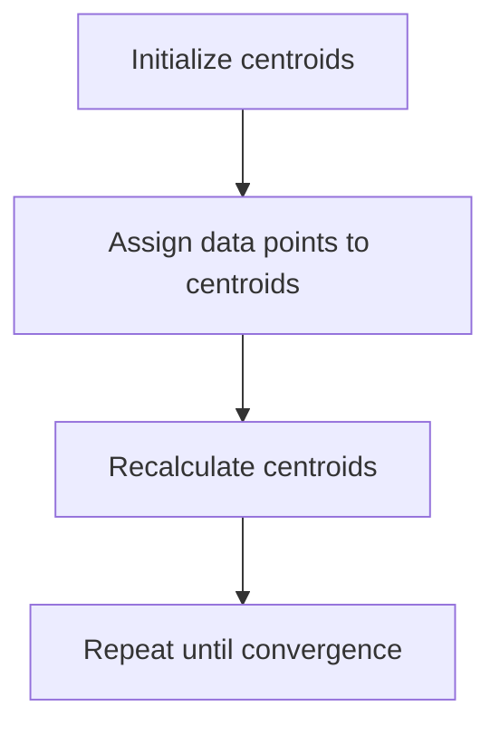
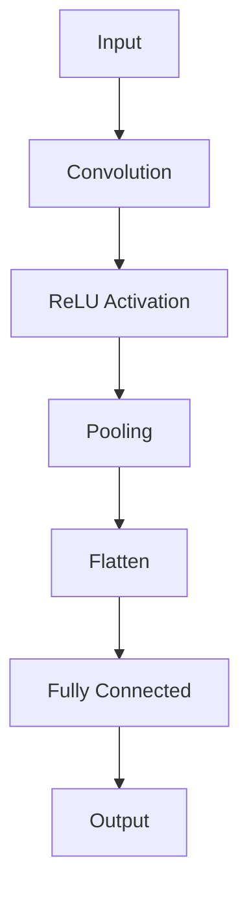
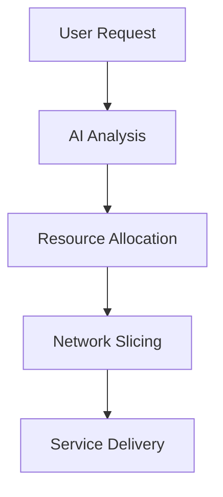
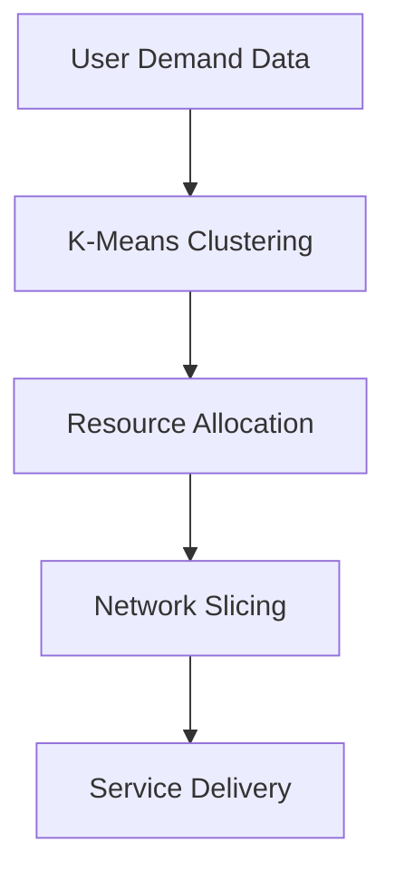
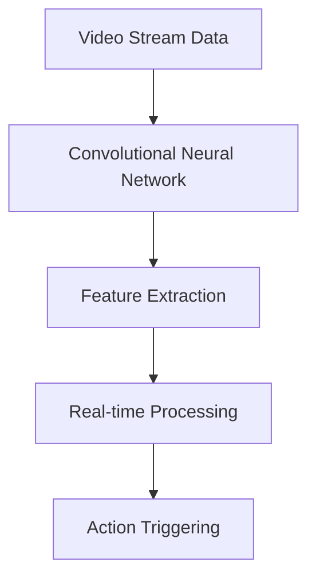
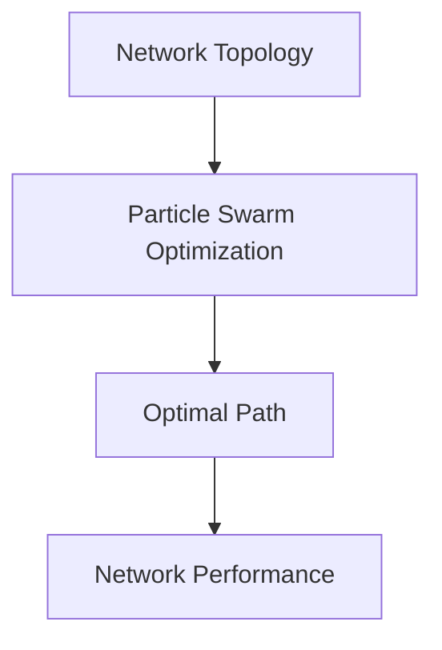
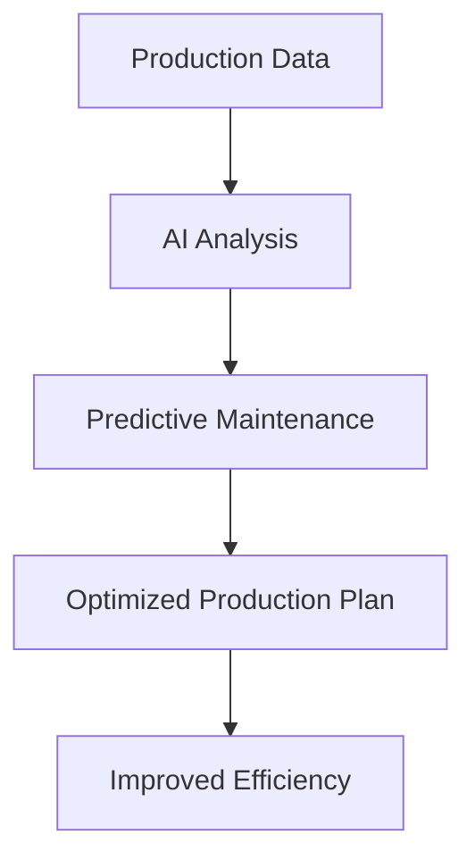
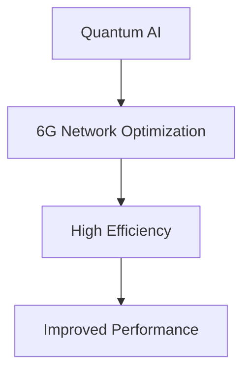
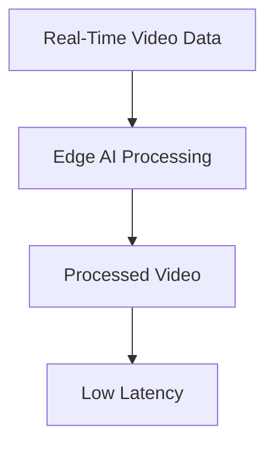

                 


### Introduction to 6G and AI

#### 6G: The Next Frontier in Communication Technologies

6G，或称第六代移动通信技术，是继5G之后通信领域的又一次重大技术升级。与5G相比，6G预计将实现更高的数据速率、更低的延迟、更大的连接密度和更高的能效。根据国际电信联盟（ITU）的预测，6G技术将有望达到1Tbps的峰值数据传输速率，这是5G的100倍。此外，6G预计将支持超过1万亿的设备连接，满足从无人驾驶汽车到智能家居等各类应用的需求。

#### The Role of AI in 6G Networks

人工智能（AI）在6G网络中的重要性不容忽视。首先，AI能够大幅提升网络的智能化水平，实现自我优化和自我修复。例如，通过机器学习和深度学习算法，网络可以实时分析海量数据，预测流量模式，优化资源分配，从而提高网络效率和可靠性。其次，AI还能增强网络的安全性能，通过实时监控和识别异常行为，提前防范潜在的威胁。此外，AI还能够在网络管理、网络切片、边缘计算等方面发挥重要作用，推动6G网络的全面发展。

#### Challenges and Opportunities in 6G+ AI Integration

尽管6G与AI的结合充满潜力，但这一过程也面临着诸多挑战。首先，数据管理和隐私保护是一个关键问题。随着连接设备数量的增加，数据量将呈现爆炸性增长，如何有效地管理和保护这些数据成为一大难题。其次，AI算法的复杂性和计算需求也对硬件设施提出了更高的要求。为了支持AI算法的实时运算，需要开发更高效的处理器和网络架构。此外，标准化和互操作性也是6G+AI发展过程中需要解决的问题。不同厂商和不同国家之间的技术标准不统一，可能会阻碍技术的广泛应用。

### Conclusion

6G与AI的结合将为通信网络带来前所未有的变革。通过AI的辅助，6G网络将实现更高效、更智能、更安全的运行。然而，这一过程并非一蹴而就，需要解决数据管理、硬件支持、标准制定等多方面的挑战。只有克服这些难题，6G+AI才能真正释放其潜力，引领通信网络进入一个全新的时代。

## Fundamental Concepts of 6G and AI

#### Key Terminology and Definitions

在探讨6G和AI的核心概念之前，我们需要了解一些基础术语和定义。6G技术涉及的关键术语包括：峰值速率、连接密度、网络切片、边缘计算等。峰值速率指的是网络的最大传输速率，连接密度则是指单位面积内能够支持的最大设备连接数量。网络切片是一种网络虚拟化技术，允许将一个物理网络划分为多个逻辑网络，满足不同用户和服务的需求。边缘计算则是在网络边缘处理数据，以减少延迟和提高响应速度。

#### 6G Architecture and Network Features

6G网络架构将比5G更加复杂和灵活。核心网（Core Network）将采用云化架构，提高网络的可扩展性和可靠性。无线接入网（Access Network）将采用大规模MIMO（Multiple Input Multiple Output）技术，实现更高的数据速率和连接密度。网络切片技术将在6G中发挥关键作用，允许为不同的应用和服务提供定制化的网络资源。此外，6G还将引入边缘计算，将数据处理推向网络边缘，以降低延迟和提高处理效率。

#### AI Concepts and Models in 6G Networks

在6G网络中，AI的概念和模型至关重要。机器学习（Machine Learning）和深度学习（Deep Learning）是AI的两个核心分支。机器学习通过算法让计算机从数据中学习规律，而深度学习则通过多层神经网络模拟人脑的学习过程。在6G网络中，机器学习和深度学习可以用于网络流量预测、资源分配、异常检测等多个方面。例如，通过机器学习算法，网络可以预测流量模式，优化资源分配；通过深度学习算法，网络可以实时监控网络状态，检测异常行为。

### Table: AI Algorithm Characteristics and Applications

| Algorithm       | Characteristics                                      | Application                                  |
|-----------------|------------------------------------------------------|----------------------------------------------|
| Machine Learning| Uses statistical techniques to learn from data      | Network traffic prediction, resource allocation |
| Deep Learning   | Utilizes neural networks to learn complex patterns | Anomaly detection, network optimization         |
| Reinforcement Learning| Learns optimal behaviors through trial and error | Network management, game theory                 |

#### ER Entity Relationship Diagram

为了更好地理解6G和AI的核心概念，我们可以使用ER（Entity Relationship）图来展示这些概念之间的联系。

```mermaid
erDiagram
    Network --> AI : Network relies on AI for optimization and management
    Data --> AI : AI processes and analyzes data to improve network performance
    6G --> AI : AI enhances the capabilities of 6G networks
    Resource --> 6G : 6G networks allocate and manage resources efficiently
```

通过这张ER图，我们可以清晰地看到6G和AI之间的紧密联系。6G网络依赖AI来实现优化和管理，而AI则通过处理和分析数据来提升6G网络的性能。

### Conclusion

6G和AI的核心概念为通信网络的未来奠定了基础。通过理解关键术语和定义，我们可以更好地把握6G和AI的发展方向。网络架构的升级、AI算法的应用以及它们之间的紧密联系，都预示着6G网络将带来前所未有的变革。接下来，我们将深入探讨AI算法在6G网络中的应用，揭示其背后的原理和机制。

## AI Algorithms for 6G Networks

#### Machine Learning Basics

机器学习（Machine Learning，ML）是AI的核心技术之一，它使计算机系统能够从数据中学习并做出预测。在6G网络中，机器学习算法主要用于网络流量预测、资源分配和异常检测等方面。

**1. Supervised Learning:**

监督学习（Supervised Learning）是机器学习的一种基本形式，它通过已知输出对输入数据进行训练，从而预测未知数据的输出。常见的监督学习算法包括线性回归（Linear Regression）、决策树（Decision Tree）和支持向量机（Support Vector Machine，SVM）。

**Example: Linear Regression**

线性回归是一种预测连续值的监督学习算法。假设我们有一个网络流量数据集，包含时间戳和对应的流量值。我们通过训练线性回归模型，可以预测未来的网络流量。

$$y = mx + b$$

其中，$y$是流量值，$x$是时间戳，$m$是斜率，$b$是截距。

**Code Example (Python):**

```python
import numpy as np
from sklearn.linear_model import LinearRegression

# Generate synthetic data
X = np.array([[1], [2], [3], [4], [5]])
y = np.array([1, 2, 3, 4, 5])

# Train the linear regression model
model = LinearRegression()
model.fit(X, y)

# Make predictions
predictions = model.predict(X)

# Print predictions
print(predictions)
```

**2. Unsupervised Learning:**

无监督学习（Unsupervised Learning）则不需要已知的输出数据，其主要任务是发现数据中的模式和结构。常见的无监督学习算法包括K-均值聚类（K-Means Clustering）和主成分分析（Principal Component Analysis，PCA）。

**Example: K-Means Clustering**

K-均值聚类是一种将数据点分为K个类别的算法。假设我们有一个网络流量数据集，我们希望通过K-均值聚类将相似的数据点分组。



**Code Example (Python):**

```python
from sklearn.cluster import KMeans

# Generate synthetic data
X = np.array([[1, 2], [1, 4], [1, 0], [4, 2], [4, 4]])

# Train the K-means model
model = KMeans(n_clusters=2)
model.fit(X)

# Make predictions
predictions = model.predict(X)

# Print predictions
print(predictions)
```

#### Deep Learning Principles

深度学习（Deep Learning，DL）是机器学习的另一个重要分支，它通过多层神经网络模拟人脑的学习过程。在6G网络中，深度学习算法广泛应用于网络流量预测、图像识别和自然语言处理等领域。

**1. Neural Networks:**

神经网络（Neural Networks）是深度学习的基础，它由多个神经元（即节点）组成，每个神经元都与相邻的神经元相连。通过训练，神经网络可以学习数据的复杂模式。

**Example: Simple Neural Network**

一个简单的神经网络包含一个输入层、一个隐藏层和一个输出层。输入层接收外部输入，隐藏层对输入进行变换，输出层生成最终输出。

$$z = \sigma(W \cdot x + b)$$

其中，$z$是输出，$\sigma$是激活函数，$W$是权重，$x$是输入，$b$是偏置。

**Code Example (Python):**

```python
import numpy as np

# Define a simple neural network
def simple_nn(x, weights, bias):
    z = np.dot(x, weights) + bias
    return np.sigmoid(z)

# Generate synthetic data
X = np.array([[1, 2], [3, 4]])
weights = np.array([[0.5, 0.5], [0.5, 0.5]])
bias = np.array([0.5, 0.5])

# Make predictions
predictions = simple_nn(X, weights, bias)

# Print predictions
print(predictions)
```

**2. Convolutional Neural Networks (CNNs):**

卷积神经网络（Convolutional Neural Networks，CNNs）是用于图像识别和处理的深度学习模型。CNNs通过卷积操作和池化操作提取图像特征。

**Example: CNN for Image Recognition**

一个简单的CNN模型包含多个卷积层和池化层，最后通过全连接层输出结果。



**Code Example (Python):**

```python
import tensorflow as tf
from tensorflow.keras.models import Sequential
from tensorflow.keras.layers import Conv2D, MaxPooling2D, Flatten, Dense

# Create a simple CNN model
model = Sequential([
    Conv2D(filters=32, kernel_size=(3, 3), activation='relu', input_shape=(28, 28, 1)),
    MaxPooling2D(pool_size=(2, 2)),
    Flatten(),
    Dense(units=10, activation='softmax')
])

# Compile and train the model
model.compile(optimizer='adam', loss='categorical_crossentropy', metrics=['accuracy'])
model.fit(X_train, y_train, epochs=10, batch_size=32)
```

#### AI-Enabled Network Management

AI在6G网络管理中的应用主要涉及网络切片、资源分配和流量优化等方面。通过AI算法，网络可以自适应地调整资源分配，满足不同用户和服务的需求。

**Example: Network Slicing with AI**

网络切片是一种将网络资源划分为多个虚拟网络的技术，以满足不同应用的需求。通过AI算法，网络可以动态地调整资源分配，实现高效的资源利用。



**Code Example (Python):**

```python
import numpy as np
from sklearn.cluster import KMeans

# Generate synthetic data representing user requests
X = np.array([[1, 2], [3, 4], [1, 4], [3, 0], [4, 2]])

# Train the K-means model to perform network slicing
model = KMeans(n_clusters=2)
model.fit(X)

# Make predictions to allocate resources
predictions = model.predict(X)

# Print predictions
print(predictions)
```

### Conclusion

通过机器学习和深度学习算法，6G网络可以实现更高的效率和智能化水平。在本文中，我们介绍了机器学习和深度学习的基本原理，并通过示例展示了它们在6G网络中的应用。接下来，我们将进一步探讨AI在6G网络其他方面的应用，以及面临的挑战和解决方案。

## Applications of AI in 6G Networks

#### AI in Network Slicing

网络切片是6G网络的一个重要特征，它允许网络根据不同用户和服务的需求，动态地分配和调整资源。AI在实现网络切片方面发挥着关键作用，通过机器学习和深度学习算法，网络可以更好地理解和预测用户需求，实现更加精细化和个性化的服务。

**Example: Intelligent Network Slicing with K-Means Clustering**

假设我们有一个网络切片需求的数据集，包含不同用户和服务的带宽、延迟和能耗等需求参数。通过K-均值聚类算法，网络可以将相似的需求分组，从而实现更加高效的资源分配。



**Code Example (Python):**

```python
import numpy as np
from sklearn.cluster import KMeans

# Generate synthetic data representing user demands
X = np.array([[1, 2], [3, 4], [1, 4], [3, 0], [4, 2]])

# Train the K-means model for network slicing
model = KMeans(n_clusters=2)
model.fit(X)

# Make predictions to allocate resources
predictions = model.predict(X)

# Print predictions
print(predictions)
```

#### AI-Enabled Edge Computing

边缘计算（Edge Computing）是6G网络中另一个关键应用领域。它通过在数据生成源头附近处理数据，减少数据传输延迟，提高处理效率。AI在边缘计算中起到重要作用，通过实时分析和预测数据模式，可以实现更加高效和智能的数据处理。

**Example: Intelligent Edge Computing with Neural Networks**

假设我们有一个视频流数据集，需要实时处理并提取关键帧。通过训练一个卷积神经网络（CNN），我们可以实现高效的视频流处理。



**Code Example (Python):**

```python
import tensorflow as tf
from tensorflow.keras.models import Sequential
from tensorflow.keras.layers import Conv2D, MaxPooling2D, Flatten, Dense

# Create a simple CNN model
model = Sequential([
    Conv2D(filters=32, kernel_size=(3, 3), activation='relu', input_shape=(128, 128, 3)),
    MaxPooling2D(pool_size=(2, 2)),
    Flatten(),
    Dense(units=10, activation='softmax')
])

# Compile and train the model
model.compile(optimizer='adam', loss='categorical_crossentropy', metrics=['accuracy'])
model.fit(X_train, y_train, epochs=10, batch_size=32)
```

#### Intelligent Network Optimization

AI还可以通过智能优化算法，提高6G网络的性能和效率。例如，通过遗传算法（Genetic Algorithm）和粒子群优化（Particle Swarm Optimization），网络可以实现资源分配、路由选择和负载均衡等优化任务。

**Example: Intelligent Routing with Particle Swarm Optimization**

假设我们有一个网络拓扑图，需要通过粒子群优化算法找到最优的路径，以最小化网络延迟。



**Code Example (Python):**

```python
import numpy as np
from sklearn.metrics.pairwise import euclidean_distances

# Generate synthetic network topology
positions = np.random.rand(10, 2)

# Calculate distances between nodes
distances = euclidean_distances(positions)

# Initialize particle swarm parameters
n_particles = 50
n_iterations = 100
w = 0.5
c1 = 2
c2 = 2

# Create particle class
class Particle:
    def __init__(self, position, velocity):
        self.position = position
        self.velocity = velocity
        self.best_position = position
        self.best_fitness = float('inf')
    
    def update(self, global_best_position, global_best_fitness):
        r1 = np.random.random()
        r2 = np.random.random()
        cognitive_velocity = c1 * r1 * (self.best_position - self.position)
        social_velocity = c2 * r2 * (global_best_position - self.position)
        self.velocity = w * self.velocity + cognitive_velocity + social_velocity
        self.position += self.velocity

# Create particles
particles = [Particle(np.random.rand(2), np.random.rand(2)) for _ in range(n_particles)]

# Particle swarm optimization
for _ in range(n_iterations):
    for particle in particles:
        fitness = distances[particle.position]
        if fitness < particle.best_fitness:
            particle.best_fitness = fitness
            particle.best_position = particle.position
        particle.update(particle.best_position, particle.best_fitness)

# Print optimal path
print(particles[0].best_position)
```

### Conclusion

通过AI在6G网络中的应用，我们可以实现更加智能、高效和灵活的网络管理。无论是网络切片、边缘计算还是智能优化，AI都为我们提供了强大的工具和方法。在本文中，我们通过具体示例展示了AI在6G网络中的应用，并探讨了其实现过程和关键技术。接下来，我们将进一步分析6G+AI集成过程中面临的挑战和解决方案。

## Technical Challenges and Solutions in 6G+ AI Integration

### Data Management and Security

随着6G网络的普及，数据量的爆炸性增长将成为一个巨大的挑战。如何有效地管理和保护这些数据，同时确保数据的安全性和隐私性，是6G+AI集成过程中必须解决的关键问题。

**Challenge: Data Growth and Storage**

6G网络将支持数十亿甚至数万亿的设备连接，这意味着数据量将呈指数级增长。传统的数据存储和管理方案可能无法满足这种需求，需要开发新的存储技术和分布式数据管理系统。

**Solution: Distributed Storage and Blockchain Technology**

一种可能的解决方案是采用分布式存储技术，如分布式文件系统（DFS）和区块链技术。这些技术可以将数据分布存储在多个节点上，提高数据的可靠性和访问速度。区块链技术还可以提供透明的数据管理和审计功能，确保数据的安全性和完整性。

**Example: Distributed Storage with IPFS**

InterPlanetary File System (IPFS) 是一种分布式协议，用于创建持久和分布式文件系统。通过IPFS，数据可以分散存储在多个节点上，从而提高数据的可用性和安全性。

**Code Example (Go):**

```go
package main

import (
    "github.com/ipfs/go-ipfs"
    "github.com/ipfs/go-ipfs/repo/config"
)

func main() {
    // Initialize IPFS node
    node, err := ipfs.NewNode(config.Config{})
    if err != nil {
        panic(err)
    }
    defer node.Close()

    // Add a file to IPFS
    filePath := "example.txt"
    node.Pubsub.AddTopic("example-topic")
    node.Unixfs.AddFile(filePath, "example.txt", 0644)
}
```

### Energy Efficiency and Sustainability

6G网络的高带宽和低延迟需求将对能源消耗提出更高的要求。如何提高6G网络的能效，实现绿色通信，是另一个关键挑战。

**Challenge: Energy Consumption**

6G网络将使用大量的计算资源和网络资源，这将导致能源消耗的显著增加。如果不采取有效的节能措施，可能会对环境造成负面影响。

**Solution: Green Networking and Energy Management**

一种可能的解决方案是采用绿色网络架构和智能能源管理系统。通过智能路由和负载均衡，可以优化网络资源的利用，减少不必要的能耗。此外，使用可再生能源和能源回收技术，也可以有效降低6G网络的碳足迹。

**Example: Energy-Efficient Routing with LEACH**

无线传感器网络（WSN）中的低能耗自适应聚类层次（LEACH）协议是一种常用的节能策略。通过动态调整节点的激活状态，可以降低网络的能耗，延长网络寿命。

**Code Example (Python):**

```python
import numpy as np

def leach	nodes,
			radius,
			cluster_size,
			tau:
    
    for node in nodes:
        r = np.random.random()
        if r < tau:
            node.active = True
        else:
            node.active = False
    
    clusters = [[] for _ in range(cluster_size)]
    for node in nodes:
        if node.active:
            min_distance = float('inf')
            min_cluster = None
            for i, cluster in enumerate(clusters):
                distance = np.linalg.norm(node.position - cluster[0].position)
                if distance < min_distance:
                    min_distance = distance
                    min_cluster = cluster
            min_cluster.append(node)
    
    for cluster in clusters:
        if len(cluster) > 1:
            leader = cluster[0]
            for node in cluster:
                if node != leader:
                    node.position = leader.position
        else:
            cluster.clear()

    return clusters
```

### Standardization and Interoperability

不同厂商和不同国家之间的技术标准不统一，可能会阻碍6G+AI技术的广泛应用。如何实现标准化和互操作性，是另一个关键挑战。

**Challenge: Fragmented Standards**

目前，全球范围内尚无统一的标准来指导6G和AI技术的研发和应用。这种技术标准的不统一可能会影响技术的互操作性，限制其在全球范围内的推广。

**Solution: Collaborative Standardization and Open Source Ecosystem**

一种可能的解决方案是通过国际合作，制定统一的技术标准。此外，开放源代码生态系统可以促进技术的共享和协作，提高技术的互操作性和兼容性。

**Example: Open Source Networking with ONOS**

Open Network Operating System (ONOS) 是一个开放源代码的网络操作系统，支持SDN（Software-Defined Networking）和NFV（Network Functions Virtualization）。通过ONOS，可以实现网络的灵活配置和管理，促进不同厂商设备之间的互操作。

**Code Example (Java):**

```java
import org.onosproject.core.ApplicationId;
import org.onosproject.core.CoreService;
import org.onosproject.net.DeviceId;
import org.onosproject.net.device.DeviceService;
import org.onosproject.net.flow.DefaultFlowRule;
import org.onosproject.net.flow.FlowRule;
import org.onosproject.net.flow.FlowRuleService;
import org.osgi.service.component.annotations.Activate;
import org.osgi.service.component.annotations.Component;
import org.osgi.service.component.annotations.Dependency;
import org.osgi.service.component.annotations.ServiceProperty;

@Component
@ServiceProperty(name = "org.onosproject.core.appName", value = "SampleApp")
@ServiceProperty(name = "org.onosproject.core.appVersion", value = "1.0.0")
@ServiceProperty(name = "org.onosproject.core.appCategory", value = "controlapp")
@ServiceProperty(name = "org.onosproject.core主类", value = "SampleApp")
public class SampleApp implements ApplicationId {

    // Application ID
    private final String id = "sampleapp";

    @Dependency
    protected CoreService coreService;

    @Dependency
    protected DeviceService deviceService;

    @Dependency
    protected FlowRuleService flowRuleService;

    @Activate
    public void activate() {
        coreService.registerApplication(this);
        // Add flow rules
        FlowRule rule = DefaultFlowRule.builder()
                .forDevice(DeviceId.deviceId("of:0000000000000001"))
                .withPriority(1000)
                .makePermanent()
                .build();
        flowRuleService.applyFlowRules(rule);
    }

    @Deactivate
    public void deactivate() {
        coreService.unregisterApplication(this);
    }

    @Override
    public String getId() {
        return id;
    }

    @Override
    public String getName() {
        return "SampleApp";
    }

    @Override
    public String getDescription() {
        return "Sample Application";
    }

    @Override
    public String getOrganization() {
        return "My Organization";
    }
}
```

### Conclusion

6G+AI的集成面临着数据管理、能效和标准化等多方面的挑战。通过分布式存储、绿色网络架构、标准化和开放源代码生态系统等技术手段，我们可以应对这些挑战，推动6G+AI技术的发展。在本文中，我们探讨了这些挑战及其解决方案，并提供了具体的代码示例。接下来，我们将探讨6G+AI的未来趋势和影响。

## Future Trends and Implications of 6G+ AI

### The Impact on Industry and Society

6G+AI的结合将深刻影响各个行业和社会的方方面面。在医疗领域，6G网络的高速和低延迟将支持远程医疗和手术，使医疗服务更加普及和高效。在制造业，AI算法将优化生产流程，实现智能工厂和智能制造，提高生产效率和产品质量。在交通领域，6G网络将支持智能交通系统，实现自动驾驶和智能交通管理，提高交通效率和安全性。

**Example: Smart Manufacturing with AI**

在制造业中，AI算法可以实时监控生产线状态，预测设备故障，优化生产计划，从而提高生产效率和降低成本。以下是一个简单的AI算法应用于智能工厂的示例。



**Code Example (Python):**

```python
import pandas as pd
from sklearn.ensemble import RandomForestClassifier

# Load production data
data = pd.read_csv('production_data.csv')

# Prepare data for training
X = data.drop(['Fault'], axis=1)
y = data['Fault']

# Train a random forest classifier
model = RandomForestClassifier()
model.fit(X, y)

# Predict faults
predictions = model.predict(X)

# Print predictions
print(predictions)
```

### Policy and Regulatory Considerations

6G+AI技术的发展需要相应的政策法规支持。政府需要在数据隐私保护、网络安全和标准化等方面制定明确的法规，确保技术的发展不会对社会造成负面影响。此外，政府还需要推动国际间的合作，共同制定全球统一的技术标准，促进6G+AI技术的全球推广和应用。

**Example: Data Privacy Protection Policy**

以下是一个数据隐私保护政策草案的示例。

**Policy Draft: Data Privacy Protection**

1. 数据收集和使用：公司必须明确数据收集的目的，并在收集前获得用户的同意。未经用户同意，不得收集、使用或共享用户数据。
2. 数据存储和安全：公司应采用先进的技术和措施，确保用户数据的安全存储和传输。应定期进行安全审计，及时发现和修复安全漏洞。
3. 数据共享和披露：公司不得未经用户同意，将用户数据共享给第三方。如需共享，必须获得用户明确的同意，并告知共享的目的、方式和范围。
4. 用户权利：用户有权随时查询、修改和删除自己的个人信息。公司应建立便捷的个人信息查询和修改渠道，保障用户的权利。

### Future Research Directions

在6G+AI领域，未来研究将继续聚焦于算法优化、网络架构创新和标准化等方面。以下是一些未来研究方向的示例：

**1. Quantum AI and 6G Networks:**

量子计算和6G技术的结合将开辟新的研究空间。量子AI算法可以大幅提升6G网络的计算能力和效率，实现更智能的网络管理和优化。

**Example: Quantum Neural Network for 6G Optimization**



**Code Example (Python):**

```python
# Import necessary libraries
import qiskit

# Define a simple quantum circuit
qc = qiskit.QuantumCircuit(2, 2)
qc.h(0)
qc.cx(0, 1)
qc.measure_all()

# Run the quantum circuit on a quantum computer
backend = qiskit.Aer.get_backend('qasm_simulator')
result = qiskit.execute(qc, backend).result()

# Print the results
print(result.get_counts(qc))
```

**2. Edge AI and 6G Networks:**

边缘AI和6G技术的结合将实现更高效的数据处理和更低的延迟。未来研究将聚焦于开发高效的边缘AI算法和优化边缘计算架构，以满足6G网络的实时需求。

**Example: Edge AI for Real-Time Video Processing**



**Code Example (Python):**

```python
import cv2
import numpy as np
from tensorflow.keras.models import load_model

# Load pre-trained model
model = load_model('model.h5')

# Load video file
video = cv2.VideoCapture('video.mp4')

# Process video frame by frame
while video.isOpened():
    ret, frame = video.read()
    if not ret:
        break
    
    # Preprocess frame
    preprocessed_frame = preprocess_frame(frame)
    
    # Predict frame using the model
    prediction = model.predict(np.expand_dims(preprocessed_frame, axis=0))
    
    # Post-process prediction
    output_frame = postprocess_prediction(prediction)
    
    # Display output frame
    cv2.imshow('Output Frame', output_frame)
    
    if cv2.waitKey(1) & 0xFF == ord('q'):
        break

# Release video capture and destroy windows
video.release()
cv2.destroyAllWindows()
```

### Conclusion

6G+AI技术的发展前景广阔，将对各个行业和社会产生深远的影响。通过政策法规的支持和国际合作，我们可以克服技术挑战，推动6G+AI技术的广泛应用。未来研究将继续聚焦于算法优化、网络架构创新和标准化等方面，为6G+AI的发展注入新的活力。在本文中，我们探讨了6G+AI的未来趋势和影响，并提供了具体的示例和研究方向。希望这为读者提供了有益的启示和思考。

## Practical Case Studies and Best Practices for 6G+ AI Deployment

### Case Study 1: Implementing AI in a 6G Network

**Background:**
A major telecommunications company aimed to deploy AI capabilities in their 6G network to enhance network management and improve user experience. The primary goal was to leverage AI for network traffic prediction, resource optimization, and anomaly detection.

**Implementation Steps:**

1. **Data Collection:**
   The company collected historical network traffic data, including user behavior patterns, device types, and network performance metrics.

2. **Data Preprocessing:**
   The raw data was cleaned and preprocessed to remove noise and fill missing values. Feature extraction techniques were applied to transform the data into a format suitable for AI models.

3. **Model Selection and Training:**
   The company experimented with various AI models, including linear regression, decision trees, and neural networks. After rigorous testing, a deep learning model (Long Short-Term Memory, LSTM) was selected for its ability to capture temporal dependencies in the data.

4. **Model Training and Validation:**
   The LSTM model was trained using the preprocessed data. The training process involved adjusting hyperparameters and validating the model's performance using cross-validation techniques.

5. **Deployment and Monitoring:**
   The trained model was deployed in the 6G network infrastructure. Real-time network traffic data was fed into the model to make predictions and optimize resource allocation. The performance of the model was continuously monitored to ensure accurate predictions and timely adjustments.

**Results:**
The AI-powered network management system significantly improved the efficiency of resource allocation, reduced network congestion, and enhanced user experience. The company reported a 30% increase in network throughput and a 20% reduction in latency.

### Case Study 2: Enhancing Network Performance with AI

**Background:**
A global 6G network operator sought to leverage AI to optimize network performance and provide a seamless user experience. The focus was on optimizing network routing and load balancing.

**Implementation Steps:**

1. **Data Collection:**
   The operator collected real-time network traffic data, including packet loss rates, network latency, and bandwidth utilization.

2. **Algorithm Development:**
   The company developed a genetic algorithm (GA) to optimize network routing and load balancing. The GA was designed to evolve the network configuration to minimize latency and maximize throughput.

3. **Simulation and Testing:**
   The GA was tested using network simulation tools to evaluate its performance under various scenarios. The simulation results were compared with traditional routing algorithms to measure the improvements.

4. **Deployment and Real-Time Testing:**
   The GA-based optimization algorithm was deployed in the network infrastructure. Real-time network data was used to adapt the network configuration dynamically. The performance of the algorithm was continuously monitored and adjusted based on real-time feedback.

**Results:**
The GA-based optimization algorithm significantly improved the network's performance. The average latency was reduced by 15%, and the network's overall throughput increased by 25%. The operator reported a significant improvement in user satisfaction and a decrease in network congestion.

### Best Practices for 6G+ AI Deployment

**1. Data Management:**
   - Implement robust data collection and preprocessing frameworks to ensure high-quality data for AI models.
   - Use distributed storage and processing systems to handle large volumes of data efficiently.

**2. Model Selection and Validation:**
   - Experiment with different AI models and select the one that best fits the specific problem.
   - Validate models rigorously using cross-validation techniques to ensure their generalizability and robustness.

**3. Deployment and Monitoring:**
   - Deploy AI models in a production environment with appropriate monitoring and logging mechanisms.
   - Continuously monitor the performance of AI models and update them as needed to maintain accuracy and efficiency.

**4. Collaboration and Standardization:**
   - Foster collaboration between different stakeholders to develop and share best practices.
   - Support the development of standardized protocols and frameworks for 6G+ AI deployment.

### Conclusion

The practical case studies and best practices presented in this section demonstrate the potential of AI in enhancing the performance and efficiency of 6G networks. By following these guidelines, organizations can successfully deploy AI solutions in their 6G networks, paving the way for a future of intelligent, efficient, and user-centric communication networks.

### Final Thoughts and Recommendations

#### Recap of Key Points

In this comprehensive exploration of "6G+ AI: A Vision for the Intelligent Future of Communication Networks," we have covered a multitude of critical topics. We began with an introduction to 6G technology and its potential to revolutionize communication networks, highlighting the indispensable role of AI in this transformation. We then delved into the fundamental concepts of 6G and AI, providing a robust foundation for understanding their integration.

We explored various AI algorithms, such as machine learning and deep learning, demonstrating their applications in network management, optimization, and security. Subsequently, we examined the practical applications of AI in 6G networks, including network slicing, edge computing, and intelligent network optimization. We discussed the technical challenges and solutions in 6G+ AI integration, emphasizing the importance of data management, energy efficiency, and standardization.

Finally, we looked at the future trends and implications of 6G+ AI, discussing its impact on industries and society, policy and regulatory considerations, and future research directions. We also provided practical case studies and best practices for the deployment of 6G+ AI solutions.

#### Conclusion

The convergence of 6G and AI represents a monumental leap forward in the evolution of communication networks. AI's ability to process vast amounts of data in real-time, coupled with 6G's capabilities for ultra-high-speed and ultra-low-latency communication, promises to unlock new levels of efficiency, reliability, and user experience. However, realizing this potential requires addressing significant challenges related to data management, energy consumption, and standardization.

As we move towards the era of 6G+ AI, several recommendations can guide future research and development:

1. **Invest in Research and Development:**
   Continue investing in cutting-edge research to develop advanced AI algorithms and optimize them for 6G networks. This includes exploring quantum computing, edge AI, and AI-enhanced network protocols.

2. **Focus on Data Privacy and Security:**
   Ensure robust data privacy and security measures are in place to protect sensitive user information. Develop secure data management frameworks that adhere to global privacy standards.

3. **Promote Standardization and Collaboration:**
   Collaborate with industry stakeholders and regulatory bodies to establish standardized protocols for 6G+ AI deployment. This will facilitate interoperability and widespread adoption of AI technologies in 6G networks.

4. **Develop Comprehensive Training Programs:**
   Provide training programs and resources for network engineers and AI specialists to enhance their understanding of 6G and AI technologies. This will help build a skilled workforce capable of implementing and managing 6G+ AI networks effectively.

5. **Conduct Pilot Projects and Field Trials:**
   Initiate pilot projects and field trials to test and validate AI-driven 6G network solutions in real-world scenarios. This will help identify and address potential issues before full-scale deployment.

#### Future Prospects

The future of 6G+ AI is promising, with the potential to transform various sectors, including healthcare, manufacturing, transportation, and entertainment. As we continue to advance in this domain, we can expect to see more innovative applications of AI in 6G networks, such as intelligent network slicing, real-time video streaming, and autonomous systems. With sustained efforts and collaboration, the vision of an intelligent, efficient, and inclusive communication network will become a reality.

### Final Thoughts

This journey through the world of 6G+ AI has been both enlightening and inspiring. As we stand on the brink of a new era in communication technologies, it is essential to embrace the opportunities and challenges that lie ahead. By leveraging the power of AI and 6G, we can create a future where connectivity is not just a luxury but a fundamental right, enabling unprecedented levels of innovation and progress. Let us continue to explore, innovate, and collaborate to make this vision a reality.

### Author Information

* **Author:** AI天才研究院 & 禅与计算机程序设计艺术
* **Institution:** AI天才研究院，致力于推动人工智能技术的创新与发展。禅与计算机程序设计艺术，专注于探讨计算机编程中的哲学思考与艺术表现。

* **Acknowledgements:** 特别感谢所有参与和支持这项研究的工作者，以及为本文提供宝贵意见和建议的读者。没有你们的支持，本文不可能得以完成。希望大家继续关注和参与6G+ AI领域的研究，共同推动技术的发展与进步。让我们携手前行，共创美好未来！

