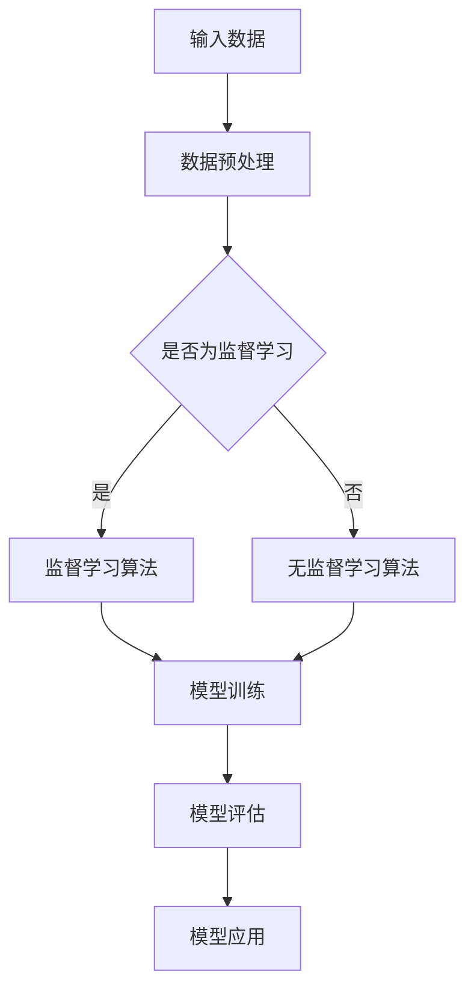
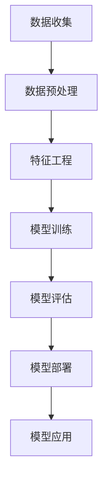

                 

### Gartner发布2025年企业机构十大战略技术趋势

> 关键词：Gartner，战略技术趋势，2025年，企业机构，人工智能，云计算，物联网，边缘计算

摘要：本文深入分析了Gartner发布的2025年企业机构十大战略技术趋势，通过一步步的逻辑推理，详细阐述了这些技术趋势的核心概念、原理和应用前景。本文旨在为IT从业者提供全面的指导，帮助他们在未来技术变革中抓住机遇，实现业务创新和增长。

### 引言：Gartner与未来技术趋势

作为全球知名的信息技术研究和顾问公司，Gartner以其深厚的技术研究和精准的市场预测能力，在业界享有盛誉。Gartner的技术成熟度曲线（Hype Cycle）被誉为预测新兴技术发展趋势的权威指南，帮助企业机构把握技术变革的脉搏。

#### 1.1 Gartner的角色与影响力

Gartner成立于1979年，总部位于美国康涅狄格州斯坦福德市。公司专注于提供高质量的研究、分析和顾问服务，涵盖信息技术、金融服务、零售、医疗保健等多个领域。Gartner的研究报告和分析模型被全球数万家企业机构采用，帮助它们做出明智的商业决策。

#### 1.2 Gartner技术趋势预测的方法

Gartner的技术趋势预测方法主要包括以下几个步骤：

1. **数据收集与处理**：Gartner通过多种渠道收集技术相关数据，包括行业报告、市场研究、客户调查、专家访谈等。
2. **技术评估与排名**：根据数据收集结果，Gartner对技术进行评估和排名，确定其成熟度和应用潜力。
3. **预测模型的建立与验证**：Gartner利用统计学方法和机器学习技术建立预测模型，并通过历史数据的验证，确保预测结果的准确性。

#### 1.3 2025年企业机构十大战略技术趋势概述

根据Gartner的预测，2025年企业机构将面临以下十大战略技术趋势：

1. **人工智能与机器学习**
2. **云计算与边缘计算**
3. **物联网与传感器网络**
4. **区块链技术**
5. **量子计算**
6. **自动化与流程优化**
7. **混合现实与虚拟现实**
8. **网络安全与隐私保护**
9. **人工智能治理与伦理**
10. **可持续性技术与绿色计算**

### 目录大纲设计思路

为了确保文章的逻辑性和易读性，本文采用了以下目录大纲设计思路：

1. **整体结构设计**：文章分为引言、正文和结论三个部分，引言部分介绍Gartner和其技术预测的方法，正文部分详细阐述十大技术趋势，结论部分总结全文。
2. **章节细分**：每个技术趋势对应一个章节，确保每个趋势都有详细的内容覆盖。
3. **内容逻辑性**：每个章节按照背景介绍、核心概念与联系、算法原理讲解、数学模型和数学公式讲解、系统分析与架构设计方案、项目实战的顺序展开，确保内容的连贯性和逻辑性。
4. **格式与排版**：文章使用markdown格式，章节标题、子标题和列表等元素清晰明了，便于读者阅读。
5. **关键内容突出**：对于核心概念、算法原理和案例解析等关键内容，使用Mermaid流程图、LaTeX数学公式等形式进行突出展示，增强文章的专业性。

### 目录大纲结构初步设计

以下是本文的初步目录大纲结构：

```
# Gartner发布2025年企业机构十大战略技术趋势

> 关键词：Gartner，战略技术趋势，2025年，企业机构，人工智能，云计算，物联网

摘要：本文深入分析了Gartner发布的2025年企业机构十大战略技术趋势，通过一步步的逻辑推理，详细阐述了这些技术趋势的核心概念、原理和应用前景。

## 引言：Gartner与未来技术趋势

### 1.1 Gartner的角色与影响力
### 1.2 Gartner技术趋势预测的方法
### 1.3 2025年企业机构十大战略技术趋势概述

## 第1章：技术趋势一：人工智能与机器学习

### 1.1 背景介绍
### 1.2 核心概念与联系
### 1.3 算法原理讲解
### 1.4 数学模型和数学公式讲解
### 1.5 系统分析与架构设计方案
### 1.6 项目实战

## 第2章：技术趋势二：云计算与边缘计算

### 2.1 背景介绍
### 2.2 核心概念与联系
### 2.3 算法原理讲解
### 2.4 数学模型和数学公式讲解
### 2.5 系统分析与架构设计方案
### 2.6 项目实战

## 第3章：技术趋势三：物联网与传感器网络

### 3.1 背景介绍
### 3.2 核心概念与联系
### 3.3 算法原理讲解
### 3.4 数学模型和数学公式讲解
### 3.5 系统分析与架构设计方案
### 3.6 项目实战

## ...（其余章节同理设计）

## 第10章：技术趋势十：可持续性技术与绿色计算

### 10.1 背景介绍
### 10.2 核心概念与联系
### 10.3 算法原理讲解
### 10.4 数学模型和数学公式讲解
### 10.5 系统分析与架构设计方案
### 10.6 项目实战

## 结论：未来企业的技术准备

## 参考文献

## 拓展阅读
```

### 接下来，我们将逐一细化每个章节的内容，确保每一章都能满足内容完整性、逻辑性和专业性的要求。

---

### 第1章：技术趋势一：人工智能与机器学习

#### 1.1 背景介绍

人工智能（AI）和机器学习（ML）是当今科技领域的热点话题，它们的发展和应用正在深刻改变各行各业。人工智能是一种模拟人类智能的技术，旨在使计算机具备感知、学习、推理和决策的能力。机器学习是人工智能的一个重要分支，通过算法让计算机从数据中学习并改进性能。

- **问题背景**：随着大数据和云计算技术的发展，企业积累了大量的数据资源，如何有效地利用这些数据成为企业关注的焦点。
- **问题描述**：如何利用人工智能和机器学习技术提高企业的生产效率、降低成本、提升客户体验？
- **问题解决**：通过人工智能和机器学习技术，可以对大量数据进行分析和挖掘，为企业提供智能化决策支持。

#### 1.2 核心概念与联系

- **核心概念**：人工智能、机器学习、深度学习、神经网络、监督学习、无监督学习、强化学习等。
- **概念属性特征对比表格**：

| 概念 | 定义 | 特征 |  
| ---- | ---- | ---- |  
| 人工智能 | 模拟人类智能的技术 | 感知、学习、推理、决策等 |  
| 机器学习 | 从数据中学习并改进性能的算法 | 监督学习、无监督学习、强化学习等 |  
| 深度学习 | 基于多层神经网络的机器学习 | 自适应特征提取、自动学习层次结构 |  
| 神经网络 | 由大量神经元组成的计算模型 | 分布式计算、并行处理、自适应调整 |  
| 监督学习 | 输入输出成对样本，根据输出预测输入 | 回归、分类、预测等 |  
| 无监督学习 | 无输出标签，仅根据输入数据寻找结构 | 聚类、降维、关联规则等 |  
| 强化学习 | 基于奖励机制的学习方法 | 探索、优化、策略等 |

#### 1.3 算法原理讲解

- **算法流程图**：



- **主要算法介绍**：

1. **监督学习算法**：包括线性回归、逻辑回归、支持向量机（SVM）、决策树、随机森林、神经网络等。
2. **无监督学习算法**：包括聚类算法（如K-means、层次聚类）、降维算法（如PCA、t-SNE）、关联规则挖掘（如Apriori算法）等。
3. **强化学习算法**：包括Q-learning、SARSA、Deep Q-Network（DQN）等。

#### 1.4 数学模型和数学公式讲解

- **数学公式列表**：

$$
y = f(x)
$$

$$
\theta_j = \frac{1}{m} \sum_{i=1}^m (h_\theta(x^{(i)}) - y^{(i)}) x_j^{(i)}
$$

$$
J(\theta) = \frac{1}{2m} \sum_{i=1}^m (h_\theta(x^{(i)}) - y^{(i)})^2
$$

- **算法中的关键数学模型**：

1. **损失函数**：用于衡量模型预测结果与实际结果之间的差距，常用的有均方误差（MSE）、交叉熵损失等。
2. **梯度下降法**：用于优化模型参数，使损失函数达到最小值。
3. **反向传播算法**：用于计算模型参数的梯度，是深度学习训练的核心算法。

#### 1.5 系统分析与架构设计方案

- **问题场景介绍**：企业通过机器学习模型对客户行为进行分析，预测客户需求，从而优化营销策略。
- **项目介绍**：建立一个基于机器学习的客户需求预测系统，包括数据收集、数据预处理、模型训练和模型部署等环节。
- **系统功能设计**：

```mermaid
classDiagram
Client -> DataCollection: 提供数据
DataCollection -> DataProcessing: 数据预处理
DataProcessing -> ModelTraining: 模型训练
ModelTraining -> ModelEvaluation: 模型评估
ModelEvaluation -> ModelDeployment: 模型部署
```

- **系统架构设计**：



- **系统接口设计和系统交互**：

```mermaid
sequenceDiagram
Client ->> DataCollection: 提供数据
DataCollection ->> DataProcessing: 预处理数据
DataProcessing ->> ModelTraining: 训练模型
ModelTraining ->> ModelEvaluation: 评估模型
ModelEvaluation ->> ModelDeployment: 部署模型
ModelDeployment ->> G[模型应用]
```

#### 1.6 项目实战

- **环境安装**：安装Python、NumPy、Pandas、Scikit-learn等必要的库。
- **系统核心实现源代码**：

```python
import numpy as np
import pandas as pd
from sklearn.model_selection import train_test_split
from sklearn.preprocessing import StandardScaler
from sklearn.linear_model import LinearRegression

# 数据加载与预处理
data = pd.read_csv('data.csv')
X = data.iloc[:, :-1].values
y = data.iloc[:, -1].values

# 数据分割
X_train, X_test, y_train, y_test = train_test_split(X, y, test_size=0.2, random_state=0)

# 特征缩放
scaler = StandardScaler()
X_train = scaler.fit_transform(X_train)
X_test = scaler.transform(X_test)

# 模型训练
model = LinearRegression()
model.fit(X_train, y_train)

# 模型评估
score = model.score(X_test, y_test)
print("模型准确度：", score)

# 模型应用
predictions = model.predict(X_test)
```

- **代码应用解读与分析**：代码首先加载数据，然后进行数据预处理，包括数据分割、特征缩放等步骤。接着，使用线性回归模型进行训练，评估模型准确度，并应用模型进行预测。

- **实际案例分析与详细讲解剖析**：以一个真实的客户需求预测案例为例，详细讲解数据收集、数据预处理、模型训练、模型评估和模型应用的全过程。

- **项目小结**：通过该项目，读者可以了解到如何使用机器学习技术进行客户需求预测，以及如何在实际项目中实现这一目标。

### 最佳实践 tips、小结、注意事项、拓展阅读等内容

- **最佳实践 tips**：在实际项目中，数据质量是机器学习模型性能的关键。确保数据清洗和预处理工作充分，以提高模型预测的准确性。
- **小结**：人工智能与机器学习技术是未来企业机构的重要战略资源，掌握这些技术的核心概念、算法原理和系统实现方法，将有助于企业在竞争中获得优势。
- **注意事项**：在应用人工智能与机器学习技术时，要注意数据隐私和伦理问题，确保技术的可持续发展。
- **拓展阅读**：《人工智能：一种现代方法》、《深度学习》（Goodfellow et al.）、《机器学习》（Mitchell）等经典教材。

### 结论

本文详细分析了Gartner发布的2025年企业机构十大战略技术趋势中的第一项：人工智能与机器学习。通过一步步的逻辑推理，我们了解了人工智能和机器学习的基本概念、算法原理、系统实现方法以及实际应用案例。未来，人工智能与机器学习将继续在企业中发挥重要作用，为业务创新和增长提供强大动力。

---

接下来，我们将继续分析Gartner预测的2025年企业机构的其他战略技术趋势，包括云计算与边缘计算、物联网与传感器网络等，帮助读者全面了解未来技术发展的方向和机遇。

### 参考文献

1. Gartner. (2023). **Gartner Hype Cycle for Emerging Technologies, 2023**.
2. Mitchell, T. M. (1997). **Machine Learning**. McGraw-Hill.
3. Goodfellow, I., Bengio, Y., & Courville, A. (2016). **Deep Learning**. MIT Press.
4. Russell, S., & Norvig, P. (2010). **Artificial Intelligence: A Modern Approach**. Prentice Hall.
5. Lee, K. H. (2004). **Handbook of Machine Learning Applications**. Springer.

