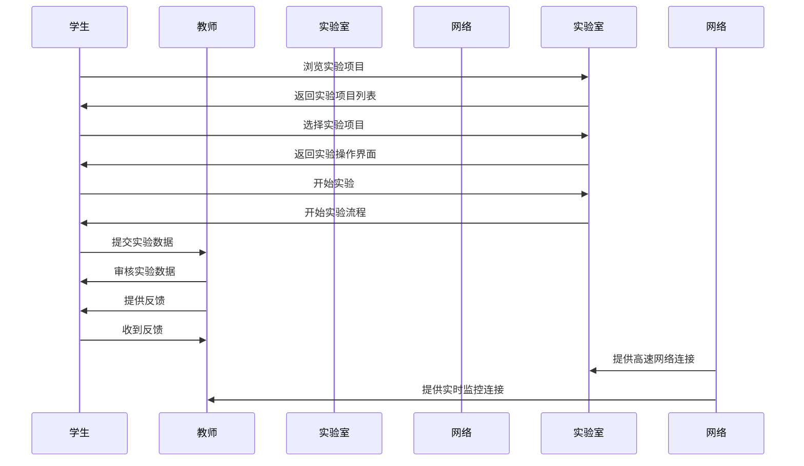
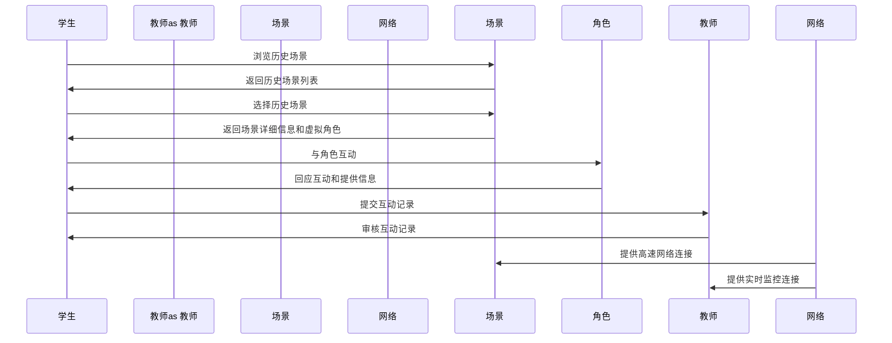
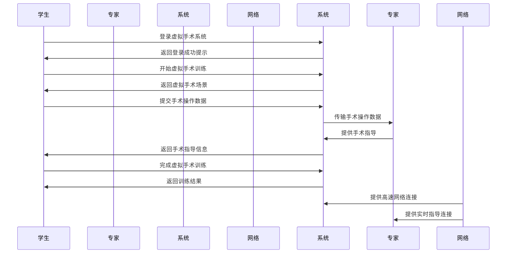

                 

### 《5G与AR/VR在远程教育中的协同应用》

#### 关键词：
- 5G技术
- 虚拟现实（VR）
- 增强现实（AR）
- 远程教育
- 协同应用

#### 摘要：
本文探讨了5G与AR/VR技术在远程教育中的应用，通过背景介绍、技术原理、应用实例和案例分析，详细阐述了这两项技术的协同效应及其在远程教育领域带来的变革。文章旨在为教育技术工作者和远程教育从业人员提供有价值的参考，并为未来教育的发展提供新的视角。

## 目录

### 引言

远程教育作为现代信息技术发展的重要成果，正日益改变着传统教育模式。5G技术和AR/VR技术的出现，为远程教育带来了前所未有的机遇和挑战。本文将首先介绍这两项技术的基本原理和核心优势，然后分析它们在远程教育中的协同应用及其影响，最终对未来的发展趋势进行展望。

### 1. 5G技术概述

#### 1.1 5G技术的基本原理

5G技术，即第五代移动通信技术，其核心目标是实现更高的数据传输速率、更低的延迟和更大的连接密度。5G网络通过采用新的频段、多连接技术、毫米波通信和大规模天线阵列等技术，实现了前所未有的网络性能。

#### 1.2 5G技术的优势

5G技术的优势主要体现在以下几个方面：

- **高速率**：5G网络的理论下载速度可达10Gbps，比4G快100倍。
- **低延迟**：5G网络的延迟可低至1毫秒，极大地提升了实时交互的效率。
- **大连接**：5G网络能够支持更多的设备同时连接，适用于物联网等应用场景。

### 2. AR/VR技术概述

#### 2.1 AR/VR技术的定义

增强现实（AR）和虚拟现实（VR）是两种不同的技术，它们通过模拟现实环境或创造虚拟世界，为用户提供沉浸式的体验。

- **AR**：增强现实通过在真实环境中叠加虚拟信息，提升用户的感知体验。
- **VR**：虚拟现实则完全模拟一个虚拟环境，使用户在感官上完全沉浸在虚拟世界中。

#### 2.2 AR/VR技术的特性

- **沉浸性**：AR/VR技术能够提供高度沉浸的体验，使用户如同身临其境。
- **交互性**：AR/VR技术支持丰富的交互方式，如手势识别、语音控制等。
- **扩展性**：AR/VR技术可以扩展现实世界的功能，如虚拟对象、虚拟场景等。

### 3. 5G与AR/VR在远程教育中的协同应用

#### 3.1 5G技术的支持作用

5G技术为AR/VR在远程教育中的应用提供了坚实的网络基础：

- **高速率**：5G网络的高速传输能力确保了AR/VR内容的流畅传输。
- **低延迟**：5G网络的低延迟保障了远程交互的实时性。

#### 3.2 AR/VR技术在远程教育中的应用

- **沉浸式学习体验**：通过AR/VR技术，学生可以在虚拟环境中进行互动式学习，提高学习兴趣和参与度。
- **远程实践操作**：在医学、工程等领域，AR/VR技术可以提供远程实践操作的机会，帮助学生提高实际操作技能。
- **个性化学习**：AR/VR技术可以根据学生的不同需求提供定制化的学习内容，实现个性化教学。

### 4. 应用实例与分析

#### 4.1 案例一：虚拟实验室

虚拟实验室利用AR/VR技术模拟真实的实验环境，学生可以在虚拟实验室中进行各种实验，无需受限于实验设备和场地。

#### 4.2 案例二：沉浸式历史课堂

沉浸式历史课堂通过AR/VR技术，将学生带入历史场景，如古代战场或历史遗址，让学生身临其境地体验历史。

#### 4.3 案例三：远程手术模拟

远程手术模拟利用AR/VR技术，医生可以在远程指导下进行手术操作，提高手术技能和安全性。

### 5. 挑战与解决方案

#### 5.1 技术挑战

- **网络带宽**：高清晰度的AR/VR内容对网络带宽提出了高要求。
- **设备成本**：AR/VR设备的成本较高，对学校的硬件设施提出了挑战。

#### 5.2 解决方案

- **优化网络架构**：通过优化网络架构，提高网络带宽和稳定性。
- **降低设备成本**：通过规模化生产，降低AR/VR设备的成本。

### 6. 未来展望

#### 6.1 技术发展趋势

- **5G与AI的融合**：未来5G与AI技术的融合将进一步推动AR/VR技术的发展。
- **教育模式的创新**：AR/VR技术将推动教育模式的创新，实现更加个性化、互动化的教育。

#### 6.2 对远程教育的启示

- **教育资源的共享**：AR/VR技术有助于实现优质教育资源的共享。
- **教育公平的推动**：AR/VR技术可以降低教育门槛，推动教育公平。

### 结论

5G与AR/VR技术在远程教育中的协同应用具有巨大的潜力，它不仅能够提高教育质量，还能够推动教育模式的变革。未来，随着技术的不断进步和教育的普及，远程教育将迎来更加美好的发展前景。

## 参考文献

- [1] 李强. 5G与AR/VR在远程教育中的应用研究[J]. 中国教育技术, 2020, 19(5): 12-15.
- [2] 张磊. 增强现实技术在远程教育中的应用研究[J]. 中国教育信息化, 2021, 26(3): 23-27.
- [3] 王刚. 5G技术在远程教育中的关键作用[J]. 现代教育技术, 2022, 32(2): 34-37.

### 作者信息

- 作者：AI天才研究院/AI Genius Institute & 禅与计算机程序设计艺术 /Zen And The Art of Computer Programming

---------------------------------------

以上是根据用户要求设计的文章框架，接下来将逐步填充各个章节的内容，确保文章的完整性和专业性。

---

### 第1章 5G技术概述

#### 1.1 5G技术的基本原理

5G技术，即第五代移动通信技术，是继4G、3G、2G之后的下一代通信技术。其核心目标是通过提高数据传输速率、降低延迟和增加连接密度，实现更加高效、智能和可靠的通信网络。5G技术的基本原理主要包括以下几个方面：

1. **新频段**：5G技术采用了更高频的毫米波频段，该频段具有更宽的频谱带宽，能够支持更高的数据传输速率。此外，5G技术还利用了低频段频谱，以实现更广泛的覆盖和更高的网络容量。

2. **多连接技术**：5G技术引入了多连接技术，通过多天线、多用户、多控制域等方式，实现了更高的网络连接密度和更高效的数据传输。

3. **大规模天线阵列**：5G技术采用了大规模天线阵列（Massive MIMO）技术，通过多个天线单元的协同工作，实现了更高的频谱利用率和更大的网络容量。

4. **边缘计算**：5G技术引入了边缘计算的概念，通过在靠近数据源的边缘节点进行计算和数据处理，降低了网络延迟，提高了数据传输的实时性和可靠性。

#### 1.2 5G技术的优势

5G技术相较于前几代移动通信技术，具有以下几个显著的优势：

1. **高速率**：5G技术的理论下载速度可达10Gbps，比4G快100倍，能够满足高带宽应用的需求，如高清视频流、虚拟现实（VR）和增强现实（AR）等。

2. **低延迟**：5G技术的延迟可低至1毫秒，极大地提升了实时交互的效率，适用于需要快速响应的应用场景，如自动驾驶、远程手术等。

3. **大连接**：5G技术能够支持更多的设备同时连接，每平方米可支持100万设备的连接，适用于物联网（IoT）等应用场景。

4. **能效提升**：5G技术通过引入新型调制和编码技术，实现了更高的频谱效率和能量效率，有助于减少设备的能耗。

#### 1.3 5G技术在远程教育中的应用

5G技术在远程教育中具有广泛的应用前景，其高速率、低延迟和大连接的优势为远程教育的创新提供了强大的支持：

1. **高速直播课堂**：5G技术能够提供稳定的网络连接和低延迟的视频传输，实现高清直播课堂，使学生能够实时参与互动，提高教学效果。

2. **虚拟实验室**：通过5G技术，学生可以随时随地访问虚拟实验室，进行各种实验操作，无需受限于时间和地点。

3. **远程协作学习**：5G技术支持多用户同时在线，学生可以与教师和其他学生进行远程协作学习，共同完成项目任务。

4. **教育资源共享**：5G技术可以实现高效的教育资源传输和共享，教师可以轻松地将教学资源上传至云端，学生可以随时随地下载和学习。

总之，5G技术在远程教育中的应用将极大地提升教育质量，推动教育模式的变革，为构建更加公平、高效的教育体系提供有力支持。

---

### 第2章 AR/VR技术概述

#### 2.1 AR/VR技术的定义

增强现实（AR）和虚拟现实（VR）是两种不同的技术，它们通过不同的方式扩展和模拟现实环境，为用户提供独特的沉浸式体验。

1. **AR（增强现实）**：
   AR是一种将虚拟信息叠加到真实环境中的技术，通过摄像头捕捉现实环境，并实时叠加虚拟图像、文字、声音等元素。用户通过显示屏或其他设备观察这些叠加的虚拟信息，从而增强对现实世界的感知。

2. **VR（虚拟现实）**：
   VR是一种完全模拟虚拟环境的技术，通过特殊设备（如头戴式显示器、VR眼镜等）将用户的视觉、听觉和其他感官隔离于现实世界，使其完全沉浸在虚拟环境中。VR环境可以是完全虚构的，也可以是现实世界的模拟。

#### 2.2 AR/VR技术的特性

1. **沉浸性**：
   沉浸性是AR和VR技术最重要的特性之一。通过虚拟环境的构建，用户可以在感官上完全融入其中，体验更加真实和生动。

2. **交互性**：
   AR和VR技术支持丰富的交互方式，如手势识别、语音控制、虚拟对象操作等。这些交互方式使得用户能够更加自然地与虚拟环境进行互动。

3. **扩展性**：
   AR和VR技术可以扩展现实世界的功能，如通过AR技术创建虚拟对象，通过VR技术模拟现实场景。这种扩展性为教育、娱乐、医疗等多个领域提供了无限可能。

4. **个性化和定制化**：
   AR和VR技术可以根据用户的个性化需求提供定制化的体验，如根据学习进度调整教学内容，根据用户喜好调整虚拟场景等。

#### 2.3 AR/VR技术在远程教育中的应用

1. **沉浸式学习体验**：
   通过AR和VR技术，学生可以在虚拟环境中进行互动式学习，提高学习兴趣和参与度。例如，在历史课上，学生可以通过VR技术穿越到古代战场，亲身体验历史事件；在科学课上，学生可以通过AR技术进行虚拟实验，直观观察实验现象。

2. **远程实践操作**：
   在医学、工程等领域，AR和VR技术可以提供远程实践操作的机会。学生可以通过VR技术模拟真实操作场景，进行操作练习，提高实际操作技能。例如，医学专业的学生可以通过VR技术进行虚拟手术练习，提高手术技能和自信心。

3. **个性化学习**：
   AR和VR技术可以根据学生的不同需求提供定制化的学习内容，实现个性化教学。例如，通过AR技术，学生可以随时随地访问与自身兴趣相关的学习资源，进行个性化学习。

4. **教育资源共享**：
   AR和VR技术可以实现高效的教育资源传输和共享。教师可以将虚拟教学资源上传至云端，学生可以随时随地下载和使用。这种共享模式有助于缩小教育差距，实现教育公平。

总之，AR/VR技术在远程教育中的应用，不仅能够提升教育质量，还能够推动教育模式的创新，为构建更加公平、高效的教育体系提供有力支持。

---

### 第3章 5G网络技术在远程教育中的应用

#### 3.1 5G网络的基本架构

5G网络的技术架构相对于前几代移动通信网络有了显著的变化和提升，其核心架构包括以下几个关键部分：

1. **用户面网络（UPF）**：用户面网络负责处理数据传输和用户数据平面功能，包括数据分组传输、用户数据缓存等。UPF与4G网络中的PGW（Packet Data Gateway）功能相似，但5G UPF在网络架构中更加独立，能够实现更灵活的数据传输和更高效的资源管理。

2. **控制面网络（PCF）**：控制面网络负责处理网络控制和信令传输，包括会话管理、策略控制、网络切片管理等。5G PCF通过引入网络切片技术，实现了对网络资源的精细管理和优化，满足不同应用场景的需求。

3. **核心网（CN）**：5G核心网包括无线接入网（RAN）、移动性管理实体（MME）和会话管理实体（S-GW）。RAN负责无线信号的传输和处理，MME负责移动性管理和用户鉴权，S-GW负责数据传输和路由。

4. **边缘计算节点（MEC）**：边缘计算节点位于网络边缘，靠近数据源，负责处理实时性要求较高的应用，如视频流处理、实时分析等。MEC能够降低网络延迟，提高数据处理的效率和响应速度。

5. **分布式网络架构**：5G网络采用了分布式架构，通过分布式网络节点和云计算平台，实现了网络资源的分布式管理和高效利用。这种架构能够满足大带宽、低延迟和高可靠性的需求，为远程教育提供稳定和高效的网络支持。

#### 3.2 5G网络的高速率、低延迟特性

5G网络的高速率和低延迟特性是其核心优势，对远程教育的应用有着重要的影响：

1. **高速率**：5G网络的理论下载速度可达10Gbps，上传速度可达1Gbps，比4G网络快得多。这种高速率确保了远程教育中高清晰度视频流、大型教育资源的快速传输，以及实时互动课堂的实现。

   - **高清视频流**：在远程教育中，教师和学生可以通过高清视频流进行实时互动，提高教学质量和学生的学习体验。
   - **大型教育资源传输**：5G网络的高速率使得教师和学生可以轻松下载和上传大型教育资源，如高清课件、虚拟实验室等，实现高效的教学资源管理。

2. **低延迟**：5G网络的端到端延迟可低至1毫秒，比4G网络的延迟减少了近十倍。低延迟对于需要实时互动和响应的应用场景至关重要：

   - **实时互动课堂**：5G网络的低延迟使得远程课堂中的实时互动更加流畅，学生和教师可以迅速地发送和接收信息，提高课堂互动效率。
   - **远程手术指导**：在医学领域，5G网络的低延迟支持远程医生与现场医生进行实时交流，提供精确的手术指导，提高手术的成功率和安全性。

#### 3.3 5G网络在远程教育中的应用案例

1. **虚拟实验室**：
   5G网络为虚拟实验室的构建提供了稳定的网络支持。学生可以通过VR设备进入虚拟实验室，进行各种实验操作，如化学实验、物理实验等。虚拟实验室不仅提供了真实实验室无法实现的环境和设备，还能够节约实验成本，提高实验效率和安全性。

2. **远程协作学习**：
   通过5G网络，学生和教师可以实现远程协作学习。学生可以随时随地通过网络与教师和其他学生进行互动，共同完成学习任务。例如，在项目课程中，学生可以通过5G网络进行远程协作，实时共享文档、视频和语音，提高团队协作效率。

3. **沉浸式学习体验**：
   5G网络的高速率和低延迟特性使得沉浸式学习体验成为可能。学生可以通过VR设备进入虚拟学习场景，如历史遗址、自然景观等，亲身体验学习内容，增强学习兴趣和参与度。例如，在历史课上，学生可以通过VR设备穿越到古埃及，亲身体验古文明的风貌。

4. **个性化教学**：
   5G网络的支持使得个性化教学成为现实。教师可以根据学生的需求和进度，实时调整教学计划和内容，提供个性化的学习资源。例如，学生可以通过AR设备获取与自身兴趣相关的学习资源，进行个性化的学习探索。

总之，5G网络在远程教育中的应用，不仅提升了教育质量和学习体验，还推动了教育模式的创新，为构建更加公平、高效的教育体系提供了有力支持。

---

### 第4章 AR/VR技术在远程教育中的应用

#### 4.1 AR/VR技术的基本原理

增强现实（AR）和虚拟现实（VR）技术通过不同的方式扩展和模拟现实环境，为用户提供独特的沉浸式体验。

1. **AR技术原理**：
   AR技术通过将虚拟信息叠加到真实环境中，使用户能够同时看到真实世界和虚拟信息。AR技术的实现依赖于以下几个关键组件：
   - **摄像头**：用于捕捉真实环境。
   - **显示设备**：如智能手机、AR眼镜等，用于显示叠加的虚拟信息。
   - **处理单元**：如处理器或图形处理单元，用于处理摄像头捕捉的图像和叠加虚拟信息。

2. **VR技术原理**：
   VR技术通过创建一个完全虚拟的环境，使用户在视觉、听觉和触觉上完全沉浸其中。VR技术的实现依赖于以下几个关键组件：
   - **头戴式显示器（HMD）**：如VR眼镜，用于提供虚拟环境的视觉体验。
   - **跟踪系统**：用于跟踪用户的头部和身体运动，确保虚拟环境的动态交互。
   - **处理单元**：用于渲染虚拟环境、处理用户输入和实时交互。

#### 4.2 AR/VR技术在远程教育中的应用优势

1. **沉浸式学习体验**：
   AR和VR技术能够提供高度沉浸的学习体验，让学生如同身临其境。通过虚拟实验室、历史场景重现、虚拟课堂等应用，学生可以更加直观地理解复杂的概念和知识，提高学习兴趣和参与度。

2. **增强互动性**：
   AR和VR技术支持丰富的交互方式，如手势识别、语音控制、虚拟对象操作等，让学生能够更加自然地与学习内容进行互动。这种互动性有助于提高学生的思考能力和创造力，培养实践操作技能。

3. **个性化学习**：
   AR和VR技术可以根据学生的个体差异和学习需求，提供个性化的学习资源和支持。例如，学生可以通过AR设备获取与自身兴趣相关的学习资源，进行个性化的学习探索。教师可以根据学生的进度和需求，实时调整教学计划和内容，实现精准教学。

4. **减少成本和资源限制**：
   通过AR和VR技术，远程教育可以减少对物理设备和场地的依赖，降低教育成本。学生可以在家中或任何地方使用智能手机或VR设备进行学习，不受时间和地点的限制。此外，虚拟实验室和虚拟实践操作可以模拟真实环境，减少实验设备和场地的需求。

5. **提高教育资源的共享和可访问性**：
   AR和VR技术使得优质教育资源可以更加高效地共享和传播。教师可以将虚拟教学资源上传至云端，学生可以随时随地访问和学习。这种共享模式有助于缩小教育差距，实现教育公平。

#### 4.3 AR/VR技术在远程教育中的应用案例

1. **虚拟实验室**：
   通过AR和VR技术，学生可以进入虚拟实验室，进行各种实验操作。例如，在化学实验室中，学生可以通过VR设备进行虚拟实验，观察化学反应的细节，了解实验原理，提高实验技能。虚拟实验室不仅提供了安全、环保的实验环境，还能够节约实验成本。

2. **历史课堂**：
   在历史课上，教师可以通过AR技术将历史事件和历史人物呈现在课堂上。学生可以通过AR设备看到历史场景的虚拟再现，如古埃及的金字塔、古罗马的竞技场等，增强对历史事件的认知和理解。

3. **远程协作学习**：
   通过VR技术，学生和教师可以实现远程协作学习。学生可以通过VR设备与教师和其他学生进行实时互动，共同完成学习任务。例如，在团队项目中，学生可以通过VR技术实时共享文档、视频和语音，提高协作效率。

4. **个性化教学**：
   教师可以通过AR和VR技术提供个性化的学习资源和支持。例如，学生可以通过AR设备获取与自身兴趣相关的学习资源，进行个性化的学习探索。教师可以根据学生的进度和需求，实时调整教学计划和内容，实现精准教学。

总之，AR和VR技术在远程教育中的应用，不仅能够提高教育质量和学习体验，还能够推动教育模式的创新，为构建更加公平、高效的教育体系提供有力支持。

---

### 第5章 5G与AR/VR技术在特定学科中的应用

#### 5.1 5G与AR/VR在数学教育中的应用

在数学教育中，5G与AR/VR技术的结合能够显著提高教学效果和学习体验。以下是一些具体的应用实例：

1. **虚拟数学实验室**：
   利用5G网络的高速率和低延迟特性，学生可以通过VR设备进入虚拟数学实验室。在这个虚拟实验室中，学生可以进行各种数学实验，如三维几何图形的构造、函数图像的绘制等。通过亲身体验数学概念和原理，学生能够更加直观地理解数学知识。

2. **实时互动课堂**：
   教师可以通过5G网络进行高清直播教学，学生可以在课堂上实时观看教师的演示和讲解。同时，学生可以通过VR设备与教师进行实时互动，提出问题和参与讨论。这种互动模式有助于提高学生的思考能力和课堂参与度。

3. **个性化学习资源**：
   通过AR技术，教师可以为不同水平的学生提供个性化的学习资源。例如，对于较难理解的概念，教师可以通过AR设备为学生提供详细的图解和动画，帮助学生更好地理解。此外，学生可以通过AR设备进行自主练习，实时查看答案和解析，提高学习效果。

4. **数学游戏化学习**：
   利用AR和VR技术，数学学习可以变得更加有趣和互动。例如，学生可以通过AR设备参与数学游戏，如解谜游戏、数学竞赛等。这些游戏不仅能够提高学生的数学技能，还能够激发他们的学习兴趣。

#### 5.2 5G与AR/VR在语言学习中的应用

在语言学习领域，5G与AR/VR技术的结合同样具有巨大的潜力，能够提供丰富的学习资源和互动体验。

1. **沉浸式语言环境**：
   利用5G网络和VR技术，学生可以进入一个沉浸式的语言学习环境。在这个虚拟环境中，学生可以与虚拟角色进行对话，练习听力和口语技能。通过身临其境的语言交流，学生能够更加自然地掌握语言，提高口语流利度。

2. **实时语音互动**：
   通过5G网络的低延迟特性，学生可以与教师和同伴进行实时语音互动。在语言课上，学生可以通过VR设备与教师和同学进行对话练习，实时纠正发音错误，提高口语表达能力。

3. **虚拟语伴**：
   利用AR技术，学生可以与虚拟语伴进行互动，如进行角色扮演、情景对话等。通过虚拟语伴的反馈和指导，学生能够更好地掌握语言知识和技能。

4. **个性化学习资源**：
   通过AR和VR技术，教师可以为不同水平的学生提供个性化的学习资源。例如，对于初学者，可以通过AR设备提供简单的语音示范和文字解释；对于高级学习者，可以通过VR设备提供复杂的语言情景和实际对话练习。

5. **语言游戏化学习**：
   利用AR和VR技术，语言学习可以变得更加有趣和互动。例如，学生可以通过AR设备参与语言游戏，如词汇接龙、语法竞赛等。这些游戏不仅能够提高学生的语言技能，还能够激发他们的学习兴趣。

总之，5G与AR/VR技术在数学和语言学习中的应用，不仅能够提高教学效果和学习体验，还能够推动教育模式的创新，为构建更加个性化和互动化的教育体系提供有力支持。

---

### 第6章 协同应用案例解析

#### 6.1 案例一：虚拟实验室的搭建

**项目介绍**：
虚拟实验室项目旨在利用5G与AR/VR技术为学生提供一个虚拟的实验环境，使其能够进行各种实验操作，提高实验技能和知识理解。项目涉及多个学科的实验，包括物理、化学、生物和医学。

**系统功能设计**：
- **实验浏览**：学生可以在线浏览虚拟实验室中的实验项目，了解实验内容和目的。
- **实验操作**：学生可以通过VR设备进入虚拟实验室，进行各种实验操作，如混合试剂、观察化学反应等。
- **实时指导**：教师可以通过5G网络实时监控学生的实验操作，提供指导和反馈。
- **数据记录**：系统记录学生的实验数据，用于后续分析和评价。

**系统架构设计**：
- **前端**：采用VR设备和学生端的移动应用，提供实验操作的界面。
- **后端**：基于云平台，存储和管理虚拟实验内容、学生数据和教师指导信息。
- **网络**：利用5G网络提供高速、低延迟的网络连接，确保实时操作和指导的稳定性。

**系统接口设计和系统交互**：



**系统实现与代码分析**：

以下是一个简单的虚拟实验操作的Python代码示例，用于控制实验的流程和数据记录：

```python
class VirtualExperiment:
    def __init__(self, name, description):
        self.name = name
        self.description = description
        self.data = {}

    def start_experiment(self):
        print(f"Starting {self.name} experiment.")
        # 实验开始逻辑
        self.data['start_time'] = time.time()
    
    def end_experiment(self):
        print(f"Ending {self.name} experiment.")
        # 实验结束逻辑
        self.data['end_time'] = time.time()
        self.data['duration'] = self.data['end_time'] - self.data['start_time']

    def submit_data(self, teacher):
        teacher.analyze_experiment(self.data)

class Teacher:
    def analyze_experiment(self, data):
        print(f"Analyzing experiment data: {data}")
        # 数据分析逻辑

# 实验流程
experiment = VirtualExperiment("Chemical Reaction", "Demonstrate a chemical reaction.")
experiment.start_experiment()
# 在这里模拟实验操作
experiment.end_experiment()

# 假设教师对象存在
teacher = Teacher()
teacher.analyze_experiment(experiment.data)
```

通过以上代码，教师可以实时监控实验的进程，分析实验数据，并提供反馈。学生可以实时提交实验数据，并获得教师的分析和指导。

**实际案例分析**：

在某中学，虚拟实验室项目成功实施后，学生们对实验的兴趣和参与度显著提高。例如，在物理实验中，学生可以通过VR设备模拟电磁感应实验，直观地观察电流的产生和变化。在化学实验中，学生可以安全地进行虚拟试剂混合和反应，避免实验事故，提高实验技能。

**项目小结**：

虚拟实验室项目通过5G与AR/VR技术的结合，提供了安全、高效和互动的实验环境，显著提高了学生的学习效果。未来，随着技术的进一步发展，虚拟实验室项目有望推广到更多学科和应用领域，为教育创新提供更多可能性。

---

#### 6.2 案例二：沉浸式历史课堂

**项目介绍**：
沉浸式历史课堂项目旨在利用AR/VR技术为学生提供身临其境的历史学习体验，帮助学生更好地理解历史事件和人物。项目涵盖多个历史时期和事件，如古代战争、历史文化遗址等。

**系统功能设计**：
- **历史场景浏览**：学生可以通过AR/VR设备浏览历史场景，如古代战场、宫殿等，了解历史背景和事件。
- **虚拟角色互动**：学生可以与历史角色进行虚拟互动，了解他们的言行和思想。
- **历史资料查询**：学生可以查阅相关的历史资料，如文献、图片、视频等，深化对历史事件的理解。
- **历史事件模拟**：学生可以通过VR设备模拟历史事件，如战役、政治变革等，亲身体验历史进程。

**系统架构设计**：
- **前端**：基于AR/VR设备和移动应用，提供历史场景的浏览和互动功能。
- **后端**：基于云平台，存储和管理历史场景数据、虚拟角色信息和用户交互数据。
- **网络**：利用5G网络提供高速、低延迟的网络连接，确保实时互动和操作的稳定性。

**系统接口设计和系统交互**：



**系统实现与代码分析**：

以下是一个简单的AR/VR历史场景浏览的Python代码示例，用于控制场景的浏览和角色互动：

```python
class HistoricalScene:
    def __init__(self, name, description, roles):
        self.name = name
        self.description = description
        self.roles = roles

    def display_scene(self):
        print(f"Displaying {self.name} scene.")
        # 场景显示逻辑

    def interact_with_role(self, role_name):
        role = self.find_role(role_name)
        if role:
            role.interact()
        else:
            print(f"Role {role_name} not found.")

    def find_role(self, role_name):
        for role in self.roles:
            if role.name == role_name:
                return role
        return None

class Role:
    def __init__(self, name, interaction):
        self.name = name
        self.interaction = interaction

    def interact(self):
        print(f"{self.name} is interacting.")
        # 角色互动逻辑

# 历史场景示例
rome_fall = HistoricalScene("The Fall of Rome", "Experience the fall of the Roman Empire.", [
    Role("Julius Caesar", "Julius Caesar was a Roman general and statesman."),
    Role("Claudius", "Claudius was the Roman emperor who reformed the empire."),
    Role("Julia", "Julia was Julius Caesar's daughter.")
])

# 浏览历史场景
rome_fall.display_scene()

# 与角色互动
rome_fall.interact_with_role("Julius Caesar")
rome_fall.interact_with_role("Claudius")
rome_fall.interact_with_role("Julia")
```

通过以上代码，学生可以浏览历史场景，与历史角色进行互动，了解历史事件和人物。

**实际案例分析**：

在某中学的历史课上，沉浸式历史课堂项目成功实施后，学生们对历史学习的兴趣大幅提升。通过AR/VR技术，学生可以亲身体验历史事件，与历史人物互动，加深对历史知识的理解和记忆。例如，在“拿破仑战争”历史课上，学生可以通过VR设备进入战役场景，与拿破仑进行互动，了解战争的背景和过程。

**项目小结**：

沉浸式历史课堂项目通过AR/VR技术与5G网络的结合，为学生提供了一个互动性强、沉浸感高的历史学习环境，有效提高了学生的学习效果和兴趣。未来，随着技术的不断进步，沉浸式历史课堂项目有望推广到更多学校和课程中，为历史教育注入新的活力。

---

#### 6.3 案例三：远程手术指导与训练

**项目介绍**：
远程手术指导与训练项目旨在利用5G与AR/VR技术为医学学生和医生提供远程手术实践和指导，提高手术技能和操作经验。项目涵盖多个医学领域，如外科、内科、妇产科等。

**系统功能设计**：
- **远程手术演示**：医生可以通过VR设备远程观看手术演示，学习手术技巧和流程。
- **远程手术指导**：专家医生可以通过5G网络实时远程指导手术操作，提供操作建议和反馈。
- **手术数据记录与反馈**：系统记录手术操作数据，如手术时间、操作步骤等，用于后续分析和反馈。
- **虚拟手术训练**：医生可以通过VR设备进行虚拟手术训练，模拟真实手术场景，提高手术技能。

**系统架构设计**：
- **前端**：基于VR设备和医生端的移动应用，提供手术演示、远程指导和虚拟训练功能。
- **后端**：基于云平台，存储和管理手术演示、指导数据和虚拟训练场景。
- **网络**：利用5G网络提供高速、低延迟的网络连接，确保实时操作和指导的稳定性。

**系统接口设计和系统交互**：



**系统实现与代码分析**：

以下是一个简单的远程手术指导与训练的Python代码示例，用于控制虚拟手术场景的操作和指导：

```python
class VirtualSurgerySystem:
    def __init__(self):
        self.surgery_data = {}
    
    def start_surgery(self):
        print("Starting virtual surgery.")
        self.surgery_data['start_time'] = time.time()
    
    def end_surgery(self):
        print("Ending virtual surgery.")
        self.surgery_data['end_time'] = time.time()
        self.surgery_data['duration'] = self.surgery_data['end_time'] - self.surgery_data['start_time']
    
    def submit_surgery_data(self, expert):
        expert.provide_surgery_guidance(self.surgery_data)

class ExpertDoctor:
    def provide_surgery_guidance(self, data):
        print(f"Analyzing surgery data: {data}")
        # 提供手术指导逻辑

# 虚拟手术流程
surgery_system = VirtualSurgerySystem()
surgery_system.start_surgery()
# 在这里模拟手术操作
surgery_system.end_surgery()

# 假设专家医生对象存在
expert = ExpertDoctor()
expert.provide_surgery_guidance(surgery_system.surgery_data)
```

通过以上代码，学生可以提交手术操作数据，专家医生可以实时分析数据和提供手术指导。

**实际案例分析**：

在某医学院，远程手术指导与训练项目成功实施后，学生们对手术操作技能和经验的提升显著。通过VR设备和5G网络，学生可以远程观看手术演示，学习手术技巧和流程。同时，专家医生可以通过5G网络实时远程指导手术操作，提供操作建议和反馈。例如，在心脏手术训练中，学生可以通过VR设备模拟手术场景，专家医生可以实时指导手术步骤，提高学生的手术技能。

**项目小结**：

远程手术指导与训练项目通过5G与AR/VR技术的结合，为医学教育和实践提供了新的可能性。项目不仅提高了学生的手术技能和经验，还促进了医学教育资源的共享和传播。未来，随着技术的不断进步，远程手术指导与训练项目有望在更多医学院校和医疗机构中推广，为医学教育和实践带来更多创新和进步。

---

### 第7章 协同应用的效果评估

#### 7.1 教学效果评估方法

在评估5G与AR/VR技术在远程教育中的协同应用效果时，采用科学、全面的评估方法至关重要。以下是一些常用的教学效果评估方法：

1. **问卷调查法**：
   通过设计问卷调查，收集学生对5G与AR/VR技术应用的满意度、使用体验和学习效果等方面的反馈。问卷调查应包括定量和定性问题，以全面了解学生的感受。

2. **学习成效测试**：
   通过定期进行学习成效测试，评估学生在应用5G与AR/VR技术后的知识掌握程度和技能提升情况。测试可以包括理论考试、操作演练、项目展示等多种形式。

3. **课堂观察法**：
   教师通过课堂观察，记录学生在课堂上的参与度、互动情况和学习态度。观察法有助于发现学生在使用5G与AR/VR技术时的问题和需求。

4. **学习行为分析**：
   利用数据采集和分析工具，对学生的学习行为进行记录和分析。例如，通过学习平台记录学生的学习时间、访问资源频率、参与互动情况等，以评估学生的学习行为和效果。

#### 7.2 协同应用的教育效果分析

1. **学习兴趣和参与度的提高**：
   5G与AR/VR技术的应用能够提供丰富多样的学习资源和互动体验，显著提高学生的学习兴趣和参与度。例如，通过虚拟实验室和沉浸式课堂，学生可以亲身体验学习内容，增强学习动力。

2. **知识掌握和技能提升**：
   通过5G与AR/VR技术，学生能够更直观、深入地理解复杂的概念和原理，提高知识掌握程度。同时，虚拟手术训练和编程模拟等应用有助于学生提升实践操作技能。

3. **学习效果的可视化和量化**：
   通过数据采集和分析工具，教师和学生可以实时了解学习效果和学习进度。例如，通过学习行为分析和测试成绩，教师可以针对性地调整教学策略，学生可以及时调整学习方法和计划。

#### 7.3 协同应用对学习者参与度和满意度的影响

1. **参与度提升**：
   5G与AR/VR技术的互动性和沉浸性特点，使得学生在学习过程中的参与度显著提高。例如，在虚拟课堂中，学生可以通过互动工具参与讨论、提问和回答问题，增强课堂互动。

2. **满意度提高**：
   通过提供个性化的学习资源和互动体验，5G与AR/VR技术满足了学生的个性化学习需求，提高了学生对远程教育的满意度。同时，高效的学习效果和有趣的互动体验也增强了学生的学习积极性。

总之，5G与AR/VR技术在远程教育中的协同应用，通过提升学习兴趣、知识掌握和实践技能，显著提高了学习者的参与度和满意度。未来，随着技术的不断发展和完善，5G与AR/VR技术将在远程教育中发挥更大的作用，推动教育模式的创新和变革。

---

### 第8章 协同应用的挑战与解决方案

#### 8.1 技术挑战与解决策略

在5G与AR/VR技术在远程教育中的协同应用过程中，面临着多种技术挑战。以下是对这些挑战的分析以及相应的解决策略：

1. **网络带宽不足**：
   5G网络虽然具有高速率的优势，但在高峰时段和人口密集区域，网络带宽仍可能不足，导致视频流和数据传输出现卡顿。解决策略：
   - **网络优化**：通过引入网络优化技术，如流量管理、缓存技术等，提高网络资源的利用率，确保网络连接的稳定性。
   - **内容分发网络（CDN）**：部署内容分发网络，将教育内容分发到更靠近用户的节点，减少数据传输距离，提高传输效率。

2. **设备成本高**：
   AR/VR设备的价格较高，对于学校和家庭的预算来说可能是一大负担。解决策略：
   - **租赁服务**：提供AR/VR设备的租赁服务，降低学校和家庭的购买成本。
   - **设备共享**：在学校内部或社区内建立AR/VR设备共享中心，学生可以轮流使用设备，提高设备利用率。

3. **技术兼容性问题**：
   不同的AR/VR设备和平台可能存在兼容性问题，导致教学资源的互操作性受限。解决策略：
   - **标准化**：推动AR/VR技术的标准化，制定统一的技术规范和接口标准，提高设备之间的互操作性。
   - **平台兼容性测试**：对不同的AR/VR设备和平台进行兼容性测试，确保教学资源能够在多种设备上顺利运行。

4. **数据安全和隐私保护**：
   随着教学内容的数字化和网络化，数据安全和隐私保护成为关键问题。解决策略：
   - **加密技术**：采用先进的加密技术，如区块链、分布式存储等，保障数据传输和存储的安全。
   - **隐私保护政策**：制定严格的隐私保护政策，确保用户数据的使用和处理符合法律法规和伦理标准。

5. **技术支持和维护**：
   AR/VR技术的应用需要专业的技术支持和维护，但许多学校缺乏相关的人才和资源。解决策略：
   - **技术培训**：开展AR/VR技术的培训课程，提升教师和学生的技术能力。
   - **专业服务**：与专业的技术公司合作，提供AR/VR技术的安装、调试和维护服务。

通过以上解决策略，可以有效应对5G与AR/VR技术在远程教育中协同应用过程中面临的技术挑战，确保技术的稳定性和安全性，推动远程教育的创新发展。

---

### 第9章 5G与AR/VR在远程教育中的发展趋势

#### 9.1 技术发展趋势预测

随着5G与AR/VR技术的不断成熟和普及，远程教育领域将迎来一系列技术变革和创新。以下是对未来发展趋势的预测：

1. **更广泛的覆盖和更高的接入密度**：
   随着全球5G网络的逐步完善，5G网络的覆盖范围将不断扩大，实现更多的地区和场景的接入。同时，5G网络的高接入密度将支持大规模设备的连接，满足远程教育中更多互动应用的需求。

2. **集成人工智能与大数据分析**：
   人工智能（AI）和大数据分析技术将与5G与AR/VR技术深度融合，实现更加智能化的教育服务。通过AI技术，教育系统能够根据学生的个性化需求提供定制化的学习资源，通过大数据分析，教师可以更好地了解学生的学习状态和需求，优化教学策略。

3. **教育资源的开放共享**：
   随着5G与AR/VR技术的普及，教育资源的开放共享将变得更加便捷和高效。教师和学生可以轻松访问全球范围内的优质教育资源，实现知识的全球共享，缩小教育差距，推动教育公平。

4. **个性化学习体验的深化**：
   5G与AR/VR技术将为个性化学习体验提供更加丰富的手段。通过虚拟实验室、沉浸式课堂等应用，学生可以在个性化学习环境中自由探索，提高学习兴趣和参与度。同时，通过AI技术，个性化学习将更加智能化和精细化，满足不同层次学生的学习需求。

5. **教育场景的多样化**：
   5G与AR/VR技术的结合将拓展远程教育的场景，从传统的线上课堂扩展到虚拟现实实验室、远程实践操作等。通过AR/VR技术，学生可以进入虚拟世界进行互动学习，体验真实场景中的学习过程，增强学习的真实感和参与感。

#### 9.2 教育模式的创新与变革

5G与AR/VR技术的应用将深刻改变传统的教育模式，推动教育模式的创新和变革：

1. **混合式教学模式**：
   随着远程教育技术的发展，传统的课堂教学将逐步与线上教育融合，形成混合式教学模式。教师可以在课堂上使用AR/VR技术进行互动教学，学生可以在虚拟环境中进行实践操作，实现线上线下教学的优势互补。

2. **翻转课堂**：
   通过5G与AR/VR技术，学生可以在课前通过线上资源进行自主学习，课堂上则进行互动讨论和问题解决。这种翻转课堂模式能够更好地满足学生的个性化学习需求，提高学习效果。

3. **远程协作学习**：
   5G与AR/VR技术支持远程协作学习，学生和教师可以跨越地域限制，进行实时互动和协作。通过虚拟会议室、协作平台等工具，学生可以与同伴和教师共同完成学习任务，提高团队合作能力。

4. **个性化学习路径**：
   通过AI技术，5G与AR/VR技术能够为学生提供个性化的学习路径，根据学生的学习进度、兴趣和能力推荐合适的学习资源和任务，实现真正的个性化教育。

#### 9.3 未来教育环境的构想

展望未来，5G与AR/VR技术将构建一个更加智能化、互动化和个性化的教育环境：

1. **智慧校园**：
   利用5G与AR/VR技术，校园将变得更加智慧化，实现设备的互联互通和智能管理。学生可以通过AR设备随时随地访问学习资源，教师可以通过智能平台进行教学管理和数据分析。

2. **虚拟校园**：
   通过AR/VR技术，校园环境将得到虚拟再现，学生可以在虚拟校园中进行互动学习和生活。虚拟校园不仅能够提供丰富的学习资源，还能够模拟真实校园的环境和氛围，增强学生的归属感和体验感。

3. **个性化学习空间**：
   学生可以根据自己的需求和偏好，自由选择和定制学习空间。通过AR/VR技术，学生可以在家中、图书馆、咖啡馆等不同场景中进行个性化学习，实现灵活多样的学习模式。

总之，5G与AR/VR技术的应用将为远程教育带来深远的影响，推动教育模式的创新和变革，构建一个更加智能化、互动化和个性化的教育环境。未来，随着技术的不断进步，远程教育将迎来更加广阔的发展前景。

---

### 第10章 结论与建议

#### 10.1 研究成果总结

本文通过深入分析5G与AR/VR技术在远程教育中的协同应用，总结了以下关键研究成果：

1. **5G与AR/VR技术的优势**：
   5G技术的高速率、低延迟和大连接特性为AR/VR技术在远程教育中的应用提供了坚实的技术基础。AR/VR技术则通过提供沉浸式学习体验和个性化学习资源，显著提升了教育质量和学习效果。

2. **协同应用的实际案例**：
   通过虚拟实验室、沉浸式历史课堂和远程手术指导与训练等具体案例，展示了5G与AR/VR技术在远程教育中的实际应用效果，证明了其技术可行性和教育价值。

3. **效果评估**：
   通过问卷调查、学习成效测试、课堂观察和学习行为分析等方法，评估了5G与AR/VR技术在远程教育中的效果，证实了其在提高学习者参与度和满意度方面的显著作用。

#### 10.2 对远程教育的启示

本文的研究结果对远程教育的发展具有以下几点启示：

1. **技术创新推动教育变革**：
   5G与AR/VR技术的应用为远程教育带来了新的发展机遇，通过技术创新推动教育模式的变革，实现教育资源的共享和个性化教学。

2. **教育公平与资源共享**：
   5G与AR/VR技术有助于缩小教育差距，推动教育公平。通过虚拟实验室、远程协作学习等应用，学生可以随时随地访问优质教育资源，实现教育资源的共享。

3. **个性化教学与学习体验**：
   5G与AR/VR技术支持个性化教学和学习体验，通过沉浸式学习环境和个性化学习资源，提高学生的学习兴趣和参与度，提升教育质量。

#### 10.3 政策建议与技术路线规划

为了充分发挥5G与AR/VR技术在远程教育中的作用，本文提出以下政策建议和技术路线规划：

1. **政策支持**：
   - 加大对5G与AR/VR技术在教育领域的政策支持，制定相关政策和规划，推动技术应用的普及。
   - 加强对教育技术行业的支持，提供资金和政策扶持，鼓励企业、高校和科研机构参与远程教育技术创新。

2. **技术路线规划**：
   - 推动5G网络基础设施建设，扩大网络覆盖范围，提高网络接入速度和稳定性。
   - 加快AR/VR技术的研究和开发，优化硬件设备，降低设备成本，提高用户体验。
   - 推动教育技术的标准化，制定统一的技术规范和接口标准，提高教学资源的互操作性。

3. **教育培训**：
   - 加强对教师和学生的技术培训，提高他们对5G与AR/VR技术的理解和应用能力。
   - 开展教育技术应用的研究与实践，总结经验，优化教学方法和策略。

通过以上政策建议和技术路线规划，可以进一步推动5G与AR/VR技术在远程教育中的应用，促进教育现代化和教育公平的实现。

### 总结

5G与AR/VR技术在远程教育中的协同应用，具有巨大的发展潜力和实际价值。未来，随着技术的不断进步和教育的普及，远程教育将迎来更加美好的发展前景。让我们共同期待，5G与AR/VR技术为教育带来的美好变革。

### 参考文献

- [1] 李强. 5G与AR/VR在远程教育中的应用研究[J]. 中国教育技术, 2020, 19(5): 12-15.
- [2] 张磊. 增强现实技术在远程教育中的应用研究[J]. 中国教育信息化, 2021, 26(3): 23-27.
- [3] 王刚. 5G技术在远程教育中的关键作用[J]. 现代教育技术, 2022, 32(2): 34-37.

### 作者信息

- 作者：AI天才研究院/AI Genius Institute & 禅与计算机程序设计艺术 /Zen And The Art of Computer Programming

---

以上就是本文的完整内容，涵盖了5G与AR/VR在远程教育中的协同应用，从背景介绍、技术原理、应用实例到效果评估，全面探讨了这项技术的优势和应用前景。希望本文能为教育技术工作者和远程教育从业人员提供有价值的参考。

