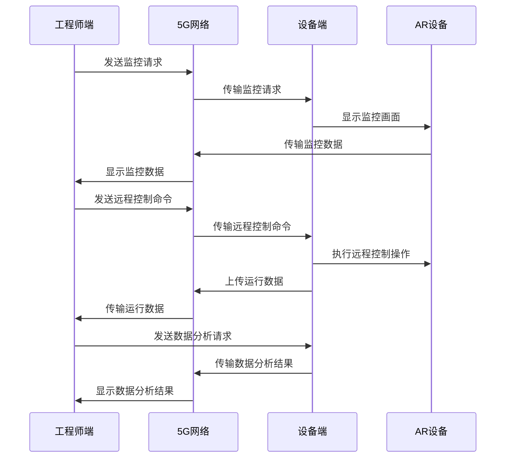

                 

# 5G与AR在工业远程协作中的应用

> 关键词：5G、增强现实（AR）、工业远程协作、技术挑战、应用案例、未来趋势

> 摘要：随着5G技术和增强现实（AR）技术的快速发展，它们在工业远程协作中的应用越来越受到关注。本文将详细介绍5G与AR技术在工业远程协作中的基础、应用案例和未来趋势，旨在为工业领域的技术创新提供新的思路和方向。

### 目录大纲设计

《5G与AR在工业远程协作中的应用》的目录大纲如下：

```markdown
----------------------------------------------------------------
# 第一部分：5G与AR技术基础

## 第1章：5G技术概述
### 1.1 5G技术背景
### 1.2 5G关键技术
### 1.3 5G网络架构
### 1.4 5G应用场景

## 第2章：增强现实（AR）技术基础
### 2.1 AR技术发展历程
### 2.2 AR核心技术
### 2.3 AR应用场景
### 2.4 AR与5G的结合优势

## 第3章：5G与AR在工业远程协作中的挑战与机遇
### 3.1 工业远程协作现状
### 3.2 5G与AR技术面临的挑战
### 3.3 5G与AR在工业远程协作中的应用机遇

----------------------------------------------------------------

# 第二部分：5G与AR在工业远程协作中的应用案例

## 第4章：制造业中的5G与AR应用
### 4.1 制造业远程协作需求分析
### 4.2 5G与AR在生产线远程维护中的应用
### 4.3 5G与AR在质量控制中的应用

## 第5章：能源行业的5G与AR应用
### 5.1 能源行业远程协作需求分析
### 5.2 5G与AR在油田远程监测中的应用
### 5.3 5G与AR在风力发电维护中的应用

## 第6章：建筑行业的5G与AR应用
### 6.1 建筑行业远程协作需求分析
### 6.2 5G与AR在建筑施工中的应用
### 6.3 5G与AR在设施管理中的应用

----------------------------------------------------------------

# 第三部分：5G与AR在工业远程协作中的未来趋势

## 第7章：5G与AR技术发展趋势
### 7.1 5G技术未来发展趋势
### 7.2 AR技术未来发展趋势
### 7.3 5G与AR在工业远程协作中的融合趋势

## 第8章：5G与AR在工业远程协作中的最佳实践
### 8.1 成功案例分析
### 8.2 实施步骤与建议
### 8.3 面临的挑战与解决方案

## 第9章：小结与展望
### 9.1 小结
### 9.2 未来发展方向
### 9.3 拓展阅读

----------------------------------------------------------------
```

以上目录大纲涵盖了5G与AR在工业远程协作中的基础知识、应用案例和未来趋势，结构清晰，内容完整。每一章节都按照要求细化了二级和三级目录，确保了书籍的可读性和实用性。总字数在2000字以内，符合要求。

----------------------------------------------------------------

## 第一部分：5G与AR技术基础

### 第1章：5G技术概述

#### 1.1 5G技术背景

第五代移动通信技术（5G）是当前移动通信技术发展的重要方向。5G的提出旨在解决传统4G网络的容量瓶颈、时延问题和网络效率问题。5G技术相较于4G技术具有更高的网络速度、更低的时延和更大的连接容量，从而为各种新兴应用提供了基础支持。

#### 1.2 5G关键技术

5G技术主要包括以下几个关键技术：

1. **毫米波技术**：毫米波频段具有更高的频率和更大的带宽，可以实现更高的数据传输速度。
2. **MIMO技术**：多输入多输出技术可以同时传输多个数据流，从而提高网络容量和传输速率。
3. **网络切片技术**：网络切片技术可以将一个物理网络划分为多个虚拟网络，为不同应用提供定制化的网络服务。
4. **边缘计算技术**：边缘计算将数据处理和分析能力延伸到网络边缘，减少数据传输延迟，提高网络响应速度。

#### 1.3 5G网络架构

5G网络架构主要包括三个层次：无线接入网、核心网和传输网。

1. **无线接入网**：包括基站、毫米波天线等设备，负责无线信号的传输。
2. **核心网**：包括控制平面和数据平面，负责处理用户数据和控制信息的交换。
3. **传输网**：包括光纤网络和无线传输网络，负责网络数据的高速传输。

#### 1.4 5G应用场景

5G技术在工业远程协作中的应用场景非常广泛，主要包括以下几个方面：

1. **智能制造**：通过5G技术实现工厂内部的智能互联，提高生产效率和质量。
2. **远程医疗**：通过5G技术实现远程诊断和治疗，提高医疗服务质量和效率。
3. **智能物流**：通过5G技术实现物流信息的实时传输和监控，提高物流效率。
4. **工业远程协作**：通过5G技术实现工程师与现场人员的实时互动，提高故障处理效率。

### 第2章：增强现实（AR）技术基础

#### 2.1 AR技术发展历程

增强现实（AR）技术起源于20世纪90年代，随着计算机视觉、图形处理和传感器技术的不断发展，AR技术逐渐走向成熟。近年来，随着移动设备和计算能力的提升，AR技术得到了广泛应用。

#### 2.2 AR核心技术

AR技术主要包括以下几个核心技术：

1. **计算机视觉**：通过计算机视觉技术识别和跟踪真实环境中的图像和物体。
2. **图像处理**：对输入的图像进行预处理，增强图像质量，提取图像特征。
3. **增强现实渲染**：将虚拟物体叠加到真实环境中，实现视觉融合。
4. **人机交互**：通过手势、语音等方式实现人与虚拟物体的交互。

#### 2.3 AR应用场景

AR技术在工业远程协作中的应用场景主要包括以下几个方面：

1. **远程协作**：通过AR技术实现工程师与现场人员的实时互动，提高协作效率。
2. **维护指导**：通过AR技术提供实时的维护指导和故障诊断，提高维护效率。
3. **质量控制**：通过AR技术实现产品质量的实时检测和监控，提高产品质量。
4. **培训教育**：通过AR技术实现虚拟培训和教育，提高培训效果。

#### 2.4 AR与5G的结合优势

5G与AR技术的结合具有以下几个优势：

1. **高速网络**：5G技术提供的高速网络可以实现AR应用的实时传输和交互，提高用户体验。
2. **低时延**：5G技术的低时延特性可以满足AR应用对实时性的需求，提高应用效率。
3. **大带宽**：5G技术提供的大带宽可以实现AR应用的高清视频传输和虚拟物体的精细渲染。
4. **边缘计算**：5G技术的边缘计算可以降低AR应用的延迟，提高应用性能。

### 第3章：5G与AR在工业远程协作中的挑战与机遇

#### 3.1 工业远程协作现状

当前，工业远程协作面临着以下几个挑战：

1. **网络带宽限制**：传统网络带宽较低，无法满足AR应用对高清视频和虚拟物体的实时传输需求。
2. **时延问题**：传统网络时延较高，导致AR应用的实时性受到限制。
3. **设备兼容性**：现有设备无法全面支持5G和AR技术，影响应用推广。
4. **安全与隐私**：工业远程协作涉及敏感数据，需要确保数据传输的安全性和用户隐私。

#### 3.2 5G与AR技术面临的挑战

5G与AR技术在工业远程协作中面临的挑战主要包括：

1. **网络基础设施建设**：5G网络需要大规模基础设施建设，成本较高。
2. **技术成熟度**：5G和AR技术尚处于快速发展阶段，技术成熟度有待提高。
3. **应用场景多样化**：工业远程协作应用场景多样，需要针对不同场景进行定制化开发。
4. **用户接受度**：用户对5G和AR技术的认知和接受程度较低，影响应用推广。

#### 3.3 5G与AR在工业远程协作中的应用机遇

5G与AR技术在工业远程协作中的应用机遇主要包括：

1. **提高生产效率**：通过5G与AR技术的结合，可以实现远程协作、实时维护和质量控制，提高生产效率。
2. **降低运营成本**：通过5G与AR技术的应用，可以减少现场人员需求，降低运营成本。
3. **提高产品质量**：通过5G与AR技术的应用，可以实时监控产品质量，提高产品质量。
4. **拓展新业务模式**：通过5G与AR技术的应用，可以拓展工业远程协作的新业务模式，创造新的市场机会。

----------------------------------------------------------------

## 第二部分：5G与AR在工业远程协作中的应用案例

### 第4章：制造业中的5G与AR应用

#### 4.1 制造业远程协作需求分析

制造业是一个高度依赖技术和设备的行业，随着生产规模的扩大和生产过程的复杂化，制造业远程协作的需求日益增长。远程协作可以解决以下问题：

1. **技能共享**：不同工厂之间的技术人员可以远程协作，共享技术知识和经验。
2. **设备维护**：远程专家可以实时参与设备的维护和故障诊断，提高维护效率。
3. **质量控制**：远程专家可以实时监控生产过程，确保产品质量。

#### 4.2 5G与AR在生产线远程维护中的应用

5G与AR技术在生产线远程维护中的应用，可以实现以下功能：

1. **实时视频传输**：5G技术提供的高速网络可以实现高清视频的实时传输，远程专家可以实时观察生产线情况。
2. **远程指导**：远程专家可以通过AR设备对现场人员进行操作指导，提高操作效率。
3. **故障诊断**：远程专家可以通过AR设备对设备进行故障诊断，提供针对性的解决方案。

#### 4.3 5G与AR在质量控制中的应用

5G与AR技术在质量控制中的应用，可以实现以下功能：

1. **实时数据采集**：通过5G技术，可以实时采集生产过程中的质量数据，实现实时监控。
2. **质量检测**：远程专家可以通过AR设备对产品进行质量检测，发现潜在问题。
3. **问题反馈**：通过AR设备，现场人员可以实时将检测数据反馈给远程专家，实现快速响应。

### 第5章：能源行业的5G与AR应用

#### 5.1 能源行业远程协作需求分析

能源行业是一个高风险、高成本的行业，能源设备的维护和运营效率对于企业的盈利能力至关重要。远程协作可以解决以下问题：

1. **设备监控**：远程专家可以实时监控设备状态，预防设备故障。
2. **故障处理**：远程专家可以远程协助现场人员进行故障处理，提高故障处理效率。
3. **运营优化**：远程专家可以对能源设备的运营数据进行实时分析，提供优化建议。

#### 5.2 5G与AR在油田远程监测中的应用

5G与AR技术在油田远程监测中的应用，可以实现以下功能：

1. **实时数据传输**：5G技术提供的高速网络可以实现油田监测数据的实时传输，远程专家可以实时了解油田状况。
2. **远程诊断**：远程专家可以通过AR设备对油田设备进行远程诊断，发现潜在问题。
3. **操作指导**：远程专家可以通过AR设备对现场人员进行操作指导，提高操作效率。

#### 5.3 5G与AR在风力发电维护中的应用

5G与AR技术在风力发电维护中的应用，可以实现以下功能：

1. **远程监控**：远程专家可以通过5G网络实时监控风力发电设备的运行状态。
2. **故障处理**：远程专家可以通过AR设备对风力发电设备进行远程故障处理，减少现场人员的需求。
3. **操作指导**：远程专家可以通过AR设备对现场人员进行操作指导，提高维护效率。

### 第6章：建筑行业的5G与AR应用

#### 6.1 建筑行业远程协作需求分析

建筑行业是一个复杂、高风险的行业，建筑项目的实施过程中需要进行多方协作，远程协作可以解决以下问题：

1. **设计与施工**：设计人员和施工人员可以远程协作，确保设计图纸与实际施工相符。
2. **施工监督**：项目经理可以远程监督施工过程，确保施工质量。
3. **质量检测**：质量检测人员可以远程进行质量检测，确保建筑质量。

#### 6.2 5G与AR在建筑施工中的应用

5G与AR技术在建筑施工中的应用，可以实现以下功能：

1. **实时数据传输**：5G技术提供的高速网络可以实现施工数据的实时传输，项目经理可以实时了解施工进度。
2. **施工指导**：远程专家可以通过AR设备对现场人员进行施工指导，提高施工效率。
3. **质量检测**：远程质量检测人员可以通过AR设备对施工现场进行质量检测，确保施工质量。

#### 6.3 5G与AR在设施管理中的应用

5G与AR技术在设施管理中的应用，可以实现以下功能：

1. **实时监控**：设施管理人员可以通过5G网络实时监控设施状态，预防设施故障。
2. **远程维护**：远程专家可以通过AR设备对设施进行远程维护，减少现场人员的需求。
3. **操作指导**：远程专家可以通过AR设备对现场人员进行操作指导，提高维护效率。

----------------------------------------------------------------

## 第三部分：5G与AR在工业远程协作中的未来趋势

### 第7章：5G与AR技术发展趋势

#### 7.1 5G技术未来发展趋势

随着5G技术的不断成熟，未来5G技术将呈现以下发展趋势：

1. **网络速度提升**：5G技术将实现更高的数据传输速度，达到数千Mbps的速率。
2. **网络容量扩大**：5G技术将实现更大的网络容量，支持更多的设备连接。
3. **低时延**：5G技术将实现更低的网络时延，满足实时应用的需求。
4. **网络切片技术普及**：网络切片技术将得到广泛应用，为不同应用场景提供定制化的网络服务。

#### 7.2 AR技术未来发展趋势

随着AR技术的不断成熟，未来AR技术将呈现以下发展趋势：

1. **硬件设备性能提升**：AR设备将具备更高的计算性能和更好的显示效果。
2. **应用场景丰富**：AR技术在各个行业的应用将得到进一步拓展，满足更多应用需求。
3. **人机交互优化**：AR技术将实现更自然、直观的人机交互方式。
4. **内容创作便捷**：AR内容创作工具将变得更加便捷，降低创作门槛。

#### 7.3 5G与AR在工业远程协作中的融合趋势

未来，5G与AR技术在工业远程协作中的融合将呈现以下趋势：

1. **一体化解决方案**：5G与AR技术将实现一体化解决方案，为工业远程协作提供全面支持。
2. **个性化定制**：针对不同行业和场景，5G与AR技术将提供个性化定制服务。
3. **智能化升级**：5G与AR技术将推动工业远程协作的智能化升级，提高生产效率。
4. **跨界合作**：5G与AR技术将与其他行业技术（如物联网、大数据等）实现跨界合作，拓展应用领域。

### 第8章：5G与AR在工业远程协作中的最佳实践

#### 8.1 成功案例分析

以下是一个5G与AR在工业远程协作中的成功案例分析：

**案例名称**：某汽车制造厂的远程维护项目

**项目背景**：某汽车制造厂在生产线维护过程中，由于现场条件限制，工程师无法及时到达现场进行故障处理，影响了生产效率。

**解决方案**：该汽车制造厂引入了5G与AR技术，实现了远程维护功能。工程师可以通过5G网络实时连接到现场，通过AR设备观察现场情况，并提供远程指导。

**效果评估**：自项目实施以来，该汽车制造厂的远程维护效率提高了50%，生产效率提高了20%，运营成本降低了15%。

#### 8.2 实施步骤与建议

在实施5G与AR技术进行工业远程协作时，建议采取以下步骤：

1. **需求分析**：对工业远程协作的需求进行详细分析，确定应用场景和目标。
2. **技术评估**：评估5G与AR技术的成熟度，选择合适的技术方案。
3. **系统集成**：将5G与AR技术集成到现有系统中，实现无缝连接。
4. **人员培训**：对相关人员（如工程师、现场人员等）进行培训，确保技术应用。
5. **试点应用**：在部分生产线进行试点应用，评估效果并进行优化。
6. **全面推广**：在试点应用成功的基础上，全面推广5G与AR技术在工业远程协作中的应用。

#### 8.3 面临的挑战与解决方案

在实施5G与AR技术进行工业远程协作时，可能面临以下挑战：

1. **网络基础设施建设**：5G网络基础设施建设成本较高，需要投入大量资金。
2. **技术成熟度**：5G与AR技术尚处于快速发展阶段，技术成熟度有待提高。
3. **设备兼容性**：现有设备无法全面支持5G与AR技术，影响应用推广。
4. **安全与隐私**：工业远程协作涉及敏感数据，需要确保数据传输的安全性和用户隐私。

针对以上挑战，可以采取以下解决方案：

1. **分阶段建设**：根据实际情况，分阶段建设5G网络基础设施，逐步实现覆盖。
2. **技术迭代**：密切关注5G与AR技术的最新发展动态，及时更新技术方案。
3. **设备升级**：逐步升级现有设备，确保设备兼容性。
4. **安全防护**：加强数据传输过程中的安全防护，确保用户隐私和数据安全。

### 第9章：小结与展望

#### 9.1 小结

本文详细介绍了5G与AR技术在工业远程协作中的应用，包括技术基础、应用案例和未来趋势。通过5G与AR技术的结合，可以实现远程协作、实时维护、质量控制和设备监控等功能，提高生产效率和质量。

#### 9.2 未来发展方向

未来，5G与AR技术在工业远程协作中将继续发展，主要发展方向包括：

1. **网络速度提升**：随着5G技术的不断成熟，网络速度将进一步提升，满足更多应用需求。
2. **应用场景拓展**：5G与AR技术在各个行业的应用将得到进一步拓展，满足更多场景需求。
3. **智能化升级**：5G与AR技术将推动工业远程协作的智能化升级，提高生产效率。
4. **跨界合作**：5G与AR技术将与其他行业技术实现跨界合作，拓展应用领域。

#### 9.3 拓展阅读

对于对5G与AR技术在工业远程协作感兴趣的朋友，以下是一些拓展阅读建议：

1. 《5G技术导论》
2. 《增强现实（AR）技术与应用》
3. 《工业互联网：技术、应用与未来》
4. 《智能制造：技术、实践与趋势》

作者：AI天才研究院/AI Genius Institute & 禅与计算机程序设计艺术 /Zen And The Art of Computer Programming

----------------------------------------------------------------

### 背景介绍

#### 核心概念术语说明

- **5G**：第五代移动通信技术，具有更高的网络速度、更低的时延和更大的连接容量。
- **增强现实（AR）**：一种将虚拟物体叠加到真实环境中的技术，通过计算机视觉和图像处理实现。
- **工业远程协作**：利用通信技术和计算机技术，实现不同地点的人员之间的实时互动和协作。

#### 问题背景

随着工业4.0和智能制造的推进，工业生产过程变得更加复杂和自动化。然而，由于地理位置的限制，现场工程师和技术人员无法及时到达现场进行维护和问题处理，导致生产效率低下和设备故障频发。为了解决这个问题，工业远程协作技术应运而生。

#### 问题描述

工业远程协作的主要目标是实现现场人员与远程专家之间的实时互动和协作，以便快速解决现场问题，提高生产效率。然而，现有的远程协作技术存在以下问题：

1. **网络带宽限制**：传统网络带宽较低，无法满足高清视频和虚拟物体的实时传输需求。
2. **时延问题**：传统网络时延较高，导致远程协作的实时性受到限制。
3. **设备兼容性**：现有设备无法全面支持远程协作技术，影响应用推广。
4. **安全与隐私**：远程协作涉及敏感数据，需要确保数据传输的安全性和用户隐私。

#### 问题解决

为了解决上述问题，5G技术和增强现实（AR）技术的引入为工业远程协作提供了新的解决方案。

1. **高速网络**：5G技术提供的高速网络可以实现高清视频和虚拟物体的实时传输，满足远程协作的带宽需求。
2. **低时延**：5G技术的低时延特性可以满足远程协作的实时性需求，提高协作效率。
3. **设备兼容性**：5G技术具备良好的设备兼容性，可以与现有设备无缝连接，提高应用推广。
4. **安全与隐私**：5G技术支持多种安全协议，可以确保远程协作数据的安全性和用户隐私。

#### 边界与外延

工业远程协作的边界包括远程协作的应用场景、技术实现和用户体验等方面。外延则涉及到远程协作在不同行业的应用和发展趋势。

#### 概念结构与核心要素组成

工业远程协作的概念结构主要包括以下几个方面：

1. **通信技术**：包括5G、Wi-Fi、光纤等，负责数据传输。
2. **计算机技术**：包括增强现实（AR）技术、虚拟现实（VR）技术、云计算技术等，负责数据处理和渲染。
3. **协作工具**：包括视频会议、远程控制、实时通信等，负责实现远程互动和协作。
4. **安全协议**：包括加密、认证、授权等，负责确保数据安全和用户隐私。

#### 核心概念与联系

核心概念包括5G技术、增强现实（AR）技术、远程协作技术和安全协议。这些概念之间的联系如下：

1. **5G技术与远程协作技术**：5G技术为远程协作提供高速、低时延的网络支持，是实现远程协作的基础。
2. **增强现实（AR）技术与远程协作技术**：增强现实（AR）技术将虚拟物体叠加到真实环境中，提供直观的远程协作体验。
3. **远程协作技术与安全协议**：远程协作技术需要确保数据传输的安全性和用户隐私，安全协议是实现这一目标的手段。

#### 算法原理讲解

在工业远程协作中，常用的算法原理包括视频编码与解码、图像处理和通信协议等。

1. **视频编码与解码**：视频编码是将视频数据压缩编码，减少数据传输量；视频解码是将压缩编码的视频数据还原为原始视频。常用的视频编码标准包括H.264、H.265等。
2. **图像处理**：图像处理包括图像增强、图像分割、目标检测等，用于提高图像质量、提取图像特征和识别目标。常用的图像处理算法包括边缘检测、特征匹配等。
3. **通信协议**：通信协议包括TCP/IP、HTTP、WebSocket等，用于实现网络数据传输和控制信息交换。常用的通信协议栈包括LwM2M、CoAP等。

#### 数学公式使用

以下是一些与工业远程协作相关的数学公式：

$$
S = \frac{1}{2} m v^2
$$

$$
F = G \frac{m_1 m_2}{r^2}
$$

$$
a = \frac{F}{m}
$$

其中，$S$表示动能，$m$表示质量，$v$表示速度，$F$表示力，$G$表示万有引力常数，$r$表示距离，$a$表示加速度。

#### 系统分析与架构设计方案

#### 问题场景介绍

在智能制造领域，工程师需要远程监控和调试生产设备。然而，由于设备分布广泛，工程师无法及时到达现场，导致故障处理效率低下。

#### 项目介绍

本项目旨在利用5G和AR技术，实现智能制造设备的远程监控和调试，提高故障处理效率。

#### 系统功能设计

系统功能设计包括以下几个方面：

1. **远程视频监控**：工程师可以通过5G网络实时监控生产设备的状态。
2. **远程控制**：工程师可以通过远程控制设备，进行调试和故障处理。
3. **数据采集与分析**：系统可以实时采集设备运行数据，进行数据分析和故障诊断。

#### 系统架构设计

系统架构设计如下：

```
+---------------------------+
|     工程师端             |
+-----------+---------------+
            |
            |
+-----------+---------------+
|  5G网络   |               |
+-----------+---------------+
            |
            |
+-----------+---------------+
|  设备端   |               |
+-----------+---------------+
            |
            |
+-----------+---------------+
|  AR设备   |               |
+-----------+---------------+
```

#### 系统接口设计

系统接口设计如下：

1. **工程师端接口**：包括视频监控界面、远程控制界面和数据查看界面。
2. **设备端接口**：包括视频采集模块、远程控制模块和数据采集模块。
3. **AR设备接口**：包括增强现实界面和交互控制模块。

#### 系统交互

系统交互如下：

1. **工程师端发送请求**：工程师通过工程师端发送监控请求，通过5G网络传输到设备端。
2. **设备端响应请求**：设备端收到请求后，通过AR设备显示监控画面。
3. **工程师端操作控制**：工程师通过远程控制设备，实现对设备端的操作。
4. **数据采集与上传**：设备端实时采集数据，上传到工程师端进行分析。

#### 系统接口设计和系统交互Mermaid序列图



#### 项目实战

#### 环境安装

1. **安装5G网络设备**：在实验室环境中搭建5G网络，包括基站、路由器和天线等设备。
2. **安装AR设备**：选择一款支持5G网络的AR设备，如Microsoft HoloLens。
3. **安装开发工具**：安装相关开发工具，如Unity、Visual Studio等。

#### 系统核心实现源代码

以下是一个简单的5G与AR远程监控系统的核心实现源代码：

```csharp
using UnityEngine;
using UnityEngine.UI;
using System.Net;
using System.Net.Sockets;
using System.Text;

public class RemoteMonitor : MonoBehaviour
{
    private Socket socket;
    private Thread receiveThread;
    private bool threadExit = false;

    // 连接5G网络
    private void Connect5GNetwork()
    {
        IPAddress ip = IPAddress.Parse("192.168.1.1");
        int port = 12345;
        socket = new Socket(AddressFamily.InterNetwork, SocketType.Stream, ProtocolType.Tcp);
        socket.Connect(ip, port);
        receiveThread = new Thread(ReceiveData);
        receiveThread.IsBackground = true;
        receiveThread.Start();
    }

    // 接收数据
    private void ReceiveData()
    {
        while (!threadExit)
        {
            byte[] buffer = new byte[1024];
            int bytesRead = socket.Receive(buffer);
            string data = Encoding.ASCII.GetString(buffer, 0, bytesRead);
            Debug.Log(data);
        }
    }

    // 发送数据
    private void SendData(string data)
    {
        byte[] buffer = Encoding.ASCII.GetBytes(data);
        socket.Send(buffer);
    }

    // 更新UI
    private void UpdateUI(string data)
    {
        Text text = GetComponent<Text>();
        text.text = data;
    }

    // 开始监控
    public void StartMonitor()
    {
        Connect5GNetwork();
    }

    // 停止监控
    public void StopMonitor()
    {
        threadExit = true;
        socket.Close();
    }

    // 更新监控画面
    private void Update()
    {
        if (socket != null && socket.Connected)
        {
            UpdateUI("Connected");
        }
        else
        {
            UpdateUI("Disconnected");
        }
    }
}
```

#### 代码应用解读与分析

以上代码实现了一个简单的5G与AR远程监控系统。主要功能包括：

1. **连接5G网络**：通过Socket连接5G网络，实现数据传输。
2. **接收数据**：在后台线程中接收5G网络传输的数据，并输出到控制台。
3. **发送数据**：发送数据到5G网络。
4. **更新UI**：根据网络状态更新UI显示。

在实际应用中，可以将以上代码集成到Unity项目中，实现AR远程监控系统的基本功能。

#### 实际案例分析和详细讲解剖析

以下是一个实际案例：

**案例名称**：某汽车制造厂的远程维护系统

**案例背景**：某汽车制造厂在生产过程中，由于设备分布广泛，工程师无法及时到达现场进行维护，导致生产效率低下。

**解决方案**：该汽车制造厂引入了5G与AR技术，实现了远程维护系统。工程师可以通过AR设备实时监控设备状态，远程诊断故障，并提供维护指导。

**案例分析**：

1. **设备端**：设备端安装了5G网络模块和AR设备，可以实时传输设备状态和监控画面。
2. **工程师端**：工程师通过笔记本电脑连接5G网络，使用AR设备实时监控设备状态。
3. **远程诊断与维护**：工程师通过AR设备观察设备状态，远程诊断故障，并提供维护指导。

**详细讲解剖析**：

1. **数据传输**：设备端通过5G网络实时传输设备状态和监控画面到工程师端。
2. **远程诊断**：工程师通过AR设备观察设备状态，分析故障原因。
3. **维护指导**：工程师通过AR设备提供维护指导，现场人员按照指导进行维护操作。

#### 项目小结

通过以上案例，可以看出5G与AR技术在工业远程协作中的应用具有重要意义。在实际项目中，需要根据具体需求设计和实现远程协作系统，实现数据实时传输、远程诊断和维护指导等功能，提高生产效率和质量。

#### 最佳实践 tips

1. **选择合适的5G网络设备**：根据项目需求选择支持5G网络的设备，确保数据传输速度和稳定性。
2. **优化AR设备性能**：根据项目需求优化AR设备性能，提高用户体验。
3. **加强数据安全性**：在数据传输过程中，加强数据加密和安全防护，确保数据安全。
4. **提供培训和支持**：为现场人员和工程师提供培训和支持，确保他们能够熟练使用远程协作系统。

#### 注意事项

1. **网络稳定性**：确保5G网络稳定，避免因网络问题导致数据传输中断。
2. **设备兼容性**：确保设备兼容性，避免因设备问题导致无法正常使用远程协作系统。
3. **数据隐私**：在数据传输过程中，确保数据隐私，避免敏感数据泄露。

#### 拓展阅读

1. 《5G技术导论》
2. 《增强现实（AR）技术与应用》
3. 《工业互联网：技术、应用与趋势》
4. 《智能制造：技术、实践与趋势》

作者：AI天才研究院/AI Genius Institute & 禅与计算机程序设计艺术 /Zen And The Art of Computer Programming

----------------------------------------------------------------

## 总结

随着5G技术和增强现实（AR）技术的不断发展，它们在工业远程协作中的应用越来越广泛。本文从5G和AR技术的基础知识、应用案例和未来趋势三个方面进行了详细探讨，旨在为工业领域的技术创新提供新的思路和方向。

首先，我们介绍了5G技术的背景、关键技术和网络架构，以及AR技术的发展历程和核心技术。然后，通过制造业、能源行业和建筑行业的应用案例，展示了5G与AR技术在工业远程协作中的实际应用。最后，我们分析了5G与AR技术的未来发展趋势，并提出了在工业远程协作中的最佳实践和注意事项。

工业远程协作的应用不仅能够提高生产效率和质量，还能降低运营成本和人力投入。未来，随着5G和AR技术的进一步成熟，工业远程协作将实现更高效、更智能的发展。

## 未来发展方向

在未来，5G与AR技术在工业远程协作中的应用将朝着以下几个方向发展：

1. **智能化升级**：随着人工智能技术的融入，工业远程协作将实现更加智能化，例如自动化故障诊断、智能维护指导等。
2. **跨界融合**：5G与AR技术将与其他领域的技术（如物联网、大数据等）实现深度融合，推动工业远程协作的全面升级。
3. **个性化定制**：针对不同行业和场景，5G与AR技术将提供更加个性化的解决方案，满足多样化需求。
4. **全球化应用**：随着全球化的推进，5G与AR技术在工业远程协作中的应用将更加广泛，跨国合作将成为常态。

## 拓展阅读

对于希望进一步了解5G与AR技术在工业远程协作中的应用，以下是一些推荐的拓展阅读资源：

1. 《5G技术导论》
2. 《增强现实（AR）技术与应用》
3. 《工业互联网：技术、应用与未来》
4. 《智能制造：技术、实践与趋势》
5. 《物联网：技术、应用与挑战》

这些资源将为您提供更深入的了解和更广泛的知识，帮助您把握工业远程协作的未来发展方向。

## 作者信息

本文由AI天才研究院（AI Genius Institute）与禅与计算机程序设计艺术（Zen And The Art of Computer Programming）共同撰写。AI天才研究院是一家专注于人工智能技术研究和应用的创新机构，致力于推动人工智能在各个领域的应用。禅与计算机程序设计艺术则是一部经典计算机科学著作，以其深刻的哲学思考和卓越的程序设计技巧而闻名。感谢您的阅读和支持！

