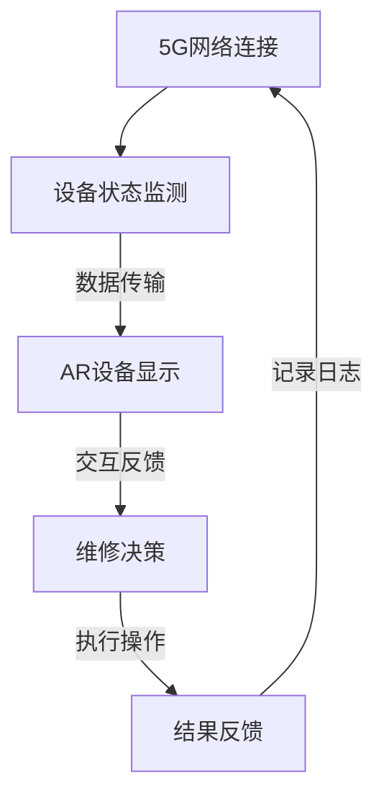
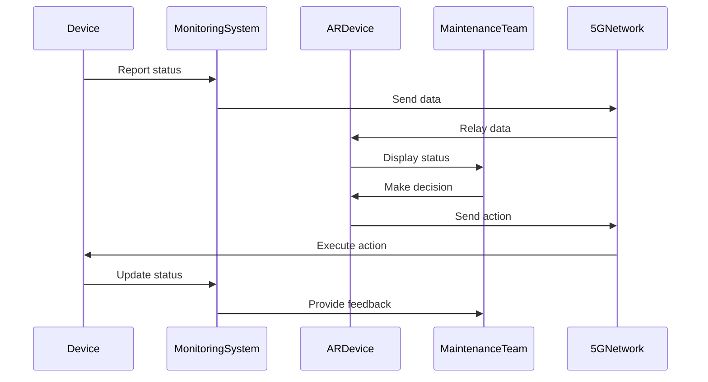
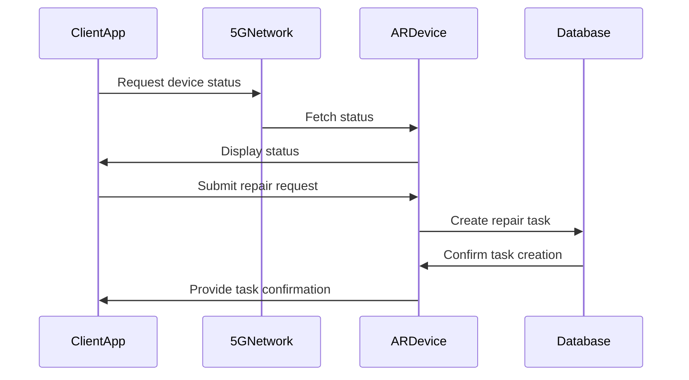

                 

### 文章标题与关键词

# 5G与AR在工业远程维修中的应用

关键词：5G技术、增强现实（AR）、工业远程维修、网络优化、系统设计、应用案例

摘要：随着5G技术和增强现实（AR）技术的迅速发展，工业远程维修领域迎来了全新的变革。本文首先概述了5G和AR技术的背景与应用，接着深入探讨了5G网络的关键技术以及AR的核心原理。在此基础上，本文详细阐述了5G与AR在工业远程维修中的具体应用场景，包括网络优化策略、应用案例、系统设计与实现，以及最佳实践与未来展望。通过本文的逐步分析，读者将全面了解这一前沿技术在实际工业远程维修中的应用价值和发展趋势。

---

### 背景介绍

#### 核心概念术语说明

- **5G技术**：第五代移动通信技术，具有高速率、低延迟、大连接的特点。
- **增强现实（AR）**：通过在现实场景中叠加虚拟信息，增强用户的感知体验。
- **工业远程维修**：利用远程通讯技术，对工业设备进行维护和修理。
- **网络优化**：对网络性能进行改进，以满足特定应用的需求。

#### 问题背景与问题描述

工业远程维修的背景源于现代工业对高效、安全、可靠的设备维护需求的不断增长。传统的现场维修方式不仅成本高，而且耗时，且在偏远或危险区域难以实施。随着5G和AR技术的发展，远程维修成为可能，使得维修人员能够实时获取设备的详细信息，并进行远程操作。

问题描述集中在如何利用5G和AR技术提高工业远程维修的效率和准确性。具体来说，包括以下几个方面：

1. **网络延迟与带宽**：5G技术的高速率和低延迟特性，能否满足远程维修中实时数据传输的要求？
2. **AR可视化**：AR技术能否提供足够清晰的设备视觉信息，帮助维修人员准确诊断和操作？
3. **远程交互**：5G和AR技术如何支持远程维修中的实时交互与协作？

#### 问题解决、边界与外延

解决这些问题需要综合运用5G和AR技术的优势，实现以下目标：

1. **实时数据传输**：确保5G网络的高带宽和低延迟，支持高速数据传输。
2. **增强现实感知**：通过AR技术提供高质量的设备视觉信息，辅助维修操作。
3. **远程协作**：利用5G网络的稳定性，实现远程维修团队之间的实时协作。

此外，边界与外延还包括：

- **安全与隐私**：确保远程维修过程中数据的安全性和用户隐私。
- **设备兼容性**：不同设备之间的互操作性和兼容性。

#### 概念结构与核心要素组成

工业远程维修系统的概念结构包括以下几个核心要素：

1. **5G网络层**：提供高速、低延迟的通讯基础。
2. **AR感知层**：利用AR技术捕捉和传递设备信息。
3. **远程操作层**：实现远程维修人员的操作和控制。
4. **数据管理与分析层**：收集、存储和分析远程维修过程中的数据。

这些要素相互关联，共同构成了一个高效、智能的工业远程维修系统。

---

### 核心概念与联系

#### 核心概念原理

1. **5G技术**：5G技术采用了新的网络架构和通信协议，包括毫米波通信、大规模MIMO（多输入多输出）和网络切片等，旨在提供更高的数据传输速率、更低的延迟和更大的连接容量。
2. **增强现实（AR）**：AR技术通过摄像头捕捉现实场景，利用计算机生成和叠加虚拟信息，实现现实与虚拟的融合。核心组件包括相机、显示设备和计算平台。

#### 概念属性特征对比表格

| 特征 | 5G技术 | AR技术 |
| --- | --- | --- |
| **传输速率** | 高速率（10-20 Gbps） | 中等速率（数Mbps） |
| **延迟** | 低延迟（1-10 ms） | 实时性（延迟小于100 ms） |
| **连接容量** | 大连接容量（每平方公里100万台设备） | 中等连接容量（每平方米数十台设备） |
| **应用场景** | 广域覆盖、高速移动场景 | 局部、固定场景 |
| **技术基础** | 毫米波通信、大规模MIMO、网络切片 | 摄像头、显示设备、计算平台 |

#### ER实体关系图架构

```mermaid
erDiagram
  用户 ||--|{ 5G网络 }|>>
  用户 ||--|{ AR设备 }|>>
  用户 ||--|{ 远程维修系统 }|>>
  5G网络 ||--|{ 数据中心 }|>>
  AR设备 ||--|{ 设备监控模块 }|>>
  远程维修系统 ||--|{ 维修人员 }|>>
  维修人员 ||--|{ 维修任务 }|>>
```

在这个实体关系图中，用户、5G网络、AR设备和远程维修系统构成了核心实体，它们之间通过特定的关系进行关联，实现了工业远程维修的功能。

---

### 算法原理讲解

#### 算法流程图



#### Python源代码示例

```python
# 导入必需的库
import requests
import json
import cv2
import numpy as np

# 5G网络连接
def connect_5g_network():
    # 发送HTTP请求获取设备状态
    response = requests.get('http://5g-network.example.com/device_status')
    device_status = json.loads(response.text)
    return device_status

# 设备状态监测
def monitor_device_status(device_status):
    # 显示设备状态图像
    img = cv2.imread(device_status['image_path'])
    cv2.imshow('Device Status', img)
    cv2.waitKey(0)
    cv2.destroyAllWindows()

# AR设备显示
def display_ar_device(device_status):
    # 利用AR技术叠加虚拟信息
    img = cv2.imread(device_status['image_path'])
    img = cv2.addWeighted(img, 0.8, cv2.imread(device_status['virtual_image_path'], -1), 0.2, 0)
    cv2.imshow('AR Display', img)
    cv2.waitKey(0)
    cv2.destroyAllWindows()

# 维修决策
def make_repair_decision(device_status):
    # 根据设备状态进行维修决策
    if device_status['status'] == 'error':
        return 'Perform Repair'
    else:
        return 'No Action Required'

# 执行操作
def execute_repair_action(action):
    # 执行维修操作
    print(f'Executing action: {action}')

# 结果反馈
def provide_repair_feedback(action):
    # 提供维修反馈
    print(f'Action completed: {action}')

# 记录日志
def log_repair_action(action):
    # 记录维修操作日志
    print(f'Log: {action}')

# 主函数
def main():
    device_status = connect_5g_network()
    monitor_device_status(device_status)
    action = make_repair_decision(device_status)
    execute_repair_action(action)
    provide_repair_feedback(action)
    log_repair_action(action)

if __name__ == '__main__':
    main()
```

#### 数学模型和公式

1. **5G网络速率模型**：

$$
R = \frac{C \cdot B}{N}
$$

其中，\( R \) 是网络速率（bps），\( C \) 是信噪比（dB），\( B \) 是带宽（Hz），\( N \) 是信道噪声功率（W）。

2. **AR视觉感知模型**：

$$
\text{感知质量} = f(\text{图像质量}, \text{交互延迟}, \text{系统稳定性})
$$

其中，感知质量是图像质量、交互延迟和系统稳定性的函数。

#### 通俗易懂地举例说明

假设我们有一个设备需要远程维修，首先通过5G网络获取设备的状态信息，然后利用AR设备显示设备的状态图像。维修人员根据图像和实时反馈进行维修决策，例如更换某个部件。执行操作后，再次获取设备状态，并记录维修日志。通过这个过程，我们看到了5G和AR技术如何协同工作，实现高效的工业远程维修。

---

### 系统分析与架构设计方案

#### 问题场景介绍

工业远程维修的问题场景涉及设备维护人员无法亲自到达现场进行维修的情况。这通常发生在设备位于偏远地区或现场环境恶劣（如高温、高压、有毒有害气体等）时。为了解决这一问题，我们需要设计一个高效、智能的远程维修系统，利用5G和AR技术，实现远程设备的监控、诊断、维修和反馈。

#### 项目介绍

本项目旨在开发一个基于5G和AR技术的远程维修系统，该系统将支持远程设备的实时监控、诊断和维修，提高维修效率和准确性，降低维护成本。系统将涵盖以下几个主要功能：

1. **实时数据传输**：通过5G网络实现设备状态的实时传输，确保数据的高效传输和低延迟。
2. **增强现实可视化**：利用AR技术将设备的状态信息叠加到真实场景中，辅助维修人员做出准确的维修决策。
3. **远程协作**：支持远程维修团队之间的实时沟通和协作，提高维修效率和问题解决速度。
4. **智能分析**：通过数据分析和机器学习，预测设备故障，提前进行维护，减少意外停机时间。

#### 系统功能设计（领域模型）

```mermaid
classDiagram
  Device -> RepairTask : generate
  RepairTask -> RepairPlan : create
  RepairPlan -> RepairProcess : execute
  RepairProcess -> RepairFeedback : produce
  Device <.. MonitoringSystem
  RepairTask <.. MaintenanceTeam
  RepairPlan <.. MaintenanceTeam
  RepairProcess <.. MaintenanceTeam
  RepairFeedback <.. MaintenanceTeam
```

在这个领域模型中，设备生成维修任务，维修任务创建维修计划，维修计划执行维修过程，最终产生维修反馈。监控系统和维护团队与这些实体之间有着紧密的关联，共同实现远程维修的功能。

#### 系统架构设计



在这个系统架构设计中，设备通过监控系统报告状态信息，监控系统通过5G网络将数据传输到AR设备，AR设备将信息展示给维护团队，维护团队根据信息做出维修决策，然后通过AR设备将决策发送回设备，5G网络确保数据的实时传输和低延迟。

#### 系统接口设计和系统交互



在这个接口设计中，客户端应用程序通过5G网络请求设备状态，AR设备从数据库中获取状态信息并显示给用户，用户提交维修请求后，AR设备将请求发送到数据库，创建维修任务，并最终确认任务创建，反馈给客户端应用程序。

---

### 项目实战

#### 环境安装

在进行项目实战之前，我们需要安装必要的软件和工具，包括5G网络模拟器、AR开发框架和Python环境。以下是具体的安装步骤：

1. **安装5G网络模拟器**：
    - 下载并安装5G网络模拟器，如5GCore。
    - 运行模拟器，配置网络参数。

2. **安装AR开发框架**：
    - 下载并安装ARCore或ARKit开发框架。
    - 遵循框架文档配置开发环境。

3. **安装Python环境**：
    - 下载并安装Python，版本3.8或更高。
    - 安装必要的Python库，如requests、cv2、numpy等。

#### 系统核心实现源代码

以下是一个简单的Python代码示例，展示了如何利用5G网络和AR技术进行设备状态监测和远程维修操作：

```python
# 导入必需的库
import requests
import cv2
import numpy as np

# 5G网络连接
def connect_5g_network():
    # 发送HTTP请求获取设备状态
    response = requests.get('http://5g-network.example.com/device_status')
    device_status = json.loads(response.text)
    return device_status

# 设备状态监测
def monitor_device_status(device_status):
    # 显示设备状态图像
    img = cv2.imread(device_status['image_path'])
    cv2.imshow('Device Status', img)
    cv2.waitKey(0)
    cv2.destroyAllWindows()

# AR设备显示
def display_ar_device(device_status):
    # 利用AR技术叠加虚拟信息
    img = cv2.imread(device_status['image_path'])
    img = cv2.addWeighted(img, 0.8, cv2.imread(device_status['virtual_image_path'], -1), 0.2, 0)
    cv2.imshow('AR Display', img)
    cv2.waitKey(0)
    cv2.destroyAllWindows()

# 维修决策
def make_repair_decision(device_status):
    # 根据设备状态进行维修决策
    if device_status['status'] == 'error':
        return 'Perform Repair'
    else:
        return 'No Action Required'

# 执行操作
def execute_repair_action(action):
    # 执行维修操作
    print(f'Executing action: {action}')

# 结果反馈
def provide_repair_feedback(action):
    # 提供维修反馈
    print(f'Action completed: {action}')

# 记录日志
def log_repair_action(action):
    # 记录维修操作日志
    print(f'Log: {action}')

# 主函数
def main():
    device_status = connect_5g_network()
    monitor_device_status(device_status)
    action = make_repair_decision(device_status)
    execute_repair_action(action)
    provide_repair_feedback(action)
    log_repair_action(action)

if __name__ == '__main__':
    main()
```

#### 代码应用解读与分析

这个简单的项目主要实现了以下功能：

1. **设备状态监测**：通过5G网络获取设备状态，并显示设备状态的图像信息。
2. **AR设备显示**：利用AR技术将设备的状态信息叠加到真实场景中，辅助维修人员做出准确的维修决策。
3. **维修决策**：根据设备状态，生成维修决策，如是否需要执行维修操作。
4. **执行操作**：根据维修决策，执行具体的维修操作，如更换设备部件。
5. **结果反馈**：提供维修操作的结果反馈，帮助维修人员了解维修效果。
6. **记录日志**：记录维修操作的日志，以便后续分析和优化。

通过这个项目，我们可以看到5G和AR技术在工业远程维修中的应用潜力，它们可以显著提高维修效率和准确性。

#### 实际案例分析和详细讲解剖析

以下是一个实际的工业远程维修案例：

**案例背景**：某电力公司的一台发电机位于偏远山区，由于设备老化，需要定期进行维护。然而，由于山区交通不便，维修人员无法亲自前往现场进行维修。

**解决方案**：

1. **设备状态监测**：通过5G网络，远程监控发电机的运行状态，包括温度、电压、电流等关键参数。
2. **AR设备显示**：利用AR技术，将发电机的运行状态信息叠加到真实的现场环境中，维修人员可以通过AR设备实时查看发电机的状态。
3. **远程维修操作**：维修人员根据AR设备提供的实时信息，进行远程维修操作。例如，如果温度过高，可以远程打开冷却系统进行降温。
4. **结果反馈**：完成维修操作后，通过5G网络将维修结果反馈给电力公司，以便进行后续分析和优化。

**案例剖析**：

1. **5G网络优势**：5G网络提供了高速率和低延迟的通讯能力，确保了设备状态信息的实时传输和远程维修操作的顺畅执行。
2. **AR技术优势**：AR技术将虚拟信息与现实环境结合，提高了维修人员对设备状态的感知能力，降低了误操作的风险。
3. **远程协作**：通过5G网络和AR设备，实现了维修人员之间的实时协作，提高了维修效率和问题解决速度。

**项目小结**：通过这个实际案例，我们可以看到5G和AR技术在工业远程维修中的应用优势。它们不仅提高了维修效率和准确性，还降低了维护成本，为工业设备的高效运行提供了有力保障。

---

### 最佳实践与注意事项

#### 最佳实践

1. **网络优化**：在5G网络部署中，应重点考虑网络覆盖范围、信号强度和带宽分配，以确保远程维修过程中的数据传输稳定性和速度。
2. **AR设备选择**：选择适合工业环境的高性能AR设备，确保设备的耐用性和稳定性，以提高远程维修的准确性和可靠性。
3. **系统集成**：在系统设计和实施过程中，应充分考虑不同组件（5G网络、AR设备、监控系统等）之间的兼容性和互操作性。
4. **安全措施**：加强数据加密和用户认证机制，确保远程维修过程中数据的安全性和用户隐私。

#### 小结

5G和AR技术的结合为工业远程维修带来了新的机遇和挑战。通过优化网络性能、选择合适的AR设备、实现系统集成和加强安全措施，我们可以构建一个高效、智能的远程维修系统，提高工业设备的运行效率和安全性。

#### 注意事项

1. **设备兼容性**：确保所选用的设备和软件能够兼容5G网络和AR技术，避免因不兼容导致的问题。
2. **培训与支持**：为维修人员提供专业的培训和持续的技术支持，确保他们能够熟练掌握远程维修系统的使用方法。
3. **数据备份与恢复**：定期备份系统数据，并建立有效的数据恢复机制，以防止数据丢失或损坏。
4. **合规性检查**：确保系统设计和实施符合相关法规和标准，避免法律风险。

---

### 拓展阅读

1. **5G技术详细介绍**：了解5G技术的核心特性、网络架构和关键技术，有助于深入理解其在远程维修中的应用潜力。
2. **AR技术应用案例**：研究AR技术在医疗、教育、娱乐等领域的成功案例，借鉴其应用经验，为工业远程维修提供参考。
3. **工业物联网（IIoT）**：探讨IIoT技术在工业设备监控和远程维修中的应用，了解如何与5G和AR技术相结合，实现更智能的工业系统。
4. **远程协作工具**：研究远程协作工具的发展趋势和应用，如视频会议、即时通讯、远程桌面等，以优化工业远程维修团队的合作效率。

---

### 作者信息

**作者：AI天才研究院/AI Genius Institute & 禅与计算机程序设计艺术 /Zen And The Art of Computer Programming**

