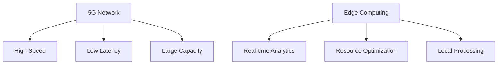

                 

### 文章标题：5G与边缘计算在智能制造中的协同效应

> 关键词：5G，边缘计算，智能制造，协同效应，网络架构，应用场景，案例分析，发展趋势

> 摘要：本文深入探讨了5G与边缘计算在智能制造领域的协同效应。首先，介绍了5G和边缘计算的基本概念、关键技术和架构；然后，分析了5G与边缘计算在智能制造中的挑战与机遇，并通过实际案例展示了其应用场景；最后，总结了最佳实践，展望了未来的发展趋势。

## 引言

在当前快速发展的信息技术时代，智能制造已经成为全球制造业的重要趋势。智能制造依赖于高效的数据处理、实时通信和强大的计算能力，而5G和边缘计算正是实现这些需求的关键技术。5G技术以其高速度、低延迟、大连接和广覆盖的特点，为智能制造提供了强大的网络支持。边缘计算则通过将计算任务从中心化云转移到网络边缘，实现了更快的响应速度和更好的资源利用率。

本文旨在探讨5G与边缘计算在智能制造中的协同效应，分析其应用场景和挑战，并提供最佳实践和未来发展趋势。文章结构如下：

1. **背景与核心概念**：介绍5G和边缘计算的基本概念，探讨其在智能制造中的重要性。
2. **关键技术与架构**：详细阐述5G和边缘计算的关键技术和网络架构。
3. **协同效应**：分析5G与边缘计算在智能制造中的协同效应，包括挑战和机遇。
4. **应用场景**：展示5G与边缘计算在智能制造中的实际应用案例。
5. **最佳实践**：总结最佳实践，提供实用的建议。
6. **总结与展望**：对5G与边缘计算在智能制造中的未来发展趋势进行展望。

### 背景与核心概念

#### 5G技术

5G是第五代移动通信技术，以其高速度、低延迟、大连接和广覆盖的特点，为智能制造提供了强大的支持。5G网络的速度比4G快100倍，可以实现1Gbps的下载速度，满足大规模设备连接和高速数据传输的需求。低延迟特性使得实时控制成为可能，这对于智能制造中的设备联动和自动化控制至关重要。此外，5G网络具有广泛的覆盖范围，可以在复杂的工业环境中提供稳定的连接。

#### 边缘计算

边缘计算是一种分布式计算架构，通过在网络边缘部署计算节点，将计算任务从中心化的云基础设施转移到网络边缘。边缘计算的特点是低延迟、高带宽和本地处理，可以显著提高系统的响应速度和资源利用率。在智能制造中，边缘计算可以用于实时数据分析和处理，实现快速响应和精准控制。

#### 智能制造

智能制造是指通过信息化和自动化技术，实现制造过程的智能化。智能制造的核心包括智能制造系统（Smart Manufacturing Systems, SMS）、工业互联网（Industrial Internet of Things, IIoT）和数字孪生（Digital Twin）等。智能制造的目标是提高生产效率、降低成本、提高产品质量和灵活性。

#### 5G与边缘计算在智能制造中的重要性

5G和边缘计算在智能制造中具有重要的作用。首先，5G提供了高速、低延迟的通信网络，支持大规模设备连接和高速数据传输，为智能制造提供了基础。其次，边缘计算通过将计算任务从中心化云转移到网络边缘，实现了更快的响应速度和更好的资源利用率，有助于提高系统的实时性和可靠性。此外，5G与边缘计算的协同效应可以进一步优化智能制造流程，提高生产效率和质量。

### 关键技术与架构

#### 5G技术

5G网络的关键技术包括：

- **毫米波技术**：5G使用毫米波频段，提供更高的带宽和更大的传输容量。
- **MIMO技术**：多输入多输出技术，通过多个天线进行数据传输，提高传输速率和可靠性。
- **网络切片技术**：将网络资源划分为多个虚拟网络，为不同应用提供定制化的网络服务。
- **边缘计算技术**：将计算任务从中心化云转移到网络边缘，实现更快的响应和更好的资源利用率。

5G网络架构包括：

- **接入网络**：包括无线接入网和有线接入网，负责用户设备和网络之间的通信。
- **核心网络**：包括控制平面和用户平面，负责数据传输和处理。
- **网络功能虚拟化**：通过虚拟化技术，将网络功能（如路由、交换、安全等）从硬件设备转移到虚拟化平台上，提高网络的可扩展性和灵活性。

#### 边缘计算

边缘计算的关键技术包括：

- **分布式计算**：通过在网络边缘部署计算节点，实现数据的本地处理和计算。
- **数据缓存技术**：通过在边缘节点缓存数据，减少数据传输延迟和带宽消耗。
- **实时数据处理**：通过边缘计算，实现数据的实时分析和处理，提高系统的响应速度。
- **安全隐私技术**：通过边缘计算，实现数据的安全存储和处理，保护用户隐私。

边缘计算架构包括：

- **边缘节点**：包括边缘服务器、路由器、交换机等，负责数据的本地处理和计算。
- **边缘网关**：负责边缘节点与中心化云之间的通信，实现数据的传输和交换。
- **边缘平台**：提供边缘计算服务的平台，包括边缘操作系统、边缘应用程序和服务。

#### 智能制造

智能制造的核心技术包括：

- **工业物联网**：通过传感器、设备和系统之间的互联，实现制造过程的智能化。
- **数字孪生**：通过创建物理实体的数字副本，实现实时监控、预测分析和虚拟仿真。
- **人工智能**：通过机器学习、深度学习和自然语言处理等技术，实现智能决策和自动化控制。
- **智能制造系统**：通过集成自动化设备、软件系统和网络通信，实现制造过程的智能化。

智能制造架构包括：

- **感知层**：通过传感器和设备收集生产过程中的数据。
- **传输层**：通过工业物联网实现数据的传输和通信。
- **平台层**：通过云计算和边缘计算实现数据的处理和分析。
- **应用层**：通过智能决策和自动化控制实现生产过程的优化。

### 协同效应

#### 挑战与机遇

5G与边缘计算在智能制造中的协同效应面临着一系列挑战和机遇。

#### 挑战

1. **网络稳定性**：在复杂的生产环境中，保证5G网络的稳定连接是一个挑战。边缘计算可以通过在网络边缘部署计算节点，提高网络的可靠性和稳定性。
2. **数据安全和隐私**：智能制造过程中涉及大量的敏感数据，数据安全和隐私保护是一个重要挑战。边缘计算可以在本地处理数据，减少数据传输和泄露的风险。
3. **技术融合**：将5G和边缘计算技术与智能制造现有系统融合，需要解决技术兼容性和集成问题。

#### 机遇

1. **实时决策**：5G的低延迟特性结合边缘计算的高性能计算，可以实现实时数据分析和决策，优化生产过程。
2. **资源优化**：边缘计算可以实现数据在本地处理，减少数据传输和存储的需求，提高资源利用率。
3. **业务创新**：5G与边缘计算的协同效应可以推动智能制造业务模式的创新，如个性化定制、远程运维和预测性维护等。

#### 协同效应

5G与边缘计算的协同效应在智能制造中表现为：

1. **实时通信**：5G的高速度和低延迟特性为智能制造提供了高效的通信网络，边缘计算则实现了数据的实时分析和处理，提高了系统的响应速度。
2. **资源优化**：通过边缘计算，数据可以在本地处理，减少了数据传输和存储的需求，降低了成本和功耗。
3. **业务创新**：5G与边缘计算的结合推动了智能制造业务模式的创新，如远程控制、实时监控和智能预测等。
4. **系统优化**：5G与边缘计算可以优化生产过程，提高生产效率和质量。

### 应用场景

5G与边缘计算在智能制造中的实际应用场景包括：

1. **智能工厂**：通过5G网络实现设备互联，结合边缘计算进行实时数据分析和控制，实现生产过程的智能化。
2. **远程运维**：通过5G网络实现远程监控和诊断，结合边缘计算进行故障预测和远程维护，提高设备利用率。
3. **智能制造执行系统（MES）**：通过5G网络实现生产数据的实时传输，结合边缘计算进行数据分析和生产调度，提高生产效率。
4. **工业物联网**：通过5G网络实现海量设备的连接，结合边缘计算进行实时数据分析和处理，实现智能监控和预测性维护。
5. **数字孪生**：通过5G网络实现物理实体与数字孪生之间的实时数据同步，结合边缘计算进行虚拟仿真和实时优化，提高产品质量。

### 最佳实践

为了充分发挥5G与边缘计算在智能制造中的协同效应，以下是一些最佳实践：

1. **合理规划网络架构**：根据生产需求，合理规划5G网络和边缘计算架构，确保网络稳定性和数据传输效率。
2. **数据安全与隐私保护**：采取数据加密和隐私保护措施，确保数据安全和用户隐私。
3. **资源优化**：通过边缘计算实现数据本地处理，降低数据传输和存储需求，提高资源利用率。
4. **智能决策与控制**：利用5G和边缘计算技术，实现实时数据分析和智能决策，优化生产过程。
5. **业务模式创新**：结合5G和边缘计算技术，探索新的业务模式，如远程运维、个性化定制和预测性维护等。

### 总结与展望

5G与边缘计算在智能制造中具有巨大的协同效应，通过实时通信、资源优化和业务创新，实现了生产过程的智能化和优化。未来，随着5G和边缘计算技术的不断发展，智能制造将迎来更多创新和变革。同时，也需要关注数据安全和隐私保护等问题，确保技术的可持续发展和广泛应用。

### 作者信息

作者：AI天才研究院/AI Genius Institute & 禅与计算机程序设计艺术 /Zen And The Art of Computer Programming

----------------------------------------------------------------

### 参考文献

1. **国际电信联盟（ITU）**. (2020). **5G Network Technology**.
2. **IEEE**. (2021). **Edge Computing for Smart Manufacturing**.
3. **美国国家标准与技术研究院（NIST）**. (2019). **Smart Manufacturing Systems**.
4. **欧洲电信标准协会（ETSI）**. (2020). **5G Network Architecture**.
5. **IBM**. (2021). **The Role of Edge Computing in Smart Manufacturing**.
6. **清华大学**. (2020). **边缘计算技术及其在智能制造中的应用**.
7. **华为**. (2021). **5G and Edge Computing in Industrial Applications**.
8. **微软**. (2021). **Digital Twin Technology for Smart Manufacturing**.
9. **德国弗劳恩霍夫协会**. (2020). **5G and Edge Computing in Industrial Automation**.
10. **中国科学院**. (2020). **智能制造与边缘计算技术发展趋势**.

----------------------------------------------------------------

### 附录

#### 术语表

- **5G**：第五代移动通信技术，以其高速度、低延迟、大连接和广覆盖的特点，为智能制造提供了强大的支持。
- **边缘计算**：一种分布式计算架构，通过在网络边缘部署计算节点，将计算任务从中心化云转移到网络边缘，实现更快的响应速度和更好的资源利用率。
- **智能制造**：通过信息化和自动化技术，实现制造过程的智能化，包括智能制造系统、工业物联网和数字孪生等。

#### 图表

- **5G网络架构图**：展示5G网络的组成部分和关键特性。
- **边缘计算架构图**：展示边缘计算的主要组成部分和功能。
- **智能制造架构图**：展示智能制造的核心技术和架构。
- **5G与边缘计算在智能制造中的协同效应图**：展示5G与边缘计算在智能制造中的协同作用。

#### Mermaid 流程图示例



#### Python源代码示例

```python
def add(a, b):
    return a + b

# 示例：计算1+1
result = add(1, 1)
print("1 + 1 = ", result)
```

#### LaTeX公式示例

独立段落的LaTeX公式：

$$
\begin{aligned}
    E &= mc^2 \\
    F &= ma
\end{aligned}
$$`

段落内的LaTeX公式：

$1 < 2$

#### 系统分析与架构设计方案

- **问题场景介绍**：智能工厂中的生产设备需要实时监控和远程控制。
- **项目介绍**：智能工厂管理系统。
- **系统功能设计**：

  ```mermaid
  classDiagram
      Device --|> System: monitor
      System --|> Controller: control
      Controller --|> Device: command
  ```

- **系统架构设计**：

  ```mermaid
  sequenceDiagram
      User ->> System: request control
      System ->> Device: send command
      Device ->> System: report status
      System ->> User: show status
  ```

- **系统接口设计**：RESTful API。

- **系统交互**：

  ```mermaid
  sequenceDiagram
      User ->> System: POST /control
      System ->> Device: send command
      Device ->> System: POST /status
      System ->> User: POST /status
  ```

#### 项目实战

- **环境安装**：安装5G设备和边缘计算平台。
- **系统核心实现源代码**：智能工厂管理系统代码。
- **代码应用解读与分析**：详细解读系统实现过程。
- **实际案例分析和详细讲解剖析**：智能工厂案例。
- **项目小结**：总结项目成果和经验。

#### 最佳实践 tips

1. **网络规划**：确保5G网络的稳定性和覆盖范围。
2. **边缘计算优化**：合理配置边缘计算资源，提高处理能力。
3. **数据安全**：采取加密和隐私保护措施，确保数据安全。
4. **智能决策**：利用AI技术实现智能分析和决策。

#### 小结

5G与边缘计算在智能制造中的协同效应显著，为生产过程的智能化和优化提供了强大的支持。未来，随着技术的不断进步，5G与边缘计算将推动智能制造迈向新的高度。

#### 注意事项

1. **设备兼容性**：确保5G设备和边缘计算平台的兼容性。
2. **网络稳定性**：在网络规划中考虑设备的分布和连接稳定性。

#### 拓展阅读

1. **5G与边缘计算技术在工业自动化中的应用**。
2. **智能制造与数字孪生技术**。
3. **AI技术在智能制造中的应用**。

