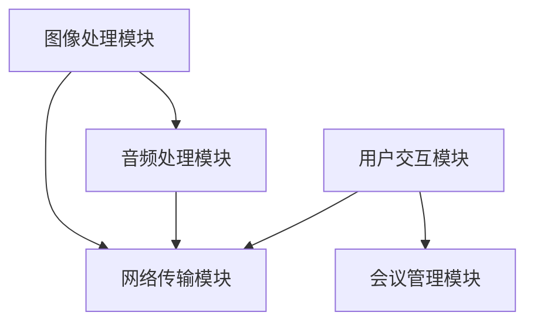
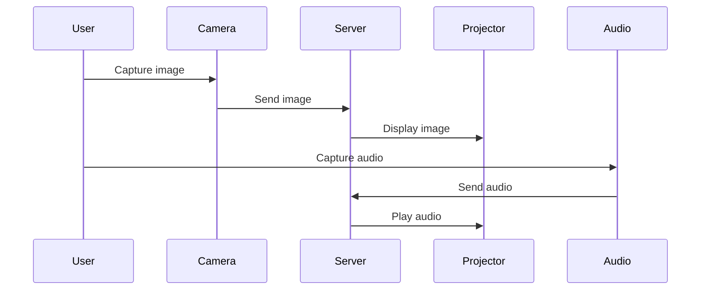

                 

### 文章标题：6G在全息会议中的应用前景：实现真实的远程会议体验

### 关键词：6G、全息会议、远程会议、网络传输、高带宽、低延迟

### 摘要：
随着通信技术的不断发展，6G网络将引领全息会议进入一个全新的时代。本文首先介绍了6G技术的基础概念及其主要特性，包括高速与低延迟、大带宽和广泛连接。随后，我们探讨了全息会议的基本概念和原理，阐述了全息成像、3D音频和网络传输技术在全息会议中的重要性。接着，文章详细分析了6G技术在这些领域的具体应用，并通过实际案例展示了其带来的变革。最后，文章讨论了全息会议系统的设计、实现以及未来可能面临的挑战和机遇。通过这一系列的探讨，我们旨在展望6G在全息会议领域的广阔应用前景，为实现真实的远程会议体验提供可能。

## 第一部分：6G技术基础

### 第1章：6G技术的背景与概述

#### 1.1 6G技术的基本概念

6G（第六代移动通信技术）是继5G之后下一代移动通信技术的重要发展。6G的目标是在5G的基础上实现更高的数据传输速度、更低的延迟和更广泛的连接范围。6G技术的愿景包括实现全球覆盖的无线通信网络，提供超高速的数据传输，支持各种新兴应用场景，如全息会议、自动驾驶、远程医疗等。

#### 1.1.1 6G的定义

6G不仅仅是一个简单的技术升级，而是一个全新的通信体系。与5G相比，6G在频谱利用效率、网络容量、能效和可靠性等方面都有显著提升。具体来说，6G将具备更高的频谱利用率，能够更好地处理高密度用户和设备接入，同时实现更高效的数据传输。

#### 1.1.2 6G技术的核心目标

6G的核心目标包括以下几个方面：

- **超高速传输**：6G的目标是将峰值数据传输速率提升到1Tbps，远超过5G的10Gbps。
- **低延迟**：6G的延迟将降低到1毫秒以内，极大地提升实时交互的应用性能。
- **广泛连接**：6G将支持每平方公里百万级设备连接，实现物联网的广泛应用。
- **智能化网络**：6G将引入人工智能技术，实现网络自我优化和智能调度。

#### 1.1.3 6G与5G的主要区别

6G与5G相比，具有以下几个显著区别：

- **数据传输速率**：6G的数据传输速率目标是1Tbps，而5G的目标是10Gbps。
- **延迟**：6G的延迟目标是1毫秒，而5G的延迟目标是10毫秒。
- **频谱范围**：6G将使用更高的频段，如太赫兹频段，而5G主要使用毫米波频段。
- **连接密度**：6G将支持每平方公里百万级设备连接，而5G的目标是每平方公里10万个设备。
- **智能化**：6G将更加依赖人工智能技术，实现网络的智能化管理和优化。

#### 1.2 6G技术的主要特性

6G技术的主要特性可以从以下几个方面进行概述：

- **高速与低延迟**：6G将通过使用更高的频谱、更先进的天线技术和更智能的网络架构来实现超高速数据传输和极低延迟。
- **大带宽**：6G将提供比5G更大的带宽，支持大规模数据传输，满足各种高带宽需求的应用。
- **广泛连接**：6G将支持大规模设备连接，实现真正的万物互联。
- **丰富的应用场景**：6G将支持各种新兴应用，如全息通信、增强现实、自动驾驶和远程医疗等。

#### 1.3 6G技术的研究现状与发展趋势

目前，全球范围内多个国家和地区都在积极开展6G技术的研究和开发。一些领先的研究机构和技术公司已经提出了各自的6G愿景和关键技术路线图。

- **研究进展**：在研究方面，6G的关键技术包括太赫兹通信、量子通信、新型天线设计和网络智能化等。目前，这些技术的研究已取得一定进展，但仍面临诸多挑战。
- **发展趋势**：从发展趋势来看，6G将更加注重智能化的网络架构和高效的频谱利用。未来，6G网络将实现全面的智能化，能够根据用户需求和网络状态自动调整资源分配，提供最佳的服务质量。

#### 1.3.1 全球6G研究进展

全球范围内，6G研究进展主要集中在以下几个方面：

- **美国**：美国在6G研究方面处于领先地位，多个大学和研究机构正在进行6G的关键技术研究和原型开发。美国电信运营商和设备制造商也在积极参与6G标准的制定。
- **欧洲**：欧洲在6G研究方面也取得了显著进展，多个国家和机构联合开展了6G技术研发项目。欧盟委员会还推出了一系列政策，支持6G技术的发展。
- **中国**：中国在6G研究方面同样取得了一定的成果。中国的科技企业和研究机构正在积极开展6G技术的研究，并参与了全球6G标准的制定。

#### 1.3.2 中国在6G技术方面的布局

中国在6G技术方面的布局主要包括以下几个方面：

- **政策支持**：中国政府高度重视6G技术的发展，出台了一系列政策，支持6G技术研发和产业创新。
- **技术研发**：中国的科技企业和研究机构正在积极开展6G关键技术的研发，包括太赫兹通信、新型天线设计和网络智能化等。
- **标准制定**：中国在6G标准制定方面也取得了积极进展，积极参与全球6G标准的制定工作。

#### 1.3.3 6G技术面临的挑战与机遇

6G技术面临的挑战主要包括以下几个方面：

- **频谱资源**：6G需要使用更高频的频谱，但高频谱资源有限，如何高效利用频谱资源是一个重要挑战。
- **技术成熟度**：6G技术仍处于研发阶段，许多关键技术尚未完全成熟，需要进一步研究和开发。
- **产业协同**：6G技术的实现需要产业链上下游企业的紧密合作，如何协调各方利益，推动6G技术的发展是一个挑战。

然而，6G技术也带来了巨大的机遇：

- **经济发展**：6G将推动数字经济的发展，为各行业带来新的增长点。
- **社会变革**：6G将支持各种新兴应用，如智能交通、智慧城市和远程医疗等，带来社会生产生活方式的变革。
- **国际竞争**：在全球6G技术竞争中，谁能够率先实现6G技术，谁就有可能在未来的全球通信市场中占据有利地位。

### 第2章：全息会议的概念与原理

#### 2.1 全息会议的基本概念

全息会议是一种利用全息成像技术实现的远程会议形式。它能够将远程参与者的声音、图像和动作以三维形式实时呈现，使参与者能够如同面对面交流一般。与传统远程会议相比，全息会议提供更真实、互动性更强的会议体验。

#### 2.1.1 什么是全息会议

全息会议是基于全息成像技术实现的远程会议形式。它通过捕捉参与者的三维图像和动作，并将其以全息图像的形式传输到会议现场，使参与者能够在三维空间中相互交流和互动。

#### 2.1.2 全息会议与传统远程会议的区别

与传统远程会议相比，全息会议具有以下几个显著区别：

- **视觉效果**：全息会议提供三维立体图像，使参与者能够如同面对面交流，而传统远程会议通常仅限于二维图像。
- **互动性**：全息会议支持参与者进行真实的互动，如肢体动作和表情，而传统远程会议通常仅限于文字和语音交流。
- **沉浸感**：全息会议能够提供更强的沉浸感，使参与者更加投入到会议中，而传统远程会议则可能因为缺乏沉浸感而影响参与者的专注度。

#### 2.2 全息会议的技术原理

全息会议的技术原理主要包括全息成像技术、3D音频技术和网络传输技术。这些技术共同作用，实现了全息会议的实时、三维互动效果。

#### 2.2.1 光学原理

全息成像技术基于光学原理，通过记录和再现光波的干涉和衍射现象，实现三维图像的捕捉和呈现。全息成像技术包括全息相机、全息投影仪和全息显示屏等设备。

#### 2.2.2 数字信号处理

数字信号处理技术在全息会议中用于处理和传输三维图像和音频信号。它包括图像压缩、图像增强、噪声过滤和误差校正等过程，确保图像和音频的高质量和实时传输。

#### 2.2.3 人工智能技术

人工智能技术在全息会议中主要用于图像和音频的处理和分析。例如，通过面部识别和姿态识别技术，系统可以识别参与者的面部表情和动作，并实时调整全息图像的显示效果，提高会议的互动性和沉浸感。

#### 2.3 全息会议的关键技术

全息会议的关键技术包括全息成像技术、3D音频技术和网络传输技术。这些技术的有机结合，使全息会议能够提供真实、互动性强的远程会议体验。

#### 2.3.1 全息成像技术

全息成像技术是全息会议的核心技术。它通过捕捉参与者的三维图像，并利用光学原理将图像再现为三维立体图像。全息成像技术主要包括全息相机和全息投影仪。

- **全息相机**：全息相机是一种能够记录和捕捉三维图像的设备。它通过激光或其他光源照射参与者，并记录光波的干涉和衍射现象，生成全息图像。
- **全息投影仪**：全息投影仪是一种能够将全息图像投影到三维空间的设备。它通过调整投影角度和亮度，实现三维图像的再现。

#### 2.3.2 3D音频技术

3D音频技术是全息会议的重要组成部分，它通过模拟真实环境中的声音传播路径，实现三维音效的呈现。3D音频技术主要包括3D声源定位和音频增强技术。

- **3D声源定位**：3D声源定位技术通过分析声音信号的空间特性，实现声音来源的三维定位。它使参与者能够在会议中感受到真实的声音方向和距离。
- **音频增强**：音频增强技术通过噪声过滤、音质增强和音效处理，提高音频信号的质量和清晰度，使参与者能够更清晰地听到对方的声音。

#### 2.3.3 网络传输技术

网络传输技术是全息会议实现实时互动的基础。它通过高效的数据传输和处理，确保三维图像和音频信号的高质量传输。网络传输技术主要包括宽带传输和低延迟传输技术。

- **宽带传输**：宽带传输技术通过提高数据传输带宽，实现大规模数据的高速传输。它使全息会议能够传输高质量的三维图像和音频信号。
- **低延迟传输**：低延迟传输技术通过优化数据传输路径和协议，降低数据传输的延迟。它使全息会议能够实现实时互动，提高会议的互动性和沉浸感。

#### 2.4 全息会议的应用前景

全息会议技术具有广泛的应用前景，将在多个领域带来变革。以下是全息会议的几个主要应用场景：

- **商业会议**：全息会议将使商业会议更加高效和便捷，使参与者能够随时随地参与会议，提高会议的参与度和效率。
- **教育培训**：全息会议技术将使教育培训更加生动和互动，提高学生的参与度和学习效果，实现远程教育的突破。
- **医疗健康**：全息会议技术将使远程医疗成为现实，医生和患者可以通过全息会议进行实时交流和诊断，提高医疗服务的质量和效率。
- **娱乐与艺术**：全息会议技术将带来全新的娱乐和艺术体验，如虚拟演唱会、全息展览和互动游戏等。

### 第3章：6G技术在全息会议中的应用

#### 3.1 6G技术在全息成像中的应用

6G技术在全息成像中的应用将极大地提升全息会议的图像质量和交互体验。以下是6G技术在全息成像中的具体应用：

- **超高分辨率成像**：6G技术的高带宽和低延迟特性使得超高分辨率成像成为可能。通过6G网络传输，全息会议中的三维图像可以具有更高的分辨率，使参与者能够清晰地看到每一个细节。
- **实时动态捕捉**：6G技术的低延迟特性使得实时动态捕捉成为现实。全息会议中的参与者可以进行实时的肢体动作和表情捕捉，使会议更加生动和互动。
- **虚拟与现实的融合**：6G技术的高带宽和低延迟特性使得虚拟与现实的融合成为可能。通过6G网络传输，全息会议中的三维图像可以与现实环境进行融合，使参与者能够感受到身临其境的体验。

#### 3.2 6G技术在3D音频中的应用

6G技术在3D音频中的应用将极大地提升全息会议的音效质量，提供更真实的听觉体验。以下是6G技术在3D音频中的具体应用：

- **精确的空间定位**：6G技术的高带宽和低延迟特性使得3D音频的空间定位更加精确。通过6G网络传输，全息会议中的声音可以准确地定位在三维空间中的特定位置，使参与者能够感受到真实的声音方向和距离。
- **高保真的音质**：6G技术的高带宽特性使得音频信号可以保持高保真，通过6G网络传输，全息会议中的声音可以具有更高的音质，使参与者能够清晰地听到每一个细节。
- **多样化的音效体验**：6G技术的高带宽和低延迟特性使得多样化的音效体验成为可能。通过6G网络传输，全息会议中的声音可以支持多种音效处理，如回声消除、音量均衡和音效增强，提供更丰富的听觉体验。

#### 3.3 6G技术在网络传输中的应用

6G技术在网络传输中的应用将极大地提升全息会议的传输效率和稳定性，确保高质量的会议体验。以下是6G技术在网络传输中的具体应用：

- **大数据量的实时传输**：6G技术的高带宽特性使得大数据量的实时传输成为可能。通过6G网络传输，全息会议中的三维图像和音频信号可以高效地传输，确保会议的实时性和流畅性。
- **网络延迟的显著降低**：6G技术的低延迟特性使得网络延迟显著降低。通过6G网络传输，全息会议中的数据传输延迟可以降低到1毫秒以内，确保会议的实时互动和高效沟通。
- **网络可靠性的提高**：6G技术的网络架构优化和智能化调度技术使得网络可靠性显著提高。通过6G网络传输，全息会议的数据传输可以保持高稳定性，减少数据丢失和传输中断。

### 第4章：6G技术在全息会议系统中的应用

#### 4.1 6G技术在全息会议系统中的关键作用

6G技术在全息会议系统中发挥着关键作用，为会议的实时性和互动性提供了坚实的技术支持。以下是6G技术在全息会议系统中的关键作用：

- **数据传输速度的提升**：6G技术的高带宽特性使得全息会议系统中的数据传输速度显著提升。这保证了三维图像和音频信号的高质量传输，使参与者能够清晰地看到和听到会议内容。
- **延迟的降低**：6G技术的低延迟特性使得全息会议系统的延迟降低到1毫秒以内。这使得会议的实时互动成为可能，参与者能够实时回应，提高会议的效率和互动性。
- **连接数的增加**：6G技术的广泛连接特性使得全息会议系统可以支持更多的参与者。这使得大规模会议的召开成为可能，参与者可以在全球范围内参与会议，实现真正的全球化会议。

#### 4.2 6G技术在全息会议系统中的关键技术

6G技术在全息会议系统中涉及多个关键技术，包括网络切片技术、超宽带传输技术和边缘计算技术。这些技术共同作用，确保全息会议系统的高效运行和高质量体验。以下是6G技术在全息会议系统中的关键技术：

- **网络切片技术**：网络切片技术是6G网络的核心技术之一，它可以将网络资源划分为多个虚拟网络，为不同应用场景提供定制化的网络服务。在全息会议系统中，网络切片技术可以根据会议的需求动态调整网络资源，确保会议的高带宽和低延迟。
- **超宽带传输技术**：超宽带传输技术是6G技术的关键特性之一，它提供了比5G更高的传输带宽。在全息会议系统中，超宽带传输技术使得三维图像和音频信号可以高效地传输，确保会议的流畅性和互动性。
- **边缘计算技术**：边缘计算技术是6G网络的重要组成部分，它将计算任务从中心化网络迁移到网络边缘，降低了数据传输的延迟。在全息会议系统中，边缘计算技术可以处理会议中的实时数据处理任务，如图像和音频的处理和传输，提高了会议的实时性和互动性。

#### 4.3 6G技术在全息会议系统中的应用案例

6G技术在全息会议系统中的应用已经展示了其巨大的潜力，以下是一些具体的应用案例：

- **虚拟现实会议**：通过6G技术，全息会议系统能够实现虚拟现实会议。参与者可以通过全息投影和3D音频技术，感受到身临其境的会议体验，实现高效、互动的远程沟通。
- **远程手术**：6G技术使得远程手术成为可能。医生可以通过全息会议系统与远程的患者和医疗团队进行实时交流和操作，实现精准的远程医疗手术，提高医疗服务的质量和效率。
- **教育直播**：通过6G技术，全息会议系统可以支持高质量的教育直播。学生可以通过全息投影和3D音频技术，感受到真实的课堂环境，实现远程教育的突破。
- **虚拟演唱会**：6G技术使得虚拟演唱会成为可能。观众可以通过全息投影和3D音频技术，感受到真实的演唱会现场，实现沉浸式的娱乐体验。

### 第5章：全息会议系统的实际应用与挑战

#### 5.1 全息会议系统的实际应用

全息会议系统已经在多个领域取得了实际应用，展示了其广泛的应用前景。以下是全息会议系统的几个实际应用场景：

- **商业会议**：全息会议系统在商业会议中得到了广泛应用。公司可以通过全息会议系统召开远程会议，节省差旅费用，提高会议效率。同时，全息会议系统提供真实、互动的会议体验，使会议更加生动和高效。
- **教育培训**：全息会议系统在教育领域具有巨大的潜力。学校可以通过全息会议系统进行远程教学，使学生在虚拟课堂中感受到真实的教学场景，提高学习效果。同时，全息会议系统还可以支持在线教育平台，提供高质量的在线课程。
- **医疗健康**：全息会议系统在医疗健康领域得到了广泛应用。医院可以通过全息会议系统召开远程病例讨论会，使医生和专家能够实时交流，提高诊断和治疗水平。同时，全息会议系统还可以支持远程手术，使医生能够远程为患者进行手术操作。
- **政府事务**：全息会议系统在政府事务中也具有广泛的应用。政府部门可以通过全息会议系统召开远程会议，提高行政效率和决策水平。同时，全息会议系统还可以支持政府与公众的互动，提高政府服务的透明度和参与度。

#### 5.2 全息会议系统的挑战

尽管全息会议系统展示了巨大的应用潜力，但其在实际应用中也面临着一些挑战。以下是全息会议系统面临的几个主要挑战：

- **成本问题**：全息会议系统涉及到高昂的设备成本和技术成本。全息相机、全息投影仪和3D音频设备等都需要较高的投入，这对企业和个人用户来说可能是一笔不小的负担。
- **技术成熟度**：全息会议系统涉及到多种技术的结合，如光学、数字信号处理和人工智能等。这些技术的成熟度仍需进一步提高，以确保系统的稳定性和可靠性。
- **用户体验**：全息会议系统的用户体验仍需优化。虽然全息会议提供了真实、互动的会议体验，但用户体验的流畅性和稳定性仍需进一步提升，以消除参与者的困扰和不适。
- **网络条件**：全息会议系统对网络条件要求较高，需要稳定的宽带和低延迟的网络环境。在许多地区，网络条件可能无法满足全息会议的需求，这将影响系统的实际应用效果。

### 第6章：全息会议系统的设计与实现

#### 6.1 全息会议系统的架构设计

全息会议系统是一个复杂的系统，其架构设计需要综合考虑多个方面，包括硬件设备、软件系统、网络传输和用户交互等。以下是全息会议系统的总体架构设计：

- **硬件设备**：全息会议系统需要配备全息相机、全息投影仪和3D音频设备等硬件设备。全息相机用于捕捉参与者的三维图像，全息投影仪用于将图像投影到三维空间中，3D音频设备用于提供立体音效。
- **软件系统**：全息会议系统需要一个强大的软件系统来处理图像和音频信号，实现实时传输和交互。软件系统包括图像处理模块、音频处理模块和网络传输模块等。
- **网络传输**：全息会议系统需要通过稳定的高速网络进行数据传输。网络传输模块负责将图像和音频信号传输到会议现场，并确保传输的质量和实时性。
- **用户交互**：全息会议系统需要提供直观、易用的用户交互界面，使参与者能够方便地参与会议。用户交互模块负责处理参与者的输入和反馈，并提供实时交互的功能。

#### 6.2 全息会议系统的实现技术

全息会议系统的实现技术涵盖了多个领域，包括图像处理、音频处理、网络传输和用户交互等。以下是全息会议系统的实现技术：

- **图像处理**：图像处理技术用于对全息相机捕捉的三维图像进行预处理和增强。预处理包括去噪、图像增强和颜色校正等，增强包括提高图像分辨率、消除模糊和增强细节等。
- **音频处理**：音频处理技术用于对3D音频设备捕捉的音频信号进行预处理和增强。预处理包括去噪、音质增强和回声消除等，增强包括立体声分离、音效增强和音量均衡等。
- **网络传输**：网络传输技术负责将图像和音频信号传输到会议现场。网络传输模块包括数据压缩、传输协议和网络调度等，确保数据传输的高质量和实时性。
- **用户交互**：用户交互技术负责处理参与者的输入和反馈，并提供实时交互的功能。用户交互模块包括用户界面设计、交互逻辑和反馈机制等，确保用户能够方便地参与会议。

#### 6.3 全息会议系统的应用场景

全息会议系统具有广泛的应用场景，可以在多个领域发挥重要作用。以下是全息会议系统的几个主要应用场景：

- **商业会议**：全息会议系统可以用于商业会议，使公司能够召开远程会议，节省差旅费用，提高会议效率。全息会议系统提供真实、互动的会议体验，使会议更加生动和高效。
- **教育培训**：全息会议系统可以用于教育培训，使学校能够进行远程教学，提高学习效果。全息会议系统提供身临其境的教学场景，使学生在虚拟课堂中感受到真实的教学环境。
- **医疗健康**：全息会议系统可以用于医疗健康领域，使医院能够召开远程病例讨论会，提高诊断和治疗水平。全息会议系统还可以支持远程手术，使医生能够远程为患者进行手术操作。
- **政府事务**：全息会议系统可以用于政府事务，使政府部门能够召开远程会议，提高行政效率和决策水平。全息会议系统还可以支持政府与公众的互动，提高政府服务的透明度和参与度。

### 第7章：全息会议系统的未来展望

#### 7.1 6G技术在全息会议系统中的未来展望

随着6G技术的不断发展，全息会议系统将迎来更加广阔的应用前景。以下是6G技术在全息会议系统中的未来展望：

- **更高的数据传输速度**：6G技术的高带宽特性将使得全息会议系统的数据传输速度大幅提升，使三维图像和音频信号传输更加高效和流畅。
- **更低的延迟**：6G技术的低延迟特性将使得全息会议系统的交互更加实时，使参与者的沟通和协作更加高效。
- **更广泛的连接**：6G技术的广泛连接特性将使得全息会议系统可以支持更多的参与者，实现真正的全球化会议。

#### 7.2 全息会议系统的发展趋势

全息会议系统的发展趋势将受到技术进步、市场需求和政策支持等多方面的影响。以下是全息会议系统的发展趋势：

- **技术集成**：全息会议系统将更多地集成先进技术，如人工智能、虚拟现实和增强现实等，提供更丰富和多样的功能。
- **用户体验优化**：全息会议系统将更加注重用户体验，通过优化界面设计和交互逻辑，提高用户的参与度和满意度。
- **规模化应用**：随着成本的降低和技术的成熟，全息会议系统将在更多的领域得到规模化应用，推动远程会议、远程教育和远程医疗等领域的变革。

### 总结

全息会议系统通过结合6G技术，为实现真实的远程会议体验提供了可能。随着6G技术的不断发展，全息会议系统将在多个领域发挥重要作用，推动远程会议、远程教育和远程医疗等领域的变革。全息会议系统的发展将带来更加高效、互动和沉浸式的会议体验，为人类社会带来更多的便利和福祉。

## 附录

### 附录1：全息会议系统硬件设备清单

- **全息相机**：用于捕捉参与者的三维图像。
- **全息投影仪**：用于将三维图像投影到三维空间中。
- **3D音频设备**：用于提供立体音效。

### 附录2：全息会议系统软件系统架构图

### 附录3：全息会议系统网络传输流程图

### 附录4：全息会议系统使用说明

- **启动全息会议系统**：打开全息相机和3D音频设备，启动全息会议软件。
- **加入会议**：在软件界面输入会议ID，加入会议。
- **操作提示**：在会议中，可以通过手势和语音与参会者互动。

### 附录5：全息会议系统常见问题解答

- **Q：全息会议系统对网络条件有何要求？**
  - **A：** 全息会议系统需要稳定的宽带网络和低延迟的网络环境。建议使用光纤宽带或5G网络，以确保数据传输的高质量和实时性。

- **Q：全息会议系统的硬件设备如何维护？**
  - **A：** 全息相机和3D音频设备应定期检查和清洁，避免灰尘和污垢影响设备性能。设备出现故障时，应及时联系专业人员进行维修。

- **Q：全息会议系统的软件如何升级？**
  - **A：** 在软件界面中，可以查看版本信息和更新提示。按照提示进行软件升级，以确保系统功能的完善和安全性。

### 作者信息

- **作者：** AI天才研究院/AI Genius Institute & 禅与计算机程序设计艺术 /Zen And The Art of Computer Programming

---

文章至此，我们对6G技术在全息会议中的应用前景进行了详细的探讨。从基础概念到实际应用，从系统设计到未来展望，我们试图为读者展示一个全面的全息会议系统。随着6G技术的不断发展和成熟，全息会议系统将在远程会议、远程教育和远程医疗等领域发挥重要作用，为人类社会带来更加便捷、高效和沉浸式的体验。我们期待未来的全息会议系统能够实现更加完美的远程会议体验，推动社会的进步和发展。

