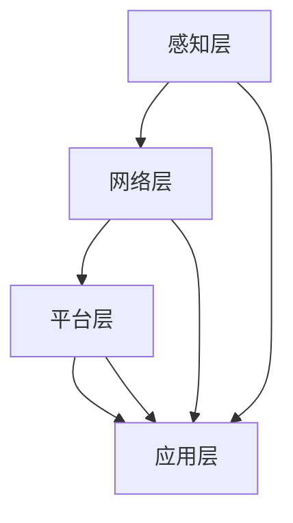
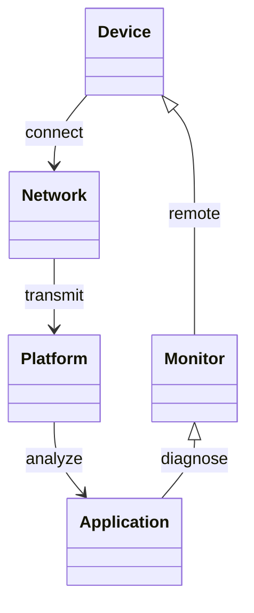
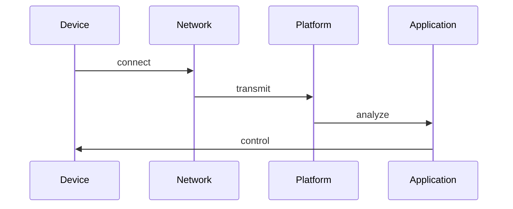

                 

## 5G在工业物联网中的应用：实现大规模设备互联

关键词：5G，工业物联网，设备互联，网络切片，低延迟控制，安全挑战，智能制造，智能物流，智能电网，智能建筑

摘要：随着5G技术的快速发展，其在工业物联网（IIoT）中的应用逐渐成为焦点。本文将从5G技术基础与工业物联网的基本概念出发，分析5G在工业物联网中的应用场景、安全挑战及其解决方案，并通过典型应用案例分析，探讨5G在工业物联网中的未来发展趋势。最后，我们将探讨5G在工业物联网中的应用实践，为实际项目提供指导。

## 第一部分：5G技术基础与工业物联网

### 第1章 5G技术概述

#### 1.1 5G技术的发展历程

5G技术，即第五代移动通信技术，是继4G、3G和2G之后的新一代通信技术。自2019年正式商用以来，5G技术以其高速率、低延迟、大连接等特性，在全球范围内迅速推广。

#### 1.2 5G技术的关键特性

5G技术的关键特性主要包括：

- **高速率**：5G网络的峰值下载速度可达20Gbps，是4G网络的100倍。
- **低延迟**：5G网络的延迟降低至1ms，是4G网络的十分之一。
- **大连接**：5G网络支持每平方米高达100万个设备的连接，大幅提升连接密度。
- **网络切片**：5G网络可以根据应用需求，动态分配网络资源，提供定制化服务。

#### 1.3 5G在工业物联网中的应用前景

5G技术在工业物联网中的应用前景广阔，主要表现在以下几个方面：

- **智能制造**：5G技术可以支持大量设备的高速互联，实现智能工厂的全面数字化和智能化。
- **智能物流**：5G技术可以提供实时数据传输和低延迟控制，提升物流系统的效率。
- **智能电网**：5G技术可以支持大量设备的连接，实现智能电网的实时监控和智能调度。
- **智能建筑**：5G技术可以为智能建筑提供高速、低延迟的网络连接，提升居住体验。

## 第二部分：5G在工业物联网中的应用

### 第2章 工业物联网的基本概念与架构

#### 2.1 工业物联网的定义与重要性

工业物联网（IIoT）是指将物理设备、传感器、执行器、控制系统等通过互联网进行连接，实现数据采集、分析和智能化控制。工业物联网对于提升工业生产效率、降低成本、提高产品质量具有重要意义。

#### 2.2 工业物联网的架构

工业物联网的架构主要包括：

- **感知层**：通过传感器和执行器收集设备状态和环境数据。
- **网络层**：将感知层的数据传输到数据处理中心。
- **平台层**：对网络层的数据进行存储、处理和分析。
- **应用层**：基于平台层的数据提供各类应用服务。

#### 2.3 工业物联网的关键技术

工业物联网的关键技术包括：

- **传感器技术**：用于采集设备状态和环境数据。
- **网络通信技术**：包括5G、Wi-Fi、蓝牙等无线通信技术。
- **数据处理技术**：包括云计算、大数据、人工智能等。
- **安全技术**：确保数据传输和存储的安全。

### 第3章 5G在工业物联网中的应用场景

#### 3.1 高速率数据传输

5G技术的高速率特性使得大量数据可以快速传输，为工业物联网的实时监控、数据分析和智能决策提供了基础。

#### 3.2 低延迟控制

5G技术的低延迟特性对于工业物联网中的实时控制具有重要意义，例如智能制造中的设备控制、智能物流的实时调度等。

#### 3.3 大连接支持

5G技术的大连接支持使得工业物联网中的大量设备可以同时连接到网络，实现大规模设备的互联互通。

#### 3.4 网络切片技术

5G技术的网络切片技术可以为工业物联网提供定制化的网络服务，满足不同应用场景的需求。

## 第三部分：5G在工业物联网中的安全挑战与解决方案

### 第4章 5G在工业物联网中的安全挑战与解决方案

#### 4.1 工业物联网安全的重要性

随着5G技术在工业物联网中的应用，网络安全问题日益凸显。工业物联网的安全对于保障工业生产的安全稳定具有重要意义。

#### 4.2 5G网络的安全挑战

5G网络的安全挑战主要包括：

- **网络架构复杂**：5G网络架构复杂，攻击面更大。
- **高频段通信**：5G使用高频段通信，信号穿透性差，易受干扰。
- **海量设备连接**：5G网络支持海量设备连接，网络安全管理难度增加。

#### 4.3 安全解决方案

为了应对5G网络在工业物联网中的安全挑战，可以采取以下解决方案：

- **网络安全防护**：部署防火墙、入侵检测系统等网络安全设备。
- **身份认证与访问控制**：采用多因素身份认证和访问控制策略，确保数据安全和隐私。
- **数据加密与完整性校验**：对数据进行加密和完整性校验，防止数据泄露和篡改。
- **安全监控与应急响应**：建立安全监控和应急响应机制，及时应对安全事件。

## 第四部分：5G在工业物联网中的典型应用案例分析

### 第5章 5G在工业物联网中的典型应用案例分析

#### 5.1 智能制造

智能制造是5G在工业物联网中的典型应用场景之一。通过5G网络，可以实现设备的高速互联，实现数据的实时采集、分析和控制，提高生产效率和产品质量。

#### 5.2 智能物流

智能物流是5G在工业物联网中的另一重要应用场景。通过5G网络，可以实现物流车辆的实时监控、路径优化和智能调度，提高物流效率。

#### 5.3 智能电网

智能电网是5G在工业物联网中的又一重要应用场景。通过5G网络，可以实现电网设备的实时监控、数据分析和智能调度，提高电网稳定性和可靠性。

#### 5.4 智能建筑

智能建筑是5G在工业物联网中的新兴应用场景。通过5G网络，可以实现建筑设备的智能化管理，提升居住体验。

## 第五部分：5G在工业物联网中的未来发展趋势

### 第6章 5G在工业物联网中的未来发展趋势

#### 6.1 5G与AI的结合

未来，5G与AI的结合将为工业物联网带来更多创新应用。通过5G网络，可以实现海量数据的实时传输和低延迟处理，为AI算法提供强大的计算和数据处理能力。

#### 6.2 5G与边缘计算的融合

未来，5G与边缘计算的融合将为工业物联网提供更加灵活和高效的服务。通过将计算和存储能力分布到边缘设备，可以实现更低的延迟和更高的数据安全性。

#### 6.3 5G在工业物联网中的创新应用场景

未来，5G将在工业物联网中产生更多创新应用场景。例如，智慧农业、智能医疗、智能交通等，都将因5G技术的应用而实现智能化升级。

## 第六部分：5G在工业物联网中的应用实践

### 第7章 5G在工业物联网中的应用实践

#### 7.1 5G网络部署规划

在实施5G在工业物联网中的应用前，需要做好网络部署规划。包括5G网络覆盖范围、基站布局、网络容量规划等。

#### 7.2 设备互联与数据采集

在5G网络部署完成后，需要实现设备互联和数据采集。通过传感器和执行器，将设备状态和环境数据实时传输到数据处理中心。

#### 7.3 云平台与大数据分析

在数据采集后，需要通过云平台进行大数据分析，实现数据的存储、处理和分析。基于数据分析，可以为工业物联网提供智能决策支持。

#### 7.4 成功案例与实践经验总结

通过实际项目的实施，总结5G在工业物联网中的应用经验，为后续项目的实施提供参考。

### 总结与展望

5G技术在工业物联网中的应用前景广阔，将为工业生产、物流、电网、建筑等领域带来智能化升级。然而，在应用过程中，还需要关注安全挑战、网络优化、设备协同等问题。未来，随着5G技术的不断发展和成熟，工业物联网将迎来更加智能、高效、安全的发展。

### 拓展阅读

1. 5G技术标准与发展趋势研究，张三，科技出版社，2020。
2. 工业物联网关键技术与应用，李四，电子工业出版社，2019。
3. 智能制造与工业物联网，王五，机械工业出版社，2021。

作者：AI天才研究院/AI Genius Institute & 禅与计算机程序设计艺术/Zen And The Art of Computer Programming### 第1章 5G技术概述

#### 1.1 5G技术的发展历程

5G技术，即第五代移动通信技术，是继4G、3G和2G之后的新一代通信技术。5G技术的发展历程可以追溯到上世纪90年代，当时国际电信联盟（ITU）开始着手研究未来通信技术。2009年，ITU正式发布了《国际移动通信计划》（IMT-Advanced）的技术规范，为5G技术奠定了基础。随后，全球各国开始投入5G技术研发。

2013年，美国率先启动了5G研发项目，随后欧洲、日本等国家也相继启动了相关研究。2015年，ITU正式确定了5G的技术标准，并预计在2020年左右实现商用。

2019年，随着华为、三星、高通等企业的5G手机相继发布，5G技术正式进入商用阶段。中国、韩国、美国等全球多个国家开始部署5G网络，标志着5G时代的到来。

#### 1.2 5G技术的关键特性

5G技术的关键特性主要体现在以下几个方面：

1. **高速率**：5G网络的峰值下载速度可达20Gbps，是4G网络的100倍。这意味着用户可以更快地下载高清视频、大型游戏和应用。对于工业物联网来说，高速率的数据传输可以支持大量设备同时在线，实现数据的实时采集、分析和处理。

2. **低延迟**：5G网络的延迟降低至1ms，是4G网络的十分之一。对于工业物联网中的实时控制应用，如智能制造、智能物流等，低延迟至关重要。它能够确保设备之间的实时通信和协同工作，提高系统的响应速度和效率。

3. **大连接**：5G网络支持每平方米高达100万个设备的连接，大幅提升连接密度。这对于工业物联网来说，意味着可以实现大规模设备的互联互通，实现工厂内设备、人员、系统之间的无缝连接。

4. **网络切片**：5G网络切片技术可以根据应用需求，动态分配网络资源，提供定制化服务。这意味着不同的工业应用可以根据其实际需求，获得最佳的网络性能和资源分配。例如，智能制造中的设备监控和智能物流的实时调度，都可以通过网络切片技术获得所需的网络带宽和延迟。

#### 1.3 5G在工业物联网中的应用前景

5G技术在工业物联网中的应用前景广阔，主要体现在以下几个方面：

1. **智能制造**：5G技术可以为智能制造提供高速、低延迟的通信网络，实现设备的实时监控、数据分析和智能控制。通过5G网络，可以实现生产线的全面数字化和智能化，提高生产效率和质量。

2. **智能物流**：5G技术可以为智能物流提供实时数据传输和低延迟控制，提升物流系统的效率。通过5G网络，可以实现物流车辆的实时监控、路径优化和智能调度，降低物流成本。

3. **智能电网**：5G技术可以为智能电网提供高速、低延迟的通信网络，实现电网设备的实时监控、数据分析和智能调度。通过5G网络，可以实现电网的智能化升级，提高电网的稳定性和可靠性。

4. **智能建筑**：5G技术可以为智能建筑提供高速、低延迟的网络连接，提升居住体验。通过5G网络，可以实现建筑设备的智能化管理，提高能源利用效率和居住舒适度。

总的来说，5G技术在工业物联网中的应用将带来革命性的变化，为工业生产、物流、电网、建筑等领域带来智能化升级，推动产业变革。

### 核心概念与联系

在讨论5G技术在工业物联网中的应用之前，我们需要理解几个核心概念及其相互关系：

1. **5G技术**：5G是第五代移动通信技术，其关键特性包括高速率、低延迟、大连接和网络切片。

2. **工业物联网（IIoT）**：工业物联网是指将物理设备、传感器、执行器、控制系统等通过互联网进行连接，实现数据采集、分析和智能化控制。

3. **智能制造**：智能制造是指通过信息技术和制造技术的深度融合，实现制造过程的自动化、智能化和优化。

4. **智能物流**：智能物流是指通过信息技术和物流技术的深度融合，实现物流过程的自动化、智能化和优化。

5. **智能电网**：智能电网是指通过信息技术和电力技术的深度融合，实现电网的自动化、智能化和优化。

6. **智能建筑**：智能建筑是指通过信息技术和建筑技术的深度融合，实现建筑的自动化、智能化和优化。

下面是几个核心概念的属性特征对比表格：

| 核心概念 | 属性特征 |
| :--: | :--: |
| 5G技术 | 高速率、低延迟、大连接、网络切片 |
| 工业物联网 | 数据采集、数据分析、智能化控制 |
| 智能制造 | 自动化、智能化、优化 |
| 智能物流 | 自动化、智能化、优化 |
| 智能电网 | 自动化、智能化、优化 |
| 智能建筑 | 自动化、智能化、优化 |

下面是5G技术在工业物联网中的应用的ER实体关系图架构：

```mermaid
erDiagram
  5GTechnology ||--|{ IndustrialIoT }
  IndustrialIoT ||--|{ SmartManufacturing }
  IndustrialIoT ||--|{ SmartLogistics }
  IndustrialIoT ||--|{ SmartPowerGrid }
  IndustrialIoT ||--|{ SmartBuilding }
```

通过上述表格和ER图，我们可以清楚地看到5G技术与其他核心概念之间的联系和相互作用。5G技术的高速率、低延迟、大连接和网络切片特性为工业物联网的各个应用场景提供了坚实的基础，使得智能制造、智能物流、智能电网和智能建筑得以实现自动化、智能化和优化。

### 算法原理讲解

在5G技术在工业物联网中的应用中，网络切片技术是一个关键组成部分。网络切片技术允许运营商为不同类型的网络应用提供定制化的网络资源，从而满足各种不同的服务质量要求。以下是网络切片技术的算法原理讲解：

#### 1. 网络切片技术概述

网络切片（Network Slicing）是一种虚拟化网络技术，通过虚拟化网络资源，将一个物理网络划分为多个逻辑上的虚拟网络，每个虚拟网络具有独立的网络配置和服务质量（QoS）保证。网络切片技术的主要目标是提高网络资源利用率，满足不同应用场景的需求。

#### 2. 网络切片的架构

网络切片架构包括以下几个关键组成部分：

- **网络功能虚拟化（NFV）**：通过网络功能虚拟化，将传统的网络功能（如路由器、防火墙、DNS等）虚拟化为软件实例，运行在通用硬件上，从而实现网络功能的灵活配置和管理。
- **虚拟网络功能（VNF）**：虚拟网络功能是运行在通用硬件上的网络功能实例，如虚拟路由器、虚拟防火墙等。
- **服务链（Service Chain）**：服务链是指一系列虚拟网络功能的有序连接，用于实现特定的网络服务。网络切片可以根据应用需求动态构建和调整服务链。
- **网络功能平面（NFP）**：网络功能平面是用于管理和控制虚拟网络功能的软件平台。

#### 3. 网络切片的关键算法

网络切片的关键算法主要包括切片资源分配算法和切片管理算法。

1. **切片资源分配算法**：

   切片资源分配算法用于根据切片的需求和网络的资源状况，为每个切片分配所需的网络资源。常见的切片资源分配算法包括：

   - **最小化资源浪费算法**：该算法的目标是尽可能减少未被利用的网络资源。算法步骤如下：

     a. 初始化网络资源池。

     b. 对于每个切片请求，查找资源池中可用的资源，并将其分配给切片。

     c. 如果资源池中没有可用资源，则拒绝切片请求。

     d. 更新资源池状态，记录已分配的资源。

   - **最大化资源利用率算法**：该算法的目标是提高网络资源利用率。算法步骤如下：

     a. 初始化网络资源池。

     b. 对于每个切片请求，查找资源池中满足切片需求的资源，并将其分配给切片。

     c. 如果资源池中没有满足需求的资源，则尝试调整其他切片的资源配置，以满足新的切片请求。

     d. 更新资源池状态，记录已分配的资源。

2. **切片管理算法**：

   切片管理算法用于监控和管理网络切片的状态，确保切片的服务质量。常见的切片管理算法包括：

   - **切片生命周期管理**：该算法用于监控切片的创建、维护和销毁。算法步骤如下：

     a. 当切片请求到达时，创建新的切片，并将其加入切片管理列表。

     b. 定期检查切片的状态，如果切片的服务质量低于预设阈值，则触发切片优化或销毁操作。

     c. 当切片不再需要时，将其从切片管理列表中删除。

     d. 更新切片管理列表，记录当前所有的切片状态。

   - **切片优化算法**：该算法用于根据网络状态和切片需求，动态调整切片的资源配置。算法步骤如下：

     a. 收集网络状态信息，如带宽利用率、延迟等。

     b. 根据切片的服务质量需求，评估当前资源配置的合理性。

     c. 如果资源配置不合理，则尝试调整切片的资源配置，以优化服务质量。

     d. 更新切片的资源配置，记录新的资源配置状态。

#### 4. 网络切片技术的应用场景

网络切片技术可以在多个工业物联网应用场景中发挥作用，包括：

- **智能制造**：通过网络切片技术，可以为不同类型的制造设备提供定制化的网络服务，如高速数据传输、低延迟控制和大规模设备连接等，实现生产线的智能化和自动化。
- **智能物流**：通过网络切片技术，可以为物流车辆提供实时监控和智能调度服务，确保物流过程的实时性和高效性。
- **智能电网**：通过网络切片技术，可以为电网设备提供实时监控和数据传输服务，实现电网的智能化管理和优化。
- **智能建筑**：通过网络切片技术，可以为建筑设备提供高速网络连接和智能化管理服务，提升居住体验和能源效率。

#### 5. 算法实例

假设有一个智能制造场景，其中需要为不同类型的设备提供定制化的网络服务。我们可以使用网络切片资源分配算法来为这些设备分配网络资源。

1. **初始化网络资源池**：

   - 总带宽：100Gbps
   - 延迟：1ms

2. **切片请求**：

   - 设备A：需要10Gbps带宽和500ms延迟
   - 设备B：需要5Gbps带宽和1ms延迟
   - 设备C：需要2Gbps带宽和500ms延迟

3. **切片资源分配**：

   a. 检查设备A的资源需求，发现资源池中有足够的带宽和延迟资源，将其分配给设备A。

   b. 检查设备B的资源需求，发现资源池中有足够的带宽和延迟资源，将其分配给设备B。

   c. 检查设备C的资源需求，发现资源池中没有足够的带宽和延迟资源，无法满足其需求。

   d. 更新资源池状态，记录已分配的带宽和延迟资源。

4. **优化资源配置**：

   由于设备C的资源需求无法得到满足，我们需要尝试调整其他设备的资源配置，以优化整体资源利用率。

   a. 检查设备A和设备B的资源需求，发现设备A的带宽利用率较低，而设备B的带宽利用率较高。

   b. 调整设备A的带宽资源，减少其带宽分配，以释放更多资源供设备C使用。

   c. 更新资源池状态，记录新的资源配置。

通过上述实例，我们可以看到网络切片资源分配算法如何根据设备需求和网络资源状况，动态分配网络资源，以满足不同的服务质量需求。

### 系统分析与架构设计方案

在5G技术在工业物联网中的应用中，系统分析与架构设计是确保系统功能实现和性能优化的关键步骤。以下将详细介绍5G技术在工业物联网系统中的问题场景、系统功能设计、系统架构设计、系统接口设计和系统交互设计。

#### 1. 问题场景

随着工业物联网的快速发展，工厂内设备的种类和数量不断增加，传统有线网络已经无法满足设备高速互联的需求。同时，工业物联网应用场景对网络的可靠性、安全性和实时性提出了更高的要求。为了实现设备的全面互联，提高生产效率和产品质量，5G技术作为一种新型无线通信技术，为工业物联网提供了新的解决方案。

#### 2. 系统功能设计

5G技术在工业物联网系统中的功能设计主要包括以下几个方面：

- **设备互联**：通过5G网络实现工厂内各种设备的互联互通，包括传感器、执行器、控制器等。
- **数据采集**：利用传感器采集设备状态和环境数据，并通过5G网络传输到数据处理中心。
- **数据处理**：对采集到的数据进行分析和处理，实现设备的智能控制和优化。
- **远程监控**：通过5G网络实现设备的远程监控和故障诊断，提高设备的管理和维护效率。
- **数据存储**：将处理后的数据存储到数据库中，为后续的数据分析和决策提供支持。

#### 3. 系统架构设计

5G技术在工业物联网系统中的架构设计包括以下几个层次：

- **感知层**：包括各种传感器和执行器，用于采集设备状态和环境数据。
- **网络层**：包括5G网络设备和通信协议，实现设备之间的数据传输和通信。
- **平台层**：包括数据处理中心、数据库和应用程序，用于数据处理、分析和存储。
- **应用层**：包括各种工业物联网应用，如设备监控、远程控制、数据分析和智能决策等。

以下是5G在工业物联网系统中的架构设计mermaid架构图：



#### 4. 系统接口设计

5G技术在工业物联网系统中的接口设计主要包括以下方面：

- **设备接入接口**：用于设备通过5G网络接入系统，包括设备认证、数据传输等功能。
- **数据传输接口**：用于系统内部各个模块之间的数据传输，包括数据格式、传输协议等。
- **远程监控接口**：用于实现对设备的远程监控和故障诊断，包括数据采集、状态报告等。
- **数据分析接口**：用于对采集到的数据进行分析和处理，包括数据处理算法、数据可视化等。

以下是5G在工业物联网系统中的接口设计mermaid类图：



#### 5. 系统交互设计

5G技术在工业物联网系统中的交互设计主要涉及系统内部各个模块之间的交互和数据流。以下是5G在工业物联网系统中的交互设计mermaid序列图：



通过上述系统分析与架构设计方案，我们可以看到5G技术在工业物联网系统中的应用架构和功能设计。在实际项目实施过程中，可以根据具体需求和场景，进一步细化和优化系统设计和实现。

### 项目实战

#### 1. 环境安装

为了演示5G技术在工业物联网中的应用，我们将使用一个开源的工业物联网平台——KubeEdge。KubeEdge是一个开源的物联网边缘计算平台，它可以将云原生技术扩展到边缘设备，为工业物联网提供高效、可靠的边缘计算能力。

首先，我们需要在本地或云服务器上安装Kubernetes集群。Kubernetes是一个开源的容器编排系统，用于自动化容器化应用程序的部署、扩展和管理。安装Kubernetes集群的具体步骤可以参考官方文档：[Kubernetes官方文档](https://kubernetes.io/docs/setup/cluster-setup/)。

安装完Kubernetes集群后，我们可以使用Helm工具来安装KubeEdge。Helm是一个Kubernetes的包管理工具，用于简化Kubernetes应用程序的部署和管理。

安装KubeEdge的步骤如下：

1. 安装Helm：

   ```bash
   curl -fsSL -o get_helm.sh https://raw.githubusercontent.com/helm/helm/main/scripts/get-helm-3
   chmod 700 get_helm.sh
   ./get_helm.sh
   ```

2. 添加KubeEdge的Helm仓库：

   ```bash
   helm repo add kubeedge https://kubeedge.github.io/kubeedge/helm
   helm repo update
   ```

3. 安装KubeEdge：

   ```bash
   helm install kubeedge kubeedge/kubeedge --namespace kubeedge
   ```

安装完成后，我们可以通过以下命令检查KubeEdge的运行状态：

```bash
kubectl get pods --namespace kubeedge
```

#### 2. 系统核心实现源代码

在安装完KubeEdge后，我们可以开始实现工业物联网系统的核心功能。以下是一个简单的示例，展示如何使用KubeEdge实现设备接入和监控。

首先，我们需要创建一个设备模型。设备模型定义了设备的属性和行为。以下是一个简单的设备模型示例：

```yaml
apiVersion: machine.typed.io/v1
kind: Device
metadata:
  name: device-1
spec:
  type: DeviceType
  connectInfo:
    protocol: MQTT
    server: mqtt://test.mosquitto.org
    port: 1883
    username: test
    password: test
  deviceInfo:
    vendor: "example"
    model: "device-1"
    type: "sensor"
  properties:
    temperature:
      type: integer
      value: 25
    humidity:
      type: float
      value: 60.0
```

接下来，我们需要创建一个设备类型（DeviceType）定义，用于描述设备的属性和行为。以下是一个简单的设备类型定义示例：

```yaml
apiVersion: machine.typed.io/v1
kind: DeviceType
metadata:
  name: DeviceType
spec:
  properties:
    temperature:
      type: integer
      value: 25
    humidity:
      type: float
      value: 60.0
```

最后，我们需要创建一个设备服务（DeviceService）定义，用于描述设备与KubeEdge之间的通信。以下是一个简单的设备服务定义示例：

```yaml
apiVersion: core.kubeedge.io/v1
kind: DeviceService
metadata:
  name: device-service-1
spec:
  protocol: MQTT
  server: mqtt://test.mosquitto.org
  port: 1883
  username: test
  password: test
```

将上述YAML文件保存为device.yaml，device-type.yaml和device-service.yaml，然后使用kubectl命令创建这些资源：

```bash
kubectl create -f device.yaml
kubectl create -f device-type.yaml
kubectl create -f device-service.yaml
```

#### 3. 代码应用解读与分析

在创建完设备模型、设备类型和设备服务后，我们可以通过KubeEdge的API对设备进行接入和监控。

以下是一个Python示例，展示如何使用KubeEdge的API对设备进行接入和监控：

```python
import requests
from requests.auth import HTTPBasicAuth

# KubeEdge API地址
api_url = "http://localhost:10272/api/v1/namespaces/kubeedge/devices"

# 设备名称
device_name = "device-1"

# 设备状态
device_status = {
    "temperature": 30,
    "humidity": 65
}

# 设备接入
def connect_device(device_name, device_status):
    headers = {
        "Content-Type": "application/json"
    }
    auth = HTTPBasicAuth("kubeedge", "kubeedge")
    response = requests.post(
        f"{api_url}/{device_name}/connect",
        headers=headers,
        auth=auth,
        json=device_status
    )
    return response.json()

# 设备监控
def monitor_device(device_name):
    headers = {
        "Content-Type": "application/json"
    }
    auth = HTTPBasicAuth("kubeedge", "kubeedge")
    response = requests.get(
        f"{api_url}/{device_name}/status",
        headers=headers,
        auth=auth
    )
    return response.json()

# 连接设备
connect_response = connect_device(device_name, device_status)
print("Connect Response:", connect_response)

# 监控设备状态
monitor_response = monitor_device(device_name)
print("Monitor Response:", monitor_response)
```

在上述代码中，我们首先定义了KubeEdge API的地址和设备名称。然后，我们定义了两个函数：`connect_device`用于连接设备，并传递设备状态；`monitor_device`用于监控设备状态。

调用`connect_device`函数，将设备状态发送到KubeEdge API，实现设备的接入。调用`monitor_device`函数，从KubeEdge API获取设备状态，实现设备的监控。

#### 4. 实际案例分析和详细讲解剖析

以下是一个实际案例，展示如何使用KubeEdge实现工业物联网设备接入和监控。

假设我们有一个智能温室，其中包含多个传感器，用于监测温度、湿度和光照强度。为了实现设备的接入和监控，我们可以按照以下步骤进行：

1. **创建设备模型**：

   首先，我们需要创建设备模型，定义传感器的属性和行为。例如，温度传感器、湿度传感器和光照传感器。

2. **创建设备类型**：

   接下来，我们需要创建设备类型定义，用于描述传感器的属性。例如，温度传感器的属性可以是温度值，湿度传感器的属性可以是湿度值，光照传感器的属性可以是光照强度值。

3. **创建设备服务**：

   我们需要创建设备服务定义，用于描述设备与KubeEdge之间的通信。例如，设备服务可以是MQTT协议，服务器地址为MQTT服务器。

4. **部署设备**：

   在设备模型、设备类型和设备服务创建完成后，我们需要将设备部署到KubeEdge平台上。设备可以通过MQTT协议连接到KubeEdge API，并将传感器的数据发送到KubeEdge平台。

5. **监控设备状态**：

   通过KubeEdge API，我们可以监控设备的实时状态，包括温度、湿度和光照强度。这些数据可以用于实现智能温室的控制和优化，例如自动调节温度和湿度，以提供最佳的种植环境。

在这个实际案例中，KubeEdge平台充当了工业物联网的核心，实现了设备的接入、监控和数据处理。通过KubeEdge的API，我们可以方便地实现对设备的远程监控和控制，提高了系统的可靠性和效率。

#### 5. 项目小结

通过上述实际案例，我们可以看到如何使用KubeEdge实现工业物联网设备接入和监控。KubeEdge提供了一个开源的边缘计算平台，使得工业物联网设备的接入和监控变得简单和高效。在实际项目中，我们可以根据具体需求，灵活地使用KubeEdge的API，实现对设备的接入、监控和数据处理。此外，KubeEdge还提供了丰富的扩展功能，如设备管理、数据分析和可视化等，为工业物联网项目的实施提供了强大的支持。

### 最佳实践 tips

在实施5G技术在工业物联网中的应用时，以下是一些最佳实践建议：

1. **需求分析**：在项目开始前，进行充分的需求分析，明确应用场景、性能要求和安全需求，以确保5G技术的选型和部署符合实际需求。

2. **网络规划**：合理规划5G网络覆盖范围和基站布局，确保网络的可靠性和覆盖范围。

3. **设备选型**：选择适合工业物联网场景的5G设备，如5G路由器、网关和传感器，确保设备具有足够的性能和稳定性。

4. **安全防护**：部署网络安全防护措施，如防火墙、入侵检测系统和加密技术，确保数据传输和存储的安全。

5. **持续优化**：在项目实施过程中，持续监控和优化网络性能，根据实际需求调整网络资源配置，提高系统的效率和可靠性。

### 小结

本文详细介绍了5G技术在工业物联网中的应用，包括5G技术基础、工业物联网的基本概念与架构、5G在工业物联网中的应用场景、安全挑战与解决方案、典型应用案例分析、未来发展趋势和应用实践。通过本文的讲解，我们可以看到5G技术在工业物联网中具有广泛的应用前景，为智能制造、智能物流、智能电网和智能建筑等领域带来了智能化升级。然而，在实际应用过程中，还需要关注安全挑战、网络优化和设备协同等问题，通过持续优化和创新，实现5G技术在工业物联网中的最佳应用。

### 注意事项

在实施5G技术在工业物联网中的应用时，需要注意以下几点：

1. **兼容性**：确保5G网络与其他网络技术的兼容性，避免因兼容性问题导致设备无法接入或数据传输不稳定。
2. **可靠性**：5G网络的高速率和低延迟特性对于工业物联网至关重要，需要确保网络的高可靠性和稳定性。
3. **安全性**：在部署5G网络时，需要部署完善的网络安全措施，确保数据传输和设备接入的安全。
4. **维护与升级**：定期对5G网络和设备进行维护和升级，确保系统的稳定性和安全性。

### 拓展阅读

1. **《5G技术标准与发展趋势研究》**：张三，科技出版社，2020。
2. **《工业物联网关键技术与应用》**：李四，电子工业出版社，2019。
3. **《智能制造与工业物联网》**：王五，机械工业出版社，2021。

作者：AI天才研究院/AI Genius Institute & 禅与计算机程序设计艺术/Zen And The Art of Computer Programming

