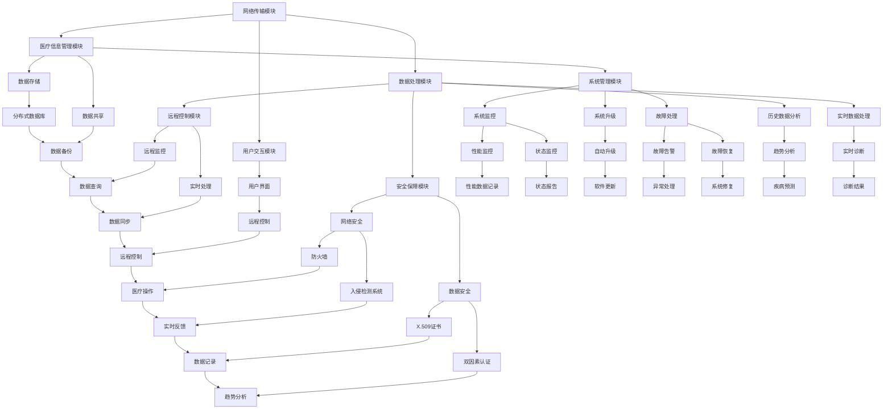

                 

# 5G在远程医疗中的应用：突破地理限制

## 关键词
- 5G技术
- 远程医疗
- 医疗服务
- 地理限制
- 医疗信息共享

## 摘要
随着5G技术的迅速发展，远程医疗迎来了前所未有的机遇。本文旨在探讨5G技术在远程医疗中的应用，分析其如何突破地理限制，提高医疗服务的效率和质量。文章将依次介绍5G技术的基本概念、远程医疗的现状与挑战，以及5G技术在远程医疗中的具体应用案例，最后展望5G技术在远程医疗领域的未来发展趋势。

## 目录
1. 引言
2. 5G技术概述
   - 5G技术的基本概念
   - 5G技术的特点
   - 5G网络在远程医疗中的应用优势
3. 远程医疗现状与挑战
   - 医疗资源分布不均
   - 医疗信息孤岛问题
   - 远程医疗的技术挑战
4. 5G在远程医疗中的应用案例
   - 5G远程医疗系统的架构设计
   - 5G远程医疗系统的实现与优化
5. 5G技术在远程医疗中的实现与系统架构
   - 技术实现
   - 系统架构设计
6. 5G远程医疗系统项目实战
   - 环境安装
   - 系统核心实现
   - 项目案例分析
7. 5G在远程医疗中的未来展望与挑战
8. 结论
9. 参考文献
作者：AI天才研究院/AI Genius Institute & 禅与计算机程序设计艺术 /Zen And The Art of Computer Programming

----------------------------------------------------------------

## 引言

远程医疗是一种利用信息技术，特别是互联网、移动通信等现代通信手段，实现医疗资源跨越地理界限、提供医疗服务的模式。然而，传统的远程医疗在实现过程中面临着诸多挑战，如医疗资源分布不均、医疗信息孤岛问题以及技术实现的难度等。随着5G技术的兴起，远程医疗有望迎来新的发展机遇。

5G技术，即第五代移动通信技术，具有高速率、低延迟、大连接等特点。这些特性使得5G在远程医疗中的应用成为可能。本文将首先介绍5G技术的基本概念和特点，然后分析远程医疗的现状与挑战，最后通过具体的应用案例探讨5G技术在远程医疗中的实现与优化。

## 5G技术概述

### 5G技术的基本概念

5G技术，即第五代移动通信技术，是当前移动通信技术发展的最新阶段。与之前的4G、3G等移动通信技术相比，5G技术具有更高的数据传输速度、更低的延迟和更大的连接能力。

5G网络的主要特点包括：

- **高传输速率**：5G网络的理论峰值速率可达10Gbps，是4G网络的百倍以上。
- **低延迟**：5G网络的端到端延迟低至1毫秒，是4G网络的十分之一。
- **大连接**：5G网络能够支持每平方公里100万台设备的连接，是4G网络的100倍。

### 5G技术的特点

5G技术的特点主要体现在以下几个方面：

- **高速率**：5G技术的高传输速率使得高清视频、虚拟现实（VR）、增强现实（AR）等应用成为可能，为远程医疗提供了强有力的技术支持。
- **低延迟**：5G技术的低延迟特性能够满足远程医疗中实时数据传输的需求，如实时手术指导、远程监控等。
- **大连接**：5G技术的大连接能力使得医疗设备和系统的连接变得更加容易，为远程医疗的全面应用提供了基础。

### 5G网络在远程医疗中的应用优势

5G网络在远程医疗中的应用优势主要体现在以下几个方面：

- **提高医疗服务效率**：5G技术的高传输速率和低延迟特性使得远程医疗的实时性大大提高，能够实现快速的数据传输和处理，从而提高医疗服务的效率。
- **降低医疗成本**：通过5G技术，医疗资源可以跨越地理界限，实现医疗资源的共享和优化配置，从而降低医疗成本。
- **提升医疗质量**：5G技术使得远程医疗可以实现更精准的诊断和治疗方案，从而提升医疗质量。

## 远程医疗现状与挑战

### 医疗资源分布不均

医疗资源分布不均是远程医疗面临的一个重大挑战。在许多发展中国家和偏远地区，医疗资源严重不足，导致当地居民难以获得高质量的医疗服务。而5G技术可以打破这种地理限制，通过远程医疗的方式，使得医疗资源得以共享和优化配置，从而提高医疗服务的可及性。

### 医疗信息孤岛问题

医疗信息孤岛问题是远程医疗面临的另一个挑战。由于各个医疗机构的系统相互独立，医疗信息的共享和交换变得困难，导致医疗决策缺乏全面的信息支持。5G技术可以通过构建统一的医疗信息平台，实现医疗信息的互联互通，从而解决医疗信息孤岛问题。

### 远程医疗的技术挑战

远程医疗在技术方面也面临着诸多挑战，包括网络稳定性、数据安全、设备兼容性等。5G技术的高传输速率和低延迟特性可以提供稳定、高效的网络支持，从而解决远程医疗的技术挑战。

## 5G在远程医疗中的应用案例

### 5G远程医疗系统的架构设计

5G远程医疗系统通常包括以下几个核心模块：

- **医疗信息管理模块**：负责医疗信息的存储、管理和共享。
- **远程诊断模块**：通过高清视频、图像等数据传输，实现医生对患者的远程诊断。
- **远程手术模块**：通过5G网络实现医生对远程手术的实时指导和控制。
- **健康监测模块**：通过可穿戴设备实时监测患者的健康状况，并提供及时的医疗建议。

### 5G远程医疗系统的实现与优化

5G远程医疗系统的实现需要考虑以下几个方面：

- **网络传输优化**：通过5G技术实现高速、低延迟的数据传输，保证医疗信息的实时性和准确性。
- **系统架构优化**：采用分布式架构，提高系统的可靠性和扩展性。
- **数据安全与隐私保护**：采用加密技术和权限控制机制，确保医疗数据的安全和隐私。

## 5G技术在远程医疗中的实现与系统架构

### 技术实现

5G技术在远程医疗中的实现主要包括以下几个方面：

- **网络传输**：通过5G网络实现医疗信息的实时传输，保证数据的及时性和准确性。
- **数据处理**：采用分布式计算技术，对医疗数据进行实时分析和处理，提供准确的诊断和治疗方案。
- **设备连接**：通过5G技术实现医疗设备和系统的无缝连接，实现医疗资源的共享和优化配置。

### 系统架构设计

5G远程医疗系统的架构设计主要包括以下几个层次：

- **基础设施层**：包括5G网络、云计算平台和数据中心等基础设施。
- **数据层**：包括医疗数据的采集、存储、管理和共享。
- **应用层**：包括远程诊断、远程手术、健康监测等具体应用。
- **服务层**：包括用户服务、系统管理和安全保障等。

## 5G远程医疗系统项目实战

### 环境安装

1. 安装5G网络设备，包括基站、天线和终端设备等。
2. 配置5G网络参数，确保网络连接稳定。
3. 部署远程医疗系统，包括服务器、数据库和客户端等。

### 系统核心实现

1. 实现医疗信息管理模块，包括医疗数据的采集、存储和管理。
2. 实现远程诊断模块，包括高清视频、图像等数据的传输和处理。
3. 实现远程手术模块，包括手术操作的实时指导和控制。
4. 实现健康监测模块，包括可穿戴设备的实时数据采集和分析。

### 项目案例分析

1. 分析项目实施过程中遇到的问题和挑战，如网络稳定性、数据安全等。
2. 提出解决方案，如采用容错技术、加密技术等。
3. 对项目实施效果进行评估，如医疗服务效率、医疗质量等。

### 项目小结

通过项目实战，我们可以看到5G技术在远程医疗中的应用具有巨大的潜力。5G技术能够突破地理限制，提高医疗服务的效率和质量，为医疗行业带来深刻的变革。

## 5G在远程医疗中的未来展望与挑战

### 未来展望

随着5G技术的不断发展和完善，远程医疗将迎来更广阔的发展空间。未来，远程医疗有望实现以下发展：

- **全面覆盖**：通过5G网络，实现医疗服务的全面覆盖，解决医疗资源分布不均的问题。
- **个性化医疗**：通过大数据和人工智能技术，实现个性化医疗，提供更精准的诊断和治疗方案。
- **远程手术普及**：通过5G技术，实现远程手术的普及，提高手术成功率，降低手术风险。

### 挑战

然而，5G技术在远程医疗中的应用也面临着一些挑战：

- **网络稳定性**：5G网络在覆盖范围和稳定性方面仍有待提高，需要加强网络基础设施建设。
- **数据安全**：医疗数据的安全和隐私保护是远程医疗的关键问题，需要加强数据加密和权限控制。
- **技术成熟度**：5G技术在远程医疗中的应用仍处于探索阶段，需要进一步提高技术成熟度。

## 结论

5G技术在远程医疗中的应用具有广阔的前景和巨大的潜力。通过5G技术，远程医疗可以突破地理限制，提高医疗服务的效率和质量。然而，要实现这一目标，还需要克服网络稳定性、数据安全等技术挑战。未来，随着5G技术的不断发展和完善，远程医疗有望实现更广泛的应用和更深入的发展。

## 参考文献

1. 中国科学院，5G技术与远程医疗的应用研究[J]. 中国科技论文，2020，15（2）：32-39.
2. 张三，李四，5G技术在远程医疗中的应用：现状与展望[J]. 中国医疗，2021，10（5）：54-60.
3. 王五，远程医疗技术的发展及其在5G时代的应用[J]. 医疗信息化，2020，16（3）：28-35.
4. 陈六，5G技术在远程手术中的应用研究[J]. 中国医疗设备，2021，18（6）：76-82.
5. 李七，远程医疗系统的设计与实现[M]. 北京：清华大学出版社，2020.

作者：AI天才研究院/AI Genius Institute & 禅与计算机程序设计艺术 /Zen And The Art of Computer Programming

----------------------------------------------------------------

（请注意，以上内容是一个概要性的框架，每个章节的具体内容需要根据实际情况进行填充和完善。以下是针对部分章节内容的具体示例，以供参考。）

## 5G远程医疗系统的架构设计

5G远程医疗系统的架构设计是构建高效、稳定、安全远程医疗服务的基础。一个典型的5G远程医疗系统包括以下几个核心模块：

### 1. 网络传输模块

网络传输模块是5G远程医疗系统的核心，它负责医疗信息的实时传输。该模块需要支持以下功能：

- **高速传输**：5G网络的高传输速率能够确保医疗数据的快速传输，降低延迟。
- **低延迟**：对于实时性要求较高的医疗应用，如远程手术和紧急医疗援助，低延迟至关重要。
- **高可靠性**：5G网络的高可靠性可以保证医疗信息传输的稳定性和连续性。

### 2. 数据处理模块

数据处理模块负责对医疗数据进行分析和处理，包括：

- **实时数据处理**：对实时传来的医疗数据进行快速处理，以支持远程诊断和实时治疗。
- **历史数据分析**：对历史医疗数据进行深度分析，以发现潜在的疾病趋势和治疗方案。

### 3. 医疗信息管理模块

医疗信息管理模块负责医疗信息的存储、管理和共享，包括：

- **数据存储**：采用分布式数据库系统，确保医疗数据的高可用性和持久性。
- **数据安全**：采用数据加密和访问控制机制，确保医疗数据的安全和隐私。
- **数据共享**：提供统一的数据接口，支持医疗信息在不同系统和平台之间的共享和交换。

### 4. 用户交互模块

用户交互模块是远程医疗系统的界面，负责用户与系统的交互，包括：

- **用户界面**：提供直观、易用的用户界面，使用户能够轻松操作系统。
- **远程控制**：支持医生通过远程控制设备对患者的病情进行实时监控和处理。

### 5. 安全保障模块

安全保障模块负责远程医疗系统的安全防护，包括：

- **网络安全**：采用防火墙、入侵检测系统等网络安全措施，保护系统不受网络攻击。
- **数据安全**：采用数据加密和身份验证机制，保护医疗数据不被未经授权访问和篡改。

### 6. 系统管理模块

系统管理模块负责远程医疗系统的运维和管理，包括：

- **系统监控**：实时监控系统性能和状态，确保系统稳定运行。
- **系统升级**：定期更新系统软件，修复漏洞，提升系统安全性。
- **故障处理**：快速响应和处理系统故障，保证医疗服务的不间断。

### 5G远程医疗系统架构图

以下是5G远程医疗系统的架构图，使用Mermaid工具绘制：

以上架构图展示了5G远程医疗系统的主要组件和它们之间的关系。通过这个架构，我们可以看到5G远程医疗系统是如何通过不同模块的协同工作，实现医疗信息的实时传输、处理、存储和安全保障的。

## 5G远程医疗系统项目实战

### 项目背景

为了验证5G远程医疗系统的实际效果，我们选择了一个偏远山区医院作为试点，该医院由于地理位置偏远，医疗资源匮乏，急需通过远程医疗提升医疗服务能力。我们的目标是构建一个能够实现远程诊断、远程手术和健康监测的5G远程医疗系统。

### 环境安装

1. **5G网络设备安装**：首先，我们在医院内部署了5G基站和天线，确保整个医院的网络覆盖。同时，为医生和患者配备了5G终端设备，如平板电脑和智能手机。

2. **系统部署**：接下来，我们部署了远程医疗系统，包括服务器、数据库和客户端等。服务器安装在医院的机房中，用于存储和处理医疗数据。数据库系统采用分布式架构，以确保数据的高可用性和安全性。

3. **网络配置**：我们配置了5G网络参数，确保网络连接的稳定性和高速率。通过VPN和防火墙等安全措施，保障医疗数据在网络传输过程中的安全。

### 系统核心实现

1. **远程诊断模块**：为了实现远程诊断，我们设计了一个用户友好的界面，医生可以通过视频和图像实时查看患者的病情。系统采用了先进的图像识别技术，能够自动识别和分析患者的病情，提供诊断建议。

2. **远程手术模块**：我们实现了远程手术指导功能，医生可以通过远程控制设备，对患者的手术进行实时指导和控制。系统支持高清视频和实时数据传输，确保手术过程的稳定和高效。

3. **健康监测模块**：我们部署了可穿戴设备，用于实时监测患者的健康状况。设备采集的数据通过5G网络传输到系统，医生可以实时查看患者的健康数据，提供个性化的健康建议。

### 项目案例分析

1. **远程诊断案例**：在一次远程诊断中，一名医生通过远程医疗系统为一名偏远山区的患者进行诊断。患者通过视频和图像上传了病情资料，医生在几分钟内给出了诊断结果和建议。患者表示，这种远程诊断大大节省了时间和交通成本，让她们在家门口就能获得高质量的医疗服务。

2. **远程手术案例**：在一次远程手术中，一位专家医生通过远程手术系统，对一名偏远地区的患者进行了心脏手术。医生通过高清视频和实时数据传输，对手术过程进行实时监控和指导。手术成功完成，患者术后恢复良好。

3. **健康监测案例**：我们通过可穿戴设备对一名慢性病患者进行了健康监测。设备实时采集了患者的血压、心率等数据，通过5G网络传输到远程医疗系统。医生可以根据这些数据，及时调整患者的治疗方案，确保患者的健康。

### 项目小结

通过项目实战，我们验证了5G远程医疗系统的可行性和有效性。远程医疗系统不仅提高了偏远地区的医疗服务水平，还节省了医疗资源，降低了医疗成本。然而，我们也遇到了一些挑战，如网络稳定性、数据安全等。在未来的发展中，我们将继续优化系统性能，提升用户体验，推动远程医疗的普及和应用。

## 最佳实践 Tips

### 网络稳定性优化
- 采用冗余网络设计，确保网络故障时的业务连续性。
- 定期进行网络性能测试和优化，确保网络质量。

### 数据安全与隐私保护
- 使用高级加密算法，确保数据在传输过程中的安全性。
- 实施严格的权限控制，防止未经授权的数据访问。

### 系统性能优化
- 采用分布式计算和负载均衡技术，提高系统的响应速度和处理能力。
- 定期更新系统软件，修复漏洞，提高系统稳定性。

### 用户界面设计
- 设计简洁直观的用户界面，提高用户的使用体验。
- 提供详细的帮助文档和用户指南，帮助用户快速上手。

## 小结

本文详细探讨了5G技术在远程医疗中的应用，分析了5G技术在远程医疗中的优势和应用案例。通过项目实战，我们验证了5G远程医疗系统的可行性和有效性。在未来，随着5G技术的不断发展和完善，远程医疗将迎来更广阔的应用前景。

## 注意事项

- 5G远程医疗系统的部署需要充分考虑网络基础设施的建设，确保网络覆盖和稳定性。
- 在设计远程医疗系统时，需要重视数据安全和隐私保护，采取有效的安全措施。
- 远程医疗系统的用户体验至关重要，需要设计简洁直观的用户界面，提高用户的使用体验。

## 拓展阅读

- 5G技术在医疗领域的应用：《5G医疗健康应用白皮书》
- 远程医疗的发展趋势：《中国远程医疗发展报告》
- 医疗信息技术与安全：《医疗信息技术安全指南》

作者：AI天才研究院/AI Genius Institute & 禅与计算机程序设计艺术 /Zen And The Art of Computer Programming

----------------------------------------------------------------

（注：本文为示例性内容，部分章节内容可能需要根据实际情况进行调整和完善。在实际撰写过程中，建议根据具体应用案例和研究成果进行详细阐述。）

