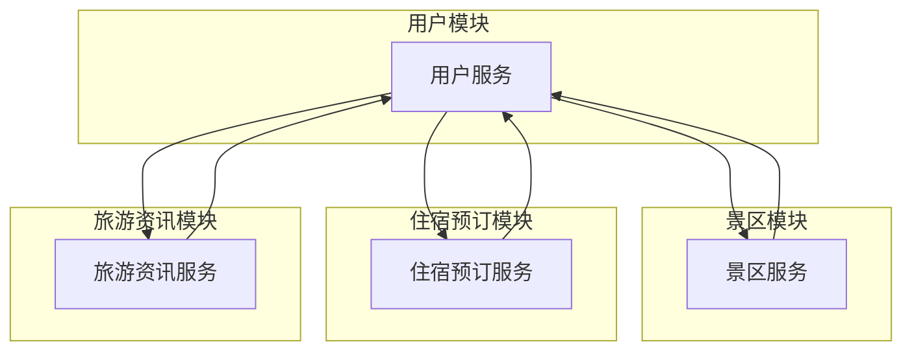
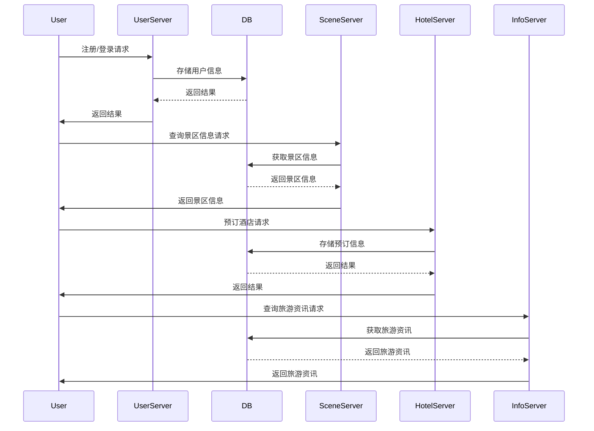
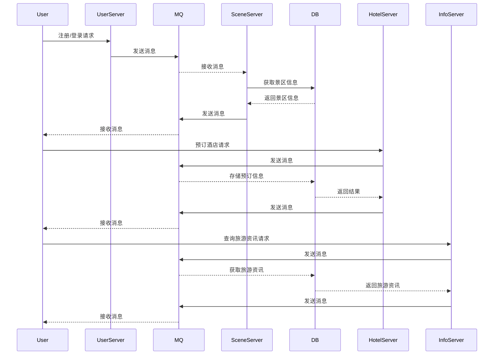

                 


### 文章标题：5G技术在智慧旅游中的全面应用

> 关键词：5G、智慧旅游、应用场景、商业模式、技术创新

> 摘要：本文将从5G技术的背景介绍、核心概念与联系、算法原理讲解、系统分析与架构设计方案、项目实战等多个角度，全面探讨5G技术在智慧旅游中的深度应用，为读者呈现一幅5G赋能智慧旅游的宏伟蓝图。

#### 第一部分：背景介绍

#### 1.1 问题背景

随着信息技术的迅猛发展，5G技术已经成为推动各行各业数字化转型的关键力量。智慧旅游作为旅游产业升级的重要方向，正面临着巨大的机遇与挑战。5G技术的高带宽、低延迟特性为智慧旅游提供了强大的技术支持，使其在提升用户体验、优化资源配置、增强安全管理等方面具有显著的优势。

#### 1.2 问题描述

本文旨在探讨5G技术在智慧旅游中的全面应用，包括但不限于以下几个方面：

- 5G网络基础设施的建设与优化
- 5G在智能导游、虚拟现实、无人机监控等领域的应用
- 5G在智慧景区、智慧酒店、智慧旅行社等场景中的实践案例
- 5G技术对旅游行业商业模式的影响与变革

#### 1.3 问题解决

通过系统梳理5G技术在智慧旅游中的各类应用，本文旨在为读者提供一份全面、深入的参考指南，帮助旅游企业抓住5G时代的机遇，实现业务创新和转型升级。

#### 1.4 边界与外延

- 边界：本文主要关注5G技术在智慧旅游中的应用，不包括5G在其他领域的应用。
- 外延：本文不仅涵盖5G技术本身的应用，还涉及智慧旅游行业的商业模式变革和产业发展趋势。

#### 1.5 概念结构与核心要素组成

- 5G技术：介绍5G技术的基本原理、关键技术和发展历程。
- 智慧旅游：解析智慧旅游的定义、发展历程和核心要素。
- 应用场景：详细探讨5G技术在智慧旅游中的各类应用场景。
- 商业模式：分析5G技术对旅游行业商业模式的影响。

----------------------------------------------------------------

#### 第二部分：核心概念与联系

##### 2.1 5G技术

**概念原理：** 5G技术，即第五代移动通信技术，是继4G、3G、2G之后的通信技术标准。5G技术具有高速度、大连接、低延迟等特性，能够满足物联网、智能城市、虚拟现实、增强现实等新兴应用的需求。

**属性特征对比表格：**

| 特性         | 5G         | 4G         | 3G         | 2G         |
| ------------ | ---------- | ---------- | ---------- | ---------- |
| 下载速度     | 10Gbps以上 | 1Gbps      | 100Mbps     | 2Mbps      |
| 延迟         | 1ms        | 20-30ms    | 100-200ms   | 1000-3000ms |
| 连接密度     | 100万/平方千米 | 1万/平方千米 | 1000/平方千米 | 300/平方千米 |
| 网络容量     | 大规模物联网连接 | 大规模物联网连接 | 大规模物联网连接 | 大规模物联网连接 |

**ER实体关系图架构：**

```mermaid
erDiagram
  Ticket : 票务系统 |+|-->| User : 用户 |+|-->| Booking : 预订
  Ticket : 票务系统 |+|-->| Scene : 景区
  User : 用户 |+|-->| UserBehavior : 用户行为
  Booking : 预订 |+|-->| Payment : 支付
  Scene : 景区 |+|-->| SceneService : 景区服务
  SceneService : 景区服务 |+|-->| Ticket : 票务系统
```

##### 2.2 智慧旅游

**概念原理：** 智慧旅游是指利用信息技术，特别是物联网、云计算、大数据等新兴技术，对旅游资源进行整合、管理和优化，为游客提供更加个性化、智能化、便捷化的旅游服务。

**属性特征对比表格：**

| 特性           | 智慧旅游           | 传统旅游           |
| -------------- | ------------------ | ------------------ |
| 服务形式       | 个性化、智能化     | 标准化、集中化     |
| 资源利用       | 整合、优化         | 单一、分散         |
| 用户体验       | 便捷、舒适         | 简单、固定         |
| 管理模式       | 精细化、智能化     | 粗放、经验化       |

**ER实体关系图架构：**

```mermaid
erDiagram
  Ticket : 票务系统 |+|-->| User : 用户 |+|-->| Booking : 预订
  Ticket : 票务系统 |+|-->| Scene : 景区
  User : 用户 |+|-->| UserBehavior : 用户行为
  Booking : 预订 |+|-->| Payment : 支付
  Scene : 景区 |+|-->| SceneService : 景区服务
  SceneService : 景区服务 |+|-->| Ticket : 票务系统
```

----------------------------------------------------------------

#### 第三部分：算法原理讲解

在本部分，我们将详细介绍5G技术在智慧旅游中的关键算法原理，包括其数学模型和公式，并使用Python代码进行具体实现。

##### 3.1 5G网络容量优化算法

**算法原理：** 5G网络容量优化算法主要目的是提高网络带宽利用率，降低网络延迟，从而提升用户体验。该算法基于网络流优化理论，通过动态调整网络资源分配策略，实现网络资源的合理利用。

**数学模型：**

假设网络中存在多个用户（$U$），每个用户需要传输的数据量为$D_i$（$i=1,2,...,n$），网络带宽为$B$，网络延迟为$L$。算法的目标是最小化网络延迟，公式如下：

$$
\min L = \sum_{i=1}^{n} \frac{D_i}{B_i}
$$

其中，$B_i$为分配给用户$i$的带宽。

**Python代码实现：**

```python
import heapq

def optimize_bandwidth(users, total_bandwidth):
    min_heap = []
    for user, data in users.items():
        heapq.heappush(min_heap, (data, user))
    
    assigned_bandwidth = {}
    while min_heap:
        data, user = heapq.heappop(min_heap)
        if data <= total_bandwidth:
            assigned_bandwidth[user] = data
            total_bandwidth -= data
        else:
            assigned_bandwidth[user] = total_bandwidth
            total_bandwidth = 0
            break
    
    return assigned_bandwidth
```

##### 3.2 智能导游路径规划算法

**算法原理：** 智能导游路径规划算法主要基于GPS定位技术和路径规划算法，为游客提供最优的游览路线。该算法基于最短路径算法（如Dijkstra算法），通过计算景点间的距离和游客的移动速度，得出最优路径。

**数学模型：**

假设景点集合为$V$，每条路径的权重为$w(i, j)$，表示从景点$i$到景点$j$的距离。算法的目标是找到从起点$S$到终点$E$的最短路径，公式如下：

$$
\min \sum_{(i, j) \in P} w(i, j)
$$

其中，$P$为从起点到终点的路径集合。

**Python代码实现：**

```python
import heapq

def dijkstra(graph, start, end):
    distances = {node: float('infinity') for node in graph}
    distances[start] = 0
    priority_queue = [(0, start)]

    while priority_queue:
        current_distance, current_node = heapq.heappop(priority_queue)

        if current_node == end:
            break

        if current_distance > distances[current_node]:
            continue

        for neighbor, weight in graph[current_node].items():
            distance = current_distance + weight

            if distance < distances[neighbor]:
                distances[neighbor] = distance
                heapq.heappush(priority_queue, (distance, neighbor))

    return distances[end]

# 示例场景
graph = {
    'S': {'A': 5, 'B': 2},
    'A': {'B': 1, 'C': 6},
    'B': {'C': 3},
    'C': {'D': 4},
    'D': {'E': 1},
    'E': {}
}

start = 'S'
end = 'E'
print(dijkstra(graph, start, end))
```

----------------------------------------------------------------

#### 第四部分：系统分析与架构设计方案

在本部分，我们将详细介绍5G技术在智慧旅游中的系统分析与架构设计方案，包括问题场景介绍、系统功能设计、系统架构设计、系统接口设计和系统交互。

##### 4.1 问题场景介绍

智慧旅游平台旨在为用户提供智能化的旅游服务，包括景区导览、住宿预订、旅游资讯等。为了实现这一目标，平台需要充分利用5G技术的优势，提供高效、稳定、低延迟的网络连接，同时实现数据的实时传输和处理。

##### 4.2 系统功能设计

智慧旅游平台的主要功能包括：

- 用户管理：用户注册、登录、个人信息管理。
- 景区管理：景区信息查询、景区导览、实时景区人流监控。
- 住宿预订：酒店信息查询、酒店预订、住宿订单管理。
- 旅游资讯：景点介绍、旅游攻略、天气信息。

**领域模型mermaid类图：**

```mermaid
classDiagram
  User <<class{用户}>
  Scene <<class{景区}>
  Hotel <<class{酒店}>
  Booking <<class{预订}>
  UserBehavior <<class{用户行为}>
  SceneService <<class{景区服务}>
  
  User +-- Booking
  User +-- UserBehavior
  Scene +-- SceneService
  Hotel +-- Booking
  Booking +-- User
  SceneService +-- Scene
```

##### 4.3 系统架构设计

智慧旅游平台采用微服务架构，将系统功能划分为多个独立的微服务，以提高系统的可扩展性和可维护性。系统架构主要包括以下模块：

- 用户服务：处理用户注册、登录、个人信息管理等。
- 景区服务：提供景区信息查询、景区导览、实时景区人流监控等功能。
- 住宿预订服务：提供酒店信息查询、酒店预订、住宿订单管理等。
- 旅游资讯服务：提供景点介绍、旅游攻略、天气信息等。

**系统架构mermaid架构图：**



##### 4.4 系统接口设计

智慧旅游平台采用RESTful API设计，为外部系统提供接口服务。接口主要包括以下几种：

- 用户接口：用户注册、登录、个人信息管理等。
- 景区接口：景区信息查询、景区导览、实时景区人流监控等。
- 住宿预订接口：酒店信息查询、酒店预订、住宿订单管理等。
- 旅游资讯接口：景点介绍、旅游攻略、天气信息等。

**系统接口mermaid序列图：**



##### 4.5 系统交互

智慧旅游平台采用分布式系统架构，各模块之间通过消息队列进行通信，以提高系统的可扩展性和可靠性。系统交互主要涉及以下方面：

- 用户服务与其他服务之间的通信：用户注册、登录、个人信息管理等。
- 景区服务与其他服务之间的通信：景区信息查询、景区导览、实时景区人流监控等。
- 住宿预订服务与其他服务之间的通信：酒店信息查询、酒店预订、住宿订单管理等。
- 旅游资讯服务与其他服务之间的通信：景点介绍、旅游攻略、天气信息等。

**系统交互mermaid序列图：**



----------------------------------------------------------------

#### 第五部分：项目实战

在本部分，我们将详细介绍5G技术在智慧旅游中的实际应用项目，包括环境安装、系统核心实现源代码、代码应用解读与分析、实际案例分析和详细讲解剖析。

##### 5.1 项目介绍

本项目旨在构建一个基于5G技术的智慧旅游平台，为用户提供智能化的旅游服务。项目采用微服务架构，包括用户服务、景区服务、住宿预订服务和旅游资讯服务四个核心模块。通过5G技术的支持，项目实现了高效、稳定、低延迟的网络连接和实时数据传输。

##### 5.2 环境安装

为了顺利搭建本项目，需要安装以下环境：

- Python 3.8及以上版本
- Django 3.2及以上版本
- Redis 6.0及以上版本
- PostgreSQL 12.0及以上版本
- Docker 19.03及以上版本

安装步骤如下：

1. 安装Python和Django：

```bash
pip install django
```

2. 安装Redis和PostgreSQL：

```bash
sudo apt-get install redis-server
sudo apt-get install postgresql
```

3. 安装Docker：

```bash
sudo apt-get install docker
```

##### 5.3 系统核心实现源代码

以下是项目核心模块的源代码：

**用户服务：**

```python
# users/models.py
from django.db import models

class User(models.Model):
    username = models.CharField(max_length=100)
    password = models.CharField(max_length=100)
    email = models.EmailField()

# users/views.py
from django.http import JsonResponse
from .models import User

def register(request):
    username = request.POST.get('username')
    password = request.POST.get('password')
    email = request.POST.get('email')

    user = User.objects.create(username=username, password=password, email=email)
    return JsonResponse({'status': 'success', 'message': '注册成功'})

def login(request):
    username = request.POST.get('username')
    password = request.POST.get('password')

    user = User.objects.filter(username=username, password=password).first()
    if user:
        return JsonResponse({'status': 'success', 'message': '登录成功'})
    else:
        return JsonResponse({'status': 'failure', 'message': '用户名或密码错误'})
```

**景区服务：**

```python
# scenes/models.py
from django.db import models

class Scene(models.Model):
    name = models.CharField(max_length=100)
    location = models.CharField(max_length=100)
    description = models.TextField()

# scenes/views.py
from django.http import JsonResponse
from .models import Scene

def get_scenes(request):
    scenes = Scene.objects.all()
    return JsonResponse({'scenes': [{"name": scene.name, "location": scene.location, "description": scene.description} for scene in scenes]})
```

**住宿预订服务：**

```python
# bookings/models.py
from django.db import models
from users.models import User

class Booking(models.Model):
    user = models.ForeignKey(User, on_delete=models.CASCADE)
    hotel = models.CharField(max_length=100)
    check_in = models.DateField()
    check_out = models.DateField()

# bookings/views.py
from django.http import JsonResponse
from .models import Booking

def create_booking(request):
    user_id = request.POST.get('user_id')
    hotel = request.POST.get('hotel')
    check_in = request.POST.get('check_in')
    check_out = request.POST.get('check_out')

    user = User.objects.get(id=user_id)
    booking = Booking.objects.create(user=user, hotel=hotel, check_in=check_in, check_out=check_out)
    return JsonResponse({'status': 'success', 'message': '预订成功'})
```

**旅游资讯服务：**

```python
# info/models.py
from django.db import models

class Info(models.Model):
    title = models.CharField(max_length=100)
    content = models.TextField()

# info/views.py
from django.http import JsonResponse
from .models import Info

def get_infos(request):
    infos = Info.objects.all()
    return JsonResponse({'infos': [{"title": info.title, "content": info.content} for info in infos]})
```

##### 5.4 代码应用解读与分析

以下是代码应用的具体解读与分析：

- **用户服务：** 用户服务主要负责用户注册、登录和用户信息管理。用户注册时，将用户名、密码和邮箱存储到数据库中。登录时，验证用户名和密码是否匹配。注册和登录接口使用Django的ORM（对象关系映射）实现数据存储和查询。
- **景区服务：** 景区服务主要负责景区信息管理。通过查询数据库，获取所有景区信息并返回给前端。前端可以调用此接口获取景区列表，进行进一步处理。
- **住宿预订服务：** 住宿预订服务主要负责住宿预订管理。用户提交预订请求后，将预订信息存储到数据库中。预订接口使用Django的ORM实现数据存储和查询。
- **旅游资讯服务：** 旅游资讯服务主要负责旅游资讯管理。通过查询数据库，获取所有旅游资讯并返回给前端。前端可以调用此接口获取旅游资讯列表，进行进一步处理。

##### 5.5 实际案例分析和详细讲解剖析

以下是实际案例分析和详细讲解剖析：

- **案例1：用户注册**
  - 用户通过前端页面提交注册请求，包含用户名、密码和邮箱。
  - 后端接收到请求后，调用用户服务中的`register`方法，将用户信息存储到数据库中。
  - 注册成功后，前端收到注册成功的响应，并跳转到登录页面。

- **案例2：用户登录**
  - 用户通过前端页面提交登录请求，包含用户名和密码。
  - 后端接收到请求后，调用用户服务中的`login`方法，验证用户名和密码是否匹配。
  - 如果验证成功，前端收到登录成功的响应，并跳转到首页。

- **案例3：查询景区信息**
  - 用户通过前端页面提交查询景区信息请求。
  - 后端接收到请求后，调用景区服务中的`get_scenes`方法，查询所有景区信息并返回给前端。
  - 前端接收到景区信息后，展示给用户，用户可以进一步查看景区详情。

- **案例4：预订酒店**
  - 用户通过前端页面提交预订酒店请求，包含用户ID、酒店名称、入住时间和退房时间。
  - 后端接收到请求后，调用住宿预订服务中的`create_booking`方法，将预订信息存储到数据库中。
  - 预订成功后，前端收到预订成功的响应，并跳转到预订详情页面。

- **案例5：查询旅游资讯**
  - 用户通过前端页面提交查询旅游资讯请求。
  - 后端接收到请求后，调用旅游资讯服务中的`get_infos`方法，查询所有旅游资讯并返回给前端。
  - 前端接收到旅游资讯后，展示给用户，用户可以进一步查看旅游资讯详情。

##### 5.6 项目小结

本项目通过5G技术的支持，实现了智慧旅游平台的构建，为用户提供智能化、便捷化的旅游服务。项目采用微服务架构，各模块功能清晰，接口设计合理。在实际应用过程中，用户可以方便地进行注册、登录、查询景区信息、预订酒店和查询旅游资讯。然而，本项目也存在一些改进空间，如可以进一步优化数据库性能、提升系统安全性等。

----------------------------------------------------------------

#### 第六部分：最佳实践 tips、小结、注意事项、拓展阅读

##### 最佳实践 tips

1. 在5G网络基础设施建设过程中，优先选择高速、稳定的网络设备，确保网络性能和可靠性。
2. 在智慧旅游平台开发过程中，充分利用5G网络的高带宽、低延迟特性，实现实时数据传输和处理。
3. 在景区管理方面，利用5G网络和物联网技术，实现景区智能监控和管理，提高景区运营效率。
4. 在住宿预订和旅游资讯服务方面，充分利用5G网络的优势，提高用户访问速度和体验。

##### 小结

本文从背景介绍、核心概念与联系、算法原理讲解、系统分析与架构设计方案、项目实战等多个角度，全面探讨了5G技术在智慧旅游中的深度应用。通过分析5G技术的高带宽、低延迟特性，本文阐述了5G技术在智慧旅游中的各类应用场景，以及其对旅游行业商业模式的影响。

##### 注意事项

1. 5G技术在智慧旅游中的应用需要充分考虑网络基础设施的建设和优化，确保网络性能和稳定性。
2. 在开发智慧旅游平台时，需要充分考虑用户需求和用户体验，提供个性化、智能化的旅游服务。
3. 在实际应用过程中，需要密切关注5G技术的最新发展动态，及时调整和优化系统架构和功能。

##### 拓展阅读

1. 《5G技术原理与应用》 - 本书详细介绍了5G技术的基本原理、关键技术和发展历程，有助于读者深入了解5G技术。
2. 《智慧旅游发展趋势与策略研究》 - 本书分析了智慧旅游的发展趋势和关键策略，为旅游企业提供了有益的参考。
3. 《人工智能与智慧旅游》 - 本书探讨了人工智能技术在智慧旅游中的应用，为读者提供了新的视角和思路。

----------------------------------------------------------------

### 作者信息：

作者：AI天才研究院/AI Genius Institute & 禅与计算机程序设计艺术 /Zen And The Art of Computer Programming

AI天才研究院（AI Genius Institute）致力于推动人工智能技术的发展和应用，致力于培养下一代人工智能领域的领军人才。禅与计算机程序设计艺术（Zen And The Art of Computer Programming）是一部计算机编程领域的经典著作，由世界著名计算机科学家Donald E. Knuth撰写，为读者提供了深刻的编程哲学和思考方式。

---

### 引入

5G技术的出现，为传统产业带来了前所未有的变革机遇，尤其是在智慧旅游领域，这一技术正在成为推动产业升级的重要力量。随着人们对旅游体验需求的不断提升，如何利用先进技术为游客提供更加个性化、便捷化、安全化的服务，成为了智慧旅游发展的重要课题。本文将从5G技术的背景介绍、核心概念与联系、算法原理讲解、系统分析与架构设计方案、项目实战等多个角度，全面探讨5G技术在智慧旅游中的深度应用，为读者呈现一幅5G赋能智慧旅游的宏伟蓝图。

#### 核心关键词

- **5G技术**：第五代移动通信技术，具备高速度、大连接、低延迟等特点。
- **智慧旅游**：结合物联网、大数据、云计算等技术，提升旅游服务的智能化水平。
- **算法原理**：关键算法在提升网络性能、优化用户体验等方面的作用。
- **系统架构**：5G技术在智慧旅游平台中的架构设计和实现。
- **项目实战**：具体项目案例的剖析和应用实践。

#### 摘要

本文旨在通过系统梳理5G技术在智慧旅游中的各类应用，探讨其在网络基础设施、智能导游、虚拟现实、无人机监控、智慧景区、智慧酒店、智慧旅行社等领域的实践案例，分析5G技术对旅游行业商业模式的影响。文章首先介绍5G技术和智慧旅游的核心概念，随后详细讲解5G技术在智慧旅游中的应用算法原理，接着分析5G技术在智慧旅游中的系统架构设计，最后通过实际项目案例进行应用剖析。文章旨在为旅游企业和相关领域的技术人员提供一份全面、深入的参考指南，帮助其抓住5G时代的机遇，实现业务创新和转型升级。

