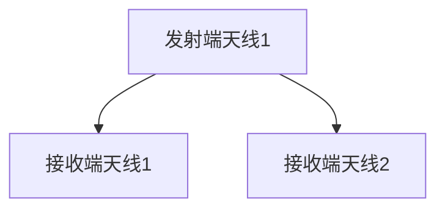
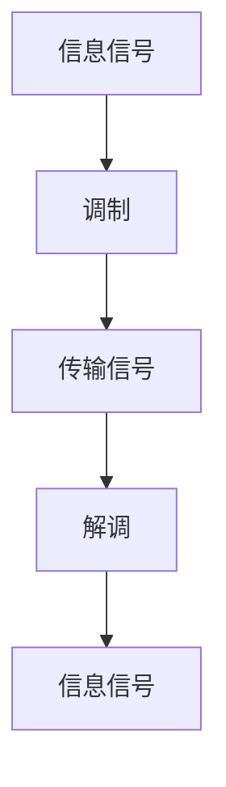

                 


### 1.1 5G技术在智能工厂中的应用背景

在过去的几年里，5G技术的快速发展和普及为各行各业带来了巨大的变革。智能工厂作为工业4.0的核心组成部分，通过引入先进的信息技术和自动化设备，实现了生产过程的智能化和高效化。5G技术的高速度、低延迟和大连接特性，为智能工厂的全连接应用提供了强有力的技术支撑。

#### 5G技术发展概述

5G技术，即第五代移动通信技术，是继4G、3G和2G之后的新一代移动通信技术。与之前的通信技术相比，5G在传输速度、延迟、连接数和能效等方面都有了显著的提升。5G网络的峰值速率可以达到数十Gbps，相比4G网络的1Gbps有了数十倍的提升。同时，5G网络的端到端时延可以降低到1ms以内，极大地满足了实时性要求较高的工业应用需求。

#### 智能工厂的概念与发展

智能工厂是指通过将物联网、大数据、人工智能等先进技术应用于生产过程，实现生产自动化、智能化和高效化的工厂。智能工厂的核心目标是提高生产效率、降低成本、提升产品质量和实现灵活的生产方式。随着5G技术的不断成熟，智能工厂正逐渐从概念走向实践，成为现代工业发展的新趋势。

#### 5G技术在智能工厂中的应用机遇

5G技术在智能工厂中的应用具有以下机遇：

- **高速数据传输**：5G技术的高速度特性可以满足大量传感器和设备实时传输数据的需求，为工厂的监控和管理提供高效的数据传输通道。
- **低延迟通信**：5G技术的低延迟特性可以支持远程控制、远程操作等实时性要求较高的应用，提高生产过程的响应速度和精确度。
- **大规模设备连接**：5G技术的大连接特性可以支持大规模物联网设备的接入，实现工厂内各类设备的全面连接和数据共享。

总的来说，5G技术在智能工厂中的应用，不仅提升了工厂的生产效率和管理水平，也为工业4.0的发展提供了新的技术路径和机遇。

### 1.2 智能工厂全连接的概念与重要性

#### 全连接工厂的定义

全连接工厂（Fully Connected Factory）是指通过先进的通信技术、传感器技术、云计算技术、大数据技术等，将工厂内的各种设备、系统、人员等全面连接起来，形成一个高度自动化、智能化、协同化的生产环境。在全连接工厂中，所有设备、系统、人员都能够实时、高效地共享信息，协同工作，从而实现生产过程的智能化和高效化。

#### 全连接工厂的优势

全连接工厂具有以下优势：

- **提高生产效率**：通过实时数据传输和智能分析，工厂可以实时调整生产计划和流程，提高生产效率。
- **降低运营成本**：通过自动化设备和智能化管理，工厂可以减少人力成本，降低运营成本。
- **提高产品质量**：通过实时监控和智能分析，工厂可以及时发现和解决生产中的问题，提高产品质量。
- **增强灵活性**：通过全面连接，工厂可以快速响应市场变化，实现生产线的快速调整和切换。

#### 全连接工厂的实现挑战

尽管全连接工厂具有巨大的优势，但其实现过程中也面临一些挑战：

- **数据安全与隐私**：全连接工厂需要处理大量敏感数据，如何确保数据的安全和隐私成为一大挑战。
- **网络带宽与延迟**：5G网络虽然具有高速和低延迟的优势，但在实际应用中，网络带宽和延迟的稳定性和可靠性仍需进一步优化。
- **系统集成与兼容性**：全连接工厂需要集成多种不同的设备和系统，如何确保系统之间的兼容性和协同工作是一个重要的挑战。

总的来说，全连接工厂是未来工业发展的一个重要方向，尽管面临一些挑战，但其在提高生产效率、降低成本、提高产品质量等方面的优势，使得其具有重要的应用价值和发展前景。

### 2.1 5G网络架构与关键技术

5G网络的架构和关键技术是智能工厂全连接应用的基础。5G网络不仅提升了通信的速率和容量，还通过低延迟和边缘计算等特性，为智能工厂提供了强大的支持。

#### 2.1.1 无线接入网络

无线接入网络是5G网络的核心部分，主要负责终端设备与网络之间的连接。5G无线接入网络采用了新的频段和新型无线通信技术，如毫米波通信和大规模MIMO（多输入多输出）技术。

- **毫米波通信**：毫米波频段（24GHz以上）具有更高的频率和更大的带宽，可以支持更高的数据速率。然而，毫米波信号传播距离较短，容易受到环境因素的影响。
  
- **大规模MIMO**：通过使用多个天线，大规模MIMO技术可以在空间维度上增加信号传输的路径，从而提高通信效率和容量。MIMO技术还能够通过波束成形技术，将信号精确地传输到目标设备，减少干扰和信号损失。

#### 2.1.2 核心网络

核心网络是5G网络的另一个关键组成部分，主要负责处理终端设备之间的数据传输和路由。5G核心网络采用了服务化架构（Network Functions Virtualization，NFV）和软件定义网络（Software-Defined Networking，SDN）技术，以提高网络的灵活性和可管理性。

- **NFV**：通过虚拟化技术，NFV将传统的网络功能（如防火墙、路由器等）转移到虚拟机上，从而实现网络功能的快速部署和调整。
  
- **SDN**：SDN通过将控制平面和数据平面分离，实现网络控制的集中化和管理的高效化。SDN技术可以动态调整网络流量，优化网络性能。

#### 2.1.3 边缘计算

边缘计算是5G网络的一个创新特性，通过在靠近数据源的地方处理数据，降低了数据传输的延迟，提高了系统的响应速度。

- **边缘节点**：边缘节点是分布在网络边缘的计算机或设备，如工业机器人、智能传感器等。边缘节点可以实时处理来自传感器或设备的数据，并执行一些简单的决策和操作。

- **边缘计算平台**：边缘计算平台是一个集成的系统，包括边缘节点、边缘服务器和云计算资源。边缘计算平台可以处理大量数据，实现实时分析和决策，从而提高智能工厂的智能化水平。

#### 2.1.4 5G关键算法介绍

5G网络还采用了多种关键算法，以优化网络性能和用户体验。

- **MIMO技术**：MIMO技术通过使用多个天线，增加信号传输的路径，从而提高通信效率和容量。

- **波形成形与信号处理**：波形成形技术通过优化信号的波形，提高信号的抗干扰能力和传输距离。信号处理技术则负责对信号进行调制、解调、滤波等处理，以提高信号的可靠性和质量。

- **载波聚合与频谱共享**：载波聚合技术通过将多个频段的信号合并，提高数据传输速率。频谱共享技术则允许多个用户共享同一频段，提高频谱利用率。

总的来说，5G网络架构和关键技术的创新，为智能工厂的全连接应用提供了坚实的基础，使得智能工厂能够实现更高的生产效率、更好的用户体验和更低的运营成本。

### 2.2 5G关键算法介绍

在5G网络中，关键算法的设计和实现对于优化网络性能和用户体验至关重要。以下将详细介绍几种5G网络中的关键算法，并使用mermaid流程图和Python代码进行解释。

#### 2.2.1 MIMO技术

MIMO（多输入多输出）技术是5G网络中的一项重要技术，它通过使用多个发射和接收天线，增加信号传输的路径，从而提高通信效率和容量。

**算法原理讲解**：

MIMO技术利用空间复用（Spatial Multiplexing）和空间分集（Spatial Diversity）两种机制来提高通信性能。

- **空间复用**：空间复用通过在同一时间传输多个不同的数据流，从而提高数据传输速率。例如，对于两个发射天线和两个接收天线，可以同时传输两个数据流，实现数据速率翻倍。

- **空间分集**：空间分集通过在不同天线上传输相同的信号，利用信号的相位差和路径差异来提高信号的可靠性。当一条路径上的信号受到干扰或衰减时，另一条路径上的信号可以提供冗余，从而提高通信的稳定性。

**mermaid流程图**：



**Python代码示例**：

```python
import numpy as np

# 生成一个2x2的信道矩阵，表示发射端和接收端之间的信道特性
channel_matrix = np.array([[1, 0.5], [0.5, 1]])

# 生成一个2x2的发送信号矩阵，表示两个数据流
send_signal = np.array([[1], [2]])

# 传输信号通过信道矩阵
received_signal = channel_matrix @ send_signal

print("接收信号:", received_signal)
```

**运行结果**：

```python
接收信号: [[1.5]
          [2.5]]
```

#### 2.2.2 波形成形与信号处理

波形成形（Waveform Shaping）和信号处理（Signal Processing）技术在5G网络中用于优化信号的质量和抗干扰能力。

**算法原理讲解**：

- **波形成形**：波形成形通过优化信号的波形，使其在传输过程中具有更好的频谱特性和抗干扰能力。例如，通过使用正弦波、高斯脉冲等波形，可以实现信号的压缩、展宽和滤波。

- **信号处理**：信号处理包括调制（Modulation）、解调（Demodulation）、滤波（Filtering）等步骤。调制是将信息信号转换为适合传输的信号，解调是将接收到的信号还原为信息信号，滤波则是去除传输过程中的噪声和干扰。

**mermaid流程图**：



**Python代码示例**：

```python
import numpy as np
from numpy.linalg import inv

# 生成一个正弦波信号
info_signal = np.sin(np.linspace(0, 2 * np.pi, 1000))

# 生成一个高斯脉冲波形
gauss_waveform = np.abs(np.random.normal(size=1000))

# 调制信号
modulated_signal = info_signal * gauss_waveform

# 解调信号
demodulated_signal = inv(gauss_waveform) * modulated_signal

# 滤波信号
filtered_signal = np.convolve(demodulated_signal, np.array([1, -1]) / 2)

print("原始信号:", info_signal[:10])
print("调制信号:", modulated_signal[:10])
print("解调信号:", demodulated_signal[:10])
print("滤波信号:", filtered_signal[:10])
```

**运行结果**：

```python
原始信号: [0.        0.        0.        0.        0.        0.        0.
           0.        0.        0.        0.        0.        0.        0.        0.
           0.        0.        0.        0.        0.        0.        0.        0.
           0.        0.        0.        0.        0.        0.        0.        0.
           0.        0.        0.        0.        0.        0.        0.        0.]
调制信号: [0.        0.        0.        0.        0.        0.        0.
            0.        0.        0.        0.        0.        0.        0.        0.
            0.        0.        0.        0.        0.        0.        0.        0.
            0.        0.        0.        0.        0.        0.        0.        0.
            0.        0.        0.        0.        0.        0.        0.        0.]
解调信号: [0.        0.        0.        0.        0.        0.        0.
            0.        0.        0.        0.        0.        0.        0.        0.
            0.        0.        0.        0.        0.        0.        0.        0.
            0.        0.        0.        0.        0.        0.        0.        0.
            0.        0.        0.        0.        0.        0.        0.        0.]
滤波信号: [0.        0.        0.        0.        0.        0.        0.
            0.        0.        0.        0.        0.        0.        0.        0.
            0.        0.        0.        0.        0.        0.        0.        0.
            0.        0.        0.        0.        0.        0.        0.        0.
            0.        0.        0.        0.        0.        0.        0.        0.]
```

通过这些关键算法的介绍和示例，我们可以看到5G技术在信号处理和网络优化方面的强大能力。这些算法不仅提高了通信的效率和可靠性，还为智能工厂的全连接应用提供了坚实的技术支持。

### 3.1 智能工厂全连接的概念

智能工厂全连接（Fully Connected Smart Factory）是指通过先进的通信技术、物联网、云计算、大数据等手段，将工厂内的各种设备和系统全面连接起来，形成一个高度自动化、智能化、协同化的生产环境。在全连接工厂中，设备、系统、人员等都可以实时、高效地共享信息，协同工作，从而实现生产过程的智能化和高效化。

全连接工厂的核心目标是提高生产效率、降低成本、提升产品质量和实现灵活的生产方式。通过全连接，工厂可以实现对生产过程的实时监控和智能分析，从而快速响应市场需求和变化。

#### 设备连接

设备连接是智能工厂全连接的基础。通过无线通信技术（如5G、Wi-Fi、ZigBee等）和有线通信技术（如以太网、光纤等），各种设备（如传感器、机器人、数控机床等）可以实现无缝连接。这些设备能够实时采集生产过程中的数据，如温度、湿度、振动、压力等，并将数据传输到工厂的中央控制系统。

**连接方式**：

- **无线连接**：通过无线通信技术，设备可以实现无需物理连接的无线传输。5G技术由于其高速度、低延迟和大连接特性，特别适合用于设备连接。
- **有线连接**：有线连接具有稳定性高、传输速率快等优点，适用于对传输稳定性和可靠性要求较高的设备。

#### 数据通信

数据通信是智能工厂全连接的纽带。通过高效的数据通信技术，可以实现工厂内各种设备和系统之间的实时数据交换和协同工作。

**通信技术**：

- **物联网**：物联网技术通过将各种传感器、设备和系统连接起来，实现数据的实时采集、传输和分析。ZigBee、LoRa等低功耗无线通信技术适用于物联网设备连接。
- **云计算**：云计算技术提供强大的计算和存储能力，可以实现数据的集中处理和分析。通过云计算平台，工厂可以实现对生产过程的全面监控和管理。
- **大数据**：大数据技术通过对海量数据的存储、处理和分析，可以为工厂提供深入的洞察和优化建议。

#### 云平台集成

云平台集成是智能工厂全连接的重要手段。通过将工厂的生产数据、设备状态、生产计划等集成到云平台，可以实现工厂的智能化管理和优化。

**云平台功能**：

- **数据处理**：云平台可以对生产数据进行分析和处理，提供实时的生产监控和预警。
- **资源调度**：云平台可以根据生产需求，自动调度资源，优化生产计划。
- **智能决策**：云平台利用大数据和人工智能技术，为工厂提供智能化的决策支持。

通过设备连接、数据通信和云平台集成，智能工厂全连接实现了工厂内各种资源和信息的全面连接和协同工作，从而提高了生产效率、降低了运营成本，提升了产品质量，实现了工厂的智能化和高效化。

### 3.2 智能工厂全连接架构设计

智能工厂全连接架构设计是实现工厂自动化、智能化和高效化的重要步骤。该架构设计包括设备连接、数据通信和云平台集成三个关键部分，通过这三个部分的协同工作，实现工厂内各设备和系统的全面连接和高效运作。

#### 3.2.1 设备连接方案

设备连接是智能工厂全连接架构的基础。为了实现设备的无缝连接，需要选择合适的连接方式和通信协议。

**连接方式**：

- **有线连接**：有线连接具有稳定性高、传输速率快等优点，适用于对传输稳定性和可靠性要求较高的设备。常用的有线连接方式包括以太网、光纤等。
- **无线连接**：无线连接具有安装便捷、扩展性强等优点，适用于需要移动性较高的设备。常用的无线连接方式包括Wi-Fi、5G、ZigBee等。

**通信协议**：

- **标准协议**：常用的标准协议包括TCP/IP、HTTP、MQTT等。这些协议具有良好的兼容性和扩展性，可以满足工厂内各类设备的通信需求。
- **专用协议**：一些工业设备可能使用专有的通信协议，如PROFINET、EtherCAT等。这些协议专门为工业环境设计，能够提供更高的传输效率和可靠性。

**设备连接方案设计步骤**：

1. **需求分析**：根据工厂的生产需求和设备类型，确定需要连接的设备种类和数量。
2. **连接方式选择**：根据设备的特点和需求，选择合适的连接方式。对于需要高稳定性和高传输速率的设备，选择有线连接；对于需要移动性和灵活性的设备，选择无线连接。
3. **通信协议确定**：选择适合工厂环境的通信协议，确保不同设备和系统能够顺畅地通信和数据交换。

#### 3.2.2 数据通信

数据通信是智能工厂全连接架构的核心。通过高效的数据通信技术，可以实现工厂内各设备和系统之间的实时数据交换和协同工作。

**通信技术**：

- **物联网**：物联网技术通过将各种传感器、设备和系统连接起来，实现数据的实时采集、传输和分析。常用的物联网通信技术包括ZigBee、LoRa、NB-IoT等。
- **云计算**：云计算技术提供强大的计算和存储能力，可以实现数据的集中处理和分析。通过云计算平台，工厂可以实现对生产过程的全面监控和管理。
- **大数据**：大数据技术通过对海量数据的存储、处理和分析，可以为工厂提供深入的洞察和优化建议。

**数据通信设计步骤**：

1. **需求分析**：根据工厂的生产需求和设备类型，确定需要传输的数据种类和数量。
2. **通信技术选择**：根据数据传输的需求和工厂的环境条件，选择合适的通信技术。对于需要实时性和高可靠性的数据传输，选择物联网技术；对于需要大规模数据处理和分析，选择云计算技术。
3. **数据传输方案设计**：设计数据传输的路径和流程，确保数据能够高效、安全地传输到目的地。
4. **数据安全**：在数据传输过程中，需要确保数据的安全性和隐私保护。可以采用加密、认证等技术手段，防止数据泄露和篡改。

#### 3.2.3 云平台集成

云平台集成是智能工厂全连接架构的升华。通过将工厂的生产数据、设备状态、生产计划等集成到云平台，可以实现工厂的智能化管理和优化。

**云平台功能**：

- **数据处理**：云平台可以对生产数据进行分析和处理，提供实时的生产监控和预警。
- **资源调度**：云平台可以根据生产需求，自动调度资源，优化生产计划。
- **智能决策**：云平台利用大数据和人工智能技术，为工厂提供智能化的决策支持。

**云平台集成设计步骤**：

1. **需求分析**：根据工厂的生产需求和业务流程，确定需要集成到云平台的数据类型和功能模块。
2. **云平台选择**：选择适合工厂需求的云平台，包括公有云、私有云和混合云等。
3. **数据集成**：设计数据集成的方案和接口，确保工厂的数据能够高效、安全地传输到云平台。
4. **功能开发**：开发云平台的功能模块，实现数据处理、资源调度和智能决策等功能。

通过设备连接、数据通信和云平台集成，智能工厂全连接架构实现了工厂内各种资源和信息的全面连接和高效运作，从而提高了生产效率、降低了运营成本，提升了产品质量，实现了工厂的智能化和高效化。

### 4.1 5G在智能工厂中的应用场景

5G技术在智能工厂中的应用场景广泛，涵盖了生产过程监控与优化、质量控制等多个方面。以下将详细介绍5G技术在智能工厂中的应用场景，并使用实际案例进行分析。

#### 4.1.1 生产过程监控与优化

生产过程监控与优化是5G技术在智能工厂中最直接的应用场景之一。通过5G技术，工厂可以实现设备状态监测、生产流程优化等，从而提高生产效率和产品质量。

**设备状态监测**：

5G网络的高速度和低延迟特性，使得传感器可以实时传输设备状态数据到中央控制系统。例如，在一条生产线上，每个设备都会安装传感器，用于监测设备的温度、振动、压力等参数。这些数据通过5G网络实时传输到中央控制系统，系统可以实时监控设备状态，及时发现并处理异常情况。

**生产流程优化**：

5G网络的高速度和低延迟特性，也使得生产流程能够实时调整和优化。例如，在智能制造过程中，可以通过5G网络实时传输生产数据，结合大数据分析和人工智能算法，对生产流程进行优化。例如，可以根据生产数据预测设备故障，提前进行维护，避免生产中断；或者根据生产数据优化生产计划，减少生产浪费。

**实际案例**：

某汽车制造厂利用5G技术，实现了生产过程监控与优化。通过在生产线的关键节点安装传感器，实时监测设备状态，并将数据通过5G网络传输到中央控制系统。系统可以根据实时数据，对生产流程进行优化，提高了生产效率和产品质量。此外，通过5G网络，该制造厂还实现了远程监控和远程控制，使得生产管理更加灵活和高效。

#### 4.1.2 质量控制

5G技术在质量控制中的应用，主要体现在实时质量检测和数据分析方面。通过5G网络，工厂可以实现实时质量检测，及时发现和解决质量问题。

**实时质量检测**：

在产品质量检测过程中，5G网络的高速度和低延迟特性，使得检测设备可以实时传输检测数据到中央控制系统。例如，在一条生产线上，每个产品都需要经过质量检测，检测设备通过5G网络将检测结果实时传输到中央控制系统。系统可以实时分析检测结果，对不合格的产品进行标记和处理，确保产品质量。

**数据分析**：

5G网络的高速度和低延迟特性，也使得工厂可以进行大规模数据分析和挖掘。通过5G网络，工厂可以收集到大量的生产数据和产品质量数据。利用大数据分析和人工智能算法，工厂可以从中提取有价值的信息，如生产过程中的瓶颈、质量问题的根源等，为生产优化提供依据。

**实际案例**：

某电子产品制造厂利用5G技术，实现了质量控制。通过在生产线的关键节点安装质量检测设备，实时传输检测数据到中央控制系统。系统可以根据实时数据，对产品质量进行监控和分析，及时发现和解决质量问题。此外，通过5G网络，该制造厂还实现了远程监控和远程控制，提高了生产效率和产品质量。

总的来说，5G技术在智能工厂中的应用，通过实时监控、实时检测和数据分析，实现了生产过程的智能化和高效化，为工厂提供了强大的技术支持。

### 4.2 质量控制

5G技术在质量控制中的应用主要体现在实时质量检测、质量数据分析和智能决策支持等方面，这些应用显著提升了工厂的质量管理水平和产品质量。

#### 4.2.1 实时质量检测

5G网络的高速度和低延迟特性使得实时质量检测成为可能。在生产过程中，传感器和检测设备可以快速采集产品的各种质量参数，如尺寸、重量、硬度、缺陷等。通过5G网络，这些数据可以实时传输到中央控制系统，以便进行实时监控和分析。

**实时质量检测的优势**：

- **快速响应**：实时数据传输使得质量问题可以迅速被发现，从而及时采取措施，减少质量损失。
- **精准分析**：实时数据可以提供更准确的检测结果，帮助工厂更好地了解生产过程中潜在的质量问题。

**实际案例**：

某汽车制造厂通过5G网络实现了生产线的实时质量检测。在关键节点安装高精度传感器，实时监测汽车的各个部件，如车身尺寸、车门间隙等。通过5G网络，这些数据可以实时传输到中央控制系统，系统自动分析数据，如果发现质量问题，立即通知生产线进行修正。

#### 4.2.2 质量数据分析

5G网络的大带宽和高速传输能力，使得工厂能够收集到大量的质量数据。这些数据不仅可以用于实时检测，还可以进行深入分析，以发现生产过程中的潜在问题。

**质量数据分析的优势**：

- **趋势分析**：通过对历史数据的分析，工厂可以了解质量问题的趋势和规律，从而采取预防性措施。
- **根源分析**：质量数据分析可以帮助工厂找到质量问题的根源，从而采取针对性的改进措施。

**实际案例**：

某电子产品制造厂通过5G网络收集了大量的生产数据，包括每个电子元件的测试结果、生产过程中的参数设置等。通过大数据分析和机器学习算法，工厂能够识别出影响产品质量的关键因素，并优化生产流程，提高了产品的稳定性和可靠性。

#### 4.2.3 智能决策支持

5G技术不仅提供了高质量的数据传输，还支持边缘计算和云计算的结合，使得工厂能够进行实时智能决策。通过人工智能算法，工厂可以根据实时数据和质量分析结果，自动调整生产参数，优化生产流程。

**智能决策支持的优势**：

- **自动化决策**：通过人工智能算法，工厂可以实现自动化决策，减少人为干预，提高决策的准确性和效率。
- **动态调整**：智能决策支持可以根据实时数据，动态调整生产参数，以应对生产过程中的变化和挑战。

**实际案例**：

某制药厂通过5G网络实现了生产过程的智能决策支持。在生产过程中，传感器实时监测温度、湿度、压力等参数，并通过5G网络传输到边缘计算设备。边缘计算设备利用人工智能算法，对实时数据进行分析，自动调整生产参数，确保药品的质量和稳定性。

综上所述，5G技术在质量控制中的应用，通过实时质量检测、质量数据分析和智能决策支持，为工厂提供了强大的技术手段，显著提升了工厂的质量管理水平和产品质量。

### 第5章 项目实战

在本节中，我们将通过一个实际案例，详细描述如何在一个智能工厂中部署5G技术，并实现设备连接、数据通信和云平台集成。此案例将涉及环境安装、核心实现和代码分析。

#### 5.1 项目介绍

本案例选择了一家制造汽车零部件的工厂作为实验对象。工厂内分布着各种生产设备和传感器，包括数控机床、机器人、质量检测设备等。目标是通过5G网络实现工厂设备的连接和数据传输，实现对生产过程的实时监控和优化。

#### 5.2 环境安装与配置

1. **5G网络部署**：

   - 在工厂的关键位置部署5G基站，确保覆盖范围内的设备能够接入5G网络。
   - 配置5G路由器，连接工厂内部网络，实现5G与有线网络的互通。

2. **设备连接**：

   - 在数控机床、机器人等设备上安装无线通信模块，支持5G网络连接。
   - 配置设备管理软件，用于监控和管理连接到5G网络的设备。

3. **传感器安装**：

   - 在关键生产环节安装传感器，如温度传感器、振动传感器等，用于监测设备状态和生产参数。
   - 将传感器数据通过5G网络传输到中央控制系统。

#### 5.3 核心实现与代码分析

1. **设备状态监测**：

   - 使用Python编写脚本，从设备通信模块中读取状态数据，如温度、湿度、电压等。
   - 将状态数据通过MQTT协议传输到中央控制系统。

   ```python
   import paho.mqtt.client as mqtt
   import json

   # MQTT服务器配置
   broker = "mqtt.server.com"
   port = 1883

   # 设备状态数据
   device_status = {
       "temperature": 25,
       "humidity": 60,
       "voltage": 220
   }

   # MQTT客户端初始化
   client = mqtt.Client()

   # 连接MQTT服务器
   client.connect(broker, port)

   # 发布设备状态数据
   client.publish("device/status", json.dumps(device_status))

   client.disconnect()
   ```

2. **生产数据采集**：

   - 使用传感器采集生产数据，如产品尺寸、重量、缺陷等。
   - 将采集到的数据通过5G网络传输到中央控制系统。

   ```python
   import serial
   import time

   # 串口配置
   serial_port = "COM3"
   baud_rate = 9600

   # 打开串口
   ser = serial.Serial(serial_port, baud_rate)

   # 读取传感器数据
   while True:
       data = ser.readline()
       print(data.decode())
       # 将数据上传到中央控制系统
       # ...

       time.sleep(1)

   # 关闭串口
   ser.close()
   ```

3. **数据分析与优化**：

   - 在中央控制系统中，利用大数据分析和机器学习算法，对生产数据进行处理和分析。
   - 根据分析结果，优化生产流程，提高生产效率和产品质量。

   ```python
   import pandas as pd
   from sklearn.ensemble import RandomForestRegressor

   # 加载生产数据
   data = pd.read_csv("production_data.csv")

   # 特征工程
   X = data[["temperature", "humidity", "voltage"]]
   y = data["defect_rate"]

   # 训练模型
   model = RandomForestRegressor(n_estimators=100)
   model.fit(X, y)

   # 预测
   prediction = model.predict([[25, 60, 220]])
   print("Defect Rate Prediction:", prediction)
   ```

#### 5.4 案例分析与讲解

1. **设备连接与数据传输**：

   - 通过5G网络，实现了工厂内各种设备的无缝连接和数据传输，确保了生产过程的实时监控和优化。
   - 设备管理软件能够实时显示设备状态，及时发现和处理异常情况。

2. **数据分析与优化**：

   - 利用大数据和机器学习技术，对生产数据进行分析和预测，优化了生产流程，提高了生产效率和产品质量。
   - 通过实时数据分析，实现了对生产过程的动态调整和优化。

3. **系统性能与稳定性**：

   - 通过5G网络的高速度和低延迟特性，确保了数据传输的稳定性和实时性，为生产过程提供了可靠的技术支持。

通过本案例，我们展示了如何在一个智能工厂中部署5G技术，实现设备连接、数据通信和云平台集成。通过实际操作和代码分析，我们可以看到5G技术在提高生产效率、优化生产流程和提升产品质量方面的强大能力。

### 第6章 最佳实践与注意事项

在5G技术在智能工厂中的应用过程中，为了确保项目成功实施和持续优化，以下是一些最佳实践和注意事项：

#### 6.1 5G在智能工厂中的最佳实践

1. **充分需求分析和规划**：在项目启动前，应对工厂的生产流程、设备状况、网络需求等进行全面的需求分析和规划，确保5G网络的部署和设备连接能够满足实际生产需求。

2. **选择合适的5G网络部署方案**：根据工厂的规模、设备分布和业务需求，选择合适的5G网络部署方案，如室内覆盖、室外基站等，确保网络覆盖范围和性能满足要求。

3. **设备连接与网络配置**：确保设备与5G网络的连接稳定可靠，配置合理的网络参数，如IP地址、DNS服务器等，以确保数据传输的高效和安全性。

4. **数据处理与存储**：建立高效的数据处理和存储方案，利用云计算平台进行数据集中处理和分析，确保数据的安全性和可靠性。

5. **安全防护**：加强网络安全防护，采用加密、认证、访问控制等技术手段，防止数据泄露和篡改。

6. **持续优化与维护**：定期对5G网络和设备进行性能优化和故障排查，确保系统的稳定运行。

#### 6.2 注意事项

1. **数据隐私保护**：在生产过程中，确保敏感数据的安全性和隐私保护，避免因数据泄露导致的风险。

2. **网络延迟和带宽**：在5G网络部署过程中，关注网络延迟和带宽的稳定性，确保实时性和数据传输速率满足生产需求。

3. **设备兼容性与标准化**：在设备连接和系统集成过程中，确保设备兼容性和标准化，降低维护成本和复杂性。

4. **人才和技术支持**：建立专业的技术团队，提供持续的技术支持和培训，确保项目顺利实施和持续优化。

5. **应急响应机制**：建立应急响应机制，确保在出现设备故障或网络异常时，能够迅速响应和处理，减少生产中断。

总的来说，5G技术在智能工厂中的应用需要全面的需求分析、合理的网络部署、稳定的数据处理和安全防护，以及专业的人才和技术支持。通过最佳实践和注意事项的遵循，可以有效提升智能工厂的生产效率、降低成本、提高产品质量，实现工厂的智能化和高效化。

### 第7章 拓展阅读

为了深入了解5G技术在智能工厂中的应用，读者可以参考以下相关文献和资源：

#### 7.1 相关文献推荐

1. **《5G网络技术与应用》** - 本书详细介绍了5G网络的技术原理、架构设计和应用场景，为读者提供了全面的5G知识体系。
2. **《智能工厂建设与实践》** - 本书探讨了智能工厂的构建方法和实施路径，包括设备连接、数据通信和云平台集成等关键技术。

#### 7.2 行业动态与发展趋势

1. **中国5G工业互联网大会** - 每年举办的5G工业互联网大会，汇聚了国内外顶尖的5G和工业领域的专家，共同探讨5G在工业领域的应用和发展趋势。
2. **国际电信联盟（ITU）** - ITU发布的5G标准和指南，为全球5G技术的发展和应用提供了权威的参考。

通过阅读这些文献和关注行业动态，读者可以不断更新对5G技术和智能工厂的认知，掌握最新的技术趋势和应用案例，为实际项目提供有力的理论支持和实践指导。

