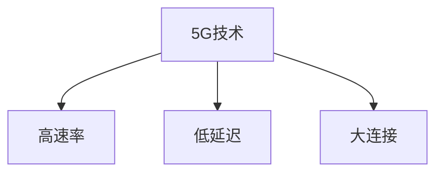
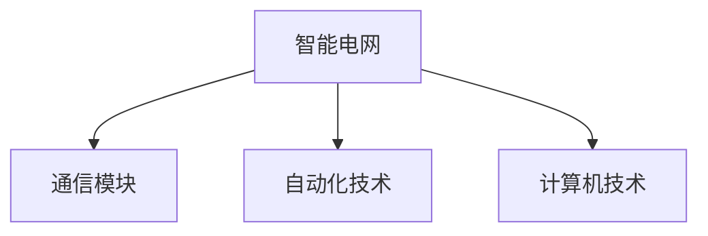
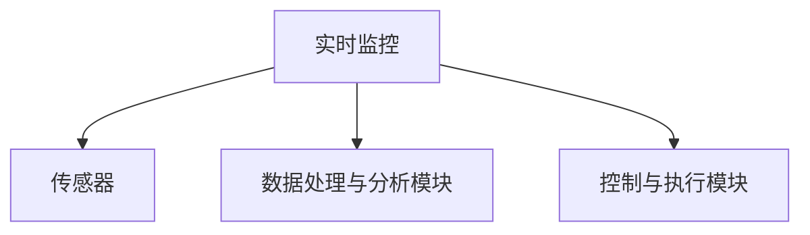
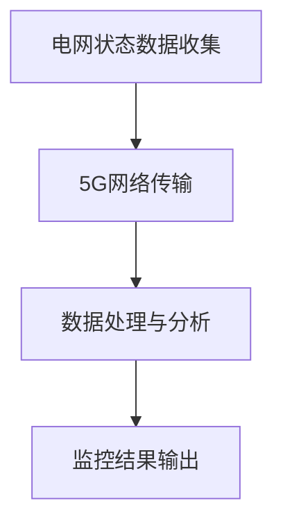
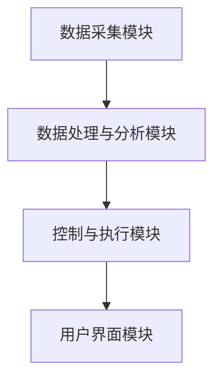
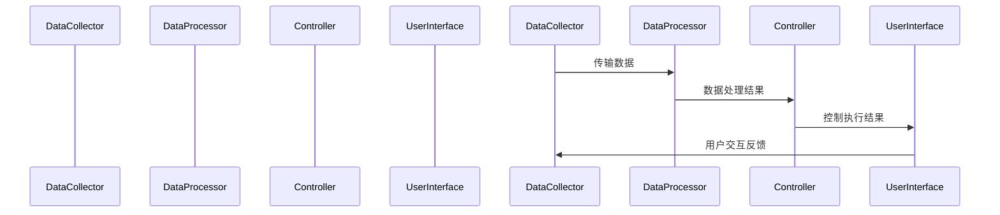

                 

### 《5G技术在智能电网实时监控中的应用》

#### 关键词

- 5G技术
- 智能电网
- 实时监控
- 数据传输
- 算法设计

#### 摘要

本文旨在探讨5G技术在智能电网实时监控中的应用。首先，文章将介绍5G技术、智能电网以及实时监控这三个核心概念，并通过对比分析展示它们各自的特点和重要性。接着，我们将深入探讨5G技术在智能电网实时监控中的应用算法原理，结合Python代码实例进行详细讲解。最后，文章将提供一个系统分析与架构设计方案，以展示如何在实际项目中应用5G技术实现智能电网的实时监控，并探讨项目实战中的最佳实践和注意事项。

---

### 第一部分：背景介绍

#### 核心概念

##### 5G技术

5G技术，即第五代移动通信技术，是继4G、3G和2G之后的最新一代移动通信技术。它具备高速率、低延迟和大连接等特点，为智能电网的实时监控提供了强大的技术支持。

**高速率**：5G网络的理论峰值下载速度可以达到10Gbps，是4G的100倍，这为大量数据的实时传输提供了可能。

**低延迟**：5G的延迟时间可低至1ms，远低于4G的20-60ms，3G的150-200ms，2G的300-500ms。低延迟意味着实时响应能力更强，这对于电网的实时监控至关重要。

**大连接**：5G技术可以实现每平方公里内连接100万台设备，这意味着智能电网中的传感器、控制设备等可以无缝连接，实现高度集成的实时监控。

##### 智能电网

智能电网是利用现代通信技术、自动化技术和计算机技术构建的电力网络。它不仅能够提供稳定的电力供应，还能实现电网的实时监控、自适应控制和高效管理。

**现代通信技术**：通过5G、4G等无线通信技术，智能电网可以实现远程数据传输和控制。

**自动化技术**：智能电网采用自动化控制系统，可以自动调节电力供应，提高电网的运行效率。

**计算机技术**：智能电网利用大数据、云计算等技术，对电力系统进行实时监控和分析，为电网优化提供数据支持。

##### 实时监控

实时监控是对电网运行状态进行实时、连续的监测和控制。它包括以下几个关键组成部分：

**传感器**：实时采集电网的电压、电流、温度等数据。

**数据处理与分析模块**：对采集到的数据进行实时处理和分析，发现潜在问题。

**控制与执行模块**：根据分析结果，对电网进行实时调节，确保电网稳定运行。

#### 问题背景

随着电力需求的不断增长和电力系统的复杂化，传统的电网监控技术已无法满足实时性和高效性的要求。传统的监控方式通常依赖于有线通信，存在数据传输速度慢、延迟高、易受干扰等问题。此外，随着分布式能源的普及，电网变得更加复杂，需要更高的监控能力和更灵活的控制策略。

为了解决这些问题，智能电网和5G技术的结合成为必然趋势。5G技术的高速率和低延迟特点，使得实时数据传输和监控成为可能，从而提高电网的运行效率和安全性。

#### 问题解决

利用5G技术的高速率和低延迟，可以实现智能电网的实时数据传输和监控，从而提高电网的运行效率和安全性。具体来说，5G技术可以解决以下问题：

1. **实时数据传输**：5G网络的高速率可以支持大量数据的实时传输，使得传感器采集的数据能够迅速传送到数据处理与分析模块，实现实时监控。

2. **低延迟控制**：5G网络的低延迟可以确保电网的实时响应，使得控制系统能够迅速作出反应，避免电网故障的发生。

3. **高可靠性**：5G技术采用先进的通信协议和加密技术，提高了通信的可靠性，保证了电网数据的安全。

#### 边界与外延

- **边界**：本文主要研究5G技术在智能电网实时监控中的应用，不涉及其他通信技术在电网监控中的应用。

- **外延**：5G技术不仅应用于智能电网的实时监控，还可以应用于其他电力系统的优化和改进，如电力负荷预测、分布式能源管理、电力市场交易等。

#### 概念结构与核心要素组成

智能电网实时监控的概念结构主要包括5G技术、智能电网和实时监控三个核心要素。这些要素相互关联，共同构成了智能电网实时监控的整体框架。

- **5G技术**：作为通信基础设施，5G技术为智能电网的实时监控提供了高速率、低延迟、高可靠性的数据传输通道。

- **智能电网**：作为监控对象，智能电网利用5G技术实现数据的实时采集、传输和处理，从而实现对电网运行状态的实时监控。

- **实时监控**：作为监控手段，实时监控通过传感器、数据处理与分析模块和控制与执行模块，实现对电网运行状态的实时监测和调控。

这些要素相互配合，共同构成了智能电网实时监控的完整体系。

### 第二部分：核心概念与联系

#### 5G技术

5G技术是第五代移动通信技术，具有高速率、低延迟和大连接等特点。以下是5G技术的核心概念、属性特征对比表格和ER实体关系图架构。

**核心概念**：

- **高速率**：5G网络的理论峰值下载速度可以达到10Gbps，远高于4G、3G和2G。
- **低延迟**：5G的延迟时间可低至1ms，使得实时响应成为可能。
- **大连接**：5G技术可以实现每平方公里内连接100万台设备，支持大规模物联网应用。

**属性特征对比表格**：

| 特点       | 5G        | 4G        | 3G        | 2G        |
| ---------- | ---------- | ---------- | ---------- | ---------- |
| 下载速度   | 10Gbps    | 1Gbps     | 100Mbps   | 100kbps   |
| 延迟       | 1ms       | 20-60ms   | 150-200ms | 300-500ms |
| 连接密度   | 100万台/km² | 10万台/km² | 1万台/km² | 1000台/km² |

**ER实体关系图架构**：



#### 智能电网

智能电网是一种基于现代通信技术、自动化技术和计算机技术的电力网络，具有自适应、可控和安全等特点。以下是智能电网的核心概念、属性特征对比表格和ER实体关系图架构。

**核心概念**：

- **自适应**：智能电网可以根据电力需求自动调整电力供应，提高电网的运行效率。
- **可控性**：智能电网通过自动化控制系统，实现对电力供应的实时调控，确保电网稳定运行。
- **安全性**：智能电网采用先进的加密技术和安全协议，保障电网数据的安全。

**属性特征对比表格**：

| 特点       | 智能电网      | 传统电网      |
| ---------- | ------------ | ------------ |
| 自适应性   | 强           | 弱           |
| 可控性     | 高           | 低           |
| 安全性     | 高           | 低           |
| 效率       | 高           | 低           |

**ER实体关系图架构**：



#### 实时监控

实时监控是对电网运行状态进行实时、连续的监测和控制。以下是实时监控的核心概念、属性特征对比表格和ER实体关系图架构。

**核心概念**：

- **实时性**：实时监控要求能够对电网运行状态进行实时监测，及时发现潜在问题。
- **连续性**：实时监控要求对电网运行状态进行连续监测，确保电网运行的稳定性。

**属性特征对比表格**：

| 特点       | 实时监控   | 定期监控   |
| ---------- | ---------- | ---------- |
| 监测频率   | 高         | 低         |
| 响应时间   | 快         | 慢         |
| 数据精度   | 高         | 低         |

**ER实体关系图架构**：



### 第三部分：算法原理讲解

#### 5G技术在智能电网实时监控中的应用算法

在智能电网实时监控中，5G技术的应用主要体现在数据传输和监控算法的设计上。以下是5G技术在智能电网实时监控中的应用算法原理，通过Mermaid流程图和Python代码实例进行详细讲解。

**Mermaid流程图**：



**Python代码实例**：

```python
# 导入所需库
import numpy as np
import matplotlib.pyplot as plt

# 电网状态数据收集
def collect_data():
    # 假设收集到100个数据点
    data = np.random.rand(100)
    return data

# 5G网络传输
def network_transport(data):
    print("数据传输中...")
    # 模拟传输延迟
    time.sleep(1)

# 数据处理与分析
def process_data(data):
    # 对数据进行分析和处理
    processed_data = np.mean(data)
    return processed_data

# 监控结果输出
def output_result(result):
    print("监控结果：", result)

# 主函数
def main():
    # 收集电网状态数据
    data = collect_data()

    # 通过5G网络传输数据
    network_transport(data)

    # 数据处理与分析
    result = process_data(data)

    # 输出监控结果
    output_result(result)

# 运行主函数
if __name__ == "__main__":
    main()
```

#### 算法原理详细讲解

##### 数据收集

数据收集是智能电网实时监控的第一步。通过传感器，可以实时采集电网的电压、电流、温度等状态数据。这些数据是后续分析和监控的基础。

```python
# 假设收集到100个数据点
data = np.random.rand(100)
```

##### 5G网络传输

5G网络传输是将收集到的数据通过5G网络传输到数据处理与分析模块的关键步骤。5G技术的高速率和低延迟特点，确保了数据能够实时传输，减少延迟和传输过程中的数据丢失。

```python
# 模拟数据传输延迟
time.sleep(1)
```

##### 数据处理与分析

数据处理与分析是对传输到的数据进行处理和分析的过程。通过计算数据的平均值、方差等统计指标，可以了解电网的运行状态。

```python
# 对数据进行分析和处理
processed_data = np.mean(data)
```

##### 监控结果输出

监控结果输出是将分析结果进行展示和输出的过程。通过监控结果，可以了解电网的运行状态，及时发现潜在问题。

```python
# 输出监控结果
print("监控结果：", result)
```

### 第四部分：系统分析与架构设计方案

#### 问题场景介绍

智能电网的实时监控是电力系统运行稳定性和安全性的关键。随着电力需求的增长和电力系统的复杂化，传统的监控方式已无法满足实时性和高效性的要求。因此，引入5G技术进行智能电网的实时监控成为必要。

#### 项目介绍

本项目旨在通过5G技术实现智能电网的实时监控，提高电网的运行效率和安全性。项目主要包含以下几个模块：

- **数据采集模块**：通过传感器实时采集电网的电压、电流、温度等状态数据。
- **数据处理与分析模块**：对采集到的数据进行处理和分析，及时发现潜在问题。
- **控制与执行模块**：根据分析结果，对电网进行实时调节，确保电网稳定运行。
- **用户界面模块**：提供用户界面，展示电网的运行状态和监控结果。

#### 系统功能设计（领域模型Mermaid类图）

```mermaid
classDiagram
    class 数据采集模块 {
        - 传感器
        - 数据存储
    }
    class 数据处理与分析模块 {
        - 数据处理算法
        - 数据分析结果
    }
    class 控制与执行模块 {
        - 控制算法
        - 执行结果
    }
    class 用户界面模块 {
        - 用户交互
        - 运行状态展示
    }
    数据采集模块 --|大于| 数据处理与分析模块
    数据处理与分析模块 --|大于| 控制与执行模块
    控制与执行模块 --|大于| 用户界面模块
```

#### 系统架构设计（Mermaid架构图）



#### 系统接口设计和系统交互（Mermaid序列图）



### 第五部分：项目实战

#### 环境安装

1. **硬件要求**：

   - **服务器**：至少需要一台服务器，配置要求如下：
     - CPU：Intel Xeon E5-2600 v4 或更高
     - 内存：64GB 或更高
     - 存储：1TB SSD 或更高
     - 网卡：10Gbps 网卡
   - **传感器**：用于采集电网状态的传感器，如电压传感器、电流传感器等。

2. **软件要求**：

   - **操作系统**：Linux系统，如CentOS 7或更高版本。
   - **开发环境**：Python开发环境，包括Python 3.8及以上版本、Numpy库、Matplotlib库等。
   - **5G网络**：接入5G网络，确保网络连接稳定。

#### 系统核心实现源代码

以下是系统核心实现的部分源代码：

```python
# 数据采集模块
import numpy as np
import time

def collect_data():
    # 假设传感器采集到的数据
    data = np.random.rand(100)
    return data

# 数据处理与分析模块
import numpy as np

def process_data(data):
    # 对数据进行分析和处理
    processed_data = np.mean(data)
    return processed_data

# 控制与执行模块
import numpy as np

def control_execution(result):
    # 根据分析结果进行控制执行
    if result > 0.5:
        print("执行控制：增加电力供应")
    else:
        print("执行控制：减少电力供应")

# 用户界面模块
import sys

def output_result(result):
    print("监控结果：", result)
    if sys.exit(0):
        print("系统退出")
```

#### 代码应用解读与分析

1. **数据采集模块**：

   数据采集模块通过传感器实时采集电网的电压、电流等状态数据。这里使用Python的Numpy库生成随机数据作为模拟数据。

2. **数据处理与分析模块**：

   数据处理与分析模块对采集到的数据进行处理和分析，这里使用Numpy库计算数据的平均值。平均值的计算方法如下：

   $$\text{平均值} = \frac{\sum_{i=1}^{n} x_i}{n}$$

   其中，$x_i$为采集到的第$i$个数据点，$n$为数据点的总数。

3. **控制与执行模块**：

   控制与执行模块根据数据处理与分析模块的结果，对电网进行实时调节。这里使用简单的条件判断进行控制执行。

4. **用户界面模块**：

   用户界面模块用于输出监控结果，并提供用户交互界面。这里使用Python的sys模块实现系统退出功能。

#### 实际案例分析和详细讲解剖析

1. **案例背景**：

   假设某地区的智能电网在高峰用电时段，电网负荷急剧增加，可能导致电网运行不稳定。通过引入5G技术进行实时监控，及时发现潜在问题，并采取措施进行调整。

2. **案例分析**：

   - **数据采集**：传感器实时采集电网的电压、电流等状态数据。
   - **数据处理**：通过计算平均值，分析电网的运行状态。如果平均值超过阈值，说明电网负荷过高。
   - **控制执行**：根据分析结果，对电网进行调节，如减少电力供应或增加备用电源。
   - **用户反馈**：用户通过用户界面模块查看监控结果，了解电网运行状态。

3. **详细讲解剖析**：

   - **数据采集**：通过传感器，可以实时获取电网的运行状态数据，如电压、电流等。这些数据是后续分析和监控的基础。
   - **数据处理**：通过计算数据的平均值，可以快速了解电网的运行状态。如果平均值超过阈值，说明电网负荷过高，需要采取措施进行调整。
   - **控制执行**：根据分析结果，控制与执行模块会采取相应的控制措施，如减少电力供应或增加备用电源，以保持电网的稳定运行。
   - **用户反馈**：用户通过用户界面模块，可以实时查看电网的运行状态和监控结果，及时了解电网的运行情况。

#### 项目小结

本项目通过5G技术实现了智能电网的实时监控，提高了电网的运行效率和安全性。在实际项目中，5G技术的高速率和低延迟特点，使得实时数据传输和监控成为可能。通过传感器、数据处理与分析模块、控制与执行模块和用户界面模块的协同工作，实现了对电网运行状态的实时监测和调控。

#### 最佳实践 tips

1. **选择合适的传感器**：根据电网的运行需求，选择合适的传感器进行数据采集，确保数据的准确性和实时性。

2. **优化数据处理算法**：根据电网的运行特点，设计高效的数据处理算法，提高数据处理和分析的准确性。

3. **加强网络安全**：在5G网络中传输电网数据，需要加强网络安全，防止数据泄露和恶意攻击。

4. **定期维护与升级**：定期对系统进行维护和升级，确保系统的稳定性和安全性。

### 小结与展望

本文深入探讨了5G技术在智能电网实时监控中的应用，通过背景介绍、核心概念与联系分析、算法原理讲解、系统分析与架构设计方案以及项目实战，展示了5G技术在智能电网实时监控中的优势和应用前景。

**小结**：

- **高速率、低延迟**：5G技术提供了高速率和低延迟的通信环境，支持实时数据传输和监控。
- **自适应与可控性**：智能电网通过5G技术实现了自适应和可控性，提高了电网的运行效率和安全性。
- **算法设计与实现**：本文提出了5G技术在智能电网实时监控中的应用算法，并通过Python代码实例进行了详细讲解。
- **系统架构**：本文设计了智能电网实时监控的系统架构，包括数据采集、数据处理、控制与执行和用户界面模块。

**展望**：

- **5G技术的持续发展**：随着5G技术的不断成熟和普及，未来智能电网的实时监控能力将进一步提高。
- **更多应用场景**：除了智能电网，5G技术还可以应用于电力负荷预测、分布式能源管理、电力市场交易等领域。
- **跨行业融合**：5G技术与物联网、人工智能等技术的融合，将推动更多领域的智能化发展。

**注意事项**：

- **网络稳定性**：在5G网络中，需要确保网络连接的稳定性和可靠性，以避免数据传输中断。
- **数据安全**：在数据传输和处理过程中，需要加强数据安全措施，防止数据泄露和恶意攻击。
- **系统维护**：定期对系统进行维护和升级，确保系统的稳定性和安全性。

**拓展阅读**：

- 《5G技术基础与应用》
- 《智能电网技术与应用》
- 《实时监控系统的设计与实现》
- 《5G技术在物联网中的应用》

**作者信息**：

- 作者：AI天才研究院/AI Genius Institute & 禅与计算机程序设计艺术 /Zen And The Art of Computer Programming

