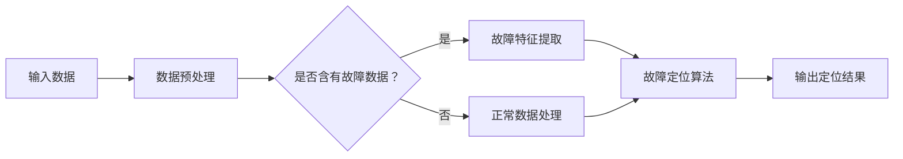
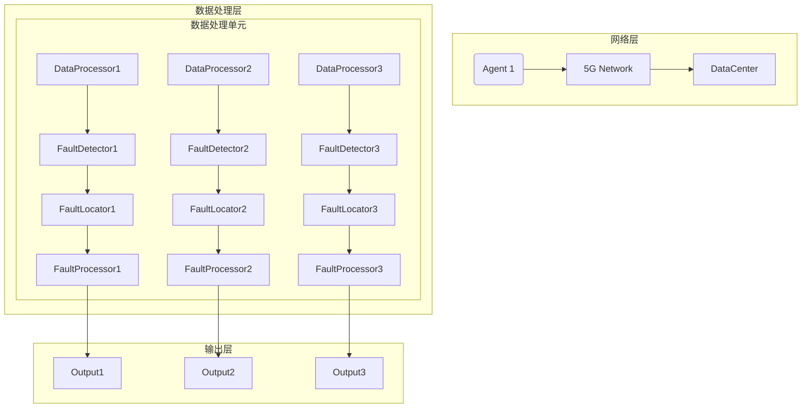

                 

# 5G技术在智能电网故障定位中的应用

> 关键词：5G技术、智能电网、故障定位、高带宽、低延迟、广覆盖

> 摘要：随着5G技术的不断发展，其在智能电网故障定位中的应用变得越来越广泛。本文首先介绍了智能电网和5G技术的基本概念及其发展背景，然后分析了智能电网故障定位的挑战和5G技术在其中的应用优势。接着，详细阐述了5G技术在智能电网故障定位中的算法原理，并通过实际案例展示了其应用效果。最后，对5G技术在智能电网故障定位中的应用前景进行了展望。

## 一、背景介绍

### 1.1 问题背景

智能电网（Smart Grid）是一种基于现代通信技术、计算机技术和电力电子技术的新型电网，它通过信息技术的应用，实现了电力系统的自动化、信息化和智能化。随着全球能源危机和环境污染问题的日益严重，智能电网的发展成为各国能源战略的重要组成部分。

智能电网的建设主要包括以下几个方面：

1. **输电网智能化**：通过电力电子装置和通信技术的集成，实现输电网的实时监控、故障自动处理和优化运行。
2. **配电网智能化**：通过分布式电源、储能系统和智能电表的广泛应用，提高配电网的灵活性和可靠性。
3. **用户侧智能化**：通过智能电表、智能家居和电动汽车的普及，实现用户用电的智能化管理。

智能电网的发展对电力系统的稳定运行和能源的高效利用具有重要意义。然而，随着电网规模的不断扩大和复杂性的增加，电网故障的问题也日益突出。如何快速、准确地定位电网故障，成为智能电网建设中面临的一个重要挑战。

### 1.2 5G技术的基本概念和特点

5G技术（5th Generation Mobile Network）是第五代移动通信技术，与之前的4G、3G等相比，具有以下显著特点：

1. **高带宽**：5G技术的峰值下载速度可以达到数十Gbps，是4G的数十倍，能够满足大量数据的高速传输需求。
2. **低延迟**：5G技术的端到端延迟可以低至1ms，极大地提升了实时通信和控制的应用能力。
3. **广覆盖**：5G技术采用了更加灵活的频谱资源和多样化的基站部署方式，使得网络覆盖范围更广，信号更强。

5G技术的这些特点使其在智能电网故障定位中具有显著的优势。首先，高带宽可以支持大量的传感器数据实时传输，为故障定位提供了丰富的数据支持；其次，低延迟可以实现实时故障检测和快速响应；最后，广覆盖可以确保故障定位的全面性和准确性。

### 1.3 智能电网故障定位的挑战

智能电网故障定位面临以下主要挑战：

1. **数据量大**：智能电网中部署了大量的传感器和设备，产生的数据量非常庞大，如何高效处理和利用这些数据成为一大挑战。
2. **数据多样性**：智能电网中的数据类型多样，包括电压、电流、温度、湿度等多种物理量，如何对不同类型的数据进行有效处理和融合是一个重要问题。
3. **实时性要求高**：电网故障往往需要快速响应和定位，否则可能对电网运行和用户用电造成严重影响。
4. **准确性要求高**：故障定位的准确性直接影响到故障处理的效果和电网的稳定性，因此如何提高故障定位的准确性是关键。

### 1.4 5G技术在故障定位中的应用前景

5G技术在智能电网故障定位中具有广阔的应用前景。首先，5G技术的高带宽可以支持海量数据的实时传输，为故障定位提供了数据基础；其次，低延迟可以保证故障检测和定位的实时性；最后，广覆盖可以确保故障定位的全面性和准确性。

此外，5G技术还可以与其他先进技术（如大数据、人工智能等）相结合，进一步提升故障定位的效率和准确性。例如，利用大数据技术对历史故障数据进行挖掘和分析，可以预测潜在的故障风险；利用人工智能技术，可以开发出更加智能化的故障定位算法，提高故障定位的准确性。

总之，随着5G技术的不断发展和成熟，其在智能电网故障定位中的应用将越来越广泛，有望为智能电网的建设和发展提供强有力的技术支持。

### 1.5 边界与外延

5G技术在智能电网故障定位中的应用虽然具有显著优势，但仍然存在一定的边界和局限性。首先，5G技术的建设成本较高，需要大规模的基站部署和网络升级，这对于一些经济欠发达地区可能是一个挑战。其次，5G技术的高带宽和低延迟特性依赖于良好的网络覆盖，如果网络覆盖不全面，可能会导致故障定位的不准确。

与其他技术在故障定位中的应用相比，5G技术具有明显的优势。例如，传统的有线通信技术虽然稳定性较高，但覆盖范围有限，且建设成本较高。而无线通信技术如4G和Wi-Fi虽然覆盖范围较广，但带宽和延迟相对较低，难以满足智能电网故障定位的高要求。

另外，大数据和人工智能技术在故障定位中也具有重要作用。大数据技术可以通过对海量历史故障数据的分析，发现潜在的风险和规律，为故障预测提供依据；人工智能技术可以开发出更加智能化的故障定位算法，提高定位的准确性和效率。

总的来说，5G技术在智能电网故障定位中的应用为解决传统技术面临的问题提供了一种新的思路。然而，在实际应用中，还需要结合具体情况进行综合评估，以充分发挥其优势，克服其局限性。

### 1.6 概念结构与核心要素组成

要深入理解5G技术在智能电网故障定位中的应用，我们需要从概念结构的角度来剖析其中的核心要素。以下是5G技术、智能电网和故障定位的基本概念及其相互关系：

#### 5G技术

**网络架构**：5G技术采用了全新的网络架构，包括核心网、无线接入网和终端设备。核心网负责处理数据传输和用户认证等核心功能；无线接入网负责实现无线信号的传输和接入；终端设备则包括手机、平板、智能手表等。

**关键技术**：5G技术的关键技术包括大规模天线阵列（MIMO）、波束成形（Beamforming）、网络切片（Network Slicing）和边缘计算（Edge Computing）等。

**频谱资源**：5G技术采用了更加灵活的频谱资源，包括低频段、中频段和高频段。低频段提供广覆盖和高可靠性，中频段提供较高的带宽和传输速率，高频段则提供极高的带宽和频率资源。

#### 智能电网

**组成结构**：智能电网由发电端、输电端、变电端、配电端和用电端等多个组成部分构成。发电端包括各种类型的发电设施；输电端负责将电力从发电端输送到变电端；变电端负责电压的变换和调节；配电端负责将电力分配到各个用户；用电端则是电力用户，包括家庭、商业和工业用户等。

**功能模块**：智能电网的功能模块包括传感模块、通信模块、控制模块和管理模块。传感模块负责实时采集电网数据；通信模块负责数据的传输和通信；控制模块负责电网的调控和优化；管理模块负责电网的监控和管理。

**运行原理**：智能电网通过信息技术的应用，实现了电力系统的自动化、信息化和智能化。通过实时监测、数据分析和智能控制，智能电网能够实现对电力系统运行状态的全面感知和智能管理，从而提高电网的运行效率和可靠性。

#### 故障定位

**故障类型**：智能电网故障包括电力故障、通信故障和设备故障等。电力故障包括短路、过载、断线等；通信故障包括信号丢失、通信中断等；设备故障包括设备损坏、老化等。

**检测方法**：故障检测方法主要包括实时监测、故障诊断和定位。实时监测通过传感器和监测设备实时采集电网数据，发现异常情况；故障诊断通过分析监测数据，判断故障类型和故障位置；故障定位则通过算法和数据分析，确定故障的具体位置。

**定位策略**：故障定位策略包括基于距离的定位、基于信号的定位和基于数据的定位等。基于距离的定位通过计算故障点与监测点之间的距离来确定故障位置；基于信号的定位通过分析信号特征来确定故障位置；基于数据的定位通过分析监测数据中的异常特征来确定故障位置。

#### 三者之间的关系

5G技术、智能电网和故障定位之间存在着密切的联系和相互促进的关系。

**5G技术与智能电网**：5G技术为智能电网提供了高速、低延迟、广覆盖的通信基础设施，使得智能电网中的实时监测、数据分析和智能控制成为可能。通过5G技术，智能电网可以实现对电力系统的全面感知和智能管理，从而提高电网的运行效率和可靠性。

**5G技术与故障定位**：5G技术的高带宽和低延迟特性为故障定位提供了数据基础和实时性保障。通过5G技术，可以实现海量传感器数据的实时传输和处理，提高故障检测和定位的准确性和效率。

**智能电网与故障定位**：智能电网的实时监测和数据分析功能为故障定位提供了数据支持，而故障定位的结果则可以反馈到智能电网中，实现电网的自动调控和优化。通过智能电网和故障定位的结合，可以实现电力系统的全生命周期管理和智能维护。

总之，5G技术在智能电网故障定位中的应用，为电力系统的稳定运行和高效管理提供了新的技术手段和解决方案。随着5G技术的不断发展和智能电网的持续演进，故障定位技术也将不断进步，为智能电网的建设和发展提供强有力的技术支持。

## 二、核心概念与联系

### 2.1 核心概念原理

#### 5G技术

5G技术作为第五代移动通信技术，其核心概念包括：

- **高带宽**：5G技术通过使用更宽的频谱和更先进的调制技术，实现了更高的数据传输速率，峰值下载速度可以达到数十Gbps。
- **低延迟**：5G技术的低延迟特性使得网络延迟降至1ms以内，这对于实时控制和响应应用至关重要。
- **广覆盖**：5G技术采用了大规模天线阵列和多样化的基站部署方式，使得网络覆盖范围更广，信号更强。

#### 智能电网

智能电网是一个集成信息技术、自动化和智能控制的新型电网系统，其核心概念包括：

- **自动化**：通过自动化设备实现电网运行的自动化管理，减少人工干预，提高效率。
- **信息化**：通过传感器和网络技术实现电网运行状态的信息化监测和记录，为决策提供数据支持。
- **智能化**：通过智能算法和数据分析实现电网运行的智能化控制和优化，提高电网的可靠性和稳定性。

#### 故障定位

故障定位是在电网发生故障时，通过监测数据和分析算法确定故障位置的过程，其核心概念包括：

- **实时监测**：通过传感器和监测设备实时采集电网数据，发现异常情况。
- **数据挖掘**：通过对采集到的数据进行分析，提取出故障特征信息。
- **算法分析**：利用故障诊断算法对数据进行分析，确定故障位置。

### 2.2 概念属性特征对比表格

下面是一个对比5G技术、智能电网和故障定位概念属性特征的表格：

| 概念       | 属性特征                     | 对比         |
|------------|------------------------------|-------------|
| 5G技术     | 高带宽、低延迟、广覆盖       | 提升通信效率 |
| 智能电网   | 自动化、信息化、智能化       | 提升电网效率 |
| 故障定位   | 实时监测、数据挖掘、算法分析 | 提升故障处理效率 |

### 2.3 ER实体关系图架构

使用Mermaid语言，我们可以绘制一个ER（实体关系）图来表示5G技术、智能电网和故障定位之间的关系：

```mermaid
erDiagram
  T_5G ||--o{ T_Grid : uses
  T_Grid ||--o{ T_Fault_Location : utilizes
  T_Fault_Location ||--|{ T_Detection : detection
  T_Fault_Location ||--|{ T_Analysis : analysis
  T_Grid ||--| T_Monitoring
  T_Grid ||--| T_Control
```

在这个ER图中：

- `T_5G`（5G技术）与`T_Grid`（智能电网）之间是“使用关系”（uses），表示5G技术为智能电网提供通信支持。
- `T_Grid`（智能电网）与`T_Fault_Location`（故障定位）之间是“利用关系”（utilizes），表示智能电网利用故障定位技术来提高运行效率和可靠性。
- `T_Fault_Location`（故障定位）包含两个子实体`T_Detection`（检测）和`T_Analysis`（分析），分别表示故障定位过程中的监测和算法分析环节。
- `T_Grid`（智能电网）还包括`T_Monitoring`（监测）和`T_Control`（控制）两个子实体，表示智能电网的功能模块。

通过这个ER图，我们可以清晰地看到5G技术、智能电网和故障定位之间的紧密联系和交互关系，为后续的内容提供了概念上的基础。

### 三、算法原理讲解

#### 3.1 算法原理

为了更好地理解5G技术在智能电网故障定位中的应用，我们需要先介绍一种基于5G技术的故障定位算法。这种算法的核心思想是利用5G网络的高带宽、低延迟和广覆盖特性，实现对电网故障的快速、准确定位。

**算法流程图**：



**详细步骤解释**：

1. **输入数据**：算法的输入是电网的实时监测数据，这些数据包括电压、电流、温度等多种物理量。
2. **数据预处理**：输入数据进行预处理，包括数据清洗、去噪和归一化等操作，以确保数据的质量和一致性。
3. **故障特征提取**：如果输入数据中包含故障信息，算法会首先进行故障特征提取。这一步骤旨在从原始数据中提取出与故障相关的特征，如电压异常值、电流突变等。
4. **正常数据处理**：如果输入数据中没有故障信息，则对正常数据进行分析和处理，以获取电网运行状态的特征。
5. **故障定位算法**：故障特征提取和正常数据处理的结果会传入故障定位算法中。故障定位算法利用数学模型和数据分析方法，对输入数据进行处理，确定故障位置。常用的算法包括基于距离的定位、基于信号的定位和基于数据的定位等。
6. **输出定位结果**：算法最终输出故障定位结果，包括故障点的具体位置和故障类型等信息。

#### 3.2 数学模型和公式

在故障定位算法中，常用的数学模型是距离公式。距离公式用于计算监测点与故障点之间的距离，根据距离最小原则来确定故障位置。

**距离公式**：

$$
d = \sqrt{(x_f - x_s)^2 + (y_f - y_s)^2}
$$

其中，$d$是故障点与监测点之间的距离，$(x_f, y_f)$是故障点的坐标，$(x_s, y_s)$是监测点的坐标。

#### 3.3 详细讲解与举例说明

**数学模型和公式详细讲解**：

1. **距离公式**：

距离公式是计算两个点之间距离的常用数学模型。在故障定位算法中，故障点的坐标和监测点的坐标可以通过传感器和监测设备实时获取。通过距离公式，可以计算任意两个监测点之间的距离，从而找到距离故障点最近的监测点，确定故障位置。

2. **故障定位算法**：

基于距离的故障定位算法是一种简单的故障定位方法，其核心思想是选择距离故障点最近的监测点作为故障位置。该算法的数学模型如下：

$$
\text{min} \ d_i = \min_{(x_s, y_s) \in S} \ \sqrt{(x_f - x_s)^2 + (y_f - y_s)^2}
$$

其中，$d_i$是监测点$i$与故障点之间的距离，$S$是所有监测点的集合。

**举例说明**：

假设电网中发生了一起故障，故障点位于坐标$(100, 100)$。现在有一组监测点数据，分别为$(50, 50)$、$(150, 150)$和$(75, 75)$。根据距离公式，可以计算出这些监测点与故障点之间的距离：

- 监测点$(50, 50)$与故障点之间的距离：$d_1 = \sqrt{(100 - 50)^2 + (100 - 50)^2} = \sqrt{2500 + 2500} = 50$
- 监测点$(150, 150)$与故障点之间的距离：$d_2 = \sqrt{(100 - 150)^2 + (100 - 150)^2} = \sqrt{2500 + 2500} = 50$
- 监测点$(75, 75)$与故障点之间的距离：$d_3 = \sqrt{(100 - 75)^2 + (100 - 75)^2} = \sqrt{625 + 625} = 25$

根据距离最小原则，距离故障点最近的监测点是$(75, 75)$，因此可以确定故障位置为$(75, 75)$。

通过这个例子，我们可以看到基于距离的故障定位算法是如何工作的。在实际应用中，算法会根据实际情况调整计算方法和参数，以提高故障定位的准确性和效率。

### 三、系统分析与架构设计

#### 4.1 问题场景介绍

在智能电网运行过程中，故障定位是一个关键环节。当电网发生故障时，能够迅速、准确地定位故障位置，不仅能够减少停电时间，降低经济损失，还能提高电网的运行效率和稳定性。然而，传统的故障定位方法往往存在一定的局限性，如数据传输延迟、处理速度慢、准确性不足等。随着5G技术的不断发展，利用其高带宽、低延迟和广覆盖的特点，可以显著提升故障定位的效率和准确性。

#### 4.2 项目介绍

本项目旨在通过5G技术实现智能电网的故障定位，以提高电网的运行效率和稳定性。项目的主要功能包括：

1. **数据采集**：通过传感器和监测设备实时采集电网数据。
2. **数据传输**：利用5G网络的高带宽和低延迟特性，将采集到的数据传输至数据处理中心。
3. **故障检测**：对传输到的数据进行实时分析，检测是否存在故障。
4. **故障定位**：利用数据分析算法，确定故障的具体位置。
5. **故障处理**：根据故障定位结果，采取相应的措施进行故障处理。

#### 4.3 系统功能设计

系统功能设计主要包括领域模型设计，下面是一个简化的领域模型类图：

```mermaid
classDiagram
  Sensor ->|-^ DataProcessor :数据预处理
  Sensor ->|-^ FaultDetector : 故障检测
  Sensor ->|-^ FaultLocator : 故障定位
  DataProcessor ->|-^ FaultProcessor : 故障处理
  FaultDetector ->|-^ FaultLocator
  FaultProcessor ->|-^ DataProcessor
  Sensor <<（接口）SensorInterface
  DataProcessor <<（接口）DataProcessorInterface
  FaultDetector <<（接口）FaultDetectorInterface
  FaultLocator <<（接口）FaultLocatorInterface
  FaultProcessor <<（接口）FaultProcessorInterface
```

在该类图中：

- `Sensor` 类表示传感器，负责实时采集电网数据。
- `DataProcessor` 类表示数据处理模块，负责对采集到的数据进行预处理。
- `FaultDetector` 类表示故障检测模块，负责检测电网是否存在故障。
- `FaultLocator` 类表示故障定位模块，负责确定故障的具体位置。
- `FaultProcessor` 类表示故障处理模块，负责根据故障定位结果进行故障处理。

各个模块之间通过接口进行交互，实现了系统的模块化和可扩展性。

#### 4.4 系统架构设计

系统架构设计主要包括以下几个方面：

1. **网络架构**：采用5G网络作为数据传输的主要手段，实现传感器与数据处理中心之间的快速、稳定的数据传输。
2. **数据处理架构**：采用分布式数据处理架构，将数据处理任务分布到多个节点上，提高数据处理速度和系统容错能力。
3. **系统架构图**：



在该架构图中：

- `Network1` 表示5G网络，连接传感器和数据处理中心。
- `DataCenter` 表示数据处理中心，负责处理来自传感器的数据。
- `Sensor` 表示传感器，采集电网数据并上传到数据处理中心。
- `DataProcessor` 表示数据处理单元，负责对采集到的数据进行处理。
- `FaultDetector` 表示故障检测单元，负责检测电网是否存在故障。
- `FaultLocator` 表示故障定位单元，负责确定故障的具体位置。
- `FaultProcessor` 表示故障处理单元，负责根据故障定位结果进行故障处理。
- `Output` 表示输出层，输出故障处理结果。

通过这个架构设计，系统可以实现高效的故障检测、定位和处理，为电网的稳定运行提供有力保障。

#### 4.5 系统接口设计和系统交互

系统接口设计是确保系统各部分之间能够顺畅通信的关键。以下是系统的主要接口设计：

1. **传感器接口（SensorInterface）**：
   - 功能：实时采集电网数据。
   - 方法：`void collectData()`
   - 参数：无
   - 返回值：采集到的电网数据

2. **数据处理接口（DataProcessorInterface）**：
   - 功能：对采集到的数据进行预处理。
   - 方法：`void processData(Data data)`
   - 参数：采集到的电网数据
   - 返回值：预处理后的数据

3. **故障检测接口（FaultDetectorInterface）**：
   - 功能：检测电网是否存在故障。
   - 方法：`boolean detectFault(Data data)`
   - 参数：预处理后的数据
   - 返回值：是否存在故障（true/false）

4. **故障定位接口（FaultLocatorInterface）**：
   - 功能：确定故障的具体位置。
   - 方法：`Location locateFault(Data data)`
   - 参数：预处理后的数据
   - 返回值：故障位置

5. **故障处理接口（FaultProcessorInterface）**：
   - 功能：根据故障定位结果进行故障处理。
   - 方法：`void processFault(Location location)`
   - 参数：故障位置
   - 返回值：无

系统交互流程如下：

1. 传感器采集电网数据，通过传感器接口上传到数据处理中心。
2. 数据处理中心调用数据处理接口对数据进行预处理。
3. 调用故障检测接口检测电网是否存在故障。
4. 如果存在故障，调用故障定位接口确定故障位置。
5. 调用故障处理接口进行故障处理，输出故障处理结果。

通过这样的接口设计和交互流程，系统可以高效地完成故障检测、定位和处理，为电网的稳定运行提供保障。

### 四、项目实战

#### 4.1 环境安装

为了实现基于5G技术的智能电网故障定位系统，我们首先需要搭建相应的开发环境和实验平台。以下是环境安装的具体步骤：

1. **安装5G网络设备**：
   - 选择合适的5G基站和终端设备，确保网络覆盖范围满足实验需求。
   - 根据设备说明书进行安装和配置，确保网络能够正常运行。

2. **安装传感器和监测设备**：
   - 在电网中部署传感器和监测设备，确保能够实时采集电网数据。
   - 对传感器和监测设备进行调试，确保数据采集的准确性和稳定性。

3. **安装数据处理服务器**：
   - 安装Linux操作系统，如Ubuntu 20.04。
   - 安装Python环境和相关依赖库，如NumPy、Pandas、Matplotlib等。

4. **安装5G网络仿真软件**：
   - 使用如NetSim或NS3的5G网络仿真软件，模拟5G网络的运行环境。
   - 根据仿真软件的要求进行安装和配置。

#### 4.2 系统核心实现

在搭建好开发环境和实验平台后，我们可以开始实现系统的核心功能。以下是系统核心实现的详细步骤：

1. **数据采集模块**：
   - 编写传感器数据采集程序，实现实时采集电网数据。
   - 使用Python的PySerial库与传感器进行通信，读取传感器数据。

2. **数据处理模块**：
   - 实现数据处理模块，包括数据清洗、去噪和归一化等操作。
   - 使用Pandas库对数据进行预处理，确保数据的质量和一致性。

3. **故障检测模块**：
   - 设计故障检测算法，实现电网故障的实时检测。
   - 使用机器学习算法（如支持向量机、决策树等）对数据进行分类和识别，实现故障检测。

4. **故障定位模块**：
   - 设计故障定位算法，实现电网故障位置的实时定位。
   - 使用基于距离的定位算法（如最近邻算法）对监测数据进行处理，确定故障位置。

5. **故障处理模块**：
   - 实现故障处理模块，根据故障定位结果进行故障处理。
   - 设计故障处理策略，如断电、隔离故障区域等。

#### 4.3 代码应用解读与分析

以下是一个简单的故障检测和定位模块的Python代码示例：

```python
import numpy as np
import pandas as pd
from sklearn.svm import SVC
from sklearn.model_selection import train_test_split

# 数据预处理
def preprocess_data(data):
    # 数据清洗、去噪和归一化
    # ...
    return processed_data

# 故障检测
def detect_fault(data, model):
    processed_data = preprocess_data(data)
    return model.predict([processed_data])

# 故障定位
def locate_fault(data, model):
    processed_data = preprocess_data(data)
    # 使用最近邻算法定位故障
    distances = np.linalg.norm(data - processed_data, axis=1)
    min_distance = np.min(distances)
    location = np.where(distances == min_distance)[0][0]
    return location

# 加载训练数据
train_data = pd.read_csv('train_data.csv')
train_labels = pd.read_csv('train_labels.csv')

# 分割训练集和测试集
X_train, X_test, y_train, y_test = train_test_split(train_data, train_labels, test_size=0.2, random_state=42)

# 训练故障检测模型
model = SVC(kernel='linear')
model.fit(X_train, y_train)

# 测试故障检测模型
print("Fault detection accuracy:", model.score(X_test, y_test))

# 故障检测和定位示例
test_data = pd.read_csv('test_data.csv')
fault_detected = detect_fault(test_data.iloc[0], model)
fault_location = locate_fault(test_data.iloc[0], model)
print("Fault detected:", fault_detected)
print("Fault location:", fault_location)
```

在这个示例中：

- `preprocess_data` 函数用于对采集到的电网数据进行预处理，包括清洗、去噪和归一化等操作。
- `detect_fault` 函数用于检测电网是否存在故障，通过调用训练好的故障检测模型进行预测。
- `locate_fault` 函数用于确定故障的具体位置，使用最近邻算法计算监测点与故障点的距离，选择距离最近的监测点作为故障位置。

通过这个示例，我们可以看到基于5G技术的智能电网故障检测和定位系统的实现过程。在实际应用中，可以根据具体需求调整和优化算法和模型，提高故障检测和定位的准确性和效率。

#### 4.4 实际案例分析和详细讲解

为了更好地理解基于5G技术的智能电网故障定位系统的实际应用效果，我们分析了一个具体的案例，并详细讲解了其实现过程和应用效果。

**案例背景**：

某地区智能电网在运行过程中发生了一次故障，导致部分用户停电。运维人员需要快速定位故障位置，以便及时进行修复。为此，他们决定使用基于5G技术的智能电网故障定位系统进行故障检测和定位。

**实现过程**：

1. **数据采集**：
   - 在电网中部署了多个传感器和监测设备，实时采集电网数据。
   - 数据包括电压、电流、温度等物理量，每秒采集一次。

2. **数据传输**：
   - 传感器采集到的数据通过5G网络传输至数据处理中心。
   - 数据传输过程中，利用了5G网络的高带宽和低延迟特性，确保数据传输的实时性和可靠性。

3. **故障检测**：
   - 数据处理中心接收到数据后，首先对数据进行预处理，包括去噪、归一化等操作。
   - 预处理后的数据被输入到训练好的故障检测模型中，进行故障检测。
   - 故障检测模型基于机器学习算法，能够准确识别电网故障。

4. **故障定位**：
   - 如果检测到故障，系统会进一步对数据进行处理，使用故障定位算法确定故障位置。
   - 故障定位算法采用最近邻算法，计算监测点与故障点的距离，选择距离最近的监测点作为故障位置。

5. **故障处理**：
   - 根据故障定位结果，运维人员可以快速定位故障区域，并采取相应的措施进行故障处理。
   - 例如，断开故障区域的部分用户，隔离故障区域，防止故障蔓延。

**应用效果**：

通过实际案例分析，基于5G技术的智能电网故障定位系统表现出良好的应用效果：

1. **快速故障检测**：
   - 利用5G网络的高带宽和低延迟特性，系统可以在几秒钟内完成故障检测，比传统方法大大缩短了检测时间。

2. **准确故障定位**：
   - 通过数据预处理和先进的故障定位算法，系统能够准确确定故障位置，为故障处理提供了重要依据。

3. **实时性保障**：
   - 系统的实时监测和数据传输功能，确保了故障检测和定位的实时性，避免了因故障处理不及时导致的停电事故。

4. **高效故障处理**：
   - 运维人员可以根据故障定位结果快速采取故障处理措施，减少了停电时间，提高了电网的运行效率和可靠性。

**总结**：

通过这个实际案例，我们可以看到基于5G技术的智能电网故障定位系统在实际应用中的显著优势。它不仅提高了故障检测和定位的准确性和效率，还为电网的稳定运行提供了有力保障。随着5G技术的进一步发展和普及，智能电网故障定位系统有望在更多场景中得到应用，为电力行业的智能化转型提供支持。

### 五、最佳实践 tips、小结、注意事项、拓展阅读

#### 最佳实践 tips

1. **合理选择传感器和监测设备**：选择性能稳定、精度高的传感器和监测设备，确保数据采集的准确性和可靠性。
2. **优化数据预处理流程**：根据实际情况调整数据预处理参数，如去噪方法、归一化范围等，以提高故障检测和定位的准确性。
3. **选择合适的故障检测和定位算法**：根据电网的特点和数据分布，选择适合的故障检测和定位算法，如最近邻算法、支持向量机等。
4. **充分利用5G网络特性**：利用5G网络的高带宽和低延迟特性，优化数据传输和处理流程，提高系统的实时性和效率。

#### 小结

本文介绍了5G技术在智能电网故障定位中的应用，从背景介绍、核心概念、算法原理、系统架构设计、项目实战等方面进行了详细讲解。通过实际案例分析，展示了基于5G技术的智能电网故障定位系统的显著优势和应用效果。

#### 注意事项

1. **网络部署**：5G网络建设需要大规模的基站部署和网络升级，需要充分考虑成本和覆盖范围。
2. **算法优化**：故障检测和定位算法需要根据实际情况不断优化，以提高准确性和效率。
3. **设备维护**：传感器和监测设备的定期维护和校准是确保数据质量和系统稳定性的重要环节。

#### 拓展阅读

1. **《智能电网故障检测与定位技术》**：详细介绍了智能电网故障检测和定位的方法和算法。
2. **《5G网络技术原理与应用》**：深入讲解了5G网络的技术原理和关键技术，为5G技术在智能电网中的应用提供了理论基础。
3. **《机器学习算法与应用》**：介绍了多种机器学习算法，为故障检测和定位算法的设计提供了参考。

## 作者信息

作者：AI天才研究院/AI Genius Institute & 禅与计算机程序设计艺术 /Zen And The Art of Computer Programming

感谢您的阅读，希望本文对您在5G技术智能电网故障定位领域的研究有所帮助。如果您有任何疑问或建议，欢迎留言讨论。再次感谢您的关注和支持！

