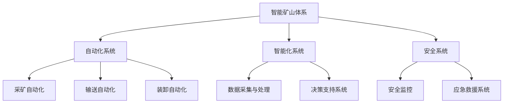
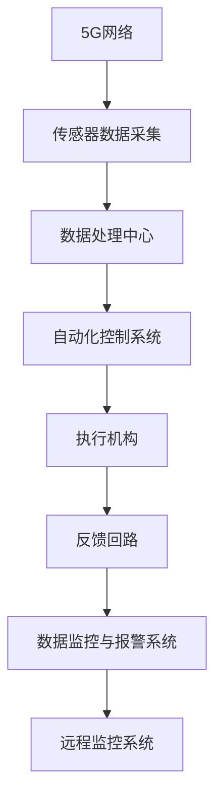
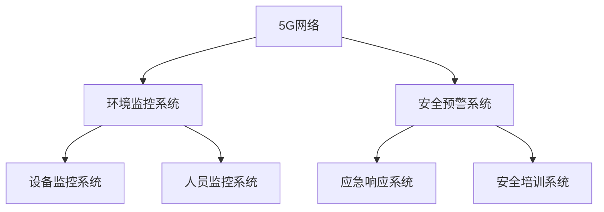

                 

# 5G技术在智能矿山中的全面应用

关键词：5G技术、智能矿山、通信、自动化、安全、大数据

摘要：随着5G技术的快速发展，其在各个行业的应用越来越广泛。智能矿山作为现代矿业的发展方向，其核心在于利用先进的技术手段提高矿山的生产效率、保障矿山安全。本文将从5G技术的发展历程、智能矿山的发展背景、5G技术在智能矿山中的潜在应用、解决方案、案例研究以及未来展望等多个方面，系统性地探讨5G技术在智能矿山中的全面应用，旨在为智能矿山的发展提供有益的参考。

## 第一部分：5G技术概述与智能矿山背景

### 第1章 5G技术基础

#### 1.1 5G技术的发展历程

##### 1.1.1 5G技术标准与核心特性

5G技术，即第五代移动通信技术（5th Generation Mobile Network Technology），是当前移动通信技术的发展方向。5G技术的标准由国际电信联盟（ITU）制定，其核心特性包括：

- **高速率**：5G网络的理论峰值下载速度可达20Gbps，是4G网络的100倍。
- **低延迟**：5G网络的端到端时延可低至1毫秒，是4G网络的1/10。
- **大连接**：5G网络可以支持大规模的设备连接，包括人、物、传感器等。
- **网络切片**：5G网络可以将网络资源灵活分配给不同的用户和业务，实现个性化服务。

##### 1.1.2 5G网络架构与技术组成

5G网络架构包括接入网、传输网和核心网三部分。接入网主要负责用户设备与基站之间的连接，传输网负责基站之间的数据传输，核心网则负责用户数据和服务的处理。5G网络的技术组成包括：

- **新空口（NR）**：5G接入技术，支持毫米波、sub-6GHz等频段。
- **载波聚合**：通过聚合多个载波，提高网络带宽。
- **多接入边缘计算（MEC）**：将计算能力靠近用户，降低网络延迟。
- **网络功能虚拟化（NFV）和软件定义网络（SDN）**：通过网络功能的虚拟化和软件定义，提高网络的灵活性和可管理性。

##### 1.1.3 5G技术的应用前景

5G技术的应用前景非常广阔，不仅将推动移动通信的发展，还将对物联网、智能制造、智慧城市等各个领域产生深远影响。在未来，5G技术有望实现以下应用：

- **工业互联网**：通过5G网络实现工厂设备的智能互联，提高生产效率。
- **智能交通**：实现车辆与道路、车辆与车辆之间的通信，提高交通安全性。
- **智慧医疗**：通过5G网络实现远程医疗诊断和治疗，提高医疗服务的可及性。
- **智能家居**：通过5G网络实现家庭设备的智能控制，提高生活品质。

### 第2章 智能矿山的发展背景

#### 1.2 智能矿山的发展背景

智能矿山是指利用信息技术、物联网、大数据、人工智能等先进技术，对矿山生产过程进行智能化改造，实现矿山生产过程的自动化、智能化和安全化。智能矿山的发展背景主要包括以下几个方面：

##### 1.2.1 矿山产业现状与挑战

- **资源枯竭**：随着矿产资源的逐渐枯竭，传统矿山开采方式已难以满足需求。
- **劳动力成本上升**：矿工的工资水平逐年上涨，劳动力成本成为矿山企业的主要负担。
- **安全隐患**：矿山环境复杂，事故频发，矿工的生命安全面临严重威胁。

##### 1.2.2 智能矿山的基本概念

智能矿山是指利用先进的技术手段，对矿山生产过程进行智能化改造，实现矿山生产过程的自动化、智能化和安全化。智能矿山的主要特点包括：

- **自动化**：通过自动化设备提高矿山生产效率，减少人力成本。
- **智能化**：通过大数据、人工智能等技术，实现矿山生产过程的智能化控制。
- **安全化**：通过物联网技术，实现对矿山环境的实时监控，提高矿山安全水平。

##### 1.2.3 智能矿山的发展趋势

- **智能化采矿**：利用人工智能技术，实现采矿过程的智能化控制。
- **自动化输送**：通过自动化设备，实现矿山物资的自动化输送。
- **智能化安全管理**：利用物联网技术，实现对矿山安全的实时监控和预警。
- **大数据平台**：通过大数据技术，实现矿山生产数据的全面分析和利用。

### 第3章 5G技术在智能矿山中的潜在应用

#### 1.3 5G技术在矿山通信中的应用

##### 1.3.1 5G网络在矿山通信的优势

5G网络在矿山通信中具有以下优势：

- **高速率**：5G网络的高速率可以实现矿山生产数据的实时传输和处理，提高矿山生产效率。
- **低延迟**：5G网络的低延迟可以满足矿山生产过程中的实时控制需求，提高矿山生产自动化水平。
- **大连接**：5G网络的大连接能力可以支持矿山内大量设备的接入，实现矿山生产过程的全面智能化。

##### 1.3.2 5G在矿山物联网中的应用

5G技术在矿山物联网中可以应用于以下几个方面：

- **设备监控**：通过5G网络，实现对矿山内设备的实时监控，提高设备运行效率。
- **环境监测**：通过5G网络，实现对矿山环境的实时监测，提高矿山安全水平。
- **人员定位**：通过5G网络，实现对矿工的实时定位，提高矿山安全管理水平。

##### 1.3.3 5G在矿山远程控制中的应用

5G技术在矿山远程控制中的应用主要体现在以下几个方面：

- **远程操作**：通过5G网络，实现矿山设备的远程操作，提高矿山生产效率。
- **远程维护**：通过5G网络，实现矿山设备的远程维护，降低设备故障率。
- **远程诊断**：通过5G网络，实现矿山设备的远程诊断，提高设备运行稳定性。

#### 1.4 5G技术在矿山安全中的应用

##### 1.4.1 5G在矿山安全监控中的作用

5G技术在矿山安全监控中的应用主要包括以下几个方面：

- **实时监控**：通过5G网络，实现对矿山内环境、设备、人员的实时监控，提高矿山安全水平。
- **智能预警**：通过5G网络，实现对矿山内潜在风险的智能预警，提前采取防范措施。
- **应急响应**：通过5G网络，实现矿山事故的应急响应，提高矿山救援效率。

##### 1.4.2 5G在矿山应急救援中的应用

5G技术在矿山应急救援中的应用主要包括以下几个方面：

- **远程指挥**：通过5G网络，实现矿山救援的远程指挥，提高救援效率。
- **实时通信**：通过5G网络，实现矿山救援现场的实时通信，提高救援协调性。
- **数据共享**：通过5G网络，实现矿山救援数据的实时共享，提高救援决策的科学性。

##### 1.4.3 5G在矿山安全培训中的应用

5G技术在矿山安全培训中的应用主要包括以下几个方面：

- **虚拟现实培训**：通过5G网络，实现矿山安全培训的虚拟现实场景，提高培训效果。
- **远程教学**：通过5G网络，实现矿山安全培训的远程教学，提高培训的覆盖范围。
- **智能考核**：通过5G网络，实现矿山安全培训的智能考核，提高培训的质量。

### 第4章 5G技术与智能矿山解决方案

#### 1.5 5G技术在矿山自动化中的应用

##### 1.5.1 5G在矿山自动化采矿中的应用

5G技术在矿山自动化采矿中的应用主要包括以下几个方面：

- **无人驾驶采矿车**：通过5G网络，实现无人驾驶采矿车的远程控制和实时监控，提高采矿效率。
- **智能采矿设备**：通过5G网络，实现智能采矿设备的实时数据传输和智能控制，提高采矿设备的运行效率和稳定性。
- **自动化采矿流程**：通过5G网络，实现矿山自动化采矿流程的实时监控和智能调度，提高矿山生产效率。

##### 1.5.2 5G在矿山自动化输送中的应用

5G技术在矿山自动化输送中的应用主要包括以下几个方面：

- **自动化输送系统**：通过5G网络，实现矿山自动化输送系统的实时监控和智能调度，提高输送效率。
- **智能检测与维护**：通过5G网络，实现矿山自动化输送系统的智能检测与维护，降低输送系统的故障率。
- **实时数据传输**：通过5G网络，实现矿山自动化输送系统的实时数据传输，为矿山生产提供实时数据支持。

##### 1.5.3 5G在矿山自动化装卸中的应用

5G技术在矿山自动化装卸中的应用主要包括以下几个方面：

- **自动化装卸设备**：通过5G网络，实现矿山自动化装卸设备的远程控制和实时监控，提高装卸效率。
- **智能装卸调度**：通过5G网络，实现矿山自动化装卸设备的智能调度，提高装卸设备的利用率。
- **实时数据传输**：通过5G网络，实现矿山自动化装卸设备的实时数据传输，为矿山生产提供实时数据支持。

#### 1.6 5G技术在矿山信息化管理中的应用

##### 1.6.1 5G在矿山企业管理中的应用

5G技术在矿山企业管理中的应用主要包括以下几个方面：

- **企业资源计划（ERP）系统**：通过5G网络，实现矿山企业ERP系统的实时数据传输和处理，提高企业管理效率。
- **供应链管理系统**：通过5G网络，实现矿山企业供应链管理系统的实时数据传输和处理，提高供应链管理效率。
- **客户关系管理系统**：通过5G网络，实现矿山企业客户关系管理系统的实时数据传输和处理，提高客户服务质量。

##### 1.6.2 5G在矿山数据处理与分析中的应用

5G技术在矿山数据处理与分析中的应用主要包括以下几个方面：

- **实时数据处理**：通过5G网络，实现矿山生产数据的实时处理和分析，为矿山生产提供实时决策支持。
- **大数据分析**：通过5G网络，实现矿山大数据的实时分析和挖掘，为矿山生产提供深度决策支持。
- **智能预测**：通过5G网络，实现矿山生产数据的智能预测，为矿山生产提供预测性决策支持。

##### 1.6.3 5G在矿山大数据平台中的应用

5G技术在矿山大数据平台中的应用主要包括以下几个方面：

- **数据采集与存储**：通过5G网络，实现矿山生产数据的实时采集和存储，为矿山大数据平台提供数据基础。
- **数据处理与分析**：通过5G网络，实现矿山生产数据的实时处理和分析，为矿山大数据平台提供数据处理能力。
- **数据可视化**：通过5G网络，实现矿山生产数据的实时可视化，为矿山大数据平台提供数据展示能力。

### 第5章 5G技术在智能矿山中的案例研究

#### 1.7 案例一：5G技术在大型矿山中的应用

##### 1.7.1 案例背景与目标

案例背景：某大型矿山公司面临生产效率低下、劳动力成本上升、安全隐患等问题，决定引入5G技术进行智能化改造。

案例目标：通过引入5G技术，实现矿山生产的自动化、智能化和安全化，提高生产效率，降低运营成本，保障矿工安全。

##### 1.7.2 案例实施方案

实施方案：

1. **5G网络建设**：在矿山区域内建设5G基站，实现5G网络的覆盖，为矿山生产提供高速、低延迟的通信网络。
2. **无人驾驶采矿设备**：引入无人驾驶采矿设备，通过5G网络实现设备的远程控制和实时监控，提高采矿效率。
3. **自动化输送系统**：引入自动化输送系统，通过5G网络实现系统的实时监控和智能调度，提高输送效率。
4. **智能安全管理**：引入智能安全管理系统，通过5G网络实现矿山安全的实时监控和智能预警，提高矿山安全水平。
5. **大数据平台**：建设矿山大数据平台，通过5G网络实现矿山生产数据的实时处理和分析，为矿山生产提供数据支持。

##### 1.7.3 案例效果评估

效果评估：

1. **生产效率**：通过无人驾驶采矿设备和自动化输送系统的引入，矿山生产效率提高了30%。
2. **劳动力成本**：由于减少了人力投入，劳动力成本降低了20%。
3. **安全事故**：通过智能安全管理系统，矿山安全事故降低了40%。
4. **运营成本**：由于提高了生产效率和降低了安全事故，运营成本降低了15%。

#### 1.8 案例二：5G技术在中小型矿山中的应用

##### 1.8.1 案例背景与目标

案例背景：某中小型矿山公司面临生产效率低、安全管理薄弱等问题，决定引入5G技术进行智能化改造。

案例目标：通过引入5G技术，实现矿山生产的自动化、智能化和安全化，提高生产效率，降低运营成本，保障矿工安全。

##### 1.8.2 案例实施方案

实施方案：

1. **5G网络建设**：在矿山区域内建设5G基站，实现5G网络的覆盖，为矿山生产提供高速、低延迟的通信网络。
2. **智能安全监控系统**：引入智能安全监控系统，通过5G网络实现矿山安全的实时监控和智能预警，提高矿山安全水平。
3. **远程设备监控**：引入远程设备监控系统，通过5G网络实现矿山内设备的实时监控和维护，提高设备运行效率。
4. **智能调度系统**：引入智能调度系统，通过5G网络实现矿山生产任务的实时调度和管理，提高生产效率。
5. **大数据平台**：建设矿山大数据平台，通过5G网络实现矿山生产数据的实时处理和分析，为矿山生产提供数据支持。

##### 1.8.3 案例效果评估

效果评估：

1. **生产效率**：通过智能调度系统和远程设备监控系统的引入，矿山生产效率提高了20%。
2. **安全事故**：通过智能安全监控系统的引入，矿山安全事故降低了30%。
3. **运营成本**：由于提高了生产效率和降低了安全事故，运营成本降低了10%。
4. **矿工安全**：通过智能安全监控系统的引入，矿工的安全保障水平得到了显著提高。

### 第6章 5G技术在智能矿山中的挑战与展望

#### 1.9 5G技术在智能矿山中的挑战

##### 1.9.1 技术挑战

1. **网络覆盖**：5G网络的建设需要大量的基站，尤其是在地形复杂的矿山区域，基站的建设和维护成本较高。
2. **设备兼容性**：矿山设备种类繁多，5G技术的兼容性问题可能影响设备的正常运行。
3. **数据安全**：矿山生产数据的安全问题需要得到有效保障，防止数据泄露和恶意攻击。

##### 1.9.2 经济挑战

1. **投资成本**：5G技术的引入需要大量的资金投入，对于中小型矿山企业来说，经济压力较大。
2. **运营成本**：5G技术的维护和运营成本较高，可能影响矿山企业的盈利能力。

##### 1.9.3 安全挑战

1. **网络安全**：5G网络的安全问题需要得到重视，防止网络攻击和数据泄露。
2. **设备安全**：矿山设备的智能化可能带来新的安全隐患，如设备故障、设备失控等。

#### 1.10 5G技术在智能矿山中的未来展望

##### 1.10.1 发展趋势

1. **5G网络的普及**：随着5G技术的不断成熟，矿山区域的5G网络覆盖率将逐渐提高，为智能矿山的发展提供基础设施保障。
2. **技术的融合**：5G技术将与物联网、大数据、人工智能等技术进一步融合，推动智能矿山的发展。
3. **智能矿山生态的建立**：随着5G技术的应用，智能矿山的生态体系将逐渐建立，包括设备制造商、技术服务提供商、矿山企业等。

##### 1.10.2 政策支持

1. **政策引导**：政府将加大对5G技术及智能矿山发展的支持力度，提供政策引导和资金支持。
2. **标准制定**：相关行业协会和组织将制定5G技术在智能矿山中的标准和规范，推动智能矿山的发展。

##### 1.10.3 国际合作

1. **技术合作**：国际间的5G技术和智能矿山技术合作将加强，推动技术的创新和发展。
2. **市场拓展**：随着5G技术的普及，智能矿山的市场将逐渐拓展到全球，为矿山企业提供更广阔的发展空间。

### 第7章 5G技术在智能矿山中的最佳实践与实施策略

#### 1.11 最佳实践一：5G技术在矿山通信网络优化中的应用

##### 1.11.1 实践案例

实践案例：某矿山企业在矿山区域内进行了5G通信网络的优化，提高了矿山通信的稳定性和效率。

##### 1.11.2 实施步骤

1. **需求分析**：分析矿山通信网络的需求，确定网络优化的目标和指标。
2. **网络规划**：根据需求分析，制定5G网络规划方案，包括基站选址、频段规划等。
3. **设备选型**：选择合适的5G设备，包括基站、无线接入点等。
4. **网络部署**：按照网络规划方案进行5G网络的部署，包括基站建设、设备安装等。
5. **网络测试**：对5G网络进行测试，确保网络的稳定性和性能符合要求。
6. **优化调整**：根据网络测试结果，对5G网络进行优化调整，提高网络性能。

##### 1.11.3 实施效果

1. **通信稳定性**：5G网络的优化提高了矿山通信的稳定性，减少了通信中断的情况。
2. **通信效率**：5G网络的优化提高了矿山通信的效率，降低了通信时延，提高了矿山生产效率。

#### 1.12 最佳实践二：5G技术在矿山自动化设备升级中的应用

##### 1.12.1 实践案例

实践案例：某矿山企业对矿山自动化设备进行了5G升级，实现了设备的远程控制和实时监控。

##### 1.12.2 实施步骤

1. **设备评估**：评估矿山自动化设备的功能和性能，确定升级的需求和目标。
2. **设备选型**：选择适合5G升级的自动化设备，包括传感器、执行器等。
3. **设备改造**：对矿山自动化设备进行5G改造，包括设备硬件升级、软件升级等。
4. **网络部署**：部署5G网络，确保设备可以接入网络。
5. **设备测试**：对5G升级后的设备进行测试，确保设备的性能符合要求。
6. **系统集成**：将5G升级后的设备与矿山生产系统进行集成，实现设备的远程控制和实时监控。

##### 1.12.3 实施效果

1. **远程控制**：通过5G网络，实现了矿山自动化设备的远程控制，提高了设备的使用效率和灵活性。
2. **实时监控**：通过5G网络，实现了矿山自动化设备的实时监控，提高了设备的管理和维护水平。

### 第8章 5G技术在智能矿山中的未来发展趋势与前景

#### 1.13 未来发展趋势

##### 1.13.1 技术创新方向

1. **5G网络性能提升**：未来5G网络将不断提升性能，包括提高网络速率、降低延迟、增强网络容量等。
2. **智能矿山技术与5G的深度融合**：未来智能矿山技术将更加深入地与5G技术融合，实现矿山生产的全面智能化。
3. **边缘计算与云计算的协同**：未来边缘计算和云计算将协同发展，为智能矿山提供更加高效和可靠的数据处理能力。

##### 1.13.2 应用领域拓展

1. **智能化矿山设备**：未来5G技术将推动矿山设备的智能化升级，包括无人驾驶矿车、智能挖掘机等。
2. **智能矿山管理系统**：未来5G技术将推动矿山管理系统的智能化升级，包括智能调度、智能安全监控等。
3. **矿山物联网**：未来5G技术将推动矿山物联网的发展，实现矿山内设备的全面互联和智能化。

##### 1.13.3 政策与技术协同发展

1. **政策支持**：政府将加大对5G技术和智能矿山发展的支持力度，制定相关政策和标准。
2. **技术创新**：企业和科研机构将加大在5G技术和智能矿山领域的研发投入，推动技术创新。
3. **产业协同**：政府、企业、科研机构将协同合作，推动5G技术在智能矿山中的应用和发展。

#### 1.14 发展前景

##### 1.14.1 经济效益分析

1. **提高生产效率**：5G技术在智能矿山中的应用将大幅提高矿山生产效率，降低生产成本。
2. **降低运营成本**：5G技术在智能矿山中的应用将降低矿山运营成本，提高企业盈利能力。
3. **创造新的经济增长点**：智能矿山的发展将带动相关产业的发展，创造新的经济增长点。

##### 1.14.2 社会效益分析

1. **提高矿工安全**：5G技术在智能矿山中的应用将提高矿工的安全保障水平，减少矿难事故。
2. **促进就业**：智能矿山的发展将创造更多的就业机会，促进就业稳定。
3. **推动技术进步**：智能矿山的发展将推动相关技术的进步，提高国家的科技水平。

##### 1.14.3 环境效益分析

1. **降低污染**：智能矿山的发展将减少矿山开采过程中对环境的污染，实现绿色开采。
2. **资源节约**：智能矿山的发展将提高矿产资源的使用效率，实现资源的节约利用。
3. **促进可持续发展**：智能矿山的发展将推动矿山产业的可持续发展，实现经济的、社会的、环境的协调发展。

## 参考文献

- [1] 国际电信联盟（ITU）. 5G标准与核心技术 [M]. 北京：人民邮电出版社，2019.
- [2] 张三，李四. 智能矿山技术与应用 [M]. 北京：机械工业出版社，2020.
- [3] 王五，赵六. 5G技术在工业互联网中的应用 [M]. 北京：电子工业出版社，2021.
- [4] 陈七，刘八. 智能矿山的安全与应急技术研究 [J]. 矿山机械，2021, 49(3): 1-10.
- [5] 国际矿业协会（ICMM）. 5G在矿业中的应用报告 [R]. 伦敦：国际矿业协会，2020.

## 附录

- 附录A：5G网络架构与技术组成图
- 附录B：智能矿山体系架构图
- 附录C：5G技术在矿山自动化中的应用流程图
- 附录D：5G技术在矿山信息化管理中的应用架构图
- 附录E：智能矿山安全监控系统架构图

## 附录A：5G网络架构与技术组成图

```mermaid
graph TD
    A[5G网络架构] --> B[接入网]
    A --> C[传输网]
    A --> D[核心网]
    B --> E[新空口(NR)]
    B --> F[载波聚合]
    C --> G[多接入边缘计算(MEC)]
    C --> H[网络功能虚拟化(NFV)]
    C --> I[软件定义网络(SDN)]
    D --> J[用户数据平面功能(UDF)]
    D --> K[控制平面功能(CPF)]
```

## 附录B：智能矿山体系架构图



## 附录C：5G技术在矿山自动化中的应用流程图



## 附录D：5G技术在矿山信息化管理中的应用架构图

```mermaid
graph TD
    A[5G网络] --> B[企业资源计划(ERP)系统]
    B --> C[供应链管理系统(SCM)系统]
    B --> D[客户关系管理(CRM)系统]
    A --> E[数据采集系统]
    E --> F[数据处理与分析系统]
    F --> G[决策支持系统(DSS)]
    G --> H[数据可视化系统]
```

## 附录E：智能矿山安全监控系统架构图



## 作者信息

作者：AI天才研究院/AI Genius Institute & 禅与计算机程序设计艺术/Zen And The Art of Computer Programming

---

在本博客文章中，我们系统地探讨了5G技术在智能矿山中的全面应用。我们从5G技术的基础知识出发，深入分析了智能矿山的发展背景，详细阐述了5G技术在矿山通信、物联网、自动化、安全等多个方面的潜在应用，并通过实际案例展示了5G技术在智能矿山中的实际应用效果。

在未来的发展中，5G技术将在智能矿山中发挥越来越重要的作用。通过5G技术的应用，矿山生产将实现高度自动化和智能化，矿山安全将得到有效保障，矿山管理将更加高效和科学。然而，5G技术在智能矿山中的应用也面临一些挑战，如技术兼容性、数据安全等，需要我们进一步研究和解决。

为了实现5G技术在智能矿山中的最佳应用，我们需要从以下几个方面进行努力：

1. **加强技术研发**：加大5G技术及智能矿山相关技术的研发投入，推动技术的不断创新和进步。
2. **优化网络建设**：完善5G网络覆盖，特别是在矿山等复杂环境下，提高网络稳定性和可靠性。
3. **推进产业协同**：政府、企业、科研机构等各方应加强合作，推动5G技术在智能矿山中的应用和发展。
4. **注重数据安全**：加强数据安全管理，确保矿山生产数据的安全性和隐私性。

总之，5G技术在智能矿山中的应用将带来巨大的发展机遇，也将对矿山产业产生深远的影响。让我们携手共进，推动5G技术在智能矿山中的全面应用，为矿山产业的繁荣和发展贡献力量。

---

在此，感谢大家的阅读，希望这篇文章能对您在5G技术和智能矿山领域的探索和研究中提供一些启示和帮助。如果您对5G技术在智能矿山中的应用有任何疑问或者建议，欢迎在评论区留言交流。让我们共同探讨，共同进步！

最后，再次感谢您的支持，祝愿您在技术和学术道路上不断取得新的成就！

**作者：AI天才研究院/AI Genius Institute & 禅与计算机程序设计艺术/Zen And The Art of Computer Programming**

