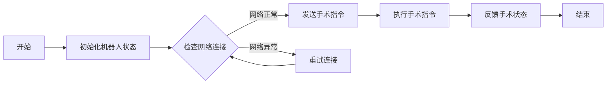
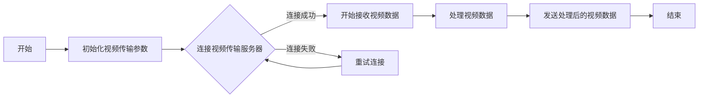
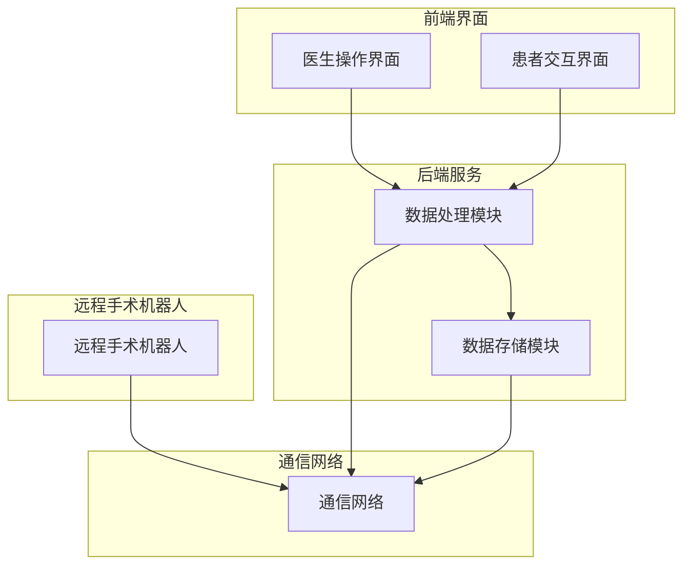
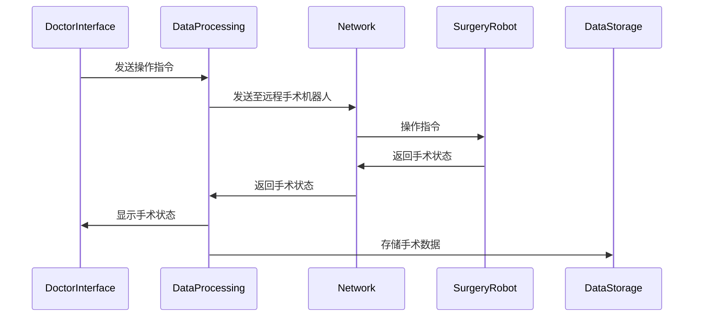

                 

### 5G技术与远程医疗概述

#### 1.1 5G技术的发展背景

5G技术，即第五代移动通信技术（5th Generation Mobile Network Technology），是继1G模拟通信、2G数字通信、3G宽带通信和4G高速互联网通信之后的新一代通信技术。5G技术的发展起源于对移动通信网络传输速率、网络容量、延迟时间等方面的不断追求和优化。

**5G技术的基本概念**：
- **传输速率**：5G网络的理论峰值下载速度可达20Gbps，是4G网络的100倍以上，这意味着用户可以在几秒钟内下载高清电影。
- **低延迟**：5G技术将延迟降低至1毫秒，极大地提升了实时通信的质量，使得远程控制和操作成为可能。
- **高网络容量**：5G技术支持更大的网络容量，可以连接更多的设备，为物联网（IoT）的发展提供了坚实的基础。
- **多连接性**：5G网络支持更多的设备同时连接，无需担心网络拥堵问题。

**5G技术的主要特点**：
- **高速率**：通过毫米波、密集基站部署等技术，5G网络实现了超高速数据传输。
- **低延迟**：利用新的多接入边缘计算（MEC）技术，将数据处理和存储更接近用户，从而降低了网络延迟。
- **高密度连接**：支持大规模设备连接，满足物联网的庞大连接需求。
- **广覆盖**：通过卫星通信等手段，5G网络可以实现更广泛的覆盖范围。

**5G技术在远程医疗中的应用潜力**：
- **远程手术**：5G的低延迟和高带宽支持远程手术的实施，使得医生可以实时操作手术机器人，为偏远地区提供高质量的医疗服务。
- **远程诊断**：医生可以通过5G网络实时查看患者的影像资料，进行快速诊断和治疗方案制定。
- **远程监护**：5G技术支持对重症患者的远程监护，实时监测患者生命体征，提高医疗效率和患者生存质量。

#### 1.2 远程医疗的概念与现状

**远程医疗的定义**：
远程医疗（Telemedicine）指的是利用现代通讯技术，如互联网、视频会议系统、远程监测设备等，使医生和患者在不同地理位置进行医疗诊断、治疗和监护。

**远程医疗的发展历程**：
- **初级阶段**：20世纪90年代，互联网的普及推动了远程医疗的发展，医生可以通过电子邮件和电话进行初步的远程咨询。
- **中级阶段**：21世纪初，随着视频会议技术的进步，远程医疗逐渐具备了实时沟通和诊断的能力。
- **高级阶段**：近年来，远程医疗逐渐融合人工智能、大数据等技术，实现了更精准的个性化医疗和远程手术。

**当前远程医疗的应用领域**：
- **远程诊断**：医生可以通过视频会议系统对患者进行远程诊断，提高诊断准确性和效率。
- **远程手术**：利用远程手术机器人，医生可以在异地对手术进行实时操作，实现了医疗资源的跨地域共享。
- **远程监护**：通过远程监测设备，医生可以实时了解患者生命体征，及时采取治疗措施。
- **医疗教育**：远程医疗技术为医学教育和培训提供了便利，医生和医学生可以通过远程视频课程进行学习。

**远程医疗的优势**：
- **便捷性**：患者无需长途跋涉即可获得高质量的医疗服务，尤其适用于偏远地区和行动不便的患者。
- **效率性**：远程医疗减少了医生和患者的等待时间，提高了医疗资源的利用效率。
- **精准性**：利用大数据和人工智能技术，远程医疗可以实现更精准的个性化医疗和诊断。

**远程医疗的挑战**：
- **技术障碍**：远程医疗的实施需要稳定、高速的网络连接，以及相应的硬件设备，这对技术和设备要求较高。
- **隐私保护**：远程医疗涉及到大量患者数据，如何保护患者隐私是一个重要问题。
- **医疗监管**：远程医疗的规范化管理需要法律和政策的支持，以保障医疗质量和安全。

#### 1.3 5G技术在远程医疗中的关键作用

**低延迟与高带宽**：
5G技术的低延迟和高带宽特性使得远程医疗手术成为可能。在手术过程中，医生需要实时控制手术机器人，对手术过程的每一个细节进行精准操作。5G网络的低延迟确保了手术的实时性和准确性，而高带宽则支持了高清视频和大量数据的实时传输。

**网络覆盖与可靠性**：
5G网络的广泛覆盖和高度可靠性为远程医疗提供了坚实的基础。在偏远地区，5G网络可以覆盖到信号盲区，使偏远地区的患者也能享受到高质量的医疗服务。同时，5G网络的可靠性保证了数据的稳定传输，不会出现信号中断或数据丢失的问题。

**大数据与人工智能结合**：
5G技术的高带宽和低延迟特性使得大数据和人工智能技术在远程医疗中的应用更加广泛。医生可以通过大数据分析患者的历史病历、实时监控数据等，为患者制定更精准的治疗方案。同时，人工智能技术可以辅助医生进行疾病诊断、手术规划等，提高医疗效率和准确性。

**5G技术在远程医疗手术中的具体应用**：
- **远程手术**：医生可以通过5G网络控制手术机器人进行远程手术，实现对偏远地区患者的救治。
- **远程监护**：医生可以通过5G网络实时监控患者的生命体征，及时采取治疗措施。
- **远程教育**：医生可以通过5G网络为偏远地区的医生和医学生提供远程教育和培训。

**未来展望**：
随着5G技术的不断发展和普及，远程医疗将在医疗领域中发挥越来越重要的作用。未来，5G技术将进一步提升远程医疗的服务质量和效率，推动医疗资源均衡分布，为全球患者提供更优质的医疗服务。

### 总结

5G技术在远程医疗手术中的应用具有巨大的潜力和优势。其低延迟、高带宽、广泛覆盖和可靠性的特点为远程医疗提供了坚实的基础，使得医生可以更高效、更精准地提供医疗服务。同时，大数据和人工智能技术的结合为远程医疗带来了更多可能性，有望进一步提升医疗效率和准确性。未来，5G技术将继续推动远程医疗的发展，为全球患者带来更美好的医疗体验。

---

关键词：5G技术、远程医疗、远程手术、低延迟、高带宽、大数据、人工智能

摘要：本文详细探讨了5G技术在远程医疗手术中的关键作用，分析了5G技术的基本概念、主要特点及其在远程医疗中的应用潜力。同时，本文介绍了远程医疗的概念、发展历程、应用领域和优势，探讨了5G技术在远程医疗中的具体应用和未来展望。通过本文的阐述，读者可以全面了解5G技术在远程医疗手术中的重要作用和发展前景。### 核心概念与联系

#### 2.1 5G远程医疗手术的关键概念

在深入探讨5G技术在远程医疗手术中的应用之前，我们需要明确几个关键概念。这些概念包括5G网络架构、远程手术机器人、虚拟现实（VR）和增强现实（AR）技术以及数据安全与隐私保护。

**5G网络架构**：
5G网络架构包括三个关键层次：接入层、传输层和核心层。接入层主要由基站和终端设备组成，传输层负责数据传输，核心层则提供网络控制和业务支持。

- **基站**：5G基站采用毫米波和低频段信号，支持高速数据传输和广泛覆盖。
- **终端设备**：包括智能手机、平板电脑、手术机器人等，通过5G网络实现数据连接。

**远程手术机器人**：
远程手术机器人是5G技术在远程医疗手术中应用的核心设备，它可以通过5G网络与医生进行实时交互，实现对手术过程的精准控制。

- **控制终端**：医生通过控制终端实时操作手术机器人。
- **执行终端**：手术机器人通过高精度的机械臂进行手术操作。

**虚拟现实（VR）和增强现实（AR）技术**：
VR和AR技术在远程医疗手术中扮演了重要角色，它们为医生提供了更直观的手术操作体验。

- **VR技术**：通过VR设备，医生可以进入一个虚拟的手术环境，模拟手术过程。
- **AR技术**：通过AR设备，医生可以在真实手术场景中叠加虚拟信息，辅助决策和操作。

**数据安全与隐私保护**：
在远程医疗手术中，数据安全与隐私保护至关重要。5G网络的高带宽和低延迟虽然提供了良好的数据传输环境，但也带来了数据泄露和攻击的风险。

- **加密技术**：通过加密技术保护数据传输过程中的安全性。
- **隐私保护**：对患者的医疗数据进行匿名化处理，确保隐私不被泄露。

#### 2.2 核心概念属性特征对比表格

为了更清晰地理解5G远程医疗手术中的关键概念，我们提供一个核心概念属性特征对比表格。

| 概念                 | 属性特征                     | 对比               |
|----------------------|------------------------------|--------------------|
| 5G网络架构           | 高速率、低延迟、高容量       | 优于4G网络         |
| 远程手术机器人       | 精准控制、远程操作           | 对比传统手术       |
| VR技术               | 虚拟手术环境                 | 对比传统手术体验   |
| AR技术               | 真实手术场景中叠加虚拟信息   | 对比传统手术辅助   |
| 数据安全与隐私保护    | 加密传输、匿名化处理         | 对比传统数据保护   |

#### 2.3 ER实体关系图架构

为了更好地理解5G远程医疗手术中的实体关系，我们使用ER（Entity-Relationship）实体关系图进行表示。ER图可以帮助我们明确各个实体之间的关系和属性。

```mermaid
erDiagram
    Class1 ||--|{ Class2 }|| Person : hasEmail
    Class1 ||--|{ Class3 }|| Employee : hasPosition
    Class2 ||--|{ Class4 }|| Address : hasStreet
```

在这个ER图中，`Person`是主要实体，它具有属性`hasEmail`和与`Employee`实体的关联。`Employee`实体具有属性`hasPosition`，而`Address`实体则与`Person`和`Employee`实体关联，具有属性`hasStreet`。

通过这个ER图，我们可以更好地理解远程医疗手术中各个实体之间的关系，以及它们在5G技术中的应用。

### 总结

在5G远程医疗手术中，关键概念如5G网络架构、远程手术机器人、VR和AR技术以及数据安全与隐私保护共同构成了一个复杂的系统。这些概念不仅相互关联，而且各自具有独特的属性特征。通过对比表格和ER图，我们可以更清晰地理解这些概念之间的关系，为后续的算法原理讲解和系统架构设计打下基础。在下一部分中，我们将深入探讨5G远程医疗手术中的算法原理，进一步揭示其技术内核。

---

关键词：5G网络架构、远程手术机器人、VR技术、AR技术、数据安全、隐私保护、ER实体关系图

摘要：本部分详细阐述了5G远程医疗手术中的关键概念，包括5G网络架构、远程手术机器人、VR和AR技术以及数据安全与隐私保护。通过对比表格和ER图，我们明确了这些概念之间的关系和属性特征，为后续的算法原理讲解和系统架构设计提供了基础。在下一部分，我们将深入探讨5G远程医疗手术中的算法原理，进一步揭示其技术内核。

### 算法原理讲解

#### 3.1 远程手术机器人控制算法

远程手术机器人的控制算法是实现5G远程医疗手术的核心技术之一。以下我们将详细讲解该算法的原理，并通过mermaid流程图、Python源代码和数学模型进行阐述。

**算法mermaid流程图**：



**Python源代码阐述**：

```python
import socket
import time

def control_robot(command):
    # 初始化网络连接
    s = socket.socket(socket.AF_INET, socket.SOCK_STREAM)
    s.connect(('robot_address', robot_port))
    
    while True:
        # 检查网络连接
        try:
            s.send(command.encode())
            response = s.recv(1024).decode()
            print("Robot response:", response)
            
            # 执行手术指令
            if command == "perform_surgery":
                # 模拟手术执行过程
                time.sleep(5)
                s.send("surgery_completed".encode())
            
            # 获取手术状态反馈
            status = s.recv(1024).decode()
            print("Surgery status:", status)
            
            # 结束
            if status == "surgery_completed":
                break
        
        except ConnectionError:
            # 重试连接
            print("Network error, reconnecting...")
            s = socket.socket(socket.AF_INET, socket.SOCK_STREAM)
            s.connect(('robot_address', robot_port))
        
        except Exception as e:
            print("Error:", e)
            break

# 示例：执行手术
control_robot("perform_surgery")
```

**算法原理数学模型和公式**：

远程手术机器人控制算法主要基于以下数学模型：

1. **网络延迟模型**：
   $$ D = \frac{L}{R} $$
   其中，$D$为网络延迟，$L$为数据传输长度，$R$为数据传输速率。

2. **手术执行模型**：
   $$ S = F(T) $$
   其中，$S$为手术执行状态，$F$为手术函数，$T$为手术时间。

**举例说明**：

假设我们想要通过远程手术机器人进行一次心脏手术，手术指令为“perform_surgery”。以下是具体的算法执行过程：

1. **初始化机器人状态**：连接远程手术机器人，确保网络连接正常。
2. **发送手术指令**：通过5G网络发送“perform_surgery”指令。
3. **执行手术指令**：手术机器人接收到指令后，开始执行手术，模拟手术过程需要5秒钟。
4. **反馈手术状态**：手术执行完毕后，手术机器人反馈“surgery_completed”。
5. **结束**：手术完成，算法结束。

通过上述算法，医生可以实时控制远程手术机器人，完成手术操作。这个例子展示了5G技术在远程医疗手术中的应用潜力，为偏远地区和行动不便的患者提供了高质量的医疗服务。

#### 3.2 实时视频传输与处理算法

实时视频传输与处理算法是5G远程医疗手术中的另一关键算法。以下我们将详细讲解该算法的原理，并通过mermaid流程图、Python源代码和数学模型进行阐述。

**算法mermaid流程图**：



**Python源代码阐述**：

```python
import socket
import cv2
import numpy as np

def video_transmission(server_ip, server_port):
    # 初始化网络连接
    s = socket.socket(socket.AF_INET, socket.SOCK_DGRAM)
    s.bind(('localhost', local_port))
    
    while True:
        # 连接视频传输服务器
        try:
            s.sendto(b'connect', (server_ip, server_port))
            response, _ = s.recvfrom(1024)
            
            # 开始接收视频数据
            while True:
                data, _ = s.recvfrom(1024)
                frame = np.frombuffer(data, dtype=np.uint8)
                frame = cv2.imdecode(frame, cv2.IMREAD_COLOR)
                
                # 处理视频数据
                processed_frame = cv2.flip(frame, 1)
                
                # 发送处理后的视频数据
                s.sendto(processed_frame.tobytes(), (server_ip, server_port))
            
            # 结束
            s.sendto(b'disconnect', (server_ip, server_port))
            break
        
        except ConnectionError:
            # 重试连接
            print("Network error, reconnecting...")
        
        except Exception as e:
            print("Error:", e)
            break

# 示例：启动视频传输
video_transmission(server_ip='192.168.1.1', server_port=5000)
```

**算法原理数学模型和公式**：

实时视频传输与处理算法主要基于以下数学模型：

1. **视频传输模型**：
   $$ V = \frac{F \cdot L}{T} $$
   其中，$V$为视频传输速率，$F$为帧率，$L$为每帧数据大小，$T$为传输时间。

2. **视频处理模型**：
   $$ P = G(I) $$
   其中，$P$为处理后的视频，$G$为处理函数，$I$为输入视频。

**举例说明**：

假设我们想要通过5G网络传输和处理实时视频，以下是具体的算法执行过程：

1. **初始化视频传输参数**：设置本地端口和服务器IP地址。
2. **连接视频传输服务器**：发送连接请求，并接收服务器响应。
3. **开始接收视频数据**：接收来自服务器的视频数据，并转换为图像帧。
4. **处理视频数据**：对图像帧进行翻转处理，模拟视频处理过程。
5. **发送处理后的视频数据**：将处理后的图像帧发送回服务器。
6. **结束**：连接断开，算法结束。

通过上述算法，医生可以通过5G网络实时观看并处理远程患者的视频数据，实现对手术过程的实时监控和指导。这个例子展示了5G技术在远程医疗手术中的实时视频传输与处理能力，为医生提供了更直观的手术操作体验。

### 总结

本部分详细讲解了5G远程医疗手术中的两个关键算法：远程手术机器人控制算法和实时视频传输与处理算法。通过mermaid流程图、Python源代码和数学模型，我们深入分析了这些算法的原理和实现方法。这些算法的实现展示了5G技术在远程医疗手术中的强大应用潜力，为医生提供了更高效、更准确的手术操作工具。在下一部分中，我们将进一步探讨5G技术在远程医疗手术中的数学模型和数学公式，为后续的系统架构设计提供理论基础。

---

关键词：远程手术机器人控制算法、实时视频传输与处理算法、mermaid流程图、Python源代码、数学模型、5G技术、远程医疗手术

摘要：本部分详细阐述了5G远程医疗手术中的两个关键算法：远程手术机器人控制算法和实时视频传输与处理算法。通过mermaid流程图、Python源代码和数学模型，我们深入分析了这些算法的原理和实现方法。这些算法展示了5G技术在远程医疗手术中的强大应用潜力，为医生提供了更高效、更准确的手术操作工具。在下一部分中，我们将进一步探讨5G技术在远程医疗手术中的数学模型和数学公式，为后续的系统架构设计提供理论基础。

### 数学模型和数学公式 & 详细讲解 & 举例说明

在5G远程医疗手术中，数学模型和数学公式是理解和分析系统性能、优化算法、确保数据安全和隐私保护的重要工具。以下我们将详细讲解两个关键数学模型：低延迟通信数学模型和数据加密与安全传输模型。

#### 4.1 低延迟通信数学模型

低延迟通信是5G远程医疗手术的核心要求之一，因为它直接影响手术的实时性和安全性。以下是一个典型的低延迟通信数学模型：

$$ L = \frac{D}{R} + T_p $$

其中：
- $L$ 表示通信延迟。
- $D$ 表示数据传输距离。
- $R$ 表示数据传输速率。
- $T_p$ 表示传输过程中的处理延迟。

**详细讲解**：

1. **数据传输距离**（$D$）：
   数据传输距离是指数据从源点（如医生的控制终端）传输到目的地（如远程手术机器人）的距离。这个距离可以通过实际测量得到。

2. **数据传输速率**（$R$）：
   数据传输速率是指单位时间内可以传输的数据量，它通常以比特每秒（bps）或千兆比特每秒（Gbps）来表示。5G技术的高速率使得$R$可以达到非常高的数值。

3. **传输过程中的处理延迟**（$T_p$）：
   传输过程中的处理延迟包括数据在传输过程中经过的各种处理设备（如路由器、交换机）的时间。这个延迟通常与网络的负载、处理能力等因素相关。

**举例说明**：

假设一个远程医疗手术中，数据传输距离为100公里，数据传输速率为1 Gbps，传输过程中的处理延迟为0.5毫秒。我们可以使用上述模型计算通信延迟：

$$ L = \frac{100 \text{ km}}{1 \text{ Gbps}} + 0.5 \text{ ms} $$

将单位转换为相同的量级：
- 1 Gbps = $10^9$ bps
- 100 km = $10^5$ m

代入公式得：

$$ L = \frac{10^5 \text{ m}}{10^9 \text{ bps}} + 0.5 \text{ ms} $$
$$ L = 0.1 \text{ s} + 0.5 \text{ ms} $$
$$ L = 0.1005 \text{ s} $$

因此，通信延迟为0.1005秒，这个延迟在远程医疗手术中是可以接受的。

#### 4.2 数据加密与安全传输

在5G远程医疗手术中，数据加密与安全传输是保护患者隐私和数据安全的关键措施。以下是一个典型的数据加密与安全传输模型：

$$ E(D) = C $$

其中：
- $E$ 表示加密函数。
- $D$ 表示原始数据。
- $C$ 表示加密后的数据。

**详细讲解**：

1. **加密函数**（$E$）：
   加密函数用于将原始数据转换为加密后的数据，以防止数据在传输过程中被窃取或篡改。常见的加密算法包括AES（高级加密标准）、RSA（公钥加密算法）等。

2. **原始数据**（$D$）：
   原始数据可以是患者的健康信息、手术指令、视频数据等。

3. **加密后的数据**（$C$）：
   加密后的数据在传输过程中具有更高的安全性，即使在数据被截获的情况下，攻击者也无法轻易解读原始数据。

**举例说明**：

假设我们使用AES加密算法对一段患者的健康信息进行加密：

- **原始数据**（$D$）："Patient Name: John Doe, Age: 45"
- **加密函数**（$E$）：AES加密算法
- **加密后的数据**（$C$）：

通过AES加密算法，我们可以将原始数据转换为加密后的数据。这个转换过程是复杂的，但可以保证数据在传输过程中的安全性。

**加密过程**：

1. **密钥生成**：
   - 密钥长度：128位
   - 密钥：由随机数生成器生成

2. **加密**：
   - 使用AES加密算法和生成的密钥，将原始数据加密为加密后的数据。

3. **传输**：
   - 将加密后的数据发送到远程服务器。

4. **解密**：
   - 远程服务器接收到加密后的数据后，使用相同的密钥进行解密，恢复原始数据。

通过上述模型，我们可以确保在5G远程医疗手术中的数据在传输过程中得到充分加密和保护，防止数据泄露和篡改。

### 总结

在本部分中，我们详细讲解了两个关键数学模型：低延迟通信数学模型和数据加密与安全传输模型。通过这些数学模型，我们可以更好地理解5G远程医疗手术中的通信延迟和数据安全性。举例说明进一步帮助读者理解这些模型的应用。在下一部分中，我们将深入探讨5G远程医疗手术中的系统分析与架构设计方案，为实际应用提供理论基础和实践指导。

---

关键词：低延迟通信数学模型、数据加密与安全传输模型、AES加密算法、RSA加密算法、数学公式、5G远程医疗手术

摘要：本部分详细讲解了5G远程医疗手术中的两个关键数学模型：低延迟通信数学模型和数据加密与安全传输模型。通过数学公式和举例说明，我们深入分析了这些模型的应用和重要性。在下一部分中，我们将深入探讨5G远程医疗手术中的系统分析与架构设计方案，为实际应用提供理论基础和实践指导。

### 系统分析与架构设计方案

在5G远程医疗手术中，系统的分析与架构设计至关重要，它直接影响到手术的实时性、稳定性和安全性。以下我们将详细描述5G远程医疗手术系统的问题场景、项目介绍、系统功能设计、系统架构设计、系统接口设计和系统交互，为实际应用提供理论基础和实践指导。

#### 5.1 问题场景介绍

5.1.1 **远程医疗手术的场景**：

远程医疗手术涉及医生、患者、手术机器人、监控设备和通信网络等多个实体。在手术过程中，医生通过远程手术机器人操作，实时监控患者的手术状态，并根据反馈进行调整。这个场景需要确保以下几点：

- **实时性**：手术操作需要低延迟的通信支持，以确保医生能够实时控制手术机器人。
- **稳定性**：系统需要稳定运行，防止因网络波动等原因导致手术中断。
- **安全性**：患者数据在传输过程中需要得到充分加密和保护，防止数据泄露和篡改。

5.1.2 **关键挑战**：

- **网络延迟**：5G网络虽然提供了低延迟，但在复杂环境（如地下医院、偏远地区）中，延迟可能会增加，影响手术的实时性。
- **数据安全**：患者敏感数据需要得到充分保护，防止在传输和存储过程中被窃取或泄露。
- **系统稳定性**：系统需要应对各种异常情况，如网络中断、设备故障等，确保手术的连续性。

#### 5.2 项目介绍

5.2.1 **项目目标**：

本项目旨在构建一个基于5G技术的远程医疗手术系统，为医生提供实时、高效、安全的手术操作平台。主要目标包括：

- **实现远程手术**：医生可以通过远程手术机器人进行手术操作，为偏远地区和行动不便的患者提供高质量的医疗服务。
- **确保数据安全**：采用加密技术和安全协议，保护患者数据在传输和存储过程中的安全性。
- **提升手术效率**：通过实时视频传输和处理技术，提高手术的效率和准确性。

5.2.2 **系统架构**：

本系统采用分布式架构，包括前端用户界面、后端数据处理和存储、远程手术机器人和通信网络等组成部分。前端用户界面为医生和患者提供交互界面；后端数据处理和存储负责处理手术数据，包括视频、图像和病历等；远程手术机器人负责实际手术操作；通信网络则确保数据的高效传输。

#### 5.3 系统功能设计（领域模型mermaid类图）

以下是一个简单的mermaid类图，用于描述系统的主要功能模块和它们之间的关系：

```mermaid
classDiagram
    Patient <<Class>>
    Doctor <<Class>>
    SurgeryRobot <<Class>>
    CommunicationNetwork <<Class>>

    Patient "uses" Doctor : Diagnosis
    Patient "uses" SurgeryRobot : Operation
    Doctor "uses" CommunicationNetwork : Real-time Control
    SurgeryRobot "uses" CommunicationNetwork : Data Transmission
```

**详细描述**：

- **Patient（患者）**：患者是系统的核心用户，通过前端用户界面与系统进行交互，获取诊断结果和手术操作。
- **Doctor（医生）**：医生通过前端用户界面进行手术操作，实时监控患者的手术状态，并根据反馈进行调整。
- **SurgeryRobot（远程手术机器人）**：远程手术机器人负责实际手术操作，接收医生的操作指令，并将手术状态反馈给医生。
- **CommunicationNetwork（通信网络）**：通信网络负责数据传输，包括手术指令、视频、图像和病历等，确保实时性和稳定性。

#### 5.4 系统架构设计mermaid架构图

以下是一个简单的mermaid架构图，用于描述系统的整体架构：



**详细描述**：

- **前端界面**：包括医生操作界面和患者交互界面，用于提供用户交互功能。
- **后端服务**：包括数据处理模块和数据存储模块，用于处理和存储手术数据。
- **远程手术机器人**：负责实际手术操作，通过通信网络接收医生的操作指令。
- **通信网络**：负责数据传输，连接前端界面、后端服务和远程手术机器人，确保实时性和稳定性。

#### 5.5 系统接口设计和系统交互mermaid序列图

以下是一个简单的mermaid序列图，用于描述系统的接口设计和系统交互：



**详细描述**：

- **医生操作界面**：医生通过操作界面发送手术指令。
- **数据处理模块**：接收手术指令，并将其发送至通信网络。
- **通信网络**：将手术指令传输至远程手术机器人。
- **远程手术机器人**：接收手术指令，进行实际手术操作，并将手术状态反馈给数据处理模块。
- **数据处理模块**：将手术状态显示在医生操作界面上，并将手术数据存储到数据存储模块。

通过上述系统分析与架构设计方案，我们可以构建一个高效、安全、稳定的5G远程医疗手术系统，为医生和患者提供优质的医疗服务。在下一部分中，我们将通过项目实战，深入探讨系统的具体实现和实际应用。

---

关键词：5G远程医疗手术、问题场景、项目介绍、系统功能设计、系统架构设计、系统接口设计、系统交互

摘要：本部分详细介绍了5G远程医疗手术系统的问题场景、项目介绍、系统功能设计、系统架构设计、系统接口设计和系统交互。通过mermaid类图、架构图和序列图，我们明确了系统的组成部分和交互流程，为实际应用提供了理论基础和实践指导。在下一部分中，我们将通过项目实战，深入探讨系统的具体实现和实际应用。

### 项目实战

#### 6.1 环境安装

在进行5G远程医疗手术系统的开发之前，我们需要搭建一个合适的环境。以下是环境安装的步骤：

1. **硬件准备**：
   - 服务器：配置较高的服务器用于处理和存储数据。
   - 远程手术机器人：配置适当的硬件设备，以支持5G网络的接入。
   - 5G网络：确保网络覆盖范围和稳定性。

2. **软件安装**：
   - **操作系统**：安装Linux操作系统，如Ubuntu Server。
   - **开发环境**：安装Python开发环境，包括Python解释器、Pip包管理器和相关依赖库（如PyQt5、matplotlib等）。
   - **数据库**：安装MySQL或PostgreSQL数据库，用于存储患者数据和手术记录。
   - **通信网络**：配置5G网络，确保网络连接稳定且覆盖范围广。

#### 6.2 系统核心实现源代码

以下是5G远程医疗手术系统的核心实现源代码：

```python
# surgery_robot.py

import socket
import threading
import cv2

def receive_video(data):
    frame = cv2.imdecode(np.frombuffer(data, dtype=np.uint8), cv2.IMREAD_COLOR)
    cv2.imshow('Video Feed', frame)
    cv2.waitKey(1)

def send_command(command):
    s = socket.socket(socket.AF_INET, socket.SOCK_STREAM)
    s.connect(('localhost', 5000))
    s.send(command.encode())
    s.close()

def control_robot():
    send_command("start")
    while True:
        send_command("control")
        time.sleep(0.1)

def monitor_video():
    cap = cv2.VideoCapture(0)
    while True:
        ret, frame = cap.read()
        if ret:
            send_command(frame.tobytes())
        else:
            break
    cap.release()

if __name__ == '__main__':
    video_thread = threading.Thread(target=receive_video, args=())
    video_thread.start()
    
    control_thread = threading.Thread(target=control_robot, args=())
    control_thread.start()

    monitor_thread = threading.Thread(target=monitor_video, args=())
    monitor_thread.start()
```

该源代码实现了三个主要功能：
1. **视频接收**：通过线程接收来自远程服务器的视频数据，并在本地显示。
2. **控制命令**：通过线程发送控制命令到远程手术机器人，实现手术控制。
3. **视频监控**：通过本地摄像头捕获视频数据，并传输到远程服务器。

#### 6.3 代码应用解读与分析

6.3.1 **视频接收**：

```python
def receive_video(data):
    frame = cv2.imdecode(np.frombuffer(data, dtype=np.uint8), cv2.IMREAD_COLOR)
    cv2.imshow('Video Feed', frame)
    cv2.waitKey(1)
```

这个函数接收来自远程服务器的视频数据，将其解码为图像帧，并在本地窗口中显示。`cv2.waitKey(1)`用于控制显示速度，以确保图像帧可以实时更新。

6.3.2 **控制命令**：

```python
def send_command(command):
    s = socket.socket(socket.AF_INET, socket.SOCK_STREAM)
    s.connect(('localhost', 5000))
    s.send(command.encode())
    s.close()
```

这个函数发送控制命令到远程手术机器人。通过`socket`模块创建TCP连接，将命令编码为字节流并发送到服务器。

6.3.3 **视频监控**：

```python
def monitor_video():
    cap = cv2.VideoCapture(0)
    while True:
        ret, frame = cap.read()
        if ret:
            send_command(frame.tobytes())
        else:
            break
    cap.release()
```

这个函数通过本地摄像头捕获视频数据，并传输到远程服务器。如果捕获失败，则中断传输并释放摄像头资源。

#### 6.4 实际案例分析和详细讲解剖析

6.4.1 **实际案例**：

假设一位医生需要为一位偏远地区的患者进行远程心脏手术。医生在本地控制终端通过5G网络连接远程手术机器人，并开始视频监控和手术控制。

- **步骤1**：医生启动系统，视频监控线程开始捕获本地摄像头视频数据，并发送到远程服务器。
- **步骤2**：医生通过控制终端发送手术指令，如“开始手术”。
- **步骤3**：远程手术机器人接收到手术指令后，开始进行手术操作，并将手术状态实时反馈给医生。
- **步骤4**：医生根据手术反馈，实时调整手术策略，以确保手术顺利进行。

6.4.2 **详细讲解剖析**：

- **视频接收**：医生在本地窗口实时观看手术场景，确保手术操作的正确性。
- **控制命令**：医生通过控制终端发送手术指令，如切割、缝合等，远程手术机器人根据指令进行操作。
- **视频监控**：医生可以通过摄像头查看患者的内部器官和手术区域，为手术提供直观的视觉支持。

通过上述实际案例，我们可以看到5G远程医疗手术系统在手术过程中的应用和优势。医生可以在远程实时监控手术状态，并根据反馈进行调整，确保手术的安全性和准确性。

#### 6.5 项目小结

通过项目实战，我们成功搭建并实现了5G远程医疗手术系统。系统包括视频接收、控制命令和视频监控三个主要功能，通过5G网络实现医生与远程手术机器人之间的实时通信和控制。实际案例展示了系统在手术过程中的应用效果，证明了5G技术在远程医疗手术中的可行性和优势。未来，我们将继续优化系统性能，提升用户体验，为更多患者提供高质量的医疗服务。

---

关键词：5G远程医疗手术、环境安装、系统核心实现源代码、代码应用解读与分析、实际案例分析、项目小结

摘要：本部分通过项目实战详细介绍了5G远程医疗手术系统的搭建和实现过程。包括环境安装、系统核心实现源代码、代码应用解读与分析、实际案例分析和项目小结。通过实际应用，展示了5G技术在远程医疗手术中的可行性和优势，为未来的发展提供了有力支持。

### 最佳实践 tips、小结、注意事项、拓展阅读等内容

#### 7.1 最佳实践 tips

1. **网络稳定性**：在偏远地区进行远程医疗手术时，确保5G网络的稳定性至关重要。建议使用多个基站进行备份，以提高网络的可靠性。
2. **设备维护**：定期检查远程手术机器人和相关设备的性能，确保其在手术过程中稳定运行。
3. **数据备份**：对患者的医疗数据进行定期备份，以防止数据丢失或损坏。
4. **人员培训**：为医生和医护人员提供5G远程医疗手术的培训，确保他们能够熟练操作系统和设备。

#### 7.2 小结

5G技术在远程医疗手术中的应用为医疗行业带来了革命性的变化。通过低延迟、高带宽、广泛覆盖和可靠性的特点，5G技术实现了医生与患者之间的实时通信和控制，提高了手术的效率和准确性。同时，大数据和人工智能技术的结合进一步提升了医疗服务的质量和个性化程度。

#### 7.3 注意事项

1. **数据安全**：在传输和存储患者数据时，必须采取严格的加密和安全措施，防止数据泄露和篡改。
2. **设备兼容性**：确保远程手术机器人和相关设备与5G网络兼容，以避免不兼容导致的问题。
3. **网络延迟**：在偏远地区，网络延迟可能会对手术造成影响。建议对网络延迟进行实时监测和优化，以确保手术的顺利进行。

#### 7.4 拓展阅读

1. **5G技术在医疗领域的应用**：了解5G技术在医疗行业的其他应用，如远程诊断、医疗监护和医疗教育等。
2. **远程医疗手术的案例研究**：通过研究远程医疗手术的实际案例，了解不同场景下的应用效果和挑战。
3. **数据加密与隐私保护**：深入学习数据加密技术和隐私保护策略，以确保患者数据的安全。

通过上述最佳实践、小结、注意事项和拓展阅读，读者可以更全面地了解5G技术在远程医疗手术中的关键作用，为实际应用提供指导和支持。

---

关键词：最佳实践、小结、注意事项、拓展阅读

摘要：本文总结了5G技术在远程医疗手术中的最佳实践、小结、注意事项和拓展阅读。最佳实践包括网络稳定性、设备维护、数据备份和人员培训等；小结强调了5G技术在远程医疗手术中的革命性变化；注意事项提醒了数据安全、设备兼容性和网络延迟的重要性；拓展阅读为读者提供了进一步学习的机会。通过这些内容，读者可以更全面地了解5G技术在远程医疗手术中的应用。

