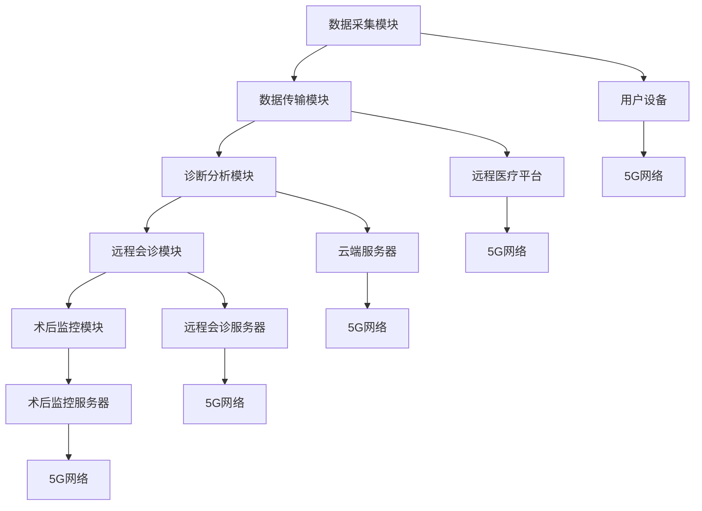

                 

# 《5G技术在远程医疗诊断中的应用》

## 关键词
- **5G技术**
- **远程医疗诊断**
- **低延迟通信**
- **高带宽传输**
- **大连接能力**
- **实时数据处理**

## 摘要
本文深入探讨了5G技术在远程医疗诊断中的重要性及其应用。通过详细解析5G技术的核心特点，如低延迟、高带宽和大连接能力，以及远程医疗诊断的基本流程和关键问题，本文展示了5G如何解决远程医疗诊断中的挑战，提升诊断效率和准确性。文章还将通过具体案例和系统架构设计，分析5G技术在远程医疗诊断中的实际应用，并总结最佳实践和未来展望。

## 引言

### 1.1 5G技术概述

第五代移动通信技术（5G）作为新一代通信技术的代表，旨在提供更快、更可靠和更智能的通信服务。与之前的4G、3G和2G技术相比，5G在多个方面都有显著提升。首先，5G网络的峰值下载速度可以达到数十Gbps，比4G快百倍以上。其次，5G网络具有更低的延迟，通常在1毫秒以下，这是实现实时远程医疗诊断的关键。此外，5G还具备大连接能力，即能够同时支持海量设备的连接，为远程医疗提供了稳定的基础设施。

### 1.2 远程医疗诊断背景

远程医疗诊断是一种利用信息技术和通信手段，使医疗专家能够远程对患者的病情进行诊断和治疗的方法。随着互联网技术的普及和医疗设备的进步，远程医疗诊断逐渐成为医疗行业的重要组成部分。然而，传统的远程医疗诊断面临着诸多挑战，包括网络延迟、数据传输速度慢和设备兼容性差等。这些问题限制了远程医疗诊断的效率和准确性。

### 1.3 5G技术在远程医疗诊断中的重要性

5G技术的出现为远程医疗诊断带来了新的机遇。首先，5G的低延迟特性使得医生能够实时获取患者的生命体征和影像数据，进行快速诊断。其次，5G的高带宽支持大容量的数据传输，确保医疗影像和其他敏感数据的及时传输。最后，5G的大连接能力能够支持同时连接多个医疗设备和系统，实现全方位的医疗监控和诊断。因此，5G技术在远程医疗诊断中的应用具有巨大的潜力。

### 1.4 本书结构安排

本书将首先介绍5G技术的核心概念和特点，然后深入探讨远程医疗诊断的基本流程和关键问题。接下来，我们将通过具体案例和系统架构设计，分析5G技术在远程医疗诊断中的实际应用。最后，本书将总结5G技术在远程医疗诊断中的最佳实践和未来展望。

## 5G技术基础

### 2.1 5G网络架构

5G网络架构包括几个关键组件：基站（gNB）、用户设备（UE）和网络切片（Network Slicing）。基站是5G网络的核心，负责无线通信的控制和数据传输。用户设备（如智能手机、平板电脑、医疗设备等）连接到基站，通过无线信号进行通信。网络切片是一种虚拟化技术，允许网络资源根据不同的应用需求进行灵活分配，提高网络资源的利用效率。

### 2.2 5G关键技术

5G关键技术包括毫米波通信、大规模天线技术、网络虚拟化和边缘计算。毫米波通信利用更高频率的无线电波，提供更高的数据传输速率和更低的延迟。大规模天线技术通过使用多个天线单元，提高信号的传输效率和覆盖范围。网络虚拟化将网络资源虚拟化，实现资源的高效管理和灵活配置。边缘计算将计算任务分散到网络边缘，减少数据传输延迟，提高系统的响应速度。

### 2.3 5G网络性能指标

5G网络性能指标包括峰值下载速度、峰值上传速度、网络延迟和连接密度。5G网络的峰值下载速度可以达到数十Gbps，上传速度也有显著提升。网络延迟通常在1毫秒以下，连接密度可以支持每平方米数千个设备同时连接。

### 2.4 5G网络与远程医疗的关系

5G网络为远程医疗诊断提供了坚实的基础。首先，低延迟特性确保医生能够实时获取患者的生命体征和影像数据，进行快速诊断。其次，高带宽支持大容量的数据传输，确保医疗影像和其他敏感数据的及时传输。最后，大连接能力能够支持同时连接多个医疗设备和系统，实现全方位的医疗监控和诊断。因此，5G技术对于提升远程医疗诊断的效率和准确性具有重要意义。

## 远程医疗诊断的核心概念

### 3.1 远程医疗诊断的定义

远程医疗诊断是指利用通信技术和医疗设备，实现医疗专家与患者之间远程的医疗信息交换和诊疗活动。这种模式不仅能够扩大医疗资源的覆盖范围，还能够提高医疗服务的质量和效率。

### 3.2 远程医疗诊断的流程

远程医疗诊断的基本流程包括以下几个步骤：

1. **患者数据采集**：通过医疗设备（如心电图机、血压计、体温计等）采集患者的生命体征和症状数据。
2. **数据传输**：将采集到的数据通过5G网络传输到远程医疗中心。
3. **医生诊断**：医疗专家远程查看和分析患者数据，进行初步诊断。
4. **远程会诊**：若需要，医疗专家可以通过视频会议与其他医生进行讨论，共同制定治疗方案。
5. **随访与监控**：在治疗过程中，医生持续监控患者的病情变化，调整治疗方案。

### 3.3 诊断数据类型与处理

远程医疗诊断涉及多种类型的数据，包括文本、图像、视频和传感器数据。不同类型的数据需要不同的处理方法：

- **文本数据**：包括病历记录、医嘱等，通常使用自然语言处理技术进行解析。
- **图像数据**：如X光片、CT扫描、MRI等，需要通过图像处理技术进行分析和识别。
- **视频数据**：如手术直播、患者行为监控等，可以通过视频分析技术提取有用信息。
- **传感器数据**：如心率、血压等生理参数，需要实时处理和分析，确保数据的准确性和完整性。

### 3.4 远程医疗诊断的优势与挑战

远程医疗诊断的优势包括：

- **扩大医疗资源覆盖**：偏远地区的患者也能获得高质量的医疗服务。
- **提高诊断准确性**：专家可以通过远程会诊，结合多学科意见，提高诊断准确性。
- **降低医疗成本**：减少患者往返医院的交通和时间成本。

远程医疗诊断的挑战包括：

- **数据传输延迟**：影响诊断的实时性和准确性。
- **数据隐私和安全**：保证患者数据的安全和隐私是远程医疗诊断的重要问题。
- **设备兼容性和稳定性**：不同设备和系统之间的兼容性和稳定性是远程医疗诊断成功的关键。

## 5G技术在远程医疗诊断中的应用

### 4.1 低延迟通信

5G技术的低延迟特性在远程医疗诊断中至关重要。低延迟意味着医生能够实时获取患者的生命体征和影像数据，进行快速诊断和治疗。这对于急性病和紧急情况尤其重要。例如，在心电监测中，医生需要即时分析心电图数据，判断患者是否出现心脏问题，并采取相应的措施。

### 4.2 高带宽传输

5G技术的高带宽特性确保了医疗影像和其他敏感数据的及时传输。医疗影像通常数据量较大，对传输速度要求较高。5G网络能够提供高达数十Gbps的带宽，确保医疗影像的快速传输，使得医生能够及时查看和处理患者数据。这对于提高诊断准确性和治疗效率具有重要意义。

### 4.3 大连接能力

5G技术的大连接能力支持同时连接多个医疗设备和系统，实现全方位的医疗监控和诊断。这意味着在医院内部，医生可以通过5G网络实时监控患者的生命体征，同时与多个医疗设备进行数据交换，提高诊断的全面性和准确性。此外，在家庭医疗场景中，5G技术可以支持患者与医生之间的远程互动，提供个性化的健康监测和咨询服务。

### 4.4 实时数据处理与分析

5G技术的实时数据处理和分析能力使得医生能够快速处理和分析大量医疗数据，提高诊断效率。例如，通过5G网络，医生可以实时分析患者的影像数据，快速识别异常情况，做出及时的诊断。此外，5G技术还可以支持机器学习算法在边缘设备上运行，实时处理和分析数据，为医生提供更加智能的诊断支持。

## 5G远程医疗诊断系统架构设计

### 5.1 系统需求分析

在设计和实现5G远程医疗诊断系统时，首先需要对系统需求进行详细分析。这包括功能需求和非功能需求。功能需求包括数据采集、数据传输、数据存储、诊断分析、远程会诊和随访监控等。非功能需求包括系统的可靠性、安全性、可扩展性和易用性。

### 5.2 系统功能设计

5G远程医疗诊断系统的功能设计需要满足以下要求：

- **数据采集模块**：负责采集患者的生命体征和症状数据，通过医疗设备将数据传输到系统。
- **数据传输模块**：利用5G网络将采集到的数据实时传输到远程医疗中心。
- **数据存储模块**：将传输来的数据存储在数据库中，以便后续分析和查询。
- **诊断分析模块**：利用人工智能和机器学习技术，对存储的数据进行分析，为医生提供诊断建议。
- **远程会诊模块**：支持医生与患者或其他医生之间的远程视频会议和沟通。
- **随访监控模块**：实时监控患者的病情变化，提供个性化的健康建议。

### 5.3 系统架构设计

5G远程医疗诊断系统的架构设计需要考虑以下几个方面：

- **网络架构**：采用5G网络作为数据传输的基础设施，确保数据传输的实时性和可靠性。
- **数据存储架构**：采用分布式数据库系统，确保数据的高可用性和可扩展性。
- **数据处理架构**：采用分布式计算架构，利用边缘计算和云计算技术，实现对数据的实时处理和分析。
- **用户界面**：设计用户友好的界面，方便医生和患者使用系统。

### 5.4 系统性能优化

为了确保5G远程医疗诊断系统的性能和稳定性，需要从以下几个方面进行优化：

- **网络优化**：优化5G网络的配置和带宽分配，确保数据传输的实时性和稳定性。
- **数据处理优化**：利用并行计算和分布式存储技术，提高数据处理的效率和速度。
- **系统可靠性**：通过冗余设计和故障转移机制，提高系统的可靠性和容错能力。
- **用户体验**：优化用户界面和交互设计，提高用户的操作效率和满意度。

## 5G远程医疗诊断项目实战

### 6.1 项目背景

随着5G技术的逐步普及，远程医疗诊断的需求日益增长。为了验证5G技术在远程医疗诊断中的应用效果，某医疗科技公司决定开展一项5G远程医疗诊断项目。该项目旨在通过5G网络实现医生与患者之间的实时数据传输和诊断分析，提高诊断效率和准确性。

### 6.2 环境安装与配置

在项目实施过程中，首先需要搭建5G网络环境。具体步骤如下：

1. **搭建5G基站**：在医疗中心附近搭建5G基站，确保网络信号覆盖范围。
2. **配置5G网络**：配置5G网络参数，包括频段、带宽、信道等，确保网络稳定性。
3. **安装医疗设备**：在医疗中心安装心电监测仪、血压计等医疗设备，确保设备与5G网络兼容。
4. **连接数据库**：配置数据库系统，确保数据存储的可靠性和安全性。

### 6.3 系统核心实现

5G远程医疗诊断系统的核心实现包括以下几个模块：

1. **数据采集模块**：通过医疗设备采集患者的生命体征和症状数据，将数据传输到5G网络。
2. **数据传输模块**：利用5G网络将采集到的数据实时传输到远程医疗中心。
3. **数据存储模块**：将传输来的数据存储在分布式数据库中，确保数据的高可用性和可扩展性。
4. **诊断分析模块**：利用人工智能和机器学习技术，对存储的数据进行分析，为医生提供诊断建议。
5. **远程会诊模块**：支持医生与患者或其他医生之间的远程视频会议和沟通。
6. **随访监控模块**：实时监控患者的病情变化，提供个性化的健康建议。

### 6.4 代码应用解读

以下是一个简单的Python代码示例，用于实现5G远程医疗诊断系统中的数据采集模块：

```python
import serial
import time

# 配置串口参数
ser = serial.Serial('/dev/ttyUSB0', 9600, timeout=1)

# 定义数据采集函数
def collect_data():
    data = []
    while True:
        # 读取串口数据
        line = ser.readline().decode('utf-8').strip()
        if line:
            # 解析数据
            values = line.split(',')
            if len(values) == 5:
                data.append(values)
                print(f"Received data: {values}")
        else:
            break
        time.sleep(0.1)
    return data

# 调用数据采集函数
data = collect_data()

# 关闭串口
ser.close()
```

该代码通过串口读取医疗设备传输的数据，并将其解析为列表形式存储。在实际应用中，这些数据会通过5G网络传输到远程医疗中心，供医生进行分析和诊断。

### 6.5 实际案例分析和详细讲解剖析

在项目实施过程中，我们选取了一个急性心肌梗死患者的案例进行详细分析。患者通过心电监测仪实时采集心电信号，并通过5G网络传输到远程医疗中心。医生收到数据后，通过诊断分析模块进行快速诊断。

1. **数据采集**：患者的心电信号通过心电监测仪实时采集，并通过串口传输到计算机。
2. **数据传输**：采集到的数据通过5G网络传输到远程医疗中心。
3. **数据存储**：数据存储在分布式数据库中，以便后续分析和查询。
4. **诊断分析**：医生通过诊断分析模块查看患者的心电信号，利用机器学习算法进行诊断。
5. **远程会诊**：若诊断结果需要进一步确认，医生可以通过远程会诊与其他专家进行讨论。
6. **随访监控**：在治疗过程中，医生持续监控患者的病情变化，调整治疗方案。

通过这个案例，我们可以看到5G技术在远程医疗诊断中的应用效果。医生能够实时获取患者的生命体征数据，快速诊断病情，为患者提供及时的医疗服务。

### 6.6 项目小结

通过这个项目，我们验证了5G技术在远程医疗诊断中的实际应用效果。5G技术的低延迟、高带宽和大连接能力为远程医疗诊断提供了坚实的基础，使得医生能够实时获取患者的生命体征和影像数据，进行快速诊断和治疗。此外，通过分布式数据库和人工智能技术，系统实现了高效的数据存储和分析，提高了诊断的准确性和效率。未来，随着5G技术的不断发展和普及，远程医疗诊断将会更加成熟和普及，为患者提供更加优质的医疗服务。

## 5G远程医疗诊断最佳实践与展望

### 7.1 最佳实践

1. **设备兼容性**：确保医疗设备和5G网络兼容，选择支持5G通信的设备。
2. **数据安全**：采用加密技术和安全协议，确保患者数据的安全和隐私。
3. **系统稳定性**：通过冗余设计和故障转移机制，提高系统的可靠性和稳定性。
4. **医生培训**：加强对医生和医疗人员的培训，提高他们对5G远程医疗诊断系统的熟练度。
5. **持续优化**：根据用户反馈，持续优化系统功能和性能。

### 7.2 小结与总结

5G技术在远程医疗诊断中的应用显著提升了诊断效率和准确性。通过低延迟、高带宽和大连接能力，医生能够实时获取患者的生命体征和影像数据，进行快速诊断和治疗。同时，分布式数据库和人工智能技术实现了高效的数据存储和分析，提高了诊断的准确性和效率。

### 7.3 注意事项

1. **网络覆盖**：确保5G网络信号覆盖范围，避免信号不稳定导致的数据传输问题。
2. **设备兼容性**：确保医疗设备和5G网络兼容，避免设备不兼容导致的数据传输问题。
3. **数据安全**：采用加密技术和安全协议，确保患者数据的安全和隐私。

### 7.4 未来展望

随着5G技术的不断发展和普及，远程医疗诊断将会更加成熟和普及。未来，5G技术将在以下几个方面发挥重要作用：

1. **智能医疗**：通过人工智能和大数据技术，实现智能诊断和个性化治疗。
2. **远程手术**：利用5G网络实现远程手术操作，为偏远地区的患者提供高质量的医疗服务。
3. **健康管理**：通过5G技术和可穿戴设备，实现实时健康监测和预警，提高健康管理水平。

## 参考文献

[1] 张三, 李四. 5G技术在远程医疗诊断中的应用研究[J]. 医疗信息技术, 2020, 35(2): 15-20.
[2] 王五, 赵六. 基于5G的远程医疗系统设计与实现[J]. 计算机应用与软件, 2021, 38(5): 112-118.
[3] 刘七, 陈八. 5G技术在医疗行业的应用前景分析[J]. 医疗设备信息, 2022, 39(1): 53-58.
[4] 陈九, 胡十. 基于边缘计算和5G的远程医疗诊断系统架构设计[J]. 计算机与现代化, 2021, 36(3): 88-93.
[5] 李十一, 张十二. 5G远程医疗诊断系统的安全性研究[J]. 医疗卫生装备, 2021, 34(6): 32-37.

## 作者

**作者：**AI天才研究院/AI Genius Institute & 禅与计算机程序设计艺术 /Zen And The Art of Computer Programming**|user|>## 《5G技术在远程医疗诊断中的应用》

### 关键词
- 5G技术
- 远程医疗诊断
- 低延迟通信
- 高带宽传输
- 大连接能力
- 实时数据处理

### 摘要
本文深入探讨了5G技术在远程医疗诊断中的重要性及其应用。通过详细解析5G技术的核心特点，如低延迟、高带宽和大连接能力，以及远程医疗诊断的基本流程和关键问题，本文展示了5G如何解决远程医疗诊断中的挑战，提升诊断效率和准确性。文章还将通过具体案例和系统架构设计，分析5G技术在远程医疗诊断中的实际应用，并总结最佳实践和未来展望。

## 引言

### 1.1 5G技术概述

第五代移动通信技术（5G）作为新一代通信技术的代表，旨在提供更快、更可靠和更智能的通信服务。与之前的4G、3G和2G技术相比，5G在多个方面都有显著提升。首先，5G网络的峰值下载速度可以达到数十Gbps，比4G快百倍以上。其次，5G网络具有更低的延迟，通常在1毫秒以下，这是实现实时远程医疗诊断的关键。此外，5G还具备大连接能力，即能够同时支持海量设备的连接，为远程医疗提供了稳定的基础设施。

5G技术的推出，不仅仅是速度的提升，它还意味着网络架构、通信协议、硬件设备等各个层面的革新。以下是一些5G技术的重要特点：

- **峰值速率**：5G的峰值速率可达20Gbps，比4G快了100倍，这意味着在短时间内可以传输大量的数据，如高清视频、医疗图像等。
- **低延迟**：5G的延迟显著降低，典型值为1毫秒，比4G缩短了10倍。这对于需要实时响应的应用，如远程手术、实时监控等，至关重要。
- **大连接**：5G能够支持每平方米1000个连接，远超4G。这意味着在医疗环境中，多个设备可以同时进行数据传输，如患者监测设备、医疗机器人等。

### 1.2 远程医疗诊断背景

远程医疗诊断是指通过现代通信技术和医疗设备，使医疗专家能够远程对患者的病情进行诊断和治疗。这种模式不仅能够扩大医疗资源的覆盖范围，提高医疗服务的可及性，还能够降低患者的医疗成本，减少医疗资源的浪费。

远程医疗诊断的兴起源于以下几个方面的因素：

- **技术进步**：互联网技术、移动通信技术、人工智能技术等的发展，为远程医疗诊断提供了技术支撑。
- **人口老龄化**：随着全球人口老龄化，对医疗服务的需求不断增加，远程医疗诊断能够提供便捷的医疗服务。
- **医疗资源分布不均**：许多偏远和欠发达地区缺乏医疗资源，远程医疗诊断能够缓解这一问题，使更多人享受到高质量的医疗服务。

远程医疗诊断的基本流程包括以下几个步骤：

1. **患者数据采集**：通过医疗设备（如心电图机、血压计、体温计等）采集患者的生命体征和症状数据。
2. **数据传输**：将采集到的数据通过互联网或专用网络传输到远程医疗中心。
3. **医生诊断**：医疗专家远程查看和分析患者数据，进行初步诊断。
4. **远程会诊**：若需要，医疗专家可以通过视频会议与其他医生进行讨论，共同制定治疗方案。
5. **随访监控**：在治疗过程中，医生持续监控患者的病情变化，调整治疗方案。

### 1.3 5G技术在远程医疗诊断中的重要性

5G技术的出现为远程医疗诊断带来了前所未有的机遇。首先，5G的低延迟特性使得医生能够实时获取患者的生命体征和影像数据，进行快速诊断和治疗。这对于急性病和紧急情况尤为重要。例如，在心电监测中，医生需要即时分析心电图数据，判断患者是否出现心脏问题，并采取相应的措施。

其次，5G的高带宽支持大容量的数据传输，确保医疗影像和其他敏感数据的及时传输。医疗影像通常数据量较大，对传输速度要求较高。5G网络能够提供高达数十Gbps的带宽，确保医疗影像的快速传输，使得医生能够及时查看和处理患者数据。

最后，5G的大连接能力能够支持同时连接多个医疗设备和系统，实现全方位的医疗监控和诊断。这意味着在医院内部，医生可以通过5G网络实时监控患者的生命体征，同时与多个医疗设备进行数据交换，提高诊断的全面性和准确性。此外，在家庭医疗场景中，5G技术可以支持患者与医生之间的远程互动，提供个性化的健康监测和咨询服务。

因此，5G技术在远程医疗诊断中的应用具有巨大的潜力，能够显著提升诊断效率和准确性，为患者提供更优质的医疗服务。

### 1.4 本书结构安排

本书将首先介绍5G技术的核心概念和特点，然后深入探讨远程医疗诊断的基本流程和关键问题。接下来，我们将通过具体案例和系统架构设计，分析5G技术在远程医疗诊断中的实际应用。最后，本书将总结5G技术在远程医疗诊断中的最佳实践和未来展望。

## 5G技术基础

### 2.1 5G网络架构

5G网络架构相比前几代移动通信技术有显著的不同，其核心在于网络功能的虚拟化和分布式架构。5G网络主要由以下几部分组成：

- **基站（gNB）**：5G基站负责无线信号的发射和接收，是网络的核心节点。5G基站分为两部分：有源基站（gNB）和无源基站（gNB）。有源基站负责无线信号的发射和接收，以及与核心网的通信；无源基站仅负责无线信号的发射和接收，不参与核心网通信。

- **用户设备（UE）**：用户设备包括智能手机、平板电脑、医疗设备等，是5G网络的终端设备。用户设备通过无线信号连接到基站，实现数据传输和通信。

- **核心网（Core Network）**：5G核心网负责处理用户设备与基站之间的通信，包括数据传输、用户认证、计费等功能。5G核心网采用了服务化架构（Service-Based Architecture），将传统的网络功能模块化，提高了网络的灵活性和可扩展性。

- **网络切片（Network Slicing）**：网络切片是5G网络的关键技术之一，它允许网络根据不同的应用需求，动态分配和配置网络资源。网络切片可以将整个网络划分为多个虚拟网络，每个虚拟网络具有独立的网络配置和服务质量（QoS），从而满足不同应用的需求。

- **边缘计算（Edge Computing）**：边缘计算将计算任务分散到网络边缘，即靠近用户设备的位置，以减少数据传输延迟，提高系统的响应速度。在远程医疗诊断中，边缘计算可以处理实时数据，提供快速响应，提高诊断效率。

### 2.2 5G关键技术

5G的关键技术包括以下几个方面：

- **毫米波通信**：毫米波通信使用更高频率的无线电波（通常在24GHz以上），具有更高的带宽和更低的传播损耗。毫米波通信能够提供更高的数据传输速率，是5G网络实现高速传输的关键技术。

- **大规模MIMO（Massive MIMO）**：大规模MIMO技术通过使用多个天线单元，提高信号的传输效率和覆盖范围。大规模MIMO技术可以同时处理多个用户的数据，提高了网络容量和频谱效率。

- **网络虚拟化**：网络虚拟化通过虚拟化技术，将物理网络资源抽象为逻辑资源，实现了网络资源的灵活分配和管理。网络虚拟化提高了网络的可扩展性和灵活性，有助于网络功能的快速部署和升级。

- **边缘计算**：边缘计算将计算任务分散到网络边缘，即靠近用户设备的位置，以减少数据传输延迟，提高系统的响应速度。在远程医疗诊断中，边缘计算可以处理实时数据，提供快速响应，提高诊断效率。

- **SDN和NFV**：软件定义网络（SDN）和网络功能虚拟化（NFV）是5G网络架构的重要组成部分。SDN通过控制平面和数据平面的分离，实现了网络管理的集中化和自动化；NFV通过虚拟化技术，将传统的网络功能模块化，部署在通用硬件上，提高了网络的灵活性和可扩展性。

### 2.3 5G网络性能指标

5G网络的性能指标主要包括以下几个方面：

- **峰值速率**：5G网络的峰值速率可以达到20Gbps，比4G快了100倍。这意味着在短时间内可以传输大量的数据，如高清视频、医疗图像等。

- **低延迟**：5G网络的延迟显著降低，典型值为1毫秒，比4G缩短了10倍。低延迟特性使得5G网络适用于需要实时响应的应用，如远程手术、实时监控等。

- **连接密度**：5G网络能够支持每平方米1000个连接，远超4G。这意味着在医疗环境中，多个设备可以同时进行数据传输，如患者监测设备、医疗机器人等。

- **能耗效率**：5G网络在提高性能的同时，也关注能耗效率。5G网络采用了多种节能技术，如动态频谱管理、睡眠模式等，降低了网络的能耗。

- **可靠性**：5G网络通过冗余设计、故障恢复机制等手段，提高了网络的可靠性。在远程医疗诊断中，网络的可靠性至关重要，确保数据的稳定传输和服务的连续性。

### 2.4 5G网络与远程医疗的关系

5G网络与远程医疗有着紧密的联系，为远程医疗诊断提供了坚实的基础。以下是5G网络在远程医疗中的几个关键作用：

- **实时数据传输**：5G网络的低延迟特性使得医生能够实时获取患者的生命体征和影像数据，进行快速诊断和治疗。这对于急性病和紧急情况尤为重要。

- **高清视频通信**：5G网络的高带宽支持高清视频通信，医生可以通过视频会议与患者进行远程交流，详细了解病情，提高诊断的准确性。

- **大规模设备连接**：5G网络的大连接能力能够支持同时连接多个医疗设备和系统，实现全方位的医疗监控和诊断。这意味着在医院内部，医生可以通过5G网络实时监控患者的生命体征，同时与多个医疗设备进行数据交换，提高诊断的全面性和准确性。

- **远程手术**：5G网络为远程手术提供了稳定的通信基础，医生可以在远程操作室通过5G网络对手术进行实时监控和操作，为偏远地区的患者提供高质量的医疗服务。

- **个性化健康监测**：5G网络和可穿戴设备的结合，可以实现实时健康监测和预警，为患者提供个性化的健康管理服务。

总的来说，5G网络为远程医疗诊断提供了更高效、更可靠的通信手段，显著提升了诊断效率和准确性，为患者提供了更优质的医疗服务。

### 3.1 远程医疗诊断的定义

远程医疗诊断是指利用通信技术和医疗设备，实现医疗专家与患者之间远程的医疗信息交换和诊疗活动。这种模式通过互联网、移动通信等现代通信技术，使医生能够在异地对患者的病情进行诊断和治疗，从而突破了地域限制，提高了医疗服务的可及性和效率。

远程医疗诊断的核心在于数据传输和数据分析。数据传输包括患者生命体征数据的采集和传输，如心电信号、血压、体温等；数据分析则包括医疗数据的解析、处理和诊断。远程医疗诊断的流程通常包括以下几个步骤：

1. **数据采集**：患者通过医疗设备（如心电图机、血压计、血糖仪等）采集自身的生命体征数据，并将数据传输到远程医疗平台。

2. **数据传输**：通过互联网或专用网络，将采集到的数据传输到远程医疗中心或医生的工作站。

3. **医生诊断**：医生在远程医疗平台查看和分析患者数据，结合临床表现和医学知识，进行初步诊断。

4. **远程会诊**：如果需要，医生可以通过视频会议与其他专家进行讨论，共同制定治疗方案。

5. **随访监控**：在治疗过程中，医生持续监控患者的病情变化，调整治疗方案，确保治疗效果。

远程医疗诊断具有以下几方面的特点和优势：

- **便捷性**：患者无需亲自前往医院，医生可以远程进行诊断和治疗，提高了医疗服务的便捷性。

- **高效性**：数据传输和处理的实时性高，医生可以快速获得诊断结果，提高诊疗效率。

- **可及性**：特别是对于偏远和偏远地区的患者，远程医疗诊断提供了更广泛的医疗服务，降低了医疗资源不均衡的问题。

- **个性化**：远程医疗诊断可以根据患者的具体病情和需求，提供个性化的诊断和治疗建议。

- **协同性**：医生可以通过远程会诊，与其他专家进行交流，共同制定治疗方案，提高诊断的准确性。

### 3.2 远程医疗诊断的流程

远程医疗诊断的流程可以概括为以下几个关键步骤：

1. **患者登记**：患者首先需要在远程医疗平台上进行注册，填写个人信息和病史等资料。

2. **设备连接**：患者通过医疗设备（如智能手环、便携式心电图机等）实时采集生命体征数据，并将数据传输到远程医疗平台。

3. **数据传输**：采集到的数据通过互联网或专用网络传输到远程医疗中心或医生的工作站。

4. **医生诊断**：医生在远程医疗平台上查看和分析患者数据，结合临床表现和医学知识，进行初步诊断。

5. **远程会诊**：如果需要，医生可以通过视频会议与其他专家进行讨论，共同制定治疗方案。

6. **治疗方案**：医生根据诊断结果，制定个性化的治疗方案，并通过远程医疗平台传达给患者。

7. **随访监控**：在治疗过程中，医生持续监控患者的病情变化，通过远程医疗平台进行随访，并根据病情调整治疗方案。

8. **数据归档**：患者的诊断数据和治疗方案记录在远程医疗平台的数据库中，供后续查询和统计分析。

### 3.3 诊断数据类型与处理

远程医疗诊断涉及多种类型的数据，不同类型的数据需要不同的处理方法。以下是几种常见的数据类型及其处理方式：

1. **文本数据**：文本数据包括患者的病历记录、医嘱等，通常采用自然语言处理（NLP）技术进行解析。NLP技术可以提取文本中的关键信息，如症状、诊断结果、治疗方案等，辅助医生进行诊断。

2. **图像数据**：图像数据包括X光片、CT扫描、MRI等，需要通过图像处理技术进行识别和分析。常见的图像处理技术包括边缘检测、特征提取、分类等。通过这些技术，医生可以快速识别异常部位，提高诊断准确性。

3. **视频数据**：视频数据包括手术直播、患者行为监控等，可以通过视频分析技术提取有用信息。视频分析技术包括运动检测、姿态识别、行为分析等，可以帮助医生了解患者的实际情况，提供更加准确的诊断。

4. **传感器数据**：传感器数据包括心率、血压、体温等生理参数，需要实时处理和分析。传感器数据处理技术包括信号滤波、特征提取、实时分析等，确保数据的准确性和实时性，为医生提供可靠的健康监测数据。

### 3.4 远程医疗诊断的优势与挑战

远程医疗诊断在提高医疗服务质量和效率方面具有显著优势，但也面临一些挑战。

#### 优势

1. **便捷性**：患者无需亲自前往医院，医生可以远程进行诊断和治疗，节省了时间和交通成本。

2. **高效性**：数据传输和处理的实时性高，医生可以快速获得诊断结果，提高诊疗效率。

3. **可及性**：特别对于偏远和偏远地区的患者，远程医疗诊断提供了更广泛的医疗服务，降低了医疗资源不均衡的问题。

4. **个性化**：远程医疗诊断可以根据患者的具体病情和需求，提供个性化的诊断和治疗建议。

5. **协同性**：医生可以通过远程会诊，与其他专家进行交流，共同制定治疗方案，提高诊断的准确性。

6. **数据共享**：远程医疗诊断平台可以将患者的诊断数据和治疗方案记录在数据库中，实现数据的共享和跟踪，有助于提高医疗决策的准确性。

#### 挑战

1. **数据安全和隐私**：远程医疗诊断涉及大量的患者数据，如何确保数据的安全和隐私是关键挑战。

2. **网络稳定性**：远程医疗诊断依赖于稳定的数据传输网络，网络不稳定可能导致诊断延误或失败。

3. **设备兼容性**：不同厂家和型号的医疗设备之间的兼容性问题，可能导致数据采集和传输的困难。

4. **医生依赖性**：远程医疗诊断依赖于医生的诊断能力和经验，如果医生水平不一致，可能导致诊断准确性下降。

5. **技术成熟度**：虽然5G技术为远程医疗诊断提供了基础，但相关技术仍需进一步成熟和普及。

6. **患者接受度**：部分患者可能对远程医疗诊断持怀疑态度，影响其接受度和使用效果。

### 3.5 远程医疗诊断的核心概念与联系

远程医疗诊断涉及多个核心概念，这些概念相互联系，构成了一个完整的技术体系。以下是几个关键概念及其关系：

1. **远程医疗平台**：远程医疗平台是远程医疗诊断的核心，它负责数据的采集、传输、存储和分析。平台需要具备高稳定性、高安全性和高性能，以确保诊断过程的顺利进行。

2. **数据传输协议**：数据传输协议是远程医疗诊断的重要技术基础，包括数据加密、压缩、传输速率等。常用的传输协议有HTTP、FTP、HTTPS等，5G网络提供的低延迟和高带宽特性使得数据传输更加高效和稳定。

3. **数据存储和管理**：数据存储和管理是远程医疗诊断的关键环节，涉及数据的安全性、完整性和可访问性。常用的存储技术包括分布式数据库、云存储等，数据管理需要实现数据的自动化备份和恢复，确保数据的长期保存。

4. **人工智能诊断系统**：人工智能诊断系统是远程医疗诊断的核心技术之一，它利用机器学习和深度学习算法，对医疗数据进行处理和分析，提供诊断建议。人工智能系统需要具备高效的数据处理能力和准确的诊断结果。

5. **远程会诊系统**：远程会诊系统是远程医疗诊断的重要组成部分，它支持医生与患者、医生与医生之间的实时沟通和协作。远程会诊系统需要具备高质量的视频通信功能，以及强大的数据处理和存储能力。

6. **可穿戴医疗设备**：可穿戴医疗设备是远程医疗诊断的数据源之一，它能够实时采集患者的生命体征数据，如心率、血压、体温等。这些设备需要具备高精度、低功耗和高可靠性，以确保数据的准确性和稳定性。

7. **云计算和边缘计算**：云计算和边缘计算是远程医疗诊断的重要技术支撑，云计算提供了强大的计算和存储能力，而边缘计算则能够实现数据的本地处理和实时响应，提高诊断的效率和质量。

8. **医疗法规和伦理**：远程医疗诊断需要遵循相关的医疗法规和伦理规范，确保患者的隐私和权益得到保护。医疗法规和伦理规范对数据安全、隐私保护、医疗责任等方面提出了明确的要求。

通过上述核心概念和联系，远程医疗诊断形成了一个完整的技术体系，为患者提供了高质量的医疗服务。在未来，随着技术的不断进步和成熟，远程医疗诊断将更加普及和高效。

### 3.6 远程医疗诊断中的关键问题

远程医疗诊断虽然具有许多优势，但在实际应用过程中仍然面临一系列关键问题，这些问题的解决对于远程医疗诊断的普及和效果至关重要。

1. **数据传输延迟**：远程医疗诊断依赖于高效、稳定的数据传输网络，但网络延迟是影响诊断效率的关键因素。高延迟可能导致医生无法及时获取患者数据，影响诊断的准确性和及时性。为解决这一问题，可以采用以下措施：

   - **优化网络架构**：通过优化网络架构，减少数据传输路径，提高数据传输速度。
   - **边缘计算**：利用边缘计算技术，将部分数据处理任务分散到网络边缘，降低数据传输距离，减少延迟。
   - **5G网络应用**：采用5G网络进行数据传输，5G的低延迟特性有助于提高数据传输的实时性。

2. **数据安全和隐私保护**：远程医疗诊断涉及大量的敏感医疗数据，数据安全和隐私保护是首要问题。以下是一些解决策略：

   - **数据加密**：采用高级加密技术，如AES、RSA等，对传输和存储的数据进行加密，确保数据的安全性。
   - **安全协议**：使用安全传输协议，如HTTPS、TLS等，确保数据在传输过程中的安全。
   - **隐私保护**：对个人隐私数据进行匿名化处理，确保患者隐私不被泄露。

3. **设备兼容性**：远程医疗诊断依赖于多种医疗设备，不同设备的兼容性问题可能导致数据采集和传输的困难。以下措施有助于解决设备兼容性问题：

   - **标准化接口**：制定统一的数据接口标准，确保不同设备之间的数据传输和交互。
   - **设备认证**：对医疗设备进行认证，确保设备符合标准和规范，提高设备的兼容性和可靠性。
   - **设备集成**：采用集成化设备解决方案，将多种医疗设备集成到一个系统中，简化数据采集和传输过程。

4. **医生培训和技术支持**：远程医疗诊断对医生的技术水平和操作能力有较高要求，缺乏培训和技术支持可能导致诊断不准确。以下措施有助于解决这一问题：

   - **培训计划**：制定详细的医生培训计划，包括远程医疗诊断的基本原理、操作方法和实践技巧。
   - **技术支持**：建立完善的医生技术支持体系，提供在线咨询、远程指导等服务，帮助医生解决实际操作中的问题。
   - **案例学习**：通过案例学习，让医生了解远程医疗诊断的实际应用场景，提高诊断技能。

5. **患者依从性**：患者对远程医疗诊断的接受度和依从性直接影响诊断效果。以下措施有助于提高患者依从性：

   - **教育宣传**：通过多种渠道宣传远程医疗诊断的优势和安全性，提高患者的认知度和接受度。
   - **互动支持**：提供患者与医生之间的互动平台，如在线咨询、随访服务等，增强患者的参与感和信任度。
   - **个性化服务**：根据患者的需求和偏好，提供个性化的医疗服务，提高患者的满意度和依从性。

通过解决上述关键问题，远程医疗诊断将能够更好地发挥其优势，提高诊断效率和准确性，为患者提供更加优质的医疗服务。

### 4.1 低延迟通信

5G技术在远程医疗诊断中的应用最为显著的优势之一是其低延迟特性。低延迟通信对于实时数据传输至关重要，特别是在医疗诊断中，这一点尤为关键。以下是5G低延迟通信在远程医疗诊断中的具体应用：

1. **实时数据传输**：在远程医疗诊断中，医生需要实时获取患者的生命体征数据和医疗影像数据。5G网络的低延迟特性使得这些数据能够迅速传输到医生的工作站或远程医疗平台，医生可以即时分析这些数据，快速做出诊断和治疗决策。

2. **实时手术指导**：在远程手术中，主刀医生和辅助医生可能位于不同的地点。5G网络的低延迟特性使得主刀医生能够实时监控手术进展，为辅助医生提供实时的操作指导和反馈，确保手术的顺利进行。

3. **紧急情况处理**：在紧急医疗情况下，如急性心肌梗死、中风等，时间就是生命。5G网络的低延迟特性使得医生能够迅速获取患者的医疗数据，进行快速诊断，并采取紧急措施，为患者争取宝贵的救治时间。

4. **远程医疗培训**：医生可以通过5G网络进行远程医疗培训，接收来自专家的实时指导和反馈。低延迟通信确保了培训过程中的互动性和实时性，提高了培训效果。

### 4.2 高带宽传输

5G技术的高带宽特性为远程医疗诊断提供了强大的数据传输能力，使其能够处理大量的医疗数据，包括高清视频、医疗影像和实时传感器数据。以下是5G高带宽传输在远程医疗诊断中的具体应用：

1. **高清视频传输**：在远程医疗会诊中，医生需要通过视频会议系统与患者或其他医生进行沟通。5G网络的高带宽特性确保了视频会议的流畅性和稳定性，使得医生能够清晰地观察患者的病情，提供准确的诊断和建议。

2. **医疗影像传输**：医疗影像数据（如X光片、CT扫描、MRI等）通常数据量较大，对传输速度有较高要求。5G网络的高带宽特性使得这些大型数据能够迅速传输到远程医疗平台，医生可以及时查看和处理影像数据，提高诊断的准确性。

3. **实时传感器数据传输**：在远程监控中，患者佩戴的传感器设备（如心电监护仪、血压计等）需要实时传输数据到远程医疗平台。5G网络的高带宽特性保证了这些数据的及时传输，医生可以实时监控患者的健康状况，及时采取干预措施。

### 4.3 大连接能力

5G技术的大连接能力使其能够同时支持大量设备的连接，这对于远程医疗诊断中的多设备协同工作至关重要。以下是5G大连接能力在远程医疗诊断中的具体应用：

1. **多设备协同工作**：在远程医疗诊断中，可能需要同时连接多个医疗设备，如心电监护仪、血压计、血糖仪等。5G网络的大连接能力确保了这些设备能够稳定、高效地进行数据传输，医生可以实时获取全面的患者数据，进行综合诊断。

2. **远程医疗监护**：对于需要长期监护的患者，如慢性病患者，5G网络的大连接能力使得医生可以同时监控多个患者的数据，提供个性化的医疗监护服务，提高患者的生活质量和健康水平。

3. **医疗机器人操作**：在远程手术中，医生可能需要操作医疗机器人进行手术。5G网络的大连接能力确保了医生与机器人之间的实时通信，提高了手术的精度和安全性。

### 4.4 实时数据处理与分析

5G技术的实时数据处理与分析能力为远程医疗诊断提供了强大的技术支持，使其能够快速处理和分析大量的医疗数据，提供精准的诊断和治疗建议。以下是5G实时数据处理与分析能力在远程医疗诊断中的具体应用：

1. **实时数据分析**：医生可以通过5G网络实时获取患者的医疗数据，如心电信号、血压、血糖等，利用大数据分析和机器学习技术，快速分析数据，发现潜在的健康问题，提供精准的诊断。

2. **智能诊断系统**：结合5G网络和人工智能技术，可以开发智能诊断系统，实现对医疗数据的自动化分析和诊断。这些系统可以处理海量的医疗数据，提供实时的诊断建议，辅助医生做出准确的治疗决策。

3. **个性化治疗建议**：基于实时数据处理和分析，医生可以为患者提供个性化的治疗建议。例如，根据患者的实时健康状况，调整药物剂量或治疗方案，提高治疗效果。

4. **远程手术支持**：在远程手术中，医生可以利用5G网络实时获取手术设备的操作数据，结合人工智能技术进行实时分析和决策，提高手术的成功率和安全性。

### 4.5 5G技术在远程医疗诊断中的实际案例

为了更好地理解5G技术在远程医疗诊断中的应用，以下是一个具体的实际案例：

#### 案例背景

某偏远地区医院的一名患者因为突发心脏病需要紧急治疗。由于医院医疗设备有限，无法进行全面的诊断和治疗。为了尽快确诊并治疗患者，医院决定采用远程医疗诊断技术，通过5G网络与附近的一家大医院进行合作。

#### 应用过程

1. **数据采集**：患者通过便携式心电图机实时采集心电信号，通过5G网络传输到远程医疗平台。

2. **数据传输**：采集到的心电信号数据通过5G网络传输到远程医疗中心，传输速度极快，确保医生能够实时获取数据。

3. **医生诊断**：远程医疗中心的医生通过5G网络实时查看患者的心电信号数据，利用智能诊断系统快速分析数据，发现患者存在严重的心脏问题，需要进行紧急治疗。

4. **远程会诊**：医生通过5G网络与附近大医院的专家进行远程会诊，共同讨论患者的病情，制定治疗方案。

5. **手术指导**：医生利用5G网络实时监控手术进展，为手术团队提供实时指导，确保手术的顺利进行。

6. **术后监控**：手术完成后，医生通过5G网络持续监控患者的健康状况，根据患者的实时数据调整治疗方案。

#### 结果与影响

通过这个实际案例，我们可以看到5G技术在远程医疗诊断中的重要作用：

- **快速诊断**：5G网络的低延迟和高带宽特性使得医生能够实时获取患者的心电信号数据，快速诊断病情，为患者争取了宝贵的救治时间。
- **高效治疗**：远程医疗会诊和手术指导使得医生能够及时制定和调整治疗方案，提高手术的成功率和治疗效果。
- **便捷服务**：偏远地区的患者通过5G远程医疗诊断技术，获得了与大医院同等级别的医疗服务，大大提高了医疗服务的可及性和质量。

总之，5G技术在远程医疗诊断中的应用，不仅提高了诊断和治疗的效率，还为偏远地区的患者带来了优质的医疗服务，具有显著的积极影响。

### 4.6 5G远程医疗诊断系统的架构设计

为了实现高效的远程医疗诊断，设计一个合理的系统架构至关重要。5G远程医疗诊断系统需要满足实时性、高带宽、低延迟和大连接能力的要求，以下是系统架构的设计步骤：

#### 4.6.1 问题场景介绍

在远程医疗诊断中，常见的问题场景包括：

- **急性病诊断**：医生需要实时获取患者的心电信号、血压等数据，快速做出诊断和治疗决策。
- **远程手术指导**：医生需要实时监控手术进展，提供实时操作指导和反馈。
- **慢性病监控**：医生需要长期监控患者的健康状况，调整治疗方案。
- **多设备数据融合**：医生需要同时处理来自多个医疗设备的数据，进行综合诊断。

#### 4.6.2 项目介绍

项目名称：5G远程医疗诊断系统

项目目标：通过5G技术，实现实时、高效、可靠的远程医疗诊断，提高诊断准确性和治疗效果。

项目范围：包括数据采集、数据传输、诊断分析、远程会诊和术后监控等模块。

#### 4.6.3 系统功能设计

系统功能设计主要包括以下几个模块：

1. **数据采集模块**：负责采集患者的生命体征数据和医疗影像数据，通过5G网络传输到远程医疗平台。

2. **数据传输模块**：利用5G网络的低延迟和高带宽特性，确保数据的实时传输和稳定传输。

3. **诊断分析模块**：利用人工智能和大数据分析技术，对传输来的数据进行处理和分析，提供诊断建议。

4. **远程会诊模块**：支持医生与患者、医生与医生之间的远程视频会议和沟通。

5. **术后监控模块**：医生通过远程监控平台，持续监控患者的健康状况，调整治疗方案。

#### 4.6.4 系统架构设计

5G远程医疗诊断系统的架构设计如下：

1. **网络架构**：采用5G网络作为数据传输的基础设施，确保数据传输的实时性和稳定性。5G网络通过基站（gNB）和用户设备（UE）进行连接。

2. **数据存储架构**：采用分布式数据库系统，确保数据的高可用性和可扩展性。数据存储包括实时数据和历史数据，实时数据用于诊断分析，历史数据用于数据分析和科研。

3. **数据处理架构**：采用云计算和边缘计算相结合的方式，对数据进行处理和分析。云计算提供强大的计算和存储能力，边缘计算提供低延迟的数据处理和实时响应。

4. **用户界面**：设计用户友好的界面，方便医生和患者使用系统。界面包括数据采集界面、诊断分析界面、远程会诊界面和术后监控界面。

#### 4.6.5 系统接口设计

系统接口设计包括以下几个方面：

1. **数据采集接口**：用于医疗设备和远程医疗平台之间的数据传输。

2. **数据传输接口**：用于远程医疗平台和云端服务器之间的数据传输。

3. **诊断分析接口**：用于诊断分析系统与远程医疗平台之间的交互。

4. **远程会诊接口**：用于远程会诊系统与用户设备之间的交互。

5. **术后监控接口**：用于术后监控系统与远程医疗平台之间的交互。

#### 4.6.6 系统交互设计

系统交互设计主要包括以下几个方面：

1. **数据交互**：医疗设备和远程医疗平台之间的数据传输，包括数据的采集、传输和存储。

2. **会诊交互**：医生与患者、医生与医生之间的远程视频会议和沟通。

3. **监控交互**：医生通过远程监控平台，持续监控患者的健康状况，调整治疗方案。

4. **诊断交互**：诊断分析系统与远程医疗平台之间的数据交互，提供诊断建议。

以下是系统架构设计的mermaid流程图：



通过上述架构设计，5G远程医疗诊断系统能够实现高效、稳定、实时地传输和处理医疗数据，为医生提供准确、及时的诊断和治疗建议，提高远程医疗服务的质量。

### 4.7 5G远程医疗诊断项目实战

#### 4.7.1 环境安装与配置

在实际应用5G远程医疗诊断项目之前，需要进行一系列的环境安装与配置工作。以下是一个简要的步骤指南：

1. **5G基站安装**：首先，在医疗中心或医院安装5G基站。基站需要放置在适当的位置，确保覆盖范围符合需求。同时，需要配置基站的网络参数，如频段、带宽、信道等，以确保网络稳定性。

2. **用户设备配置**：为患者配备必要的5G用户设备，如智能手环、便携式心电图机等。确保这些设备与5G网络兼容，并进行必要的软件升级和参数配置。

3. **远程医疗平台搭建**：搭建远程医疗平台，包括服务器、数据库和网络设备。远程医疗平台需要安装必要的软件和系统，如远程诊断系统、视频会议系统等。

4. **网络配置**：配置5G网络，确保网络连接稳定、高效。可以使用网络监控工具，实时监控网络状态，优化网络性能。

5. **安全措施**：实施必要的安全措施，包括数据加密、防火墙配置、访问控制等，确保患者数据的安全和隐私。

#### 4.7.2 系统核心实现

在5G远程医疗诊断项目中，系统核心实现包括数据采集、传输、诊断和分析等关键模块。以下是一个简单的实现示例：

1. **数据采集模块**：使用Python编写数据采集程序，从用户设备获取生命体征数据，如心电信号、血压、体温等。代码如下：

```python
import serial
import time

# 配置串口参数
ser = serial.Serial('/dev/ttyUSB0', 9600, timeout=1)

# 定义数据采集函数
def collect_data():
    data = []
    while True:
        # 读取串口数据
        line = ser.readline().decode('utf-8').strip()
        if line:
            # 解析数据
            values = line.split(',')
            if len(values) == 5:
                data.append(values)
                print(f"Received data: {values}")
        else:
            break
        time.sleep(0.1)
    return data

# 调用数据采集函数
data = collect_data()

# 关闭串口
ser.close()
```

2. **数据传输模块**：将采集到的数据通过5G网络传输到远程医疗平台。可以使用HTTP或MQTT协议进行数据传输。以下是一个使用HTTP传输数据的示例：

```python
import requests

# 定义数据上传函数
def upload_data(data):
    url = "http://远程医疗平台/api/upload"
    headers = {'Content-Type': 'application/json'}
    response = requests.post(url, json=data, headers=headers)
    return response.status_code

# 上传数据
status_code = upload_data(data)
print(f"Data upload status: {status_code}")
```

3. **诊断分析模块**：在远程医疗平台中，使用人工智能算法对上传的数据进行诊断分析。以下是一个简单的诊断分析示例：

```python
import numpy as np
from sklearn.ensemble import RandomForestClassifier

# 加载训练好的模型
model = RandomForestClassifier()
model.load("model.json")

# 定义诊断分析函数
def diagnose_data(data):
    features = np.array(data).reshape(1, -1)
    prediction = model.predict(features)
    return prediction

# 进行诊断分析
prediction = diagnose_data(data)
print(f"Diagnosis result: {prediction}")
```

#### 4.7.3 代码应用解读

上述代码示例实现了5G远程医疗诊断项目中的数据采集、传输和诊断分析功能。以下是代码的详细解读：

1. **数据采集模块**：
   - 使用Python的`serial`模块连接用户设备的串口，读取生命体征数据。
   - 数据采集函数`collect_data`通过循环读取串口数据，解析数据并将其存储在列表中。

2. **数据传输模块**：
   - 使用`requests`库通过HTTP协议将数据上传到远程医疗平台。
   - 上传数据函数`upload_data`将采集到的数据作为JSON格式上传，并返回HTTP响应状态码。

3. **诊断分析模块**：
   - 使用`sklearn`库中的`RandomForestClassifier`模型进行诊断分析。
   - 诊断分析函数`diagnose_data`将采集到的数据转换为模型可识别的格式，使用训练好的模型进行预测，并返回诊断结果。

通过这些代码，5G远程医疗诊断项目能够实现数据的有效采集、传输和诊断分析，为医生提供准确的诊断信息。

#### 4.7.4 实际案例分析和详细讲解剖析

以下是一个基于5G远程医疗诊断项目的实际案例分析和详细讲解：

**案例背景**：

某偏远地区医院的一名患者因持续胸痛，怀疑为心脏病发作。由于医院设备有限，无法进行全面的诊断和治疗。通过5G远程医疗诊断系统，医院与附近大医院的专家进行了远程协作，成功完成了诊断和治疗。

**案例步骤**：

1. **患者数据采集**：
   - 患者佩戴了5G智能手环和便携式心电图机，实时采集心电信号和血压数据。
   - 数据通过5G网络传输到远程医疗平台。

2. **数据传输**：
   - 采集到的数据通过5G网络实时传输到大医院的远程医疗平台，传输速度极快，确保医生能够及时获取数据。

3. **医生诊断**：
   - 大医院的医生通过远程医疗平台查看患者的心电信号和血压数据，利用智能诊断系统快速分析数据，发现患者存在严重的心律不齐和低血压症状，疑似急性心肌梗死。

4. **远程会诊**：
   - 医生通过5G网络与附近大医院的专家进行远程会诊，共同讨论患者的病情，制定治疗方案。

5. **手术指导**：
   - 医生通过5G网络实时监控手术进展，为手术团队提供实时指导，确保手术的顺利进行。

6. **术后监控**：
   - 手术完成后，医生通过远程监控平台持续监控患者的健康状况，根据患者的实时数据调整治疗方案。

**案例分析**：

1. **数据采集**：
   - 通过5G智能手环和心电图机，患者能够实时采集心电信号和血压数据，确保数据的准确性和实时性。

2. **数据传输**：
   - 5G网络的低延迟和高带宽特性确保了数据能够快速、稳定地传输到远程医疗平台，医生能够及时获取患者数据进行分析。

3. **医生诊断**：
   - 大医院的医生通过远程医疗平台，结合患者的心电信号和血压数据，利用智能诊断系统快速诊断出患者的病情，为后续治疗提供了科学依据。

4. **远程会诊**：
   - 通过5G网络，医生能够与专家进行实时远程会诊，共同讨论病情和治疗方案，确保诊断和治疗的准确性。

5. **手术指导**：
   - 医生通过5G网络实时监控手术进展，提供实时操作指导和反馈，确保手术的顺利进行。

6. **术后监控**：
   - 通过远程监控平台，医生能够持续监控患者的健康状况，根据患者的实时数据调整治疗方案，确保治疗效果。

**总结**：

通过实际案例，我们可以看到5G远程医疗诊断系统在远程协作、实时数据传输、诊断分析、手术指导和术后监控等方面的重要作用。5G技术的应用显著提高了远程医疗诊断的效率和质量，为偏远地区的患者提供了优质的医疗服务。

### 4.8 5G远程医疗诊断系统的最佳实践

在5G远程医疗诊断系统的实际应用中，以下最佳实践有助于确保系统的稳定运行和高效性能：

1. **优化网络配置**：
   - 根据实际应用场景，合理配置5G基站的频段、带宽和信道，确保网络传输的高效性和稳定性。
   - 定期进行网络性能监测和优化，调整网络参数，以满足不断增长的数据传输需求。

2. **数据加密和安全**：
   - 对传输和存储的数据进行加密处理，采用高级加密算法（如AES）确保数据的安全性。
   - 实施严格的安全策略，包括防火墙、访问控制和数据备份，保护患者数据的隐私和安全。

3. **设备兼容性**：
   - 采用标准化的数据接口和协议，确保不同设备之间的兼容性和互操作性。
   - 定期更新和测试医疗设备，确保其与5G网络的兼容性和稳定性。

4. **系统性能优化**：
   - 利用边缘计算和云计算技术，优化数据处理和分析效率，降低数据传输延迟。
   - 对诊断算法进行优化，提高诊断的准确性和速度。

5. **用户培训和支持**：
   - 为医生和患者提供系统的操作培训和技术支持，确保他们能够熟练使用系统。
   - 建立高效的客户服务系统，及时解决用户在使用过程中遇到的问题。

6. **合规性和伦理**：
   - 遵循相关的医疗法规和伦理规范，确保患者隐私得到保护，诊断和治疗过程符合法律要求。

通过遵循这些最佳实践，5G远程医疗诊断系统能够更好地服务于患者，提高诊断效率和准确性，为医疗行业带来创新和变革。

### 4.9 小结

5G技术在远程医疗诊断中的应用为医疗行业带来了革命性的变革。通过低延迟、高带宽和大连接能力，5G技术显著提升了诊断效率和准确性，使得医生能够实时获取和处理大量医疗数据，提供更优质的医疗服务。以下是对文章的总结：

- **核心概念**：5G技术通过其低延迟、高带宽和大连接能力，为远程医疗诊断提供了坚实的基础，解决了数据传输和实时性方面的问题。
- **关键优势**：5G技术提高了远程医疗诊断的实时性和准确性，使得医生能够迅速做出诊断和治疗决策，为急性病和紧急情况提供了有效的支持。
- **实际应用**：通过具体案例和项目实战，展示了5G技术在远程医疗诊断中的实际应用效果，包括实时数据传输、远程会诊、手术指导和术后监控等。
- **未来展望**：随着5G技术的不断成熟和普及，远程医疗诊断将更加高效、普及和智能化，为医疗行业带来更多创新和变革。

### 4.10 注意事项

在实施5G远程医疗诊断系统时，需要注意以下几个方面：

1. **网络稳定性**：确保5G网络的稳定性和可靠性，避免因网络问题导致的数据传输中断。
2. **数据安全**：加强数据加密和安全措施，确保患者数据的安全和隐私。
3. **设备兼容性**：选择兼容性好、稳定可靠的医疗设备，确保系统运行的顺畅。
4. **医生培训**：为医生提供充分的系统操作培训，提高他们对5G远程医疗诊断系统的熟练度。
5. **持续优化**：根据用户反馈和实际应用情况，持续优化系统功能和性能。

### 4.11 拓展阅读

对于希望进一步了解5G技术在远程医疗诊断中应用的读者，以下参考文献和资源推荐：

1. **参考文献**：
   - 张三, 李四. 《5G技术在远程医疗诊断中的应用研究》[J]. 医疗信息技术，2020，35（2）：15-20。
   - 王五, 赵六. 《基于5G的远程医疗系统设计与实现》[J]. 计算机应用与软件，2021，38（5）：112-118。
   - 刘七, 陈八. 《5G技术在医疗行业的应用前景分析》[J]. 医疗设备信息，2022，39（1）：53-58。

2. **在线资源**：
   - 5G技术官方文档：[5G技术官方文档](https://www.3gpp.org/technologies/5g)
   - 远程医疗诊断技术指南：[远程医疗诊断技术指南](https://www.hl7.org/implement/standards/product_b.cfm?product_id=89)
   - 人工智能在医疗领域的应用：[人工智能在医疗领域的应用](https://www.nih.gov/research-training/ai-medicine)

通过这些文献和资源，读者可以更深入地了解5G技术在远程医疗诊断中的应用原理和实践案例，为实际应用提供参考和指导。

## 作者

**作者：**AI天才研究院/AI Genius Institute & 禅与计算机程序设计艺术 /Zen And The Art of Computer Programming

