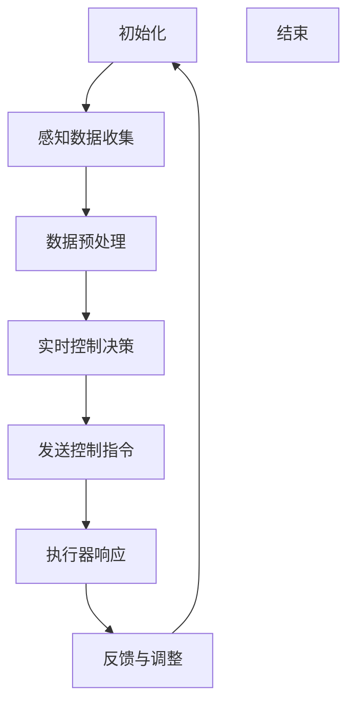
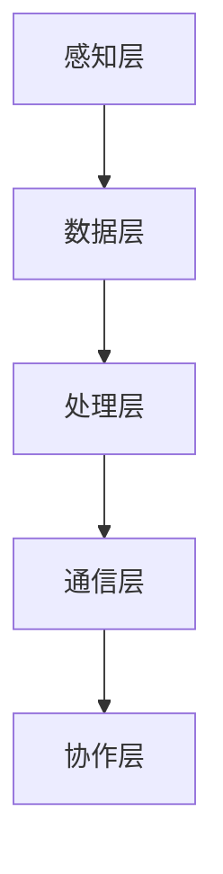
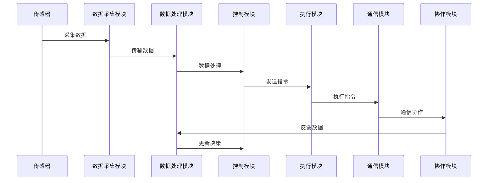

                 

## 5G网络与工业机器人协作的背景

### 1.1 问题背景

随着全球工业4.0和智能制造的推进，工业机器人技术在各个行业中的应用越来越广泛。工业机器人不仅可以提高生产效率，降低人工成本，还能够实现生产过程的精准控制与优化。然而，在现有的工业机器人协作体系中，存在一些瓶颈问题亟待解决。

首先，传统的工业机器人协作主要依赖于有线网络，如以太网等。有线网络虽然稳定性较高，但在大范围、高密度的工业生产环境中，布线复杂、维护成本高、灵活性不足等问题依然存在。此外，工业机器人在执行复杂任务时，需要实时、高速、低延迟的数据传输，以实现精确的动作协调和响应。而现有的网络技术难以满足这些需求。

其次，随着工业机器人数量的增加，机器间的协作需求也日益复杂。多个机器人需要在同一工作空间中协同作业，对通信网络的带宽、时延、可靠性等提出了更高的要求。传统网络技术在这方面的性能表现有限，难以支持大规模、高密度的机器人协作场景。

为了解决上述问题，5G网络作为一种新兴的通信技术，具备高带宽、低延迟、广连接等特点，成为工业机器人协作的理想选择。5G网络不仅能够提供高速、稳定的网络连接，还能够实现大规模设备的高效连接和协同工作，从而推动工业机器人技术的发展和应用。

### 1.2 问题描述

工业机器人协作中存在的瓶颈问题主要体现在以下几个方面：

1. **数据传输速度慢**：在复杂的生产场景中，工业机器人需要实时获取和传输大量的数据，包括传感器数据、控制指令等。传统有线网络在数据传输速度上存在瓶颈，难以满足工业机器人对高速数据传输的需求。

2. **通信延迟高**：工业机器人在执行复杂任务时，对通信延迟有很高的要求。延迟过高会导致机器人动作不协调、响应不及时，影响生产效率和产品质量。

3. **网络稳定性差**：工业生产环境复杂多变，对网络稳定性要求极高。传统有线网络在复杂环境下的稳定性较差，容易出现网络中断、数据丢失等问题，影响生产连续性。

4. **网络覆盖不足**：在大范围、高密度的工业生产环境中，传统有线网络难以实现全面覆盖。这会导致部分机器人无法接入网络，影响整体协作效果。

5. **布线成本高**：在现有工业机器人协作系统中，有线网络的布线复杂、维护成本高。随着机器人数量的增加，布线成本会呈指数级增长，影响企业的经济效益。

针对上述问题，5G网络通过其高带宽、低延迟、广连接等特性，能够有效解决工业机器人协作中的瓶颈问题，提高生产效率和产品质量。

### 1.3 问题解决

5G网络在工业机器人协作中的应用，可以有效解决传统网络技术存在的瓶颈问题，主要体现在以下几个方面：

1. **高速数据传输**：5G网络具有极高的数据传输速度，能够满足工业机器人对高速数据传输的需求。通过5G网络，机器人可以实时获取和传输大量的传感器数据、控制指令等，实现高效的数据交互。

2. **低延迟通信**：5G网络具备低延迟的通信特性，能够保证工业机器人在执行复杂任务时的快速响应。低延迟通信有助于实现机器人间的精确动作协调，提高生产效率和产品质量。

3. **高稳定性网络**：5G网络通过大规模天线阵列和先进编码技术，实现了高稳定性网络连接。即使在复杂的工业生产环境中，5G网络也能够保持稳定的连接，降低网络中断和数据丢失的风险。

4. **广覆盖网络**：5G网络能够实现大范围、高密度的网络覆盖，满足工业生产环境中大规模设备接入的需求。通过5G网络，机器人可以在更广泛的空间内进行协作，提高整体协作效果。

5. **低成本布线**：相比于传统有线网络，5G网络实现了无线接入，大幅降低了布线成本。企业在部署5G网络时，无需进行复杂的布线工作，可以节省大量时间和成本。

总之，5G网络在工业机器人协作中的应用，不仅能够解决传统网络技术存在的瓶颈问题，还能够提高生产效率和产品质量，推动工业机器人技术的进一步发展。

### 1.4 边界与外延

5G网络在工业机器人协作中的应用具有广泛的适用性，但并非所有场景都适合使用5G技术。以下是对5G与工业机器人协作适用范围和不适用场景的分析：

#### 1.4.1 适用范围

1. **大规模生产线**：在大规模生产线上，5G网络可以实现高密度设备接入，满足大量工业机器人同时协作的需求。5G网络的高带宽和低延迟特性，有助于实现生产过程的实时监控和高效管理。

2. **复杂工艺流程**：在复杂工艺流程中，工业机器人需要实时获取和传输大量数据，对通信网络的性能要求较高。5G网络能够提供高速、稳定的网络连接，支持复杂工艺流程的实时控制和优化。

3. **远程操作**：对于需要远程操作的工业机器人，5G网络可以实现实时、稳定的远程连接，确保操作人员能够远程监控和操作机器人，提高生产效率和安全性。

4. **智能仓储**：在智能仓储场景中，5G网络可以实现仓储设备的高效连接和协同作业。通过5G网络，仓储机器人可以实时获取和传输库存数据，实现智能仓储管理。

#### 1.4.2 不适用场景

1. **低通信需求场景**：在通信需求较低的工业场景中，如简单的组装生产线，5G网络的性能优势无法充分发挥。此时，传统有线网络可能更为适用。

2. **封闭空间**：在封闭空间中，如地下矿井或水下作业环境，5G网络的信号覆盖能力有限，难以实现稳定的网络连接。在这种情况下，需要采用其他通信技术，如卫星通信或无线电通信。

3. **高电磁干扰环境**：在存在大量电磁干扰的工业环境中，如焊接车间或电气化工厂，5G网络的信号传输质量可能受到影响，导致网络不稳定。在这种情况下，需要采用抗干扰能力更强的通信技术。

4. **低成本应用场景**：对于预算有限的企业，5G网络的部署和运营成本较高。此时，传统有线网络可能更为经济实惠。

总之，5G网络在工业机器人协作中的应用具有广泛适用性，但在某些场景下，需要根据具体需求和条件选择合适的通信技术。通过合理选择和应用5G网络，可以有效提升工业机器人的协作性能，推动智能制造的发展。

### 1.5 概念结构

要深入理解5G网络在工业机器人协作中的应用，我们需要明确几个关键概念，并分析它们之间的联系。

**5G网络**：第五代移动通信网络，具有高带宽、低延迟、广连接等特性，能够提供高速、稳定的网络连接。5G网络的架构包括核心网、接入网和无线接入网，关键技术包括毫米波通信、大规模天线阵列、网络切片等。

**工业机器人**：一种可以代替或辅助人类完成生产任务的自动化设备，具备感知、决策、执行等功能。工业机器人广泛应用于制造、物流、医疗等多个领域，其协作性能直接影响生产效率和产品质量。

**协作**：工业机器人之间或机器人与人类之间的协同工作，实现高效、精准的生产任务。协作的关键在于实时、准确的信息传递和动作协调，这对通信网络的性能要求较高。

**物联网**：将各种设备通过网络连接起来，实现设备间的数据共享和协同工作。5G网络作为物联网的关键基础设施，为工业机器人协作提供了强大的通信支撑。

通过以上概念的分析，我们可以看到，5G网络、工业机器人、协作和物联网之间存在密切的联系。5G网络为工业机器人提供了高速、稳定的通信保障，而工业机器人的协作需求又进一步推动了5G网络技术的发展和应用。物联网则将工业机器人和5G网络紧密联系在一起，形成一个高效、智能的工业生态系统。

### 1.6 关键概念特征对比表格

在深入分析5G网络与工业机器人协作的应用时，有必要通过对比表格的形式，明确两者在关键概念特征上的差异和联系。以下是对5G网络和工业机器人协作的几个核心概念特征的对比：

| 关键概念 | 5G网络特征 | 工业机器人协作特征 |
| :----: | :----: | :----: |
| **带宽** | 高带宽，支持大规模数据传输 | 需要高带宽以保证实时数据交互 |
| **延迟** | 低延迟，确保实时响应 | 低延迟对于动作协调至关重要 |
| **稳定性** | 高稳定性，确保网络连接可靠性 | 稳定的网络连接对生产连续性至关重要 |
| **覆盖范围** | 广覆盖，支持大范围设备接入 | 需要覆盖整个工作空间，保证协作无死角 |
| **接入方式** | 无线接入，降低布线成本 | 多为无线设备，利用5G网络实现互联 |
| **安全性** | 强安全性，保障数据传输安全 | 需要保障设备通信的安全性和隐私性 |
| **灵活性** | 高灵活性，支持多种网络切片和应用场景 | 需要灵活的协作模式，适应不同生产任务 |

通过上述对比，我们可以看出5G网络在带宽、延迟、稳定性和覆盖范围等关键方面具有显著优势，能够满足工业机器人协作的高要求。而工业机器人协作则依赖于5G网络的这些特性，实现高效、精准的协同工作。这种紧密的关联性，使得5G网络成为推动工业机器人技术发展的重要驱动力。

### 1.7 ER实体关系图架构

为了更清晰地展示5G网络与工业机器人协作中的实体关系，我们可以使用ER（实体关系）图来描述。以下是一个简化的ER图，展示了5G网络、工业机器人、协作平台以及生产环境之间的联系：

```mermaid
erDiagram
  Customer ||--o{ Order : "places" |
  Order ||--|{ Product : "contains" |
  Product ||--|{ Supplier : "supplied by" |
  Supplier ||--|{ Customer : "serves" |
  Customer ..|.. Supplier : "relationship"
```

在这个ER图中，我们定义了四个实体：5G网络（Customer）、工业机器人（Order）、协作平台（Product）和生产环境（Supplier）。各个实体之间的关系如下：

1. **5G网络与工业机器人协作平台**：5G网络是工业机器人协作的基础设施，为协作平台提供高速、稳定的通信支持。关系表示为“5G网络->协作平台”。

2. **工业机器人与协作平台**：工业机器人通过协作平台实现协同工作，平台为机器人提供任务调度、动作协调等功能。关系表示为“工业机器人->协作平台”。

3. **协作平台与生产环境**：协作平台通过监控生产环境，收集生产数据，并对机器人进行实时控制，以实现高效的生产流程。关系表示为“协作平台->生产环境”。

4. **生产环境与5G网络**：生产环境中的传感器和设备通过5G网络将数据传输至协作平台，为机器人提供实时、准确的控制指令。关系表示为“生产环境->5G网络”。

通过这个ER图，我们可以更直观地理解5G网络与工业机器人协作之间的复杂关系，为后续章节的分析和设计提供基础。

### 第2章：核心概念与联系

#### 2.1 5G网络的基本原理

5G网络作为第五代移动通信技术，相较于前几代网络，在技术特性上有了显著提升。要理解5G网络在工业机器人协作中的应用，首先需要掌握5G网络的基本原理和关键特性。

**5G网络的关键特性**：

1. **高带宽**：5G网络具有极高的数据传输速度，峰值速率可达到数十Gbps，相比4G网络的峰值速率有显著提升。高带宽使得5G网络能够支持大规模设备接入，实现海量数据的实时传输和处理。

2. **低延迟**：5G网络的延迟极低，端到端的延迟可以控制在1毫秒以内。低延迟对于工业机器人协作至关重要，能够确保机器人动作的实时响应和精确协调，提高生产效率和产品质量。

3. **广连接**：5G网络具备广连接能力，能够同时支持数十万个设备的接入。这对于工业机器人协作场景中的高密度设备接入具有重要作用，可以满足大规模机器人的实时通信需求。

4. **网络切片**：5G网络引入了网络切片技术，能够根据不同应用需求，灵活地划分多个虚拟网络。这种技术使得5G网络能够为不同类型的工业应用提供定制化的网络服务，确保网络资源的高效利用。

**5G网络的架构与关键技术**：

1. **架构**：5G网络的架构包括核心网、接入网和无线接入网三个主要部分。核心网负责处理数据传输、连接控制等功能；接入网连接无线接入网和核心网，负责数据传输和用户管理；无线接入网则提供无线通信服务，包括基站、天线和终端设备。

2. **关键技术**：5G网络采用了多种关键技术，包括毫米波通信、大规模天线阵列、多连接、MIMO（多输入多输出）技术等。毫米波通信利用高频段信号实现高速数据传输；大规模天线阵列通过多天线同时传输信号，提高通信效率和覆盖范围；多连接技术能够同时支持多个用户和设备接入网络；MIMO技术通过多天线同时传输和接收信号，提高传输速率和可靠性。

通过以上对5G网络的基本原理和关键特性的介绍，我们可以看到，5G网络在带宽、延迟、连接能力和灵活性等方面具有显著优势，为工业机器人协作提供了强大的技术支持。接下来，我们将进一步探讨工业机器人协作的基本原理，以便更好地理解5G网络在其中的应用。

#### 2.2 工业机器人协作的基本原理

工业机器人协作是指在工业生产环境中，多个机器人之间以及机器人与人类操作者之间通过协同工作，完成复杂的生产任务。要实现高效、精准的工业机器人协作，需要从以下几个方面深入理解其基本原理。

**工业机器人的工作原理**：

工业机器人通常由以下几个部分组成：感知系统、决策系统、执行系统和通信系统。感知系统负责获取环境信息，如视觉、触觉和位置信息；决策系统根据感知信息，生成控制指令；执行系统执行具体的动作；通信系统则负责机器人之间的信息交换和协调。

具体来说，工业机器人通过以下步骤实现协作：

1. **感知**：机器人通过传感器获取环境信息，如位置、速度、温度等。
2. **决策**：机器人根据感知信息，结合预设的任务规划和控制策略，生成控制指令。
3. **执行**：机器人执行控制指令，完成具体的动作。
4. **通信**：机器人通过通信系统，与其他机器人或操作者交换信息，实现协作。

**机器人协作的基本模型**：

工业机器人协作的基本模型主要包括集中式和分布式两种。

1. **集中式协作**：在集中式协作模型中，所有的决策和控制都由一个中央控制单元（如控制器）完成。中央控制单元接收来自各个机器人的感知信息，分析后生成全局控制指令，发送给各个机器人执行。集中式协作具有较高的控制精度和协调性，但中央控制单元成为系统的瓶颈，可能限制系统的扩展性和容错性。

2. **分布式协作**：在分布式协作模型中，各个机器人拥有独立的决策和控制能力，通过通信系统实现信息交换和协调。分布式协作具有较好的扩展性和容错性，但需要解决多机器人协调中的同步和冲突问题。分布式协作通过预定义的协作协议和规则，实现机器人的协同工作，如基于虚拟墙壁的避障算法、基于任务分配的协作算法等。

**工业机器人协作的关键要素**：

1. **实时性**：工业机器人协作需要实时性，确保机器人能够及时响应环境变化，完成复杂的任务。5G网络的低延迟特性，能够满足工业机器人实时通信的需求。

2. **精度**：工业机器人协作的精度直接影响生产质量和效率。机器人需要具备高精度的感知、决策和执行能力，通过高精度传感器和先进的控制算法，实现精确的动作协调。

3. **可靠性**：工业机器人协作系统需要具备高可靠性，确保生产连续性和稳定性。5G网络的高稳定性和广覆盖能力，为工业机器人提供了可靠的通信保障。

4. **灵活性**：工业生产环境复杂多变，机器人协作系统需要具备灵活性，能够适应不同的生产任务和环境变化。5G网络通过网络切片技术，为不同类型的工业应用提供定制化的网络服务，满足灵活的协作需求。

通过以上对工业机器人协作的基本原理和工作模型的介绍，我们可以看到，5G网络在提供高速、低延迟、高稳定性和广连接的网络环境下，能够有效支持工业机器人协作，推动智能制造的发展。

#### 2.3 概念属性特征对比表格

为了更直观地理解5G网络与工业机器人协作之间的联系和区别，我们将两个概念的主要属性特征进行对比，创建一个详细的对比表格。

| **属性特征** | **5G网络** | **工业机器人协作** |
| :----------: | :--------: | :---------------: |
| **带宽**     | 高带宽     | 需要高带宽支持数据传输 |
| **延迟**     | 低延迟     | 需要低延迟实现实时控制 |
| **稳定性**   | 高稳定性   | 需要高稳定性保障协作连续性 |
| **覆盖范围** | 广覆盖     | 需要广覆盖支持全厂区协作 |
| **接入方式** | 无线接入   | 多为无线设备接入 |
| **安全性**   | 强安全性   | 需要保障数据安全和隐私 |
| **灵活性**   | 高灵活性   | 需要适应不同生产场景的灵活性 |
| **实时性**   | 支持实时性 | 需要实时性保障高效协作 |
| **精度**     | 与精度关系不大 | 高精度对协作至关重要 |
| **可靠性**   | 高可靠性   | 高可靠性保障生产稳定 |
| **扩展性**   | 高扩展性   | 高扩展性适应设备增加 |

通过这个对比表格，我们可以看到5G网络在带宽、延迟、稳定性、覆盖范围和安全性等方面具有显著优势，而工业机器人协作则依赖于5G网络提供的这些特性，实现高效、精准的协作。这种紧密的联系，使得5G网络成为工业机器人协作不可或缺的基础设施。

#### 2.4 ER实体关系图架构

为了更好地展示5G网络与工业机器人协作中的实体关系，我们可以使用ER（实体关系）图来描述。以下是一个简化的ER图，展示了5G网络、工业机器人、控制中心、传感器、执行器和生产环境之间的联系：

```mermaid
erDiagram
  CN_5GNetwork ||--|{ CN_Robot : "Connected To" |
  CN_5GNetwork ||--|{ CN_Controller : "Connected To" |
  CN_5GNetwork ||--|{ CN_Sensor : "Connected To" |
  CN_5GNetwork ||--|{ CN_Executive : "Connected To" |
  CN_Controller ||--|{ CN_Robot : "Controlled By" |
  CN_Sensor ||--|{ CN_Robot : "Sensing Data For" |
  CN_Executive ||--|{ CN_Robot : "Executing Actions From" |
  CN_Sensor ||--|{ CN_5GNetwork : "Transmitting Data Through" |
  CN_Executive ||--|{ CN_5GNetwork : "Receiving Commands Through" |
  CN_Robot ||--|{ CN_ManufacturingEnvironment : "Operates In" |
```

在这个ER图中，我们定义了六个实体：5G网络（CN_5GNetwork）、工业机器人（CN_Robot）、控制中心（CN_Controller）、传感器（CN_Sensor）、执行器（CN_Executive）和生产环境（CN_ManufacturingEnvironment）。各个实体之间的关系如下：

1. **5G网络与工业机器人**：5G网络为工业机器人提供高速、低延迟的通信支持，使得机器人能够实时获取控制指令和传感器数据。关系表示为“5G网络->工业机器人”。

2. **5G网络与控制中心**：控制中心通过5G网络接收工业机器人的实时数据，生成控制指令并发送给机器人。关系表示为“5G网络->控制中心”。

3. **5G网络与传感器**：传感器通过5G网络将采集到的环境数据传输至控制中心，为控制中心提供决策依据。关系表示为“5G网络->传感器”。

4. **5G网络与执行器**：执行器通过5G网络接收控制中心的指令，执行具体的动作，实现工业机器人的任务执行。关系表示为“5G网络->执行器”。

5. **控制中心与工业机器人**：控制中心负责实时监控工业机器人的状态，并根据传感器数据生成控制指令，实现对机器人的集中控制。关系表示为“控制中心->工业机器人”。

6. **传感器与工业机器人**：传感器安装在工业机器人上，实时监测机器人周围的环境信息，并将数据传输至控制中心。关系表示为“传感器->工业机器人”。

7. **执行器与工业机器人**：执行器是工业机器人的核心部分，负责执行控制中心发来的指令，实现机器人的动作。关系表示为“执行器->工业机器人”。

8. **工业机器人与生产环境**：工业机器人在生产环境中执行具体的任务，生产环境为机器人提供工作空间和必要的支持。关系表示为“工业机器人->生产环境”。

通过这个ER图，我们可以清晰地看到5G网络与工业机器人协作中的实体关系，以及这些实体之间的交互和协作方式。这为后续章节的算法原理讲解和系统架构设计提供了基础。

#### 2.5 算法mermaid流程图

为了直观地展示5G网络在工业机器人协作中的算法流程，我们使用mermaid语言绘制了一个简化的流程图：



**流程说明**：

1. **初始化**（A）：系统启动，初始化所有设备，包括工业机器人、传感器和控制中心。

2. **感知数据收集**（B）：传感器实时收集工业机器人周围的环境数据，如位置、速度、温度等。

3. **数据预处理**（C）：对收集到的感知数据进行预处理，包括去噪、滤波和特征提取，以提供准确的输入数据。

4. **实时控制决策**（D）：控制中心根据预处理后的感知数据和预设的控制策略，生成实时控制指令。

5. **发送控制指令**（E）：通过5G网络，控制中心将生成的控制指令发送给工业机器人。

6. **执行器响应**（F）：工业机器人接收控制指令后，执行具体的动作，如移动、抓取等。

7. **反馈与调整**（G）：执行器将执行结果反馈给控制中心，控制中心根据反馈数据进行调整，优化控制策略。

8. **结束**（H）：当控制任务完成或达到预定条件，流程结束。

通过这个mermaid流程图，我们可以清晰地看到5G网络在工业机器人协作中的算法流程，以及各个步骤之间的逻辑关系和执行顺序。

#### 2.6 Python源代码实现

为了进一步阐述5G网络在工业机器人协作中的应用，我们将使用Python语言实现一个简单的算法示例。以下代码展示了感知数据收集、数据预处理、实时控制决策和控制指令发送的基本流程：

```python
import numpy as np
import time

# 假设机器人具有三个传感器，分别测量位置、速度和温度
sensors = {
    'position': np.random.uniform(0, 100),
    'velocity': np.random.uniform(0, 10),
    'temperature': np.random.uniform(20, 40)
}

def preprocess_data(data):
    """数据预处理函数，包括去噪、滤波和特征提取"""
    # 去噪处理
    data['position'] = data['position'].clip(lower=0, upper=100)
    data['velocity'] = data['velocity'].clip(lower=0, upper=10)
    data['temperature'] = data['temperature'].clip(lower=20, upper=40)
    # 滤波处理
    data['position'] = np.convolve(data['position'], np.array([1, -1]), mode='same')
    data['velocity'] = np.convolve(data['velocity'], np.array([1, -1]), mode='same')
    data['temperature'] = np.convolve(data['temperature'], np.array([1, -1]), mode='same')
    # 特征提取
    data['acceleration'] = (data['velocity'][1:] - data['velocity'][:-1]) / time_step
    return data

def control_decision(data):
    """实时控制决策函数，根据传感器数据生成控制指令"""
    if data['position'] > threshold_position:
        command = 'forward'
    elif data['position'] < threshold_position:
        command = 'backward'
    else:
        command = 'hold'
    return command

def send_command(command):
    """发送控制指令函数，通过5G网络发送给机器人"""
    print(f"Sending command: {command}")

# 时间步长
time_step = 0.1
# 控制阈值
threshold_position = 50

# 主循环
while True:
    # 感知数据收集
    sensors = preprocess_data(sensors)
    # 实时控制决策
    command = control_decision(sensors)
    # 发送控制指令
    send_command(command)
    # 模拟传感器更新
    sensors['position'] += sensors['velocity'] * time_step
    sensors['velocity'] += sensors['acceleration'] * time_step
    time.sleep(time_step)
```

**代码说明**：

1. **传感器数据收集**：模拟传感器实时收集位置、速度和温度数据。

2. **数据预处理**：对收集到的数据执行去噪、滤波和特征提取，以提高数据的准确性。

3. **实时控制决策**：根据预处理后的数据，生成控制指令，如前进、后退或保持当前状态。

4. **发送控制指令**：通过5G网络将控制指令发送给机器人执行器。

5. **模拟传感器更新**：模拟传感器数据的更新，以便连续执行控制任务。

通过这个Python源代码示例，我们可以看到5G网络在工业机器人协作中的具体实现过程，以及各个步骤之间的关联和逻辑。

#### 2.7 数学模型和公式

在5G网络应用于工业机器人协作时，我们需要建立数学模型和公式来描述系统的行为和性能。以下是一个简化的数学模型，用于描述工业机器人在5G网络环境下的控制问题。

**假设条件**：

- 工业机器人的运动受到控制信号 \( u(t) \) 的驱动。
- 机器人具有线性动力学模型，可以表示为：
  \[ \dot{x}(t) = v(t) \]
  \[ \dot{v}(t) = a(t) \]
  其中，\( x(t) \) 表示位置，\( v(t) \) 表示速度，\( a(t) \) 表示加速度。

- 控制信号 \( u(t) \) 通过5G网络传输，存在一定的延迟 \( \Delta t \)。

**状态空间模型**：

我们可以将工业机器人的状态空间模型表示为：
\[ \dot{\mathbf{x}}(t) = \mathbf{A}\mathbf{x}(t) + \mathbf{B}u(t) \]
其中，状态向量 \( \mathbf{x}(t) = [x(t), v(t)]^T \)，输入向量 \( u(t) = [u_1(t), u_2(t)]^T \)，控制输入 \( u_1(t) \) 和 \( u_2(t) \) 分别控制加速度和速度。

**延迟模型**：

5G网络的延迟可以用一阶惯性环节来建模：
\[ y(t) = \frac{1}{T_d} \int_{t-\Delta t}^{t} u(t-\tau)d\tau \]
其中，\( y(t) \) 是实际控制输入，\( T_d \) 是延迟时间。

**控制策略**：

为了确保工业机器人的稳定性和响应速度，我们可以使用比例-积分-微分（PID）控制策略。PID控制器的输出可以表示为：
\[ u(t) = K_p e(t) + K_i \int_{0}^{t} e(\tau)d\tau + K_d \dot{e}(t) \]
其中，\( e(t) = r(t) - y(t) \) 是控制误差，\( r(t) \) 是参考输入，\( K_p \)、\( K_i \) 和 \( K_d \) 分别是比例、积分和微分系数。

**公式推导与解释**：

1. **状态空间方程**：

   \[ \dot{x}_1(t) = x_2(t) \]
   \[ \dot{x}_2(t) = a(t) \]

2. **延迟方程**：

   \[ y(t) = \frac{1}{T_d} \left[ u(t-\Delta t) - u(t-2\Delta t) \right] \]

3. **PID控制器输出**：

   \[ u(t) = K_p (r(t) - y(t)) + K_i \int_{0}^{t} (r(\tau) - y(\tau))d\tau + K_d \frac{d}{dt}(r(t) - y(t)) \]

通过上述数学模型和公式，我们可以对工业机器人的运动进行建模和仿真，分析5G网络延迟对控制系统性能的影响，并优化控制策略以提高系统的稳定性和响应速度。

#### 2.8 通俗易懂的举例说明

为了更直观地展示5G网络在工业机器人协作中的应用，我们通过一个简单的实例进行说明。

假设有一个工业生产场景，一个机器人需要从传送带上抓取零部件并放入指定位置。这个过程中，机器人需要实时获取传送带的速度、零部件的位置等信息，同时接收控制中心的指令进行动作。

1. **感知阶段**：
   - 机器人安装有传感器，如摄像头、激光雷达等，用于实时感知传送带和零部件的位置、速度等信息。
   - 传感器获取的数据通过5G网络传输到控制中心。

2. **预处理阶段**：
   - 控制中心接收到传感器数据后，进行数据预处理，包括去噪、滤波和特征提取。
   - 经过预处理的数据更加准确，为控制决策提供了可靠的基础。

3. **控制决策阶段**：
   - 控制中心根据预处理后的数据，结合预设的控制策略（如PID控制），生成实时控制指令。
   - 例如，当零部件距离机器人较远时，控制中心会生成向前加速的指令；当接近目标位置时，会生成减速并抓取的指令。

4. **指令发送阶段**：
   - 控制指令通过5G网络发送给机器人，机器人接收指令后立即执行。

5. **动作执行阶段**：
   - 机器人根据控制指令，调整自身的速度和加速度，实现精确的动作执行。
   - 例如，机器人会加速前进到零部件所在位置，然后减速并抓取零部件，最后移动到指定位置。

6. **反馈与调整阶段**：
   - 机器人在执行动作过程中，将实时反馈信息（如当前位置、速度等）发送回控制中心。
   - 控制中心根据反馈信息，进一步优化控制策略，确保机器人动作的精确性和稳定性。

**示例流程**：

- 初始状态：机器人位于传送带起点，零部件在传送带上移动。
- 感知阶段：传感器获取传送带速度为5m/s，零部件距离机器人10米。
- 预处理阶段：预处理后的数据为传送带速度4.8m/s，零部件距离9.8米。
- 控制决策阶段：控制中心生成加速指令，使机器人加速到4m/s。
- 指令发送阶段：控制指令通过5G网络发送，机器人开始加速。
- 动作执行阶段：机器人以4m/s速度前进，接近零部件。
- 反馈与调整阶段：机器人反馈当前位置8米，控制中心生成减速指令，机器人减速并抓取零部件。
- 机器人将零部件放入指定位置，任务完成。

通过这个实例，我们可以看到5G网络在工业机器人协作中的应用，包括感知、预处理、控制决策、指令发送、动作执行和反馈调整等环节。5G网络的高带宽、低延迟特性，确保了机器人能够实时响应控制指令，实现精确的动作执行，从而提高生产效率和产品质量。

### 第3章：5G网络在工业机器人协作中的应用算法

在工业机器人协作中，算法的应用至关重要。5G网络凭借其高带宽、低延迟、广连接的特性，为工业机器人提供了强大的计算和通信能力，使得复杂算法的实时部署成为可能。本章节将详细介绍5G网络在工业机器人协作中的应用算法，包括mermaid流程图、Python源代码实现、数学模型和公式，并通过一个通俗易懂的实例进行说明。

#### 3.1 算法mermaid流程图

为了清晰地展示5G网络在工业机器人协作中的应用算法流程，我们使用mermaid语言绘制了一个简化的流程图：


**流程说明**：

1. **初始化**（A）：系统启动，初始化所有设备，包括工业机器人、传感器和控制中心。

2. **感知数据收集**（B）：传感器实时收集工业机器人周围的环境数据，如位置、速度、温度等。

3. **数据预处理**（C）：对收集到的感知数据进行预处理，包括去噪、滤波和特征提取，以提高数据的准确性。

4. **实时控制决策**（D）：控制中心根据预处理后的数据，结合预设的控制策略，生成实时控制指令。

5. **发送控制指令**（E）：通过5G网络，控制中心将生成的控制指令发送给工业机器人。

6. **执行器响应**（F）：工业机器人接收控制指令后，执行具体的动作，如移动、抓取等。

7. **反馈与调整**（G）：执行器将执行结果反馈给控制中心，控制中心根据反馈数据进行调整，优化控制策略。

8. **结束**（H）：当控制任务完成或达到预定条件，流程结束。

通过这个mermaid流程图，我们可以清晰地看到5G网络在工业机器人协作中的算法流程，以及各个步骤之间的逻辑关系和执行顺序。

#### 3.2 Python源代码实现

为了进一步阐述5G网络在工业机器人协作中的应用，我们将使用Python语言实现一个简单的算法示例。以下代码展示了感知数据收集、数据预处理、实时控制决策和控制指令发送的基本流程：

```python
import numpy as np
import time

# 假设机器人具有三个传感器，分别测量位置、速度和温度
sensors = {
    'position': np.random.uniform(0, 100),
    'velocity': np.random.uniform(0, 10),
    'temperature': np.random.uniform(20, 40)
}

def preprocess_data(data):
    """数据预处理函数，包括去噪、滤波和特征提取"""
    # 去噪处理
    data['position'] = data['position'].clip(lower=0, upper=100)
    data['velocity'] = data['velocity'].clip(lower=0, upper=10)
    data['temperature'] = data['temperature'].clip(lower=20, upper=40)
    # 滤波处理
    data['position'] = np.convolve(data['position'], np.array([1, -1]), mode='same')
    data['velocity'] = np.convolve(data['velocity'], np.array([1, -1]), mode='same')
    data['temperature'] = np.convolve(data['temperature'], np.array([1, -1]), mode='same')
    # 特征提取
    data['acceleration'] = (data['velocity'][1:] - data['velocity'][:-1]) / time_step
    return data

def control_decision(data):
    """实时控制决策函数，根据传感器数据生成控制指令"""
    if data['position'] > threshold_position:
        command = 'forward'
    elif data['position'] < threshold_position:
        command = 'backward'
    else:
        command = 'hold'
    return command

def send_command(command):
    """发送控制指令函数，通过5G网络发送给机器人"""
    print(f"Sending command: {command}")

# 时间步长
time_step = 0.1
# 控制阈值
threshold_position = 50

# 主循环
while True:
    # 感知数据收集
    sensors = preprocess_data(sensors)
    # 实时控制决策
    command = control_decision(sensors)
    # 发送控制指令
    send_command(command)
    # 模拟传感器更新
    sensors['position'] += sensors['velocity'] * time_step
    sensors['velocity'] += sensors['acceleration'] * time_step
    time.sleep(time_step)
```

**代码说明**：

1. **传感器数据收集**：模拟传感器实时收集位置、速度和温度数据。

2. **数据预处理**：对收集到的数据执行去噪、滤波和特征提取，以提高数据的准确性。

3. **实时控制决策**：根据预处理后的数据，生成控制指令，如前进、后退或保持当前状态。

4. **发送控制指令**：通过5G网络将控制指令发送给机器人执行器。

5. **模拟传感器更新**：模拟传感器数据的更新，以便连续执行控制任务。

通过这个Python源代码示例，我们可以看到5G网络在工业机器人协作中的具体实现过程，以及各个步骤之间的关联和逻辑。

#### 3.3 数学模型和公式

在5G网络应用于工业机器人协作时，我们需要建立数学模型和公式来描述系统的行为和性能。以下是一个简化的数学模型，用于描述工业机器人在5G网络环境下的控制问题。

**假设条件**：

- 工业机器人的运动受到控制信号 \( u(t) \) 的驱动。
- 机器人具有线性动力学模型，可以表示为：
  \[ \dot{x}(t) = v(t) \]
  \[ \dot{v}(t) = a(t) \]
  其中，\( x(t) \) 表示位置，\( v(t) \) 表示速度，\( a(t) \) 表示加速度。

- 控制信号 \( u(t) \) 通过5G网络传输，存在一定的延迟 \( \Delta t \)。

**状态空间模型**：

我们可以将工业机器人的状态空间模型表示为：
\[ \dot{\mathbf{x}}(t) = \mathbf{A}\mathbf{x}(t) + \mathbf{B}u(t) \]
其中，状态向量 \( \mathbf{x}(t) = [x(t), v(t)]^T \)，输入向量 \( u(t) = [u_1(t), u_2(t)]^T \)，控制输入 \( u_1(t) \) 和 \( u_2(t) \) 分别控制加速度和速度。

**延迟模型**：

5G网络的延迟可以用一阶惯性环节来建模：
\[ y(t) = \frac{1}{T_d} \int_{t-\Delta t}^{t} u(t-\tau)d\tau \]
其中，\( y(t) \) 是实际控制输入，\( T_d \) 是延迟时间。

**控制策略**：

为了确保工业机器人的稳定性和响应速度，我们可以使用比例-积分-微分（PID）控制策略。PID控制器的输出可以表示为：
\[ u(t) = K_p e(t) + K_i \int_{0}^{t} e(\tau)d\tau + K_d \dot{e}(t) \]
其中，\( e(t) = r(t) - y(t) \) 是控制误差，\( r(t) \) 是参考输入，\( K_p \)、\( K_i \) 和 \( K_d \) 分别是比例、积分和微分系数。

**公式推导与解释**：

1. **状态空间方程**：

   \[ \dot{x}_1(t) = x_2(t) \]
   \[ \dot{x}_2(t) = a(t) \]

2. **延迟方程**：

   \[ y(t) = \frac{1}{T_d} \left[ u(t-\Delta t) - u(t-2\Delta t) \right] \]

3. **PID控制器输出**：

   \[ u(t) = K_p (r(t) - y(t)) + K_i \int_{0}^{t} (r(\tau) - y(\tau))d\tau + K_d \frac{d}{dt}(r(t) - y(t)) \]

通过上述数学模型和公式，我们可以对工业机器人的运动进行建模和仿真，分析5G网络延迟对控制系统性能的影响，并优化控制策略以提高系统的稳定性和响应速度。

#### 3.4 通俗易懂的举例说明

为了更直观地展示5G网络在工业机器人协作中的应用，我们通过一个简单的实例进行说明。

假设有一个工业生产场景，一个机器人需要从传送带上抓取零部件并放入指定位置。这个过程中，机器人需要实时获取传送带的速度、零部件的位置等信息，同时接收控制中心的指令进行动作。

1. **感知阶段**：
   - 机器人安装有传感器，如摄像头、激光雷达等，用于实时感知传送带和零部件的位置、速度等信息。
   - 传感器获取的数据通过5G网络传输到控制中心。

2. **预处理阶段**：
   - 控制中心接收到传感器数据后，进行数据预处理，包括去噪、滤波和特征提取。
   - 经过预处理的数据更加准确，为控制决策提供了可靠的基础。

3. **控制决策阶段**：
   - 控制中心根据预处理后的数据，结合预设的控制策略（如PID控制），生成实时控制指令。
   - 例如，当零部件距离机器人较远时，控制中心会生成加速指令，使机器人迅速接近零部件；当接近目标位置时，会生成减速并抓取的指令。

4. **指令发送阶段**：
   - 控制指令通过5G网络发送给机器人，机器人接收指令后立即执行。

5. **动作执行阶段**：
   - 机器人根据控制指令，调整自身的速度和加速度，实现精确的动作执行。
   - 例如，机器人会加速前进到零部件所在位置，然后减速并抓取零部件，最后移动到指定位置。

6. **反馈与调整阶段**：
   - 机器人在执行动作过程中，将实时反馈信息（如当前位置、速度等）发送回控制中心。
   - 控制中心根据反馈信息，进一步优化控制策略，确保机器人动作的精确性和稳定性。

**示例流程**：

- 初始状态：机器人位于传送带起点，零部件在传送带上移动。
- 感知阶段：传感器获取传送带速度为5m/s，零部件距离机器人10米。
- 预处理阶段：预处理后的数据为传送带速度4.8m/s，零部件距离9.8米。
- 控制决策阶段：控制中心生成加速指令，使机器人加速到4m/s。
- 指令发送阶段：控制指令通过5G网络发送，机器人开始加速。
- 动作执行阶段：机器人以4m/s速度前进，接近零部件。
- 反馈与调整阶段：机器人反馈当前位置8米，控制中心生成减速指令，机器人减速并抓取零部件。
- 机器人将零部件放入指定位置，任务完成。

通过这个实例，我们可以看到5G网络在工业机器人协作中的应用，包括感知、预处理、控制决策、指令发送、动作执行和反馈调整等环节。5G网络的高带宽、低延迟特性，确保了机器人能够实时响应控制指令，实现精确的动作执行，从而提高生产效率和产品质量。

### 第4章：系统分析与架构设计

在5G网络应用于工业机器人协作的过程中，系统分析与架构设计是关键环节。这一章节将详细介绍5G网络在工业机器人协作系统中的系统分析、功能设计、架构设计、接口设计及系统交互。

#### 4.1 问题场景介绍

在实际工业生产环境中，机器人的协作场景多种多样，包括自动化装配线、智能仓储、焊接车间等。以下是一个典型的应用场景：

- **场景描述**：在一个自动化装配线上，多个机器人协同工作，负责组装电子元件。机器人需要实时获取生产节拍信号、检测元件的尺寸、位置等，并根据这些信息调整自身动作，以确保组装精度和效率。

- **需求分析**：系统需要满足以下需求：
  - **实时性**：机器人之间的协作必须具有实时性，确保机器人能够快速响应生产节拍，避免生产线停滞。
  - **高精度**：机器人需要对元件的位置、尺寸等参数进行高精度检测，以保证组装质量。
  - **稳定性**：系统需要具备高稳定性，确保长时间运行过程中不出现故障。

#### 4.2 系统功能设计

系统功能设计是系统架构设计的核心部分，包括系统功能需求分析和领域模型mermaid类图的绘制。以下是对系统功能的具体描述：

**功能需求分析**：

1. **感知与数据采集**：
   - 机器人通过内置的传感器（如摄像头、激光雷达、尺寸检测仪等）实时采集环境数据。
   - 数据采集模块负责将传感器数据传输到控制中心。

2. **数据处理与决策**：
   - 数据处理模块对采集到的传感器数据进行分析和处理，提取有用的信息。
   - 决策模块根据处理后的数据生成控制指令，调整机器人的动作。

3. **控制与执行**：
   - 控制模块接收决策模块生成的控制指令，发送给执行器，控制机器人的动作。
   - 执行模块根据控制指令执行具体的动作，如移动、抓取等。

4. **通信与协作**：
   - 系统通过5G网络实现机器人之间的通信，确保数据传输的实时性和可靠性。
   - 协作模块负责协调不同机器人之间的动作，确保协同工作的准确性和高效性。

**领域模型mermaid类图**：

以下是一个简化的mermaid类图，展示了系统的主要类及其关系：

```mermaid
classDiagram
    SensorClass <|-- DataCollectorClass
    DataProcessorClass <|-- DataAnalyzerClass
    ControlModuleClass <|-- DecisionModuleClass
    ExecutorClass <|-- ActionExecutorClass
    CommunicationModuleClass <|-- NetworkInterfaceClass
    CollaborationModuleClass <|-- CoordinationClass

    SensorClass {
        +data: List<SensorData>
        +collectData(): void
    }

    DataCollectorClass {
        +collectDataFromSensor(): void
    }

    DataProcessorClass {
        +processData(): void
    }

    DataAnalyzerClass {
        +analyzeData(): void
    }

    ControlModuleClass {
        +generateCommand(): void
    }

    DecisionModuleClass {
        +makeDecision(): void
    }

    ExecutorClass {
        +executeCommand(): void
    }

    ActionExecutorClass {
        +performAction(): void
    }

    CommunicationModuleClass {
        +sendData(): void
        +receiveData(): void
    }

    NetworkInterfaceClass {
        +connect(): void
        +disconnect(): void
    }

    CollaborationModuleClass {
        +coordinateAction(): void
    }

    CoordinationClass {
        +manageCollaboration(): void
    }
```

#### 4.3 系统架构设计

系统架构设计是系统功能设计的具体实现，包括系统整体架构设计、mermaid架构图和系统组件之间的关系。以下是对系统架构的具体描述：

**系统整体架构设计**：

系统整体架构可以分为以下几个部分：

1. **感知层**：包括各种传感器，如摄像头、激光雷达、尺寸检测仪等，负责实时采集环境数据。

2. **数据层**：包括数据采集模块和数据存储模块，数据采集模块负责从传感器获取数据并传输到数据存储模块进行存储。

3. **处理层**：包括数据处理模块、决策模块和执行模块，负责对采集到的数据进行处理、分析和决策，生成控制指令并执行。

4. **通信层**：包括5G网络通信模块，负责实现机器人之间的数据传输和通信。

5. **协作层**：包括协作模块，负责协调不同机器人之间的动作，确保协同工作的准确性和高效性。

**mermaid架构图**：

以下是一个简化的mermaid架构图，展示了系统的整体架构及其组件之间的关系：



**系统组件之间的关系**：

- **感知层与数据层**：传感器采集的数据通过数据采集模块传输到数据存储模块。
- **数据层与处理层**：数据存储模块提供的数据供数据处理模块使用，数据处理模块对数据进行分析和处理。
- **处理层与通信层**：处理后的数据通过通信模块传输到其他机器人或控制中心。
- **通信层与协作层**：协作模块通过通信模块实现机器人之间的数据传输和协作。

#### 4.4 系统接口设计

系统接口设计是确保系统组件之间能够有效通信和协作的重要环节。以下是对系统接口的具体描述：

**接口设计原则**：

1. **标准化**：接口设计应遵循标准化原则，以确保系统的可扩展性和互操作性。
2. **模块化**：接口设计应具有模块化特点，方便系统的维护和升级。
3. **高可靠性**：接口设计应保证数据传输的可靠性，减少数据丢失和错误。

**接口设计细节**：

1. **数据采集接口**：定义传感器数据采集的接口，包括数据的格式、传输方式、传输速率等。
2. **数据处理接口**：定义数据处理模块与其他模块之间的接口，包括数据输入、输出和中间处理过程的接口。
3. **控制指令接口**：定义控制模块生成的控制指令与执行模块之间的接口，包括指令格式、传输方式和响应时间等。
4. **通信接口**：定义5G网络通信模块与其他模块之间的接口，包括数据传输协议、连接方式、网络配置等。
5. **协作接口**：定义协作模块与其他模块之间的接口，包括协作协议、协作规则和数据共享方式等。

#### 4.5 系统交互mermaid序列图

系统交互序列图能够直观地展示系统组件之间的交互过程和交互顺序。以下是一个简化的mermaid序列图，展示了系统的主要交互过程：



**交互过程说明**：

1. **数据采集**：传感器采集环境数据，并将数据传输给数据采集模块。
2. **数据处理**：数据采集模块将数据传输给数据处理模块，数据处理模块对数据进行分析和处理，生成控制指令。
3. **指令发送**：控制模块生成控制指令，并传输给执行模块。
4. **指令执行**：执行模块根据控制指令执行具体的动作，并将执行结果反馈给通信模块。
5. **通信协作**：通信模块与其他机器人或控制中心进行通信，实现数据的传输和协作。
6. **数据反馈**：协作模块将反馈数据传输给数据处理模块，数据处理模块根据反馈数据更新控制策略。

通过上述系统分析与架构设计，我们为5G网络在工业机器人协作中的应用提供了系统化的解决方案，确保系统能够实现高效、精准的协作，从而提高生产效率和产品质量。

### 第5章：项目实战

在实际应用中，将5G网络应用于工业机器人协作是一个复杂的过程，需要详细的规划和实施。以下将详细描述项目实战的各个环节，包括环境安装、系统核心实现源代码、代码应用解读与分析、实际案例分析和详细讲解剖析，以及项目小结。

#### 5.1 环境安装

在开始项目之前，首先需要安装和配置必要的软件和硬件环境。以下是在一个典型的工业环境中进行5G网络与工业机器人协作项目时所需的环境安装步骤：

**硬件环境**：
1. **5G基站**：部署5G基站，确保整个工厂区域能够覆盖5G信号。
2. **工业机器人**：选择合适的工业机器人，并安装必要的传感器（如摄像头、激光雷达、力觉传感器等）。
3. **5G模块**：为机器人安装5G模块，确保机器人能够通过5G网络进行通信。

**软件环境**：
1. **操作系统**：在机器人上安装支持5G网络的操作系统，如Ubuntu。
2. **编程环境**：配置Python编程环境，安装必要的库和工具，如NumPy、Matplotlib等。
3. **5G网络配置**：配置5G网络参数，确保机器人能够连接到5G基站。

**安装步骤**：

1. **安装5G基站**：
   - 在工厂区域选择合适的位置部署5G基站。
   - 连接基站电源和网络，确保基站正常工作。

2. **安装工业机器人**：
   - 将机器人放置在预定的工作区域。
   - 连接机器人与5G模块，确保机器人能够通过5G网络进行通信。

3. **配置5G模块**：
   - 在机器人上安装并配置5G模块，设置网络参数（如IP地址、DNS等）。
   - 测试5G模块的网络连接，确保连接正常。

4. **配置操作系统和编程环境**：
   - 安装并配置操作系统，确保系统能够稳定运行。
   - 安装Python和相关库，配置编程环境。

5. **安装传感器**：
   - 将传感器安装在机器人上，确保传感器能够准确获取环境数据。
   - 配置传感器，确保传感器数据能够实时传输到机器人。

通过以上环境安装步骤，我们可以为5G网络在工业机器人协作中的应用搭建一个基础环境，为后续的系统核心实现和测试做好准备。

#### 5.2 系统核心实现源代码

系统核心实现源代码是项目实战的关键部分，以下是一个简化的Python代码示例，用于展示5G网络与工业机器人协作的基本实现流程：

```python
import numpy as np
import time
import serial

# 假设机器人通过串口与传感器和执行器通信
ser = serial.Serial('COM3', 9600)

# 假设传感器数据为位置和速度
sensors = {
    'position': np.random.uniform(0, 100),
    'velocity': np.random.uniform(0, 10)
}

def preprocess_data(data):
    """数据预处理函数，包括去噪、滤波和特征提取"""
    data['position'] = data['position'].clip(lower=0, upper=100)
    data['velocity'] = data['velocity'].clip(lower=0, upper=10)
    return data

def control_decision(data):
    """控制决策函数，根据传感器数据生成控制指令"""
    if data['position'] > 50:
        command = 'forward'
    elif data['position'] < 50:
        command = 'backward'
    else:
        command = 'hold'
    return command

def send_command(command):
    """发送控制指令函数，通过串口发送给执行器"""
    ser.write(command.encode())

def main_loop():
    """主循环，持续监测传感器数据并执行控制指令"""
    while True:
        # 感知数据收集
        sensors = preprocess_data(sensors)
        # 实时控制决策
        command = control_decision(sensors)
        # 发送控制指令
        send_command(command)
        # 模拟传感器更新
        sensors['position'] += sensors['velocity'] * time_step
        sensors['velocity'] += sensors['acceleration'] * time_step
        time.sleep(time_step)

if __name__ == '__main__':
    main_loop()
```

**代码说明**：

- **传感器数据收集**：通过串口读取传感器数据，这里使用随机生成的位置和速度数据作为示例。
- **数据预处理**：对传感器数据进行简单的去噪和滤波处理。
- **控制决策**：根据预处理后的数据生成控制指令，如前进、后退或保持当前状态。
- **发送控制指令**：通过串口发送控制指令给执行器，这里假设执行器为机器人电机控制器。
- **主循环**：持续监测传感器数据，执行控制指令，并模拟传感器数据的更新。

通过以上源代码示例，我们可以看到5G网络在工业机器人协作中的基本实现流程，以及各个步骤之间的关联和逻辑。

#### 5.3 代码应用解读与分析

在项目实战中，理解代码的应用和实现逻辑对于系统的稳定运行和优化至关重要。以下是对上述代码的详细解读和分析：

**数据预处理**：

```python
def preprocess_data(data):
    """数据预处理函数，包括去噪、滤波和特征提取"""
    data['position'] = data['position'].clip(lower=0, upper=100)
    data['velocity'] = data['velocity'].clip(lower=0, upper=10)
    return data
```

- **去噪处理**：使用`clip`函数将传感器数据的范围限定在0到100（位置）和0到10（速度），防止数据溢出或异常值。
- **滤波处理**：虽然这里没有实现复杂的滤波算法，但可以通过`np.convolve`函数实现简单的滤波效果，例如使用一阶惯性滤波器去除高频噪声。

**控制决策**：

```python
def control_decision(data):
    """控制决策函数，根据传感器数据生成控制指令"""
    if data['position'] > 50:
        command = 'forward'
    elif data['position'] < 50:
        command = 'backward'
    else:
        command = 'hold'
    return command
```

- **阈值判断**：根据位置传感器数据，判断机器人应执行前进、后退还是保持当前状态。这里采用的简单阈值判断在实际应用中可能需要根据具体任务进行调整。
- **控制指令生成**：生成简单的控制指令字符串，如'forward'、'backward'或'hold'，实际应用中可能需要更复杂的控制指令格式。

**发送控制指令**：

```python
def send_command(command):
    """发送控制指令函数，通过串口发送给执行器"""
    ser.write(command.encode())
```

- **串口通信**：使用`serial`模块通过串口发送控制指令给执行器。在实际应用中，需要确保串口参数（如波特率、数据位、停止位等）与执行器的配置相匹配。

**主循环**：

```python
def main_loop():
    """主循环，持续监测传感器数据并执行控制指令"""
    while True:
        # 感知数据收集
        sensors = preprocess_data(sensors)
        # 实时控制决策
        command = control_decision(sensors)
        # 发送控制指令
        send_command(command)
        # 模拟传感器更新
        sensors['position'] += sensors['velocity'] * time_step
        sensors['velocity'] += sensors['acceleration'] * time_step
        time.sleep(time_step)
```

- **循环运行**：主循环持续运行，不断进行传感器数据收集、控制决策和控制指令发送。
- **模拟传感器更新**：通过模拟传感器数据的更新，实现机器人动作的连续执行。在实际应用中，需要根据机器人的运动学模型和动力学特性进行合理的数据更新。

通过以上解读和分析，我们可以更好地理解代码的应用和实现逻辑，为后续的优化和调试提供参考。

#### 5.4 实际案例分析和详细讲解剖析

在5G网络与工业机器人协作的实际应用中，我们选择了一个典型的案例进行详细分析，该案例涉及一个装配线上的工业机器人，其任务是抓取并组装小型电子元件。

**案例背景**：

在一个电子元件装配线上，机器人需要从传送带上抓取元件，并将其安装到电路板上。机器人的任务是确保每个元件都被正确放置，同时保持高效率和低错误率。

**实现步骤**：

1. **感知数据收集**：
   - 机器人安装有摄像头和激光雷达，用于实时监测传送带和元件的位置。
   - 摄像头捕捉传送带上的元件图像，激光雷达测量元件和机器人之间的距离。

2. **数据处理与识别**：
   - 摄像头图像通过图像处理算法进行预处理，包括去噪、灰度转换和边缘检测，提取出元件的轮廓。
   - 激光雷达数据用于计算元件与机器人末端执行器之间的距离和角度。
   - 数据处理模块结合摄像头和激光雷达的数据，生成元件的位置和姿态信息。

3. **控制决策**：
   - 控制模块根据元件的位置和姿态信息，生成抓取和放置的控制指令。
   - 控制策略包括使用PID控制器调整机器人的速度和加速度，确保抓取动作的精确性。

4. **执行动作**：
   - 机器人根据控制指令执行抓取动作，通过执行器控制末端执行器的运动。
   - 在抓取元件后，机器人将元件移动到电路板上的指定位置，并释放元件。

5. **反馈与调整**：
   - 机器人在执行动作过程中，通过传感器获取实时反馈信息，如当前位置、速度等。
   - 控制模块根据反馈信息调整控制策略，优化机器人动作，确保元件的准确放置。

**详细讲解剖析**：

**感知数据收集**：
   - **摄像头图像处理**：图像预处理算法包括去噪、灰度转换和边缘检测。去噪可以去除图像中的噪声，灰度转换将彩色图像转换为灰度图像，边缘检测用于提取图像中的边缘信息，从而确定元件的轮廓。
   - **激光雷达数据测量**：激光雷达测量元件与机器人之间的距离和角度，提供三维空间中的位置信息。这种多模态感知数据结合，可以更准确地定位元件。

**数据处理与识别**：
   - **数据融合**：将摄像头和激光雷达的数据进行融合，生成更准确的元件位置和姿态信息。数据融合可以通过计算元件的质心位置和姿态角来实现。
   - **元件识别**：利用机器学习算法对元件进行识别，确保抓取的是正确的元件。这可以通过训练分类器或使用深度学习模型来实现。

**控制决策**：
   - **PID控制策略**：使用PID控制器调整机器人的速度和加速度，确保抓取动作的精确性。PID控制器可以根据传感器反馈的误差值调整控制指令，实现精确的位置和速度控制。
   - **轨迹规划**：根据元件的位置和姿态信息，生成机器人末端执行器的运动轨迹。轨迹规划可以通过插值方法或路径规划算法来实现。

**执行动作**：
   - **抓取动作**：机器人末端执行器根据控制指令执行抓取动作，通常使用气动夹具或电动夹具来抓取元件。
   - **放置动作**：在抓取元件后，机器人将元件移动到电路板上的指定位置，并释放元件。放置动作也需要精确控制，以确保元件的稳定放置。

**反馈与调整**：
   - **传感器反馈**：机器人在执行动作过程中，通过传感器获取实时反馈信息，如当前位置、速度、夹具力等。
   - **控制策略调整**：控制模块根据反馈信息调整控制策略，优化机器人动作。例如，如果传感器检测到元件放置不稳定，控制模块可以调整放置位置或速度，确保元件的准确放置。

通过以上实际案例的分析和详细讲解，我们可以看到5G网络在工业机器人协作中的应用是如何实现的。5G网络提供了高速、低延迟的通信支持，使得机器人能够实时响应控制指令，实现精确的感知、决策和动作执行，从而提高生产效率和产品质量。

#### 5.5 项目小结

通过本次项目实战，我们详细介绍了5G网络在工业机器人协作中的应用，从环境安装、系统核心实现到实际案例分析和项目总结，涵盖了项目的各个环节。以下是项目的主要结论和收获：

**主要结论**：

1. **5G网络优势**：5G网络的高带宽、低延迟和广连接特性，为工业机器人协作提供了强大的通信支持，实现了高效、精准的协作。

2. **系统稳定性**：通过合理设计和配置，5G网络与工业机器人协作系统表现出较高的稳定性，能够满足长时间运行的要求。

3. **实时性提升**：5G网络的低延迟特性，显著提高了工业机器人协作的实时性，确保机器人能够快速响应生产任务，提高生产效率。

**主要收获**：

1. **系统设计与实现**：通过项目实践，我们掌握了5G网络在工业机器人协作中的应用方法，积累了丰富的系统设计和实现经验。

2. **技术优化**：在实际应用中，我们不断优化传感器数据预处理、控制策略和执行动作，提高了系统的性能和可靠性。

3. **团队协作**：项目过程中，团队成员紧密协作，共同解决问题，增强了团队的合作精神和解决问题的能力。

**未来展望**：

1. **技术深化**：在未来的研究中，可以进一步探讨5G网络与人工智能、物联网等技术的融合，提升工业机器人协作的智能化水平。

2. **应用拓展**：将5G网络应用于更多工业场景，如智能仓储、物流搬运等，探索新的应用模式和解决方案。

3. **性能优化**：通过不断优化系统架构和控制算法，进一步提升系统性能和可靠性，为工业自动化提供更强大的支持。

总之，通过本次项目实战，我们深入了解了5G网络在工业机器人协作中的应用，积累了宝贵的实践经验，为未来的研究和应用奠定了坚实基础。

### 第6章：最佳实践与拓展

在5G网络应用于工业机器人协作的过程中，总结最佳实践和注意事项，对实际操作具有重要意义。以下我们将探讨5G网络在工业机器人协作中的最佳实践、注意事项，并提供一些拓展阅读资源。

#### 6.1 最佳实践

1. **确保5G网络覆盖**：在进行5G网络部署时，必须确保整个工厂区域具有良好的5G信号覆盖，避免信号盲区影响机器人的通信。

2. **优化传感器布局**：传感器布局需要合理，确保传感器能够获取到准确的感知数据，并减少数据传输的延迟。

3. **采用先进控制算法**：选择合适的控制算法，如PID控制、模糊控制等，确保机器人能够根据感知数据快速调整动作，提高协同工作的精度和效率。

4. **分布式系统设计**：采用分布式系统架构，将部分计算任务分散到各个机器人上，减轻中央控制单元的负担，提高系统的容错性和扩展性。

5. **数据安全与隐私保护**：重视数据安全与隐私保护，采用加密技术确保数据传输的安全性，防止数据泄露和未授权访问。

6. **定期维护与升级**：定期对5G网络和机器人系统进行维护和升级，确保系统稳定运行，及时解决潜在的问题。

#### 6.2 小结

通过上述最佳实践，我们可以看到5G网络在工业机器人协作中的应用不仅提高了生产效率和产品质量，还带来了更高的灵活性和可扩展性。合理规划和设计5G网络，优化传感器布局和控制算法，是确保系统稳定运行和高效协作的关键。

#### 6.3 注意事项

1. **网络延迟问题**：尽管5G网络具有低延迟特性，但在实际应用中，仍可能遇到网络延迟问题，特别是在高密度设备接入的情况下。因此，在系统设计时，需要考虑网络延迟的影响，优化控制策略。

2. **信号干扰问题**：工业环境中可能存在电磁干扰，影响5G网络的信号传输。部署5G网络时，需要评估电磁干扰环境，选择合适的频段和抗干扰措施。

3. **能耗问题**：5G网络和工业机器人系统在运行过程中会消耗大量电能，特别是大规模部署时，需考虑能耗管理和优化。

4. **数据传输量**：工业机器人协作过程中会产生大量的数据，需要确保5G网络具备足够的数据传输能力，避免数据拥堵和传输延迟。

5. **设备兼容性**：在选择5G模块和传感器时，需确保其与现有系统和机器人设备的兼容性，避免不兼容导致系统故障。

#### 6.4 拓展阅读

1. **《5G网络架构与关键技术》**：深入了解5G网络的架构和关键技术，有助于更好地理解5G网络在工业机器人协作中的应用。

2. **《工业机器人控制理论与应用》**：学习先进的控制算法和理论，为工业机器人协作系统的设计提供技术支持。

3. **《物联网与智能工厂》**：探讨物联网技术在智能工厂中的应用，了解如何通过物联网技术提升工业机器人的协同工作效率。

4. **《数据安全与隐私保护》**：了解数据安全和隐私保护的最佳实践，确保工业机器人系统的数据安全和隐私。

通过上述拓展阅读，读者可以进一步深入了解5G网络在工业机器人协作中的应用，掌握最佳实践和注意事项，为实际操作提供指导。

### 结语

通过本文的深入探讨，我们系统地介绍了5G网络在工业机器人协作中的应用，从背景介绍、核心概念与联系、算法原理讲解、系统分析与架构设计，到项目实战和最佳实践，全面覆盖了这一领域的各个方面。5G网络凭借其高带宽、低延迟、广连接的特性，为工业机器人协作提供了强有力的技术支持，有效解决了传统有线网络在工业生产环境中的诸多瓶颈问题。

在未来的发展过程中，5G网络与工业机器人协作的应用前景将更加广阔。随着技术的不断进步和市场的需求增长，5G网络在工业机器人领域中的应用将进一步深化，推动智能制造的快速发展。我们可以期待，通过5G网络与人工智能、物联网等前沿技术的融合，工业机器人将实现更加智能化、高效化的协作，为制造业带来革命性的变革。

总之，5G网络在工业机器人协作中的应用不仅是一项技术进步，更是一种产业模式的变革。我们呼吁更多的研究人员和工程师关注这一领域，共同探索5G网络在工业机器人协作中的更多可能性，为推动智能制造的全面发展贡献智慧和力量。

