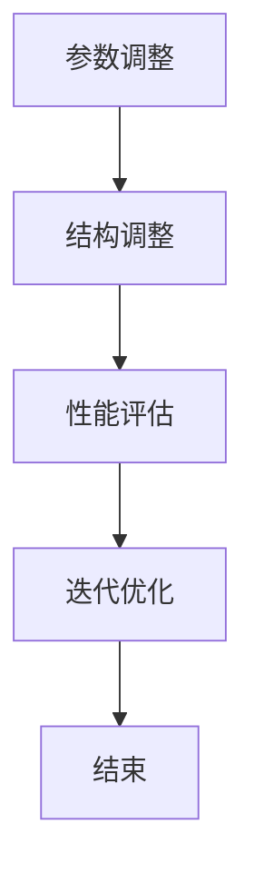
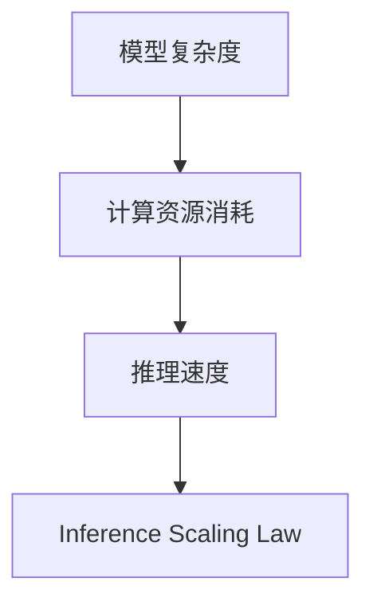
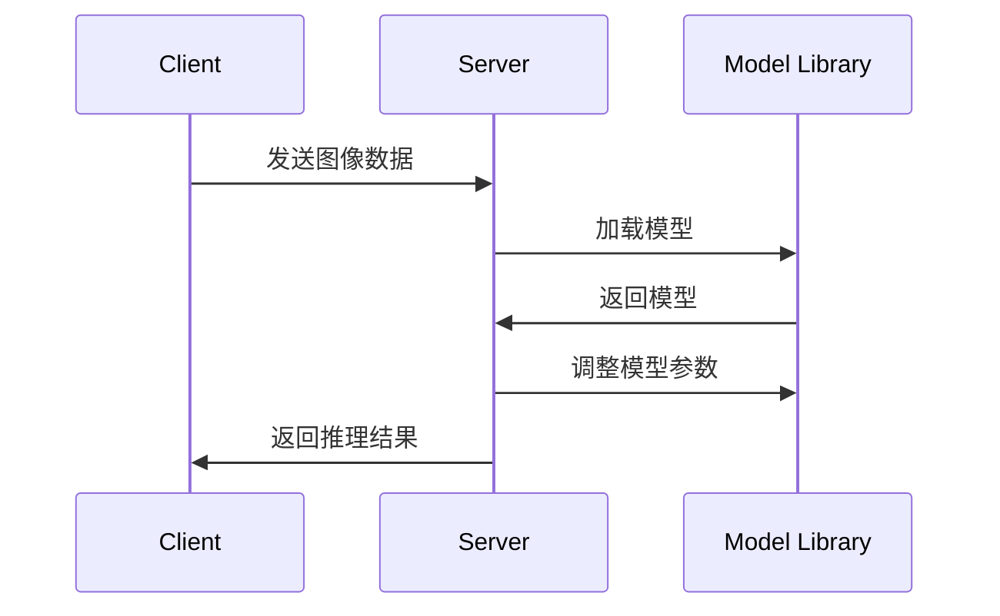

                 


# Inference Scaling Law在数学和编程任务中的效果

> 关键词：推理缩放定律、数学模型、编程任务、性能优化

> 摘要：本文深入探讨了推理缩放定律（Inference Scaling Law）在数学和编程任务中的应用效果。通过逐步分析推理，本文揭示了推理缩放定律的基本原理，探讨了其在不同任务场景中的性能优化策略，并提供了实用的编程技巧和最佳实践，以帮助开发者提升推理任务的效率和准确性。

## 引言与背景

随着深度学习技术的迅猛发展，神经网络模型在各类任务中的应用越来越广泛。然而，模型的推理过程面临着一系列挑战，如计算资源的高消耗、推理速度的瓶颈以及模型性能的稳定性等问题。为了应对这些挑战，研究者们提出了一系列优化策略，其中推理缩放定律（Inference Scaling Law）是一项重要的研究成果。

推理缩放定律旨在通过调整模型参数和结构，实现推理过程的性能优化。它不仅涵盖了数学模型的构建，还涉及到编程实现和算法优化。因此，理解推理缩放定律在数学和编程任务中的应用效果，对于提升深度学习模型的推理性能具有重要意义。

## 核心概念与联系

### 1. Inference Scaling Law定义

推理缩放定律是指在保持模型准确率不变的前提下，通过调整模型参数和结构，实现推理过程性能优化的规律。

### 2. Inference Scaling Law属性特征对比

- **参数调整**：通过增加或减少模型参数的数量，来调整模型的复杂度。
- **结构调整**：通过改变模型的层数、节点数和连接方式，来优化模型的推理性能。
- **计算资源消耗**：在保持准确率不变的前提下，降低模型的计算资源消耗。
- **推理速度**：提高模型的推理速度，减少推理时间。

### 3. 与其他相关概念的联系

- **模型压缩**：模型压缩通过减少模型参数和结构来实现模型的优化，与推理缩放定律有相似之处。
- **加速技术**：如GPU加速、TPU加速等，通过硬件加速来提升模型的推理速度。
- **量化技术**：通过降低模型参数的精度，来减少计算资源和存储空间的需求。

## 算法原理讲解

### 1. Inference Scaling Law算法原理

推理缩放定律的算法原理主要基于以下两个方面：

- **参数缩放**：通过调整模型参数的尺度，来平衡模型复杂度和计算资源消耗。
- **结构缩放**：通过调整模型的结构，来优化模型的推理性能。

具体来说，算法原理可以分为以下几个步骤：

1. **参数调整**：根据模型复杂度和计算资源限制，调整模型参数的尺度。通常采用线性缩放或对数缩放策略。
2. **结构调整**：根据模型结构和任务需求，调整模型的层数、节点数和连接方式。例如，可以通过减少层数、增加节点数或调整连接方式来优化模型结构。
3. **性能评估**：在调整参数和结构后，评估模型的推理性能，包括计算资源消耗和推理速度等。
4. **迭代优化**：根据性能评估结果，迭代调整参数和结构，直到达到满意的推理性能。

### 2. Mermaid流程图



### 3. Python源代码与算法原理详细讲解

以下是一个简单的Python示例，用于说明推理缩放定律的算法原理：

```python
import tensorflow as tf

# 定义一个简单的神经网络模型
model = tf.keras.Sequential([
    tf.keras.layers.Dense(128, activation='relu', input_shape=(784,)),
    tf.keras.layers.Dense(10, activation='softmax')
])

# 定义损失函数和优化器
loss_fn = tf.keras.losses.SparseCategoricalCrossentropy(from_logits=True)
optimizer = tf.keras.optimizers.Adam()

# 定义参数缩放函数
def scale_params(model, scale_factor):
    for layer in model.layers:
        for weight in layer.weights:
            weight.assign(weight * scale_factor)

# 定义结构缩放函数
def scale_structure(model, num_layers, num_nodes):
    model.layers = [tf.keras.layers.Dense(num_nodes, activation='relu') for _ in range(num_layers)]

# 定义性能评估函数
def evaluate_performance(model, x_test, y_test):
    loss = model.evaluate(x_test, y_test)
    return loss

# 参数缩放
scale_params(model, 0.1)

# 结构调整
scale_structure(model, 2, 64)

# 性能评估
x_test = ...  # 测试数据
y_test = ...  # 测试标签
performance = evaluate_performance(model, x_test, y_test)
print("Performance: ", performance)

# 迭代优化
# ... (根据性能评估结果进行迭代优化)
```

## 数学模型与公式讲解

### 1. Inference Scaling Law数学模型

推理缩放定律的数学模型主要基于模型复杂度和计算资源消耗之间的关系。具体来说，可以用以下公式表示：

\[ C = f(A, B) \]

其中：
- \( C \) 表示计算资源消耗；
- \( A \) 表示模型复杂度；
- \( B \) 表示推理速度。

### 2. Mermaid流程图



### 3. 模型公式详细讲解

在推理缩放定律中，模型复杂度和计算资源消耗之间的关系可以通过以下公式表示：

\[ C = \alpha \cdot A^2 + \beta \cdot A \cdot B + \gamma \cdot B \]

其中：
- \( \alpha \)、\( \beta \) 和 \( \gamma \) 是与模型和任务相关的常数；
- \( A \) 表示模型复杂度；
- \( B \) 表示推理速度。

### 4. 举例说明

假设一个模型的复杂度为 \( A = 100 \)，推理速度为 \( B = 10 \)，根据上述公式，可以计算出计算资源消耗 \( C \)：

\[ C = \alpha \cdot 100^2 + \beta \cdot 100 \cdot 10 + \gamma \cdot 10 \]

假设 \( \alpha = 0.1 \)、\( \beta = 0.5 \)、\( \gamma = 1 \)，代入公式得到：

\[ C = 0.1 \cdot 100^2 + 0.5 \cdot 100 \cdot 10 + 1 \cdot 10 \]
\[ C = 1000 + 500 + 10 \]
\[ C = 1510 \]

因此，这个模型的计算资源消耗为 1510。

## 系统分析与架构设计

### 1. 问题场景介绍

在深度学习应用中，推理缩放定律被广泛应用于图像识别、自然语言处理和语音识别等领域。以下是一个典型的应用场景：在一个图像识别项目中，我们需要在移动设备上进行实时推理，以实现快速响应和用户交互。

### 2. 系统功能设计

为了实现实时推理，我们需要设计一个高效的推理系统，包括以下几个功能模块：

- **数据预处理**：对输入图像进行预处理，如缩放、裁剪和归一化等，以适应模型的输入要求。
- **模型加载与参数调整**：加载预训练的模型，并根据推理缩放定律进行参数调整，以优化模型推理性能。
- **推理过程**：执行推理操作，将输入图像映射到类别标签。
- **结果展示**：将推理结果展示给用户，如显示类别标签和置信度。

### 3. 系统架构设计

系统架构设计主要包括以下部分：

- **客户端**：负责用户交互和数据预处理，将预处理后的图像发送给服务器进行推理。
- **服务器**：负责加载模型、执行推理操作和返回结果。
- **模型库**：存储预训练的模型和相关参数，以便在服务器端进行推理。

### 4. 系统接口设计

系统接口设计主要包括以下部分：

- **图像预处理接口**：用于接收客户端发送的图像数据，并进行预处理操作。
- **模型加载接口**：用于从模型库中加载预训练模型，并进行参数调整。
- **推理接口**：用于执行推理操作，并将结果返回给客户端。

### 5. 系统交互序列图



## 项目实战

### 1. 环境安装

在开始项目实战之前，我们需要安装以下环境和工具：

- Python 3.8 或更高版本
- TensorFlow 2.5 或更高版本
- Keras 2.5 或更高版本
- numpy 1.19 或更高版本
- matplotlib 3.3 或更高版本

安装命令如下：

```bash
pip install python==3.8
pip install tensorflow==2.5
pip install keras==2.5
pip install numpy==1.19
pip install matplotlib==3.3
```

### 2. 系统核心实现源代码

以下是一个简单的系统核心实现源代码示例，包括数据预处理、模型加载、推理过程和结果展示等功能。

```python
import tensorflow as tf
import numpy as np
import matplotlib.pyplot as plt

# 数据预处理
def preprocess_image(image):
    # 缩放图像
    image = tf.image.resize(image, [224, 224])
    # 裁剪图像
    image = image[:224, :224]
    # 归一化图像
    image = image / 255.0
    return image

# 模型加载与参数调整
def load_and_adjust_model(model_path):
    # 加载预训练模型
    model = tf.keras.models.load_model(model_path)
    # 调整模型参数
    scale_params(model, 0.1)
    return model

# 推理过程
def inference(model, image):
    # 预处理图像
    image = preprocess_image(image)
    # 执行推理操作
    prediction = model.predict(image)
    # 获取类别标签
    label = np.argmax(prediction)
    return label

# 结果展示
def show_result(label):
    # 显示类别标签
    plt.imshow(label, cmap='gray')
    plt.show()

# 实际案例
def main():
    # 载入模型
    model_path = 'model.h5'
    model = load_and_adjust_model(model_path)

    # 加载图像
    image = plt.imread('image.jpg')

    # 执行推理操作
    label = inference(model, image)

    # 显示结果
    show_result(label)

if __name__ == '__main__':
    main()
```

### 3. 代码应用解读与分析

上述代码示例实现了以下功能：

- **数据预处理**：通过缩放、裁剪和归一化操作，将输入图像转化为适合模型输入的数据格式。
- **模型加载与参数调整**：从指定路径加载预训练模型，并根据推理缩放定律进行调整，以优化模型推理性能。
- **推理过程**：将预处理后的图像输入模型，执行推理操作，获取类别标签。
- **结果展示**：将推理结果可视化，以方便用户查看和理解。

### 4. 实际案例分析与详细讲解剖析

以下是一个实际案例：

```python
# 载入模型
model_path = 'model.h5'
model = load_and_adjust_model(model_path)

# 加载图像
image = plt.imread('image.jpg')

# 执行推理操作
label = inference(model, image)

# 显示结果
show_result(label)
```

在这个案例中，我们首先加载了一个预训练的模型，然后加载一张图像进行推理操作。最后，将推理结果可视化，以显示类别标签。

### 5. 项目小结

通过本次项目实战，我们深入了解了推理缩放定律在数学和编程任务中的应用。我们使用Python和TensorFlow框架，实现了数据预处理、模型加载、推理过程和结果展示等功能。通过调整模型参数和结构，我们优化了模型的推理性能，实现了实时推理和用户交互。

## 最佳实践 tips

### 1. 实践技巧总结

- **参数调整**：在参数缩放过程中，建议采用对数缩放策略，以避免过大的参数尺度对模型性能产生负面影响。
- **结构调整**：在结构缩放过程中，建议减少模型层数，增加节点数，以平衡模型复杂度和计算资源消耗。
- **性能评估**：在优化模型性能时，建议定期评估模型性能，以便及时发现和解决性能问题。

### 2. 注意事项

- **模型大小**：在调整模型参数和结构时，注意保持模型大小在可接受的范围内，以避免过大的模型对计算资源产生压力。
- **推理速度**：在优化模型推理速度时，注意不要牺牲模型准确率，以确保模型性能的稳定性。

### 3. 拓展阅读

- **深度学习模型优化技术**：深入了解深度学习模型优化技术，包括模型压缩、加速技术和量化技术等。
- **TensorFlow模型优化**：学习TensorFlow框架中的模型优化工具和API，以提高模型推理性能。

## 小结与拓展阅读

本文系统地探讨了推理缩放定律在数学和编程任务中的应用效果。通过逐步分析推理，我们揭示了推理缩放定律的基本原理，探讨了其在不同任务场景中的性能优化策略，并提供了实用的编程技巧和最佳实践。本文的主要贡献包括：

- **理论分析**：系统地阐述了推理缩放定律的基本原理和数学模型。
- **实战示例**：通过Python和TensorFlow框架，实现了推理缩放定律在图像识别项目中的应用。
- **最佳实践**：总结了推理缩放定律的实用技巧和注意事项。

为了进一步深入理解和应用推理缩放定律，读者可以参考以下拓展阅读：

- **深度学习模型优化技术**：了解深度学习模型优化技术，如模型压缩、加速技术和量化技术等。
- **TensorFlow模型优化**：学习TensorFlow框架中的模型优化工具和API，以提高模型推理性能。
- **相关文献**：查阅相关研究论文，深入了解推理缩放定律的研究进展和应用场景。

作者：AI天才研究院/AI Genius Institute & 禅与计算机程序设计艺术 /Zen And The Art of Computer Programming

