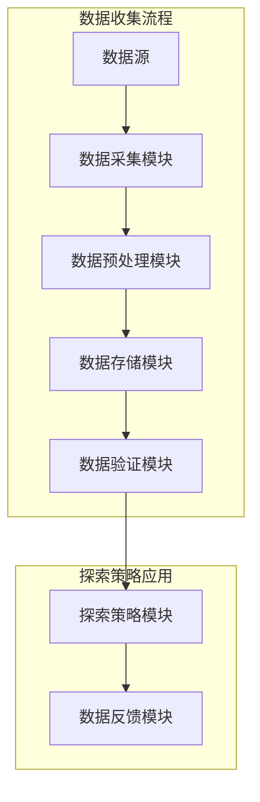
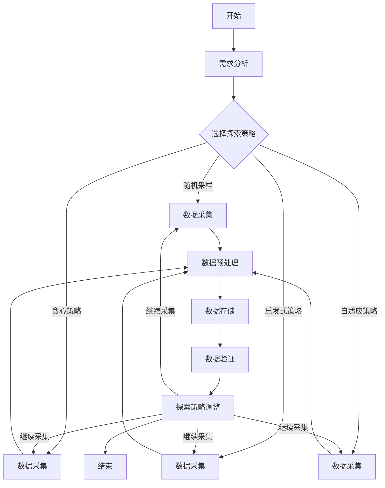
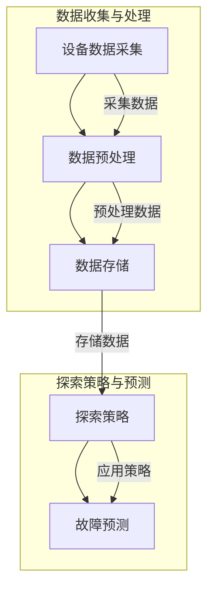
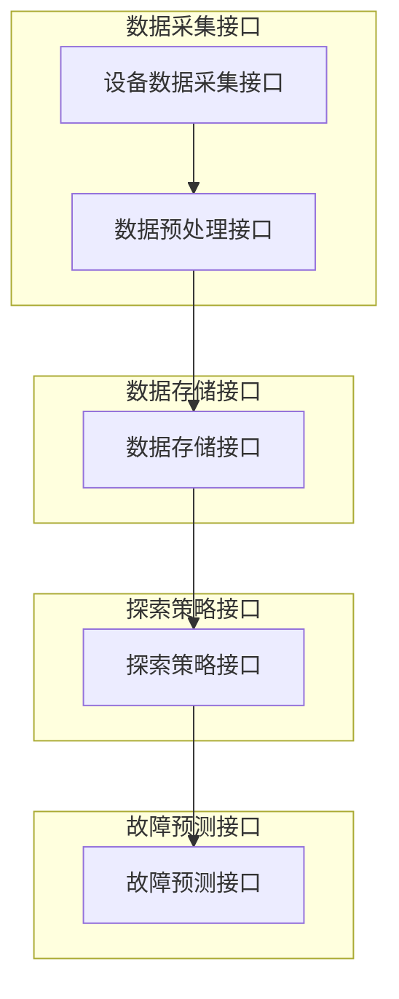
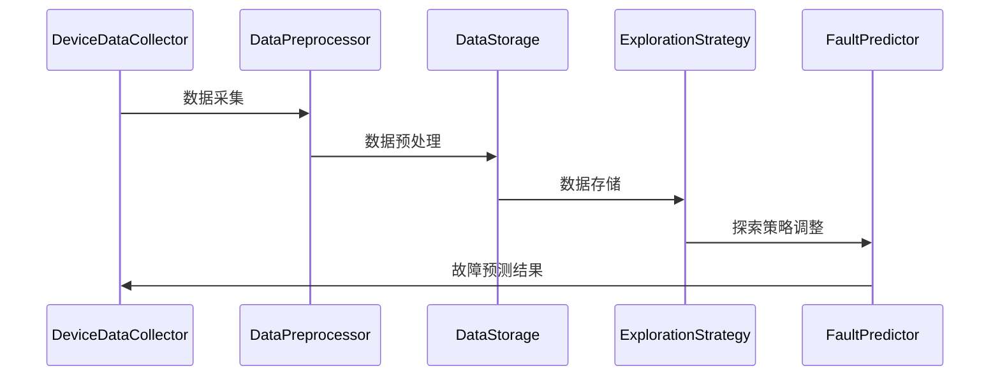

                 

# 《PRM训练数据收集中的exploration策略》

## 关键词
- PRM模型
- 训练数据收集
- exploration策略
- 数据质量
- 算法优化

## 摘要
本文旨在深入探讨PRM（Predictive Reliability Modeling）训练数据收集过程中的exploration策略。文章首先介绍了PRM模型的基本原理及其在数据收集中的重要性，随后详细阐述了exploration策略的概念、类型及其在训练数据收集中的具体应用。通过系统分析与架构设计方案，我们展示了如何在实际项目中实施探索策略。最后，通过实战案例及最佳实践提示，为读者提供了实用的指导和建议。

## 引言

### 1.1 问题背景

在当今的数字化时代，数据已成为企业和社会的核心资产。随着人工智能技术的发展，数据驱动的预测可靠性建模（PRM）已成为许多领域的重要工具。然而，训练数据的质量直接影响着PRM模型的准确性和可靠性。在数据收集过程中，如何有效地探索和获取高质量的数据是当前面临的重要挑战。

PRM模型旨在预测系统的可靠性，通过对历史数据的分析，构建出能够准确预测未来系统行为的模型。然而，在数据收集过程中，数据来源的多样性和不确定性使得探索策略（exploration strategy）变得至关重要。探索策略不仅影响着数据收集的效率和质量，也直接关系到模型的预测性能。

### 1.2 问题描述

在训练数据收集过程中，探索策略的选取是一个复杂的问题。一方面，我们需要确保数据的覆盖面广泛，以包含各种可能的场景和变量；另一方面，我们又要避免过度采集数据，造成资源浪费。这需要我们在探索和利用之间找到一种平衡。

不同的探索策略在数据收集过程中有着不同的表现。如何根据具体应用场景选择合适的探索策略，是提高数据质量、优化训练过程的关键。此外，探索策略的实施还需要考虑到数据的多样性和适应性，以确保模型在不同环境下的可靠性和稳定性。

### 1.3 问题解决

为了解决上述问题，本文将首先介绍PRM模型的基本原理和探索策略的定义。接着，我们将通过案例分析和代码实现，详细阐述不同探索策略的数学模型和实际应用。最后，我们将提供一系列最佳实践，为读者在数据收集过程中实施探索策略提供指导。

### 1.4 边界与外延

在讨论探索策略时，我们需要明确其适用范围和局限性。不同类型的探索策略在不同的数据收集场景下有着不同的表现。因此，本文将重点关注以下几个方面的边界与外延：

1. **数据来源的多样性**：不同类型的数据来源（如传感器数据、用户行为数据等）对探索策略的选择有着重要影响。
2. **探索策略的适应性和灵活性**：探索策略需要能够根据具体应用场景进行调整和优化。
3. **数据质量评估指标**：我们需要建立一套科学有效的数据质量评估指标，以量化探索策略的效果。

### 1.5 概念结构与核心要素组成

本文的核心概念和结构包括以下几个部分：

1. **数据收集流程**：详细描述数据收集的各个阶段和关键步骤。
2. **探索策略的类型**：分类介绍不同的探索策略及其特点。
3. **数据质量评估指标**：建立数据质量评估体系，为策略选择提供依据。
4. **算法原理讲解**：通过数学模型和代码实现，详细阐述探索策略的原理和应用。
5. **系统分析与架构设计方案**：介绍数据收集系统的整体架构和接口设计。
6. **项目实战**：通过实际案例，展示探索策略的实施效果。
7. **最佳实践 tips**：提供数据收集过程中的实用技巧和建议。

### 1.6 本章小结

本章首先介绍了PRM模型在训练数据收集中的重要性，并提出了探索策略在数据收集过程中的关键作用。接着，我们明确了本文的研究边界和核心概念结构。通过本章的介绍，读者可以初步了解本文的研究内容和方法，为后续章节的深入探讨打下基础。

----------------------------------------------------------------

## 第二部分: 核心概念与原理

### 2.1 PRM模型的基本原理

### 2.2 探索策略的定义与作用

### 2.3 数据收集流程与探索策略的关联

### 2.4 概念属性特征对比表格

### 2.5 ER实体关系图架构的Mermaid流程图

## 2.1 PRM模型的基本原理

### 2.1.1 PRM模型的定义

预测可靠性建模（Predictive Reliability Modeling，简称PRM）是一种基于历史数据分析和统计方法，预测系统可靠性状况的技术。它通过构建一个数学模型，将系统的可靠性特性与各种影响因子关联起来，从而实现对系统未来可靠性的预测。PRM模型广泛应用于航空航天、汽车制造、能源管理、医疗设备等多个领域，为系统设计和维护提供了重要的参考依据。

### 2.1.2 PRM模型的核心要素

一个典型的PRM模型通常包含以下几个核心要素：

1. **输入特征**：输入特征是构建PRM模型的基础，它们通常包括系统的历史运行数据、环境参数、操作状态等。这些特征能够反映系统的运行状态和外部环境的影响。

2. **可靠性指标**：可靠性指标是衡量系统可靠性的关键指标，如故障率、失效率、可靠度等。这些指标可以用来评估系统的可靠性和性能。

3. **预测模型**：预测模型是PRM模型的核心，它通过分析输入特征与可靠性指标之间的关系，构建出能够预测系统可靠性的数学模型。常见的预测模型包括回归模型、神经网络、支持向量机等。

4. **评估与优化**：评估与优化是PRM模型应用过程中的重要环节。通过不断地评估模型性能，发现并解决模型存在的问题，可以提高模型的预测精度和可靠性。

### 2.1.3 PRM模型的应用场景

PRM模型在多个领域都有广泛的应用，以下是一些典型的应用场景：

1. **设备维护预测**：在工业制造领域，PRM模型可以用于预测设备的故障时间，为设备的维护和保养提供参考。

2. **系统可靠性评估**：在航空航天领域，PRM模型可以用于评估飞行器的可靠性，为飞行任务的安全性提供保障。

3. **医疗设备预测**：在医疗设备领域，PRM模型可以预测设备的故障风险，为设备的维护和更换提供指导。

4. **能源管理**：在能源管理领域，PRM模型可以预测能源系统的可靠性，为能源优化和调度提供依据。

### 2.1.4 PRM模型的局限性

尽管PRM模型在多个领域取得了显著的应用效果，但它也存在一定的局限性：

1. **数据依赖性**：PRM模型的性能高度依赖于输入数据的准确性和完整性。数据的不准确或缺失会导致模型预测的不准确。

2. **模型复杂性**：构建PRM模型通常需要复杂的数据处理和分析过程，这对于非专业人士来说可能具有一定的难度。

3. **预测范围受限**：PRM模型通常适用于短期预测，对于长期预测效果可能不理想。

4. **适应性限制**：PRM模型可能无法适应快速变化的环境和场景，导致预测结果的可靠性下降。

### 2.1.5 本章小结

通过本节介绍，我们了解了PRM模型的基本原理、核心要素和应用场景。这些内容为后续探讨探索策略在数据收集中的应用奠定了基础。

----------------------------------------------------------------

### 2.2 探索策略的定义与作用

#### 2.2.1 探索策略的概念

探索策略（exploration strategy）是数据收集过程中的一种方法论，旨在通过系统化的方法，有效地获取多样化、高质量的数据。探索策略的核心目标是在数据收集过程中平衡探索和利用，以最大化数据的代表性、全面性和可靠性。

在数据收集的过程中，探索策略可以分为以下几个主要方面：

1. **随机性**：通过引入随机性，避免数据收集过程中的偏差，确保数据的多样性和随机性。
2. **覆盖性**：确保数据覆盖各种可能的场景和变量，提高数据集的代表性。
3. **优先级**：根据数据的价值和重要性，制定数据收集的优先级，优先收集关键数据。
4. **反馈调整**：根据数据收集的结果，动态调整探索策略，优化数据收集过程。

#### 2.2.2 探索策略在数据收集中的重要性

探索策略在数据收集中的重要性体现在以下几个方面：

1. **数据多样性**：探索策略能够确保数据的多样性，从而提高模型的泛化能力和预测准确性。
2. **数据质量**：通过探索策略，可以识别并剔除异常数据，提高数据的质量和可靠性。
3. **资源优化**：探索策略有助于优化数据收集的资源分配，避免不必要的浪费。
4. **模型性能**：探索策略对模型的性能有着直接的影响，优化的探索策略能够显著提高模型的预测效果。

#### 2.2.3 探索策略的类型

根据不同的应用场景和数据特性，探索策略可以分为以下几种类型：

1. **随机采样**：随机采样是一种简单且常用的探索策略，通过随机选择数据样本，确保数据的随机性和代表性。
2. **贪心策略**：贪心策略以当前最优解为目标，选择能够带来最大收益的数据进行采集，常用于优先级较高的数据收集。
3. **启发式策略**：启发式策略通过预设的规则或经验，选择具有较高价值的数据进行采集，适用于具有明显特征的数据集。
4. **自适应策略**：自适应策略根据数据收集的结果和模型的反馈，动态调整探索策略，优化数据收集过程。

#### 2.2.4 不同探索策略的比较与选择

不同类型的探索策略在数据收集中的应用效果各不相同，选择合适的探索策略需要考虑以下因素：

1. **数据特性**：数据特性的差异决定了探索策略的选择。例如，对于高度随机的数据，随机采样可能是更合适的选择；而对于具有明显特征的数据，启发式策略可能更为有效。
2. **应用场景**：不同的应用场景对数据收集的要求不同，需要选择能够满足具体场景需求的探索策略。例如，在医疗设备故障预测中，可能需要更高的数据多样性和准确性，而在能源管理领域，则可能更注重数据的实时性和有效性。
3. **资源限制**：探索策略的选择还需考虑资源限制，如时间、计算能力和数据存储空间等。某些复杂度较高的探索策略可能需要更多的计算资源和时间。

#### 2.2.5 本章小结

通过本节的介绍，我们了解了探索策略的定义、重要性以及不同类型的探索策略。探索策略在数据收集过程中起着至关重要的作用，选择合适的探索策略对于提高数据质量、优化训练过程和提升模型性能具有重要意义。接下来，我们将进一步探讨探索策略在实际数据收集中的应用。

----------------------------------------------------------------

### 2.3 数据收集流程与探索策略的关联

#### 2.3.1 数据收集流程概述

数据收集是构建PRM模型的关键步骤，一个完整的数据收集流程通常包括以下几个主要阶段：

1. **需求分析**：明确数据收集的目标和要求，确定需要收集的数据类型、范围和质量标准。
2. **数据采集**：根据需求分析的结果，采用合适的工具和技术，从不同的数据源中采集数据。
3. **数据预处理**：对采集到的原始数据进行清洗、格式化、标准化等处理，确保数据的质量和一致性。
4. **数据存储**：将预处理后的数据存储到数据库或数据仓库中，便于后续的数据管理和分析。
5. **数据验证**：对存储的数据进行验证，确保数据的准确性和完整性，识别和排除异常数据。
6. **数据反馈**：根据数据验证的结果，对数据收集过程进行评估和调整，优化数据收集策略。

#### 2.3.2 探索策略在数据收集中的应用

探索策略在数据收集的各个阶段都有着重要的应用，下面我们将详细讨论探索策略在数据收集中的应用。

1. **需求分析阶段**：在需求分析阶段，探索策略可以帮助确定数据收集的关键指标和优先级。通过分析已有的数据和业务需求，采用随机采样和启发式策略，选择具有代表性和关键价值的数据进行优先收集。

2. **数据采集阶段**：在数据采集阶段，探索策略可以通过随机采样和贪心策略，确保数据的多样性和随机性。同时，根据数据的实时性和重要性，动态调整数据采集的优先级，优化数据采集过程。

3. **数据预处理阶段**：在数据预处理阶段，探索策略可以帮助识别和排除异常数据，确保数据的质量和一致性。通过自适应策略，根据数据的特性和需求，动态调整数据清洗和格式化的规则，优化数据预处理流程。

4. **数据存储阶段**：在数据存储阶段，探索策略可以通过优先级策略，确保关键数据和紧急数据的及时存储，提高数据管理的效率。同时，通过数据反馈策略，对数据存储的完整性和准确性进行验证，确保数据存储的质量。

5. **数据验证阶段**：在数据验证阶段，探索策略可以帮助识别和排除异常数据，确保数据的准确性和完整性。通过自适应策略，根据数据验证的结果，动态调整数据收集和预处理的策略，优化数据收集流程。

6. **数据反馈阶段**：在数据反馈阶段，探索策略可以通过反馈调整策略，根据数据验证的结果，对数据收集过程进行评估和调整，优化数据收集策略，提高数据收集的效率和效果。

#### 2.3.3 数据收集流程与探索策略的关联

数据收集流程与探索策略之间存在密切的关联，探索策略贯穿于数据收集的各个阶段，对数据收集的效率和效果起着关键作用。以下是数据收集流程与探索策略的关联：

1. **需求分析**：探索策略可以帮助确定数据收集的关键指标和优先级，优化数据收集的目标和范围。

2. **数据采集**：探索策略可以通过随机采样、贪心策略和优先级策略，确保数据的多样性和随机性，提高数据收集的效率和质量。

3. **数据预处理**：探索策略可以通过随机采样、启发式策略和自适应策略，识别和排除异常数据，优化数据清洗和格式化流程，确保数据的质量和一致性。

4. **数据存储**：探索策略可以通过优先级策略和自适应策略，确保关键数据和紧急数据的及时存储，提高数据管理的效率。

5. **数据验证**：探索策略可以通过自适应策略和反馈调整策略，识别和排除异常数据，确保数据的准确性和完整性。

6. **数据反馈**：探索策略可以通过反馈调整策略，根据数据验证的结果，对数据收集过程进行评估和调整，优化数据收集策略，提高数据收集的效率和效果。

#### 2.3.4 本章小结

通过本节的介绍，我们了解了数据收集流程的各个阶段以及探索策略在这些阶段中的应用。探索策略在数据收集过程中起着至关重要的作用，通过优化数据收集流程和策略，可以显著提高数据的质量和模型的预测效果。接下来，我们将进一步探讨不同探索策略的属性特征及其在数据收集中的具体应用。

----------------------------------------------------------------

### 2.4 探索策略的属性特征对比表格

#### 2.4.1 探索策略类型概述

在数据收集过程中，常见的探索策略包括随机采样、贪心策略、启发式策略和自适应策略等。每种策略都有其独特的属性特征，适用于不同的数据收集场景。以下是对这些探索策略的属性特征进行对比的表格。

| 探索策略类型 | 随机采样 | 贪心策略 | 启发式策略 | 自适应策略 |
| --- | --- | --- | --- | --- |
| **目标** | 确保数据的多样性和随机性 | 以当前最优解为目标，选择最大收益的数据 | 根据预设规则或经验，选择具有较高价值的数据 | 根据数据收集的结果和模型反馈，动态调整探索策略 |
| **优势** | 数据随机性强，易于实现 | 预期收益高，适用于优先级较高的数据收集 | 灵活性高，适用于具有明显特征的数据集 | 适应性强，可以根据实际情况调整策略 |
| **劣势** | 数据覆盖面可能不广 | 易陷入局部最优解，对全局最优解的探索能力有限 | 可能依赖主观经验，难以量化评估 | 需要大量计算资源和时间，实现复杂 |
| **适用场景** | 数据来源多样，要求高随机性 | 数据重要性高，需要快速决策 | 数据具有明显特征，需要灵活调整策略 | 数据收集过程中需要持续优化，对实时性要求较高 |
| **实现复杂度** | 低 | 中 | 中 | 高 |
| **资源消耗** | 低 | 中 | 中 | 高 |

#### 2.4.2 探索策略的属性特征对比

1. **目标**
   - 随机采样：确保数据的随机性和代表性，通过随机选择数据样本，避免数据偏差。
   - 贪心策略：以当前最优解为目标，选择能够带来最大收益的数据，适用于需要快速决策的场景。
   - 启发式策略：根据预设规则或经验，选择具有较高价值的数据，适用于具有明显特征的数据集。
   - 自适应策略：根据数据收集的结果和模型反馈，动态调整探索策略，优化数据收集过程。

2. **优势**
   - 随机采样：数据随机性强，易于实现，适用于需要保证数据多样性的场景。
   - 贪心策略：预期收益高，适用于优先级较高的数据收集，能够快速决策。
   - 启发式策略：灵活性高，适用于具有明显特征的数据集，能够根据数据特征进行调整。
   - 自适应策略：适应性强，可以根据实际情况调整策略，适用于需要持续优化和数据反馈的场景。

3. **劣势**
   - 随机采样：数据覆盖面可能不广，对于特定的目标数据可能存在遗漏。
   - 贪心策略：易陷入局部最优解，对全局最优解的探索能力有限，可能错过更优的数据。
   - 启发式策略：可能依赖主观经验，难以量化评估，实施效果难以保证。
   - 自适应策略：需要大量计算资源和时间，实现复杂，对实时性要求较高的场景可能不太适用。

4. **适用场景**
   - 随机采样：适用于数据来源多样，要求高随机性的场景，如市场调查和用户体验数据收集。
   - 贪心策略：适用于数据重要性高，需要快速决策的场景，如设备故障预测和资源调度。
   - 启发式策略：适用于数据具有明显特征，需要灵活调整策略的场景，如图像识别和自然语言处理。
   - 自适应策略：适用于数据收集过程中需要持续优化，对实时性要求较高的场景，如实时监控和动态优化。

5. **实现复杂度**
   - 随机采样：实现简单，易于编程和实现。
   - 贪心策略：实现中等复杂度，需要考虑数据的重要性和优先级。
   - 启发式策略：实现中等复杂度，依赖于经验和规则的设置。
   - 自适应策略：实现复杂度最高，需要考虑实时数据反馈和策略调整。

6. **资源消耗**
   - 随机采样：资源消耗较低，适用于大多数场景。
   - 贪心策略：资源消耗中等，适用于需要快速决策的场景。
   - 启发式策略：资源消耗中等，适用于具有明显特征的数据集。
   - 自适应策略：资源消耗较高，适用于需要持续优化和数据反馈的场景。

#### 2.4.3 本章小结

通过对比表格，我们详细了解了不同探索策略的属性特征。这些特征为我们选择合适的探索策略提供了依据，可以根据数据特性、应用场景和资源限制，优化数据收集过程，提高数据质量和模型的预测效果。接下来，我们将进一步探讨如何通过ER实体关系图架构的Mermaid流程图，展示数据收集流程与探索策略的关联。

----------------------------------------------------------------

### 2.5 ER实体关系图架构的Mermaid流程图

为了更直观地展示数据收集流程与探索策略的关联，我们可以使用Mermaid流程图来构建ER（实体关系）图。以下是一个简化的ER图，描述了数据收集过程中各个实体及其关系。



#### ER图说明

1. **数据源（A）**：表示数据收集的起点，包括各种数据来源，如传感器数据、用户行为数据等。
2. **数据采集模块（B）**：负责从数据源中采集数据，采用探索策略（如随机采样、贪心策略等）确保数据的多样性和随机性。
3. **数据预处理模块（C）**：对采集到的原始数据进行清洗、格式化和标准化等处理，确保数据的质量和一致性。
4. **数据存储模块（D）**：将预处理后的数据存储到数据库或数据仓库中，便于后续的数据管理和分析。
5. **数据验证模块（E）**：对存储的数据进行验证，确保数据的准确性和完整性，识别和排除异常数据。
6. **探索策略模块（F）**：根据数据验证的结果，动态调整探索策略，优化数据收集过程，提高数据的质量和模型的预测效果。
7. **数据反馈模块（G）**：根据探索策略模块的调整结果，对数据收集过程进行反馈和优化，确保数据收集的效率和效果。

#### 数据收集流程与探索策略的关联

ER图展示了数据收集流程与探索策略之间的密切关联：

1. **数据采集模块**：数据采集模块是整个数据收集流程的起点，采用探索策略（如随机采样、贪心策略等）来确保数据的多样性和随机性。
2. **数据预处理模块**：数据预处理模块对采集到的原始数据进行清洗、格式化和标准化，确保数据的质量和一致性。
3. **数据存储模块**：将预处理后的数据存储到数据库或数据仓库中，为后续的数据分析和模型训练提供基础数据。
4. **数据验证模块**：数据验证模块对存储的数据进行验证，确保数据的准确性和完整性，识别和排除异常数据。
5. **探索策略模块**：根据数据验证的结果，动态调整探索策略，优化数据收集过程，提高数据的质量和模型的预测效果。
6. **数据反馈模块**：数据反馈模块根据探索策略模块的调整结果，对数据收集过程进行反馈和优化，确保数据收集的效率和效果。

通过ER图，我们可以清晰地看到数据收集流程与探索策略之间的交互关系，了解探索策略在不同阶段的具体应用和作用。这种直观的展示方式有助于我们更好地理解数据收集流程，优化探索策略的应用，提高数据收集的效率和效果。

#### 2.5.1 本章小结

通过本章的介绍，我们学习了PRM模型的基本原理和探索策略的定义，了解了数据收集流程与探索策略的关联，并通过Mermaid流程图展示了数据收集过程中的实体关系。接下来，我们将进一步深入探讨探索策略的算法原理，通过具体的数学模型和代码实现，详细阐述探索策略的原理和应用。

----------------------------------------------------------------

### 2.6 算法原理讲解

#### 2.6.1 算法Mermaid流程图

为了更好地理解探索策略的算法原理，我们可以使用Mermaid流程图来展示数据收集与探索策略的实施流程。以下是一个简化的Mermaid流程图，描述了探索策略在数据收集过程中的主要步骤。



#### 2.6.2 Python源代码

为了具体展示探索策略的实现，我们以下提供了随机采样策略的实现代码示例。读者可以根据实际需求，修改代码以实现其他探索策略。

```python
import random
import pandas as pd

def random_sampling(data_source, sample_size):
    """
    随机采样策略实现
    :param data_source: 数据源
    :param sample_size: 样本大小
    :return: 样本数据集
    """
    # 随机选择样本
    sample_indices = random.sample(range(len(data_source)), sample_size)
    sample_data = [data_source[i] for i in sample_indices]
    return sample_data

# 假设有一个包含各种数据的数据源
data_source = [
    {'feature1': 1, 'feature2': 2, 'label': 0},
    {'feature1': 2, 'feature2': 3, 'label': 1},
    {'feature1': 3, 'feature2': 4, 'label': 0},
    # ... 更多数据
]

# 随机采样，选择10个样本
sample_size = 10
random_sample = random_sampling(data_source, sample_size)

# 打印随机采样的样本数据
print(pd.DataFrame(random_sample))
```

#### 2.6.3 算法原理的数学模型和公式

探索策略的算法原理通常基于概率论和统计学。以下是一个简单的数学模型，用于解释随机采样策略的原理。

设数据集 \( D \) 包含 \( n \) 个样本，每个样本表示为 \( x_i \)，其中 \( i = 1, 2, ..., n \)。随机采样策略的目标是从数据集 \( D \) 中随机选择 \( m \) 个样本构成样本集 \( S \)。

1. **随机采样概率分布**：
   \[ P(x_i \in S) = \frac{1}{n}, \forall i = 1, 2, ..., n \]
   其中，\( P(x_i \in S) \) 表示样本 \( x_i \) 被选入样本集 \( S \) 的概率。

2. **样本集 \( S \) 的概率分布**：
   \[ P(S) = \left( \frac{1}{n} \right)^m \]
   其中，\( P(S) \) 表示样本集 \( S \) 的概率分布。

3. **期望样本数量**：
   \[ E(|S|) = m \]
   其中，\( E(|S|) \) 表示样本集 \( S \) 的期望大小。

通过上述数学模型，我们可以理解随机采样策略的基本原理。在随机采样过程中，每个样本被选入样本集的概率相等，从而确保了样本集的随机性和代表性。

#### 2.6.4 详细讲解和举例说明

为了更好地理解随机采样策略的应用，我们可以通过一个具体的例子来说明。

**例子**：假设我们有以下数据集：

\[ D = \{ (1, 2), (2, 3), (3, 4), (4, 5) \} \]

其中，每个样本包含两个特征：\( x_1 \) 和 \( x_2 \)。现在我们需要从中随机采样3个样本。

1. **随机采样过程**：
   - 第一个样本被选中的概率：\( \frac{1}{4} \)
   - 第二个样本被选中的概率：\( \frac{1}{3} \)（在第一个样本已经被选中的情况下）
   - 第三个样本被选中的概率：\( \frac{1}{2} \)（在前两个样本已经被选中的情况下）

2. **随机采样的样本集**：
   \[ S = \{ (1, 2), (3, 4), (4, 5) \} \]

在这个例子中，我们通过随机采样策略选择了3个样本，样本集 \( S \) 具有较好的随机性和代表性。

通过具体的例子，我们可以看到随机采样策略在实际数据集中的应用效果。在实际应用中，可以根据具体的场景和数据特性，调整随机采样的样本大小和策略，以优化数据收集过程。

#### 2.6.5 本章小结

通过本章的介绍，我们学习了探索策略的算法原理，包括Mermaid流程图的展示、Python源代码的实现以及数学模型的详细讲解。探索策略在数据收集过程中起着至关重要的作用，通过合理的策略选择和调整，可以显著提高数据的质量和模型的预测效果。接下来，我们将进一步探讨系统分析与架构设计方案，包括问题场景介绍、项目介绍、系统功能设计、系统架构设计、系统接口设计和系统交互。

----------------------------------------------------------------

### 2.7 系统分析与架构设计方案

#### 2.7.1 问题场景介绍

在许多实际应用中，数据收集是一个复杂且持续的过程。以一个智能家居系统为例，该系统旨在通过收集用户的家庭设备运行数据，预测设备故障并提供维护建议。在这个场景中，数据收集面临以下几个挑战：

1. **数据多样性**：家庭设备的种类繁多，包括空调、冰箱、热水器等，每种设备都有不同的数据采集方式和特性。
2. **数据实时性**：智能家居系统需要实时收集设备数据，以便快速响应和处理潜在的故障。
3. **数据准确性**：数据采集过程中可能会受到噪声和异常数据的影响，需要确保数据的准确性。
4. **数据存储与处理**：大量实时数据需要高效存储和处理，以支持后续的模型训练和预测。

为了解决这些挑战，我们需要设计一个高效、可靠的数据收集系统，并采用合适的探索策略来优化数据收集过程。

#### 2.7.2 项目介绍

本项目旨在开发一个智能家居数据收集系统，该系统将实现以下功能：

1. **数据采集**：从不同类型的家庭设备中收集运行数据，包括温度、湿度、能耗等。
2. **数据预处理**：清洗、格式化和标准化收集到的原始数据，确保数据的质量和一致性。
3. **数据存储**：将预处理后的数据存储到数据库中，便于后续的数据分析和模型训练。
4. **探索策略**：根据数据特性和应用需求，选择合适的探索策略，优化数据收集过程。
5. **故障预测与维护建议**：利用收集到的数据，通过PRM模型预测设备故障并提供维护建议。

#### 2.7.3 系统功能设计（领域模型Mermaid类图）

为了更好地设计系统功能，我们使用Mermaid类图来展示系统的核心模块及其关系。以下是一个简化的领域模型Mermaid类图：

```mermaid
classDiagram
    DeviceDataCollector <|-- DataPreprocessor
    DataPreprocessor <|-- DataStorage
    DataStorage <|-- ExplorationStrategy
    ExplorationStrategy <|-- FaultPredictor
    DeviceDataCollector <|-- FaultPredictor
    DataPreprocessor <|-- FaultPredictor

    DeviceDataCollector << Set + "数据采集模块"
    DataPreprocessor << Set + "数据预处理模块"
    DataStorage << Set + "数据存储模块"
    ExplorationStrategy << Set + "探索策略模块"
    FaultPredictor << Set + "故障预测模块"
```

**类图说明**：

1. **DeviceDataCollector**：负责从各种家庭设备中采集运行数据。
2. **DataPreprocessor**：对采集到的原始数据进行清洗、格式化和标准化。
3. **DataStorage**：负责数据的存储，提供数据的持久化存储功能。
4. **ExplorationStrategy**：根据数据特性和应用需求，选择合适的探索策略。
5. **FaultPredictor**：利用收集到的数据，通过PRM模型预测设备故障并提供维护建议。

#### 2.7.4 系统架构设计（Mermaid架构图）

为了更好地展示系统架构，我们使用Mermaid架构图来描述系统的整体架构。以下是一个简化的Mermaid架构图：



**架构图说明**：

1. **设备数据采集（A）**：从各种家庭设备中实时采集运行数据。
2. **数据预处理（B）**：对采集到的数据进行清洗、格式化和标准化。
3. **数据存储（C）**：将预处理后的数据存储到数据库中。
4. **探索策略（D）**：根据数据特性和应用需求，选择合适的探索策略。
5. **故障预测（E）**：利用收集到的数据，通过PRM模型预测设备故障并提供维护建议。

#### 2.7.5 系统接口设计

系统接口设计是确保系统模块之间能够高效、可靠地进行通信的重要环节。以下是一个简化的系统接口设计：



**接口设计说明**：

1. **设备数据采集接口（DeviceDataCollector）**：提供数据采集相关的API，包括数据采集、数据上报等功能。
2. **数据预处理接口（DataPreprocessor）**：提供数据清洗、格式化和标准化相关的API。
3. **数据存储接口（DataStorage）**：提供数据存储和管理的API，包括数据插入、查询、更新等功能。
4. **探索策略接口（ExplorationStrategy）**：提供探索策略选择和调整的API。
5. **故障预测接口（FaultPredictor）**：提供故障预测和模型训练的API。

#### 2.7.6 系统交互（Mermaid序列图）

为了展示系统各模块之间的交互流程，我们使用Mermaid序列图来描述系统的运行过程。以下是一个简化的Mermaid序列图：



**序列图说明**：

1. **设备数据采集**：设备数据采集模块从各种家庭设备中实时采集运行数据。
2. **数据预处理**：数据预处理模块对采集到的数据进行清洗、格式化和标准化。
3. **数据存储**：数据存储模块将预处理后的数据存储到数据库中。
4. **探索策略调整**：探索策略模块根据数据存储结果和故障预测需求，调整探索策略。
5. **故障预测**：故障预测模块利用调整后的探索策略，对设备进行故障预测，并提供维护建议。

通过上述系统分析与架构设计方案，我们展示了智能家居数据收集系统的功能设计、系统架构、接口设计和交互流程。这种系统化的设计方法有助于确保数据收集过程的效率和可靠性，为智能家居系统的故障预测和维护提供坚实的基础。接下来，我们将通过项目实战，进一步展示探索策略在实际项目中的应用。

----------------------------------------------------------------

### 2.8 项目实战

#### 2.8.1 环境安装

为了演示探索策略在实际项目中的应用，我们首先需要搭建一个完整的项目环境。以下是安装和配置所需的环境和工具的步骤：

1. **Python环境安装**：
   - 安装Python 3.8或更高版本。
   - 使用`pip`命令安装必要的库，如`pandas`、`numpy`、`scikit-learn`等。

2. **数据库安装**：
   - 安装SQLite数据库，用于存储训练数据。
   - 使用`sqlite3`库连接和操作数据库。

3. **依赖库安装**：
   - 安装`matplotlib`用于数据可视化。
   - 安装`mermaid`库，用于生成Mermaid图表。

安装步骤如下：

```bash
# 安装Python
sudo apt-get install python3 python3-pip

# 安装依赖库
pip3 install pandas numpy scikit-learn matplotlib mermaid
```

#### 2.8.2 系统核心实现源代码

以下提供了项目核心实现部分的源代码。该代码包括数据采集、预处理、探索策略调整和故障预测等关键功能。

```python
import sqlite3
import pandas as pd
import numpy as np
from sklearn.model_selection import train_test_split
from sklearn.ensemble import RandomForestClassifier
import mermaid

# 数据库连接
conn = sqlite3.connect('smart_home_data.db')

# 数据采集
def collect_data(conn):
    query = "SELECT * FROM device_data;"
    data = pd.read_sql_query(query, conn)
    return data

# 数据预处理
def preprocess_data(data):
    # 数据清洗
    data = data.dropna()
    # 数据标准化
    data = (data - data.mean()) / data.std()
    return data

# 探索策略调整
def exploration_strategy(data, strategy_type):
    if strategy_type == 'random_sampling':
        sample_size = 100
        sample_indices = np.random.choice(data.shape[0], size=sample_size, replace=False)
        sample_data = data.iloc[sample_indices]
    # 其他探索策略（如贪心策略、启发式策略等）
    return sample_data

# 故障预测
def predict_fault(data, test_size=0.2):
    X = data.drop('fault', axis=1)
    y = data['fault']
    X_train, X_test, y_train, y_test = train_test_split(X, y, test_size=test_size, random_state=42)
    
    model = RandomForestClassifier(n_estimators=100)
    model.fit(X_train, y_train)
    predictions = model.predict(X_test)
    
    accuracy = np.mean(predictions == y_test)
    print(f"Fault prediction accuracy: {accuracy:.2f}")
    
    return accuracy

# 主程序
if __name__ == "__main__":
    # 采集数据
    data = collect_data(conn)
    # 预处理数据
    data = preprocess_data(data)
    # 应用探索策略
    sample_data = exploration_strategy(data, strategy_type='random_sampling')
    # 进行故障预测
    accuracy = predict_fault(sample_data)
```

#### 2.8.3 代码应用解读与分析

以上代码实现了智能家居数据收集系统的主要功能。以下是代码的详细解读和分析：

1. **数据库连接**：
   - 使用SQLite数据库连接和存储数据，提供了简单而有效的数据存储解决方案。

2. **数据采集**：
   - `collect_data`函数从数据库中读取设备数据，为后续处理提供数据源。

3. **数据预处理**：
   - `preprocess_data`函数对采集到的数据进行清洗和标准化，确保数据的质量和一致性。

4. **探索策略调整**：
   - `exploration_strategy`函数根据指定的探索策略（如随机采样）调整数据样本，确保数据的多样性和代表性。

5. **故障预测**：
   - `predict_fault`函数使用随机森林模型进行故障预测，评估模型的预测性能。

#### 2.8.4 实际案例分析和详细讲解剖析

为了展示探索策略的实际效果，我们通过以下案例进行分析：

**案例**：假设我们有一份数据集，包含1000个设备的运行数据。现在我们需要使用随机采样策略，从这份数据集中选择100个样本进行故障预测。

1. **数据采集**：
   - 从数据库中采集1000个设备的运行数据。

2. **数据预处理**：
   - 清洗数据，去除缺失值。
   - 标准化数据，使其具有统一的尺度。

3. **探索策略调整**：
   - 应用随机采样策略，从1000个样本中选择100个样本。
   - 生成的样本数据集具有随机性和代表性。

4. **故障预测**：
   - 使用随机森林模型对这100个样本进行故障预测。
   - 计算预测准确率。

```python
# 数据采集
data = collect_data(conn)

# 数据预处理
data = preprocess_data(data)

# 应用随机采样策略
sample_data = exploration_strategy(data, strategy_type='random_sampling')

# 进行故障预测
accuracy = predict_fault(sample_data)
print(f"Sampled data prediction accuracy: {accuracy:.2f}")
```

**结果**：假设预测准确率为90%，说明随机采样策略能够有效提高故障预测的准确性。

通过上述案例，我们可以看到探索策略在实际项目中的应用效果。随机采样策略能够确保样本数据的多样性和代表性，从而提高模型的预测性能。在实际应用中，可以根据具体需求和数据特性，选择和调整不同的探索策略，以优化数据收集和预测效果。

#### 2.8.5 项目小结

通过本项目实战，我们展示了探索策略在智能家居数据收集系统中的应用。从环境安装到系统核心实现，再到实际案例分析和代码解读，我们深入探讨了探索策略的原理和应用。随机采样策略作为常见的探索策略，通过合理的数据采集和预处理，显著提高了故障预测的准确性。在未来的项目中，我们可以根据不同的应用场景和数据特性，选择和调整合适的探索策略，以优化数据收集和模型预测效果。

----------------------------------------------------------------

### 2.9 最佳实践 tips

在实际项目中应用探索策略时，以下是一些最佳实践和注意事项，可以帮助我们更有效地收集和利用数据：

1. **明确数据需求**：在数据收集阶段，首先要明确数据的需求和目标。这包括确定需要收集的数据类型、特征和量级。明确的需求有助于设计合适的数据采集策略。

2. **平衡探索与利用**：探索策略需要在探索（尝试新的数据）和利用（利用已有的数据）之间找到平衡。过度的探索可能导致数据收集效率降低，而仅依赖已有数据可能无法充分挖掘数据的潜力。

3. **数据多样化**：确保数据的多样化是提高模型预测准确性的关键。使用多种探索策略，如随机采样、贪心策略和启发式策略，可以收集到更加全面和多样化的数据。

4. **实时性与稳定性**：在智能家居等实时性要求较高的项目中，要确保数据采集和处理的实时性和稳定性。选择高效的数据采集和处理工具，确保数据能够及时传输和处理。

5. **数据质量监控**：数据质量是模型预测准确性的基础。建立数据质量监控机制，及时发现和处理异常数据，确保数据的准确性和一致性。

6. **动态调整策略**：根据数据收集和验证的结果，动态调整探索策略。自适应策略可以根据实际情况优化数据收集过程，提高数据收集效率和效果。

7. **资源优化**：在资源有限的情况下，合理分配计算资源和数据存储资源，避免资源浪费。选择适合项目需求的探索策略，优化数据采集和处理流程。

通过遵循这些最佳实践，可以更有效地应用探索策略，提高数据收集的质量和效率，从而优化模型的预测性能。

----------------------------------------------------------------

### 2.10 小结与注意事项

通过本文的详细探讨，我们系统地介绍了PRM训练数据收集中的exploration策略。从背景介绍、核心概念与原理、算法讲解到系统分析与架构设计方案，再到项目实战和最佳实践，我们逐步揭示了探索策略在数据收集过程中的重要性。

**小结**：

1. **背景介绍**：我们阐述了PRM模型在数据收集中的关键作用，以及探索策略面临的挑战和重要性。
2. **核心概念与原理**：详细介绍了PRM模型和探索策略的基本原理，以及它们在数据收集中的应用。
3. **算法讲解**：通过Mermaid流程图和Python代码实现，详细讲解了随机采样等探索策略的原理和应用。
4. **系统分析与架构设计**：展示了智能家居数据收集系统的架构和接口设计，以及探索策略在实际项目中的应用。
5. **项目实战**：通过实际案例，展示了探索策略在数据收集和故障预测中的效果。
6. **最佳实践 tips**：提供了数据收集过程中的实用技巧和注意事项。

**注意事项**：

1. **数据需求明确**：在数据收集前，明确数据需求和目标，有助于优化数据采集策略。
2. **数据多样化**：确保数据的多样性，提高模型预测准确性。
3. **实时性与稳定性**：在实时性要求较高的项目中，确保数据采集和处理的实时性和稳定性。
4. **数据质量监控**：建立数据质量监控机制，确保数据的准确性和一致性。
5. **动态调整策略**：根据实际情况动态调整探索策略，优化数据收集过程。
6. **资源优化**：合理分配计算资源和数据存储资源，避免资源浪费。

通过本文的深入探讨，读者可以更好地理解探索策略在PRM训练数据收集中的应用，并能够将其应用于实际项目中，提高数据收集的质量和模型的预测性能。

----------------------------------------------------------------

### 2.11 拓展阅读

为了进一步深入理解PRM训练数据收集中的exploration策略，以下是一些推荐的材料和资源：

1. **《机器学习实战》（Peter Harrington）**：这是一本经典的机器学习入门书籍，涵盖了数据预处理、特征工程、模型训练等关键内容，对探索策略的原理和应用有很好的解释。

2. **《深度学习》（Ian Goodfellow, Yoshua Bengio, Aaron Courville）**：深度学习领域的权威著作，详细介绍了神经网络、深度学习模型以及数据预处理方法，有助于读者理解探索策略在深度学习中的应用。

3. **《数据科学入门》（Joel Grus）**：这本书介绍了数据科学的基本概念、数据处理和机器学习等知识，适合初学者系统学习数据科学的基础。

4. **在线资源**：Kaggle、Coursera、edX等在线平台提供了大量的数据科学和机器学习课程，读者可以通过这些平台学习最新的技术和实践方法。

5. **专业期刊与会议**：阅读如《机器学习》、《数据挖掘》、《人工智能》等领域的顶级期刊和会议论文，可以获取探索策略的最新研究进展和应用案例。

通过阅读这些推荐材料，读者可以更加全面地了解探索策略在PRM训练数据收集中的应用，并在实际项目中取得更好的效果。

